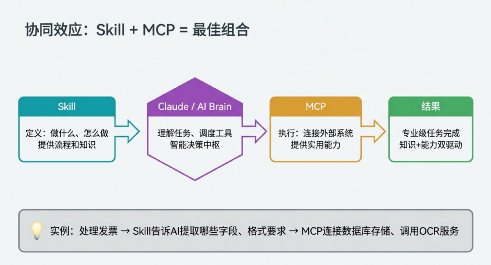
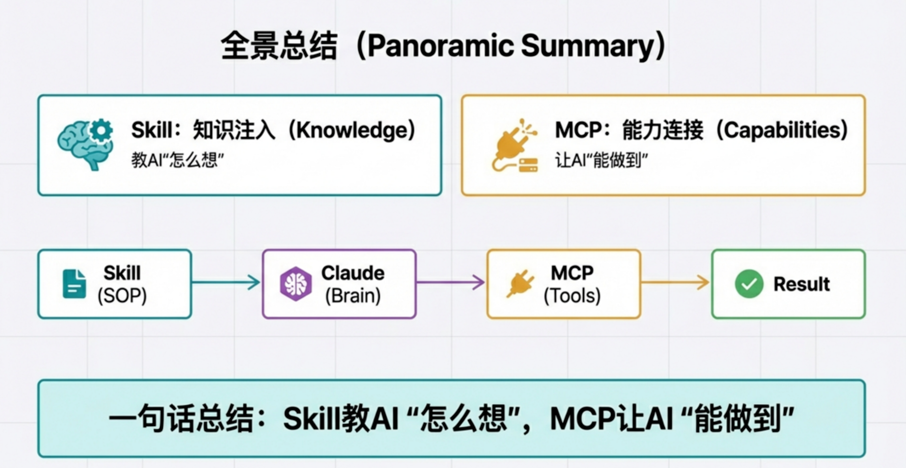
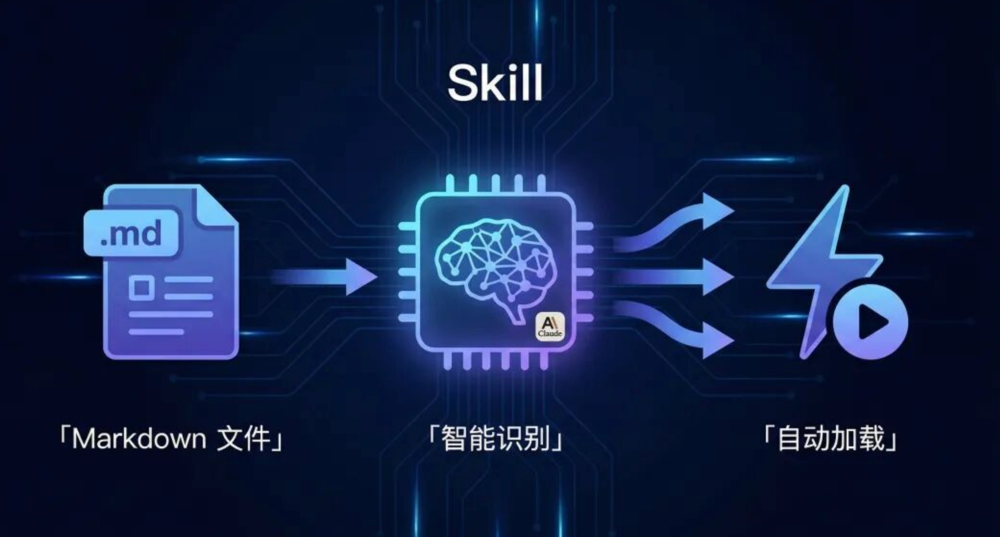
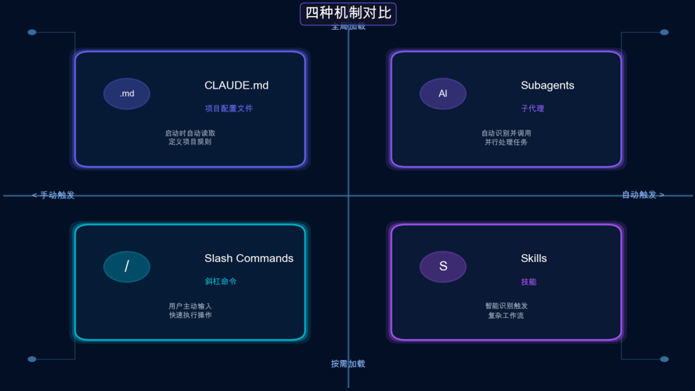

# 使用

## 1 Skills 与 MCP：让 AI Agent 同时拥有“大脑”和“双手”

​	如果你正在构建高级 AI Agent，你可能很快会遇到一个熟悉的场景：无论你的提示工程（Prompt）写得多么精妙，AI 的能力似乎总有一个上限。当任务变得复杂，需要与外部世界进行实时交互时，单纯依靠 Prompt 就像是让一个聪明的实习生赤手空拳地解决所有问题——潜力巨大，但工具和知识都严重不足。

​	要突破这一瓶颈，关键在于理解并运用两种根本不同的 AI 扩展框架：Skill 和 MCP。它们分别赋予了 AI Agent 思考的“大脑”和行动的“双手”。本文将用几个清晰的要点，彻底讲透这两者的区别与联系，帮助你构建一个真正强大的 AI Agent。

### 1.1 最直观的区别—“专业手册” vs “USB-C接口”

​	要理解 Skill 和 MCP，最快的方式就是通过一个直观的类比。


​	Skill 就像是给 AI 一本“专业手册”。 它的本质是向 AI 注入领域知识和标准工作流程（知识注入）。想象一下，你给一个聪明的实习生一本详细的操作手册，告诉他遇到特定问题时应该遵循哪些步骤、参考哪些资料、遵循什么格式。从技术上讲，Skill 是一种 Prompt 扩展，并且是文件系统驱动的，它将结构化的知识和流程“预装”到 AI 的思考过程中。


​	MCP 则像是给 AI 一个“USB-C接口”。 它的本质是让 AI 连接外部工具和数据源（能力连接）。MCP 不会直接教 AI 任何知识，而是给了它一个标准化的接口，让它能够调用无穷无尽的外部能力——就像你的电脑通过 USB-C 接口可以连接显示器、硬盘、网络和各种外设一样。技术上，它基于开放标准，采用经典的客户端-服务器架构，极大地扩展了 AI 的行动边界。


​	简单总结，Skill 是“内部知识化”，它增强了 AI 的内在认知；而 MCP 是“外部工具化”，它扩展了 AI 的外在能力。


### 1.2 最核心的差异—教 AI “怎么想” vs 让 AI “能做到”

​	这两个框架最核心的差异，在于它们作用于 AI 的不同层面。这个区别是构建 AI Agent 的两种不同哲学：是增强其内在认知，还是扩展其外在能力？

<span style="color:#32CD32;font-weight:bold;">**Skill教AI"怎么想"，MCP让AI"能做到"**</span>


理解这个差异的关键在于看具体的例子：

- Skill 的作用是“教 AI 怎么想”。它通过提供专业的知识和固定的流程，来约束和引导 AI 的思考方式。例如，一个用于代码审查的 Skill 可以包含一个详细的检查清单，强制 AI 必须按顺序分析代码的安全性、风格一致性、性能和可维护性，确保审查过程的严谨和全面。

- MCP 的作用是“让 AI 能做到”。它不关心 AI 的思考过程，而是直接赋予 AI 调用工具和数据的实际能力。例如，一个 MCP 可以提供一个名为 commit_to_github(repo, file, message) 的函数，让 AI 在完成代码审查后，拥有将修改建议实际提交到 GitHub 仓库的能力。

理解这个核心差异至关重要，因为它直接决定了你在不同场景下应该选择哪种工具来武装你的 AI Agent。

### 1.3 最意外的对比—“写文档”的简易与“写代码”的强大

​	谈到扩展 AI，很多人会下意识地认为开发门槛一定很高。然而，Skill 和 MCP 在这一点上呈现出巨大的反差，甚至可以说是令人意外。


​	开发 Skill 的体验：**如同“写文档”，难度仅为 ★☆☆。** 你没有看错，开发一个 Skill，开发者只需编写 Markdown 文件即可。你可以把特定的知识、工作流程、输出规范都写在 .md 文件里。这种极低的门槛意味着，团队中的任何人——无论是产品经理、运营还是领域专家——都可以轻松地将知识沉淀下来，并复用给 AI，极大地促进了团队知识库的建设。

​	开发 MCP 的体验：**如同“写代码”，难度为 ★★★。** 相比之下，开发 MCP 则需要进行编程来开发服务器端。这无疑更复杂，需要开发者定义接口、封装工具、部署服务。但这种复杂性换来的是无与伦比的强大能力和扩展边界。

​	开发难度的差异只是冰山一角。两者在本质、数据来源和扩展边界上都有着根本性的不同，下表清晰地展示了它们的全方位对比：

| 对比维度     | Skill (技能)            | MCP (协议)                |
| :----------- | :---------------------- | :------------------------ |
| **本质**     | Prompt模板注入          | 开放通信协议              |
| **作用**     | 教AI怎么做（知识/流程） | 让AI能做什么（工具/数据） |
| **数据来源** | 本地文件系统（静态）    | 外部API/数据库（实时）    |
| **开发难度** | ★☆☆☆ 写Markdown即可     | ★★★★ 需要编程开发Server   |
| **扩展边界** | 仅限AI认知能力增强      | 连接无限外部世界          |

​	这种设计上的权衡，为开发者在不同需求场景下提供了极其灵活的选择。

### 1.4 最理想的组合—当“大脑”指挥“双手”

​	看到这里，你可能会问：Skill 和 MCP 哪个更好？答案是：它们并非竞争关系，而是天生的最佳合作伙伴。

<span style="color:#32CD32;font-weight:bold;">**Skill + MCP = 最佳组合**</span>



​	在一个专业级的 AI Agent 中，这两者协同工作的流程是这样的：

1. Skill（大脑）：负责定义“做什么”和“怎么做”。它为任务提供专业的流程和领域知识。
2. AI 大模型（决策中枢）：例如 Claude，它理解 Skill 提供的上下文和流程，进行智能决策和任务调度。
3. MCP（双手）：负责“执行”。它根据 AI 的指令，连接外部系统，提供实用的工具能力。

​	让我们用一个具体的实例来理解这个过程： 任务：处理一张发票。

1. Skill 告诉 AI：“你需要从发票中提取‘发票号’、‘金额’、‘日期’这三个字段，并且日期格式必须是 YYYY-MM-DD。”

2. AI 理解了这个指令，并知道需要外部工具来完成。

3. MCP 被调用，它连接了外部的 OCR 服务来识别图片中的文字，然后连接数据库将提取出的、符合格式要求的数据存储起来。

​	这种“知识+能力”双驱动的模式，让 AI Agent 不仅想得对（有大脑），更能做得好（有双手），是构建专业级应用的终极形态。

### 1.5 下一步，如何武装你的AI Agent？

​	现在，我们已经清晰地了解了 Skill 和 MCP 的本质。简单回顾一下：要打造一个强大的 AI Agent，我们不仅需要通过 Skill 赋予它专业的知识和思考框架，还需要通过 MCP 给予它连接和改变物理与数字世界的能力。

​	那么，具体到你的应用，应该如何选择呢？这里有一份清晰的行动指南：

#### 1.5.1 选 Skill，当你的需求是：

- 让 AI 按特定方式思考和输出
- 快速上手、无需编程基础
- 进行团队知识沉淀和复用 (例如：沉淀团队专属写作风格、特定领域最佳实践)
- 处理本地文件和标准化任务 (例如：文档处理、代码审查规范、企业内部知识库整合)

#### 1.5.2 **选 MCP，当你的需求是：**

- 让 AI 访问实时数据和外部服务 (例如：调用外部 API 获取实时数据)
- 构建复杂的多工具 Agent
- 进行跨平台、跨系统集成 (例如：连接数据库、集成 GitHub/Slack、打通企业 CRM 系统)
- 部署企业级应用和生产环境



​	现在，你已经了解了 Skill 和 MCP 这两大“超能力”，你将如何设计你的下一个、更强大的 AI 智能体？


## 2 Claude Code Skill 最佳实战

### 2.1 什么是 Skill



​	Skill 是 Claude Code 的一种扩展机制，本质上是一个包含指令的 Markdown 文件。它的特别之处在于：**Claude 会根据对话上下文自动判断是否需要加载这个 Skill**。

​	你不需要每次都告诉 Claude "用某某规范"，只要 Skill 存在，当你说"帮我写 commit message"时，Claude 会自动发现并应用你预设的规范。

​	一个 Skill 文件长这样：

```markdown
---
name: my-skill
description: 这里描述 Skill 的功能和触发时机
---

# Skill 标题

具体的指令内容...
```

​	文件头部的 `name` 和 `description` 是必需的元数据，Claude 会始终读取这部分来判断是否需要加载完整内容。

### 2.2 Skill 的三个核心能力

**1. 自动触发**

​	不像 Slash Command 需要你手动输入 `/command-name`，Skill 是被动触发的。Claude 会根据你的对话内容，自动判断哪些 Skill 与当前任务相关，然后加载它们。

**2. 渐进式加载**

​	Skill 采用三级加载架构：

- 元数据（name + description）始终加载，大约 100 tokens
- 主体指令在触发时加载，建议控制在 5000 tokens 以内
- 附带的脚本、模板等资源按需加载

这意味着你可以创建很多 Skill，但只有真正用到的才会消耗上下文窗口。

**3. 可复用**

​	一次创建，永久生效。放在 `~/.claude/skills/` 目录下的 Skill 对所有项目生效，放在项目的 `.claude/skills/` 目录下则只对当前项目生效。

### 2.3 Skill 和其他机制有什么区别



Claude Code 有好几种扩展机制，初看容易混淆：

| 机制               | 加载时机       | 典型用途             |
| :----------------- | :------------- | :------------------- |
| **CLAUDE.md**      | 每次对话都加载 | 项目约定、编码规范   |
| **Slash Commands** | 手动输入触发   | 固定流程，如 /commit |
| **Skills**         | 自动按需触发   | 领域专业知识         |
| **Subagents**      | 调用时启动     | 委托独立子任务       |

简单说：

- **CLAUDE.md** 是**始终生效的规则**
- **Commands** 是**我要你现在做这件事**
- **Skills** 是**当遇到这类问题时，用这套方法**

举个例子：你可以在 CLAUDE.md 里写**本项目使用 TypeScript**，创建一个 `/deploy` Command 来执行部署流程，再创建一个 `api-design` Skill 来指导 API 设计规范。

### 2.4 动手实践：创建你的第一个 Skill

​	说了这么多，不如直接上手。我们来创建一个 Git Commit Message 规范化的 Skill。

**第一步：创建目录**

```bash
$ mkdir -p ~/.claude/skills/commit-message
```

**第二步：创建 Skill 文件**

在 `~/.claude/skills/commit-message/` 目录下创建 `SKILL.md` 文件：

```markdown
---
name: commit-message
description: 生成规范的 Git commit message。当用户请求编写提交信息、commit message、或完成代码修改准备提交时自动触发。
---

# Git Commit Message 规范

## 格式要求

遵循 Conventional Commits 规范，格式如下：

<type>(<scope>): <subject>

<body>

## Type 类型

- feat: 新功能
- fix: Bug 修复
- docs: 文档更新
- style: 代码格式调整（不影响逻辑）
- refactor: 重构（既不是新功能也不是修复）
- perf: 性能优化
- test: 测试相关
- chore: 构建过程或辅助工具变动

## 规则

1. subject 使用中文，不超过 50 字
2. subject 不要以句号结尾
3. scope 用英文小写，表示影响范围（如 auth、api、ui）
4. body 部分可选，用于解释 why 而不是 what
5. 如果有 Breaking Change，必须在 body 中说明

## 示例

feat(auth): 添加微信扫码登录功能

fix(api): 修复用户列表分页参数错误

refactor(utils): 重构日期格式化工具函数

提取公共逻辑，支持更多日期格式
```

**第三步：测试效果**

打开 Claude Code，随便改点代码，然后说：

**帮我写个 commit message**

你会发现 Claude 自动按照你定义的规范生成了提交信息——中文描述、Conventional Commits 格式、带 scope。

不需要每次都重复说明要求，Skill 会自动生效。

### 2.5 什么时候该创建 Skill

一个简单的判断标准：**当你发现自己向 Claude 解释同一件事超过 3 次，就该考虑创建 Skill 了**。

适合创建 Skill 的场景：

- 团队有固定的代码规范或文档标准
- 某类任务有特定的处理流程
- 需要 Claude 记住某个领域的专业知识

不适合创建 Skill 的场景：

- 一次性任务
- 每次上下文都不一样
- 还在摸索最佳实践，流程不稳定


