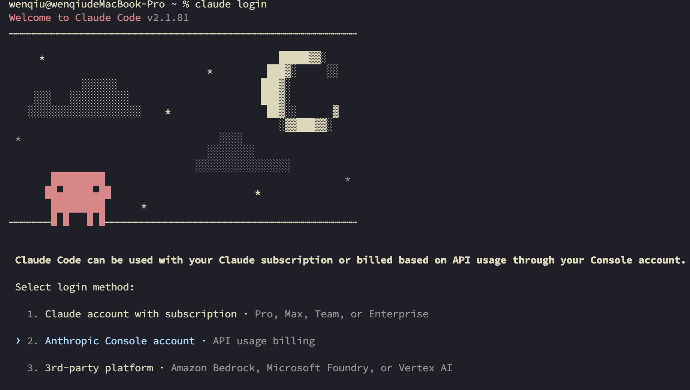
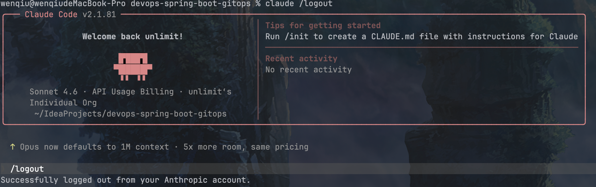
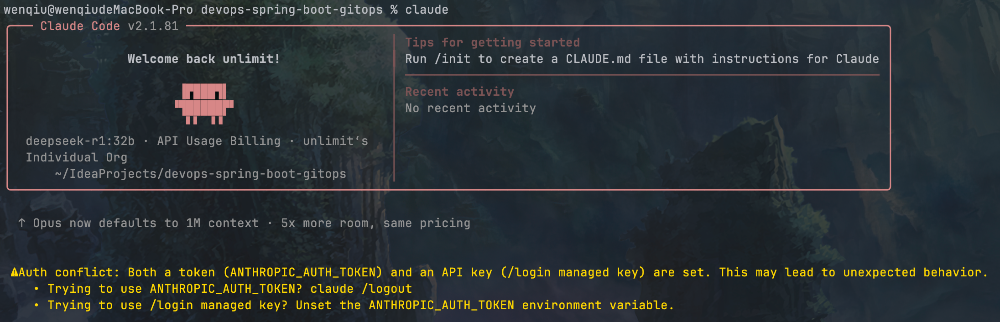

https://www.anthropic.com/

https://code.claude.com/docs/en/quickstart

## 0 前置条件

### 0.1 Node

需要Node20+

### 0.2 Git

需要安装Git命令

## 1 安装claude code

安装和配置 Claude Code 非常简单，详细步骤请参考官方文档：

https://docs.anthropic.com/zh-CN/docs/claude-code/setup

### 1.1 安装

```bash
$ brew install --cask claude-code
```

```bash
==> Fetching downloads for: claude-code
✔︎ Cask claude-code (2.1.81)                                                                                                                                                               Verified    193.3MB/193.3MB
==> Caveats
This cask tracks the stable release channel. In-app update notifications
default to the latest channel regardless. To align notifications with this
cask, set the auto-update channel to "stable" via /config or in
~/.claude/settings.json:
  https://code.claude.com/docs/en/setup#configure-release-channel

==> Installing Cask claude-code
==> Linking Binary 'claude' to '/opt/homebrew/bin/claude'
🍺  claude-code was successfully installed!
```

### 1.2 登录

```bash
$ node --version
v20.19.5
$ claude --version
2.1.81 (Claude Code)
# 首次需要登录
$ claude login
```



```bash
# 非首次使用
$ claude
```

### 1.3 使用其他模型
- 先退出claude（若已经claude login）

<span style="color:red;font-weight:bold;">在配置之前就先退出claude登录</span>



<span style="color:red;font-weight:bold;">否则无法启动</span>



- 使用ollama本地模型

```bash
$ cat ~/.claude/settings.json 
{
  "env": {
    "ANTHROPIC_BASE_URL": "http://127.0.0.1:11434",
    "ANTHROPIC_MODEL": "qwen3.6:35b-a3b-coding-mxfp8",
    "CLAUDE_CODE_SUBAGENT_MODEL": "若不配置，默认使用HAIKU模型"
    "ANTHROPIC_MODEL": "qwen3.6:35b-a3b-coding-mxfp8",
    "ANTHROPIC_DEFAULT_OPUS_MODEL": "qwen3.6:35b-a3b-coding-mxfp8",
    "ANTHROPIC_DEFAULT_SONNET_MODEL": "qwen3.6:35b-a3b-coding-mxfp8",
    "ANTHROPIC_DEFAULT_HAIKU_MODEL": "qwen3.6:35b-a3b-coding-mxfp8",
    "API_TIMEOUT_MS": "3000000",
    "CLAUDE_CODE_DISABLE_NONESSENTIAL_TRAFFIC": "1",
    "CLAUDE_CODE_ATTRIBUTION_HEADER": "0",
    "CLAUDE_CODE_DISABLE_FEEDBACK_SURVEY": "1",
    "DISABLE_TELEMETRY": "1",
    "CLAUDE_CODE_EFFORT_LEVEL": "max"
  },
  "hooks": {},
  "enabledPlugins": {
    "superpowers@superpowers-marketplace": true
  },
  "extraKnownMarketplaces": {
    "claude-community": {
      "source": {
        "source": "github",
        "repo": "anthropics/claude-plugins-community"
      }
    },
    "thedotmack": {
      "source": {
        "source": "github",
        "repo": "thedotmack/claude-mem"
      }
    },
    "claude-plugins-official": {
      "source": {
        "source": "github",
        "repo": "anthropics/claude-plugins-official"
      }
    },
    "superpowers-marketplace": {
      "source": {
        "source": "github",
        "repo": "obra/superpowers-marketplace"
      }
    }
  },
  "skipDangerousModePermissionPrompt": true,
  "skipAutoPermissionPrompt": true,
  "language": "中文"
}
```

- 查看工具兼容性

```bash
$ curl http://localhost:11434/api/show -d '{"name": "qwen3.6:35b-a3b-coding-mxfp8"}' | jq '.capabilities'
  % Total    % Received % Xferd  Average Speed   Time    Time     Time  Current
                                 Dload  Upload   Total   Spent    Left  Speed
100 24288    0 24248  100    40   276k    467 --:--:-- --:--:-- --:--:--  279k
[
  "completion",
  "vision",
  "thinking",
  "tools"
]
```

- Claude Code 环境变量的完整参数说明表格：

| 参数名称                                   | 作用                     | 你的配置                 | 推荐值                     | 优先级       |
| :----------------------------------------- | :----------------------- | :----------------------- | :------------------------- | :----------- |
| `ANTHROPIC_BASE_URL`                       | API 服务端点地址         | `http://localhost:11434` | Ollama 本地地址            | ⭐⭐⭐ 必需     |
| `ANTHROPIC_AUTH_TOKEN`                     | API 认证令牌             | `ollama`                 | `ollama`                   | ⭐⭐⭐ 必需     |
| `ANTHROPIC_MODEL`                          | 默认使用的模型名称       | `gemma4:31b`             | `gemma4:26b`               | ⭐⭐⭐ 必需     |
| `CLAUDE_CODE_DISABLE_NONESSENTIAL_TRAFFIC` | 禁用非必要网络流量       | 未设置                   | `1`                        | ⭐⭐⭐ 强烈推荐 |
| `DISABLE_TELEMETRY`                        | 禁用遥测数据收集         | 未设置                   | `1`                        | ⭐⭐ 推荐      |
| `CLAUDE_CODE_DISABLE_FEEDBACK_SURVEY`      | 禁用反馈调查弹窗         | 未设置                   | `1`                        | ⭐⭐ 推荐      |
| `DISABLE_ERROR_REPORTING`                  | 禁用错误报告             | 未设置                   | `1`                        | ⭐ 可选       |
| `ANTHROPIC_DEFAULT_SONNET_MODEL`           | 复杂推理任务模型         | 未设置                   | 默认使用 `ANTHROPIC_MODEL` | ⭐ 可选       |
| `ANTHROPIC_DEFAULT_HAIKU_MODEL`            | 简单快速任务模型         | 未设置                   | 默认使用 `ANTHROPIC_MODEL` | ⭐ 可选       |
| `ANTHROPIC_SMALL_FAST_MODEL`               | 简单任务模型（兼容旧版） | 未设置                   | 默认使用 `ANTHROPIC_MODEL` | ⭐ 可选       |

### 1.4 claude 命令

- 帮助

```bash
$ claude --help
```

- 非交互式输出，运行一次就退出

```bash
$ claude -p 请说出你最喜欢的一首歌曲
```

- 继续最近的对话

```bash
$ claude -c
```

- 指定模型（仅限Claude官方模型，作用不大）

```bash
$ claude --model
```

- 恢复历史会话

```bash
$ claude -r
```

- 导出结构化结果

```bash
$ claude -p 你最喜欢什么颜色 --output-format json
```

### 1.5 内置 Slash 命令列表

| 命令              | 说明                                              | 使用频率             |
| :---------------- | :------------------------------------------------ | :------------------- |
| `/help`           | 显示所有可用命令和快捷键                          | ⭐⭐⭐⭐⭐ 最高           |
| `/clear`          | 清除当前对话历史，完全重置上下文                  | ⭐⭐⭐⭐⭐ 最高           |
| `/compact`        | 智能压缩对话历史，保留关键信息，释放 50-70% token | ⭐⭐⭐⭐⭐ 最高           |
| `/context`        | 显示当前上下文使用情况（token 用量、已加载文件）  | ⭐⭐⭐⭐ 高              |
| `/cost`           | 显示当前会话的 token 消耗和预估费用               | ⭐⭐⭐⭐ 高              |
| `/model`          | 切换 AI 模型（Opus/Sonnet/Haiku）                 | ⭐⭐⭐⭐ 高              |
| `/memory`         | 编辑 CLAUDE.md 持久记忆文件                       | ⭐⭐⭐⭐ 高              |
| `/init`           | 初始化项目，自动生成 CLAUDE.md 文件               | ⭐⭐⭐ 中（每项目一次） |
| `/config`         | 打开设置界面，修改权限、主题等配置                | ⭐⭐⭐ 中               |
| `/rewind`         | 撤销上次操作，恢复文件和对话状态                  | ⭐⭐⭐ 中               |
| `/resume`         | 恢复之前的会话                                    | ⭐⭐⭐ 中               |
| `/doctor`         | 检查安装健康状态，诊断配置问题                    | ⭐⭐ 低（按需）        |
| `/login`          | 登录 Anthropic 账号                               | ⭐⭐ 低（偶尔）        |
| `/logout`         | 退出当前账号                                      | ⭐ 极低               |
| `/status`         | 显示当前会话状态                                  | ⭐ 极低               |
| `/rename`         | 重命名当前会话                                    | ⭐ 极低               |
| `/fork`           | 从当前对话状态创建新会话                          | ⭐ 极低               |
| `/add-dir`        | 添加额外工作目录（适用于 monorepo）               | ⭐ 极低               |
| `/copy`           | 复制回复内容                                      | ⭐ 极低               |
| `/mcp`            | 管理 MCP 服务器连接                               | ⭐ 极低               |
| `/agents`         | 管理自定义子代理                                  | ⭐ 极低               |
| `/permissions`    | 查看或更新权限设置                                | ⭐ 极低               |
| `/bug`            | 向 Claude Code 团队报告问题                       | ⭐ 极低               |
| `/stats`          | 显示详细会话统计信息                              | ⭐ 极低               |
| `/voice`          | 切换语音输入模式                                  | ⭐ 极低               |
| `/reload-plugins` | 重新加载插件                                      | ⭐ 极低               |

## 2 安装 cc-switch

https://github.com/farion1231/cc-switch/blob/main/README_ZH.md

```bash
$ brew tap farion1231/ccswitch
$ brew install --cask cc-switch
```

## 3 安装 [claude code router](https://github.com/musistudio/claude-code-router)【鸡肋】

<span style="color:red;font-weight:bold;">请确保已经安装Claude Code</span>

### 3.0 常用命令

| 命令            | 类别     | 说明                                            | 示例                          |
| :-------------- | :------- | :---------------------------------------------- | :---------------------------- |
| `ccr start`     | 服务管理 | 启动后台服务                                    | `ccr start`                   |
| `ccr stop`      | 服务管理 | 停止后台服务                                    | `ccr stop`                    |
| `ccr restart`   | 服务管理 | 重启后台服务                                    | `ccr restart`                 |
| `ccr status`    | 服务管理 | 查看服务运行状态及配置                          | `ccr status`                  |
| `ccr code`      | 核心功能 | 启动Claude Code交互界面，如服务未运行则自动启动 | `ccr code`                    |
| `ccr ui`        | 核心功能 | 在浏览器中打开Web管理界面                       | `ccr ui`                      |
| `ccr model`     | 核心功能 | 交互式选择和配置模型                            | `ccr model`                   |
| `ccr activate`  | 配置集成 | 输出环境变量配置语句，用于Shell集成             | `eval "$(ccr activate)"`      |
| `ccr preset`    | 配置集成 | 管理配置预设（导出、安装、删除等）              | `ccr preset export my-config` |
| `ccr install`   | 配置集成 | 从GitHub市场安装配置预设                        | `ccr install my-preset`       |
| `ccr --version` | 辅助功能 | 查看当前版本信息                                | `ccr --version`               |
| `ccr --help`    | 辅助功能 | 查看帮助信息                                    | `ccr --help`                  |

### 3.1 安装

```bash
$ brew install claude-code-router
```

### 3.2 配置

#### 3.2.1 配置`~/.claude-code-router/config.json`

创建并配置您的 `~/.claude-code-router/config.json` 文件。更多详情，请参阅 `config.example.json` 。

- 配置

```json
{
  "LOG": true,
  "LOG_LEVEL": "INFO",
  "CLAUDE_PATH": "",
  "HOST": "127.0.0.1",
  "PORT": 3456,
  "APIKEY": "",
  "API_TIMEOUT_MS": "600000",
  "PROXY_URL": "",
  "transformers": [],
  "Providers": [
    {
      "name": "ollama",
      "api_base_url": "http://localhost:11434/v1/chat/completions",
      "api_key": "ollama",
      "models": [
        "qwen3.6:35b-a3b-mlx-bf16",
        "qwen3-vl:8b",
        "qwen3.6:35b-a3b-coding-mxfp8"
      ],
      "transformer": {
        "use": [
          "ollama"
        ]
      }
    },
    {
      "name": "deepseek",
      "api_base_url": "https://api.deepseek.com/chat/completions",
      "api_key": "${DEEPSEEK_API_KEY}",
      "models": [
        "deepseek-v4-flash",
        "deepseek-v4-pro"
      ],
      "transformer": {
        "use": [
          "deepseek"
        ],
        "deepseek-v4-flash": {
          "use": [
            "deepseek"
          ]
        },
        "deepseek-v4-pro": {
          "use": [
            "deepseek"
          ]
        }
      }
    },
    {
      "name": "lmstudio",
      "api_base_url": "http://localhost:1234/v1/chat/completions",
      "api_key": "lmstudio",
      "models": [
        "google/gemma-4-e4b"
      ]
    }
  ],
  "StatusLine": {
    "enabled": false,
    "currentStyle": "default",
    "default": {
      "modules": []
    },
    "powerline": {
      "modules": []
    }
  },
  "Router": {
    "default": "ollama,qwen3.6:35b-a3b-coding-mxfp8",
    "background": "ollama,qwen3.6:35b-a3b-coding-mxfp8",
    "think": "ollama,qwen3.6:35b-a3b-coding-mxfp8",
    "longContext": "deepseek,deepseek-v4-flash",
    "longContextThreshold": 100000,
    "webSearch": "deepseek,deepseek-v4-flash",
    "image": "ollama,qwen3-vl:8b"
  },
  "CUSTOM_ROUTER_PATH": "/Users/wenqiu/.claude-code-router/custom-router.js"
}
```

#### 3.2.2 路由脚本`~/.claude-code-router/custom-router.js`

利用 `CUSTOM_ROUTER_PATH` 拦截输入文本，实现别名翻译

```javascript
module.exports = async function router(req, config) {
    const userMessage = req.body.messages.find(m => m.role === 'user')?.content;

    if (userMessage && userMessage.includes('use ollama qwen')) {
      	console.log('========>使用最快本地大模型')
        return 'ollama,qwen3.6:35b-a3b-mlx-bf16';
    }

    return null; // 使用默认路由
};
```

在你的 `~/.claude-code-router/config.json` 中设置路径：

```json
{
  "CUSTOM_ROUTER_PATH": "/Users/wenqiu/.claude-code-router/custom-router.js"
}
```

### 3.3 **⚙️ 核心配置属性**

| 属性名                     | 是否必填     | 说明                                                         |
| :------------------------- | :----------- | :----------------------------------------------------------- |
| **`PROXY_URL`**            | 可选         | 设置代理服务器地址，例如 `"http://127.0.0.1:7890"`。         |
| **`LOG`**                  | 可选         | 是否启用日志记录。`true` 为启用，`false` 则完全不生成日志文件。默认值为 `true`。 |
| **`LOG_LEVEL`**            | 可选         | 设置日志的详细级别。可选值：`"fatal"`、`"error"`、`"warn"`、`"info"`、`"debug"`、`"trace"`。默认值为 `"debug"`。 |
| **`APIKEY`**               | 可选         | 设置一个用于请求认证的密钥。设置后，客户端必须在请求头中包含 `Authorization: Bearer your-secret-key` 或 `x-api-key: your-secret-key`。 |
| **`HOST`**                 | 可选         | 设置服务监听的地址。**安全警告**：如果未设置 `APIKEY`，此地址会被强制设为 `127.0.0.1` 以防止未授权访问。例如，允许外部访问可设为 `"0.0.0.0"`。 |
| **`NON_INTERACTIVE_MODE`** | 可选         | 是否启用非交互模式。设为 `true` 时，兼容 GitHub Actions、Docker 等 CI/CD 自动化环境，会设置 `CI=true` 等环境变量，并处理标准输入以防进程挂起。 |
| **`API_TIMEOUT_MS`**       | **建议设置** | 指定调用模型 API 的超时时间（**毫秒**）。文档示例中设为 `600000`（即 10 分钟）。 |
| **`CUSTOM_ROUTER_PATH`**   | 可选         | 指定一个自定义路由脚本的绝对路径。该脚本可编写更复杂的请求路由逻辑。 |

### 3.4 **📦 核心模块配置**

| 属性名             | 说明                                                         |
| :----------------- | :----------------------------------------------------------- |
| **`Providers`**    | **（核心）** 用于**定义和配置一个或多个模型供应商**。它是一个数组，每个对象需包含 `name`（唯一名称）、`api_base_url`（API 地址）、`api_key`、`models`（模型列表）及可选的 `transformer`。 |
| **`Router`**       | **（核心）** 用于**设置不同任务场景下的路由规则**。可定义 `default`（默认模型）、`background`（后台任务）、`think`（深度推理）、`longContext`（长上下文）、`webSearch`（联网搜索）、`image`（图像处理，测试版）等场景对应的 `"提供商,模型名"`。 |
| **`transformers`** | 可选。用于加载**自定义的转换器（Transformer）**。它是一个数组，每个对象需包含 `path`（自定义脚本路径）和可选的 `options`（传给脚本的参数）。 |

### 3.5 **🔧 `Providers` 中 `transformer` 的详细配置**

转换器用于适配不同厂商 API 的请求和响应格式，可在 Provider 级别或模型级别配置。

| 配置方式           | 说明与示例                                                   |
| :----------------- | :----------------------------------------------------------- |
| **全局转换器**     | 应用于该提供商下的所有模型。                                 |
| **模型特定转换器** | 仅应用于指定的单个模型。                                     |
| **带参数的转换器** | 有些转换器（如 `maxtoken`）可接受参数，需用 `["转换器名", {参数对象}]` 格式。 |

**内置转换器列表**：

- `Anthropic`：保持原始参数，用于直连 Anthropic 端点。
- `deepseek`、`gemini`、`openrouter`、`groq`：适配对应厂商的 API。
- `maxtoken`：设置最大 token 数（如 `["maxtoken", {"max_tokens": 16384}]`）。
- `tooluse`：优化某些模型的工具调用。
- `enhancetool`：增强工具调用参数的容错性（注意：会使工具调用信息不再流式输出）。
- `reasoning`、`sampling`、`cleancache`、`vertex-gemini` 等。

### 3.6 **🧭 `Router` 中的路由场景**

| 路由键                     | 用途                                                         |
| :------------------------- | :----------------------------------------------------------- |
| **`default`**              | **（必须）** 默认模型，用于处理所有未匹配其他路由规则的通用任务。 |
| **`background`**           | 用于处理后台任务，可配置成本更低的小模型以节省费用。         |
| **`think`**                | 用于需要深度推理的任务（如 Plan Mode）。                     |
| **`longContext`**          | 用于处理长上下文任务（默认阈值 **60,000 token**）。          |
| **`longContextThreshold`** | 可选。触发 `longContext` 模型的 Token 数量阈值，默认值为 `60000`。 |
| **`webSearch`**            | 用于处理需要联网搜索的任务（要求模型本身支持此功能）。       |
| **`image`** (测试版)       | 用于处理图像相关任务（由 CCR 内置 Agent 处理）。若模型不支持工具调用，需额外设置 `config.forceUseImageAgent` 为 `true`。 |

### 3.7 使用路由器运行 Claude 代码

使用路由器启动 Claude Code：

```bash
$ ccr code
```

> **注意** ：修改配置文件后，需要重启服务才能使更改生效：
>
> ```bash
> $ ccr restart
> ```

### 3.8 用户界面模式

为了获得更直观的体验，您可以使用用户界面模式来管理您的配置：

```bash
$ ccr ui
```

这将打开一个基于 Web 的界面，您可以在其中轻松查看和编辑您的 `config.json` 文件。

### 3.9 模型管理

对于喜欢基于终端的工作流程的用户，可以使用交互式 CLI 模型选择器：

```bash
$ ccr model
```

此命令提供交互式界面，用于：

- 查看当前配置

- 查看所有已配置的模型（默认、背景、思考、长上下文、网络搜索、图像）
- 切换型号：快速更改每种路由器类型所使用的型号
- 添加新模型：向现有提供商添加模型
- 创建新的服务提供商：设置完整的服务提供商配置，包括：
  - 提供商名称和 API 端点
  - API 密钥
  - 可选型号
  - 支持以下功能的 Transformer 配置：
    - 多个转换器（openrouter、deepseek、gemini 等）
    - 转换器选项（例如，具有自定义限制的最大令牌）
    - 提供商特定的路由（例如，OpenRouter 提供商首选项）


CLI 工具会验证所有输入，并提供有用的提示来指导您完成配置过程，从而可以轻松管理复杂的设置，而无需手动编辑 JSON 文件。

## 4 安装ccusage监控消耗多少token

```bash
$ brew install ccusage
```


## 5 Ollama

### 5.1 安装

https://ollama.com/

- 安装

```bash
$ curl -fsSL https://ollama.com/install.sh | sh
```

- 默认配置

```bash
$  cat ~/.ollama/config.json 
{
  "integrations": {},
  "last_selection": "run"
}
```

- 设置并发与保持时间

```bash
# 1. 设置并发请求数量为 4
launchctl setenv OLLAMA_NUM_PARALLEL "4"
# 2. 设置模型在内存中的保持时间为 30 分钟
launchctl setenv OLLAMA_KEEP_ALIVE "30m"
# 3. Flash Attention——启用内存高效的注意力机制
launchctl setenv OLLAMA_FLASH_ATTENTION "1"
# 4. KV Cache 类型——在 Apple Silicon 上选合适的量化类型                                                      
launchctl setenv OLLAMA_KV_CACHE_TYPE "q8_0"
# 5. MMap 和 MLock——如果你内存足够（32GB+）
launchctl setenv OLLAMA_MMAP "true"
# 防止内存被 swap 到磁盘，仅当 RAM >= 32GB 时使用
launchctl setenv OLLAMA_MLOCK "true"
# 6. 设置最大队列长度（你当前是512，足够）
#launchctl setenv OLLAMA_MAX_QUEUE "512"
# 7.调整上下文长度
#launchctl setenv OLLAMA_CONTEXT_LENGTH "131072"

# 或者一次性列出所有 Ollama 相关的
ps aux | grep -i ollama | grep -v grep | awk '{print $2}' | head -1 | xargs -I {} ps e -p {} | tr ' ' '\n' | grep OLLAMA
```

### 5.2 编程测试

#### 测试1：综合能力 ⭐⭐⭐⭐⭐

```bash
ollama run gemma4:26b --verbose "用Python实现一个支持并发、带TTL过期机制的线程安全缓存，包含get/set/delete/cleanup方法，并给出单元测试"
```

**覆盖**：数据结构、并发、算法、代码组织、测试

------

#### 测试2：算法优化 ⭐⭐⭐⭐

```bash
ollama run gemma4:26b --verbose "实现一个Top K频繁元素算法（LeetCode 347），分别用堆和快速选择实现，对比时间和空间复杂度"
```

**覆盖**：算法理解、多种实现、复杂度分析

------

#### 测试3：系统设计 ⭐⭐⭐⭐

```bash
ollama run gemma4:26b --verbose "设计一个URL短链接服务，包括数据库schema、核心算法、冲突处理、缓存策略，用Python伪代码实现"
```

**覆盖**：系统设计、数据库、算法、架构

## 6 LM Studio

https://lmstudio.ai/

- 安装

```bash
$ curl -fsSL https://lmstudio.ai/install.sh | bash
```

- 测试

```bash
$ time curl http://localhost:1234/v1/chat/completions \
  -H "Content-Type: application/json" \
  -d '{
    "model": "qwen3.6-27b-mlx",
    "messages": [{"role": "user", "content": "实现一个Top K频繁元素算法"}],
    "stream": false,
    "max_tokens": 131072
  }'
```

## 7 everything-claude-code

https://ecc.tools/

https://github.com/affaan-m/everything-claude-code/blob/main/README.zh-CN.md


