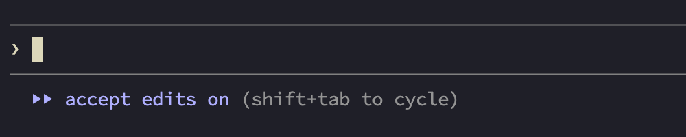
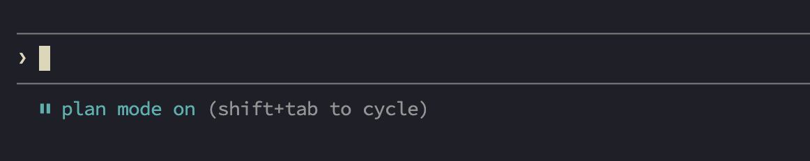
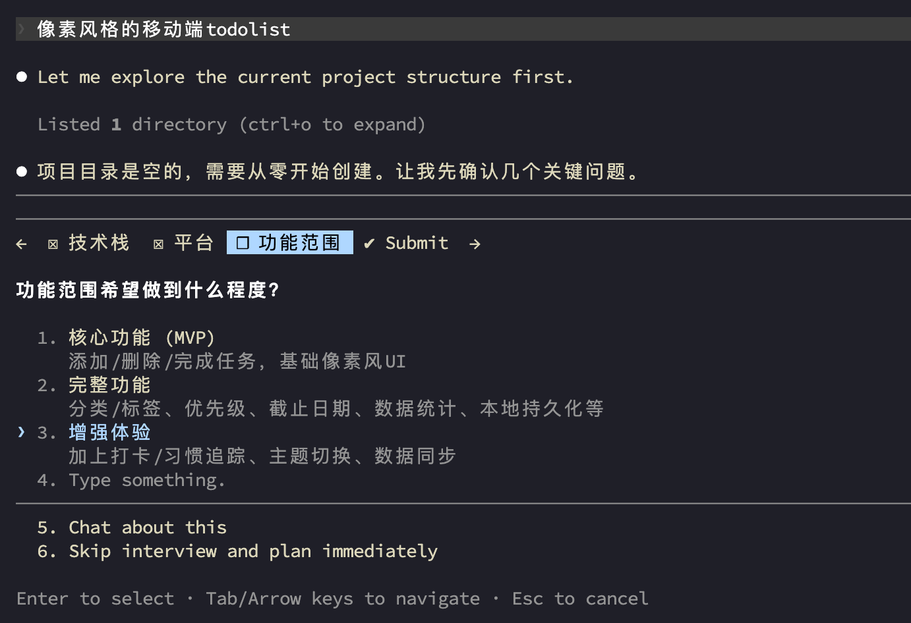

# 从入门到精通

## 1 模型配置

Claude Code 支持多种模型，选择合适的模型直接影响任务质量、速度和成本。配置模型有四层优先级：

| 优先级 | 方式 | 生效范围 |
|--------|------|----------|
| 1（最高） | `/model` 会话内切换 或 `--model` 启动参数 | 当前会话 |
| 2 | `settings.json` 的 `model` 字段 | 持续生效 |
| 3 | `ANTHROPIC_MODEL` 环境变量 | 所有会话 |
| 4（最低） | 账号默认模型 | 所有会话 |

### 1.1 模型别名体系

CC 用简短别名代替完整的模型 ID，方便记忆和输入：

| 别名 | 解析为 | 适用场景 |
|------|--------|----------|
| `sonnet` | 最新 Sonnet 版本 | 日常编码（推荐） |
| `opus` | 最新 Opus 版本 | 复杂推理、架构设计 |
| `haiku` | 最新 Haiku 版本 | 快速简单任务、子代理 |
| `fast` | 当前模型的快速版（如 Opus fast mode） | 需要深度但不想等太久 |
| `default` | 账号类型对应的推荐模型 | 回到默认 |
| `sonnet[1m]` | Sonnet + 1M token 上下文 | 超大上下文场景 |
| `opus[1m]` | Opus + 1M token 上下文 | 超大上下文 + 复杂推理 |
| `opusplan` | Plan 模式用 Opus，执行用 Sonnet | 先思考后动手 |

### 1.2 四种设置方式

**方式一：`/model` 命令（最快捷）**

在 CC 会话中直接输入 `/model`，弹出交互式模型选择器，选择后立即生效。

**方式二：`--model` 启动参数**

```bash
claude --model opus          # 本次会话使用 Opus
claude --model sonnet        # 本次会话使用 Sonnet
claude --model haiku         # 本次会话使用 Haiku
```

**方式三：环境变量**

```bash
# 设置默认模型为 Sonnet
export ANTHROPIC_MODEL="sonnet"

# 固定别名解析到特定版本（企业常用）
export ANTHROPIC_DEFAULT_OPUS_MODEL="us.anthropic.claude-opus-4-7"
export ANTHROPIC_DEFAULT_SONNET_MODEL="claude-sonnet-4-6"
```

**方式四：settings.json**

```json
{
  "model": "sonnet",
  "availableModels": ["sonnet", "haiku"]
}
```

`availableModels` 用于限制 `/model` 选择器中的可选模型，企业管理员常用。

### 1.3 核心环境变量

Claude Code 通过环境变量控制 API 连接和认证，支持接入第三方 API 网关或兼容端点。

| 变量 | 用途 | 示例 |
|------|------|------|
| `ANTHROPIC_BASE_URL` | 覆盖 API 端点，用于代理或网关 | `https://your-gateway.example.com` |
| `ANTHROPIC_AUTH_TOKEN` | 自定义 Authorization 头（以 `Bearer ` 为前缀） | `sk-xxxxxxxx` |
| `ANTHROPIC_API_KEY` | 作为 `X-Api-Key` 头发送，设置后**替代** Claude 订阅账户 | `sk-ant-xxx` |

> **注意**：`ANTHROPIC_AUTH_TOKEN` 和 `ANTHROPIC_API_KEY` 同时设置会冲突，二选一。

**配置方式一：settings.json（推荐）**

```json
{
  "env": {
    "ANTHROPIC_BASE_URL": "https://your-gateway.example.com",
    "ANTHROPIC_AUTH_TOKEN": "sk-xxxxxxxx",
    "ANTHROPIC_MODEL": "sonnet"
  }
}
```

settings.json 中的 `env` 字段优先级高于 shell 环境变量。

**配置方式二：Shell 环境变量**

```bash
export ANTHROPIC_BASE_URL="https://your-proxy.com"
export ANTHROPIC_AUTH_TOKEN="your-token"
```

### 1.4 第三方 Provider 接入

**OpenRouter（免费云端模型）**：

```bash
export ANTHROPIC_BASE_URL="https://openrouter.ai/api"
export ANTHROPIC_AUTH_TOKEN="sk-or-v1-your-key"
export ANTHROPIC_MODEL="anthropic/claude-sonnet-4-6"
```

**Ollama（完全本地/离线）**：

```bash
ollama pull qwen3-coder
export ANTHROPIC_BASE_URL="http://localhost:11434"
export ANTHROPIC_AUTH_TOKEN="ollama"
claude --model qwen3-coder
```

### 1.5 配置优先级链

```
命令行参数（--model opus）          ← 最高
    ↓
settings.local.json                ← 个人项目本地覆盖
    ↓
settings.json                      ← 项目级 / 用户级
    ↓
Shell 环境变量                      ← 全局 fallback
    ↓
账号默认                            ← 最低
```

**多账号切换**：

```bash
alias claude-work='CLAUDE_CONFIG_DIR=~/.claude-work claude'
alias claude-personal='CLAUDE_CONFIG_DIR=~/.claude-personal claude'
```
## 2 模式切换

Claude Code 有 5 种权限模式，理解它们的区别是用好 CC 的基础。

### 2.1 五种模式速查

| 模式 | 启动参数 | 行为 |
|------|----------|------|
| **default**（默认） | `claude` | 每次文件写入、Bash 命令都弹确认框 |
| **acceptEdits** | `claude --permission-mode acceptEdits` | 自动接受文件编辑 + 工作目录内常见命令，其他操作仍确认 |
| **auto** | `claude --permission-mode auto` | 后台分类器自动判断是否安全，只拦截高风险操作 |
| **plan** | `claude --permission-mode plan` | 只读模式：只能读文件、搜索、分析，禁止任何编辑和执行 |
| **bypassPermissions** | `claude --dangerously-skip-permissions` | 跳过所有检查，Claude 完全自主 |

`--dangerously-skip-permissions` 有两个变体，经常被混淆：

```bash
# 变体1：启动时先正常确认，但允许会话中后续开启全权限
claude --allow-dangerously-skip-permissions
# 会话中使用 /permissions 或按 Shift+Tab 三次切换到 bypassPermissions

# 变体2：直接以全权限启动，任何时候都跳过确认
claude --dangerously-skip-permissions
```

**区别**：`--allow-` 是"允许但不默认开启"，进入会话后仍需要手动切换。`--dangerously-` 是"直接开启"，没有任何确认。本地开发用 `--allow-` 更安全，只在 Docker/CI 中用 `--dangerously-`。



### 2.2 会话内快捷键切换

- 按 `Shift+Tab` **一次**：切换到 **acceptEdits** 模式（自动编辑）
- 按 `Shift+Tab` **两次**：切换到 **plan** 模式（先规划，如上图）
- 按 `Shift+Tab` **三次**：切换到 **bypassPermissions** 模式（需 `--allow-dangerously-skip-permissions` 启动）
- 再按一次：切回默认模式

快捷键在 default → acceptEdits → plan → bypassPermissions 之间轮换（bypassPermissions 仅当启动时加了 `--allow-dangerously-skip-permissions` 才会出现在轮换中）。auto 模式通过启动参数或 `/permissions` 命令设置。

### 2.3 什么场景用什么模式

```bash
# 新项目、不确定 Claude 会干什么 — 默认模式，每步确认
claude

# 日常开发、项目已用 git 管理 — 自动编辑，不怕改错
claude --permission-mode acceptEdits

# 需要深度思考、不想被确认框打断 — auto 模式，只拦高风险操作
claude --permission-mode auto

# 只想让 Claude 读代码出方案，别动手 — plan 模式
claude --permission-mode plan

# 日常开发想保留"全权限"选项 — 先正常启动，需要时再切换
claude --allow-dangerously-skip-permissions

# Docker/CI 环境，隔离好了随便跑 — 全权限直接启动
claude --dangerously-skip-permissions
```

### 2.4 实战演示

同一需求 `创建一个 React todolist 应用`：

- **default**：创建 App.tsx 弹确认 → 创建 TodoList.tsx 弹确认 → 安装依赖弹确认... 全程大约被问 8-10 次
- **acceptEdits**：一路创建文件不打断，但 `npm install` 需要确认一次；偶尔改错方向需要中途纠正
- **plan**：先读项目结构，输出组件树和状态管理方案。你觉得方案 OK 后切到 acceptEdits 执行




- **auto**：所有操作自动放行，包括 npm install。中途改错文件，但能快速纠正。效率最高但需要留意 git diff
- **bypassPermissions**：Docker 里跑全流程，从创建项目到运行测试一气呵成

**经验法则**：新项目用 plan 先规划 → acceptEdits 实现 → git 兜底，出错就 `git reset --hard`。

### 2.5 自定义允许命令

除了选择模式，还可以精细控制哪些操作免确认。在 `~/.claude/settings.json`（全局）或 `.claude/settings.local.json`（项目级，不提交 git）中配置。以下是一个兼顾安全与便利的生产级示例：

```json
{
  "permissions": {
    "allow": [
      "Edit",
      "WebSearch",
      "WebFetch(domain:skills.sh)",
      "Bash(npx skills *)",
      "Read(~/.claude/**)",
      "Bash(pnpm *)",
      "Bash(git *)",
      "Bash(ls *)",
      "Bash(node !-e !--eval *)",
      "Bash(find !-exec !-delete *)"
    ],
    "deny": [
      "Bash(git push --force)",
      "Bash(git push -f)",
      "Bash(git reset --hard)",
      "Bash(git clean)",
      "Bash(git branch -D)"
    ]
  }
}
```

**规则格式说明**：

| 规则 | 效果 |
|------|------|
| `"Edit"` | 允许所有文件编辑 |
| `"WebFetch(domain:skills.sh)"` | 限定域名抓取，`*` 通配 |
| `"Read(~/.claude/**)"` | 允许读取指定目录下所有文件 |
| `"Bash(pnpm *)"` | 允许所有 pnpm 命令，`*` 通配符 |
| `"Bash(git *)"` | 允许所有 git 命令（结合 deny 排除危险操作） |
| `"Bash(node !-e !--eval *)"` | 允许 node 但排除 `-e`/`--eval`，`!` 否定匹配 |
| `"Bash(find !-exec !-delete *)"` | 允许 find 但排除 `-exec`/`-delete` 危险参数 |

**`!` 否定模式**：在 allow 规则中使用 `!` 前缀，表示"允许但排除"。`"Bash(node !-e *)"` 等于"允许 node 命令，但不允许含 `-e` 参数的 node 命令"。

**`deny` 精确拦截**：deny 优先级高于 allow，适合白名单较宽时精准排除风险项：

```json
"deny": [
  "Bash(git push --force)",  // 阻止强制推送
  "Bash(git reset --hard)",  // 阻止硬重置
  "Bash(git clean)",         // 阻止清理未跟踪文件
  "Bash(git branch -D)"      // 阻止强制删除分支
]
```

**项目级 vs 用户级**：
- `~/.claude/settings.json` — 所有项目生效（你当前的配置已经有 `skipAutoPermissionPrompt`）
- `.claude/settings.json` — 仅当前项目，可检入 git 共享
- `.claude/settings.local.json` — 仅当前项目，不提交

**更细粒度控制**：用 `!` 否定模式在 allow 内部排除子命令（如 `node !-e *`），用 `deny` 数组明确禁止特定操作（deny 优先级高于 allow），或用 `/permissions` 在会话中动态调整。三条防线：allow 放行 → `!` 排除 → deny 拦截。

**不想写配置文件？启动参数直接控制**：

```bash
# 启动时指定允许的工具（逗号分隔），本次会话有效，不写入配置文件
claude --allowedTools "Edit, Bash(npm run *), Bash(git commit:*), WebFetch"

# 也可以组合：允许一类操作但禁止其中某项
claude --allowedTools "Edit" --disallowedTools "Edit(src/core/*)"

# 适合场景：临时给一个会话高权限但不想改配置
claude --allowedTools "Edit, Bash(*)" --permission-mode acceptEdits
```

`--allowedTools` 和 `--disallowedTools` 仅对本次会话生效，退出即忘。适合临时需要放宽/收紧权限的场景。

## 3 基本交互

### 3.1 会话中的快速操作

**`!` 执行 Shell 命令**：在 CC 会话中直接用 `!` 前缀执行 shell 命令，无需离开对话。

```bash
! ls                       # 列出当前目录文件
! git status               # 快速查看仓库状态
! npm test                 # 运行测试
! grep -r "TODO" src/      # 搜索项目
```

`!` 命令的输出直接显示在对话中，不会交给 Claude 处理。需要 Claude 分析时用正常提示："运行 npm test 并分析失败的用例"。

**`#` 写入 CLAUDE.md**：在 CC 会话中按 `#`，输入规则，Claude 自动写入项目 CLAUDE.md。

```text
# 严禁修改 src/core/ 下的文件
# 每次宣称完成必须附带测试通过的证据
```

**Ctrl+J 换行**：CC 中 Enter 默认提交消息，需要换行时按 Ctrl+J。

**Tab 补全引用文件**：在提示中按 Tab 快速引用项目文件路径。

**粘贴 URL / 图像**：CC 会自动抓取 URL 内容或读取图像，适合参考文档和设计稿。

**管道输入**：`cat error.log | claude -p "找出所有超时错误并分析原因"`

### 3.2 好 Prompt 公式

具体 = 预期结果 + 约束条件 + 参考样本。

| 差 | 好 |
|----|-----|
| 为 foo.py 添加测试 | 为 foo.py 编写新的测试用例，覆盖用户已注销的边缘情况。避免使用 mock |
| 添加日历小部件 | 先查看首页现有小部件的实现方式，理解代码和接口的分离模式。参考 HotDogWidget.php，然后实现一个日历小部件，支持月份选择和翻页选年份。只用项目中已引入的库 |

### 3.3 修正方向

不要等 Claude 跑偏了再重来：

- **按 Esc** — 随时中断 Claude（思考中、工具调用中、文件编辑中）
- **按 Esc 两次** — 跳回历史对话节点，编辑之前的提示重来
- **要求撤销** — "回滚到上次的代码"
- **要求先出方案** — "先制定计划，我确认后再编码"

### 3.4 "Think" 关键词

| 关键词 | 适用场景 |
|--------|----------|
| `think` | 一般问题，需要多考虑几步 |
| `think hard` | 跨多个文件的改动，需要权衡方案 |
| `think harder` | 架构设计、复杂重构 |
| `ultrathink` | 系统级方案，需要深度评估所有替代路径 |

实际效果：测试同一个问题"设计 API 限流方案"，不加 think → 简单令牌桶；加 `think hard` → 令牌桶 + 滑动窗口 + 漏桶三种方案的利弊对比，附带 Redis + Lua 实现思路。

### 3.5 TDD 交互流

Claude 在有明确目标进行迭代时表现最好。测试用例是最好的目标说明书：

```text
# 1. 基于预期行为编写测试
"为 validateToken 函数编写单元测试，覆盖：合法 token、过期 token、格式错误的 token。使用 TDD 方式，不要 mock。"

# 2. 确认测试失败
"运行测试，确认全部失败。不要写实现代码。"

# 3. 提交测试
"把测试提交到 git"

# 4. 编写实现
"编写通过所有测试的实现代码，不要修改测试。持续迭代直到全部通过。"
```

### 3.6 AI 幻觉识别与应对

**识别信号**：反复修改同一段代码但问题依旧、方案越来越复杂、开始建议不合理的改动。

**处理流程**：`/clear` → `git reset --hard` → 重新开始，把之前的"负面清单"告知 Claude。2-3 次迭代通常会好得多。

## 4 Git

Claude Code 深度集成 Git，从搜索历史到提交 PR 一条龙。

### 4.1 搜索历史

```text
"查看 v1.2.3 包含了哪些变更？git log v1.2.2..v1.2.3"
"SearchRequest 这个类型是谁引入的？用 git blame 查看"
"为什么这个 API 设计成这样？查看相关的 git 历史"
```

### 4.2 提交与 PR

```text
"提交我的变更，生成描述性提交信息"
"基于当前分支创建 PR，总结变更内容"
"查看我所有开放的 PR"
```

### 4.3 处理冲突

```text
"解决 main 合并到当前分支的冲突，优先保留我的修改但确保编译通过"
"cherry-pick 提交 abc123 到 release 分支"
```

### 4.4 代码审查

```text
"审查 PR #456，重点关注安全问题和性能"
"修复 PR #456 上 reviewer 提出的第 3 条评论"
```

### 4.5 git worktree 并行会话

CC 支持在独立 git worktree 中启动，多个实例同时工作互不干扰：

```bash
# CC 自动创建 worktree
claude --worktree feature-auth    # 终端1：开发认证功能
claude --worktree bugfix-123      # 终端2：修复 bug

# 手动创建 worktree
git worktree add ../project-feature-a -b feature-a
cd ../project-feature-a && claude
```

### 4.6 版本控制是底线

每次让 Claude 改动前确保 git 状态干净。出了问题随时 `git reset --hard` 回到稳定点。养成原子化提交的习惯：一个功能一个 commit。

## 5 管理和监控上下文

上下文是 CC 最稀缺的资源。用好了事半功倍，用不好 Claude 会"忘事"。

### 5.1 判断时机

当看到提示 `Context left until auto-compact: 3%`，说明上下文快满了。CC 会自动触发压缩，但最好主动管理。

```bash
/context    # 随时查看上下文占用
```

### 5.2 /compact vs /clear

| 操作 | 效果 | 时机 |
|------|------|------|
| `/compact` | 压缩历史，保留关键信息，释放 50-70% token | 一个任务还没完但上下文快满 |
| `/clear` | 完全重置上下文 | 任务完成，切换全新任务 |

`/clear` 后旧对话仍可通过 `/resume` 恢复，不会丢失。

### 5.3 好习惯

- 完成一个独立任务就 `/clear`，不要让多个任务堆在一个会话里
- 大任务中途用 `/compact` 续命
- 用 `/context` 定期检查，了解哪些东西在占用上下文

**不要省 /clear**：堆叠多个任务在一个会话里，Claude 会混淆上下文，效率下降。

### 5.4 `~/.claude/` 目录速览

CLAUDE.md 只是 `~/.claude/` 中的一员。这个目录是 CC 的配置和数据中心，日常需要手动操作的就三个：

| 路径 | 用途 | 高频操作 |
|------|------|----------|
| `settings.json` | 全局配置（模型、环境变量、权限） | ⭐⭐⭐ 手动编辑 |
| `skills/` | 已安装的 Skills | ⭐⭐⭐ `npx skills add` 安装 |
| `plugins/` | 已安装的插件 | ⭐⭐ `/plugin install` |
| `backups/` | 文件编辑前的备份 | ⭐⭐ `/rewind` 时用到 |
| `projects/` | 按项目路径存储的配置和数据 | ⭐ 自动管理 |
| `sessions/` | 会话数据（对话历史、子代理转录） | ⭐ 自动管理 |
| `tasks/` | 后台任务数据 | ⭐⭐ `/tasks` 管理 |
| `plans/` | Plan 模式保存的方案 | ⭐ `/resume` 恢复

---

## 6 CLAUDE.md、Rules 与自动记忆

CLAUDE.md 是项目的"全局记忆"，Claude 每次启动自动读取。

### 6.1 CLAUDE.md 该放什么

```markdown
# 常用命令
- npm run build: 构建项目
- npm run lint: 代码检查
- npm run test -- --coverage: 运行测试并生成覆盖率报告

# 代码风格
- 使用 ES 模块（import/export），禁止 CommonJS（require）
- 组件用大驼峰，函数用小驼峰
- 常量全大写 + 下划线

# 项目规范
- 分支命名：feature/xxx、fix/xxx
- 提交信息用 conventional commits
- 每个 PR 只解决一个问题

# 重要提醒
- 代理服务端口是 9890
- 严禁修改 src/core/ 下的文件
- 每次宣称完成必须附带测试通过的证据
```

### 6.2 文件位置与加载机制

**文件位置：**

- `项目根/CLAUDE.md` — 项目级，推荐检入 git 共享给团队
- `项目根/CLAUDE.local.md` — 个人项目级，加入 .gitignore
- `~/.claude/CLAUDE.md` — 全局级，所有项目通用
- 父/子目录的 CLAUDE.md 也会按需加载（monorepo 场景）

**加载顺序（从宽到窄）：**

```
会话启动时加载顺序（从宽到窄）：
1. Managed Policy  CLAUDE.md     ← 企业级，无法被排除
2. User             ~/.claude/CLAUDE.md    ← 个人全局
3. 祖先目录         ../../CLAUDE.md        ← 从根目录往下逐层加载
4. 项目级           ./CLAUDE.md 或 ./.claude/CLAUDE.md
5. 本地个人         ./CLAUDE.local.md      ← 不提交 git

子目录中的 CLAUDE.md 不随启动加载，而是在 CC 读取该子目录文件时按需加载。
```

**关键点**：所有 CLAUDE.md 文件的内容是**拼接叠加**而非覆盖。如果两条规则冲突，Claude 可能任意选择一条。定期检查各层 CLAUDE.md 是否自相矛盾。

### 6.3 写入 CLAUDE.md 的三种方式

**方法一：会话中按 `#` 键（最快）**

在 CC 会话里直接按 `#`，输入规则，Claude 自动写入项目根目录的 CLAUDE.md：

```text
# 严禁修改 src/core/ 下的文件
# 每次宣称完成必须附带测试通过的证据
```

日常编码时顺手用 `#` 记录命令和规范，无需离开 CC。

**方法二：`/memory` 命令**

```text
/memory
```

打开编辑界面（调用 `$EDITOR` 或 `$VISUAL` 指定的编辑器），可以查看、添加、删除规则。适合批量修改。

**方法三：直接编辑文件**

项目根目录 `CLAUDE.md`，随便用什么 IDE 或编辑器打开改，格式就是普通 Markdown。

**实战演示**：新项目 `cd my-app && claude` → `/init` 自动生成基础 CLAUDE.md → 补充项目特定规范 → 开发过程中用 `#` 记录约定 → 提交到 git。

### 6.4 `@path` 导入语法

CLAUDE.md 可以通过 `@path` 语法导入其他文件，被导入的文件会在会话启动时展开并加载到上下文中：

```markdown
# 在 CLAUDE.md 中导入其他文件
See @README for project overview and @package.json for available npm commands.

# Additional Instructions
- git workflow @docs/git-instructions.md
```

- **相对路径**：相对于当前 CLAUDE.md 所在目录解析
- **绝对路径**：支持 `~/.claude/` 等绝对路径
- **递归导入**：被导入的文件可以继续导入其他文件，最多 5 层
- **首次外部导入**：CC 会弹出审批对话框，列出待导入文件，确认后不再提示

**个人偏好的跨 worktree 共享**：`.gitignore` 的 `CLAUDE.local.md` 只存在于创建它的 worktree 中。如果要在多个 worktree 间共享个人指令，用绝对路径导入 `~/.claude/` 下的文件：

```markdown
# Individual Preferences
- @~/.claude/my-project-instructions.md
```

### 6.5 AGENTS.md 兼容

如果你的仓库已经为其他 AI 编码工具维护了 `AGENTS.md`，无需复制一份：

```markdown
# 方式一：导入 + 追加 CC 专属内容
@AGENTS.md

## Claude Code 专属
- 修改 src/billing/ 下的代码前先进入 Plan 模式
```

```bash
# 方式二：软链接（不需要追加 CC 专属内容时）
ln -s AGENTS.md CLAUDE.md
```

运行 `/init` 时，如果检测到 `AGENTS.md`（以及 `.cursorrules`、`.windsurfrules`），CC 会自动读取并整合到生成的 CLAUDE.md 中。

### 6.6 企业级 Managed Policy

组织可以通过配置管理系统（MDM、Group Policy、Ansible 等）部署全局 CLAUDE.md，对所有用户生效：

| 平台 | 路径 |
|------|------|
| macOS | `/Library/Application Support/ClaudeCode/CLAUDE.md` |
| Linux / WSL | `/etc/claude-code/CLAUDE.md` |
| Windows | `C:\Program Files\ClaudeCode\CLAUDE.md` |

也可以在 `managed-settings.json` 中用 `claudeMd` 字段直接嵌入内容：

```json
{
  "claudeMd": "Always run `make lint` before committing.\nNever push directly to main."
}
```

**Settings 规则 vs CLAUDE.md 指令**：Settings 中的 `permissions.deny` 是客户端强制执行的硬约束；CLAUDE.md 是给 Claude 的行为指引，不是强制层。需要"禁止"用 Settings，需要"提醒"用 CLAUDE.md。

### 6.7 排除特定 CLAUDE.md

大型 monorepo 中，父目录的 CLAUDE.md 可能包含与你的工作无关的指令。用 `claudeMdExcludes` 跳过它们：

```json
// .claude/settings.local.json
{
  "claudeMdExcludes": [
    "**/monorepo/CLAUDE.md",
    "/home/user/monorepo/other-team/.claude/rules/**"
  ]
}
```

glob 模式匹配文件的绝对路径。可配置在任意 settings 层级（user/project/local/managed），数组会跨层级合并。**Managed policy 级别的 CLAUDE.md 无法被排除**。

### 6.8 Rules 规则目录

当 CLAUDE.md 超过 200 行，Claude 遵循指令的可靠性会下降。Rules 把指令拆成模块化文件，**按需加载**而非一把梭：

```text
your-project/
├── .claude/
│   ├── CLAUDE.md           # 核心项目指令
│   └── rules/
│       ├── code-style.md   # 代码风格
│       ├── testing.md      # 测试规范
│       └── security.md     # 安全要求
```

**Rules 加载机制**：
- **无条件规则**（无 `paths` frontmatter）：和 CLAUDE.md 一起在会话启动时加载
- **条件规则**（有 `paths` frontmatter）：**只在 Claude 读取匹配文件时加载**，不读取就不加载

#### Path-Specific Rules（条件规则）

在 SKILL.md 风格的 YAML frontmatter 中声明 `paths`，规则只在 CC 操作匹配文件时才生效：

```markdown
---
paths:
  - "src/api/**/*.ts"
---

# API 开发规范

- 所有 API 端点必须包含输入验证
- 使用统一的错误响应格式：`{ error: string, code: number }`
- 每个端点必须包含 OpenAPI 文档注释
```

```markdown
---
paths:
  - "*.md"
  - "docs/**/*.md"
---

# 文档规范

- 所有文档使用中文
- 代码块必须标注语言类型
- 不删除文档中的图片引用
```

**glob 模式速查**：

| 模式 | 匹配 |
|------|------|
| `**/*.ts` | 任意目录下的 TypeScript 文件 |
| `src/**/*` | src/ 下所有文件 |
| `*.md` | 项目根目录的 Markdown 文件 |
| `src/components/*.tsx` | components 目录下的 TSX 文件 |
| `src/**/*.{ts,tsx}` | src/ 下所有 TS 和 TSX 文件 |

#### 用户级 Rules

个人偏好不想每个项目都配一遍？放 `~/.claude/rules/`：

```text
~/.claude/rules/
├── preferences.md    # 个人编码偏好
└── workflows.md      # 个人工作流
```

用户级 rules 比项目级先加载，项目级优先级更高（后加载覆盖）。

#### Symlink 共享 Rules

维护了一套通用 Rules 想跨项目复用？用软链接：

```bash
ln -s ~/shared-claude-rules .claude/rules/shared
ln -s ~/company-standards/security.md .claude/rules/security.md
```

CC 正常解析 symlink，循环链接自动检测防崩溃。

### 6.9 Auto Memory 持久化记忆

Auto Memory 是 CC 自动积累跨会话记忆的系统——不是你在 CLAUDE.md 里写的，而是 **Claude 自己发现并记录的**。

**四种记忆类型**：

| 类型 | 内容 | 示例 |
|------|------|------|
| **user** | 你的角色、偏好、知识背景 | "用户是资深后端开发，前端偏弱" |
| **feedback** | 你给过的纠正和确认 | "这个用户不要 mock 数据库，之前被坑过" |
| **project** | 项目背景、目标、约束 | "auth 重写是合规驱动的，不是技术债清理" |
| **reference** | 外部系统资源位置 | "Pipeline bug 在 Linear 的 INGEST 项目跟踪" |

**存储位置**：`~/.claude/projects/<project>/memory/`，所有 worktree 共享同一份。

**目录结构**：

```text
~/.claude/projects/<project>/memory/
├── MEMORY.md          # 索引文件，会话启动时加载前 200 行/25KB
├── debugging.md       # 调试模式的详细笔记
├── api-conventions.md # API 设计决策记录
└── ...
```

**工作机制**：
- `MEMORY.md` 是入口，Claude 会话启动时读取。超出 200 行的内容不加载，Claude 会把详细笔记拆到独立 topic 文件
- Topic 文件（如 `debugging.md`）不在启动时加载，Claude 需要时用 Read 工具读取
- Claude 在会话中主动读写这些文件，你会看到 "Writing memory" / "Recalled memory" 提示

**管理方式**：

```bash
# 会话内打开记忆文件
/memory

# 禁用自动记忆（settings.json）
{
  "autoMemoryEnabled": false
}

# 环境变量禁用
CLAUDE_CODE_DISABLE_AUTO_MEMORY=1
```

**与 CLAUDE.md 的分工**：

| | CLAUDE.md | Auto Memory |
|------|-----------|-------------|
| **谁写** | 你 | Claude |
| **内容** | 指令和规则 | 学到的经验和模式 |
| **适合** | 编码标准、工作流、架构 | 构建命令、调试经验、Claude 发现的偏好 |

**实战建议**：定期检查 `~/.claude/projects/<project>/memory/`，删掉过时或错误的记忆。Auto Memory 是 Claude 自己写的笔记，可能会有偏差。

### 6.10 CLAUDE.md vs Rules vs Skills vs Memory 对比

| | CLAUDE.md | `.claude/rules/` | Skill | Auto Memory |
|------|-----------|-------------------|-------|-------------|
| **加载时机** | 每次会话 | 每次会话，或匹配文件时 | 按需，被调用或 CC 判定相关时 | 启动时加载索引，按需加载细节 |
| **作用范围** | 整个项目 | 可按文件路径限定 | 任务特定 | 跨会话持久化 |
| **谁写** | 你 | 你 | 你或社区 | Claude |
| **适合放** | 核心规范、构建命令 | 语言/目录特定规范 | 参考材料、可重复工作流 | 学到的经验和偏好 |

**决策树**：每个会话都要 → CLAUDE.md → 超过 200 行 → 拆成 Rules → 只在特定文件触发 → path-specific rules → 偶尔需要 → Skill。跨会话需要记住的偏好和经验 → Auto Memory。

---

## 7 Skills

### 7.1 Skills 是什么

Skills 是可复用的专业能力模板，类似给 CC 装"专业技能包"。内置 skills 和自定义 skills 都会在输入 `/` 时出现在命令菜单中。CC 也可以在任务相关时自动调用它们。

**Slash 命令与 Skill 的关系**：Slash 命令（`/xxx`）是调用入口，Skill 是实现机制。打个比方 —— 命令是菜单项的名字，Skill 是厨房里做这道菜的配方：

| | Slash 命令（调用入口） | Skill / 命令（实现） |
|------|--------------|----------------|
| 内置命令 | `/clear`, `/compact`, `/help` | CC 二进制硬编码，不可自定义 |
| 自定义命令 | `/project:xxx`, `/user:xxx` | `.claude/commands/*.md` 文件，简单 prompt 模板 |
| 内置 Skill | `/review`, `/simplify` | Anthropic 提供，以 SKILL.md 格式打包 |
| 安装的 Skill | 自动出现在 `/` 菜单 | `npx skills add` 安装到 `.claude/skills/`，可自动触发 |

Skill（新标准）比自定义命令更强大：支持 YAML frontmatter 配置（模型、工具限制、权限模式）、渐进式加载、CC 可根据场景自动触发而无需手动调用。自定义命令（`.claude/commands/`）更简单直接，适合一句就够的快捷模板。

### 7.2 发现和安装 Skills

**内置 Skills 列表**：输入 `/help` 或 `/skills` 查看所有可用 skills。常用内置 skills：

| Skill | 用途 |
|-------|------|
| `/review` | 审查当前分支或指定 PR |
| `/security-review` | 分析待处理变更的安全漏洞 |
| `/simplify` | 审查最近修改的代码，修复质量和效率问题 |
| `/init` | 初始化项目 CLAUDE.md |
| `/fewer-permission-prompts` | 扫描使用记录，自动添加常用工具到允许列表 |
| `/loop` | 按间隔重复运行提示 |
| `/pr-comments` | 获取 PR 的评论 |

**资源索引**：

| 资源 | 地址 | 说明 |
|------|------|------|
| Anthropic 官方 Skills | https://github.com/anthropics/skills | 官方维护的技能集合 |
| CC 内置 Skills | 输入 `/help` 查看 | 自带 review、security-review、simplify 等 |

### 7.3 官方技能列表

官方仓库 [anthropics/skills](https://github.com/anthropics/skills) 提供 16 个生产级技能，按用途分为四类：

#### 文档类（Source Available）

| 技能 | 安装命令 | 用途 |
|------|----------|------|
| `docx` | `npx skills add anthropics/skills -g -a claude-code --skill docx` | Word 文档创建、编辑、批注、格式处理 |
| `pdf` | `npx skills add anthropics/skills -g -a claude-code --skill pdf` | PDF 提取/合并/拆分、表单处理 |
| `pptx` | `npx skills add anthropics/skills -g -a claude-code --skill pptx` | PPT 创建/编辑、图表、自动排版 |
| `xlsx` | `npx skills add anthropics/skills -g -a claude-code --skill xlsx` | Excel 公式、格式化、数据分析 |

#### 创意/设计类（Apache 2.0）

| 技能 | 安装命令 | 用途 |
|------|----------|------|
| `algorithmic-art` | `npx skills add anthropics/skills -g -a claude-code --skill algorithmic-art` | p5.js 算法艺术，流场、粒子系统 |
| `canvas-design` | `npx skills add anthropics/skills -g -a claude-code --skill canvas-design` | 视觉设计，输出 PNG/PDF |
| `frontend-design` | `npx skills add anthropics/skills -g -a claude-code --skill frontend-design` | 高质量前端 UI 设计与组件 |
| `theme-factory` | `npx skills add anthropics/skills -g -a claude-code --skill theme-factory` | 10 套预设主题 + 自定义主题生成 |
| `brand-guidelines` | `npx skills add anthropics/skills -g -a claude-code --skill brand-guidelines` | Anthropic 品牌色和排版规范 |
| `slack-gif-creator` | `npx skills add anthropics/skills -g -a claude-code --skill slack-gif-creator` | Slack GIF 动图制作 |

#### 开发/技术类

| 技能 | 安装命令 | 用途 |
|------|----------|------|
| `webapp-testing` | `npx skills add anthropics/skills -g -a claude-code --skill webapp-testing` | Playwright UI 自动化测试 |
| `web-artifacts-builder` | `npx skills add anthropics/skills -g -a claude-code --skill web-artifacts-builder` | React/Tailwind 构建 Claude Artifacts |
| `mcp-builder` | `npx skills add anthropics/skills -g -a claude-code --skill mcp-builder` | 构建 MCP Server 对接外部 API |
| `claude-api` | `npx skills add anthropics/skills -g -a claude-code --skill claude-api` | Claude API 应用开发、调试、缓存优化 |

#### 沟通/协作类

| 技能 | 安装命令 | 用途 |
|------|----------|------|
| `doc-coauthoring` | `npx skills add anthropics/skills -g -a claude-code --skill doc-coauthoring` | 协作文档编辑工作流 |
| `internal-comms` | `npx skills add anthropics/skills -g -a claude-code --skill internal-comms` | 内部通讯写作（周报/FAQ 等） |

#### 元技能

| 技能 | 安装命令 | 用途 |
|------|----------|------|
| `skill-creator` | `npx skills add anthropics/skills -g -a claude-code --skill skill-creator` | 创建、调试、评测自定义技能 |

> **安装建议**：按需安装，不要全装。日常开发推荐 `skill-creator` + `webapp-testing`；文档写作推荐 `doc-coauthoring`。

### 7.4 安装第三方 Skill

第三方 Skills 通过 **Plugins** 机制分发。安装一个 plugin 后，它携带的所有 skills 和 MCP 服务器自动可用。

**从官方插件市场安装**：

```bash
# 在 CC 会话中安装插件
/plugin install mcp-server-dev@claude-plugins-official

# 安装后重新加载
/reload-plugins
```

**常用官方插件**：

| 插件 | 安装命令 | 用途 |
|------|----------|------|
| mcp-server-dev | `/plugin install mcp-server-dev@claude-plugins-official` | 帮助搭建和调试 MCP 服务器 |
| claude-plugins-official | 官方插件集合 | 包含多个官方维护的 skills 和 MCP 工具 |

**从 GitHub 安装社区插件**：

```bash
# 安装 GitHub 上的社区插件
/plugin install github.com/<user>/<repo>
# 示例：安装社区维护的插件
/plugin install github.com/anthropics/claude-plugins-official
```

**管理已安装的插件**：

```bash
/plugin          # 打开插件管理面板
/plugin list     # 列出已安装插件
/reload-plugins  # 重新加载所有插件
```

安装插件后，其 skills 会出现在 `/` 命令菜单中，MCP 服务器会自动连接。

### 7.5 创建自定义命令（两种方式）

**方式一：自定义 Slash 命令（`.claude/commands/`）** — 简单直接，适合快捷键模板。

在 `.claude/commands/` 下创建 markdown 文件，通过 `$ARGUMENTS` 接收参数。项目级放在项目根目录，全局级放在 `~/.claude/commands/`。调用方式：`/project:文件名` 或 `/user:文件名`。

**示例 1：自动修复 GitHub Issue**

创建 `.claude/commands/fix-issue.md`：

```markdown
请分析并修复 GitHub Issue：$ARGUMENTS。

步骤：
1. 使用 `gh issue view $ARGUMENTS` 获取 issue 详情
2. 理解问题描述并搜索代码库中相关文件
3. 实施必要的修复
4. 编写并运行测试验证
5. 创建描述性提交并推送 PR
6. 在 PR 描述中引用原始 issue
```

使用：`/project:fix-issue 1234` 自动处理 Issue #1234。

**示例 2：一键生成 CRUD 模块**

创建 `~/.claude/commands/gen-crud.md`：

```markdown
为 $ARGUMENTS 生成完整的 CRUD 模块，参考项目现有模式。

要求：
1. 先查看项目中已有的 CRUD 实现，遵循相同的模式和目录结构
2. 生成：路由 → 控制器 → 服务 → 数据模型 → 验证
3. 包含单元测试
4. 遵循 CLAUDE.md 中的代码规范
```

使用：`/user:gen-crud User` 一键生成 User 模块全套文件。

**示例 3：部署到 Staging**

创建 `.claude/commands/deploy-staging.md`：

```markdown
将当前分支部署到 staging 环境。

步骤：
1. 确认所有测试通过：`npm test`
2. 构建项目：`npm run build`
3. 推送到 staging 分支：`git push origin HEAD:staging`
4. 触发部署：`curl -X POST https://deploy.internal.com/api/deploy/staging`
5. 等待部署完成并检查健康状态
6. 返回部署结果和访问链接
```

使用：`/project:deploy-staging` 一键发布。

**方式二：新标准 Skill（`.claude/skills/`）** — 功能更强，支持自动触发。

用 `skills init` 创建或手动创建 `SKILL.md`（YAML frontmatter + 正文）。安装到 `.claude/skills/<name>/SKILL.md`（项目级）或 `~/.claude/skills/<name>/SKILL.md`（全局级）。调用方式：直接输入 `/skill名` 或 CC 按场景自动触发。

```bash
# 用 CLI 创建
skills init my-skill
```

生成的 `SKILL.md` 结构：

```markdown
---
name: my-skill
description: 用一句话描述这个 Skill 做什么，CC 据此决定何时自动触发
tools: Read, Bash
model: inherit
---

## 使用时机
当用户需要 X 操作时触发...

## 执行步骤
1. 先做 A
2. 再做 B
3. 验证结果
```

**两种方式对比**：

| | 自定义命令 (.commands/) | 新标准 Skill (.skills/) |
|------|--------------------|---------------------|
| 文件格式 | 纯 Markdown，无 frontmatter | SKILL.md + YAML frontmatter |
| 调用方式 | `/project:name` 或 `/user:name` | `/name` 直接调用 |
| 自动触发 | 不支持，必须手动 `/` 调用 | 支持，CC 根据 description 自动触发 |
| 配置能力 | 无（纯 prompt 模板） | 工具限制、模型选择、权限模式等 |
| 安装分发 | 手动复制文件 | `npx skills add` 一键安装 |
| 适用场景 | 简单快捷模板、个人使用 | 复杂工作流、团队共享、社区分发 |

**建议**：简单的快捷键模板用 `.claude/commands/`（方式一），需要自动触发、团队共享、或发布到社区的用 `SKILL.md`（方式二）。

---

## 8 MCP 集成

MCP（Model Context Protocol）让 Claude Code 连接外部工具和数据源。不用再复制粘贴数据，Claude 直接操作。

### 8.1 资源索引

| 资源 | 地址 | 说明 |
|------|------|------|
| Smithery.ai | https://smithery.ai | MCP 服务器市场，可搜索、一键安装 |
| MCP.so | https://mcp.so | MCP 服务器发现和排名 |
| PulseMCP | https://pulsemcp.com | MCP 服务器聚合搜索 |
| Anthropic 官方工具 | https://github.com/anthropics/anthropic-tools | 官方精选 MCP 服务器列表 |
| 官方连接器目录 | https://claude.ai/directory | 已审核的 MCP 连接器 |

### 8.2 配置方式

```bash
# 项目级 — 检入 .mcp.json 与团队共享
claude mcp add --transport http github --scope project \
  https://api.githubcopilot.com/mcp/ \
  --header "Authorization: Bearer YOUR_GITHUB_PAT"

# 用户级 — 储存在 ~/.claude.json，所有项目可用
claude mcp add --transport http stripe --scope user \
  https://mcp.stripe.com

# 本地级 — 仅当前项目你个人可用（默认）
claude mcp add --transport http sentry \
  https://mcp.sentry.dev/mcp

# stdio 类型 — 本地进程
claude mcp add --transport stdio playwright -- \
  npx -y @playwright/mcp@latest
```

### 8.3 管理命令

```bash
claude mcp list          # 列出所有服务器
claude mcp get github    # 查看详情
claude mcp remove github # 删除服务器
/mcp                     # 会话内检查状态和身份验证
```

### 8.4 实战示例

**示例 1：接入 GitHub MCP — 让 CC 直接操作 Issues/PRs**

```bash
# 添加 GitHub MCP 服务器（需要 Personal Access Token）
claude mcp add --transport http github \
  https://api.githubcopilot.com/mcp/ \
  --header "Authorization: Bearer YOUR_GITHUB_PAT"
```

```text
# 然后直接用自然语言操作
"审查 PR #456 并建议改进"
"把我当前的所有开放 PR 列出来"
"为这个 bug 创建新的 issue，描述复现步骤"
```

**示例 2：接入 Playwright — 浏览器自动化测试**

**安装**：

```bash
claude mcp add --transport stdio playwright -- \
  npx -y @playwright/mcp@latest
```

**加载与状态检查**：

安装后 Playwright MCP 作为本地 stdio 进程运行（CC 的子进程，通过 stdin/stdout 通信，不需要端口）。首次启动时会自动下载 Chromium 浏览器（约 150MB），网络慢时可能超时。排查方式：

```bash
# 1. 会话内检查 MCP 状态
/mcp
# 看到 "Reconnected to playwright" 表示连接成功
# 看到 "No MCP servers configured" 或没有 playwright，说明服务没起来

# 2. 用 debug 模式启动，查看 MCP 连接日志
claude --mcp-debug

# 3. 首次安装浏览器可能超时，加长超时重试
MCP_TIMEOUT=60000 claude --mcp-debug

# 4. 手工预热（先下载好浏览器再进 CC）
npx @playwright/mcp@latest --version

# 5. 重新加载
/reload-plugins
# 然后再 /mcp 检查
```

**常用操作速查**：

| 操作 | 提示词示例 | 说明 |
|------|-----------|------|
| 导航并截图 | "打开 http://localhost:5173，截个图" | 页面加载后自动截图并保存 |
| 移动端测试 | "用移动端视口（iPhone 14）打开页面并截图" | 模拟不同设备宽度 |
| 表单交互 | "打开 /login，输入 test@example.com / password123，点击登录，截图结果" | 模拟真实用户操作 |
| 调试 AJAX | "打开 /dashboard，等待异步数据加载完毕后再截图" | 可以指定等待条件 |
| 全页截图 | "截整个页面的长图，包含滚动内容" | `fullPage: true` |
| 检查网络请求 | "打开页面，检查控制台错误和失败的 API 请求" | 结合浏览器控制台 |
| 对比两个页面 | "截首页和关于页，对比布局一致性" | 多页面测试 |
| SPA 路由测试 | "打开 /#/users/123，截图确认用户详情显示正确" | 客户端路由也能正常加载 |

**实战演示**：用 Playwright 测试本地 VitePress 站点 `http://localhost:8750` 的完整流程：

```text
# 1. 在 CC 会话中输入
"打开 http://localhost:8750，看看页面效果"

# 2. CC 自动调用 Playwright 导航到页面，返回 Page Title 和页面结构
# 输出：Page URL: http://localhost:8750/  /  Title: 认知宇宙-Cogniverse

# 3. 截图确认
"截个图看看"
# 截图保存到 .playwright-mcp/page-2026-05-14T09-37-43-010Z.png

# 4. 检查快照内容
"页面导航栏、文章卡片、底部备案信息是否正常"
```

**截图文件位置**：Playwright MCP 截图默认保存到项目根目录的 `.playwright-mcp/` 下，建议加入 `.gitignore`：

```bash
echo ".playwright-mcp/" >> .gitignore
```

**示例 3：接入 Sentry — 定位生产错误**

```bash
claude mcp add --transport http sentry \
  https://mcp.sentry.dev/mcp
```

```text
# /mcp 完成身份验证后
"过去 24 小时内最常见的错误是什么？"
"显示错误 ID abc123 的完整堆栈跟踪"
"这个错误是哪个部署引入的？"
```

---

## 9 CLI

### 9.1 Slash 命令速查（会话内使用）

| 命令 | 用途 |
|------|------|
| `/help` | 列出所有命令和快捷键 |
| `/clear` | 重置上下文，开始新对话 |
| `/compact` | 压缩对话历史，释放 50-70% token |
| `/context` | 查看当前上下文使用情况 |
| `/cost` | 显示当前会话 token 消耗和预估费用 |
| `/init` | 初始化项目，自动生成 CLAUDE.md |
| `/memory` | 编辑 CLAUDE.md 记忆文件 |
| `/rewind` | 回退到上一个检查点 |
| `/resume` | 恢复之前的会话 |
| `/diff` | 交互式查看未提交的代码变更 |
| `/plan` | 切换到 Plan 模式 |
| `/agents` | 管理子代理 |
| `/mcp` | 管理 MCP 服务器连接 |
| `/permissions` | 查看和调整权限规则 |
| `/doctor` | 诊断安装健康状态 |
| `/review` | 本地审查 PR |
| `/simplify` | 审查最近修改并修复质量/效率问题 |

### 9.2 CLI 启动参数

```bash
claude                           # 进入交互模式
claude -c                        # 继续上次会话
claude -r                        # 选择历史会话恢复
claude -p "分析代码"              # 无头模式，执行一次退出
claude -p "查询" --output-format json  # 结构化输出
cat log.txt | claude -p "分析日志"     # 管道输入
claude --model sonnet             # 指定模型
claude --resume <session-id>      # 恢复指定会话
claude --worktree feature-x       # 在独立 git worktree 中启动
```

实战演示：`claude -c` → `/context` → `/compact` → 完成任务 → `/diff` → `/clear`。

### 9.3 无头模式批量任务

`-p` 模式适合脚本、CI 和批量处理：

```bash
# 单个任务
claude -p "分析 src/main.go 中的性能瓶颈"

# 批量处理
cat TASK.md | while IFS= read -r line; do
    echo "Running: $line"
    timeout 180 claude -p "$line" --allowedTools "Edit"
    echo "---"
done

# CI 自动审查
git diff main --name-only | claude -p "审查这些文件的变更，查找安全问题" --output-format json

# 批量迁移
claude -p "将 src/services/user.ts 从 Express 迁移到 Fastify" \
  --allowedTools "Edit, Bash(git commit:*)"
```
