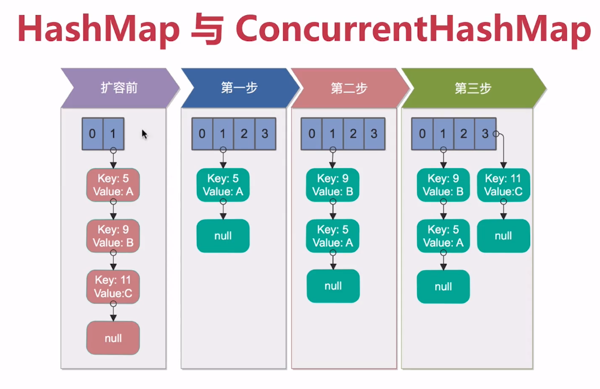
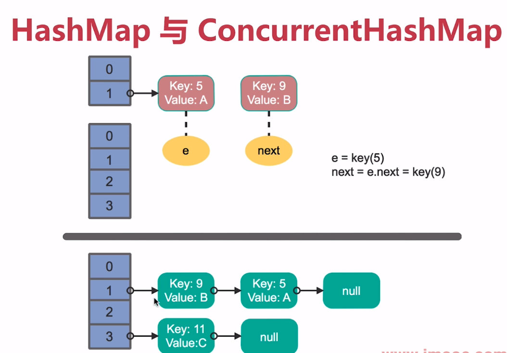
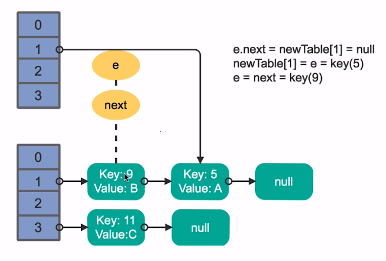
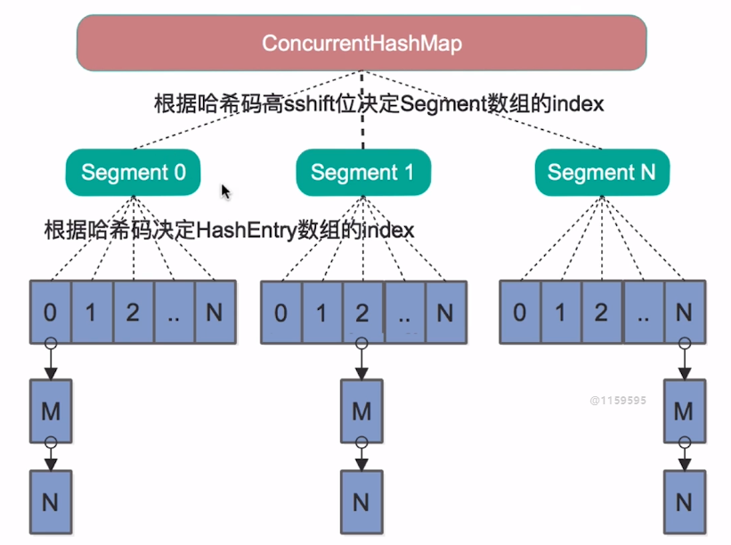
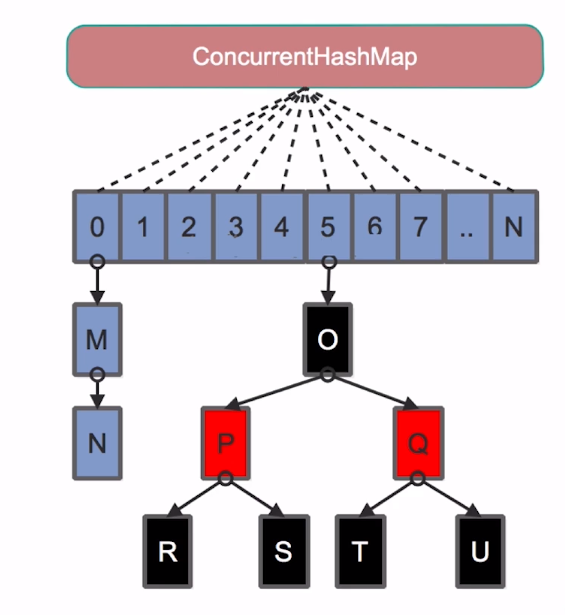

# 第6章 多线程并发拓展

## 6.1、死锁

- 死锁发生的必要条件
  - 互斥条件：排他性的使用锁。
  - 请求和保持条件：已经保持了一个资源，再请求其他资源，而该资源已经被其他线程占用。简称，吃着碗里瞧着锅里。
  - 不剥夺条件：线程已经获得的条件，在未使用完之前，无法被剥夺。
  - 环路等待条件：存在线程请求资源，形成环形链！

## 6.2、多线程并发最佳实践

- 使用本地变量
- 使用不可变类
- 最小化锁的作用域范围：S=1/(1-a+a/n) 【阿姆达尔定律】
  - a - 并行计算部分的比例
  - n - 并行处理的节点个数
  - S - 加速比
  - 当a=1时，S=n，只有并行，没有串行。
  - 当a=0时，S=1，只有串行，没有并行。
  - 当n取向无穷大时，S趋近1/1-a，是加速比的上限。
    - 比如串行部分占0.25，那么a=0.75，所以S不会超过4的并行度。
- 使用线程池的Executor，而不是直接new Thread执行
- 宁可使用同步也不要使用线程的wait和notify方法
  - 尽量使用同步工具：CountDownLatch、Semaphore、CyclicBarrier
- 使用BlockingQueue实现生产-消费模式
- 使用并发集合而不是加了锁的同步集合
  - ConcurrentHashMap、ConcurrentSkipListMap、CopyOnWriteArrayList、CopyOnWriteArraySet、BlockingQueue、DelayQueue
- 使用Semaphore创建有界的访问
- 宁可使用同步代码块，也不使用同步的方法
- 避免使用静态变量

## 6.3、Spring与线程安全

- Spring bean：Singleton、Prototype
- 无状态对象
  - 自身没有状态，也不会被多线程修改状态，产生线程安全问题。

## 6.4、HashMap与ConcurrentHashMap

### HashMap单线程扩容

### HashMap多线程扩容

线程1准备扩容，已经把5挂到index=1了，准备操作9时时间片用完了。线程2扩容并把5、9、11全部挂载完毕！

时间片留给线程1了，线程1把5挂载到index=1，再把9插入index=1的头部；由于线程2已经在9后面挂载了5，导致9指向5,5指向9，就死循环了。

### ConcurrentHashMap

Java7：

Java8：

## 6.5、多线程并发与线程安全总结

- 线程安全性：原子性/可见性/有序性，atomic包，CAS，synchronized与Lock，volatile，happens-before
- 安全发布对象：安全发布方法，不可变对象，final关键字，线程不安全类与写法
- 线程封闭与并发容器：堆栈封闭，ThreadLocal，同步容器，并发容器，J.U.C
- AQS等J.U.C组件：CountDownLatch，Semaphore，CyclicBarrier，ReentrantLock与锁，Condition，FutureTask，Fork/Join，BlockingQueue
- 线程调度：new Thread弊端，线程池的好处，ThreadPoolExecutor，Executor框架接口
- 线程安全补充：死锁的产生与预防，多线程并发最佳实践，Spring线程安全，HashMap与ConcurrentHashMap详解
