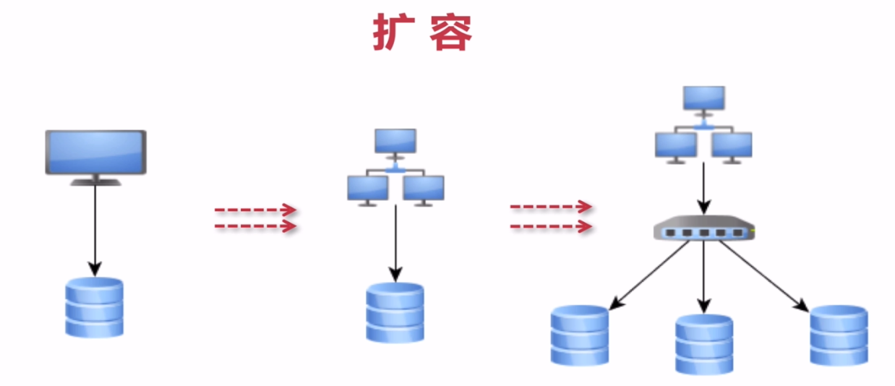
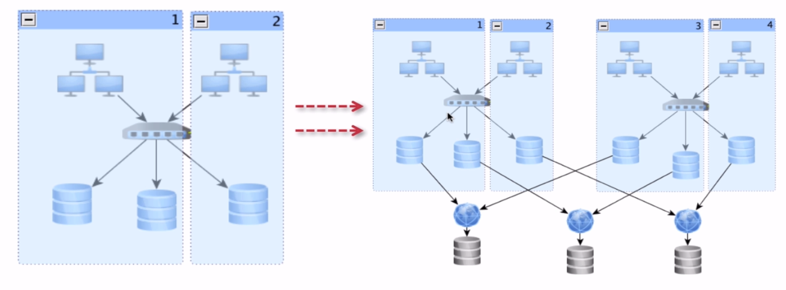
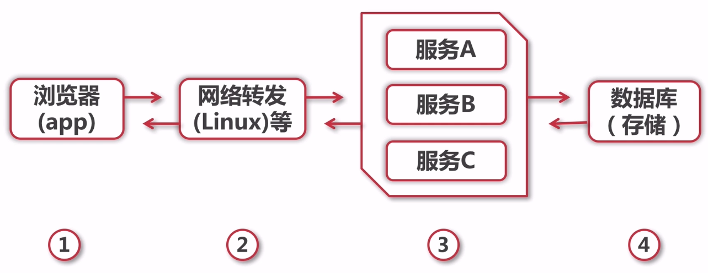
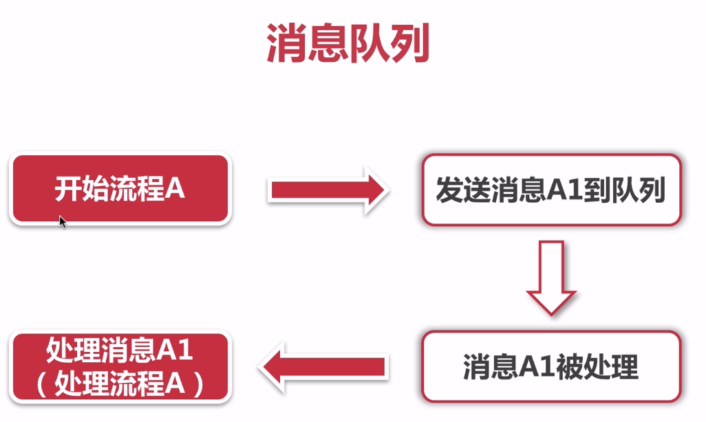

# 第7章 高并发架构与中间件

## 7.1、扩容思路

- 垂直扩容（纵向扩展）：提高系统部件能力
- 水平扩容（横向扩展）：增加更多系统成员来实现

## 7.2、缓存

### 缓存特征

- 命中率：命中数/（命中数+没有命中数）
- 最大元素（空间）
- 清空策略：FIFO、LFU（最少使用策略）、LRU（最近最少使用策略）、过期时间、随机等

### 缓存命中率影响因素

- 业务场景和业务需求（读多写少）
- 缓存的设计（粒度和策略）
- 缓存容量和基础设施

### 缓存分类和应用场景

- 本地缓存：编程实现（成员变量、局部变量、静态变量）、Guava Cache
- 分布式缓存：Memcache、Redis

### 高并发场景下缓存常见问题

- 缓存一致性：更新数据库成功→更新缓存失败→数据不一致；更新缓存成功→更新数据库失败→数据不一致；更新数据库成功→淘汰缓存失败；淘汰缓存成功→更新数据库失败
- 缓存并发问题
- 缓存穿透问题：缓存key不存在，被大量攻击访问
  - 对空数据进行缓存：实现成本低，适合命中不高但可能被频繁更新的数据
  - 增加布隆过滤器
- 缓存雪崩问题：缓存集中失效
- 缓存击穿问题：缓存命中很高，但某一刻失效了

## 7.3、高并发下消息队列

消息队列特性：

- 业务无关：只做消息分发
- FIFO：先投递先到达
- 容灾：节点的动态增删和消息的持久化

为什么需要消息队列：生产速度和消费速度或稳定性等因素不一致。

消息队列的好处：

- 业务解耦
- 最终一致性
- 广播
- 错峰与流控

## 7.4、应用拆分

应用拆分原则：

- 业务优先
- 循序渐进
- 兼顾技术：重构、分层
- 可靠测试

应用拆分思考：

- 应用之间通信：RPC（dubbo等）、消息队列
- 应用之间数据库设计：每个应用都有独立的数据库
- 避免事务操作跨应用

## 7.5、应用限流

应用限流算法：

- 计数器法
- 滑动窗口
- 漏桶算法
- 令牌桶算法

应用限流实现：

- Guava RateLimiter
- 分布式限流实现：Redis（incrby key num）

## 7.6、服务降级与服务熔断

## 7.7、数据库切库、分库、分表

- 数据库瓶颈
  - 单个库数据量太大（1T-2T）：多个库
  - 单个数据库服务器压力过大、读写瓶颈：多个库
  - 单个表数据量过大：分表

- 数据库切库
  - 切库的基础及实际应用：读写分离
  - 自定义注解完成数据库切库 - 代码实现

- 数据库支持多个数据源与分库
