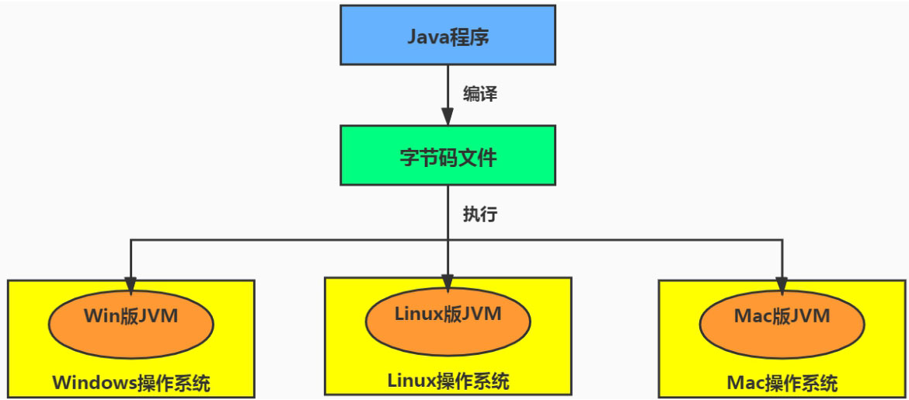

# 第零篇 前言篇

## 开发人员如何看待上层框架

一些有一定工作经验的开发人员，打心眼儿里觉得SSM、微服务等上层技术才是重点，基础技术并不重要，这其实是一种本末倒置的“病态”。

如果我们把核心类库的API比作数学公式的话，那么Java虚拟机的知识就好比公式的推到过程。

## 跨平台的语言Java与跨语言的平台JVM

Java不是最强大的语言，但JVM是最强大的虚拟机。

## 准备

- idea上安装 jclasslib Bytecode Viewer 插件