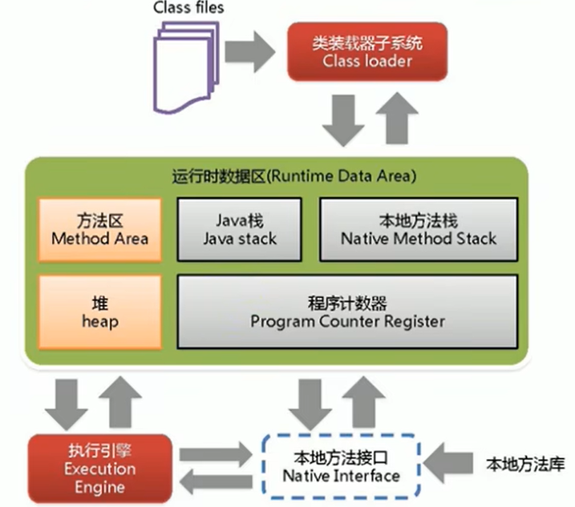
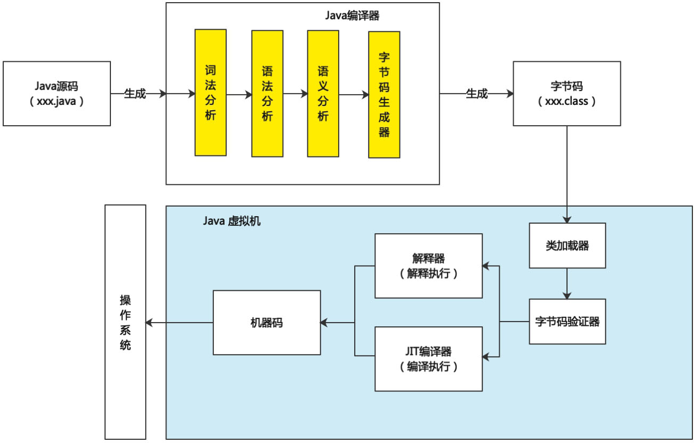
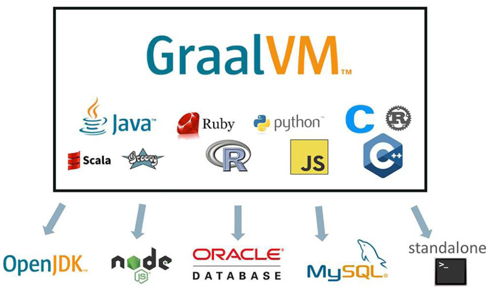

# 第1章 JVM与Java体系结构

## 1.1 为什么要学习JVM

​	开发者都有找工作的经历，随着互联网门槛越来越高，JVM知识也是中高级程序员求职面试时经常被问到的话题。所以如果想要通过面试，JVM知识是必备技能之一。除去面试，在程序开发的时候也会出现一些比较棘手的问题，比如：

1. 处于运行状态的线上系统突然卡死，造成系统无法访问，甚至直接内存溢出异常（Out Of Memory Error 简称：OOM）。

2. 希望解决线上JVM垃圾回收的相关问题，但却无从下手。

3. 新项目上线，对各种JVM参数设置一脸茫然，选择系统默认设置，最后系统宕机。

​	以上问题都与JVM有关，学会JVM后这些问题便迎刃而解。

​	大部分Java开发人员，会在项目中使用与Java平台相关的各种集成技术，但是对于Java技术的核心JVM却了解甚少。当然也有一些有一定工作经验的开发人员，心里一直认为SSM、微服务等技术才是重点，基础技术并不重要，这其实是一种本末倒置的“病态”。如果我们把核心类库的API比作数学公式的话，那么JVM的知识就好比公式的推导过程。对于一位合格的开发者来说，JVM中的一些知识也是必须掌握的。

<span style="color:red;font-weight:bold;">你用惯了那么多框架（Tomcat/Spring/MyBatis/Dubbo/Kafka......），可有一款能深入理解，更不用说开发一个框架。</span>

<span style="color:red;font-weight:bold;">底层技术多年来变化甚少，应用层框架枝繁叶茂。</span>

<span style="color:red;font-weight:bold;">打好地基，才能建造高楼大厦！！！</span>

​	JVM中的垃圾收集机制为我们整合了很多烦琐的工作，大大提高了开发的效率。垃圾收集也不是万能的，知悉JVM内存结构和工作机制也是Java工程师进阶的必备能力，它是设计高扩展性应用和诊断程序运行时问题的基础。深入了解JVM，有利于开发人员对项目做性能优化、保证平台性能和稳定性、优化项目架构、分析系统潜在风险以及解决系统瓶颈问题。

## 1.2 Java及JVM的简介

### 1.2.1 TIOBE编程语言排行榜

编程语言排行榜：https://www.tiobe.com/tiobe-index/

<div style="text-align:center;font-weight:bold;">TIOBE编程语言排行榜（20241102 17:12:37）</div>


### 1.2.2 Java：跨平台的语言

​	随着Java以及Java社区的不断壮大，Java也早已不再是简简单单的一门计算机语言了，它更是一个开放的平台、一种共享的文化、一个庞大的社区。

<div style="text-align:center;font-weight:bold;">Java语言的跨平台性</div>


​	按照技术所服务的领域来划分，Java技术体系可以分为以下四条主要的产品线。

1. Java SE(Standard Edition)：支持面向桌面级应用（如Windows下的应用程序）的Java平台，提供了完整的Java核心API，这条产品线在JDK 6以前被称为J2SE。
2. Java EE(Enterprise Edition)：支持使用多层架构的企业应用（如ERP、MIS、CRM应用）的Java平台，除了提供Java SE API外，还对其做了大量有针对性的扩充，并提供了相关的部署支持，这条产品线在JDK 6以前被称为J2EE，在JDK 10以后被Oracle放弃，捐献给Eclipse基金会管理，此后被称为Jakarta EE。
3. Java ME(Micro Edition)：支持Java程序运行在移动终端（手机、PDA）上的平台，对Java API有所精简，并加入了移动终端的针对性支持，这条产品线在JDK 6以前被称为J2ME。有一点读者请勿混淆，现在在智能手机上非常流行的、主要使用Java语言开发程序的Android并不属于Java ME。

4. Java Card：支持Java小程序(Applets)运行在小内存设备（如智能卡）上的平台。

### 1.2.3 JVM：跨语言的平台

​	这里所述的JVM与Java SE 8平台相互兼容，如果说Java是跨平台的语言，那JVM就是跨语言的平台。首先，看一下[JVM官方文档](https://docs.oracle.com/javase/specs/jvms/se8/html/jvms-1.html#jvms-1.2)


​	JVM是整个Java平台的基石，是Java技术用于实现硬件无关与操作系统无关的关键部分，是Java语言生成出极小体积的编译代码的运行平台，是保障用户机器免于恶意代码损害的屏障。

​	JVM与Java语言并没有必然的联系，它只与特定的二进制文件格式——class文件格式所关联。class文件包含JVM指令集［或者称为字节码(Bytecode)］和符号表，以及其他一些辅助信息。

​	基于安全方面的考虑，JVM在class文件中施加了许多强制性的语法和结构化约束，凡是能用class文件正确表达出来的编程语言，都可以放在JVM里面执行。由于它是一个通用的、与机器无关的执行平台，所以其他语言的实现者都可以考虑将JVM作为那些语言的交付媒介。

​	随着Java 7的正式发布，JVM的设计者通过JSR-292规范基本实现了在JVM平台上运行非Java语言编写的程序，如图1-4所示。不同的编译器，可以编译出相同的字节码文件，字节码文件也可以在不同的JVM上运行。

<div style="text-align:center;font-weight:bold;">JVM跨平台的语言</div>


​	JVM根本不关心运行在其内部的程序到底是使用何种编程语言编写的，它只关心“字节码”文件。也就是说JVM拥有语言无关性，并不会单纯地与Java语言“终身绑定”，只要其他编程语言的编译结果满足并包含JVM的内部指令集、符号表以及其他的辅助信息，它就是一个有效的字节码文件，就能够被虚拟机所识别并装载运行。现在开发语言越来越多，虽然Java语言并不是最强大的语言，但JVM可以说是业内公认的最强大的虚拟机。

​	我们平时说的Java字节码，指的是用Java语言编译成的字节码。准确地说，任何能在JVM平台上执行的字节码格式都是一样的。所以应该统称为“JVM字节码”。

​	Java平台上的多语言混合编程正在成为主流，通过特定领域的语言去解决特定领域的问题是当前软件开发应对日趋复杂的项目需求的一个方向。

​	试想一下，在一个项目之中，并行处理使用Clojure语言，展示层使用JRuby/Rails语言，中间层则使用Java语言，每个应用层都使用不同的编程语言来完成。而且，接口对每一层的开发者都是透明的，各种语言之间的交互不存在任何困难，就像使用自己语言的原生API一样方便，因为它们最终都运行在一个虚拟机上。

​	对这些运行于JVM之上、Java之外的语言，来自系统级的、底层的支持正在迅速增强，<span style="color:#9400D3;">以JSR-292为核心的一系列项目和功能改进（如DaVinci Machine项目、Nashorn引擎、InvokeDynamic指令、java.lang.invoke包等），推动JVM从“Java语言的虚拟机”向“多语言虚拟机”的方向发展</span>。

### 1.2.4 JVM的位置

<div style="text-align:center;font-weight:bold;">JVM运行在操作系统之上</div>


如下图所示：JDK包含了JRE,JRE包含了JVM。

<div style="text-align:center;font-weight:bold;">JVM在整个JDK体系中的位置</div>

[Java Platform Standard Edition 8 Documentation](https://docs.oracle.com/javase/8/docs/)


## 1.3 Java发展的重大事件

- 1991年，在Sun计算机公司中，由Patrick Naughton、MikeSheridan及James Gosling领导的小组Green Team开发出了新的程序语言，命名为Oak，后期命名为Java。
- 1995年，Sun正式发布Java和HotJava产品，Java首次公开亮相。
- 1996年1月23日，Sun发布了JDK 1.0。
-  1998年，JDK 1.2版本发布。同时，Sun发布了JSP/Servlet、EJB规范，以及将Java分成了J2EE、J2SE和J2ME。这表明了Java开始向企业、桌面应用和移动设备应用三大领域挺进。
- 2000年，JDK 1.3发布，Java HotSpot Virtual Machine正式发布，成为Java的默认虚拟机。
- 2002年，JDK 1.4发布，古老的Classic虚拟机退出历史舞台。
- 2003年年底，Java平台的Scala正式发布，同年Groovy也加入了Java阵营。
- 2004年，JDK 1.5发布。同时JDK 1.5改名为JavaSE 5.0。
- 2006年，JDK 6发布。同年，Java开源并建立了Open JDK。顺理成章，HotSpot虚拟机也成为了Open JDK中的默认虚拟机。
- 2007年，Java平台迎来了新伙伴Clojure。
- 2008年，Oracle收购了BEA，得到了JRockit虚拟机。
- 2009年，Twitter宣布把后台大部分程序从Ruby迁移到Scala，这是Java平台的又一次大规模应用。
- 2009年4月，Oracle收购了Sun，获得Java商标和最具价值的HotSpot虚拟机。此时，Oracle拥有市场占用率最高的两款虚拟机HotSpot和JRockit，并计划在未来对它们进行整合，成为HotRockit。
- 2011年，JDK 7发布。在JDK 1.7u4中，正式启用了新的垃圾回收器G1。
- 2014年，JDK 8发布。JDK 8是继JDK 5后改革最大的一个版本，添加了很多新特性，如Lambda表达式、Stream API以及函数式编程等。
- 2017年，JDK 9发布。将G1设置为默认GC，替代CMS。
- 2017年，IBM的J9开源，形成了现在的Open J9社区。
- 2018年，Android的Java侵权案判决，Google赔偿Oracle计88亿美元。
- 2018年，Oracle宣告JavaEE成为历史名词，JDBC、JMS、Servlet赠予Eclipse基金会。
- 2018年，JDK 11发布，LTS版本的JDK，发布革命性的ZGC，调整JDK授权许可。
- 2019年，JDK 12发布，加入RedHat领导开发的Shenandoah GC。
- 2020年，JDK 15发布，ZGC转正，支持的平台包括Linux、Windows和macOS。同时，Shenandoah垃圾回收算法终于从实验特性转变为产品特性。

## 1.4 Open JDK和Oracle JDK

​	在调整JDK授权许可之后，每次发布JDK的新版本的时候都会同时发布两个新的Open JDK版本和Oracle JDK版本。两个版本的主要区别是基于的协议不同，Open JDK基于GPL协议，Oracle JDK基于OTN的协议。Open JDK的维护期间为半年，即半年更新一个版本，一旦出现问题就需要更新JDK的版本。Oracle JDK的维护期为3年，但是商业使用需要付费。两者之间还有很多代码实现是一样的，例如JDBC、javac、core libraries等。

<div style="text-align:center;font-weight:bold;">Open JDK和Oracle JDK之间的关系</div>


​	在JDK 11之前，Oracle JDK中还会存在一些Open JDK中没有的、闭源的功能。但在JDK 11中，我们可以认为Open JDK和Oracle JDK代码实质上已经完全一致。

## 1.5 JVM的整体结构

​	HotSpot VM是目前市面上高性能虚拟机的代表作之一，它采用解释器与即时编译器并存的架构。在今天，Java程序的运行性能早已脱胎换骨，已经达到了可以和C/C++程序一较高下的地步。

<div style="text-align:center;font-weight:bold;">HotSpot VM整体结构图</div>



该架构可以分成三层：

<span style="color:#FFA500;font-weight:bold;">最上层</span>：类装载器子系统。javac编译器将编译好的字节码文件，通过Java类装载器执行机制，把对象或字节码文件存放在JVM内存划分区域。中间层：运行时数据区(Runtime Data Area)。主要是在Java代码运行时用于存放数据的区域，包括方法区、堆、Java栈、程序计数器、本地方法栈。

<span style="color:#FFA500;font-weight:bold;">中间层</span>：运行时数据区(Runtime Data Area)。主要是在Java代码运行时用于存放数据的区域，包括方法区、堆、Java栈、程序计数器、本地方法栈。

<span style="color:#FFA500;font-weight:bold;">最下层</span>：执行引擎层。执行引擎包含解释器、JIT(Just In Time)编译器和垃圾回收器(Garbage Collection,GC)，在后续章节会进行详细的介绍。

## 1.6 Java代码执行流程

​	Java源文件经过编译器的词法分析、语法分析、语义分析、字节码生成器等一系列过程生成以“.class”为后缀的字节码文件。Java编译器编译过程中，任何一个节点执行失败都会造成编译失败。字节码文件再经过JVM的类加载器、字节码校验器、翻译字节码（解释执行）或JIT编译器（编译执行）的过程编译成机器指令，提供给操作系统进行执行。

​	JVM的主要任务就是将字节码装载到其内部，解释／编译为对应平台上的机器指令执行。JVM使用类加载器(Class Loader)装载class文件，虽然各个平台的JVM内部实现细节不尽相同，但是它们共同执行的字节码内容却是一样的。类加载完成之后，会进行字节码校验，字节码校验通过，JVM解释器会把字节码翻译成机器码交由操作系统执行。

​	早期，我们说Java是一门解释型语言，因为在Java刚诞生，即JDK1.0的时候，Java的定位是一门解释型语言，也就是将Java程序编写好之后，先通过javac将源码编译为字节码，再对生成的字节码进行逐行解释执行。

​	<span style="color:#9400D3;">现在我们提到Java，更多地认为其是一门半编译半解释型的语言，因为Java为了解决性能问题，采用了一种叫作JIT即时编译的技术，也就是将执行比较频繁的整个方法或代码块直接编译成本地机器码，以后执行这些方法或代码时，直接执行生成的机器码即可</span>。

​	换句话说，在HotSpot VM内部，即时编译器与解释器是并存的，通过编译器与解释器的协同工作，既可以保证程序的响应时间，同时还能够提高程序的执行性能。目前市面上大多数主流虚拟机都采用此架构。

<div style="text-align:center;font-weight:bold;">Java代码执行流程</div>



<div style="text-align:center;font-weight:bold;">Java代码执行详细流程</div>


## 1.7 JVM的架构模型

​	Java编译器输入的指令流是一种基于栈的指令集架构，另外一种指令集架构则是基于寄存器的指令集架构。具体来说，这两种架构之间的区别如下。

<font style="color:red">栈：跨平台性、指令集小、指令多；执行性能比寄存器差。</font>

### 1 基于栈式架构的特点

1. 设计和实现更简单，适用于资源受限的系统。比如机顶盒、打印机等嵌入式设备。
2. 避开了寄存器的分配难题，使用零地址指令方式分配，只针对栈顶元素操作。
3. 指令流中的指令大部分是零地址指令，其执行过程依赖操作栈。指令集更小，编译器更容易实现。
4. 不需要硬件支持，可移植性更好，可以更好地实现跨平台。

<span style="color:#FFA500;">什么是零地址指令？</span>

零地址指令是机器指令的一种，指令系统中不设地址字段的指令，只有操作码，没有操作数。

<span style="color:#40E0D0;">案例1：</span>

- 代码

```java
public static void main(String[] args) {
    int i = 2;
    int j = 3;
    int k = i + j;
}
```

- 基于栈的计算流程

```
0 iconst_2	// 常量2入栈
1 istore_1	
2 iconst_3	// 常量3入栈
3 istore_2
4 iload_1
5 iload_2
6 iadd		// 常量2、3出栈，执行相加操作
7 istore_3	// 执行结果5存入局部变量表索引3的位置
8 return
```

### 2 基于寄存器架构的特点

1. 典型的应用是x86的二进制指令集。比如传统的PC以及Android的Davlik虚拟机。
2. 指令集架构则完全依赖硬件，可移植性差。
3. 指令直接由CPU来执行，性能优秀和执行更高效。
4. 花费更少的指令去完成一项操作。
5. 在大部分情况下，基于寄存器架构的指令集往往都以一地址指令、二地址指令和三地址指令为主，而基于栈式架构的指令集却是以零地址指令为主。

## 1.8 JVM的生命周期

​	JVM的生命周期包含三个状态：JVM的启动、JVM的执行和JVM的退出。

​	JVM可以通过Java命令启动，接着通过引导类加载器(Bootstrap ClassLoader)加载类文件，最后找到程序中的main()方法，去执行Java应用程序。

​	JVM的执行表示一个已经启动的JVM开始执行Java程序。JVM通过main()方法开始执行程序，程序结束时JVM就停止。执行一个Java程序的时候，真正在执行的是一个叫作JVM的进程，通常情况下，一个Java程序对应一个JVM进程。

​	JVM的退出有如下几种情况。

1. Java应用程序正常执行结束，即当所有的非守护线程执行结束
2. Java应用程序在执行过程中遇到了异常或错误而异常终止，比如发生内存溢出导致程序结束。

3. 由于操作系统出现错误而导致JVM进程终止，比如机器宕机。
4. 用户手动强制关闭JVM，比如使用kill命令。
5. 某线程调用Runtime类或System类的exit()方法。

## 1.9 JVM的发展历程

### 1.9.1 Sun Classic VM

​	早在1996年Java 1.0版本的时候，Sun公司发布了一款名为Sun ClassicVM的JVM，它同时也是世界上第一款商用JVM,JDK 1.4时完全被淘汰。

​	这款虚拟机内部只提供解释器。如果使用JIT编译器，就需要进行外挂，但是一旦使用了JIT编译器，JIT就会接管虚拟机的执行系统，解释器就不再工作。Sun Classic VM虚拟机无法使解释器和编译器协同工作，其执行效率也和传统的C/C++程序有很大的差距，“Java语言很慢”的印象就是在这个阶段开始在用户心中树立起来的。

### 1.9.2 Exact VM

​	为了解决Classic虚拟机所面临的各种问题，提升运行效率，在JDK 1.2时，Sun公司提供了Exact VM虚拟机。

​	  Exact VM因使用准确式内存管理（Exact Memory Management，也可以叫Non-Conserv ative/Accurate Memory Management）而得名。准确式内存管理是指虚拟机可以知道内存中的某个位置的数据具体是什么类型。Exact VM已经具有热点探测的功能，采用了编译器与解释器混合工作的模式。虽然Exact VM的技术相对Classic VM来说进步了很多，但是它只在Solaris平台短暂使用，很快就被HotSpot VM所取代。

### 1.9.3 <span style="color:red;font-weight:bold;">HotSpot VM</span>

​	相信很多Java程序员都听说过HotSpot虚拟机，它是Sun/Oracle JDK和Open JDK中的默认虚拟机，也是目前使用范围最广的JVM。然而HotSpot虚拟机最初由一家名为Longview Technologies的小公司设计，这款虚拟机在即时编译等方面有着优秀的理念和实际成果，Sun公司在1997年收购了Longview Technologies公司，从而获得了HotSpot虚拟机。2009年，Sun公司被Oracle公司收购，<span style="color:red;">在JDK 1.3中HotSpotVM成为默认虚拟机</span>。

​	HotSpot VM继承了Sun之前两款商用虚拟机的优点，也有许多自己新的技术优势，比如它的热点代码探测技术。程序执行过程中，一个被多次调用的方法，或者一个方法体内部循环次数较多的循环体都可以被称为“热点代码”，探测到热点代码后，通知即时编译器以方法为单位触发<span style="color:red;">标准即时编译和栈上替换编译(On-Stack Replacement,OSR)</span>。此外，HotSpot VM是编译器与解释器同时存在的，当程序启动后，解释器可以马上发挥作用，省去编译的时间，立即执行。编译器把代码编译成机器码，需要一定的执行时间，但编译为机器码后，执行效率高。通过编译器与解释器恰当地协同工作，可以在最优的程序响应时间与最佳的执行性能中取得平衡，而且无须等待本地代码输出再执行程序，即时编译的时间压力也相对减小。<span style="color:red;">不管是仍在广泛使用的JDK 6，还是使用 比例较高的JDK 8中，默认的虚拟机都是HotSpot</span>。

​	<span style="color:red;font-weight:bold;">这里默认介绍的虚拟机都是HotSpot，相关GC机制也主要是指HotSpot的GC机制</span>。对于HotSpot虚拟机从服务器、桌面到移动端、嵌入式都有应用。得益于Sun/Oracle JDK在Java应用中的统治地位，HotSpot理所当然地成为全世界使用最广泛的JVM，是虚拟机家族中毫无争议的“武林盟主”。

### 1.9.4 <span style="color:#9400D3;font-weight:bold;">BEA的JRockit</span>

​	JRockit虚拟机曾号称是“世界上速度最快的JVM”，它是BEA在2002年从Appeal Virtual Machines公司收购获得的JVM。BEA将其发展为一款专门为服务器硬件和服务端应用场景高度优化的虚拟机，由于专注于服务端应用，它可以不太关注于程序启动速度，因此JRockit内部不包含解释器实现，全部代码都靠即时编译器编译后执行。除此之外，JRockit的垃圾收集器和Java Mission Control故障处理套件等部分的实现，在当时众多的JVM中也处于领先水平。JRockit随着BEA被Oracle收购，现已不再继续发展，永远停留在R28版本，这是JDK 6版JRockit的代号。

​	使用JRockit产品，客户已经体验到了显著的性能提高（一些超过了70%）和硬件成本的减少（达50%）。JRockit面向延迟敏感型应用的解决方案JRockit Real Time提供了毫秒级或微秒级的JVM响应时间，适合财务、军事指挥、电信网络的需要。MissionControl服务套件是一组以极低的开销来监控、管理和分析生产环境中的应用程序的工具。2008年BEA被Oracle收购后，Oracle表达了整合两大优秀虚拟机的工作，大致在JDK 8中完成。整合的方式是在HotSpot的基础上，移植JRockit的优秀特性。

### 1.9.5 <span style="color:#9400D3;font-weight:bold;">IBM的J9</span>

​	IBM J9虚拟机并不是IBM公司唯一的JVM，不过目前IBM主力发展无疑就是J9。J9这个名字最初只是内部开发代号而已，开始选定的正式名称是“IBM Technology for Java Virtual Machine”，简称IT4J，内部代号J9。

### 1.9.6 KVM和CDC/CLDC HotSpot

​	KVM中的K是“Kilobyte”的意思，它强调简单、轻量、高度可移植，但是运行速度比较慢。在Android、iOS等智能手机操作系统出现前曾经在手机平台上得到非常广泛应用。KVM目前在智能控制器、传感器、老人手机、经济欠发达地区的功能手机还有应用。

​	2019年，传音手机的出货量超过小米、OPPO、vivo等智能手机巨头，仅次于华为（含荣耀品牌）排行全国第二。传音手机做的是功能机，销售市场主要在非洲，上面仍然用着Java ME的KVM。

​	Oracle在Java ME产品线上的两款虚拟机为CDC HotSpotImplementation VM和CLDCHotSpot Implementation VM。其中CDC全称是Connected Device Configuration,CLDC全称是Connected Limited Device Configuration。CDC和CLDC虚拟机希望能够在手机、电子书、PDA等移动设备上建立统一的Java编程接口。面向更低端设备的CLDC倒是在智能控制器、传感器等领域有自己的一片市场，现在也还在继续发展，但前途并不乐观。

### 1.9.7 Azul VM

​	我们平时所提及的“高性能JVM”一般是指HotSpot、JRockit、J9这类在通用平台上运行的商用虚拟机。Azul VM是Azul Systems公司在HotSpot基础上进行大量改进，与特定硬件平台绑定、软硬件结合的专有虚拟机，可以理解为定制版虚拟机，主要应用于Azul Systems公司的专有硬件Vega系统上。每个Azul VM实例都可以管理至少数十个CPU和 数百GB内存的硬件资源，并提供在巨大内存范围内停顿时间可控的垃圾收集器（即业内赫赫有名的PGC和C4收集器）。2010年起，Azul公司的重心逐渐开始从硬件转向软件，发布了自己的Zing虚拟机，可以在通用x86平台上提供接近于Vega系统的性能和一致的功能特性。

### 1.9.8 Liquid VM

​	Liquid VM和Azul VM一样，也是与特定硬件平台绑定、软硬件配合的专有虚拟机。Liquid VM是BEA公司开发的可以直接运行在自家Hypervisor系统上的JRockit虚拟机的虚拟化版本。正常情况下，运行Java代码时，需要先调用JVM，再通过JVM调用操作系统，而LiquidVM不需要操作系统的支持，或者说它本身实现了一个专用操作系统的必要功能，如线程调度、文件系统、网络支持等。由虚拟机越过通用操作系统直接控制硬件可以获得很多好处，如在线程调度时，不需要再进行内核态／用户态的切换，这样可以最大限度地发挥硬件的能力，提升Java程序的执行性能。随着JRockit虚拟机终止开发，Liquid VM项目也停止了。

### 1.9.9 Apache Harmony

​	Apache Harmony是一个Apache软件基金会旗下以Apache License协议开源的实际兼容于JDK 5和JDK 6的Java程序运行平台，它含有自己的虚拟机和Java类库API，用户可以在上面运行Eclipse、Tomcat、Maven等常用的Java程序。但是，它并没有通过TCK(TechnologyCompatibility Kit)认证。如果一个公司要宣称自己的运行平台“兼容于Java技术体系”，那该运行平台就必须要通过TCK的兼容性测试，Apache基金会曾要求当时的Sun公司提供TCK的使用授权，但是一直遭到各种理由的拖延和搪塞，直到Oracle收购了Sun公司之后，双方关系越闹越僵，最终导致Apache基金会愤然退出JCP组织，<span style="color:#9400D3;">这是Java社区有史以来最严重的分裂事件之一</span>。

### 1.9.10 Microsoft JVM

​	微软为了在Internet Explorer 3浏览器中支持Java Applets应用而开发了自己的JVM。这款JVM和其他JVM相比，在Windows系统下性能最好，它提供了一种安全的环境，可以防止恶意代码的执行，并且可以检测和阻止恶意代码的传播。它在1997年和1998年连续获得了PCMagazine杂志的“编辑选择奖”。1997年10月，Sun公司正式以侵犯商标、不正当竞争等罪名控告微软，官司的结果是微软向Sun公司赔偿2000万美元。此外，微软最终因垄断赔偿给Sun公司的总金额高达10亿美元，承诺终止该JVM的发展，并逐步在产品中移除JVM相关功能。现在Windows上安装的JDK都是HotSpot。

### 1.9.11 Taobao JVM

​	Taobao JVM由Ali JVM团队发布。阿里巴巴是国内使用Java最强大的公司，覆盖云计算、金融、物流、电商等众多领域，需要解决高并发、高可用、分布式的复合问题，有大量的开源产品。Ali JVM团队基于OpenJDK开发了自己的定制版本Alibaba JDK，简称AJDK。它是整个阿里Java体系的基石，也是基于OpenJDK HotSpot VM发布的国内第一个优化、深度定制且开源的高性能服务器版JVM。

​	其中创新的GCIH(GC Invisible Heap)技术实现了off-heap，即将生命   周期较长的Java对象从heap之中移到heap之外，并且GC不能管理GCIH内部的Java对象，以此达到降低GC的回收频率和提升GC的回收效率的目的。同时GCIH中的对象还能够在多个JVM进程中实现共享。Taobao JVM中使用crc32指令实现JVM intrinsic降低JNI的调用开销，提供了PMU hardware的Java profiling tool和诊断协助功能，以及专门针对大数据场景的ZenGC。

​	Taobao JVM应用在阿里巴巴产品上性能高，硬件严重依赖Intel的CPU，损失了兼容性，但提高了性能。目前已经在淘宝、天猫上线，把Oracle官方JVM版本全部替换了。

### 1.9.12 Dalvik VM/ART VM

​	Dalvik虚拟机曾经是Android平台的核心组成部分之一，它是一个由Google开发的轻量级Java虚拟机，用于在Android系统上运行Java应用程序。它是一个基于Java虚拟机规范的虚拟机，但是它的实现和标准的Java虚拟机有很大的不同。它使用一种叫作Dalvik Executable(DEX)的文件格式来存储应用程序的字节码，而不是标准的Java字节码，但是DEX文件可以通过class文件转化而来。它还使用一种叫作Register-based的指令集，而不是标准的Stack-based指令集。Dalvik虚拟机的设计目标是为了在移动设备上运行，因此它能够节省内存和电量，以及提高性能。

​	在Android发展的早期，Dalvik虚拟机随着Android的成功迅速流行，在Android 2.2中开始提供即时编译器实现，执行性能又有了进一步提高。不过到了Android 4.4时代，支持提前编译(Ahead of TimeCompilation,AOT)的ART虚拟机迅速崛起，在当时性能还不算特别强大的移动设备上，提前编译要比即时编译更容易获得高性能，所以在Android 5.0里ART就全面代替了Dalvik虚拟机。

### 1.9.13 Graal VM

​	2018年4月，Oracle Labs新公开了一项黑科技：Graal VM，如图1-17所示。从它的口号“Run Programs Faster Anywhere”就能感觉到一颗蓬勃的野心，这句话显然是与1995年Java刚诞生时的“WriteOnce,Run Anywhere”遥相呼应。

​	Graal VM被官方称为“Universal VM”和“Polyglot VM”，这是一个在HotSpot虚拟机基础上增强而成的跨语言全栈虚拟机，可以作为“任何语言”的运行平台使用，这里“任何语言”包括了Java、Scala、Groovy、Kotlin等基于JVM之上的语言，还包括了C、C++、Rust等基于LLVM的语言，同时支持其他如JavaScript、Ruby、Python和R语言等。Graal VM可以无额外开销地混合使用这些编程语言，支持不同语言中混用对方的接口和对象，也能够支持这些语言使用已经编写好的本地库文件。

<div style="text-align:center;font-weight:bold;">Graal VM</div>



### 1.9.14 其他JVM

​	其他的JVM有Java Card VM、Squawk VM、JavaInJava、MaxineVM、Jikes RVM、IKVM.NET、Jam VM、Cacao VM、Sable VM、  Kaffe、Jelatine JVM、Nano VM、MRP、Moxie JVM等。

​	具体JVM的内存结构，其实取决于其实现，不同厂商的虚拟机，或者同一厂商发布的不同版本，都有可能存在一定差异。本书主要以OracleHotSpot虚拟机来展开学习。