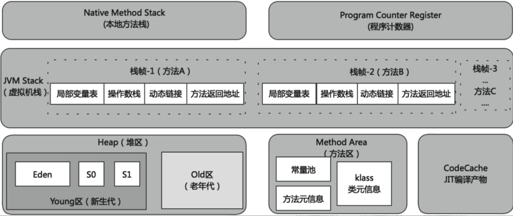
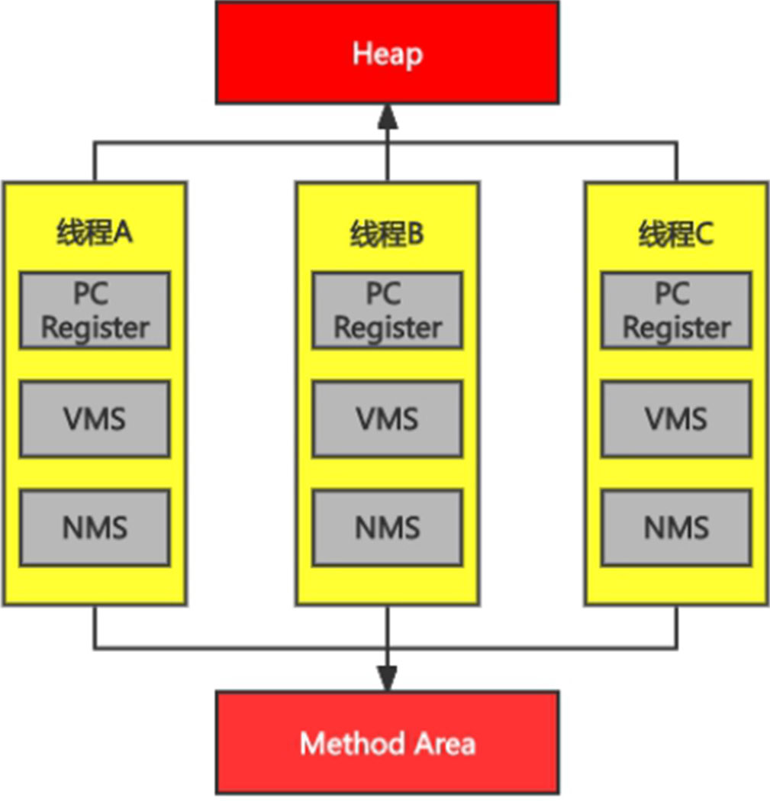

# 第2章 运行时数据区及线程概述

​	内存是非常重要的系统资源，是硬盘和CPU的中间仓库及桥梁，承载着操作系统和应用程序的实时运行。JVM在程序执行期间把它所管理的内存分为若干个不同的数据区域。这些不同的数据区域可以分为两种类型：一种是在JVM启动时创建，仅在JVM退出时才被销毁，这种可以理解为线程共享的，另外一种数据区是针对每个线程的，是在创建线程时创建的，并在线程退出时销毁，这种可以理解为线程私有的。这里将从线程的角度出发讲述JVM内存区域的划分。

## 2.1 运行时数据区概述

​	运行时数据区可简单分为Native Method Stack（本地方法栈）、Program Counter Register（程序计数器）、Java VirtualMachine Stack（虚拟机栈）、Heap（堆区）和Method Area（方法区）。如下图所示：

JVM内存结构（布局）

​	其中虚拟机栈是以栈帧为基本单位构成的，栈帧包括局部变量表、操作数栈、动态链接、方法返回地址和一些附加信息。堆区分为Young区（新生代）、Old区（老年代），这里讲解的是基于“经典分代”的HotSpot虚拟机内存布局。方法区分为常量池、方法元信息、klass类元信息。如下图所示：

JVM内存详细结构（布局）

​	JVM定义了若干种程序运行期间会使用到的运行时数据区，其中有一些会随着虚拟机启动而创建，随着虚拟机退出而销毁。另外一些则是与线程一一对应的，这些与线程对应的数据区域会随着线程开始和结束而创建和销毁。如下图所示，浅色的区域为单个线程私有，深色的区域为多个线程共享。

1. 线程私有的区域包括程序计数器(Program Counter Register,PCRegister)、虚拟机栈(Virtual Machine Stack,VMS)和本地方法栈(Native Method Stack,NMS）。

2. 线程间共享的区域包括堆区(Heap)、方法区(Method Area)。

线程共享和私有的结构图

