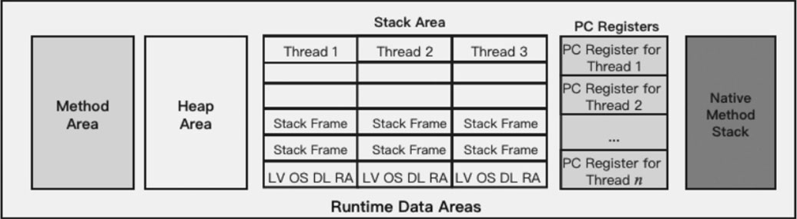
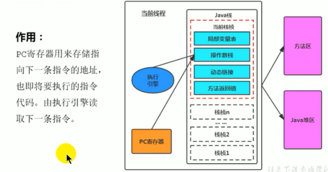

# 第3章 程序计数器

## 3.1 程序计数器介绍

​	JVM中的程序计数器英文全称是Program Counter Register，其中Register的命名源于CPU的寄存器，寄存器用于存储指令相关的现场信息，CPU只有把数据装载到寄存器才能够运行。

​	程序计数器中的寄存器并非是广义上所指的物理寄存器，或许将其翻译为指令计数器会更加贴切（也称为程序钩子），并且也可以避免一些不必要的误会，为了使用习惯，这里还是使用程序计数器来表示ProgramCounter Register。JVM中的程序计数器是对物理寄存器的一种抽象模拟。

​	程序计数器是一块较小的内存空间，属于运行时数据区的一部分。它可以看作是当前线程所执行的字节码的行号指示器。在JVM的概念模型里，字节码解释器工作时就是通过改变这个计数器的值来选取下一条需要执行的字节码指令，它是程序控制流的指示器。分支、循环、跳转、异常处理、线程恢复等基础功能，都需要依赖这个计数器来完成。如下图所示：

程序计数器

​	 如果线程正在执行的是一个Java方法，这个计数器记录的是正在执行的虚拟机字节码指令的地址；如果正在执行的是本地(Native)方法，这个计数器值则应为空(Undefined)。此内存区域是唯一一个在“Java虚拟机规范”中没有规定任何OutOfMemoryError情况的区域。程序计数器既没有垃圾回收也没有内存溢出。

​	程序计数器用来存储下一条指令的地址，也就是将要执行的指令代码。由执行引擎读取下一条指令。

线程中的程序计数器

​	程序计数器是一块很小的内存空间，几乎可以忽略不计。它也是运行速度最快的存储区域。在JVM规范中，每个线程都有它自己的程序计数器，是线程私有的，生命周期与线程的生命周期保持一致。

## 3.2 程序计数器常见问题

- 使用程序计数器存储字节码指令地址有什么用？为什么使用程序计数器记录当前线程的执行地址？

​	因为CPU需要不停地切换各个线程，切换回来以后，就需要知道接着从哪里开始继续执行。JVM的字节码解释器通过改变程序计数器的值，来明确下一条应该执行什么样的字节码指令。

- 程序计数器为什么会被设定为线程私有？

​	CPU时间片即CPU分配给各个程序的时间，每个线程被分配一个时间段，称作它的时间片。在宏观上，我们可以同时打开多个应用程序，每个程序同时运行。但在微观上，由于只有一个CPU，一次只能处理程序要求的一部分，为了处理公平，就要引入时间片，每个程序轮流执行。

​	所谓的多线程是在一个特定的时间段内只会执行其中某一个线程的方法，CPU会不停地做任务切换，这样必然导致经常中断或恢复，如何保证分毫无差呢？为了能够准确地记录各个线程正在执行的当前字节码指令地址，最好的办法自然是为每一个线程都分配一个程序计数器，这样一来各个线程之间便可以进行独立计算，从而不会出现相互干扰的情况。