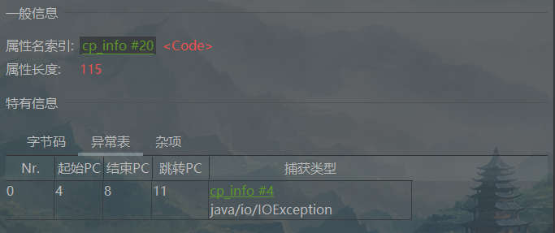

# 第4章 虚拟机栈

​	<span style="color:red;font-weight:bold;">栈由栈帧组成，每个栈帧又包括局部变量表（Local Variable Table）、操作数栈（Operand Stack）、动态链接（Dynamic Linking）、方法返回地址（Return Address）和一些附加信息</span>。

## 4.1 虚拟机栈概述

​	Java语言具有跨平台性，由于不同平台的CPU架构不同，<span style="color:red;font-weight:bold;">所以Java的指令不能设计为基于寄存器的，而是设计为基于栈架构的。基于栈架构的优点是可以跨平台，指令集小，编译器容易实现。缺点是性能较低，实现同样的功能需要更多的指令</span>。

​	Java虚拟机栈(Java Virtual Machine Stack)早期也叫Java栈。每个线程在创建时都会创建一个虚拟机栈，其内部由许多栈帧(Stack Frame)构成，<span style="color:#9400D3;">每个栈帧对应着一个Java方法的调用</span>，如代码清单4-1所示。与数据结构上的栈有着类似的含义，它是一块先进后出的数据结构，只支持出栈和入栈两种操作。栈是线程私有的，虚拟机栈的生命周期和线程一致。

​	每个方法被执行的时候，JVM都会同步创建一个栈帧用于存储局部变量表、操作数栈、动态链接、方法出口等信息。每一个方法被调用直至执行完毕的过程，就对应着一个栈帧在虚拟机栈中从入栈到出栈的过程。

​	虚拟机栈的作用是主管Java程序的运行，栈解决程序的运行问题，即程序如何执行或者说如何处理数据。

​	虚拟机栈保存方法的局部变量（8种基本数据类型、对象的引用地址）和部分结果，并参与方法的调用和返回。虚拟机栈有如下几个特点。

1. <span style="color:red;font-weight:bold;">栈是一种快速有效的分配存储方式，访问速度仅次于程序计数器</span>。
2. <span style="color:red;font-weight:bold;">对于栈来说不存在垃圾回收问题，但存在内存溢出</span>。
3. 栈是先进后出的，每个方法执行，伴随着压栈操作；方法执行结束后，伴随着出栈操作。

<div style="text-align:center;font-weight:bold;">栈的压栈和出栈</div>


​	Java虚拟机规范允许虚拟机栈的大小是可动态扩展的或者是固定不变的（注意：<span style="color:#9400D3;">目前HotSpot虚拟机中不支持栈大小动态扩展</span>）。关于虚拟机栈的大小可能出现的异常有以下两种。

1. 如果采用固定大小的Java虚拟机栈，那每一个线程的Java虚拟机栈容量在线程创建的时候按照固定大小来设置。如果线程请求分配的栈容量超过Java虚拟机栈允许的最大容量，JVM将会抛出一个StackOverflowError异常。
2. 如果Java虚拟机栈可以动态扩展，并且在尝试扩展的时候无法申请到足够的内存，或者在创建新的线程时没有足够的内存去创建对应的虚拟机栈，那JVM将会抛出一个OutOfMemoryError（OOM，内存溢出）异常。

​	我们可以使用参数-Xss选项来设置线程的最大栈空间（默认值取决于系统平台），栈的大小直接决定了函数调用的最大可达深度。

## 4.2 栈的存储单位

​	每个线程都有自己的栈，栈中的数据都是以栈帧(Stack Frame)的形式存在。在这个线程上正在执行的每个方法都各自对应一个栈帧，也就是说栈帧是Java中方法的执行环境。栈帧是一个内存区块，是一个数据集，维系着方法执行过程中的各种数据信息。

​	在一条活动线程中，一个时间点上只会有一个活动的栈帧，即只有当前正在执行的方法的栈帧（栈顶栈帧）是有效的，这个栈帧被称为当前栈帧，与当前栈帧相对应的方法就是当前方法，定义这个方法的类就是当前类。

​	执行引擎运行的所有字节码指令只针对当前栈帧进行操作。如果在该方法中调用了其他方法，对应的新的栈帧会被创建出来，放在栈的顶端，成为新的当前帧。JVM直接对Java栈的操作只有两个，就是对栈帧的压栈和出栈，遵循“先进后出”“后进先出”原则。

<div style="text-align:center;font-weight:bold;">栈中的当前栈帧</div>


## 4.3 局部变量表

### 4.3.1 局部变量表简介

​	局部变量表也称为局部变量数组或本地变量表。局部变量表定义为一个数字数组，主要用于存储方法参数和定义在方法体内的局部变量，这些数据类型包括各类基本数据类型、对象引用(reference)以及returnAddress类型。对于基本数据类型的变量，则直接存储它的值，对于引用类型的变量，则存的是指向对象的引用。

​	由于局部变量表是建立在线程的栈上，是线程的私有数据，因此不存在数据安全问题。

​	<span style="color:#9400D3;">局部变量表所需的容量大小是在编译期确定下来的</span>，并保存在方法的Code属性的maximum local variables数据项中。在方法运行期间是不会改变局部变量表的大小的。

​	方法嵌套调用的次数由栈的大小决定。一般来说，栈越大，方法嵌套调用次数越多。对一个方法而言，它的参数和局部变量越多，使得局部变量表越膨胀，它的栈帧就越大，以满足方法调用所需传递的信息增大的需求。进而调用方法就会占用更多的栈空间，导致其嵌套调用次数就会减少。

​	局部变量表中的变量只在当前方法调用中有效。在方法执行时，虚拟机通过使用局部变量表完成参数值到参数变量列表的传递过程。当方法调用结束后，随着方法栈帧的销毁，局部变量表也会销毁。

<div style="text-align:center;font-weight:bold;">查看局部变量表</div>

```java
public static void main(String[] args) {
    LocalVariablesTest test = new LocalVariablesTest();
    int num = 10;
    long num1 = 12;
}
```

​	通过IntelliJ IDEA安装Jclasslib Bytecode Viewer插件可以查看局部变量表。安装好插件以后，单击“View”选项，选择“Show BytecodeWith Jclasslib”选项。

<div style="text-align:center;font-weight:bold;">使用工具查看局部变量表</div>


​	上面的操作结果，如下图所示：LocalVariableTable用来描述方法的局部变量表，在class文件的局部变量表中，显示了每个局部变量的作用域范围、所在槽位的索引（Index列）、变量名（Name列）和数据类型（J表示long型）。参数值的存放总是从局部变量表的索引(Index)为0开始，到变量总个数减1的索引结束，可以看到，main()方法中总共存在4个变量，分别是args、test、num和num1,Index的初始值为0，最终值为3。

<div style="text-align:center;font-weight:bold;">class文件的局部变量表</div>


​	在“Code”选项下的“Misc”列中Maximum localvariables值为5，可是明明局部变量表中变量的数量只有4个，为什么局部变量表大小是5呢？这是因为局部变量表最基本的存储单元是slot,long类型的数据占两个slot。

<div style="text-align:center;font-weight:bold;">局部变量表大小</div>


### 4.3.2 Slot

​	局部变量表最基本的存储单元是slot（变量槽）。局部变量表中存放编译期可知的各种基本数据类型（8种）、引用(reference)类型、returnAddress类型的变量。

​	<span style="color:red;font-weight:bold;">在局部变量表里，32位以内的类型（包括reference、returnAddress类型）只占用一个slot,64位的类型（long和double）占用两个slot</span>。

​	byte、short、char在存储前被转换为int,boolean也被转换为int,0表示false，非0表示true。long和double则占据两个slot。

​	JVM会为局部变量表中的每一个slot都分配一个访问索引，通过这个索引即可成功访问到局部变量表中指定的局部变量值。

​	如下图所示：long类型和double类型的占两个slot，当调用long类型或double类型的变量时用它的起始索引。即调用long类型的m时需要用索引“1”，调用double类型的q时需要用索引“4”。

<div style="text-align:center;font-weight:bold;">slot的访问索引</div>


​	当一个实例方法被调用的时候，它的方法参数和方法体内部定义的局部变量将会按照顺序被复制到局部变量表中的每一个slot上。如果需要访问局部变量表中一个64位的局部变量值，只需要使用该变量占用的两个slot中的第一个slot的索引即可。比如，访问long类型或double类型变量，如果当前帧是由构造方法或者实例方法创建的，那么该对象引用this将会存放在index为0的slot处，其余的参数按照参数表顺序继续排列。

​	栈帧中的局部变量表中的slot是可以重用的，如果一个局部变量过了其作用域，那么在其作用域之后申明的新的局部变量就很有可能会复用过期局部变量的slot，从而达到节省资源的目的。

<span style="color:#40E0D0;">案例1：</span>

- 代码

```java
public void localVar1() {
    int a = 0;
    System.out.println(a);
    int b = 0;
}

public void localVar2() {
    {
        int a = 0;
	    System.out.println(a);
    }
	// 此时的b就会复用a的槽位
    int b = 0;
}
```

​	localVarl()方法局部变量表的长度为3，变量的个数为3个，局部变量分别是this、a、b，没有重复利用的slot。

<div style="text-align:center;font-weight:bold;">localVar1()方法对局部变量表中slot的利用</div>


​	localVar2()方法局部变量表的长度为2，变量的个数为2个，局部变量分别是this、b。a的作用域在大括号内，当出了a的作用域后b复用了a的slot。

<div style="text-align:center;font-weight:bold;">localVar2()方法对局部变量表中slot的利用</div>


​	参数表分配完毕之后，再根据方法体内定义的变量的顺序和作用域分配。上面说了局部变量的存储位置，局部变量的值是怎么初始化的呢？<span style="color:#9400D3;">我们知道静态变量有两次初始化的机会：第一次是在“准备阶段”，执行系统初始化，对静态变量设置零值；另一次则是在“初始化”阶段，赋予程序员在代码中定义的初始值。和静态变量初始化不同的是，局部变量表不存在系统初始化的过程，这意味着一旦定义了局部变量则必须手动初始化，否则无法使用</span>。

​	值得注意的是，在栈帧中，与性能调优关系最为密切的部分就是前面提到的局部变量表。在方法执行时，虚拟机使用局部变量表完成方法的传递。

​	局部变量表中的变量也是重要的垃圾回收根节点，只要被局部变量表中直接或间接引用的对象都不会被回收。

## 4.4 操作数栈

​	每一个独立的栈帧中除了包含局部变量表以外，还包含一个后进先出的操作数栈，也可以称为表达式栈（Expression Stack）。

​	操作数栈也是栈帧中重要的内容之一，它主要用于保存计算过程的中间结果，同时作为计算过程中变量临时的存储空间。

​	操作数栈在方法执行过程中，根据字节码指令往栈中写入数据或提取数据，即入栈(push)/出栈(pop)。

​	某些字节码指令将值压入操作数栈，其余的字节码指令将操作数从栈中取出，比如，执行复制、交换、求和等操作。使用它们后再把结果压入栈。

​	操作数栈就是JVM执行引擎的一个工作区，当一个方法刚开始执行的时候，一个新的栈帧也会随之被创建出来，这个方法的操作数栈是空的。

​	每一个操作数栈都会拥有一个明确的栈深度用于存储数值，其所需的最大深度在编译期就定义好了，保存在方法的Code属性中的Maximumstack size数据项中。栈中的任何一个元素都可以是任意的Java数据类型。<span style="color:red;font-weight:bold;">32位的类型占用一个栈单位深度，64位的类型占用两个栈单位深度</span>。

​	操作数栈并非采用访问索引的方式来进行数据访问的，而是只能通过标准的入栈(push)和出栈(pop)操作来完成一次数据访问。如果被调用的方法带有返回值的话，其返回值将会被压入当前栈帧的操作数栈中，并更新程序计数器中下一条需要执行的字节码指令。

​	操作数栈中元素的数据类型必须与字节码指令的序列严格匹配，这由编译器在编译期间进行验证，同时在类加载过程中的类检验阶段的数据流分析阶段要再次验证。另外，<span style="color:#9400D3;">我们说JVM的解释引擎是基于栈的执行引擎，其中的栈指的就是操作数栈</span>。

## 4.5 栈顶缓存技术

​	由于操作数是存储在内存中的，因此频繁地执行内存读、写操作必然会影响执行速度。为了提升性能，HotSpot虚拟机的设计者提出了栈顶缓存(Top-of-Stack Cashing,ToS)技术。所谓栈顶缓存技术就是当一个栈的栈顶或栈顶附近元素被频繁访问，就会将栈顶或栈顶附近的元素缓存到物理CPU的寄存器中，将原本应该在内存中的读、写操作分别变成了寄存器中的读、写操作，从而降低对内存的读、写次数，提升执行引擎的执行效率。

​	要理解这一点，需要了解计算机的硬件知识，对于CPU而言，从读取速度上来说，CPU从寄存器中读取速度最快，其次是内存，最后是磁盘。要理解这一点，需要了解计算机的硬件知识，对于CPU而言，从读取速度上来说，CPU从寄存器中读取速度最快，其次是内存，最后是磁盘。CPU从寄存器中读取数据的速度往往比从内存中读取要快好几个数量级，这种速度差异非常大，达百倍以上。那么为什么不把数据全部放入寄存器呢？这是因为一个CPU能够集成的寄存器数量极其有限，相比于内存空间简直就是沧海一粟，所以性能和空间两者始终不能两全。栈顶缓存正是针对CPU这种在时间和空间上不能两全的遗憾而进行的改进措施。就好比我们在系统设计时，都会加入缓存这种中间件，首先系统从缓存中查询数据，如果缓存存在则返回，否则查询DB，两者设计思想有异曲同工之妙。

## 4.6 动态链接

​	每一个栈帧内部都包含一个指向运行时常量池中该栈帧所属方法的引用。包含这个引用的目的就是为了支持当前方法的代码能够实现动态链接(Dynamic Linking）。

​	在Java源文件被编译成字节码文件时，所有的变量和方法引用都作为符 号引用(Symbolic Reference)保存在class文件的常量池里。比如，描述一个方法调用了另外的其他方法时，就是通过常量池中指向方法的符号引用来表示的。动态链接的目的就是在JVM加载了字节码文件，将类数据加载到内存以后，当前栈帧能够清楚记录此方法的来源。将字节码文件中记录的符号引用转换为调用方法的直接引用，直接引用就是程序运行时方法在内存中的具体地址。

​	如下图所示：图中Thread区域代表着一个个的线程，Stack Frame区域代表着栈中的一个栈帧，Current Class Constant Pool Reference区域为动态链接，method references区域代表着方法的引用地址，即直接引用。动态链接指向运行时常量池中的方法的引用地址，运行时常量池指的是class文件中常量池表在程序运行时在内存中的形式。

<div style="text-align:center;font-weight:bold;">方法区与栈的关联结构</div>


## 4.7 方法的调用

### 4.7.1 方法调用的分类

​	前面说了动态链接的作用就是将符号引用转换为调用方法的直接引用。在JVM中，将符号引用转换为调用方法的直接引用与方法的绑定机制相关，方法的绑定机制有两种，分别是静态链接和动态链接。

**1 静态链接**

​	当一个字节码文件被装载进JVM内部时，如果被调用的目标方法在编译期可知，且运行期保持不变时。这种情况下，将调用方法的符号引用转换为直接引用的过程称为静态链接。

**2 动态链接**

​	如果被调用的方法在编译期无法被确定下来，也就是说，只能够在程序运行期将调用方法的符号引用转换为直接引用，由于这种引用转换过程具备动态性，因此也就被称为动态链接。

​	静态链接和动态链接一般还会被称为早期绑定(Early Binding)和晚期绑定(Late Binding)。绑定的意思就是一个字段、方法或者类的符号引用被转换为直接引用的过程，这仅仅发生一次。

​	随着高级语言的横空出世，类似于Java的面向对象的编程语言越来越多，尽管这类编程语言在语法风格上存在一定的差别，但是它们彼此之间始终保持着一个共性，那就是都支持封装、继承和多态等面向对象特性。既然这一类的编程语言具备多态特性，那么自然也就具备静态链接和动态链接两种绑定方式。

### 4.7.2 虚方法与非虚方法

​	静态链接是指方法在编译期就确定了具体的调用版本，这个版本在运行时是不可变的，一般称这样的方法为非虚方法。除去非虚方法的都叫作虚方法。一般来说，静态方法、私有方法、final方法、实例构造器、父类方法都是非虚方法。

​	有时候如果不能很好地区分虚方法和非虚方法，可以通过字节码文件的方法调用指令来区分。虚拟机中提供了以下5条方法调用指令。

1. invokestatic：调用静态方法，解析阶段确定唯一方法版本。
2. invokespecial：调用`<init>`方法、私有及父类方法，解析阶段确定唯一方法版本。
3. invokevirtual：调用所有虚方法。

4. invokeinterface：调用接口方法。

5. invokedynamic：动态解析出需要调用的方法，然后执行。

​	方法调用指令可以分为普通调用指令和动态调用指令，前四条指令是普通调用指令，它们固化在虚拟机内部，方法的调用执行不可人为干预。第五条指令是动态调用指令，invokedynamic指令支持由用户确定方法版本。其中invokestatic指令和invokespecial指令调用的方法称为非虚方法，其余的（<span style="color:red;">final修饰的除外</span>）称为虚方法。

### 4.7.3 关于invokedynamic指令

​	JVM字节码指令集一直比较稳定，一直到Java 7中才增加了一个invokedynamic指令，这是Java为了支持“动态类型语言”而做的一种改进。

​	动态类型语言和静态类型语言的区别就在于对类型的检查是在编译期还是在运行期，满足前者就是静态类型语言，满足后者是动态类型语言。

​	但是在Java 7中并没有提供直接生成invokedynamic指令的方法，需要借助ASM这种底层字节码工具来产生invokedynamic指令。直到Java 8的Lambda表达式出现，invokedynamic指令在Java中才有了直接的生成方式。

​	Java 7中增加的动态语言类型支持的本质是对Java虚拟机规范的修改，而不是对Java语言规则的修改。增加新的虚拟机指令，最直接的受益者就是运行在Java平台的动态语言的编译器。

### 4.7.4 方法重写的本质

​	虚方法的多态性的前提是建立在方法的重写和类的继承的基础上，Java语言中方法重写的本质如下。

1. 找到操作数栈顶的第一个元素所指向的对象的实际类型，记作C。
2. 如果在类型C中找到与常量中的描述符和简单名称都相符的方法，则进行访问权限校验，如果通过则返回这个方法的直接引用，查找过程结束；如果不通过，则返回java.lang.IllegalAccessError异常。IllegalAccessError异常表示程序试图访问或修改一个属性或调用一个方法，但是没有对应的权限。一般来说，IllegalAccessError异常会引起编译器异常。这个错误如果发生在运行时，就说明一个类发生了不兼容的改变。例如，Maven的jar包冲突。
3. 如果在类型C中找不到与常量中的描述符和简单名称都相符的方法，按照继承关系从下往上依次对C的各个父类进行第2步的搜索和验证过程。
4. 如果始终没有找到合适的方法，则抛出java.lang.AbstractMethodError异常。

### 4.7.5 虚方法表

​	在面向对象的编程中，会频繁使用动态分派，即在运行期根据实际变量类型确定方法执行版本。方法执行版本的选择需要在类的方法元数据中搜索合适的目标方法，所以频繁地搜索会影响JVM的性能。因此JVM通过在类的方法区建立一个虚方法表(Virtual Method Table)来提高性能，使用虚方法表索引表来代替查找。

​	每个类中都有一个虚方法表，表中存放着各个方法的实际入口。那么虚方法表什么时候被创建？<span style="color:#9400D3;">虚方法表会在类加载的链接阶段被创建并开始初始化，类的变量初始值准备完成之后，JVM会把该类的虚方法表也初始化完毕</span>。

​	如下图所示：Son类继承于Father类，Father类包含talk()和eat()两个方法，Son类重写了Father类的talk()方法和eat()方法。当在Son类调用toString()等方法时直接找到Object类，不用再经过Father类，虚方法表的作用就是可以直接调用Object类中的方法，从而提高效率。

<div style="text-align:center;font-weight:bold;">虚方法表的方法调用</div>


## 4.8 方法返回地址

​	方法返回地址存储的是调用该方法的程序计数器的值。一个方法的结束有两种可能，分别是正常执行完成结束和出现异常导致非正常结束。

​	无论通过哪种方式退出，在方法退出后都返回到该方法被调用的位置。方法正常退出时，调用者的程序计数器的值作为返回地址，即调用该方法的指令的下一条指令的地址。而通过异常退出的，返回地址是要通过异常表来确定，栈帧中一般不会保存这部分信息。

**1 方法正常完成退出**

​	执行引擎遇到任意一个方法返回的字节码指令(return)，会有返回值传递给上层的方法调用者，简称正常完成出口。一个方法在正常调用完成之后，究竟需要使用哪一个返回指令，还需要根据方法返回值的实际数据类型而定。

​	在字节码指令中，返回指令包含ireturn（当返回值是boolean、byte、char、short和int类型时使用）、lreturn（当返回值是long类型时使用）、freturn（当返回值是float类型时使用）、dreturn（当返回值是double类型时使用）以及areturn（当返回值是引用类型时使用），另外还有一个return指令供声明为void的方法、实例初始化方法、类和接口的初始化方法使用。

```java
public class ReturnAddressTest {

    public byte methodByte() {
        return 0; // ireturn
    }

    public short methodShort() {
        return 0; // ireturn
    }

    public int methodInt() {
        return 0; // ireturn
    }

    public long methodLong() {
        return 0L;
    }

    public float methodFloat() {
        return 0.0f; // freturn
    }

    public double methodDouble() {
        return 0.00; // dreturn
    }

    public boolean methodBoolean() {
        return false; // ireturn
    }

    public char methodChar() {
        return 'a'; // ireturn
    }

    public String methodString() {
        return null; // areturn
    }

    public Date methodDate() {
        return null; // areturn
    }

    public void methodVoid() { // return
    }

    static {
        int i = 10;
    }

    public void method2() {
        methodVoid();

        try {
            method1();
        } catch (IOException e) {
            throw new RuntimeException(e);
        }
    }

    public void method1() throws IOException {
        FileReader fis = new FileReader("emon.txt");
        char[] cBuffer = new char[1024];
        int len;
        while ((len = fis.read(cBuffer)) != -1) {
            String str = new String(cBuffer, 0, len);
            System.out.println(str);;
        }
        fis.close();
    }
}
```

**2 方法执行异常退出**

​	在方法执行的过程中遇到了异常(Exception)，并且这个异常没有在方法内进行处理（没有使用try-catch语句或者try-finally语句处理异常），也就是只要在本方法的异常表中没有搜索到匹配的异常处理器，就会导致方法退出，简称异常完成出口。

​	如果方法执行过程中抛出异常时，使用try-catch语句或者try-finally语句处理异常，异常处理会存储在一个异常表中，如图4-42所示，方便在发生异常的时候快速找到处理异常的代码。

<div style="text-align:center;font-weight:bold;">异常表</div>



​	本质上，方法的退出就是当前栈帧出栈的过程。此时，需要恢复上层方法的局部变量表、操作数栈、将返回值压入调用者栈帧的操作数栈、设置程序计数器值等，让调用者的方法继续执行下去。

​	正常完成出口和异常完成出口的区别在于，通过异常完成出口退出的方法不会给上层调用者产生任何的返回值。