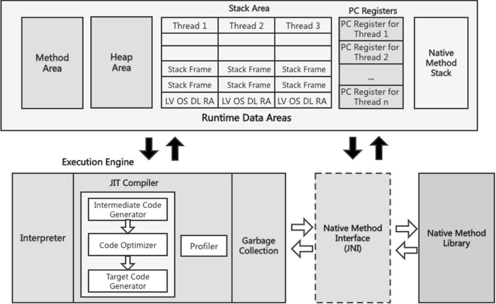

# 第5章 本地方法接口

​	虽然Java语言使用非常广泛，但是有些事务Java仍然无法处理。例如线程相关的功能，在线程类当中就有很多本地方法接口。那么Java如何来处理这些问题呢？Java设计师提出了一种解决方案就是本地方法接口。

## 5.1 本地方法接口概述

​	本地方法接口(Java Native Interface,JNI)在JVM中的位置，如图5-1所示。图中的虚线框区域就是本地方法接口，负责和本地方法库、JVM之间的交互。

本地方法接口

​	官方这样描述本地方法：“A method that is native andimplemented in platform-dependent code,typically written inanother programming language such as C.”意思是本地方法的实现一般是由其他语言编写的，比如可以使用C语言实现。我们可以理解为JNI就是使用Java语言调用非Java代码实现的接口。

​	  JNI可以帮助Java代码与使用其他编程语言（例如C、C++和汇编）编写的应用程序和库进行交互。这个特征并非Java所特有，许多编程语言都有这一机制，比如在C++中，可以用extern ''C''告知C++编译器去调用一个C语言的函数。在定义一个Native Method时，并不提供实现体（类似只定义了Java Interface），因为其实现体是由非Java语言在外面实现的。

​	JNI最重要的好处是它对底层JVM的实现没有任何限制。因此，JVM供应商可以添加对JNI的支持，而不会影响JVM的其他部分。

​	本地方法接口的作用是融合不同的编程语言为Java所用，它的初衷是融合C/C++程序。例如Object类的getClass()方法，它是有方法体的，不过方法体的具体实现并不是Java语言实现的，主要是C/C++语言实现的。

​	上面介绍了什么是Native Method，但是为什么要使用Native Method呢？下面将会从三个方面介绍Java中为什么使用Native Method。

1. 减少重复劳动。

​	有时Java应用需要与Java外面的环境交互，这是本地方法存在的主要原因。如果本地已经有一个用另一种语言编写的库，这时候希望通过某种方式使其可供Java代码访问，而不是重新使用Java语言编写一套功能一样的库，那么这种方式就是JNI。

2. 标准Java类库不支持应用程序所需的平台相关特性。

​	JVM支持Java语言本身和运行时库，它是Java程序赖以生存的平台，它由一个解释器（解释字节码）和一些连接到本地代码的库组成。然而不管怎样，它毕竟不是一个完整的系统，它经常依赖一些底层系统的支持，这些底层系统常常是强大的操作系统。通过本地方法，我们可以使用Java自身的JRE与底层系统进行交互，甚至JVM的部分实现就是用C语言编写的。还有，如果我们要使用一些Java语言本身没有提供封装的操作系统的特性时，也需要使用本地方法。

3. 性能要求。

​	假如想用较低级别的语言（例如汇编）实现一小部分性能要求严格的代码，这时候就可以使用到JNI了。

​	目前本地方法的使用越来越少，在企业级应用中已经比较罕见，除非是与硬件有关的应用，比如通过Java程序驱动打印机或者Java系统管理生产设备。因为现在的异构领域间的通信很发达，比如可以使用Socket通信，也可以使用Web Service，等等。