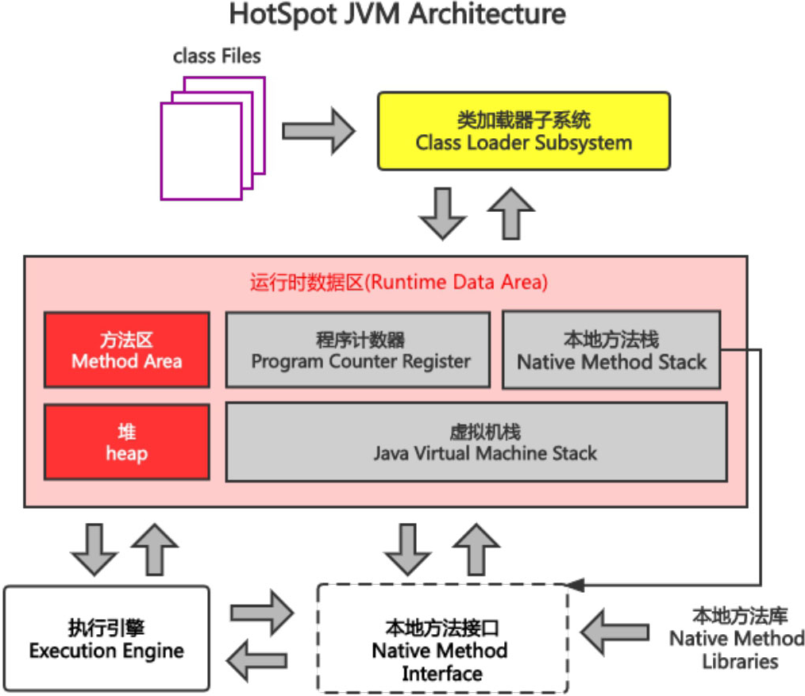
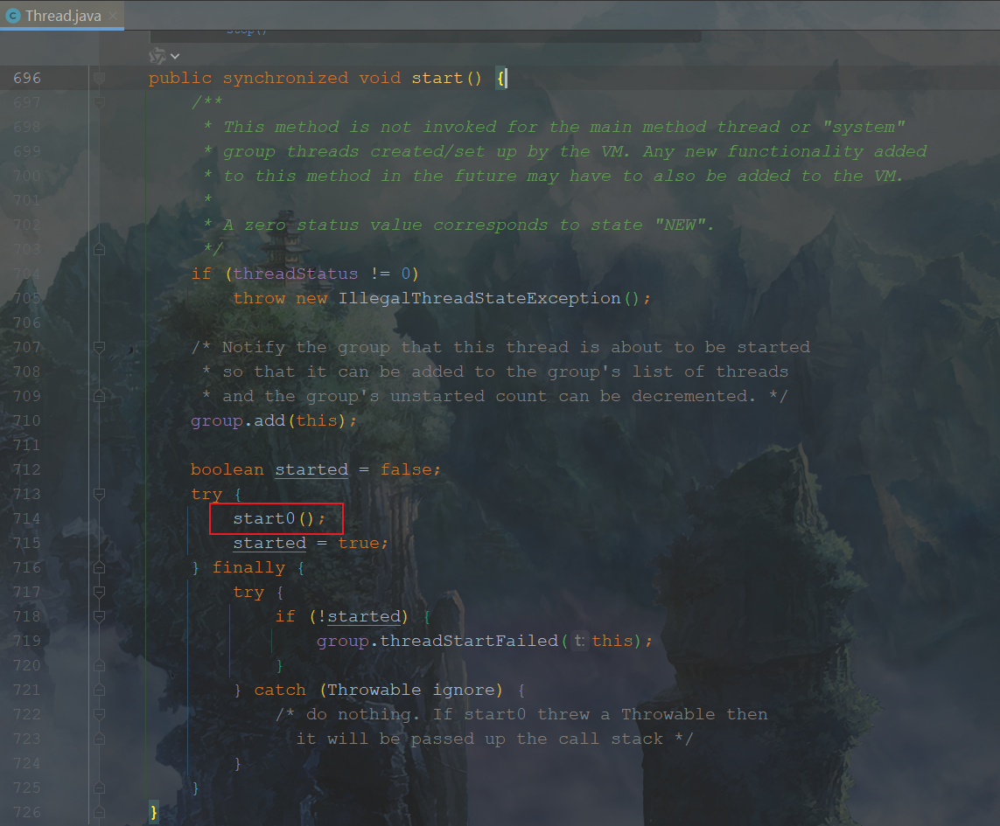

# 第6章 本地方法栈

## 6.1 本地方法栈概述

​	Java虚拟机实现可能会使用到传统的栈（通常称为C Stack）来支持本地方法（使用Java语言以外的其他语言编写的方法）的执行，这个栈就是本地方法栈(Native Method Stack)。

​	本地方法栈和Java虚拟机栈发挥的作用是类似的，它们直接的区别是Java虚拟机栈用于管理Java方法的调用，而本地方法栈用于管理本地方法的调用。

​	本地方法栈是线程私有的。本地方法栈的大小允许被实现成固定大小的或者是可动态扩展的。在内存溢出方面，它与Java虚拟机栈也是相同的。

​	如果线程请求分配的栈容量超过本地方法栈允许的最大容量，Java虚拟机将会抛出一个StackOverflowError异常。如果本地方法栈可以动态扩展，并且在尝试扩展的时候无法申请到足够的内存，或者在创建新的线程时没有足够的内存去创建对应的本地方法栈，那么Java虚拟机将会抛出一个OutOfMemoryError异常。它的具体做法是在Native Method Stack中登记本地方法，在Execution Engine执行时加载本地方法库。

本地方法栈

​	当某个线程调用一个本地方法时，它就进入了一个全新的并且不再受虚拟机限制的世界。它和虚拟机拥有同样的权限，如下3项表示本地方法可能涉及的权限调用。

​	本地方法可以通过本地方法接口来访问运行时数据区中的其他区域。

​	本地方法甚至可以直接使用本地处理器中的寄存器。

​	本地方法可以直接从本地内存的堆中分配任意数量的内存。

​	并不是所有的JVM都支持本地方法，因为Java虚拟机规范并没有明确要求本地方法栈的使用语言、具体实现方式、数据结构等。如果JVM产品不打算支持本地方法，也可以无须实现本地方法栈，如果支持本地方法栈，那这个栈一般会在线程创建的时候按线程分配。

​	在Java中，本地方法栈和虚拟机栈是如何关联的呢？如图6-2所示，当调用线程的start()方法的时候，在当前线程中开辟一个start()方法的栈帧并压入栈，在start()方法中又调用了start0()方法（图中画框处）。start0()方法是一个本地方法，所以start0()方法需要通过本地方法栈调用，可以使用动态链接的方式直接指向本地方法，由执行引擎来执行该本地方法。类似的案例还有Java应用中连接MySQL数据库或者Redis数据库等。

本地方法栈和虚拟机栈结合案例

