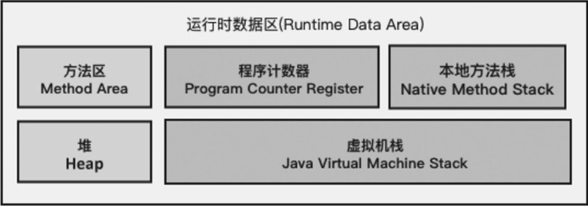
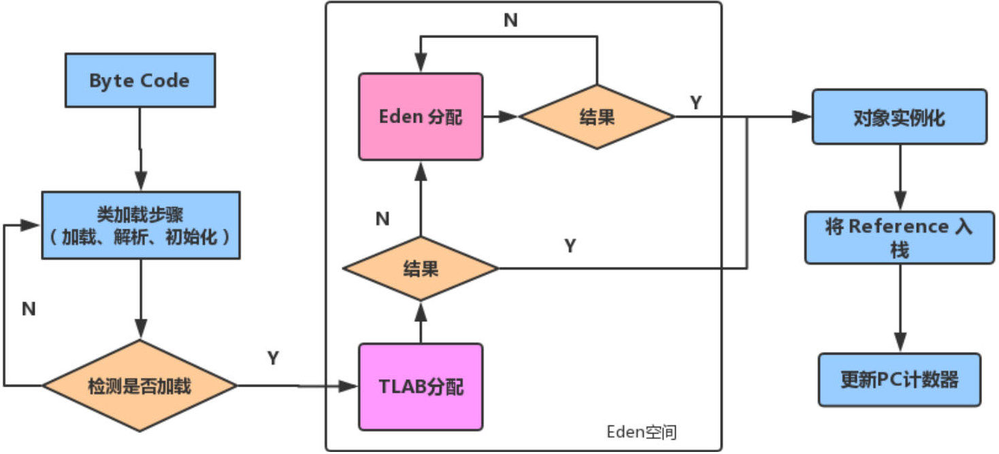
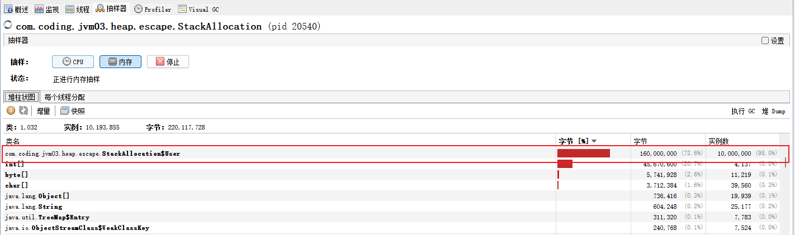

# 第7章 堆

​	栈是运行时的单位，栈解决程序的运行问题，即程序如何执行，或者说如何处理数据。栈中处理的数据主要来源于堆(Heap)，堆是存储的单位，堆解决的是数据存储的问题，即数据怎么放、放在哪儿。

- Java8及更高版本

```bash
Heap
 PSYoungGen      total 2560K, used 1764K [0x00000000ffd00000, 0x0000000100000000, 0x0000000100000000)
  eden space 2048K, 86% used [0x00000000ffd00000,0x00000000ffeb9138,0x00000000fff00000)
  from space 512K, 0% used [0x00000000fff80000,0x00000000fff80000,0x0000000100000000)
  to   space 512K, 0% used [0x00000000fff00000,0x00000000fff00000,0x00000000fff80000)
 ParOldGen       total 7168K, used 0K [0x00000000ff600000, 0x00000000ffd00000, 0x00000000ffd00000)
  object space 7168K, 0% used [0x00000000ff600000,0x00000000ff600000,0x00000000ffd00000)
 Metaspace       used 3212K, capacity 4496K, committed 4864K, reserved 1056768K
  class space    used 352K, capacity 388K, committed 512K, reserved 1048576K
```

- Java7及之前版本

```bash
Heap
 PSYoungGen      total 3072K, used 1325K [0x00000000ffc80000, 0x0000000100000000, 0x0000000100000000)
  eden space 2560K, 51% used [0x00000000ffc80000,0x00000000ffdcb7a8,0x00000000fff00000)
  from space 512K, 0% used [0x00000000fff80000,0x00000000fff80000,0x0000000100000000)
  to   space 512K, 0% used [0x00000000fff00000,0x00000000fff00000,0x00000000fff80000)
 ParOldGen       total 7168K, used 0K [0x00000000ff580000, 0x00000000ffc80000, 0x00000000ffc80000)
  object space 7168K, 0% used [0x00000000ff580000,0x00000000ff580000,0x00000000ffc80000)
 PSPermGen       total 21504K, used 2921K [0x00000000fa380000, 0x00000000fb880000, 0x00000000ff580000)
  object space 21504K, 13% used [0x00000000fa380000,0x00000000fa65a708,0x00000000fb880000)
```

​	现代垃圾收集器大部分都基于分代收集理论设计，堆空间细分为：

- Java7及之前堆内存逻辑上分为三部分：新生区+养老区+永久区。


| 位置划分                                              |        |            | 示例                                 |
| ----------------------------------------------------- | ------ | ---------- | ------------------------------------ |
| Young Generation Space √ 又被划分为Eden区和Survivor区 | 新生区 | Young/New  |                                      |
| Tenure Generation Space                               | 养老区 | Old/Tenure |                                      |
| Permanent Space                                       | 永久区 | Perm       | ‑XX:PermSize=64m ‑XX:MaxPermSize=64m |

- Java8及之后堆内存逻辑上分为三部分：新生区+养老区+元空间


| 位置划分                                              |        |            | 示例                                                         |
| ----------------------------------------------------- | ------ | ---------- | ------------------------------------------------------------ |
| Young Generation Space √ 又被划分为Eden区和Survivor区 | 新生区 | Young/New  | -XX:NewRatio=2，老年代/新生代的比例2:1 -XX:SurvivorRatio=8，Eden与Survivor比例，默认Eden占8/10 |
| Tenure Generation Space                               | 养老区 | Old/Tenure |                                                              |
| Meta Space                                            | 元空间 | Meta       | -XX:MetaspaceSize=64m -XX:MaxMetaspaceSize=64m               |

## 7.1 堆的核心概述

### 7.1.1 JVM实例与堆内存的对应关系

​	在JVM中，堆是各个线程共享的运行时内存区域，也是供所有类实例和数组对象分配内存的区域。<span style="color:#9400D3;">一个JVM实例只存在一个堆内存</span>。

​	堆也是Java内存管理的核心区域。堆在JVM启动的时候被创建，其空间大小也随之被确定。堆是JVM管理的最大一块内存空间，其大小是可以根据参数调节的，它可以处于物理上不连续的内存空间中，但在逻辑上应该被视为连续的。

<div style="text-align:center;font-weight:bold;">运行时数据区</div>



### 7.1.2 堆与栈的关系

​	堆中存放的是对象，栈帧中保存的是对象引用，这个引用指向对象在堆中的位置。

```java
public class SimpleHeap {
    private int id;

    public SimpleHeap(int id) {
        this.id = id;
    }

    public void show() {
        System.out.println("My ID is " + id);
    }

    public static void main(String[] args) {
        SimpleHeap s1 = new SimpleHeap(1);
        SimpleHeap s2 = new SimpleHeap(2);
        int[] arr = new int[10];
        Object[] arr1 = new Object[10];
    }
}
```

​	Java栈中的s1和s2分别是堆中s1实例和s2实例的引用。

<div style="text-align:center;font-weight:bold;">栈、堆关系</div>


### 7.1.3 JVM堆空间划分

​	在方法结束后，堆中的对象不会马上被移除，仅仅在垃圾收集的时候才会被移除。堆也是GC（Garbage Collector，垃圾收集器）执行垃圾回收的重点区域。现代垃圾收集器大部分都基于分代收集理论设计，这是因为堆内存也是分代划分区域的，堆内存分为新生代（又叫年轻代）和老年代。

1. 新生代，英文全称Young Generation Space，简称为Young或New。该区域又分为Eden区和Survivor区。Survivor区又分为Survivor0区和Survivor1区。Survivor0和Survivor1也可以叫作from区和to区，简写为S0区和S1区。
2. 老年代，也称为养老区，英文全称Tenured Generation Space，简称为Old或Tenured。

<div style="text-align:center;font-weight:bold;">堆内存的新生代和老年代</div>


## 7.2 设置堆内存大小与内存溢出

### 7.2.1 设置堆内存大小

​	Java堆区用于存储Java对象实例，堆的大小在JVM启动时就已经设定好了，可以通过JVM参数“-Xms”和“-Xmx”来进行设置。

​	一旦堆区中的内存大小超过“-Xmx”所指定的最大内存，将会抛出内存溢出异常(OutOfMemoryError,OOM）。

​	通常会将“-Xms”和“-Xmx”两个参数配置相同的值。否则，服务器在运行过程中，堆空间会不断地扩容与回缩，势必形成不必要的系统压力。所以在线上生产环境中，JVM的Xms和Xmx设置成同样大小，避免 在GC后调整堆大小时带来的额外压力。

​	初始内存大小占据物理内存大小的1/64。

​	最大内存大小占据物理内存大小的1/4。

- 查看堆区的默认配置大小

```java
public class HeapSpaceInitial {
    public static void main(String[] args) {
        // 返回Java虚拟机中的堆内存总量
        long initialMemory = Runtime.getRuntime().totalMemory() / 1024 / 1204;
        // 返回Java虚拟机试图使用的最大堆内存量
        long maxMemory = Runtime.getRuntime().maxMemory() / 1024 / 1024;

        System.out.println("-Xms:" + initialMemory + "M");
        System.out.println("-Xms:" + maxMemory + "M");

        System.out.println("系统内存大小为：" + initialMemory * 64.0 / 1024 + "G");
        System.out.println("系统内存大小为：" + maxMemory * 4.0 / 1024 + "G");

        /*try {
            Thread.sleep(1000000);
        } catch (InterruptedException e) {
            e.printStackTrace();
        }*/
    }
}
```

### 7.2.2 内存溢出案例

​	在堆内存区域最容易出现的问题就是OOM，下面我们通过代码演示：

- 堆内存溢出案例

```java
/**
 * VM options:  -Xms600m -Xmx600m
 *
 * 启动 jvisualvm 工具
 */
public class OOMTest {
    public static void main(String[] args) {
        ArrayList<Picture> list = new ArrayList<Picture>();
        while (true) {
            try {
                Thread.sleep(20);
            } catch (InterruptedException e) {
                e.printStackTrace();
            }
            list.add(new Picture(new Random().nextInt(1024 * 1024)));
        }
    }
}

class Picture {
    private byte[] pixels;

    public Picture(int length) {
        this.pixels = new byte[length];
    }
}
```

## 7.3 新生代与老年代

​	存储在JVM中的Java对象可以被划分为两类，分别是生命周期较短的对象和生命周期较长的对象。

​	生命周期较短的对象，创建和消亡都非常迅速。

​	生命周期较长的对象，在某些极端的情况下甚至与JVM的生命周期保持一致。

​	Java堆区分为新生代和老年代，生命周期较短的对象一般放在新生代，生命周期较长的对象会进入老年代。在堆内存中新生代和老年代的所占用的比例分别是多少呢？新生代与老年代在堆结构的占比可以通过参数“-XX:NewRatio”配置。默认设置是“-XX:NewRatio=2”，表示<span style="color:red;font-weight:bold;">新生代占比为1，老年代占比为2，即新生代占整个堆的1/3</span>。

<div style="text-align:center;font-weight:bold;">新生代与老年代占比图</div>


​	在HotSpot虚拟机中，新生代又分为一个Eden区和两个Survivor区，这三块区域在新生代中的占比也是可以通过参数设置的。<span style="color:red;font-weight:bold;">Eden区和两个Survivor区默认所占的比例是8:1:1</span>。但是大家查看时候发现Eden区和两个Survivor区默认所占的比例为6:1:1，这是因为JDK8的自适应大小策略导致的，JDK8默认使用UseParallelGC垃圾回收器，该垃圾回收器默认启动参数AdaptiveSizePolicy，该参数会根据垃圾收集的情况自动计算Eden区和两个Survivor区的大小。使用UseParallelGC垃圾回收器的情况下，如果想看到Eden区和两个Survivor区的比例为8:1:1的话，只能通过参数“-XX:SurvivorRatio”手动设置为8:1:1，或者直接使用CMS垃圾收集器。

​	参数“-XX:SurvivorRatio”可以设置Eden区和两个Survivor区比例。比如“-XX:SurvivorRatio=3”表示Eden区和两个Survivor区所占的比例是3:1:1。

​	IBM公司的专门研究表明，新生代中80%的对象都是“朝生夕死”的，表明大部分对象的产生和销毁都在新生代完成。所以某些情况下可以使用参数“-Xmn”设置新生代的最大内存来提高程序执行效率，一般来说这个参数使用默认值就可以了。

## 7.4 图解对象分配过程

​	为新对象分配内存是一件非常严谨和复杂的任务，JVM的设计者不仅需要考虑内存如何分配、在哪里分配等问题，并且由于内存分配算法与内存回收算法密切相关，所以还需要考虑GC执行完内存回收后，是否会在内存空间中产生内存碎片。内存具体分配过程有如下步骤。

1. new的对象先放Eden区，此区有大小限制。
2. 当Eden区的空间填满时，程序又需要创建对象，JVM的垃圾回收器将对Eden区进行垃圾回收（此时是YGC或者叫Minor GC），将Eden区中不再被其他对象所引用的对象进行销毁。再加载新的对象放到Eden区。
3. 然后将Eden区中的剩余对象移动到S0区，被移动到S0区的对象上有一个年龄计数器，值设置为1，如下图所示。浅色区域的对象被移动到S0区，深色区域的对象被销毁。

<div style="text-align:center;font-weight:bold;">Eden区将剩余对象移动到S0区</div>


4. 如果再次触发垃圾回收，此时垃圾收集器将对Eden区和S0区进行垃圾回收，没有被回收的对象就会移动到S1区，S0区移动过来的对象的年龄计数器变为2,Eden区转移过来的对象的年龄计数器为1。注意，此刻S0区中没有对象。如下图所示：

<div style="text-align:center;font-weight:bold;">Eden区、S0区将剩余对象移动到S1区</div>


5. 如果再次经历垃圾回收，此时没有被回收的对象会重新放回S0区，接着再去S1区，对象在S0区和S1区之间每移动一次，年龄计数器都会加1。

6. 什么时候能去老年代呢？可以通过参数：-XX:MaxTenuringThreshold=`<N>`对年龄计数器进行设置，默认是15，超过15的对象进入老年代，如图下图所示。

<div style="text-align:center;font-weight:bold;">S1区将年龄计数器为15的对象移动到Old区</div>


7. 在老年代，内存相对充足。当老年代内存不足时，再次触发GC，此时可能发生Major GC或者Full GC，进行老年代的内存清理。
8. 若老年代执行了Major GC之后发现依然无法进行对象的保存，就会产生OOM异常。

​	S0区、S1区之所以也被称为From区和To区，是因为对象总是从某个Survivor(From)区转移至另一个Survivor(To)区。正常来说，垃圾回收频率应该是频繁在新生代收集，很少在老年代收集，几乎不在永久代／元空间（方法区的具体体现）收集。对象在堆空间分配的流程，如图7-22所示，注意图中我们用YGC表示Young GC,FGC表示Full GC。

<div style="text-align:center;font-weight:bold;">对象分配流程图</div>


<span style="color:#40E0D0;">案例1：</span>

- 通过代码演示Eden区和两个Survivor区的变化规律

```java
/**
 * VM options:  -Xms600m -Xmx600m
 * 打开工具 jvisualvm
 */
public class HeapInstanceTest {
    byte[] buffer = new byte[new Random().nextInt(1024 * 1024)];

    public static void main(String[] args) {
        ArrayList<HeapInstanceTest> list = new ArrayList<HeapInstanceTest>();
        while (true) {
            list.add(new HeapInstanceTest());
            try {
                Thread.sleep(100);
            } catch (InterruptedException e) {
                e.printStackTrace();
            }
        }
    }
}
```

- 通过jvisualvm查看

​	当程序运行起来后可以用jvisualvm工具进行查看，可以看出新生代的Eden区达到上限的时候进行了一次Minor GC，将没有被回收的数据存放在S1区，当再次进行垃圾回收的时候，将Eden区和S1区没有被回收的数据存放在S0区。老年代则是在每次垃圾回收的时候，将S0区或S1区储存不完的数据存放在老年代，当每次垃圾进行回收后老年代的数据就会增加，增加到老年代的数据存不下的时候将会进行Major GC，进行垃圾回收之后发现老年代还是存不下的时候就会抛出OOM异常。

<div style="text-align:center;font-weight:bold;">程序运行时区域内存情况图</div>


<div style="text-align:center;font-weight:bold;">程序运行结果图</div>


## 7.5 Minor GC、Major GC、Full GC

### 7.5.1 GC的分类

​	JVM在进行GC时，并非每次都对上面三个内存区域（新生代、老年代和方法区）一起回收，大部分时候回收的都是新生代。

​	在HotSpot VM中，GC按照回收区域分为两种类型，分别是部分GC(Partial GC)和整堆GC(Full GC)。部分GC是指不完整收集整个Java堆，又细分为新生代GC、老年代GC和混合GC。

1. 新生代GC(Minor GC / Young GC)：只是新生代（Eden、S0和S1区）的垃圾收集。
2. 老年代GC(Major GC / Old GC)：只是老年代的垃圾收集。目前，<span style="color:#9400D3;">只有CMS GC会有单独收集老年代的行为</span>。很多时候Major GC会和Full GC混淆使用，需要具体分辨是老年代回收还是整堆回收。
3. 混合GC(Mixed GC)：收集整个新生代以及部分老年代的垃圾收集。目前，只有G1 GC会有这种行为。

​	整堆GC(Full GC)则指的是整个Java堆和方法区的垃圾收集。

### 7.5.2 分代式GC策略的触发条件

​	知道GC的分类后，什么时候触发GC呢？

​	**新生代GC(Minor GC)触发机制如下**。

1. 当新生代空间不足时，就会触发Minor GC，这里的新生代空间不足指的是Eden区的空间不足，Survivor区空间不足不会引发GC（每次Minor GC会清理新生代的内存）。
2. 因为Java对象大多都具备“朝生夕灭”的特性，所以Minor GC非常频繁，一般回收速度也比较快。这一定义既清晰又易于理解。
3. Minor GC会引发STW(Stop-The-World)，暂停其他用户的线程，等垃圾回收结束，用户线程才恢复运行。

​	**老年代GC(Major GC/Old GC)触发机制如下**。

1. 对象从老年代消失时，就会触发Major GC或Full GC。
2. 出现了Major GC，经常会伴随至少一次的Minor GC（但非绝对，在ParallelScavenge收集器的收集策略里就有直接进行Major GC的策略选择过程）。也就是在老年代空间不足时，会先尝试触发Minor GC。如果之后空间还不足，则触发Major GC。
3. Minor GC的速度一般会比Major GC快10倍以上，Major GC的STW时间更长。
4. 如果Major GC后内存还不足，就会报OOM了。

​	**Full GC触发机制有如下5种情况**。

1. 调用System.gc()时，系统建议执行Full GC，但是不必然执行
2. 老年代空间不足。
3. 方法区空间不足。
4. 老年代的最大可用连续空间小于历次晋升到老年代对象的平均大小就会进行FullGC。
5. 由Eden区、S0(From)区向S1(To)区复制时，如果对象大小大于S1区可用内存，则把该对象转存到老年代，且老年代的可用内存小于该对象大小。

​	Full GC是开发或调优中尽量要避免的，这样暂停时间会短一些。

### 7.5.3 GC举例

​	在数据的执行过程中，先把数据存放到Eden区，当Eden区空间不足时，进行新生代GC把数据存放到Survivor区。当新生代空间不足时，再把数据存放到老年代，当老年代空间不足时就会触发OOM。

<span style="color:#40E0D0;">案例1：</span>

- 代码

```java
/**
 * 测试MinorGC、MajorGC、FullGC
 * VM options: -Xms9m -Xmx9m -XX:+PrintGCDetails
 */
public class GCTest {
    public static void main(String[] args) {
        int i = 0;
        try {
            List<String> list = new ArrayList<String>();
            String a = "emon.com";
            while (true) {
                list.add(a);
                a = a + a;
                i++;
            }
        } catch (Exception e) {
            e.printStackTrace();
            System.out.println("遍历次数为：" + i);
        }
    }
}
```

- GC日志信息

<div style="text-align:center;font-weight:bold;">GC日志信息</div>


​	第一个标记框中的GC表示新生代GC，第二个和第三个表示整堆GC，最后一个标记框表示出现了OOM现象。

## 7.6 堆空间分代思想

​	为什么需要把Java堆分代？不分代就不能正常工作了吗？经研究，不同的对象生命周期不同。70%～99%的对象是临时对象。其实不分代完全可以，分代的唯一理由就是优化GC性能。如果没有分代，那所有的对象都在一块，就如同把一个学校的人都关在一个教室。GC的时候要找到哪些对象没用，这样就需要对堆的所有区域进行扫描。而很多对象都是“朝生夕死”的，如果分代的话，把新创建的对象放到某一地方，当GC的时候先把这块存储“朝生夕死”对象的区域进行回收，这样就会腾出很大空间。

## 7.7 堆中对象的分配策略

​	如果对象在Eden区出生，并经过第一次MinorGC后仍然存活，并且能被Survivor区容纳的话，将被移动到Survivor区中，并将对象年龄设为1。对象在Survivor区中每经过一次Minor GC，年龄就增加1岁，当它的年龄增加到一定程度时（默认为15岁，其实每个JVM、每个GC都有所不同），就会被晋升到老年代中。对象晋升老年代的年龄阈值，可以通过“-XX:MaxTenuringThreshold”来设置，也会有其他情况直接分配对象到老年代。对象分配策略如下所示。

1. 优先分配到Eden区。
2. 大对象直接分配到老年代，在开发过程中应尽量避免程序中出现过多的大对象。
3. 长期存活的对象分配到老年代。
4. 通过动态对象年龄判断，如果Survivor区中相同年龄的所有对象的大小总和大于Survivor区的一半，年龄大于或等于该年龄的对象可以直接进入老年代，无须等到MaxTenuringThreshold中要求的年龄。
5. 空间分配担保，使用参数-XX:HandlePromotionFailure来设置空间分配担保是否开启，但是JDK 6 Update 24该参数不再生效，JDK 6 Update 24之后版本的规则变为，只要老年代的连续空间大于新生代对象总大小或者历次晋升的平均大小，就会进行Minor GC，否则将进行Full GC。

<span style="color:#40E0D0;">案例1：大对象直接进入老年代</span>

- 代码

```java
/**
 * 测试：大对象直接进入老年代
 * VM options: -Xms60m -Xms60m -XX:NewRatio=2 -XX:SurvivorRatio=8 -XX:+PrintGCDetails
 */
public class YoungOldAreaTest {
    public static void main(String[] args) {
        byte[] buffer = new byte[1024 * 1024 * 20]; // 20m
    }
}
```

- 日志

<div style="text-align:center;font-weight:bold;">大对象直接进入老年代</div>


​	20M的数据出现在ParOldGen区也就是老年代，说明大对象在Eden区存不下，直接分配到老年代。

## 7.8 为对象分配内存：TLAB

​	程序中所有的线程共享Java中的堆区域，但是堆中还有一部分区域是线程私有，这部分区域称为线程本地分配缓存区(Thread Local Allocation Buffer,TLAB)。

​	TLAB表示JVM为每个线程分配了一个私有缓存区域，这块缓存区域包含在Eden区内。简单说TLAB就是在堆内存中的Eden区分配了一块线程私有的内存区域。什么是TLAB呢？

1. 从内存模型角度来看，新生代区域继续对Eden区域进行划分，JVM为每个线程分配了一个私有缓存区域。

<div style="text-align:center;font-weight:bold;">Eden区中各线程TLAB的分配情况</div>


2. 多线程同时分配内存时，使用TLAB可以避免一系列的非线程安全问题，同时还能够提升内存分配的吞吐量，因此我们可以将这种内存分配方式称为快速分配策略。
3. 所有Open JDK衍生出来的JVM都提供了TLAB的设计。

为什么有TLAB呢？原因如下。

1. 堆区是线程共享区域，任何线程都可以访问到堆区中的共享数据。
2. )由于对象实例的创建在JVM中非常频繁，因此在并发环境下从堆区中划分内存空间是线程不安全的。
3. 为避免多个线程操作同一地址，需要使用加锁等机制，进而影响分配速度。

​	尽管不是所有的对象实例都能够在TLAB中成功分配内存，但JVM确实是将TLAB作为内存分配的首选。在程序中，开发人员可以通过选项“-XX:+/-UseTLAB”设置是否开启TLAB空间。

<span style="color:#40E0D0;">案例1：</span>

- 代码

```java
/**
 * 测试 -XX:UseTLAB 是否开启的情况：默认情况是开启的
 * 打开工具 jvisualvm
 *
 * $ jinfo -flag UseTLAB 17284
 * -XX:+UseTLAB
 */
public class TLABArgsTest {
    public static void main(String[] args) {
        System.out.println("我只是来打个酱油~");
        try {
            Thread.sleep(1000000);
        } catch (InterruptedException e) {
            e.printStackTrace();
        }
    }
}
```

​	通过jinfo命令查看参数是否设置，UseTLAB前面如果有“+”号，证明TLAB是开启状态。

​	默认情况下，TLAB空间的内存非常小，仅占有整个Eden区的1%，我们可以通过选项“-XX:TLABWasteTargetPercent”设置TLAB空间所占用Eden区的百分比大小。

​	一旦对象在TLAB空间分配内存失败时，JVM就会尝试着通过使用加锁机制确保数据操作的原子性，从而直接在Eden区中分配内存。加上了TLAB之后的对象分配过程如下图所示。

<div style="text-align:center;font-weight:bold;">加入TLAB后的对象分配过程图</div>



## 7.9 堆空间的参数设置小结

| 参数                       | 作用                                                         |
| -------------------------- | ------------------------------------------------------------ |
| -XX:+PrintFlagsInitial     | 查看所有的参数的默认初始值。                                 |
| -XX:+PrintFlagsFinal       | 查看所有的参数的最终值（可能会存在修改，不再是初始值）。     |
| -Xms                       | 初始堆空间内存（默认为物理内存的1/64）。                     |
| -Xmx                       | 最大堆空间内存（默认为物理内存的1/4）。                      |
| -Xmn                       | 设置新生代的大小（初始值及最大值）。                         |
| -Xss                       | 设置栈空间大小。                                             |
| -XX:NewRatio               | 配置新生代与老年代在堆结构的占比。                           |
| -XX:SurvivorRatio          | 设置新生代中Eden和S0/S1空间的比例。                          |
| -XX:MaxTenuringThreshold   | 设置新生代垃圾的最大年龄。                                   |
| -XX:+PrintGCDetails        | 输出详细的GC处理日志。打印GC简要信息：① -XX:+PrintGC；② -verbose:gc。 |
| -XX:HandlePromotionFailure | 是否设置空间分配担保                                         |

​	-XX:HandlePromotionFailure：是否设置空间分配担保，在发生Minor GC之前，JVM会检查老年代最大可用的连续空间是否大于新生代所有对象的总空间。如果大于，则此次Minor GC是安全的；如果小于，则JVM会查看-XX:HandlePromotionFailure设置值是否允许担保失败。

​	参数HandlePromotionFailure设置策略如下。

1. 如果HandlePromotionFailure=true，那么会继续检查老年代最大可用连续空间是否大于历次晋升到老年代的对象的平均大小。
2. 如果大于，则尝试进行一次Minor GC，但这次Minor GC依然是有风险的。
3. 如果小于，则改为进行一次Full GC。

​	在JDK6 Update 24之后，HandlePromotionFailure参数不会再影响到虚拟机的空间分配担保策略，观察Open JDK中的源码变化，虽然源码中还定义了HandlePromotion Failure参数，但是在代码中已经不会再使用它。<span style="color:red;font-weight:bold;">JDK6 Update 24之后的规则变为只要老年代的连续空间大于新生代对象总大小或者历次晋升的平均大小</span>，就会进行Minor GC，否则将进行Full GC。

## 7.10 堆是否为分配对象存储的唯一选择

### 7.10.1 对象不一定存储在堆中

​	在《深入理解Java虚拟机》中关于Java堆内存有这样一段描述：“随着Java语言的发展，现在已经能看到有些许迹象表明日后可能出现值类型的支持，即使只考虑现在，由于即时编译技术的进步，尤其是逃逸分析技术的日益强大，<span style="color:#9400D3;">栈上分配、标量替换</span>等优化手段已经导致一些微妙的变化悄然发生，所以说Java对象实例都分配在堆上也渐渐变得不那么绝对了。”

​	在JVM中，对象是在Java堆中分配内存的，这是一个普遍的常识。但是，有一种特殊情况，那就是<span style="color:red;font-weight:bold;">如果经过逃逸分析(Escape Analysis)后发现，一个对象并没有逃逸出方法，那么就可能被优化成栈上分配</span>。这样就无须在堆上分配内存，也无须进行垃圾回收了。这也是最常见的堆外存储技术。

​	此外，前面提到的基于Open JDK深度定制的TaoBaoVM，其中创新的GCIH(GCInvisible Heap)技术实现off-heap，将生命周期较长的Java对象从Heap中移至 Heap外，并且GC不能管理GCIH内部的Java对象，以此达到降低GC回收频率和提升GC回收效率的目的。

### 7.10.2 逃逸分析概述

​	前面我们提到了对象经过逃逸分析，有可能把对象分配到栈上。也就是说如果将对象分配到栈，需要使用逃逸分析手段。

​	逃逸分析是一种可以有效减少Java程序中同步负载和内存堆分配压力的跨函数全局数据流分析算法。

​	通过逃逸分析，Java HotSpot编译器能够分析出一个新对象引用的使用范围，从而决定是否要将这个对象分配到堆上。逃逸分析的基本行为就是分析对象的动态作用域。

​	<span style="color:red;font-weight:bold;">当一个对象在方法中被定义后，若对象只在方法内部使用，则认为没有发生逃逸。</span>

​	<span style="color:red;font-weight:bold;">当一个对象在方法中被定义后，若它被外部方法所引用，则认为发生逃逸。例如作为调用参数传递到其他地方中。</span>

<span style="color:#40E0D0;">案例1：伪代码演示没有发生逃逸的对</span>

```java
public void my_method() {
    V v = new V();
    // ......
    v = null;
}
```

​	代码示例中的对象V的作用域只在method()方法区内，若没有发生逃逸，则可以分配到栈上，随着方法执行的结束，栈空间就被移除了。

<span style="color:#40E0D0;">案例2：演示发生逃逸的对象</span>

```java
public static StringBuffer createStringBuffer(String s1, String s2) [
    StringBuffer sb = new StringBuffer();
    sb.append(s1);
    sb.append(s2);
    return sb;
]
```

<span style="color:#40E0D0;">案例3：StringBuffer不发生逃逸</span>

```java
public static StringBuffer createStringBuffer(String s1, String s2) [
    StringBuffer sb = new StringBuffer();
    sb.append(s1);
    sb.append(s2);
    return sb.toString();
]
```

<span style="color:#40E0D0;">案例4：不同情景的逃逸分析</span>

```java
/**
 * 逃逸分析
 * 如何快速的判断是否发生了逃逸分析，大家就看new的对象是否有可能在方法外被调用。
 */
public class EscapeAnalysis {
    public EscapeAnalysis obj;

    /**
     * 方法返回EscapeAnalysis对象，发生逃逸。
     */
    public EscapeAnalysis getInstance() {
        return obj == null ? new EscapeAnalysis() : obj;
    }

    /**
     * 为成员属性赋值，发生逃逸
     */
    public void setObj() {
        this.obj = new EscapeAnalysis();
    }

    /**
     * 对象的作用域仅在当前方法中有效，没有发生逃逸
     */
    public void useEscapeAnalysis() {
        EscapeAnalysis e = new EscapeAnalysis();
    }

    /**
     * 引用成员变量的值，发生逃逸
     */
    public void useEscapeAnalysis1() {
        EscapeAnalysis e = getInstance();
    }
}
```

​	<span style="color:red;font-weight:bold;">在JDK 6u23版本之后，HotSpot中默认就已经开启了逃逸分析</span>。如果使用的是较早的版本，开发人员则可以通过以下参数来设置逃逸分析的相关信息。

1. 选项“-XX:+DoEscapeAnalysis”开启逃逸分析。
2. 选项“-XX:+PrintEscapeAnalysis”查看逃逸分析的筛选结果。

​	<span style="color:red;font-weight:bold;">一般在开发中能使用局部变量的，就不要使用在方法外定义。</span>

### 7.10.3 逃逸分析优化结果

​	使用逃逸分析，编译器可以对程序做如下优化。

1. 栈上分配。将堆分配转化为栈分配。针对那些作用域不会逃逸出方法的对象，在分配内存时不再将对象分配在堆内存中，而是将对象分配在栈上，这样，随着方法的调用结束，栈空间的回收也会回收掉分配到栈上的对象，不再给垃圾收集器增加额外的负担，从而提升应用程序整体性能。

2. 同步省略。如果一个对象被发现只能从一个线程被访问到，那么对于这个对象的操作可以不考虑同步。
3. 分离对象或标量替换。有的对象可能不需要作为一个连续的内存结构存在也可以被访问到，那么对象的部分（或全部）可以不存储在堆内存中，而是存储在栈中。

### 7.10.4 逃逸分析之栈上分配

​	JIT(Just In Time)编译器在编译期间根据逃逸分析的结果，发现如果一个对象没有逃逸出方法的话，就可能被优化成栈上分配。分配完成后，继续在调用栈内执行，最后线程结束，栈空间被回收，局部变量对象也被回收。这样就无须进行垃圾回收了。

​	<span style="color:red;font-weight:bold;">栈上分配（Stack Allocation）是指将对象分配在上，而不是在堆上。</span>

​	<span style="color:red;font-weight:bold;">‌栈上分配适用于那些不会逃逸的对象。通过将对象分配到线程栈上，可以减少堆的使用，减少垃圾回收的次数，提升性能。</span>

<span style="color:#40E0D0;">案例1：栈上分配测试</span>

- 代码

```java
/**
 * 堆上分配测试：
 * VM opotions: -Xms1G -Xmx1G -XX:-DoEscapeAnalysis -XX:+PrintGCDetails
 * 说明：通过指定 -XX:-DoEscapeAnalysis 和 -XX:+DoEscapeAnalysis 观察不同执行时间
 */
public class StackAllocation {
    public static void main(String[] args) {
        long start = System.currentTimeMillis();
        for (int i = 0; i < 10000000; i++) {
            alloc();
        }
        // 查看执行时间
        long end = System.currentTimeMillis();
        System.out.println("花费的时间为：" + (end - start) + " ms");

        // 为了方便查看堆内存中对象个数，线程sleep
        try {
            Thread.sleep(1000000);
        } catch (InterruptedException e) {
            e.printStackTrace();
        }
    }

    private static void alloc() {
        User user = new User();
    }

    static class User {
    }
}
```

- 未开启：未开启逃逸分析时创建1000万个User对象花费的时间为94ms

<div style="text-align:center;font-weight:bold;">未开启逃逸分析时创建1000万个对象所花费的时间</div>


​	未开启逃逸分析时User对象的实例数为1000万个。

<div style="text-align:center;font-weight:bold;">未开启逃逸分析时内存中User对象的实例数</div>



- 开启（默认行为）：

<div style="text-align:center;font-weight:bold;">开启逃逸分析后所花费的时间</div>


​	开启逃逸分析后当前内存中有124752个对象，堆内存中不再维护1000万个对象。

<div style="text-align:center;font-weight:bold;">开启逃逸分析后内存中User对象的实例数</div>


### 7.10.5 逃逸分析之同步省略

​	线程同步的代价是相当高的，同步的后果是降低了并发性和性能。在动态编译同步块的时候，JIT编译器可以借助逃逸分析，来判断同步块所使用的锁对象是否只能够被一个线程访问而没有被发布到其他线程。如果没有，那么JIT编译器在编译这个同步块的时候就会取消对这部分代码的同步，这样就能大大提高并发性和性能。这个取消同步的过程就叫同步省略，也叫锁消除。

<span style="color:#40E0D0;">案例1：同步省略</span>

- 代码

```java
/**
 * 同步省略说明
 */
public class SynchronizedTest {

    public static void main(String[] args) {
        Object hollis = new Object();
        synchronized (hollis) {
            System.out.println(hollis);
        }
    }
}
```

​	代码中对hollis对象进行加锁，但是hollis对象的生命周期只在f()方法中，并不会被其他线程访问，所以在JIT编译阶段就会被优化掉。

​	当代码中对hollis这个对象进行加锁时的字节码文件如图7-34所示。同步省略是将字节码文件加载到内存之后才进行的，所以当我们查看字节码文件的时候仍然能看到synchronized的身影，在字节码文件中体现为monitorenter和monitorexit。

<div style="text-align:center;font-weight:bold;">同步省略锁机制说明</div>


<span style="color:#40E0D0;">案例2：优化后的代码</span>

```java
/**
 * 同步省略说明
 */
public class SynchronizedTest {

    public static void main(String[] args) {
        Object hollis = new Object();
        System.out.println(hollis);
    }
}
```

### 7.10.6 逃逸分析之标量替换

​	标量(Scalar)是指一个无法再分解成更小数据的数据。Java中的原始数据类型就是标量。相对的，那些还可以分解的数据叫作聚合量(Aggregate)，Java中的对象就是聚合量，因为它可以分解成其他聚合量和标量。

​	<span style="color:#9400D3;">在JIT编译器的编译阶段，如果经过逃逸分析，发现一个对象不会被外界访问的话，那么经过JIT优化，就会把这个对象拆解成若干个成员变量。这个过程就是标量替换</span>。

​	<span style="color:red;font-weight:bold;">标量替换（Scalar Replacement）是指将对象的部分或全部成员变量替换为基本数据类型</span>。

​	<span style="color:red;font-weight:bold;">标量替换适用于那些可以被拆分成多个标量的对象。通过将对象的成员变量替换为基本数据类型，可以减少对象的创建和销毁，进一步减少内存的使用和垃圾回收的负担。</span>

<span style="color:#40E0D0;">案例1：标量替换</span>

- 代码

```java
public static void main(String[] args) {
    alloc();
}
private static void alloc() {
    Point point = new Point(1,2);
    System.out.println("point.x="+point.x+"; point.y="+point.y);
}
class Point {
    private int x;
    private int y;
}
```

​	以上代码经过标量替换后，就会变成如下效果。

- 代码

```java
private static void alloc() {
    int x = 1;
    int y = 2;
    System.out.println("point.x="+point.x+"; point.y="+point.y);
}
```

​	可以看到，point这个聚合量经过逃逸分析后，并没有逃逸就被替换成两个聚合量了。那么标量替换有什么好处呢？就是可以大大减少堆内存的占用。因为一旦不需要创建对象了，那么就不再需要分配堆内存了。标量替换为栈上分配提供了很好的基础。

​	通过参数-XX:+EliminateAllocations可以开启标量替换（默认打开），允许将对象打散分配在栈上。下面代码展示了标量替换之后对性能的优化效果。

<span style="color:#40E0D0;">案例2：标量替换性能优化测试</span>

- 代码：关闭标量替换

```java
/**
 * VM options: -server -Xms100m -Xmx100m -XX:+DoEscapeAnalysis -XX:+PrintGC -XX:-EliminateAllocations
 * 注意，HotSpot虚拟机默认是server模式，所以 -server 可省略的
 */
public class ScalarReplace {

    public static class User {
        public int id;
        public String name;
    }

    public static void alloc() {
        User u = new User(); // 未发生逃逸
        u.id = 5;
        u.name = "emon.com";
    }

    public static void main(String[] args) {
        long start = System.currentTimeMillis();
        for (int i = 0; i < 10000000; i++) {
            alloc();
        }
        // 查看执行时间
        long end = System.currentTimeMillis();
        System.out.println("花费的时间为：" + (end - start) + " ms");
    }
}
```

<div style="text-align:center;font-weight:bold;">未开启标量替换时程序运行的时间</div>


<div style="text-align:center;font-weight:bold;">开启标量替换时程序运行的时间</div>


​	开启标量替换时明显可以看出代码运行的时间减少了很多，同时也没有发生GC操作。

​	上述代码在主函数中调用了1千万次alloc()方法。调用alloc()方法的时候创建对象，每个User对象实例需要占据约16字节的空间，因此调用1亿次alloc()方法总共需要大约150MB内存空间。如果堆空间小于这个值，就必然会发生GC，所以当堆空间设置为100MB并且关闭标量替换的时候，发生了GC。

### 7.10.7 逃逸分析小结：逃逸分析并不成熟

​	关于逃逸分析的论文在1999年就已经发表了，但直到JDK 1.6才有实现，而且这项技术到如今也并不是十分成熟。

​	其根本原因就是无法保证逃逸分析的性能收益一定能高于它的消耗。虽然经过逃逸分析可以做标量替换、栈上分配和锁消除，但是逃逸分析自身也需要进行一系列复杂分析，这其实也是一个相对耗时的过程。一个极端的例子就是经过逃逸分析之后，发现所有对象都是逃逸的，那这个逃逸分析的过程就白白浪费掉了。

​	虽然这项技术并不十分成熟，但是它也是即时编译器优化技术中一个十分重要的手段。有一些观点认为，通过逃逸分析JVM会在栈上分配那些不会逃逸的对象，这在理论上是可行的，但是取决于JVM设计者的选择。<span style="color:red;font-weight:bold;">Oracle Hotspot JVM中并未实现栈上分配，上面案例测试的效果都是基于标量替换实现的，这一点在逃逸分析相关的文档里已经说明，对象被标量替换以后便不再是对象了，所以可以明确所有的对象实例都创建在堆上</span>。

​	<span style="color:#9400D3;font-weight:bold;">目前很多书籍还是基于JDK 7以前的版本。JDK 8和之后的版本中内存分配已经发生了很大变化。比如intern字符串的缓存和静态变量曾经都被分配在永久代上，而永久代已经被元空间取代。但是JDK 8和之后的版本中intern字符串缓存和静态变量并不是被转移到元空间，而是直接在堆上分配。所以这一点同样符合前面的结论：对象实例都是分配在堆上。</span>