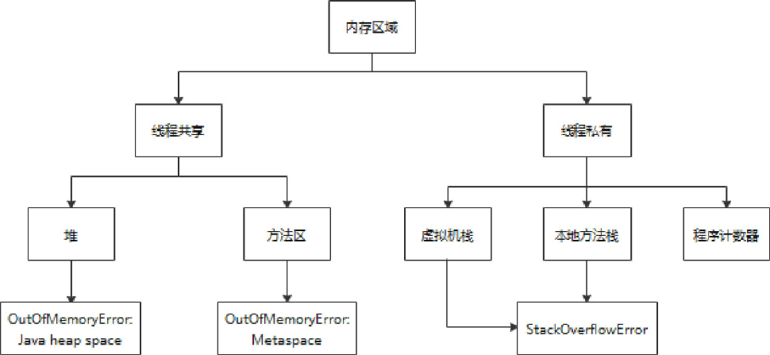
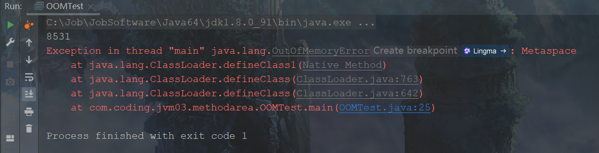
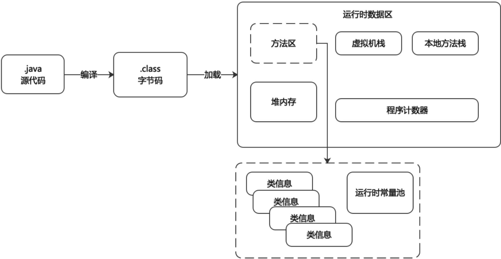
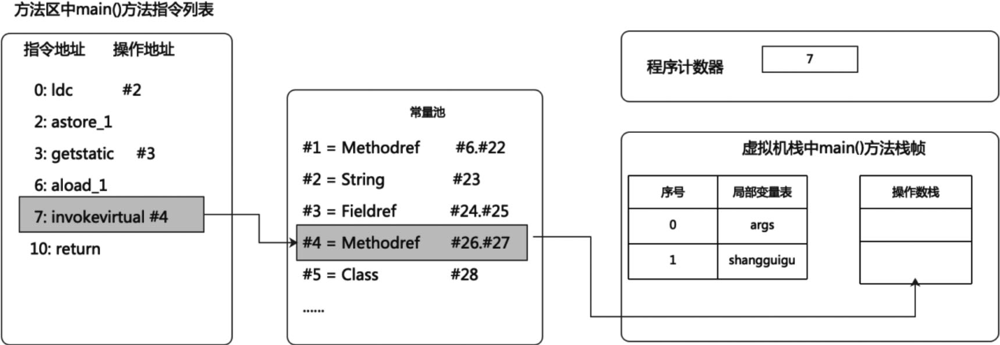
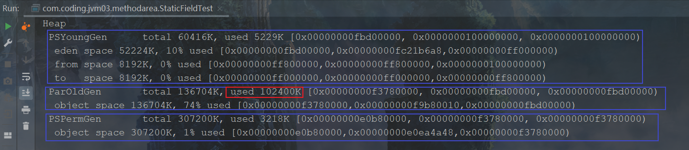

# 第8章 方法区

## 8.1 栈、堆、方法区的交互关系

​	针对HotSpot虚拟机，从内存结构上看运行时数据区包含本地方法栈、程序计数器、虚拟机栈、堆和方法区。

<div style="text-align:center;font-weight:bold;">运行时数据区中的方法区</div>


​	上面是从内存结构的角度看方法区在运行时数据区所处的位置，下面从线程共享与否的角度来看运行时数据区的划分，如下图所示：

<div style="text-align:center;font-weight:bold;">内存区域的划分</div>




​	栈、堆、方法区三者之间的交互关系如下图所示，从最简单的代码角度出发，当前声明的变量是Student类型的student，把整个Student类的结构加载到方法区，把变量student放到虚拟机栈中，new的对象放到java堆中。

<div style="text-align:center;font-weight:bold;">栈、堆、方法区交互关系的实例图</div>


​	在虚拟机栈局部变量表中存放的是各个变量，其中reference区域就相当于上图中的student变量，引用类型reference指向了堆空间中对象的实例数据，在堆的对象实例数据中有一个到对象类型数据的指针，这个指针指向了方法区中对象类型的数据。如下图所示：

<div style="text-align:center;font-weight:bold;">栈、堆、方法区内存结构关系图</div>


## 8.2 方法区的理解

### 8.2.1 方法区的官方描述

[方法区官方描述](https://docs.oracle.com/javase/specs/jvms/se8/html/jvms-2.html#jvms-2.5.4)

​	在JVM中，方法区是可供各个线程共享的运行时内存区域。方法区与传统语言中的编译代码存储区或者操作系统进程的正文段的作用非常类似，它存储了每一个类的结构信息，例如，运行时常量池(Runtime ConstantPool)、字段和方法数据、构造函数和普通方法的字节码内容，还包括一些在类、实例、接口初始化时用到的特殊方法。

​	方法区在虚拟机启动的时候创建，虽然方法区是堆的逻辑组成部分，但是简单的虚拟机实现可以选择在这个区域不实现垃圾收集和压缩。Java 8的虚拟机规范也不限 定实现方法区的内存位置和编译代码的管理策略。方法区的容量可以是固定的，也可以随着程序执行的需求动态扩展，并在不需要太多空间时自动收缩。方法区在实际内存空间中可以是不连续的。

​	Java虚拟机规范中明确说明：“尽管所有的方法区在逻辑上是属于堆的一部分，但一些简单的实现可能不会选择去进行垃圾收集或者进行压缩。”但对于HotSpot虚拟机而言，方法区还有一个别名叫作Non-Heap（非堆），目的就是要和堆区分开。所以，方法区可以看作是一块独立于Java堆的内存空间。

<div style="text-align:center;font-weight:bold;">运行时数据区中方法区的所在位置</div>


### 8.2.2 方法区的基本理解

​	对于方法区的理解我们要注意以下几个方面。

1. 方法区(Method Area)与堆一样，是各个线程共享的内存区域。
2. 方法区在JVM启动的时候被创建，并且它实际的物理内存空间和虚拟机堆区一样都可以是不连续的。
3. 方法区的大小跟堆空间一样，可以选择固定大小或者可扩展。方法区的大小决定了系统可以保存多少个类。如果系统定义了太多的类，导致方法区溢出，虚拟机同样会抛出内存溢出错误，如java.lang.OutOfMemoryError:PermGen space或者java.lang.OutOfMemoryError:Metaspace。

​	以下情况都可能导致方法区发生OOM异常：加载大量的第三方jar包、Tomcat部署的工程过多（30～50个）或者大量动态地生成反射类。关闭JVM就会释放这个区域的内存。

### 8.2.3 JDK中方法区的变化

​	在JDK 7及以前，习惯上把方法区称为永久代。但是JDK 8移除了永久代，官方说明[为什么移除永久代](https://openjdk.org/jeps/122)。

​	为什么会有上面的变化呢？Java虚拟机规范对如何实现方法区，不做统一要求，例如BEA JRockit和IBM J9等虚拟机中不存在永久代的概念。JDK 7及之前的HotSpot虚拟机把垃圾收集扩展到永久代，这样HotSpot虚拟机就可以像管理堆一样管理永久代，不需要单独针对方法区写内存管理代码了。现在看来，让虚拟机管理永久代内存并不是很好的想法，因为永久代很容易让Java程序发生内存溢出（超过-XX:MaxPermSize上限）。而BEA JRockit和IBM J9虚拟机是在本地内存中实现的方法区，只要没有触碰到进程可用的内存上限就不会出问题。借鉴BEAJRockit虚拟机对于方法区的实现，HotSpot虚拟机在JDK 8也完全废弃了永久代的概念，取而代之的是在本地内存中实现的元空间(Metaspace）。

<div style="text-align:center;font-weight:bold;">JDK 7中的方法区实现：永久</div>


<div style="text-align:center;font-weight:bold;">JDK 8中的方法区实现：元空间</div>


​	元空间的本质和永久代类似，都是对JVM规范中方法区的实现。不过元空间与永久代最大的区别在于元空间不在虚拟机设置的内存中，而是在本地内存。另外，永久代、元空间二者并不只是名字变了，内部结构也调整了，稍后会做介绍。

​	根据Java虚拟机规范的规定，如果方法区无法满足新的内存分配需求，将抛出OOM异常。

## 8.3 设置方法区大小与OOM

### 8.3.1 设置方法区内存的大小

​	方法区的大小不必是固定的，JVM可以根据应用的需要动态调整，下面根据JDK版本来分别说明方法区的大小设置和注意事项。

​	JDK 7及以前的方法区相关设置如下。

1. 通过-XX:PermSize参数设置永久代初始分配空间。

```bash
$ jinfo -flag PermSize <pid>
```

2. 通过-XX:MaxPermSize参数设置永久代最大可分配空间。32位机器默认是64MB,64位机器模式是82MB，当JVM加载的类信息容量超过了该值，会报异常OutOfMemoryError:PermGen space。

```bash
$ jinfo -flag MaxPermSize <pid>
```

​	8及以后方法区相关设置如下。

​	元空间大小可以使用参数-XX:MetaspaceSize和-XX:MaxMetaspaceSize指定，替代JDK7中的永久代的初始值和最大值。默认值依赖于具体的系统平台，取值范围是12～20MB。例如在Windows平台下，-XX:MetaspaceSize默认大约是20MB，如果-XX:MaxMetaspaceSize的值是-1，表示没有空间限制。与永久代不同，如果不指定大小，在默认情况下，虚拟机会耗尽所有的可用系统内存。如果元空间发生溢出，虚拟机一样会抛出异常OutOfMemoryError:Metaspace。

```bash
$ jinfo -flag MetaspaceSize <pid>
$ jinfo -flag MaxMetaspaceSize <pid>
```

​	假设-XX:MetaspaceSize默认值为20MB，这是初始的高水位线，一旦方法区内存使用触及这个水位线，Full GC将会被触发并卸载没用的类（包括这些类对应的类加载器也不再存活）。垃圾收集后，高水位标记可能会根据类元数据释放的空间量自动提高或降低，如果释放的空间很少，那么在不超过MaxMetaspaceSize时，该值会被提高，以免过早引发下一次垃圾收集。如果释放空间过多，那么该值会被降低。如果初始化的高水位线设置过低，上述高水位线调整情况会发生很多次。通过垃圾回收器的日志可以观察到Full GC多次调用。为了避免频繁GC，建议将-XX:MetaspaceSize设置为一个相对较高的值。

<span style="color:#40E0D0;">案例1：JDK 8中方法区内存设</span>

- 代码

```java
/**
 * 测试设置方法区大小参数的默认值
 * VM options: -Xms600m -Xmx600m
 * jdk7及以前：
 * ‑XX:PermSize=100m ‑XX:MaxPermSize=100m
 * jdk8及以后：
 * -XX:MetaspaceSize=100m -XX:MaxMetaspaceSize=100m
 * <p>
 * $ jinfo -flag PermSize 12516
 * -XX:PermSize=21757952=20.75M
 * $ jinfo -flag MaxPermSize 12516
 * -XX:MaxPermSize=85983232=82M
 * <p>
 * $ jinfo -flag MetaspaceSize 6148
 * -XX:MetaspaceSize=21807104=20.79
 * $ jinfo -flag MaxMetaspaceSize 6148
 * -XX:MaxMetaspaceSize=18446744073709486080
 */
public class MethodAreaDemo {
    public static void main(String[] args) {
        System.out.println("start...");
        try {
            Thread.sleep(1000000);
        } catch (InterruptedException e) {
            e.printStackTrace();
        }
        System.out.println("end...");
    }
}
```

​	在JDK 8及以上版本中，设定MaxPermSize参数，JVM在启动时并不会报错，但是会提示如下信息。

```bash
Java HotSpot(TM) 64-Bit Server VM warning: ignoring option PermSize=100m; support was removed in 8.0
```

### 8.3.2 方法区内存溢出

​	当方法区发生内存溢出的时候，我们应该怎么去解决呢？下面举例展示如何解决方法区内存溢出，将JDK 7版本的永久代大小设置为5MB，将JDK 8版本的方法区空间大小设置为10MB，分别查看加载多少类的时候发生内存溢出。

<span style="color:#40E0D0;">案例1：方法区内存溢出</span>

```java
import com.sun.xml.internal.ws.org.objectweb.asm.ClassWriter;
import com.sun.xml.internal.ws.org.objectweb.asm.Opcodes;

/**
 * jdk6中：
 * -XX:PermSize=10m -XX:MaxPermSize=10m
 * jdk8中：
 * -XX:MetaspaceSize=10m -XX:MaxMetaspaceSize=10m
 */
public class OOMTest extends ClassLoader {
    public static void main(String[] args) {
        int j = 0;
        try {
            OOMTest test = new OOMTest();
            for (int i = 0; i < 10000; i++) {
                // 创建ClassWrite对象，用于生成类的二进制字节码
                ClassWriter classWriter = new ClassWriter(0);
                // 知名版本号，修饰符，类名，包名，父类，接口
                classWriter.visit(Opcodes.V1_6, Opcodes.ACC_PUBLIC, "class" + i, null, "java/lang/Object", null);
                // 返回byte[]
                byte[] code = classWriter.toByteArray();
                // 类的加载
                test.defineClass("class" + i, code, 0, code.length); // class对象
                j++;
            }
        } finally {
            System.out.println(j);
        }
    }
}
```

<div style="text-align:center;font-weight:bold;">JDK6中出现的方法区内存溢出异常</div>


<div style="text-align:center;font-weight:bold;">JDK8中出现的方法区内存溢出异常</div>



## 8.4 方法区的内部结构

​	方法区内部结构如下图所示。Java源代码编译之后生成class文件，经过类加载器把class文件中的内容加载到JVM运行时数据区。class文件中的一部分信息加载到方法区，比如类class、接口interface、枚举enum、注解annotation以及运行时常量池等类型信息。

<div style="text-align:center;font-weight:bold;">方法区内部结构图</div>



​	上面我们从类加载到运行时数据区的角度说明了方法区什么时候放入数据，下面我们比较详细地说明方法区中存放什么样的数据。方法区和Java堆一样，是各个线程共享的内存区域，<span style="color:#9400D3;">它用于存储已被虚拟机加载的类型信息、常量、静态变量、即时编译器编译后的代码缓存等</span>。

<div style="text-align:center;font-weight:bold;">方法区内部存储信息图</div>


​	接下来对方法区中存储的内容信息分别详细说明。

### 8.4.1 类型信息、域信息和方法信息介绍

​	下面我们先介绍类型信息、域信息和方法信息中存储的内容分别是什么。

**1 类型信息**

​	对每个加载的类型（类class、接口interface、枚举enum、注解annotation），JVM必须在方法区中存储以下类型信息。

- 完整有效全类名，包括包名和类名。
- 直接父类的完整有效名（对于interface或是java.lang.Object，都没有父类）。
- 修饰符（public、abstract、final的某个子集）。
- 直接接口的一个有序列表。

**2 域信息**

​	JVM必须在方法区中保存类型的所有域的相关信息以及域的声明顺序。域的相关信息包括域名称、域类型、域修饰符（public、private、protected、static、final、volatile、transient的某个子集）。

**3 方法信息**

​	JVM必须保存所有方法的以下信息，同域信息一样包括声明顺序。

- 方法名称。
- 方法的返回类型（或void）。
- 方法参数的数量和类型（按顺序）。
- 方法的修饰符（public、private、protected、static、final、synchronized、native、abstract的一个子集）。
- 方法的字节码(bytecodes)、操作数栈深度、局部变量表大小（abstract和native方法除外）。
- 异常表（abstract和native方法除外），异常表会记录每个异常处理的开始位置、结束位置、代码处理在程序计数器中的偏移地址、被捕获的异常类的常量池索引。

<span style="color:#40E0D0;">案例1：方法区内部构成</span>

- 代码

```java
/**
 * 测试方法区的内部构成
 * <p>
 * $ javap -v -p MethodInnerStrucTest.class
 * <p>
 * -v  -verbose             输出附加信息
 * -p  -private             显示所有类和成员
 */
public class MethodInnerStrucTest extends Object implements Comparable<String>, Serializable {
    // 属性
    public int num = 10;
    private static String str = "测试方法的内部结构";

    // 构造器
    // 方法
    public void test1() {
        int count = 20;
        System.out.println("count = " + count);
    }

    public static int test2(int cal) {
        int result = 0;
        try {
            int value = 30;
            result = value / cal;
        } catch (Exception e) {
            e.printStackTrace();
        }
        return result;
    }

    @Override
    public int compareTo(String o) {
        return 0;
    }
}
```

​	上述代码的class文件经反编译（使用命令`javap -v -p MethodInnerStrucTest.class`）之后的类型信息如下所示，可以看到完整有效全类名为com.atguigu.MethodInnerStrucTest；父类为java.lang.Object；实现的接口为java.lang.Comparable`<java.lang.String>`；修饰符为public。

```java
public class com.coding.jvm03.methodarea.MethodInnerStrucTest extends java.lang.Object implements java.lang.Comparable<java.lang.String>, java.io.Serializable
```

​	上述代码的class文件经反编译之后的域信息如下所示，其中包含两个域信息，分别是num和str。首先分析num的各项信息，num为域名称、I表示域类型为Integer、ACC_PUBLIC表示域修饰符为public。接着分析str的各项信息，str为域名称、Ljava/lang/String表示域类型为String、ACC_PRIVATE和ACC_STATIC表示域修饰符为private static。

```java
  public int num;
    descriptor: I
    flags: ACC_PUBLIC

  private static java.lang.String str;
    descriptor: Ljava/lang/String;
    flags: ACC_PRIVATE, ACC_STATIC
```

​	上述代码的class文件经反编译之后的test1()方法信息如下所示，可以看到方法名称是test1();()V表示返回值是void；该方法没有参数，所以没有参数名称和类型；ACC_PUBLIC表示方法修饰符是public;Code后面的字节码包括方法的字节码指令、操作数栈深度为3、局部变量表大小为2。

```java
  public void test1();
    descriptor: ()V
    flags: ACC_PUBLIC
    Code:
      stack=3, locals=2, args_size=1
         0: bipush        20
         2: istore_1
         3: getstatic     #3                  // Field java/lang/System.out:Ljava/io/PrintStream;
         6: new           #4                  // class java/lang/StringBuilder
         9: dup
        10: invokespecial #5                  // Method java/lang/StringBuilder."<init>":()V
        13: ldc           #6                  // String count =
        15: invokevirtual #7                  // Method java/lang/StringBuilder.append:(Ljava/lang/String;)Ljava/lang/StringBuilder;
        18: iload_1
        19: invokevirtual #8                  // Method java/lang/StringBuilder.append:(I)Ljava/lang/StringBuilder;
        22: invokevirtual #9                  // Method java/lang/StringBuilder.toString:()Ljava/lang/String;
        25: invokevirtual #10                 // Method java/io/PrintStream.println:(Ljava/lang/String;)V
        28: return
      LineNumberTable:
        line 21: 0
        line 22: 3
        line 23: 28
      LocalVariableTable:
        Start  Length  Slot  Name   Signature
            0      29     0  this   Lcom/coding/jvm03/methodarea/MethodInnerStrucTest;
            3      26     1 count   I
```

​	除了test1()方法外，大家可以看到反编译文件中还有一个方法叫作MethodInnerStruc Test()，我们知道Java中如果不手动定义构造方法的话，Java默认会提供一个无参的构造方法，在class文件反编译之后，可以看到无参构造方法信息如下所示。

```java
  public com.coding.jvm03.methodarea.MethodInnerStrucTest();
    descriptor: ()V
    flags: ACC_PUBLIC
    Code:
      stack=2, locals=1, args_size=1
         0: aload_0
         1: invokespecial #1                  // Method java/lang/Object."<init>":()V
         4: aload_0
         5: bipush        10
         7: putfield      #2                  // Field num:I
        10: return
      LineNumberTable:
        line 13: 0
        line 15: 4
      LocalVariableTable:
        Start  Length  Slot  Name   Signature
            0      11     0  this   Lcom/coding/jvm03/methodarea/MethodInnerStrucTest;
```

​	最后，我们看到test2()方法的信息中还存在一个异常表，如下所示，其中Exception table表示异常表。

```java
  public static int test2(int);
    descriptor: (I)I
    flags: ACC_PUBLIC, ACC_STATIC
    Code:
      stack=2, locals=3, args_size=1
         0: iconst_0
         1: istore_1
         2: bipush        30
         4: istore_2
         5: iload_2
         6: iload_0
         7: idiv
         8: istore_1
         9: goto          17
        12: astore_2
        13: aload_2
        14: invokevirtual #12                 // Method java/lang/Exception.printStackTrace:()V
        17: iload_1
        18: ireturn
      Exception table:
         from    to  target type
             2     9    12   Class java/lang/Exception
      LineNumberTable:
        line 26: 0
        line 28: 2
        line 29: 5
        line 32: 9
        line 30: 12
        line 31: 13
        line 33: 17
      LocalVariableTable:
        Start  Length  Slot  Name   Signature
            5       4     2 value   I
           13       4     2     e   Ljava/lang/Exception;
            0      19     0   cal   I
            2      17     1 result   I
      StackMapTable: number_of_entries = 2
        frame_type = 255 /* full_frame */
          offset_delta = 12
          locals = [ int, int ]
          stack = [ class java/lang/Exception ]
        frame_type = 4 /* same */
```

### 8.4.2 类变量和常量

​	static修饰的成员变量为类变量或者静态变量，静态变量和类关联在一起，随着类的加载而加载。类变量被类的所有实例共享，即使没有类实例时也可以访问它。

​	在JDK 7之前类变量也是方法区的一部分，JDK 7及以后的JDK类变量放在了堆空间。此外，使用final修饰的成员变量表示常量，使用static final修饰的成员变量称为静态常量，静态常量和静态变量的区别是静态常量在编译期就已经为其赋值。

<span style="color:#40E0D0;">案例1：静态常量和静态变量的区别</span>

- 代码

```java
public class MethodAreaTest {
    public static void main(String[] args) {
        // 惊不惊喜意不意外，不异常
        Order order = null;
        order.hello();
        System.out.println(order.count);
    }
}

class Order {
    // 类加载后赋值
    public static int count = 1;
    // 编译器赋值
    public static final int number = 2;

    public static void hello() {
        System.out.println("hello!");
    }
}
```

<div style="text-align:center;font-weight:bold;">non-final的类变量示例运行结果</div>


​	可以看到当order对象设置为null的时候，调用类变量count时并没有报空指针异常，这是因为类变量被类的所有实例共享，即使没有类实例时也可以访问它，但是在工作中，一般不会写这样的代码，都是直接使用类名来调用。

​	再说一下类变量和静态常量的区别。首先将上面代码使用javap命令反编译，结果如下图所示。可以发现被声明为static的类变量count在编译时期并没有做赋值处理，而对于声明为“static final”的常量处理方法则不同，每个全局常量在编译的时候就会被赋值。

<div style="text-align:center;font-weight:bold;">声明为final的全局常量的赋值</div>


### 8.4.3 常量池

​	方法区内部包含了运行时常量池。class文件中有个constant pool，翻译过来就是常量池。当class文件被加载到内存中之后，方法区中会存放class文件的constantpool相关信息，这时候就成为了运行时常量池。

​	所以要弄清楚方法区的运行时常量池，需要理解class文件中的常量池。一个Java应用程序中所包含的所有Java类的常量池组成了JVM中的大的运行时常量池。常量池在class文件中的相关结构如下图所示，图中画框的地方有两个元素，分别是constant_pool_count和constant_pool[constant_pool_count-1]，它们分别表示常量池容量和所有的常量。

<div style="text-align:center;font-weight:bold;">class结构中的常量池</div>


​	常量池内存储的数据类型包括数量值、字符串值、类引用、字段引用以及方法引用。

<span style="color:#40E0D0;">案例1：常量池</span>

- 代码

```java
public class DynamicLinkingTest {
    int num = 10;

    public void methodA() {
        System.out.println("methodA()......");
    }

    public void methodB() {
        System.out.println("methodB()......");
        methodA();
        num++;
    }
}
```

​	通过`javap –v DynamicLinkingTest.class`命令查看class文件，如下所示：

- 查看class文件

```java
$ javap -v DynamicLinkingTest.class 
--------------------------------------------------
Constant pool:
   #1 = Methodref          #9.#23         // java/lang/Object."<init>":()V
   #2 = Fieldref           #8.#24         // com/coding/jvm03/stack/DynamicLinkingTest.num:I
   #3 = Fieldref           #25.#26        // java/lang/System.out:Ljava/io/PrintStream;
   #4 = String             #27            // methodA()......
   #5 = Methodref          #28.#29        // java/io/PrintStream.println:(Ljava/lang/String;)V
   #6 = String             #30            // methodB()......
   #7 = Methodref          #8.#31         // com/coding/jvm03/stack/DynamicLinkingTest.methodA:()V
   #8 = Class              #32            // com/coding/jvm03/stack/DynamicLinkingTest
   #9 = Class              #33            // java/lang/Object
  #10 = Utf8               num
  #11 = Utf8               I
  #12 = Utf8               <init>
  #13 = Utf8               ()V
  #14 = Utf8               Code
  #15 = Utf8               LineNumberTable
  #16 = Utf8               LocalVariableTable
  #17 = Utf8               this
  #18 = Utf8               Lcom/coding/jvm03/stack/DynamicLinkingTest;
  #19 = Utf8               methodA
  #20 = Utf8               methodB
  #21 = Utf8               SourceFile
  #22 = Utf8               DynamicLinkingTest.java
  #23 = NameAndType        #12:#13        // "<init>":()V
  #24 = NameAndType        #10:#11        // num:I
  #25 = Class              #34            // java/lang/System
  #26 = NameAndType        #35:#36        // out:Ljava/io/PrintStream;
  #27 = Utf8               methodA()......
  #28 = Class              #37            // java/io/PrintStream
  #29 = NameAndType        #38:#39        // println:(Ljava/lang/String;)V
  #30 = Utf8               methodB()......
  #31 = NameAndType        #19:#13        // methodA:()V
  #32 = Utf8               com/coding/jvm03/stack/DynamicLinkingTest
  #33 = Utf8               java/lang/Object
  #34 = Utf8               java/lang/System
  #35 = Utf8               out
  #36 = Utf8               Ljava/io/PrintStream;
  #37 = Utf8               java/io/PrintStream
  #38 = Utf8               println
  #39 = Utf8               (Ljava/lang/String;)V
```

​	可以看到在class文件中包含了名为Constant Pool的属性，该属性表示class文件中的常量池，Methodref表示方法的符号引用，Fieldref表示字段的符号引用。

​	DynamicLinkingTest.java文件大小为265字节，但是里面却使用了String、System、PrintStream及Object等多种类结构。如果使用常量池存储这些结构的符号引用和常量，在Java文件中直接调用这些引用和常量即可，这样便可以节省很多空间。如果没有常量池这样的设计，就需要手动在Java代码中体现这些完整的类结构，这样就会导致Java文件占用空间变大。企业开发中，随着Java文件的增多和代码量的增加，就会导致Java文件非常庞大，冗余度过高。综上，<span style="color:#9400D3;">常量池的作用就是提供一些符号和常量，便于指令的识别</span>。

<div style="text-align:center;font-weight:bold;">DynamicLinkingTest.java大小</div>


​	可以把常量池看作一张表，虚拟机指令根据这张常量表找到要执行的类名、方法名、参数类型、字面量等类型。

### 8.4.4 运行时常量池

​	运行时常量池(Runtime Constant Pool)是方法区的一部分。常量池表是class文件的一部分，用于存放编译期生成的各种字面量与符号引用，这部分内容将在类加载后存放到方法区的运行时常量池中。

​	虚拟机加载类或接口后，就会创建对应的运行时常量池。JVM为每个已加载的类型（类或接口）都维护一个常量池。池中的数据项像数组项一样，是通过索引访问的。

​	运行时常量池中包含多种不同的常量，包括编译期就已经明确的数值字面量，也包括到运行期解析后才能够获得的方法或者字段引用。此时不再是常量池中的符号地址了，这里换为真实地址。

​	运行时常量池相对于class文件常量池的另外一个重要特征是具备动态性，Java语言并不要求常量一定只有编译期才能产生，也就是说，并非预置入class文件中常量池的内容才能进入方法区运行时常量池，运行期间也可以将新的常量放入池中，这种特性被开发人员利用得比较多的便是String类的intern()方法。

​	当创建类或接口的运行时常量池时，如果构造运行时常量池所需的内存空间超过了方法区所能提供的最大值，则JVM会抛OOM异常。

## 8.5 方法区使用举例

​	上面我们讲了方法区比较经典的内部存储结构，包括类型信息、常量、静态变量、即时编译器编译后的代码缓存等。下面我们从代码的角度深度剖析方法区的使用过程。

<span style="color:#40E0D0;">案例1：</span>

- 代码

```java
public class MethodAreaDemo1 {
    public static void main(String[] args) {
        String x = "shangguigu";
        System.out.println(x);
    }
}
```

- 查看字节码内容

```java
$ javap -v MethodAreaDemo1.class
----------------------------------------
Classfile /C:/Job/JobResource/IdeaProjects/backend-jvm-learning/jvm-03-runtimedataarea/target/classes/com/coding/jvm03/methodarea/MethodAreaDemo1.class
  Last modified 2024-11-6; size 644 bytes
  MD5 checksum e8a11d20f917a84a4c2b364658116c55
  Compiled from "MethodAreaDemo1.java"eaProjects/backend-jvm-learning/jvm-03-runtimedataarea/target/classes/com/coding/jvm03/methodarea (master)
public class com.coding.jvm03.methodarea.MethodAreaDemo1
  minor version: 0
  major version: 52
  flags: ACC_PUBLIC, ACC_SUPER
Constant pool:
   #1 = Methodref          #6.#22         // java/lang/Object."<init>":()V
   #2 = String             #23            // shangguigu
   #3 = Fieldref           #24.#25        // java/lang/System.out:Ljava/io/PrintStream;
   #4 = Methodref          #26.#27        // java/io/PrintStream.println:(Ljava/lang/String;)V
   #5 = Class              #28            // com/coding/jvm03/methodarea/MethodAreaDemo1
   #6 = Class              #29            // java/lang/Object
   #7 = Utf8               <init>
   #8 = Utf8               ()V
   #9 = Utf8               Code
  #10 = Utf8               LineNumberTable
  #11 = Utf8               LocalVariableTable
  #12 = Utf8               this
  #13 = Utf8               Lcom/coding/jvm03/methodarea/MethodAreaDemo1;
  #14 = Utf8               main
  #15 = Utf8               ([Ljava/lang/String;)V
  #16 = Utf8               args
  #17 = Utf8               [Ljava/lang/String;
  #18 = Utf8               x
  #19 = Utf8               Ljava/lang/String;
  #20 = Utf8               SourceFile
  #21 = Utf8               MethodAreaDemo1.java
  #22 = NameAndType        #7:#8          // "<init>":()V
  #23 = Utf8               shangguigu
  #24 = Class              #30            // java/lang/System
  #25 = NameAndType        #31:#32        // out:Ljava/io/PrintStream;
  #26 = Class              #33            // java/io/PrintStream
  #27 = NameAndType        #34:#35        // println:(Ljava/lang/String;)V
  #28 = Utf8               com/coding/jvm03/methodarea/MethodAreaDemo1
  #29 = Utf8               java/lang/Object
  #30 = Utf8               java/lang/System
  #31 = Utf8               out
  #32 = Utf8               Ljava/io/PrintStream;
  #33 = Utf8               java/io/PrintStream
  #34 = Utf8               println
  #35 = Utf8               (Ljava/lang/String;)V
{
  public com.coding.jvm03.methodarea.MethodAreaDemo1();
    descriptor: ()V
    flags: ACC_PUBLIC
    Code:
      stack=1, locals=1, args_size=1
         0: aload_0
         1: invokespecial #1                  // Method java/lang/Object."<init>":()V
         4: return
      LineNumberTable:
        line 3: 0
      LocalVariableTable:
        Start  Length  Slot  Name   Signature
            0       5     0  this   Lcom/coding/jvm03/methodarea/MethodAreaDemo1;

  public static void main(java.lang.String[]);
    descriptor: ([Ljava/lang/String;)V
    flags: ACC_PUBLIC, ACC_STATIC
    Code:
      stack=2, locals=2, args_size=1
         0: ldc           #2                  // String shangguigu
         2: astore_1
         3: getstatic     #3                  // Field java/lang/System.out:Ljava/io/PrintStream;
         6: aload_1
         7: invokevirtual #4                  // Method java/io/PrintStream.println:(Ljava/lang/String;)V
        10: return
      LineNumberTable:
        line 5: 0
        line 6: 3
        line 7: 10
      LocalVariableTable:
        Start  Length  Slot  Name   Signature
            0      11     0  args   [Ljava/lang/String;
            3       8     1     x   Ljava/lang/String;
}
SourceFile: "MethodAreaDemo1.java"
```

​	class文件反编译之后方法区中main()方法的信息如下，根据反编译的结果我们可以看到局部变量表大小是2，这是在编译期已经确定好的，程序中有2个变量，分别是args和x，所以局部变量表的大小是2。还可以看到操作数栈的深度是2，剩下的就是字节码指令了。

​	我们主要查看方法区中字节码指令如何与程序计数器以及虚拟机栈之间协同合作。<span style="color:#9400D3;">字节码指令前面的序号表示程序计数器中指令编号，字节码指令表示当前指令的具体操作</span>。接下来我们针对执行过程画图讲解，具体流程如下。

1. 首先执行“ldc #2”指令，指令序号为0，程序计数器指令编号是0，该指令表示的含义是把常量池中编号为2的符号引用放入操作数栈，常量池中编号为2的符号引用又指向了编号为23的符号引用，继续查找常量池便可看到23号符号引用是“shangguigu”，所以我们把“shangguigu”放入操作数栈。

<div style="text-align:center;font-weight:bold;">方法区中字节码指令与程序计数器和虚拟机栈的协作关系(1)</div>


2. 接下来执行“astore_1”指令，指令序号为2，程序计数器指令编号是2，该指令表示的含义是把操作数栈顶中的元素放入局部变量表中序号为1的位置。

<div style="text-align:center;font-weight:bold;">方法区中字节码指令与程序计数器和虚拟机栈的协作关系(2)</div>


3. “getstatic #3”指令的序号为3，程序计数器指令编号是3，该指令表示的含义是将常量池中编号为#24、#25的符号引用放入操作数栈，24号和25号的符号引用又指向30号、31号和32号，分别对应java/lang/System、out和Ljava/io/PrintStream，也就是说把System类中的静态常量out放入操作数栈。

<div style="text-align:center;font-weight:bold;">方法区中字节码指令与程序计数器和虚拟机栈的协作关系(3)</div>


4. “aload_1”指令的序号为6，程序计数器指令编号是6，该指令表示的含义是把局部变量表中序号为1的数据放入操作数栈

<div style="text-align:center;font-weight:bold;">方法区中字节码指令与程序计数器和虚拟机栈的协作关系(4)</div>


5. “invokevirtual #4”指令的序号为7，程序计数器指令编号为7，该指令调用常量池中编号为4指向的方法引用，查看常量池内容可知该方法是PrintStream.println()，将操作数栈中的两个元素弹出，作为println()方法的参数传入println()方法的操作数栈中

<div style="text-align:center;font-weight:bold;">方法区中字节码指令与程序计数器和虚拟机栈的协作关系(5)</div>



6. 最后调用return指令，该指令的含义是main()方法调用结束返回void。

<div style="text-align:center;font-weight:bold;">方法区中字节码指令与程序计数器和虚拟机栈的协作关系(6)</div>


​	我们通过简单的案例说明方法区中字节码指令与常量池、程序计数器以及虚拟机栈之间的协作关系流程图。随着字节码指令的执行，程序计数器中存储的指令会发生变化；虚拟机栈中的操作数栈和局部变量表也会根据字节码指令而发生变化，这就是内存区域之间的协作关系。

## 8.6 方法区的演进细节

### 8.6.1 HotSpot虚拟机中方法区的变化

​	以JDK 7为例，前面讲过只有HotSpot虚拟机才有永久代的概念。对于BEAJRockit、IBM J9等虚拟机来说，是不存在永久代的概念的。原则上如何实现方法区属于虚拟机实现的细节，不受Java虚拟机规范管束，并不要求统一。

<div style="text-align:center;font-weight:bold;">HotSpot虚拟机中方法区的变化</div>


<div style="text-align:center;font-weight:bold;">JDK 6的方法区</div>


​	JDK 7中方法区的内容如下图所示。可以发现相对JDK 6来说，字符串常量池(StringTable)位置发生了变化。为什么要对字符串常量池的位置进行调整呢？因为永久代的回收效率很低，在Full GC的时候才会触发，而Full GC是老年代的空间不足、永久代不足时才会触发。这就导致字符串常量池回收效率不高。我们程序中一定会有大量的字符串被创建，而很多字符串往往不需要永久保存，那么回收效率低的话，就会导致永久代内存严重不足。如果将字符串放到堆里，内存就能及时回收利用。

<div style="text-align:center;font-weight:bold;">JDK7的方法区</div>


[字符串常量池调整的官方声明](https://www.oracle.com/java/technologies/javase/jdk7-relnotes.html#jdk7changes)

<div style="text-align:center;font-weight:bold;">字符串常量池调整的官方解释</div>


​	声明大致意思为：在JDK 7中，字符串常量不再在Java堆的永久代中分配，而是和应用程序创建的其他对象一样，在Java堆的主要部分（称为新生代和老年代）中分配。这一更改将导致更多数据驻留在主Java堆中，而在永久代中数据更少，因此可能需要调整堆大小。由于这一更改，大多数应用程序在堆使用方面只会看到相对较小的差异，但加载更多的类或大量使用String.intern()方法的大型应用程序将看到更显著的差异。

​	JDK 8中方法区的内容如下图所示，这个时候方法区的实现元空间不再占用JVM内存，而是把元空间放到了本地内存。

<div style="text-align:center;font-weight:bold;">　JDK 8方法区的演变图</div>


### 8.6.2 永久代为什么被元空间替换

​	官方解释元空间替换永久代的原因：元空间替换永久代这部分内容是JRockit虚拟机和HotSpot虚拟机融合的一部分，我们知道JRockit不需要配置永久代，HotSpot虚拟机也在慢慢地去永久代。

​	JDK 7之前的版本中，HotSpot虚拟机将类型信息、内部字符串和类静态变量存储在永久代中，垃圾收集器也会对该区域进行垃圾回收。JDK 7将HotSpot虚拟机中永久代内部字符串和类静态变量数据移动到Java堆中，但是依然存在永久代。

​	随着Java 8的到来，HotSpot虚拟机中再也见不到永久代了。但是这并不意味着类的元数据信息也消失了。这些数据被移到了一个与堆不相连的本地内存区域，这个区域叫作元空间，元数据信息内存的分配将受本机可用内存量的限制，而不是由“-XX:MaxPermSize”的值固定。由于类的元数据分配在本地内存中，元空间的最大可分配空间就是系统可用内存空间。这项改动是很有必要的，原因有以下两点。

- 为永久代设置空间大小是很难确定的。

​	在某些场景下，如果动态加载类过多，容易产生永久代的OOM。比如某个集成了很多框架的Web工程中，因为功能繁多，在运行过程中要不断动态加载很多类，可能出现如下致命错误。

<div style="text-align:center;font-weight:bold;">JDK6中出现的方法区内存溢出异常</div>


​	而元空间和永久代之间最大的区别在于：元空间并不在虚拟机中，而是使用本地内存。因此，默认情况下，元空间的大小仅受本地内存限制。

- 将元数据从永久代剥离出来放到元空间中，不仅实现了对元数据的无缝管理，而且因为元空间大小仅受本地内存限制，也简化了Full GC，并且可以在GC不暂停的情况下并发地释放元数据。

### 8.6.3 静态变量存放的位置

​	JDK 7及以后的版本中静态变量存放位置的改变，从方法区存储改为堆内存存储，是我们学习JVM过程中的一个结论，下面我们用代码去验证上面的结论。

<span style="color:#40E0D0;">案例1：</span>

- 代码示例

```java
/**
 * 结论：静态引用对应的对象实体始终都存在堆空间
 * <p>
 * jdk7:
 * -Xms200m -Xmx200m -XX:PermSize=300m -XX:MaxPermSize=300m -XX:+PrintGCDetails
 * <p>
 * jdk8:
 * -Xms200m -Xmx200m -XX:MetaspaceSize=300m -XX:MaxMetaspaceSize=300m -XX:+PrintGCDetails
 */
public class StaticFieldTest {
    private static byte[] arr = new byte[1024 * 1024 * 100]; // 100MB

    public static void main(String[] args) {
        System.out.println(StaticFieldTest.arr);
    }
}
```

​	在JDK 7中创建100M字节数组存放到老年代。

<div style="text-align:center;font-weight:bold;">JDK 7中字节数组存放的位置</div>



​	在JDK 8中创建100M字节数组存放到老年代。

<div style="text-align:center;font-weight:bold;">JDK8中字节数组存放的位置</div>


​	静态引用对应的对象实体始终都存放在堆空间，所以JDK 7和JDK 8中创建的字数组都是存放在堆空间，<span style="color:red;font-weight:bold;">JDK 7及之后的版本创建对象的引用名（即定义的arr）也存放在堆空间中</span>。

​	JDK 7及其以后版本的HotSpot虚拟机选择把静态变量与类型在Java语言一端的映射Class对象存放在一起，存储于Java堆之中，从我们的试验中也明确验证了这一点。

## 8.7 方法区的垃圾回收

​	有些人认为方法区是没有垃圾收集行为的，其实不然。一般来说这个区域的回收效果比较难令人满意，尤其是类的卸载，条件相当苛刻。但是这部分区域的回收又确实是必要的。以前Sun公司的Bug列表中，曾出现过的若干个严重的Bug就是由于低版本的HotSpot虚拟机对此区域未完全回收而导致内存泄漏。

​	方法区的垃圾收集主要回收两部分内容：常量池中废弃的常量和不再使用的类型信息。

​	先来说说方法区内常量池之中主要存放的两大类常量：字面量和符号引用。字面量比较接近Java语言层次的常量概念，如文本字符串、被声明为final的常量值等。而符号引用则属于编译原理方面的概念，包括下面三类常量。

- 类和接口的全限定名。

- 字段的名称和描述符。

- 方法的名称和描述符。

​	HotSpot虚拟机对常量池的回收策略是很明确的，只要常量池中的常量没有被任何地方引用，就可以被回收。回收废弃常量与回收Java堆中的对象非常类似。判定一个常量是否“废弃”还是相对简单的，而要判定一个类型是否属于“不再被使用的类”的条件就比较苛刻了。需要同时满足下面三个条件。

- 该类所有的实例都已经被回收，也就是Java堆中不存在该类及其任何派生子类的实例。
- 加载该类的类加载器已经被回收，这个条件除非是经过精心设计的可替换类加载器的场景，如OSGi、JSP的重加载等，否则通常是很难达成的。
- 该类对应的java.lang.Class对象没有在任何地方被引用，无法在任何地方通过反射访问该类的方法。

​	JVM被允许对满足上述三个条件的无用类进行回收，这里说的仅仅是“被允许”，而并不是和对象一样，没有引用了就必然会回收。关于是否要对类型进行回收，HotSpot虚拟机提供了-Xnoclassgc参数进行控制，还可以使用“-verbose:class”“-XX:+TraceClassLoading”以及“-XX:+TraceClassUnLoading”查看类加载和卸载信息。

​	在大量使用反射、动态代理、CGLib等字节码框架，动态生成JSP以及OSGi这类频繁自定义类加载器的场景中，通常都需要JVM具备类型卸载的能力，以保证不会对方法区造成过大的内存压力。
