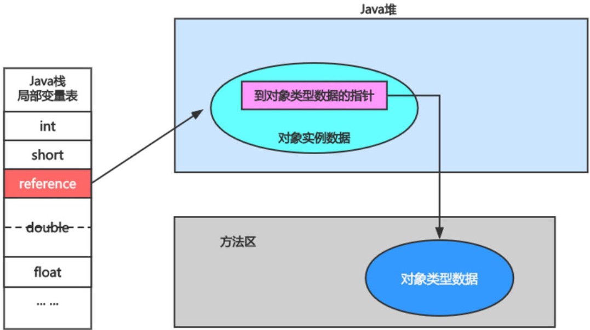

# 第9章 对象的实例化内存布局与访问定位

​	前面几章我们已经对运行时数据区各个区域有了一个比较细致的了解，平时大家经常使用new关键字来创建对象，那么我们创建对象的时候，怎么去和运行时数据区关联起来呢？本章将会带着这样的问题来重点讲解对象实例化的过程和方式，包括对象在内存中是怎样布局的，以及对象的访问定位方式，带领大家更加深入地学习对象的实例化布局。

## 9.1 对象的实例化

<div style="text-align:center;font-weight:bold;">对象的实例化</div>


### 9.1.1 创建对象的方式

​	创建对象的方式有多种，例如使用new关键字、Class的newInstance()方法、Constructor类的newInstance()方法、clone()方法、反序列化、第三方库Objenesis等。

​	每种创建对象方式的实际操作如下。

1. 使用new关键字——调用无参或有参构造器创建。
2. 使用Class的newInstance()方法——调用无参构造器创建，且需要是public的构造器。
3. 使用Constructor类的newInstance()方法——调用无参或有参、不同权限修饰构造器创建，实用性更广。
4. 使用clone()方法——不调用任何参构造器，且对象需要实现Cloneable接口并实现其定义的clone()方法，且默认为浅复制。
5. 使用反序列化——从指定的文件或网络中，获取二进制流，反序列化为内存中的对象。
6. 第三方库Objenesis——利用了asm字节码技术，动态生成Constructor对象。

​	Java是面向对象的静态强类型语言，声明并创建对象的代码很常见，根据某个类声明一个引用变量指向被创建的对象，并使用此引用变量操作该对象。在实例化对象的过程中，JVM中发生了什么变化呢？

<span style="color:#40E0D0;">案例1：创建对象的字节码命令</span>

- 代码

```java
public class NewObj {
    public static void main(String[] args) {
        Object obj = new Object();
    }
}
```

- 字节码

```java
$ javap -v -p NewObj.class
```


​	各个指令的含义如下。

new：首先检查该类是否被加载。如果没有加载，则进行类的加载过程；如果已经加载，则在堆中分配内存。对象所需的内存的大小在类加载完成后便可以完全确定，为对象分配空间的任务等同于把一块确定大小的内存从Java堆中划分出来。这个指令完毕后，将指向实例对象的引用变量压入虚拟机栈栈顶。

dup：在栈顶复制该引用变量，这时的栈顶有两个指向堆内实例对象的引用变量。

invokespecial：调用对象实例方法，通过栈顶的引用变量调用`<init>`方法。`<init>`是对象初始化时执行的方法，而`<clinit>`是类初始化时执行的方法。

astore_1: 存入局部变量表的位置1处。

​	从上面的四个步骤中可以看出，需要从栈顶弹出两个实例对象的引用。这就是为什么会在new指令下面有一个dup指令。其实对于每一个new指令来说，一般编译器都会在其下面生成一个dup指令，这是因为实例的初始化方法（`<init>`方法）肯定需要用到一次，然后第二个留给业务程序使用，例如给变量赋值、抛出异常等。如果我们不用，那编译器也会生成dup指令，在初始化方法调用完成后再从栈顶pop出来。

### 9.1.2 创建对象的步骤

​	前面所述是从字节码角度看待对象的创建过程，现在从执行步骤的角度来分析。

​	创建对象的步骤如下。

**1 判断对象对应的类是否加载、链接、初始化**

​	虚拟机遇到一条new指令，首先去检查这个指令的参数能否在Metaspace的常量池中定位到一个类的符号引用，并且检查这个符号引用代表的类是否已经被加载、解析和初始化（即判断类元信息是否存在）。如果没有，那么在双亲委派模式下，使用当前类加载器以“ClassLoader+包名+类名”为Key查找对应的“.class”文件。如果没有找到文件，则抛出ClassNotFoundException异常。如果找到，则进行类加载，并生成对应的Class类对象。

**2 为对象分配内存**

​	首先计算对象占用空间大小，接着在堆中划分一块内存给新对象。如果实例成员变量是引用变量，仅分配引用变量空间即可，即4字节大小。

​	如果内存规整，使用指针碰撞。

​	如果内存是规整的，那么虚拟机将采用指针碰撞法(Bump The Pointer)来为对象分配内存。意思是所有用过的内存在一边，空闲的内存在另外一边，中间放着一个指针作为分界点的指示器，分配内存就仅仅是把指针向空闲那边挪动一段与对象大小相等的距离罢了。一般使用带有compact（整理）过程的收集器时，使用指针碰撞，例如Serial Old、Parallel Old等垃圾收集器。

​	如果内存不规整，虚拟机需要维护一个列表，使用空闲列表(Free List)分配。

​	如果内存不是规整的，已使用的内存和未使用的内存相互交错，那么虚拟机将采用空闲列表法来为对象分配内存。意思是虚拟机维护了一个列表，记录哪些内存块是可用的，在分配的时候从列表中找到一块足够大的空间划分给对象实例，并更新列表上的内容。这种分配方式称为空闲列表。

​	选择哪种分配方式由Java堆是否规整决定，而Java堆是否规整又由所采用的垃圾收集器是否带有压缩整理功能决定。

**3 处理并发安全问题**

​	创建对象是非常频繁的操作，在分配内存空间时，另外一个问题是保证new对象的线程安全性。虚拟机采用了两种方式解决并发问题。

​	CAS(Compare And Swap)：是一种用于在多线程环境下实现同步功能的机制。CAS操作包含三个操作数，内存位置、预期数值和新值。CAS的实现逻辑是将内存位置处的数值与预期数值相比较，若相等，则将内存位置处的值替换为新值；若不相等，则不做任何操作。

​	TLAB：把内存分配的动作按照线程划分在不同的空间之中进行，即每个线程在Java堆中预先分配一小块内存。

**4 初始化分配到的空间**

​	内存分配结束，虚拟机将分配到的内存空间都初始化为零值（不包括对象头）。这一步保证了对象的实例字段在Java代码中可以不用赋初始值就可以直接使用，程序能访问到这些字段的数据类型所对应的零值。

**5 设置对象的对象头**

​	将对象的所属类（即类的元数据信息）、对象的HashCode、对象的GC信息、锁信息等数据存储在对象头中。这个过程的具体设置方式取决于JVM实现。

**6 执行init()方法进行初始化**

​	从Java程序的视角看来，初始化才正式开始。初始化成员变量，执行实例化代码块，调用类的构造方法，并把堆内对象的首地址赋值给引用变量。

​	因此一般来说（由字节码中是否跟随由invokespecial指令所决定），new指令之后接着就是执行方法，把对象按照程序员的意愿进行初始化，这样一个真正可用的对象才算完全创建出来。

## 9.2 对象的内存布局

<div style="text-align:center;font-weight:bold;">对象的内存布局</div>


​	在HotSpot虚拟机中，对象在内存中的布局可以分成对象头(Header)、实例数据(Instance Data)、对齐填充(Padding)三部分。

**1 对象头**

​	主要包括对象自身的运行时元数据，比如哈希值、GC分代年龄、锁状态标志等，同时还包含一个类型指针，指向类元数据，表明该对象所属的类型。此外，如果对象是一个数组，对象头中还必须有一块用于记录数组的长度的数据。因为正常通过对象元数据就知道对象的确切大小。所以数组必须得知道长度。

**2 实例数据**

​	它是对象真正存储的有效信息，包括程序代码中定义的各种类型的字段（包括从父类继承下来的和本身拥有的字段）。

**3 对齐填充**

​	由于HotSpot虚拟机的自动内存管理系统要求对象起始地址必须是8字节的整数倍，换句话说就是任何对象的大小都必须是8字节的整数倍。对象头部分已经被精心设计成正好是8字节的倍数（1倍或者2倍），因此，如果对象实例数据部分没有对齐的话，就需要通过对齐填充来补全。它不是必要存在的，仅仅起着占位符的作用。

​	对象的内存布局示例如下图所示：

<div style="text-align:center;font-weight:bold;">对象的内存布局示例图</div>


​	下面我们用代码来讲述实例在内存中的布局，如代码所示。

<span style="color:#40E0D0;">案例1：实例在内存中的布局</span>

- 代码

```java
public class Customer {
    int id = 1001;
    String name;
    Account acct;

    {
        name = "匿名客户";
    }

    public Customer() {
        acct = new Account();
    }
}

class Account {

}

/**
 * 对象的内存布局
 */
public class CustomerTest {
    public static void main(String[] args) {
        Customer cust = new Customer();
    }
}
```

​	把CustomerTest中main()方法看作是主线程，主线程虚拟机栈中放了main()方法的栈帧，其中栈帧里包含了局部变量表、操作数栈、动态链接、方法返回地址、附加信息等结构。

​	局部变量表对于main()方法来讲第一个位置放的是args，第二个位置放的是cust,cust指向堆空间中new Customer()实体。

​	Customer对象实体整体来看分为对象头、实例数据、对齐填充。

​	对象头中主要有运行时元数据和元数据指针，元数据指针也可称为类型指针，运行时元数据包含哈希值、GC分代年龄、锁状态标志等信息；类型指针指向当前对象所属类的信息，也就是方法区的Customer类的Klass类元信息，Klass类元信息包括对象的类型信息；

​	在实例数据中包含父类的实例数据，对于当前对象来讲它有id、name、acct三个变量，name的字符串常量放在堆空间的字符串常量池中，成员变量acct指向new Account()对象实例在堆中的内存地址，new Account()对象实例的对象头中也维护了一个类型指针指向方法区的Account的Klass类元信息。

​	整体布局如下图所示：

<div style="text-align:center;font-weight:bold;">实例中的内存布局图</div>


## 9.3 对象的访问定位

### 9.3.1 对象访问的定位方式

​	前面讲解了创建对象的方式以及对象的内存结构。创建好对象之后，接下来就是去访问对象，那么JVM是如何通过栈帧中的对象引用访问到其内部对象实例的呢？通常来讲，栈帧存储指向堆区中的对象地址，对象中含有该类对象的类型指针，也就是我们说的元数据指针，如果访问对象，只需要访问栈帧中的地址即可。

<div style="text-align:center;font-weight:bold;">对象的引用访问对象实例图</div>


​	《Java虚拟机规范》没有对访问对象做具体的说明和要求，所以对象访问方式由虚拟机实现而定。主流有两种方式，分别是使用句柄访问和使用直接指针访问。

### 9.3.2 使用句柄访问

​	堆需要划分出一块内存来做句柄池，reference中存储对象的句柄池地址，句柄中包含对象实例与类型数据各自具体的地址信息。

<div style="text-align:center;font-weight:bold;">句柄访问</div>


​	这样做的好处是reference中存储稳定句柄地址，对象被移动（垃圾收集时移动对象很普遍）时只会改变句柄中实例数据指针，reference本身不需要被修改。但是这样做会造成多开辟一块空间来存储句柄地址，相当于是间接访问对象。

### 9.3.3 使用指针访问

​	reference中存储的就是对象的地址，如果只是访问对象本身的话，就不需要多一次间接访问的开销。

​	这样做的好处是访问速度更快，Java中对象访问频繁，每次访问都节省了一次指针定位的时间开销。<span style="color:red;font-weight:bold;">HotSpot虚拟机主要使用直接指针访问的方式</span>。

<div style="text-align:center;font-weight:bold;">使用指针访问</div>



​	JVM可以通过对象引用准确定位到Java堆区中的对象，这样便可成功访问到对象的实例数据。JVM通过存储在对象中的元数据指针定位到存储在方法区中的对象的类型信息，即可访问目标对象的具体类型。

