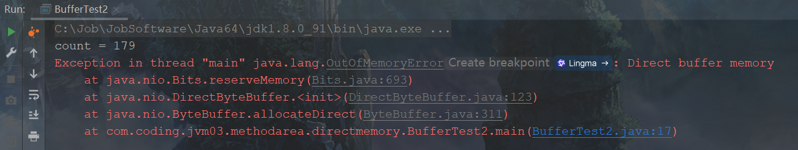

# 第10章 直接内存

​	Java中的内存从广义上可以划分为两个部分，一部分是我们之前章节讲解过的受JVM管理的堆内存，<span style="color:#9400D3;">另一部分则是不受JVM管理的堆外内存，也称为直接内存</span>。直接内存由操作系统来管理，这部分内存的应用可以减少垃圾收集对应用程序的影响。

## 10.1 直接内存概述

​	直接内存不是虚拟机运行时数据区的一部分，也不是Java虚拟机规范中定义的内存区域。直接内存是在Java堆外的、直接向操作系统申请的内存区间。直接内存来源于NIO(Non-Blocking IO)，可以通过ByteBuffer类操作。ByteBuffer类调用allocateDirect()方法可以申请直接内存，方法内部创建了一个DirectByteBuffer对象，DirectByteBuffer对象存储直接内存的起始地址和大小，据此就可以操作直接内存。直接内存和堆内存之间的关系如图所示。

<div style="text-align:center;font-weight:bold;">堆内存和直接内存的关系</div>


<span style="color:#40E0D0;">案例1：查看直接内存的占用和释放</span>

- 代码

```java
/**
 * 查看直接内存的占用与释放
 */
public class BufferTest {
    private static final int BUFFER = 1024 * 1024 * 1024; // 1GB

    public static void main(String[] args) {
        ByteBuffer byteBuffer = ByteBuffer.allocateDirect(BUFFER);
        System.out.println("直接内存分配完毕，请求指示！");

        Scanner scanner = new Scanner(System.in);
        scanner.next();

        System.out.println("直接内存开始释放！");
        byteBuffer = null;
        System.gc(); // 可以被gc
        scanner.next();
    }
}
```

​	直接分配后的本地内存空间如下图所示，可以看到内存为1063332KB，换算过来大约是1GB。

<div style="text-align:center;font-weight:bold;">本地内存空间</div>


​	释放内存后的本地内存空间如下图所示，内存释放后的空间为17424KB，几乎释放了1GB的内存。

<div style="text-align:center;font-weight:bold;">释放内存后的本地内存空间</div>


​	通常，访问直接内存的速度会优于Java堆，读写性能更高。因此出于性能考虑，读写频繁的场合可能会考虑使用直接内存。Java的NIO库允许Java程序使用直接内存，用于数据缓冲区。

​	通过前面的案例我们可以把Java进程占用的内存理解为两部分，分别是JVM内存和直接内存。前面我们讲解方法区的时候，不同版本JDK中方法区的实现是不一样的，<span style="color:#9400D3;">JDK 7使用永久代实现方法区，永久代中的数据还是使用JVM内存存储数据。JDK 8使用元空间实现方法区，元空间中的数据放在了本地内存当中，直接内存和元空间一样都属于堆外内存</span>。

<div style="text-align:center;font-weight:bold;">JDK 7和JDK 8内存结构的对比图</div>


## 10.2 直接内存的优势

​	文件读写必然涉及磁盘的读写，但是Java本身不具备磁盘读写的能力，因此借助操作系统提供的方法，在Java中表现出来的形式就是Java中的本地方法接口调用本地方法库。普通IO读取一份物理磁盘的文件到内存中，需要下面两步。

1. 把磁盘文件中的数据读取到系统内存中。
2. 把系统内存中的数据读取到JVM堆内存中。

​	为了使得数据可以在系统内存和JVM堆内存之间相互复制，需要在系统内存和JVM堆内存都复制一份磁盘文件。这样做不仅浪费空间，而且传输效率低下。

<div style="text-align:center;font-weight:bold;">非直接缓冲区</div>


​	当使用NIO时，如下图所示。操作系统划出一块直接缓冲区可以被Java代码直接访问。这样当读取文件的时候步骤如下。

1. 物理磁盘读取文件到直接内存。
2. JVM通过NIO库直接访问数据。

<div style="text-align:center;font-weight:bold;">直接缓冲区</div>


​	下面通过一个案例来对普通IO和NIO性能做比较。

<span style="color:#40E0D0;">案例1：IO和NIO的性能比较</span>

- 代码

```java
package com.coding.jvm03.methodarea.directmemory;

import java.io.FileInputStream;
import java.io.FileOutputStream;
import java.io.IOException;
import java.nio.ByteBuffer;
import java.nio.channels.FileChannel;

public class BufferTest1 {
    private static final int _100Mb = 1024 * 1024 * 100; // 100MB

    public static void main(String[] args) {
        long sum = 0;
        String src = "D:\\test\\毒液最后yi舞_HD英语中字.mp4";
        for (int i = 0; i < 3; i++) {
            String dest = "D:\\test\\毒液最后yi舞_HD英语中字" + i + ".mp4";
//            sum += io(src, dest);
            sum += directBuffer(src, dest);
        }
        System.out.println("总花费的时间为：" + sum);
    }

    private static long io(String src, String dest) {
        long start = System.currentTimeMillis();
        try (FileInputStream fis = new FileInputStream(src);
             FileOutputStream fos = new FileOutputStream(dest);) {
            // 定义缓冲区 allocate分配大小
            byte[] buffer = new byte[_100Mb];
            while (true) {
                int len = fis.read(buffer);
                if (len == -1) {
                    break;
                }
                fos.write(buffer, 0, len);
            }
        } catch (IOException e) {
            e.printStackTrace();
        }
        long end = System.currentTimeMillis();
        return end - start;
    }

    private static long directBuffer(String src, String dest) {
        long start = System.currentTimeMillis();
        try (FileInputStream fis = new FileInputStream(src); FileChannel inChannel = fis.getChannel();
             FileOutputStream fos = new FileOutputStream(dest); FileChannel outChannel = fos.getChannel()) {
            // 定义缓冲区 allocate分配大小
            ByteBuffer byteBuffer = ByteBuffer.allocateDirect(_100Mb);
            while (inChannel.read(byteBuffer) != -1) {
                byteBuffer.flip(); // 修改为读数据模式
                outChannel.write(byteBuffer);
                byteBuffer.clear(); // 清空，切换为谢模式
            }
        } catch (IOException e) {
            e.printStackTrace();
        }
        long end = System.currentTimeMillis();
        return end - start;
    }
}
```

​	上述代码中复制三次1.37GB的影片文件，使用IO复制文件所耗费的时间为10330ms，使用NIO复制文件所耗费的时间为6469ms，相对来说有了性能的提升，如果适当增大直接内存或者增多复制的次数，效果会更明显。

## 10.3 直接内存溢出

​	直接内存也可能导致OutOfMemoryError异常。由于直接内存在Java堆外，因此它的大小不会直接受限于“-Xmx”指定的最大堆大小，但是系统内存也是有限的，Java堆和直接内存的总和依然受限于操作系统能给出的最大内存。接下来通过一个案例演示直接内存的内存溢出现象。

<span style="color:#40E0D0;">案例1：直接内存的内存溢出</span>

- 代码

```java
/**
 * 本地内存的OOM：Exception in thread "main" java.lang.OutOfMemoryError: Direct buffer memory
 */
public class BufferTest2 {
    private static final int BUFFER = 1024 * 1024 * 20; // 20MB

    public static void main(String[] args) {
        ArrayList<ByteBuffer> list = new ArrayList<ByteBuffer>();
        int count = 0;
        try {
            while (true) {
                ByteBuffer byteBuffer = ByteBuffer.allocateDirect(BUFFER);
                list.add(byteBuffer);
                count++;
                try {
                    Thread.sleep(100);
                } catch (InterruptedException e) {
                    e.printStackTrace();
                }
            }
        } finally {
            System.out.println("count = " + count);
        }
    }
}    
```

<div style="text-align:center;font-weight:bold;">内存溢出异常</div>



​	直接内存由于不受JVM的内存管理，所以需要开发人员自己来管理，以防内存溢出，通常有两种方式。

1. 当ByteBuffer对象不再使用的时候置为null，调用System.gc()方法告诉JVM可以回收ByteBuffer对象，最终系统调用freemermory()方法释放内存。System.gc()会引起一次Full GC，通常比较耗时，影响程序执行。
2. 调用Unsafe类中的freemermory()方法释放内存。

​	<span style="color:#9400D3;">可以通过参数-XX:MaxDirectMemorySize来指定直接内存的最大值。若不设置-XX:MaxDirectMemorySize参数，其默认值与“-Xmx”参数配置的堆内存的最大值一致</span>。

​	特殊说明：

1. 如果使用Java自带的 ByteBuffer.allocateDirect(size) 或者直接 new DirectByteBuffer(capacity) , 这样受-XX:MaxDirectMemorySize 这个JVM参数的限制. 其实底层都是用的Unsafe#allocateMemory,区别是对大小做了限制. 如果超出限制直接OOM。
2. <span style="color:red;font-weight:bold;">如果通过反射的方式拿到Unsafe的实例,然后用Unsafe的allocateMemory方法分配堆外内存. 确实不受-XX:MaxDirectMemorySize这个JVM参数的限制 . 所以限制的内存大小为操作系统的内存</span>。

## 10.4 申请直接内存源码分析

​	ByteBuffer类调用allocateDirect()方法申请直接内存，底层调用的是DirectByteBuffer类的构造方法，源码如下所示。

- 代码

```java
    public static ByteBuffer allocateDirect(int capacity) {
        return new DirectByteBuffer(capacity);
    }
```

​	进入到DirectByteBuffer类的构造方法，如下代码所示，该类访问权限是默认级别的，只能被同一个包下的类访问，所以开发人员无法直接调用，所以需要通过ByteBuffer类调用。构造方法中申请内存的核心代码就是Unsafe类中的allocateMemory(size)方法，该方法是一个native方法，不再深究。

- 代码

```java
    // Primary constructor
    //
    DirectByteBuffer(int cap) {                   // package-private

        super(-1, 0, cap, cap);
        boolean pa = VM.isDirectMemoryPageAligned();
        int ps = Bits.pageSize();
        long size = Math.max(1L, (long)cap + (pa ? ps : 0));
        Bits.reserveMemory(size, cap);

        long base = 0;
        try {
            base = unsafe.allocateMemory(size);
        } catch (OutOfMemoryError x) {
            Bits.unreserveMemory(size, cap);
            throw x;
        }
        unsafe.setMemory(base, size, (byte) 0);
        if (pa && (base % ps != 0)) {
            // Round up to page boundary
            address = base + ps - (base & (ps - 1));
        } else {
            address = base;
        }
        cleaner = Cleaner.create(this, new Deallocator(base, size, cap));
        att = null;


    }
```

​	Unsafe类无法直接被开发工程师使用，因为其构造方法是私有的，但是我们可以通过反射机制获取Unsafe对象，进而申请直接内存，如代码所示。

<span style="color:#40E0D0;">案例1：申请直接内存</span>

- 代码

```java
/**
 * 通过反射方式拿到的Unsafe实例，该参数对反射方式是无效的
 * -Xmx20m -XX:MaxDirectMemorySize=10m
 */
public class MaxDirectMemorySizeTest {
    private static final int _1MB = 1024 * 1024; // 1MB

    public static void main(String[] args) throws IllegalAccessException {
        Field unsafeField = Unsafe.class.getDeclaredFields()[0];
        unsafeField.setAccessible(true);
        Unsafe unsafe = (Unsafe) unsafeField.get(null);
        while (true) {
            // 申请直接内存
            unsafe.allocateMemory(_1MB);
        }
    }

}
```