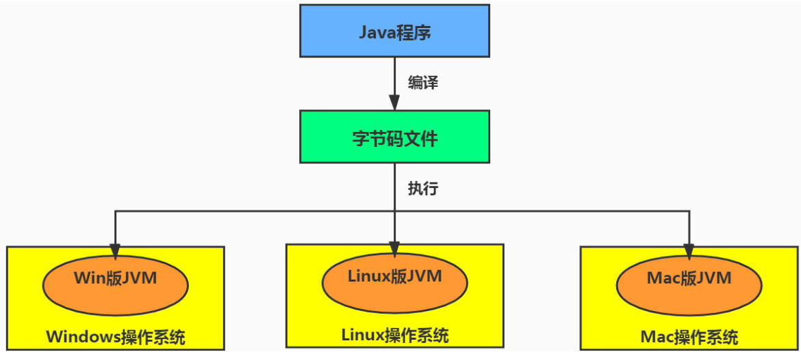
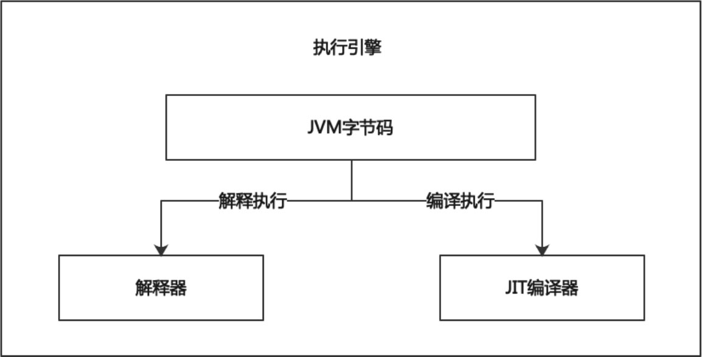

# 第11章 执行引擎

​	到目前为止，我们已经讲完了JVM的运行时数据区，我们知道Java源文件经过编译之后生成class文件，class文件加载到内存中，此时物理机器并不能直接执行代码，因为它没办法识别class文件中的内容，此时就需要执行引擎(ExecutionEngine)来做相应的处理。

## 11.1 概述

​	执行引擎是JVM核心的组成部分之一。可以把JVM架构分成三部分，如下图所示，执行引擎位于JVM的最下层（图中虚线框部分），可以粗略地看到执行引擎负责和运行时数据区交互。

<div style="text-align:center;font-weight:bold;">执行引擎在JVM中的位置</div>


## 11.2 计算机语言的发展史

​	在讲解执行引擎之前，需要知道什么是机器码、汇编语言、高级语言以及为什么会有Java字节码的出现。

### 11.2.1 机器码

​	各种用0和1组成的二进制编码方式表示的指令，叫作机器指令码，简称机器码。计算机发展的初始阶段，人们就用机器码编写程序，我们也称为机器语言。机器语言虽然能够被计算机理解和接受，但和人类的语言差别太大，不易被人们理解和记忆，并且用它编程容易出差错。使用机器码编写的程序一经输入计算机，CPU可以直接读取运行，因此和其他语言编的程序相比，执行速度最快。机器码与CPU紧密相关，所以不同种类的CPU所对应的机器码也就不同。

### 11.2.2 汇编语言

​	由于机器码是由0和1组成的二进制序列，可读性实在太差，于是人们发明了指令。指令就是把机器码中特定的0和1序列，简化成对应的指令（一般为英文简写，如mov、inc等），可读性稍好，这就是我们常说的汇编语言。在汇编语言中，用助记符(Mnemonics)代替机器码的操作码，用地址符号(Symbol)或标号(Label)代替指令或操作数的地址。

​	不同的硬件平台，各自支持的指令是有差别的。因此每个平台所支持的指令，称为对应平台的指令集，如常见的x86指令集对应的是x86架构的平台，ARM指令集对应的是ARM架构的平台。不同平台之间指令不可以直接移植。

​	由于计算机只认识机器码，所以用汇编语言编写的程序还必须翻译成机器码，计算机才能识别和执行。

### 11.2.3 高级语言

​	为了使计算机用户编程序更容易些，后来就出现了各种高级计算机语言。比如C、C++等更容易让人识别的语言。

​	当计算机执行高级语言编写的程序时，仍然需要把程序解释或编译成机器的指令码。完成这个过程的程序就叫作解释程序或编译程序，如下图所示。

<div style="text-align:center;font-weight:bold;">高级语言转化为机器指令的过程</div>


### 11.2.4 字节码

​	字节码是一种中间状态（中间码）的二进制代码（文件），需要转译后才能成为机器码。字节码主要为了实现特定软件运行和软件环境，与硬件环境无关。如下图所示，Java程序可以通过编译器将源码编译成Java字节码，特定平台上的虚拟机将字节码转译为可以直接执行的指令，也就实现了跨平台性。

<div style="text-align:center;font-weight:bold;">字节码文件的跨平台性</div>



## 11.3 Java代码编译和执行过程

​	我们知道虚拟机并不是真实存在的，是由软件编写而成的，它是相对于物理机的概念。但是虚拟机和物理机一样都可以执行一系列的计算机指令，其区别是物理机的执行引擎是直接建立在处理器、缓存、指令集和操作系统层面上的，而虚拟机的执行引擎则是由软件自行实现的，因此可以不受物理条件制约地定制指令集与执行引擎的结构体系，执行那些不被硬件直接支持的指令集格式。

​	JVM装载字节码到内存中，但字节码仅仅只是一个实现跨平台的通用契约而已，它并不能够直接运行在操作系统之上，因为字节码指令并不等价于机器码，它内部包含的仅仅只是一些能够被JVM所识别的字节码指令、符号表，以及其他辅助信息。

​	如果想要让一个Java程序运行起来，执行引擎的任务就是将字节码指令解释／编译为对应平台上的机器码才可以。简单来说，JVM中的执行引擎充当了将高级语言翻译为机器语言的译者，就好比两个国家领导人之间的交流需要翻译官一样。

​	在Java虚拟机规范中制定了JVM执行引擎的概念模型，这个概念模型成为各大发行商的JVM执行引擎的统一规范。执行引擎的工作流程如下图所示：

<div style="text-align:center;font-weight:bold;">执行引擎工作流程</div>


​	所有的JVM的执行引擎输入、输出都是一致的，输入的是字节码二进制流，处理过程是字节码解析执行的过程，输出的是执行结果。

​	大部分的程序代码转换成物理机的目标代码或虚拟机能执行的指令集之前，都需要经过下图中的各个步骤，<span style="background-color:#ffb660;">程序源码到抽象语法树的过程属于代码编译的过程，和虚拟机无关</span>；<span style="background-color:#22df2b;">指令流到解释执行的过程属于生成虚拟机指令集的过程</span>；<span style="background-color:#5daeff">优化器到目标代码的过程属于生成物理机目标代码的过程</span>

<div style="text-align:center;font-weight:bold;">源代码转换为机器的目标代码流程</div>


​	具体来说，Java代码编译是由Java源码编译器来完成，流程图如下图所示。在Java中，javac编译器主要负责词法分析、语法分析和语义分析，最终生成二进制字节码，此过程发生在虚拟机外部。

<div style="text-align:center;font-weight:bold;">Java源代码转换字节码流程</div>


​	Java字节码的执行是由JVM执行引擎来完成，流程图如下所示：

<div style="text-align:center;font-weight:bold;">JVM字节码解释执行与JIT编译执行流程</div>


​	Java源代码经过javac编译器编译之后生成字节码，Java字节码的执行是由JVM执行引擎来完成，流程图如下图所示。可以看到图中有JIT编译器和字节码解释器两种路径执行字节码，也就是说可以解释执行，也可以编译执行。在前面的章节中我们讲过，Java是一种解释类型的语言，其实JDK 1.0时代，将Java语言定位为“解释执行”还是比较准确的，再后来，Java也发展出可以直接生成本地代码的编译器，所以Java语言就不再是纯粹的解释执行语言了。<span style="color:red;font-weight:bold;">现在JVM在执行Java代码的时候，通常都会将解释执行与编译执行结合起来进行，这也就是为什么现在Java语言被称为半编译半解释型语言的原因</span>。

<div style="text-align:center;font-weight:bold;">标题</div>



## 11.4 解释器

​	解释器的作用是当JVM启动时会根据预定义的规范对字节码采用逐行解释的方式执行，将每条字节码文件中的内容“翻译”为对应平台的机器码执行。

​	JVM设计者的初衷是为了满足Java程序实现跨平台特性，因此避免采用静态编译的方式直接生成机器码，从而诞生了实现解释器在运行时采用逐行解释字节码执行程序的想法。如下图所示，如果不采用字节码文件的形式，我们就需要针对不同的平台(Windows、Linux、Mac)编译不同的机器指令，那么就需要耗费很多精力和时间；如果采用了字节码的形式，那么就只需要从源文件编译到字节码文件即可，虽然在不同的平台上，但是JVM中的解释器可以识别同一套字节码文件，大大提高了开发效率。

<div style="text-align:center;font-weight:bold;">解释器功能</div>


​	解释器真正意义上所承担的角色就是一个运行时的“翻译者”，将字节码文件中的内容“翻译”为对应平台的机器码执行。

​	在Java的发展历史里，一共有两套解释执行器，分别是古老的<span style="color:#9400D3;">字节码解释器</span>和现在普遍使用的<span style="color:#9400D3;">模板解释器</span>。字节码解释器在执行时通过纯软件代码模拟字节码的执行，效率非常低下。而模板解释器将每一条字节码和一个模板函数相关联，模板函数中直接产生这条字节码执行时的机器码，从而很大程度上提高了解释器的性能。

​	在HotSpot VM中，解释器主要由Interpreter模块和Code模块构成。Interpreter模块实现了解释器的核心功能，Code模块用于管理HotSpot VM在运行时生成的机器码。

​	由于解释器在设计和实现上非常简单，因此除了Java语言之外，还有许多高级语言同样也是基于解释器执行的，比如Python、Perl、Ruby等。但是在今天，基于解释器执行已经沦落为低效的代名词。为了解决低效这个问题，JVM平台支持一种叫作即时编译的技术。即时编译的目的是避免函数被解释执行，而是将整个函数体编译成机器码，每次函数执行时，只执行编译后的机器码即可，这种方式可以使执行效率大幅度提升。不过无论如何，基于解释器的执行模式仍然为中间语言的发展做出了不可磨灭的贡献。

## 11.5 JIT编译器

​	JIT编译器(Just In Time Compiler)的作用就是虚拟机将字节码直接编译成机器码。但是现代虚拟机为了提高执行效率，会使用即时编译技术将方法编译成机器码后再执行。

​	在JDK 1.0时代，JVM完全是解释执行的，随着技术的发展，现在主流的虚拟机中大都包含了即时编译器。

​	HotSpot VM是目前市面上高性能虚拟机的代表作之一。它采用解释器与即时编译器并存的架构。在JVM运行时，解释器和即时编译器能够相互协作，各自取长补短，尽力去选择最合适的方式来权衡编译本地代码的时间和直接解释执行代码的时间。

​	在此大家需要注意，无论是采用解释器进行解释执行，还是采用即时编译器进行编译执行，都是希望程序执行要快。最终字节码都需要被转换为对应平台的机器码。

​	可以使用jconsole工具查看程序的运行情况。

<span style="color:#40E0D0;">案例1：</span>

- 代码

```java
/**
 * 打开jconsole观察JIT编译情况
 */
public class JITTest {

    public static void main(String[] args) {
        ArrayList<String> list = new ArrayList<>();

        for (int i = 0; i < 1000; i++) {
            list.add("让天下没有难学的技术！");

            try {
                Thread.sleep(1000);
            } catch (InterruptedException e) {
                e.printStackTrace();
            }
        }
    }
}
```

​	可以看见用到了JIT编译器。

<div style="text-align:center;font-weight:bold;">jconsole查看JIT编译器</div>


### 11.5.1 为什么HotSpot VM同时存在JIT编译器和解释器

​	既然HotSpot VM中已经内置JIT编译器了，那么为什么还需要再使用解释器来“拖累”程序的执行性能呢？比如JRockit VM内部就不包含解释器，字节码全部都依靠即时编译器编译后执行。

​	首先明确，当程序启动后，解释器可以马上发挥作用，省去编译的时间，立即执行。编译器要想发挥作用，把代码编译成机器码，需要一定的执行时间，但编译为机器码后，执行效率高。

​	尽管JRockit VM中程序的执行性能会非常高效，但程序在启动时必然需要花费更长的时间来进行编译（即“预热”）。对于服务端应用来说，启动时间并非是关注重点，但对于那些<span style="color:#9400D3;">看中启动时间的应用场景而言，或许就需要采用解释器与即时编译器并存的架构来换取一个平衡点。在此模式下，当JVM启动时，解释器可以首先发挥作用，而不必等待JIT全部编译完成后再执行，这样可以省去许多不必要的编译时间。随着程序运行时间的推移，即时编译器逐渐发挥作用，根据热点代码探测功能，将有价值的字节码编译为机器码，并缓存起来，以换取更高的程序执行效率</span>。

​	<span style="color:#FF00FF;">注意解释执行与编译执行在线上环境存在微妙的辩证关系。机器在热机状态可以承受的负载要大于冷机状态。如果以热机状态时的流量进行切流，可能使处于冷机状态的服务器因无法承载流量而假死。</span>

​	在生产环境发布过程中，以分批的方式进行发布，根据机器数量划分成多个批次，每个批次的机器数至多占到整个集群的1/8。

​	曾经有这样的故障案例，某程序员在发布平台进行分批发布，在输入发布总批数时，误填写成分为两批发布。如果是热机状态，在正常情况下一半的机器可以勉强承载流量，但由于刚启动的JVM均是解释执行，还没有进行热点代码统计和JIT动态编译，导致机器启动之后，当前l/2发布成功的服务器马上全部宕机，此故障证明了JIT的存在。

​	下图示例，以人类语言为例，形象生动地展示了Java语言中前端编译器、解释器和后端编译器（即JIT编译器）共同工作的流程。前端编译器将不同的语言统一编译成字节码文件（即“乌拉库哈吗哟”），这些信息我们是看不懂的，而是供JVM来读取的。之后可以通过解释器逐行将字节码指令解释为本地机器指令执行，或者通过JIT把热点代码编译为本地机器指令执行。

<div style="text-align:center;font-weight:bold;">解释器和JIT编译器共同工作流程</div>


​	在此我们要说明一点，Java语言的“编译期”其实是一段“不确定”的操作过程，因为它可能是指一个前端编译器（其实叫“编译器的前端”更准确一些）把.java文件转变成.class文件的过程。也可能是指虚拟机的后端运行期编译器（JIT编译器，Just In Time Compiler）把字节码转变成机器码的过程。还可能是指使用静态提前编译器（AOT编译器，Ahead Of Time Compiler）直接把.java文件编译成本地机器代码的过程。

### 11.5.2 热点代码探测确定何时JIT

​	是否需要启动JIT编译器将字节码直接编译为对应平台的机器码需要根据代码被调用执行的频率而定。那些需要被编译为本地代码的字节码也被称为“热点代码”，<span style="color:#9400D3;">JIT编译器在运行时会针对那些频繁被调用的“热点代码”做出深度优化，将其直接编译为对应平台的机器码，以此提升Java程序的执行性能</span>。

​	一个被多次调用的方法，或者是一个方法体内部循环次数较多的循环体都可以被称为“热点代码”，因此都可以通过JIT编译器编译为机器码，并缓存起来。

​	一个方法被多次调用的时候，从解释执行切换到编译执行是在两次方法调用之间产生的，因为上一次方法在被调用的时候还没有将该方法编译好，所以仍然需要继续解释执行，而不需要去等待程序被编译，否则太浪费时间了，等再次调用该方法的时候，发现该方法已经被编译好，那么就会使用编译好的机器码执行了。

​	还有一种情况就是一个方法体内包含大量的循环的代码，比如下面的代码：

- 代码

```java
public static void main(String[] args) {
    for (int i = 0; i < 20000; i++) {
        System.out.println(i);
    }
}
```

​	main()方法被执行的次数只有一次，但是方法体内部有一个循环20000次的循体，这种情况下，就需要将循环体编译为机器码，而不是将main()方法编译为机器码，这个时候就需要在循环入口处判断是否该循环体已经被编译为机器码。由于这种编译方式不需要等待方法的执行结束，因此也被称为栈上替换编译，或简称OSR(On Stack Replacement)编译。

​	一个方法究竟要被调用多少次，或者一个循环体究竟需要执行多少次循环才可以达到这个标准？必然需要一个明确的阈值，JIT编译器才会将这些“热点代码”编译为机器码执行。这里主要依靠热点探测功能，比如上面代码的循环次数为20000次，那么就可能在循环执行5000次的时候开始被编译，然后在第5200次循环的时候开始使用机器码，中间的200次循环依然是解释执行，因为编译也是需要消耗时间的。

​	<span style="color:red;font-weight:bold;">目前HotSpot VM所采用的热点探测方式是基于计数器的热点探测</span>。HotSpot VM会为每一个方法都建立两个不同类型的计数器，分别为方法调用计数器(Invocation Counter)和回边计数器(Back Edge Counter)。方法调用计数器用于统计方法的调用次数，回边计数器则用于统计循环体执行的循环次数。

​	<span style="color:red;font-weight:bold;">方法调用计数器的默认阈值在Client模式下是1500次，在Server模式下是10000次。超过这个阈值，就会触发JIT编译。这个阈值可以通过虚拟机参数-XX:CompileThreshold来手动设定。</span>

​	一般而言，如果以缺省参数启动Java程序，方法调用计数器统计的是一段时间之内方法被调用的次数。当超过一定的时间限度，如果方法的调用次数没有达到方法调用计数器的阈值，这个方法的调用计数器的数值调整为当前数值的1/2，比如10分钟之内方法调用计数器数值为1000，下次执行该方法的时候，方法调用计数器的数值从500开始计数。这个过程称为方法调用计数器热度的衰减(CounterDecay)，而这段时间就称为此方法统计的半衰周期(Counter Half Life Time)，可以使用-XX:CounterHalfLifeTime参数设置半衰周期的时间，单位是秒。可以使用JVM参数“-XX:-UseCounterDecay”关闭热度衰减，让方法计数器统计方法调用的绝对次数，这样，只要系统运行时间足够长，绝大部分方法都会被编译成机器码。<span style="color:#9400D3;">一般而言，如果项目规模不大，并且产品上线后很长一段时间不需要进行版本迭代，都可以尝试把热度衰减关闭，这样可以使Java程序在线上运行的时间越久，执行性能会更佳</span>。

​	当一个方法被调用时，会先检查该方法是否存在被JIT编译过的版本，如果存在，则编译执行。如果不存在已被编译过的版本，则将此方法的调用计数器值加1，然后判断方法计数器的数值是否超过设置的阈值。如果已超过阈值， 那么将会向JIT申请代码编译，如果没有超过阈值，则继续解释执行。

​	回边计数器的作用是统计一个方法中循环体代码执行的次数，在字节码中遇到控制流向后跳转的指令称为“回边”(Back Edge)，回边可简单理解为循环末尾跳转到循环开始。回边计数器的流程如下所示，当程序执行过程中遇到回边指令时，判断是否已经存在编译的机器码，如果存在，则编译执行即可，如果不存在，则回边计数器加1，再次判断是否超过阈值，如果没有超过，则解释执行，如果超过阈值，则向编译器提交编译请求，之后编译器开始编译代码，程序继续解释执行。回边计数器的阈值可以通过参数“-XX:OnStackReplacePercentage”设置。显然，建立回边计数器统计的目的就是为了触发OSR编译，如图11-12所示。

<div style="text-align:center;font-weight:bold;">方法计数器执行流程</div>


### 11.5.3 设置执行模式

​	缺省情况下HotSpot VM采用解释器与即时编译器并存的架构，使用java –version命令可以查看，如下所示，mixed mode表示解释器与即时编译器并存。

```cmd
> java -version
java version "1.8.0_91"
Java(TM) SE Runtime Environment (build 1.8.0_91-b15)
Java HotSpot(TM) 64-Bit Server VM (build 25.91-b15, mixed mode)
```

​	当然，开发人员可以根据具体的应用场景，通过下面的命令显式地为JVM指定在运行时到底是完全采用解释器执行，还是完全采用即时编译器执行。

​	-Xint命令表示完全采用解释器模式执行程序，如下所示。

```cmd
>java -Xint -version
java version "1.8.0_91"
Java(TM) SE Runtime Environment (build 1.8.0_91-b15)
Java HotSpot(TM) 64-Bit Server VM (build 25.91-b15, interpreted mode)
```

​	-Xcomp命令表示完全采用即时编译器模式执行程序。如果即时编译出现问题，解释器会介入执行，如下所示。

```cmd
>java -Xcomp -version
java version "1.8.0_91"
Java(TM) SE Runtime Environment (build 1.8.0_91-b15)
Java HotSpot(TM) 64-Bit Server VM (build 25.91-b15, compiled mode)
```

​	-Xmixed（HotSpot VM默认模式）命令表示采用解释器和即时编译器的混合模式共同执行程序，如下所示。

```cmd
>java -Xmixed -version
java version "1.8.0_91"
Java(TM) SE Runtime Environment (build 1.8.0_91-b15)
Java HotSpot(TM) 64-Bit Server VM (build 25.91-b15, mixed mode)
```

### 11.5.4 C1编译器和C2编译器

​	在HotSpot VM中内嵌有两个JIT编译器，分别为Client Compiler和ServerCompiler，通常简称为C1编译器和C2编译器。开发人员可以通过如下命令显式指定JVM在运行时到底使用哪一种即时编译器。

1.  -client：指定JVM运行在Client模式下，并使用C1编译器。C1编译器会对字节码进行简单和可靠的优化，耗时短，以达到更快的编译速度。
2. -server：指定JVM运行在Server模式下，并使用C2编译器。C2进行耗时较长的优化，以及激进优化，但优化的代码执行效率更高。

​	在不同的编译器上有不同的优化策略，C1编译器上主要有方法内联，去虚拟化、冗余消除。

1. 方法内联：将引用的函数代码编译到引用点处，这样可以减少栈帧的生成，减少参数传递以及跳转过程。
2. 去虚拟化：对唯一的实现类进行内联。
3. 冗余消除：在运行期间把一些不会执行的代码折叠掉。

​	C2的优化主要是在全局层面，逃逸分析是优化的基础。基于逃逸分析在C2上有如下几种优化。

1. 标量替换：用标量值代替聚合对象的属性值。
2. 栈上分配：对于未逃逸的对象分配对象在栈而不是堆。
3. 同步消除：清除同步操作，通常指synchronized。

​	Java分层编译(Tiered Compilation)策略：不开启性能监控的情况下，程序解释执行可以触发C1编译，将字节码编译成机器码，可以进行简单优化。如果开启性能监控，C2编译会根据性能监控信息进行激进优化。<span style="color:#9400D3;">不过在Java 7版本之后，一旦开发人员在程序中显式指定命令“-server”时，默认将会开启分层编译策略，由C1编译器和C2编译器相互协作共同来执行编译任务</span>。一般来讲，JIT编译出来的机器码性能比解释器高。C2编译器启动时长比C1编译器慢，系统稳定执行以后，C2编译器执行速度远远快于C1编译器。

​	默认情况下HotSpot VM则会根据操作系统版本与物理机器的硬件性能自动选择运行在哪一种模式下，以及采用哪一种即时编译器。

​	对于32位Windows操作系统，不论硬件什么配置都会默认使用Client模式，可以执行“java -server -version”命令，切换为Server模式，但已经是Server模式的，不能切换为Client模式。对于32位其他类型的操作系统，如果内存配置为2GB或以上且CPU数量大于或等于2，默认情况会以Server模式运行，低于该配置依然使用Client模式。64位的操作系统只有Server模式。

​	对于开发人员来讲，基本都是64位的操作系统了，因为32位的内存限制为4GB，显得捉襟见肘。现在生产环境上，基本上都是Server模式。所以我们只需要掌握Server模式即可，Client模式基本不会使用了。

## 11.6 AOT编译器和Graal编译器

​	JDK 9引入了AOT编译器（Ahead Of Time Compiler，静态提前编译器）及AOT编译工具jaotc。将所输入的class文件转换为机器码，并存放至生成的动态共享库之中。

​	所谓AOT编译，是与即时编译相对立的一个概念。我们知道，即时编译指的是在程序的运行过程中，将字节码转换为可在硬件上直接运行的机器码，并部署至托管环境中的过程。而AOT编译指的则是，在程序运行之前，便将字节码转换为机器码的过程，也就是说在程序运行之前通过jaotc工具将class文件转换为so文件。

​	AOT编译的最大好处是JVM加载已经预编译成二进制库，可以直接执行，无须通过解释器执行，不必等待即时编译器的预热，减少Java应用给人带来“第一次运行慢”的不良体验。把编译的本地机器码保存到磁盘，不占用内存，并可多次使用。

​	<span style="color:#9400D3;">但是破坏了Java“一次编译，到处运行”的特性，必须为不同硬件编译对应的发行包，降低了Java链接过程的动态性，加载的代码在编译工作前就必须全部已知。</span>

​	自JDK 10起，HotSpot又加入一个全新的即时编译器——Graal编译器。它的编译效果在短短几年内就追平了C2编译器，未来可期。目前，它还依然带着“试验状态”的标签，需要使用参数“-XX:+UnlockExperimentalVMOptions -XX:+UseJVMCICompiler”去激活，才可以使用。