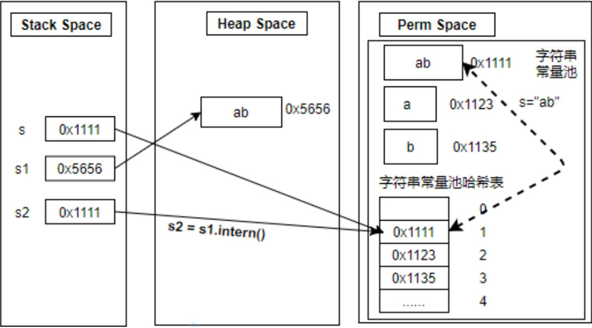

# 第12章 字符串常量池

​	在Java程序中String类的使用几乎无处不在，String类代表字符串，字符串对象可以说是Java程序中使用最多的对象了。

​	首先，在Java中创建大量对象是非常耗费时间的。其次，在程序中又经常使用相同的字符串对象，如果每次都去重新创建相同的字符串对象将会非常浪费空间。最后，字符串对象具有不可变性，即字符串对象一旦创建，内容和长度是固定的，既然这样，那么字符串对象完全可以共享。所以就有了StringTable这一特殊的存在，StringTable叫作字符串常量池，用于存放字符串常量，这样当我们使用相同的字符串对象时，就可以直接从StringTable中获取而不用重新创建对象。

## 12.1 String的基本特性

### 12.1.1 String类概述

​	String是字符串的意思，可以使用一对双引号引起来表示，而String又是一个类，所以可以用new关键字创建对象。因此字符串对象的创建有两种方式，分别是使用字面量定义和new的方式创建，如下所示。

​	字面量的定义方式：String s1 = “atguigu”;

​	以new的方式创建：String s2 = new String(“hello”)。

​	String类声明是加final修饰符的，表示String类不可被继承；String类实现了Serializable接口，表示字符串对象支持序列化；String类实现了Comparable接口，表示字符串对象可以比较大小。

​	String在JDK 8及以前版本内部定义了final char[] value用于存储字符串数据。JDK 9时改为final byte[] value。String在JDK 9中存储结构变更通知如下图所示：

[官方文档](https://openjdk.org/jeps/254)

<div style="text-align:center;font-weight:bold;">JDK7和JDK8存储结构的对比图</div>


​	String类的当前实现将字符串存储在char数组中，每个char类型的字符使用2字节（16位）。从许多不同的应用程序收集的数据表明，字符串是堆使用的主要组成部分，而大多数字符串对象只包含Latin-1字符。这些字符只需要1字节的存储空间，也就是说这些字符串对象的内部字符数组中有一半的空间并没有使用。

​	我们建议将String类的内部表示形式从UTF-16字符数组更改为字节数组加上字符编码级的标志字段。新的String类将根据字符串的内容存储编码为ISO-8859-1/Latin-1（每个字符1字节）或UTF-16（每个字符2字节）编码的字符。编码标志将指示所使用的编码。

​	基于上述官方给出的理由，String不再使用char[]来存储，改成了byte[]加上编码标记，以此达到节约空间的目的。JDK9关于String类的部分源码如下面代码清单所示，可以看出来已经将char[]改成了byte[]。

<span style="color:#40E0D0;">案例1：JDK 9版本String的部分源码</span>

- 代码

```java
// JDK8
public final class String
    implements java.io.Serializable, Comparable<String>, CharSequence {
    private final char value[];
	private int hash; // Default to 0
}
// JDK9
public final class String
    implements java.io.Serializable, Comparable<String>, CharSequence {
    @Stable
	private final byte[] value;
	private final byte coder;
	private int hash; // Default to 0
	@Native static final byte LATIN1 = 0;
    @Native static final byte UTF16  = 1;
}
```

​	String类做了修改，与字符串相关的类（如AbstractStringBuilder、StringBuilder和String Buffer）也都随之被更新为使用相同的表示形式，HotSpot VM的内部字符串操作也做了更新。

### 12.1.2 String的不可变性

​	String是不可变的字符序列，即字符串对象具有不可变性。例如，对字符串变量重新赋值、对现有的字符串进行连接操作、调用String的replace等方法修改字符串等操作时，都是指向另一个字符串对象而已，对于原来的字符串的值不做任何改变。下面通过代码验证String的不可变性，如下代码所示。

<span style="color:#40E0D0;">案例1：</span>

```java
/**
 * String的基本使用：体现String的不可变性。
 */
public class StringTest1 {

    @Test
    public void test1() {
        String s1 = "java"; // 字面量定义的方式，"abc"存储在字符串常量池中。
        String s2 = "java";
        s1 = "hello";
        System.out.println(s1); // hello
        System.out.println(s2); // java
    }

    @Test
    public void test2() {
        String s1 = "java"; // 字面量定义的方式，"abc"存储在字符串常量池中。
        String s2 = s1 + "hello";
        System.out.println(s1); // java
        System.out.println(s2); // javahello
    }

    @Test
    public void test3() {
        String s1 = "java";
        String s2 = s1.concat("hello");
        System.out.println(s1); // java
        System.out.println(s2); // javahello
    }

    @Test
    public void test4() {
        String s1 = "java";
        String s2 = s1.replace('a', 'A');
        System.out.println(s1); // java
        System.out.println(s2); // jAvA
    }
}
```

<div style="text-align:center;font-weight:bold;">StringTest1类代码的解析</div>

| 方法      | 代码解析                                                     |
| --------- | ------------------------------------------------------------ |
| test1方法 | s1变量指向新的字符串对象“hello”，而不是直接修改“java”字符串对象的内容 |
| test2方法 | s1和“hello”拼接后得到新的字符串，s2指向这个新字符串，s1不变  |
| test3方法 | s1和“hello”拼接后得到新的字符串，s2指向这个新字符串，s1不变  |
| test4方法 | 基于s1创建一个新字符串然后替换，s2指向这个新字符串，s1不变。 |

<span style="color:#40E0D0;">案例2：</span>

```java
/**
 * 字符串不可变
 */
public class StringExer {

    String literal = "good";
    String str = new String("good");
    char[] ch = {'t', 'e', 's', 't'};

    public void change(String literal, String str, char ch[]) {
        literal = "test ok";
        str = "test ok";
        ch[0] = 'b';
        System.out.println(literal); // test ok
        System.out.println(str); // test ok
        System.out.println(ch); // {'b', 'e', 's', 't'}
    }

    public static void main(String[] args) {
        StringExer ex = new StringExer();
        ex.change(ex.literal, ex.str, ex.ch);
        System.out.println(ex.literal); // good
        System.out.println(ex.str); // good
        System.out.println(ex.ch); // {'b', 'e', 's', 't'}
    }
}
```

​	在上面的代码中，因为change(String literal, String str, char ch[])方法的三个形参都是引用数据类型，<span style="color:red;font-weight:bold;">接收的都是实参对象的首地址</span>，即literal与ex.literal指向同一个对象，str和ex.str指向同一个对象，ch和ex.ch指向同一个对象，所以在change方法中打印literal、str和ch的结果和实参ex.literal、ex.str和ex.ch一样。虽然str在change方法中进行了拼接操作，str的值变了，但是由于String对象具有不可变性，literal、str指向了新的字符串对象，就和实参对象ex.literal、ex.str无关了，所以ex.literal和ex.str的值不会改变。而ch在change方法中并没有指向新对象，对ch[0]的修改，相当于对ex.ch[0]的修改。

## 12.2 字符串常量池

​	因为String对象的不可变性，所以String的对象可以共享。但是Java中并不是所有字符串对象都共享，只会共享字符串常量对象。Java把需要共享的字符串常量对象存储在字符串常量池(StringTable)中，即字符串常量池中是不会存储相同内容的字符串的。

### 12.2.1 字符串常量池的大小

​	String的StringTable是一个固定大小的HashTable，不同JDK版本的默认长度不同。如果放进StringTable的String非常多，就会造成Hash冲突严重，从而导致链表很长，链表过长会造成当调用String.intern()方法时性能大幅下降。

​	在JDK6中StringTable长度默认是1009，所以如果常量池中的字符串过多就会导致效率下降很快。在JDK 7和JDK 8中，StringTable长度默认是60013。

​	使用“-XX:StringTableSize”可自由设置StringTable的长度。但是在JDK 8中，StringTable长度设置最小值是1009。

​	下面我们使用代码来测试不同的JDK版本中对StringTable的长度限制，如下面代码。

<span style="color:#40E0D0;">案例1：不同的JDK版本中对StringTable的长度限制</span>

- 代码

```java
/**
 * <p>
 * -- jdk6
 * $ jinfo -flag StringTableSize pid
 * -XX:StringTableSize=1009
 * -- jdk7
 * $ jinfo -flag StringTableSize pid
 * -XX:StringTableSize=60013
 * -- jdk8
 * $ jinfo -flag StringTableSize pid
 * -XX:StringTableSize=60013
 * -- jdk11
 * $ jinfo -flag StringTableSize pid
 * -XX:StringTableSize=65536
 */
public class StringTest2 {
    public static void main(String[] args) {
        // 测试StringTableSize参数
        System.out.println("我来打个酱油");
        try {
            Thread.sleep(1000000);
        } catch (InterruptedException e) {
            e.printStackTrace();
        }
    }
}
```

​	先运行上面的Java程序，然后使用jps和jinfo命令来查看当前Java进程和打印指定Java进程的配置信息。

- JDK6

```java
>jinfo -flag StringTableSize 12872
-XX:StringTableSize=1009
```
- JDK7

```java
>jinfo -flag StringTableSize 12980
-XX:StringTableSize=60013
```
- JDK8

```java
>jinfo -flag StringTableSize 20096
-XX:StringTableSize=60013
```
​	当JDK 8设置StringTable的长度过短的话会抛出“Could not create the JavaVirtual Machine”异常。

<div style="text-align:center;font-weight:bold;">JDK 8时设置StringTable的长度过短抛出异常</div>


- JDK11

```java
>jinfo -flag StringTableSize 19308
-XX:StringTableSize=65536
```

​	上面程序测试了不同版本的JDK对于StringTable的长度有不同的限制，接下来测试不同的StringTable长度对于性能的影响，业务需求为产生10万个长度不超过10的字符串，如下代码所示。

<span style="color:#40E0D0;">案例1：不同的StringTable长度对于性能的影响</span>

- 代码：生成tokens

```java
/**
 * 产生10万个长度不超过10的字符串，包含a-z,A-Z
 */
public class GenerateString {
    public static void main(String[] args) throws IOException {
        try (FileWriter fw = new FileWriter("words.txt")) {
            Random random = new Random();
            for (int i = 0; i < 100000; i++) {
                int length = random.nextInt(10) + 1;
                fw.write(getString(length) + "\n");
            }
        }
    }

    public static String getString(int length) {
        String str = "";
        Random random = new Random();
        for (int i = 0; i < length; i++) {
            // 65 - 90 26个大写字母编码, 97 - 122 大小写字母相差32
            int num = random.nextInt(26) + 65;
            num += random.nextInt(2) * 32;
            str += (char) num;
        }
        return str;
    }
}
```

- 代码：读取tokens

```java
public class GenerateStringRead {
    public static void main(String[] args) {
        BufferedReader br = null;
        try {
            br = new BufferedReader(new FileReader("words.txt"));
            long start = System.currentTimeMillis();
            String data;
            while ((data = br.readLine()) != null) {
                data.intern(); // 如果字符串常量池中没有对应data的字符串的话，则在常量池中生存
            }
            long end = System.currentTimeMillis();
            /*
             * -XX:StringTableSize=1009 =>109 ms
             * -XX:StringTableSize = 10009 =>51 ms
             */
            System.out.println("花费的时间为：" + (end - start));
        } catch (Exception e) {
            throw new RuntimeException(e);
        } finally {
            if (br != null) {
                try {
                    br.close();
                } catch (IOException e) {
                    e.printStackTrace();
                }
            }
        }
    }
}
```

​	当字符串常量池的长度设置为“-XX:StringTableSize=1009”时，读取的时间为109ms。当字符串常量池的长度设置为“-XX:StringTableSize=100009”时，读取的时间为51ms。由此可以看出当字符串常量池的长度较短时，代码执行性能降低。

### 12.2.2 字符串常量池的位置

​	除String外，在Java语言中还有8种基本数据类型，为了节省内存、提高运行速度，Java虚拟机为这些类型都提供了常量池。

​	8种基本数据类型的常量池都由系统协调使用。String类型的常量池使用比较特殊，当直接使用字面量的方式（也就是直接使用双引号）创建字符串对象时，会直接将字符串存储至常量池。当使用其他方式（如以new的方式）创建字符串对象时，字符串不会直接存储至常量池，但是可以通过调用String的intern()方法将字符串存储至常量池。

​	HotSpot虚拟机中在Java 6及以前版本中字符串常量池放到了永久代，在Java 7及之后版本中字符串常量池被放到了堆空间。字符串常量池位置之所以调整到堆空间，是因为永久代空间默认比较小，而且永久代垃圾回收频率低。将字符串保存在堆中，就是希望字符串对象可以和其他普通对象一样，垃圾对象可以及时被回收，同时可以通过调整堆空间大小来优化应用程序的运行。

​	下面用代码来展示不同JDK版本中字符串常量池的变化。

<span style="color:#40E0D0;">案例1：不同JDK版本中字符串常量池的变化</span>

```java
/**
 * <p>
 * -- jdk6
 * -XX:PermSize=20m -XX:MaxPermSize=20m -Xms128m -Xmx256m
 * Exception in thread "main" java.lang.OutOfMemoryError: PermGen space
 * <p>
 * -- jdk7
 * -XX:PermSize=20m -XX:MaxPermSize=20m -Xms128m -Xmx256m
 * Exception in thread "main" java.lang.OutOfMemoryError: PermGen space
 * <p>
 * -- jdk8
 * -XX:MetaspaceSize=20m -XX:MaxMetaspaceSize=20m -Xms128m -Xmx256m
 * Exception in thread "main" java.lang.OutOfMemoryError: Java heap space
 */
public class StringTest3 {
    public static void main(String[] args) {
        // 使用list保持着常量池引用，避免full gc回收常量池行为
        ArrayList<String> list = new ArrayList<String>();
        int i = 0;
        while (true) {
            list.add(String.valueOf(i++).intern());
        }
    }
}
```

​	当使用JDK 6时，设置永久代(PermSize)内存为20MB，堆内存大小最小值为128MB，最大值为256MB，运行代码后，报出永久代内存溢出异常，如下图所示。

<div style="text-align:center;font-weight:bold;">JDK 6中永久代内存溢出异常</div>


​	在JDK 7中设置永久代(PermSize)内存为20MB，堆内存大小最小值为128MB，最大值为256MB，运行代码后，报出如下图所示堆内存溢出异常。由此可以看出，字符串常量池被放在了堆中，最终导致堆内存溢出。

<div style="text-align:center;font-weight:bold;">JDK 7中堆内存溢出异常</div>


​	在JDK 8中因为永久代被取消，所以PermSize参数换成了MetaspaceSize参数，设置元空间(MetaspaceSize)的大小为20MB，堆内存大小最小值为128MB，最大值为256MB时，运行代码报错和JDK版本一样，也是堆内存溢出错误。

<div style="text-align:center;font-weight:bold;">JDK 8中堆内存溢出异常</div>


### 12.2.3 字符串常量对象的共享

​	因为String对象是不可变的，所以可以共享。存储在StringTable中的字符串对象是不会重复的，即相同的字符串对象本质上是共享同一个。Java语言规范里要求完全相同的字符串字面量，应该包含同样的Unicode字符序列（包含同一份码点序列的常量），如代码所示。

<span style="color:#40E0D0;">案例1：完全相同的字符串字面量指向同一个String类实例</span>

- 代码

```java
/**
 * 观察字符串对象个数：
 * Java语言规范里要求完全相同的字符串字面量，应该包含同样的Unicode字符序列（包含同一份码点序列的常量），并且必须是指向同一个String类实例。
 * debug时打开memory面板观察 java.lang.String
 */
public class StringTest4 {

    public static void main(String[] args) {
        String s1 = "hello"; // code(1)
        String s2 = "hello"; // code(2)
        String s3 = "emon";  // code(3)
    }
}
```

​	Debug运行并查看Memory内存结果如下图所示，code(1)代码运行之前，字符串的数量为1659个，code(1)语句执行之后，字符串的数量为1660个，说明code(1)语句产生了1个新的字符串对象。当code(2)语句执行之后，字符串的数量仍然为1660个，说明code(2)语句没有产生新的字符串对象，和code(1)语句共享同一个字符串对象“hello”。当code(3)语句执行之后，字符串的数量为1661个，说明code(3)语句又产生了1个新的字符串对象，因为code(3)语句的字符串“emon”和之前的字符串常量对象不一样。

<div style="text-align:center;font-weight:bold;">Debug运行StringTest4查看字符串的数量</div>


​	只有在StringTable中的字符串常量对象才会共享，不是在StringTable中的字符串对象，不会共享。例如new出来的字符串不在字符串常量池，如下代码所示。

​	<span style="color:#40E0D0;">案例1：演示new出来的字符串不在字符串常量池</span>

```java
public class StringTest4_2 {
    public static void main(String[] args) {
        String s1 = new String("hello"); // code(4)
        String s2 = new String("hello"); // code(5)
    }
}
```

​	Debug运行并查看Memory内存结果如下图所示。code(4)代码运行之前，字符串的数量为1659个，code(4)语句执行之后，字符串的数量为1661个，说明code(4)语句产生了两个新的字符串对象，一个是new出来的，一个是字符串常量对象“hello”。当code(5)语句执行之后，字符串的数量为1662个，说明code(5)语句只新增了1个字符串对象，它是新new出来的，而字符串常量对象“hello”和code(4)语句共享同一个。

<div style="text-align:center;font-weight:bold;">演示new出来的字符串不在字符串常量池</div>


## 12.3 字符串拼接操作

### 12.3.1 不同方式的字符串拼接

​	在日常开发中，大家会经常用到字符串的拼接，字符串的拼接通常使用“+”或String类的concat()方法，它们有什么不同呢？另外，使用针对字符串常量拼接和字符串变量拼接又有什么区别呢？字符串拼接结果存放在常量池还是堆中呢？通过运行和分析下面的代码，相信你可以得出结论。

<span style="color:#40E0D0;">案例1：字符串拼接结果对比</span>

- 代码

```java

public class StringTest5 {

    @Test
    public void test1() {
        String s1 = "a" + "b" + "c"; // 编译期优化：等同于 “abc”
        String s2 = "abc"; // "abc"一定是放在字符串常量池StringTable中，将此地址赋值给s2
        System.out.println(s1 == s2); // true
    }

    @Test
    public void test2() {
        String s1 = "javaEE";
        String s2 = "hadoop";
        String s3 = "javaEEhadoop";
        // “+”拼接中出现字符串变量等非字面常量，结果都不在 StringTable 中
        String s4 = "javaEE" + new String("hadoop");
        String s5 = s1 + "hadoop";
        String s6 = "javaEE" + s2;
        String s7 = s1 + s2;

        System.out.println(s3 == s4); // false
        System.out.println(s3 == s5); // false
        System.out.println(s3 == s6); // false
        System.out.println(s3 == s7); // false
        System.out.println(s5 == s6); // false
        System.out.println(s5 == s7); // false
        System.out.println(s6 == s7); // false

        // intern(): 判断字符串常量池中是否存在 javaEEhadoop 值，如果存在，则返回常量池中概字符串的地址；否则在常量池中加载一份。
        String s8 = s6.intern();
        System.out.println(s3 == s8); // true
    }

    @Test
    public void test3() {
        String s1 = "javaEE";
        String s2 = "hadoop";
        String s3 = "javaEEhadoop";
        /*
        如下的s1 + s2的执行细节：
        1、StringBuilder s = new StringBuilder();
        2、s.append("a");
        3、s.append("b");
        4、s.toString() --> 类似于 new String("ab")
        补充：在jdk5.0之后使用的是StringBuilder，之前使用的是StringBuffer。
         */
        String s4 = s1 + s2; // s1 + s2 或 s1.concat(s2) 的拼接结果，都不在 StringTable 中
        System.out.println(s3 == s4); // false
    }


    @Test
    public void test4() {
        String s1 = "hello";
        String s2 = "java";
        String s3 = "hellojava";
        String s4 = (s1 + s2).intern();
        String s5 = s1.concat(s2).intern();
        // 拼接后调用intern()方法，结果都在StringTable中
        System.out.println(s3 == s4); // true
        System.out.println(s3 == s5); // true
    }

    /*
    1、字符串拼接操作不一定使用的是StringBuilder！
    如果拼接符号左右两边都是字符串常量或常量引用，则仍然使用编译期优化，即非StringBuilder方式。
    2、针对于final修饰类、方法、基本数据类型、引用数据类型的量的结构时，能用则用。
     */
    @Test
    public void test5() {
        final String s1 = "hello";
        final String s2 = "java";
        String s3 = "hellojava";
        String s4 = s1 + s2;
        System.out.println(s3 == s4); // true
    }
}
```

<div style="text-align:center;font-weight:bold;">StringTest 5类代码的解析</div>

| 方法      | 代码解析                                                     |
| --------- | ------------------------------------------------------------ |
| test1方法 | 字面常量与字面常量的“+”拼接结果在常量池，原理是编译期优化    |
| test2方法 | 字符串“+”拼接中只要其中有一个是变量或非字面常量，结果不会直接放在StringTable中 |
| test3方法 | 凡是使用concat()方法拼接的结果不会放在StringTable中          |
| test4方法 | 如果拼接的结果调用intern()方法，则主动将常量池中还没有的字符串对象放入池中，并返回此对象地址 |
| test5方法 | s1和s2前面加了final修饰，那么s1和s2仍然是字符串常量，即s1和s2是”hello“和”java“的代名词而已。 |

​	通过上面的代码我们可以得出以下结论：

1. 字符串常量池中不会存在相同内容的字符串常量。
2. 字面常量字符串与字面常量字符串的“+”拼接结果仍然在字符串常量池。
3. 字符串“+”拼接中只要其中有一个是变量或非字面常量，结果不会放在字符串常量池中。
4. 凡是使用concat()方法拼接的结果也不会放在字符串常量池中。
5. 如果拼接的结果调用intern()方法，则主动将常量池中还没有的字符串对象放入池中，并返回此对象地址。

### 12.3.2 字符串拼接的细节

​	看了上面小节的运行结果，有些读者就开始有疑问了，为什么这几种字符串拼接结果存储位置不同呢？下面我们将通过查看源码和分析字节码等方式来为大家揭晓答案。

​	字节码命令视图可以看出上面代码中<span style="color:#40E0D0;">12.3.1 StringTest5类的test1</span>方法中两个字符串加载的内容是相等的，也就是编译器对"a"+"b"+"c"做了优化，直接等同于"abc"。如下图所示。

<div style="text-align:center;font-weight:bold;">字符串常量“+”拼接和字符串常量的对比</div>


​	从字节码命令视图可以看出上面代码中<span style="color:#40E0D0;">12.3.1 StringTest5类的test2</span>方法中，两个字符串拼接过程使用StringBuilder类的append()方法来完成，之后又通过toString()方法转为String字符串对象。而StringBuilder类的toString()方法源码如下面代码所示，它会重新new一个字符串对象返回，而直接new的String对象一定是在堆中，而不是在常量池中。

<div style="text-align:center;font-weight:bold;">“+”拼接过程使用了StringBuilder类</div>


<div style="text-align:center;font-weight:bold;">StringBuilder类toString方法源码</div>

- 代码

```java
    @Override
    public String toString() {
        // Create a copy, don't share the array
        return new String(value, 0, count);
    }
```

​	下面查看String类的concat()方法源码，如代下面码清所示，只要拼接的不是一个空字符串，那么最终结果都是new一个新的String对象返回，所以拼接结果也是在堆中，而非常量池。

<div style="text-align:center;font-weight:bold;">String类concat方法源码</div>

```java
    public String concat(String str) {
        int otherLen = str.length();
        if (otherLen == 0) {
            return this;
        }
        int len = value.length;
        char buf[] = Arrays.copyOf(value, len + otherLen);
        str.getChars(buf, len);
        return new String(buf, true);
    }
```

### 12.3.3 “+”拼接和StringBuilder拼接效率

​	在上一节，我们提到了“+”拼接过程中，如果“+”两边有非字符串常量出现，编译器会将拼接转换为StringBuilder的append拼接。那么使用“+”拼接和直接使用StringBuilder的append()拼接，效率有差异吗？如下代码演示了字符串“+”拼接和StringBuilder的append()的效率对比。

<span style="color:#40E0D0;">案例1：字符串“+”拼接和StringBuilder的append()效率对比</span>

- 代码

```java
public class StringConcatTimeTest {
    @Test
    public void test1() {
        long start = System.currentTimeMillis();
        String src = "";
        for (int i = 0; i < 100000; i++) {
            src = src + "a"; // 每次循环都会创建一个 StringBuilder、String
        }
        long end = System.currentTimeMillis();
        System.out.println("花费的时间为：" + (end - start)); // 4080ms
        long totalMemory = Runtime.getRuntime().totalMemory();
        long freeMemory = Runtime.getRuntime().freeMemory();
        System.out.println("占用的内存：" + (totalMemory - freeMemory)); // 137506160B
    }

    @Test
    public void test2() {
        long start = System.currentTimeMillis();
        // 只需要创建一个 StringBuilder
        StringBuilder src = new StringBuilder();
        for (int i = 0; i < 100000; i++) {
            src.append("a");
        }
        long end = System.currentTimeMillis();
        System.out.println("花费的时间为：" + (end - start)); // 16
        long totalMemory = Runtime.getRuntime().totalMemory();
        long freeMemory = Runtime.getRuntime().freeMemory();
        System.out.println("占用的内存：" + (totalMemory - freeMemory)); // 10653712B
    }
}
```

​	创建100000个字符串的拼接使用test1()方法耗时4080ms，占用内存137506160字节，使用test2()方法耗时16ms，占用内存10653712字节，明显test2()方法的效率更高。这是因为test2()方法中StringBuilder的append()自始至终只创建过一个StringBuilder对象。test1()方法中使用String的字符串拼接方式会创建多个StringBuilder和String对象。

## 12.4 intern()的使用

​	从上面代码<span style="color:#40E0D0;">12.3.1 StringTest5类的test4</span>方法中可以看出，无论是哪一种字符串拼接，拼接后调用intern()结果都在字符串常量池。这是为什么呢？查看intern()方法的官方文档解释说明。

<div style="text-align:center;font-weight:bold;">intern()方法的官方文档解释说明</div>


​	当调用intern()方法时，如果池中已经包含一个等于此String对象的字符串，则返回池中的字符串。否则，将此String对象添加到池中，并返回此String对象的引用。也就是说，如果在任意字符串上调用intern()方法，那么其返回地址引用和直接双引号表示的字面常量值的地址引用是一样的。例如：new String(“I loveatguigu”).intern()== “I love atguigu”和“I love atguigu” == newString(“I love atguigu”).intern()的结果都是true。

### 12.4.1 不同JDK版本的intern()方法

​	虽然intern()方法都是指返回字符串常量池中字符串对象引用，但是在不同的JDK版本中，字符串常量池的位置不同，决定了字符串常量池是否会与堆中的字符串共享问题。

<span style="color:#40E0D0;">案例1：不同JDK版本的字符串常量共享的区别</span>

- 代码

```java
/**
 * 不同JDK版本intern()方法测试
 */
public class StringInternTest {
    @Test
    public void test1() {
        String s = "ab";
        String s1 = new String("a") + new String("b");
        String s2 = s1.intern();
        System.out.println(s1 == s); // JDK6、JDK7和JDK8：false
        System.out.println(s2 == s); // JDK6、JDK7和JDK8：true
    }

    @Test
    public void test2() {
        String s1 = new String("a") + new String("b");
        String s2 = s1.intern();
        String s = "ab";
        System.out.println(s1 == s); // JDK6：false JDK7和JDK8：true
        System.out.println(s2 == s); // JDK6、JDK7和JDK8：true
    }
}
```

​	在JDK6中，上述代码test1()和test2()方法运行结果都是false和true。这是因为JDK6时，HotSpot虚拟机中字符串常量池在永久代，不在堆中，所以，字符串常量池不会和堆中的字符串共享，即无论是test1()还是test2(),s1指向的是堆中的字符串对象的地址，而s2和s指向的是永久代中字符串的地址。

​	JDK 6的test1()和test2()的内存示意图一样，如下图所示。

<div style="text-align:center;font-weight:bold;">JDK 6版本test1()和test2()方法的内存示意图</div>



​	在JDK7和JDK8中上述代码test1()方法运行结果是false和true,test2()方法运行结果是true和true。这是因为HotSpot虚拟机在JDK 7和JDK 8中，字符串常量池被设置在了堆中，所以，字符串常量池可以和堆共享字符串。在test1()方法中，由于是先给s赋值"ab"，后出现s1.intern()的调用，也就是在用intern()方法之前，堆中已经有一个字符串常量"ab"了，字符串常量池中记录的是它的地址，intern()方法也直接返回该地址，而给s1变量赋值的是新new的堆中的另一个字符串的地址，所以test1()方法运行结果是false和true。在test2()方法中，由于是先调用s1.intern()，后出现给s赋值"ab"，此时intern()方法之前，堆中并不存在字符串常量"ab"，所以就直接把s1指向的new出来的堆中的字符串“ab”的地址放到了字符串常量表中，之后给s变量赋值“ab”时，也直接使用该地址，所以test1()方法运行结果是true和true。

​	JDK 7和JDK 8的test1()和test2()的内存示意图不一样，如下图所示。

<div style="text-align:center;font-weight:bold;">JDK 7、JDK 8版本test1()和test2()方法的内存示意图</div>


### 12.4.2 intern()方法的好处

​	根据上一个小节的分析，JDK 7及其之后的版本，intern()方法可以直接把堆中的字符串对象的地址放到字符串常量池表共享，从而达到节省内存的目的。

​	下面通过一段代码，分别测试不用intern()方法和使用intern()方法的字符串对象的个数及其内存占用情况。

<span style="color:#40E0D0;">案例1：不使用intern()和使用intern()对象个数和内存占用区别</span>

- 代码

```java
/**
 * 使用intern()测试执行效率和空间使用
 * 结论：对于程序中大量存在的字符串，尤其其中存在很多重复字符串时，使用intern()可以提升效率、节省内存
 */
public class StringIntern3 {
    static final int MAX_COUNT = 1000 * 10000;
    static final String[] arr = new String[MAX_COUNT];
    static Integer[] data = new Integer[]{1, 2, 3, 4, 5, 6, 7, 8, 9, 10};

    public static void main(String[] args) {
        long start = System.currentTimeMillis();
        for (int i = 0; i < MAX_COUNT; i++) {
            arr[i] = new String(String.valueOf(data[i % data.length])); // 花费的时间为：7370ms 占用的内存：522701400B
//            arr[i] = new String(String.valueOf(data[i % data.length])).intern(); // 花费的时间为：1225ms 占用的内存：115062944B
        }
        long end = System.currentTimeMillis();
        System.out.println("花费的时间为：" + (end - start));
        long totalMemory = Runtime.getRuntime().totalMemory();
        long freeMemory = Runtime.getRuntime().freeMemory();
        System.out.println("占用的内存：" + (totalMemory - freeMemory));

        try {
            Thread.sleep(1000000);
        } catch (InterruptedException e) {
            e.printStackTrace();
        }
    }
}
```

​	从上面的内存监测样本可以得出结论，程序中存在大量字符串，尤其存在很多重复字符串时，使用intern()可以大大节省内存空间。例如大型社交网站中很多人都存储北京市海淀区等信息，这时候如果字符串调用intern()方法，就会明显降低内存消耗。

## 12.5 字符串常量池的垃圾回收

​	字符串常量池中存储的虽然是字符串常量，但是依然需要垃圾回收。我们接下来验证字符串常量池中是否存在垃圾回收操作。首先设置JVM参数“-Xms15m -Xmx15m -XX:+PrintStringTableStatistics -XX:+PrintGCDetails”，然后分别设置不同的运行次数，其中“-XX:+PrintStringTableStatistics”参数可以打印StringTable的使用情况，测试代码如下面代码所示。

<span style="color:#40E0D0;">案例1：验证StringTable中是否存在垃圾回收</span>

- 代码

```java
/**
 * String的垃圾回收：
 * -Xms15m -Xmx15m -XX:+PrintStringTableStatistics -XX:+PrintGCDetails
 */
public class StringGCTest {
    public static void main(String[] args) {
        for (int i = 0; i < 100000; i++) {
            String.valueOf(i).intern();
        }
    }
}
```

​	当循环次数为100次时，关于StringTable statistics的统计信息如下图所示，图中方框标记内容为堆空间中StringTable维护的字符串的个数，并没有GC信息。

<div style="text-align:center;font-weight:bold;">循环次数为100次时字符串的个数</div>


​	当循环次数为10万次时，关于StringTable statistics的统计信息如下图所示，堆空间中StringTable维护的字符串的个数就不足10万个，并且出现了GC信息。说明此时进行了垃圾回收使得堆空间的字符串信息下降了。

<div style="text-align:center;font-weight:bold;">循环次数为10万次时字符串的个数及GC信息</div>


## 12.6 G1中的String去重操作

​	不同的垃圾收集器使用的算法是不同的，其中G1垃圾收集器对字符串去重的官方说明如下图所示，官方文档可扫码查看。

<div style="text-align:center;font-weight:bold;">官方G1对字符串去重的说明</div>


​	上面内容大致意思就是许多大型Java应用的瓶颈在于内存。测试表明，在这些类型的应用里面，Java堆中存活的数据集合差不多25%是字符串对象。更进一步，这里面差不多一半字符串对象是重复的，重复的意思是指string1.equals(string2)的结果是true。堆上存在重复的字符串对象必然是一种内存的浪费。在G1垃圾收集器中实现自动持续对重复的字符串对象进行去重，这样就能避免浪费内存。那么G1垃圾收集器是如何对字符串进行去重的呢？

​	收集器是如何对字符串进行去重的呢？

1. 当垃圾收集器工作的时候，会访问堆上存活的对象。对每一个访问的对象，都会检查是否为候选的要去重的字符串对象。
2. 如果是，把这个对象的一个引用插入到队列中等待后续的处理。一个去重的线程在后台运行，处理这个队列。处理队列的一个元素意味着从队列删除这个元素（这个元素就是一个引用），然后尝试去重它引用的字符串对象。
3. 使用一个哈希表(HashTable)来记录所有的被字符串对象使用的不重复的char数组。当去重的时候会查这个哈希表，来看堆上是否已经存在一个一模一样的char数组。
4. 如果存在，字符串对象会被调整引用那个数组，释放对原来的数组的引用，最终会被垃圾收集器回收。
5. 如果查找失败，char数组会被插入到HashTable，这样以后就可以共享这个数组了。

​	实现对字符串对象去重的相关命令行选项如下。

1. UseStringDeduplication(bool)：开启String去重，默认是不开启，需要手动开启。
2. PrintStringDeduplicationStatistics(bool)：打印详细的去重统计信息。
3. StringDeduplicationAgeThreshold(uintx)：达到这个年龄的字符串对象被认为是去重的候选对象。