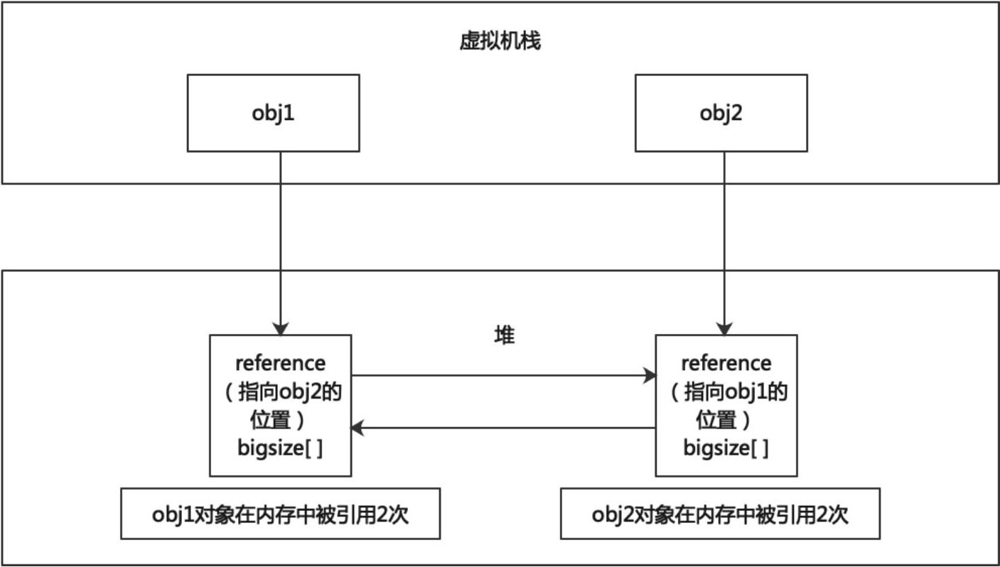
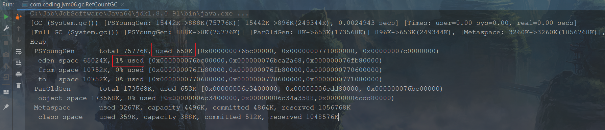
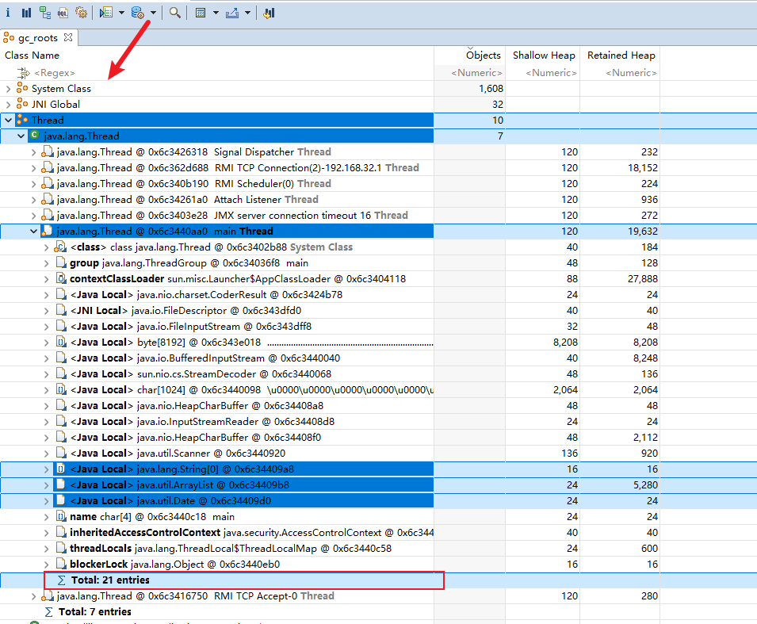
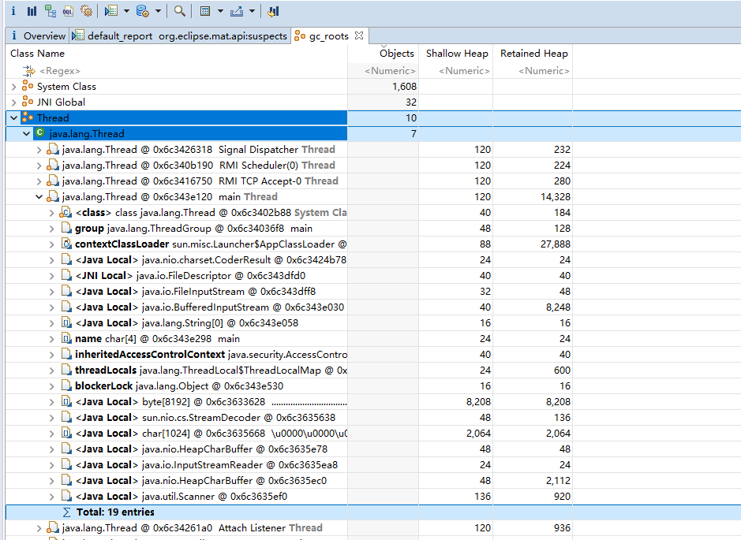
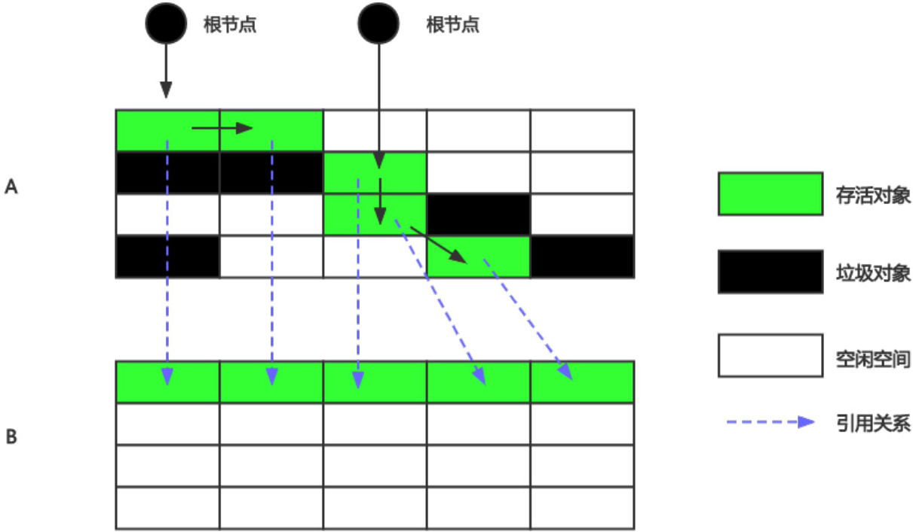

# 第14章 垃圾收集相关算法

​	<span style="color:red;font-weight:bold;">垃圾回收可以分成两个阶段，分别是标记阶段和清除阶段</span>，本章将重点讲解两个阶段各自使用的算法。标记阶段的任务是标记哪些对象是垃圾，<span style="color:red;font-weight:bold;">标记算法包括引用计数算法和可达性分析算法</span>。清除阶段的任务是清除垃圾对象，<span style="color:red;font-weight:bold;">清除算法包括标记–清除算法、复制算法和标记–压缩算法</span>。此外本章还将介绍分代收集算法、增量收集算法、分区算法和对象的finalization机制。

## 14.1 对象存活判断

​	在堆里存放着几乎所有的Java对象实例，在GC执行垃圾回收之前，首先需要区分出内存中哪些是存活对象，哪些是已经死亡的对象。只有被标记为死亡的对象，GC才会在执行垃圾回收时，释放掉其所占用的内存空间，这个过程我们可以称为垃圾标记阶段。

​	那么在JVM中究竟是如何标记一个死亡对象呢？简单来说，当一个对象已经不再被任何的存活对象继续引用时，就可以宣判为已死亡。

​	判断对象存活一般有两种方式：引用计数算法和可达性分析算法。

### 14.1.1 引用计数算法

​	引用计数算法(Reference Counting)比较简单，对每个对象保存一个整型的引用计数器属性，用于记录对象被引用的次数。

​	对于一个对象A，只要有任何一个对象引用了A，则A的引用计数器就加1；当引用失效时，引用计数器就减1。只要对象A的引用计数器的值为0，即表示对象A不可能再被使用，可进行回收。

​	引用计数算法的优点是实现简单，垃圾对象便于辨识，判定效率高，回收没有延迟性。但是引用计数算法也存在如下几个缺点：

1. 每个对象需要单独的字段存储计数器，这样的做法增加了存储空间的开销。
2. 每次赋值操作都需要更新计数器，伴随着加法和减法操作，这增加了时间开销。
3. 每个对象需要单独的字段存储计数器，这样的做法增加了存储空间的开销。每次赋值操作都需要更新计数器，伴随着加法和减法操作，这增加了时间开销。另外，引用计数器有一个严重的问题，即无法处理循环引用的情况。比如有对象A和对象B，对象A中含有对象B的引用，对象B中又含有对象A的引用。此时对象A和对象B的引用计数器都不为0，但是系统中却不存在任何第3个对象引用了对象A或对象B。也就是说对象A和对象B是应该被回收的垃圾对象，但由于垃圾对象之间互相引用，从而使垃圾回收器无法识别，引起内存泄漏，如下图所示。这是一条致命缺陷，所以目前主流的JVM都摒弃了该算法。

<div style="text-align:center;font-weight:bold;">对象的循环引用</div>


​	下面我们使用代码来证明目前HotSpot的虚拟机中没有使用引用计数算法来判断对象是否可以回收，如下代码所示。

<span style="color:#40E0D0;">案例1：证明Java中没有使用引用计数法</span>

- 代码

```java
/**
 * -XX:+PrintGCDetails
 * 发现能回收，证明Java使用的不是引用计数算法。
 */
public class RefCountGC {
    // 这个成员属性唯一的作用就是占用一点内存
    private byte[] bigSize = new byte[5 * 1024 * 1024]; // 5MB

    Object reference = null;


    public static void main(String[] args) {
        RefCountGC obj1 = new RefCountGC();
        RefCountGC obj2 = new RefCountGC();

        obj1.reference = obj2;
        obj2.reference = obj1;

        obj1 = null;
        obj2 = null;

        // 显式的执行垃圾回收行为
        // 这里发生GC，obj1和obj2能否被回收？
        System.gc();
    }
}
```

​	如果HotSpot中使用了引用计数算法，那么就算把obj1和obj2的引用置为null，在Java堆当中的两块对象依然保持着互相引用，将会导致两个对象内存无法回收，如下图所示。

<div style="text-align:center;font-weight:bold;">对象引用示意图</div>



​	然而运行程序，并打印GC详细信息显示堆区所占的空间为650K，远远小于10M，表示obj1和obj2的对象被Java的垃圾回收机制给回收了，否则obj1和obj2各有一个5M的bigSize数组实例对象，堆内存将超过10M。所以目前HotSpot的虚拟机的垃圾标记阶段没有采用引用计数算法。程序运行结果的GC信息如下图所示。

<div style="text-align:center;font-weight:bold;">代码运行结果图</div>



​	Java没有选择引用计数，是因为其存在一个基本的难题，也就是很难处理循环引用关系。但并不是所有语言都摒弃了引用计数算法，例如Python语言就支持引用计数算法，在Python语言中可以采用手动解除或者使用弱引用(Weakref)的方式解决循环引用，但是如果处理不当，循环引用就会导致内存泄漏。

### 14.1.2 可达性分析算法

​	相对于引用计数算法而言，可达性分析算法同样具备实现简单和执行高效等特点，更重要的是，该算法可以有效地解决在引用计数算法中循环引用的问题，防止内存泄漏的发生，这个算法目前较为常用。

​	Java语言选择使用可达性分析算法判断对象是否存活。这种类型的垃圾收集通常叫作追踪性垃圾收集(Tracing Garbage Collection)，它的基本流程如下。

​	可达性分析算法是以GC Root（根对象）（见14.2.1节）为起始点，按照从上至下的方式搜索被根对象集合所连接的目标对象是否可达。GC Root不止一个，它们构成了一个集合，称为“GC Roots”，所谓“GC Roots”集合就是一组必须活跃的引用。

​	使用可达性分析算法后，内存中的存活对象都会被根对象集合直接或间接连接着，搜索所走过的路径称为引用链(Reference Chain)。如果目标对象没有在引用链上，则表示对象是不可达的，就意味着该对象已经死亡，可以标记为垃圾对象。即在可达性分析算法中，只有引用链上的对象才是存活对象。

## 14.2 GC Roots集合

​	在可达性分析算法中使用了GC Root，那么GC Roots集合中就是一组必须活跃的引用。那么哪些对象的引用需要放到GC Roots集合呢？

### 14.2.1 GC Roots

​	在Java语言中，GC Roots集合中的对象引用包括以下几种类型。

1. 虚拟机栈中对象的引用，比如，各个线程被调用的方法中使用到的引用数据类型的参数、局部变量等。
2. 本地方法栈内JNI（本地方法）对象的引用。
3. 方法区中引用数据类型的静态变量。
4. 方法区中常量对象的引用，比如字符串常量池(String Table)里的引用。
5. 所有被同步锁synchronized持有的对象引用。
6. JVM内部的引用。基本数据类型对应的Class对象引用，一些常驻的异常对象引用（如NullPointerException、OutOfMemoryError），系统类加载器对象引用等。
7. 反映JVM内部情况的JMXBean、JVMTI中注册的回调、本地代码缓存对象的引用等。

​	GC Roots内存引用示例如图14-4所示。左侧表示GC Roots，右侧分为ReachableObjects（可达对象）和Unreachable Objects（不可达对象），其中不可达对象就是所谓的垃圾对象。就好比果园里面的果树，如果水果长在树上，肯定是可以根据树根找到水果的，此时水果就不是垃圾；如果水果掉落到地上，此时树根无法连接水果，掉落的水果就是垃圾。

<div style="text-align:center;font-weight:bold;">GC Roots内存引用示例图</div>


​	除了这些固定的GC Roots集合以外，根据用户所选用的垃圾收集器以及当前回收的内存区域不同，还可以有其他对象“临时性”地加入，共同构成完整的GCRoots集合。

​	 另外，如果只针对Java堆中的某一块区域进行垃圾回收（比如新生代），必须考虑到内存区域是JVM自己的实现细节，而不是孤立封闭的，这个区域的对象完全有可能被其他区域的对象所引用，这时候就需要一并将关联的区域对象加入GC Roots集合中去考虑，才能保证可达性分析的准确性。

​	<span style="color:#9400D3;">如果要使用可达性分析算法来判断内存是否可回收，那么分析工作必须在一个能保障一致性的快照中进行</span>。这点不满足的话分析结果的准确性就无法保证，这也是导致垃圾回收时必须STW（Stop The World，整个应用程序暂停一段时间）的一个重要原因。即使是号称不会发生停顿的CMS收集器中，枚举根节点时也是必须要停顿的。

### 14.2.2 MAT追踪GC Roots的溯源

​	MAT是Memory Analyzer的简称，它是一款功能强大的Java堆内存分析器。MAT是基于Eclipse开发的，是一款免费的性能分析工具。MAT可以用于查找内存泄漏以及查看内存消耗情况。下面我们使用MAT查看哪些对象是GC Root。

​	大家可以在 https://www.eclipse.org/mat/download 下载并使用MAT。

> 启动报错咋办？
> https://www.cnblogs.com/hong0632/p/8677853.html

<div style="text-align:center;font-weight:bold;">MAT版本与JDK版本的关系</div>

| MAT版本                        | JDK版本 |
| ------------------------------ | ------- |
| MemoryAnalyzer-1.15.0.20231206 | 17+     |
| MemoryAnalyzer-1.14.0.20230315 | 17+     |
| MemoryAnalyzer-1.13.0.20220615 | 11+     |
| MemoryAnalyzer-1.12.0.20210602 | 11+     |
| MemoryAnalyzer-1.11.0.20201202 | 1.8+    |

<span style="color:#40E0D0;">案例1：MAT分析GC Roots</span>

- 代码

```java
public class GCRootsTest {
    public static void main(String[] args) {
        List<Object> numList = new ArrayList<Object>();
        Date birth = new Date();

        for (int i = 0; i < 100; i++) {
            numList.add(String.valueOf(i));
            try {
                Thread.sleep(10);
            } catch (InterruptedException e) {
                e.printStackTrace();
            }
        }
        System.out.println("数据添加完毕，请操作：");
        // next()方法等着用户输入数据，是一个阻塞方法，此时留出时间，可以给内存拍照，生成dump文件
        new Scanner(System.in).next();
        numList = null;
        birth = null;

        System.out.println("numList、birth已置空，请操作：");
        new Scanner(System.in).next();
        System.out.println("结束");
    }
}
```

​	分析堆内存之前，首先需要获取dump文件。dump文件又叫内存转储文件或内存快照文件，是进程的内存镜像。dump文件中包含了程序运行的模块信息、线程信息、堆栈调用信息、异常信息等数据。获取dump文件有两种方式，分别是使用命令jmap和使用jvisualvm工具。

1. 使用命令jmap。
    - 运行GCRootsTest程序后，使用jps命令查询到GCRootsTest进程pid，再使用命令jmap –dump:format=b,live,file就可以导出堆内存文件。可以分别在两次等待键盘输入时，使用jmap命令生成dump文件。

<div style="text-align:center;font-weight:bold;">使用命令行生成dump文件</div>


2. 使用jvisualvm工具。

    - 使用VisualVM Launcher插件运行JDK自带的jvisualvm.exe工具捕获的heapdump文件是一个临时文件，关闭jvisualvm后自动删除，若要保留，需要将其另存为文件。使用VisualVM Launcher插件启动GCRootsTest程序之后，可通过以下方法存储dump文件。

        1. 在左侧“应用程序”子窗口中右击相应的应用程序（例如，com.coding.jvm06.gc.GCRootsTest）。
        2. 在右侧“监视”子标签页中单击“堆Dump”按钮。
        3. 本地应用程序的堆作为应用程序标签页的一个子标签页打开。同时，堆在左侧的应用程序栏中对应一个含有时间戳的节点。右击这个节点选择“另存为(S)”即可将堆保存到本地。

      <div style="text-align:center;font-weight:bold;">dump文件概要及另存为操作示意图</div>


​	堆文件已经准备就绪，下面就需要分析哪些对象是GC Root了。[Eclipse中对Garbage Collection Roots的官方描述](https://help.eclipse.org/latest/index.jsp?topic=/org.eclipse.mat.ui.help/welcome.html)。

​	使用Memory Analyzer工具查看jvisualvm导出的dump文件的步骤如下。

1. 打开Memory Analyzer工具，单击“File”中的“Open File”选择要打开的dump文件。
2. 当打开dump文件后选择设置中的“Java Basics”下的“GC Roots”，单击打开。
3. 当打开文件后在Thread下找到main主线程后单击打开。
4. 可以看到String、ArrayList、Date都作为GC Root出现了，当前程序主线程GC Roots中共有21个实体。

<div style="text-align:center;font-weight:bold;">用Memory Analyzer打开dump文件</div>


<div style="text-align:center;font-weight:bold;">查看当前程序主线程中所有的GC Root</div>



​	继续执行程序，程序中将numList和birth变量值修改为“null”后，用上述同样方法再保存一个dump文件，之后再用Memory Analyzer工具打开，如图所示，可以看出图中的ArrayList和Date实体类都消失了，当前程序的主线程中GCRoots还有19个实体。

<div style="text-align:center;font-weight:bold;">查看当前程序主线程中剩余的GC Root</div>



### 14.2.3 JProfiler追踪GC Roots的溯源

​	另外，也可以使用Java剖析工具JProfiler进行GC Roots的溯源。JProfiler是一个独立的应用程序，但它提供Eclipse和IntelliJ IDEA等IDE的插件。安装好JProfiler程序之后，就可以与IntelliJ IDEA集成，之后就可以在IDEA中通过JProfiler插件启动运行了。

​	大家可以在https://www.ej-technologies.com/jprofiler/download下载并使用JProfiler。

1. 在IDEA中用JProfiler插件运行JProfiler程序。

<div style="text-align:center;font-weight:bold;">在IDEA中运行JProfiler程序</div>


2. 当程序运行起来之后，JProfiler便会监控该程序的内存、线程、类、对象的变化。选中左侧“Live memory（实时内存）”当前动态的内存情况，在“All Objects（所有对象）”中可以看到当前程序中所有对象的个数。

<div style="text-align:center;font-weight:bold;">JProfiler中动态内存所有对象统计图</div>


3. 此时选择“View（视图）”菜单中的“Mark Current Values（标记当前值）”选项标记当前的值，标记后所有对象数量的显示颜色为绿色。

<div style="text-align:center;font-weight:bold;">JProfiler中动态内存标记当前值</div>


4. 随着程序的运行，对象数量的颜色可能会发生变化，左半部分的区域表示截至标记时刻内存中的对象数量，颜色发生变化的右边区域表示从标记开始之后对象数量的变化，从“Difference（相差）”值列中也可以看到详细的数量变化。我们可以根据对象数量的变化来分析内存的变化，例如String类型的对象在标记之后增加了6个。

<div style="text-align:center;font-weight:bold;">JProfiler中动态内存标记之后的变化</div>


5. 如果需要单独查询某个类型的对象数据，鼠标右击该类型，在弹出的上下文菜单中选择“Show Selection In Heap Walker（在堆遍历器中显示所选内容）”进行单独查询。下面我们单独查询对象数量最多的char[]类型数组的数据。

<div style="text-align:center;font-weight:bold;">选择单独查询char[]类型数组对象信息</div>


6. 进入单独查询char[]类型的对象时，可以看出包含了和char[]类型数组对象有关的Classes、Allocations、Biggest Objects、References等信息。

<div style="text-align:center;font-weight:bold;">char[​]类型数组对象相关信息查询页</div>


7. 下面我们重点关注char[]类型数组的相关引用，选择“References（引用）”时我们看到了所有char[]类型数组对象的引用信息，如下图所示。进行排查内存泄漏问题时可以进行溯源。

<div style="text-align:center;font-weight:bold;">所有char[]类型数组对象的相关引用</div>


8. 此时选中“Incoming references（传入引用）”，如下图所示。Incoming references表示查看当前对象被哪些外部对象引用，据此可以判断当前对象和哪个GC Root相关联。

<div style="text-align:center;font-weight:bold;">选择具体char[]类型数组对象引用信息</div>


9. 例如选中“char[] ［"添加完毕，请操作：..."］”这个char[]类型数组对象，再单击“Show Paths To GC Root（显示到GC Root的路径）”按钮，可以查看它被GC Root引用，如下图所示。

<div style="text-align:center;font-weight:bold;">查询“char[​] ［"添加完毕，请操作：..."］”这个char[​]类型数组的GC Root</div>


10. 在弹出的对话框中，选择“Single root（单根）”，单击“OK”，如下图所示。

<div style="text-align:center;font-weight:bold;">选择Single root（单根）</div>


11. 如下图所示，显示了“char[] ［"添加完毕，请操作：..."］”这个char[]类型数组对象的GC Root是System.out对象。

<div style="text-align:center;font-weight:bold;">查看“char[] ［"添加完毕，请操作：..."］”这个char[]类型数组对象GC Root的来源</div>


## 14.3 对象的finalization机制

​	Java语言提供了对象终止(finalization)机制来允许开发人员自定义对象被销毁之前的处理逻辑。当垃圾回收器发现没有引用指向一个对象时，通常接下来要做的就是垃圾回收，即清除该对象，而finalization机制使得在清除此对象之前，总会先调用这个对象的finalize()方法。

​	finalize()方法允许在子类中被重写，用于在对象被回收时进行资源释放或清理相关内存，例如关闭文件、套接字和数据库连接等。但是，不要过分依赖对象的finalize()方法来释放资源，最好有其他的方法来释放资源，例如手动调用close()方法，理由如下。

1. 在调用finalize()方法时可能会导致对象复活，即在finalize()方法中当前对象this又被赋值给了一个有效的变量引用。
2. 一个糟糕的finalize()会严重影响GC的性能，而长时间的GC是会影响程序运行性能和体验的。
3. finalize()方法的执行时间是没有保障的，它完全由GC线程决定，极端情况下，若不发生GC，则finalize()方法将没有执行机会。另外，finalize()方法工作效率很低。如果一个对象在回收前需要调用finalize()方法的话，要先将其加入一个队列，之后由Finalizer线程处理这些对象，而这个线程的优先级非常低，所以很难被CPU执行到，进而导致对象的finalize()方法迟迟不能被执行，资源迟迟不能被释放，对象迟迟不能被垃圾回收。

​	从功能上来说，finalize()方法与C++中的析构函数比较相似，都是用来做清理善后的工作。只不过C++中需要手动调用析构函数清理内存，而Java采用的是基于垃圾回收器的自动内存管理机制。finalize()方法在本质上不同于C++中的析构函数。

​	由于finalize()方法的存在，JVM中的对象一般处于三种可能的状态。如果从所有的根节点都无法访问到某个对象，说明该对象已经不再使用了。一般来说，此对象需要被回收。但事实上，也并非是“非死不可”的，这时候它们暂时处于“缓刑”阶段。一个无法触及的对象有可能在某一个条件下“复活”自己，如果这样，那么对它的回收就是不合理的，为此，定义JVM中的对象可能的三种状态。

1. 可触及的：从根节点开始，可以到达这个对象。
2. 可复活的：对象的所有引用都被释放，但是对象有可能在finalize()中复活。
3. 不可触及的：对象的finalize()被调用，并且没有复活，那么就会进入不可触及状态。不可触及的对象不可能被复活，因为每一个对象的finalize()只会被调用一次。

​	以上三种状态中只有在对象不可触及时才可以被回收。

​	判定一个对象objA是否可回收，至少要经历以下两次标记过程。

1. 如果GC Roots到对象objA没有引用链，则进行第一次标记。
2. 判断此对象是否有必要执行finalize()方法。

​	如果对象objA没有重写finalize()方法，或者finalize()方法已经被JVM调用过，则JVM视为“没有必要执行”，objA被判定为不可触及。

​	如果对象objA重写了finalize()方法，且还未执行过，那么objA会被插入到F-Queue队列中，由一个JVM自动创建的、低优先级的Finalizer线程触发其finalize()方法执行。

​	finalize()方法是对象逃脱死亡的最后机会，稍后GC会对F-Queue队列中的对象进行第二次标记。如果objA在finalize()方法中与引用链上的任何一个对象建立了联系，那么在第二次标记时，objA会被移出“即将回收”集合。之后，对象如果再次出现没有引用存在的情况，finaliz()方法就不会被再次调用，对象会直接变成不可触及的状态，也就是说，一个对象的finalize()方法只会被调用一次。

<span style="color:#40E0D0;">案例1：测试对象的finalization机制</span>

- 代码

```java
/**
 * 测试Object类中finalize()方法，即对象的 finalization 机制。
 */
public class CanReliveObj {

    public static CanReliveObj obj; // 类变量；属于GC Root

    /**
     * 此方法只能被调用1次
     * <p>
     * 【该方法存在时】：
     * 调用当前类重写的finalize()方法
     * 第1次GC
     * obj is still alive
     * 第2次GC
     * obj is dead
     * <p>
     * 【该方法不存在时】：
     * 第1次GC
     * obj is dead
     * 第2次GC
     * obj is dead
     */
    @Override
    protected void finalize() throws Throwable {
        super.finalize();
        System.out.println("调用当前类重写的finalize()方法");
        obj = this; // 当前待回收的对象在finalize()方法中与引用链上的任何一个对象建立了联系，导致当前对象复活
    }

    public static void main(String[] args) {
        try {
            obj = new CanReliveObj();
            // obj 设置为 null，表示 obj 不引用 CanReliveObj 对象了，它成了垃圾对象
            obj = null;
            System.gc(); // 调用垃圾回收器
            System.out.println("第1次GC");
            // 第1次GC时，重写了finalize()方法，finalize()会被调用
            // finalize()方法中，CanReliveObj对象可能复活
            // 因为Finalizer线程优先级很低，暂停2秒，等待它被CPU调度。
            Thread.sleep(2000);
            if (obj == null) {
                System.out.println("obj is dead");
            } else {
                System.out.println("obj is still alive");
            }
            // 下面这段代码与上面的完全相同，但是这次自救失败了。
            obj = null;
            System.gc();
            System.out.println("第2次GC");
            // 因为Finalizer线程优先级很低，暂停2秒，等待它被CPU调度。
            Thread.sleep(2000);
            if (obj == null) {
                System.out.println("obj is dead");
            } else {
                System.out.println("obj is still alive");
            }
        } catch (InterruptedException e) {
            e.printStackTrace();
        }
    }
}
```

​	在没有重写Object类中finalize()方法时，即注释掉上面代码中的finalize()方法，当第一次进行GC时obj对象已经被垃圾回收了，运行结果如下图所示。

<div style="text-align:center;font-weight:bold;">没重写finalize()方法时运行结果</div>


​	当重写Object类中finalize()方法时，当第一次进行GC时调用了finalize()方法，因为在finalize()方法中又让静态变量obj引用了当前对象，所以obj对象就没有被垃圾回收，当第二次进行GC时obj对象才被垃圾回收。运行结果如下图所示。

<div style="text-align:center;font-weight:bold;">重写finalize()方法时运行结果</div>


​	上述代码可以看到第一次回收时，对象的finalize()方法被执行，但是它仍然可以存活。但是任何一个对象的finalize()方法都只会被系统自动调用一次，如果面临下一次回收，它的finalize()方法不会被再次执行，因此第2段代码的自救行动就失败了。

## 14.4 清除垃圾对象

​	当成功区分出内存中存活对象和死亡对象后，GC接下来的任务就是执行垃圾回收，释放无用对象所占用的内存空间，以便有足够的可用内存空间分配给新对象。

​	目前在JVM中比较常见的三种垃圾收集算法是标记–清除算法(Mark-Sweep)、复制算法(Copying)、标记–压缩算法(Mark-Compact)。

### 14.4.1 标记–清除算法

​	标记–清除算法是一种非常基础和常见的垃圾收集算法，该算法由J.McCarthy等人在1960年提出并应用于Lisp语言。

​	标记–清除算法的执行过程是当堆中的有效内存空间(Available Memory)被耗尽的时候，就会停止整个程序，然后进行两项工作，一是标记，二是清除。

1. 标记：垃圾收集器从引用根节点开始遍历，标记所有被引用的对象。
2. 清除：垃圾收集器对堆内存从头到尾进行线性遍历，如果发现某个对象为不可达对象，则将其回收。

​	标记–清除算法解析如下图所示。

<div style="text-align:center;font-weight:bold;">标记–清除算法</div>


​	标记-清除算法的优点是简单、容易实现，而且不需要移动对象。但是缺点也很明显，在进行GC的时候，需要停止整个应用程序，导致用户体验差。最重要的是这种方式清理出来的空闲内存是不连续的，会产生内存碎片，而且该算法清除对象并不是真的置空，而是把需要清除的对象地址保存在空闲的地址列表里，下次有新对象申请内存时，判断某块内存空间是否充足，如果充足，新的对象将会覆盖原来标记为垃圾的对象，从而实现内存的重复使用。但是因为可用内存不连续问题，在大对象申请内存时，需要花费更多时间去找寻合适的位置，甚至失败。所以标记-清除算法效率不高，且内存利用率低下，甚至有些内存碎片无法重复利用。

### 14.4.2 复制算法

​	为了解决标记—清除算法在垃圾收集中内存利用率低的缺陷，M.L.Minsky于1963年发表了著名的论文《使用双存储区的Lisp语言垃圾收集器》(A Lisp GarbageCollector Algorithm Using Serial Secondary Storage)。M.L.Minsky在该论文中描述的算法被人们称为复制(Copying)算法，它也被M.L.Minsky本人成功地引入到了Lisp语言的一个实现版本中。

​	它的核心思想是将活着的内存空间分为两块，每次只使用其中一块，在垃圾回收时将正在使用的内存中的存活对象复制到未被使用的内存块中，之后清除正在使用的内存块中的所有对象。两块内存交替使用，从而完成垃圾对象的回收，如下图所示。

​	复制算法没有标记和清除过程，实现简单，运行高效。内存从一块空间复制到另一块空间可以保证空间的连续性，不会出现内存碎片问题。但是复制算法需要双倍内存空间，而且需要移动对象，这就涉及修改对象引用地址值的问题。另外，对于G1这种把内存拆分成大量region的垃圾收集器，意味着需要维护各个region之间对象引用关系，在时空消耗方面都不低。

​	特别需要注意的是如果系统中的垃圾对象很少，复制算法不会很理想。因为复制算法需要复制的存活对象数量变大，使得垃圾回收器的运行效率变低。

<div style="text-align:center;font-weight:bold;">复制算法</div>



### 14.4.3 标记–压缩算法

​	复制算法的高效性是建立在存活对象少、垃圾对象多的前提下。这种情况在新生代经常发生，但是在老年代，更常见的情况是大部分对象都是存活对象。如果依然使用复制算法，由于存活对象较多，复制的成本也将很高。因此，基于老年代垃圾回收的特性，需要使用其他的算法。

​	标记–清除算法的确可以应用在老年代中，但是该算法不仅执行效率低下，而且在执行完内存回收后还会产生内存碎片，所以JVM的设计者需要重新优化垃圾对象的清除算法。1970年前后，G.L.Steele、C.J.Chene和D.S.Wise等研究者发布了标记–压缩算法。在许多现代的垃圾收集器中，人们都使用了标记–压缩算法。该算法的执行过程如下图所示。

1. 第一阶段和标记–清除算法一样，从根节点开始标记所有被引用对象。
2. 第二阶段将所有的存活对象压缩到内存的一端，按顺序排放。
3. 第三阶段清理边界外所有的空间。

<div style="text-align:center;font-weight:bold;">标记–压缩算法执行过程</div>


​	标记–压缩算法的最终效果等同于标记–清除算法执行完成后，再进行一次内存碎片整理，因此，也可以把它称为标记–清除–压缩(Mark-Sweep-Compact)算法。

​	二者的本质差异在于标记–清除算法是一种非移动式的回收算法，标记–压缩是移动式的。是否移动回收后的存活对象却是一项优缺点并存的风险决策，优点是避免了内存碎片，也大大简化了可用内存和不可用内存的区分，缺点是移动对象意味着需要修改对象的引用地址值。

​	可以看到，在标记–压缩算法中标记的存活对象将会被整理，按照内存地址依次排列，而未被标记的内存会被清理。如此一来，当我们需要给新对象分配内存时，JVM只需要持有一个可用内存的起始地址即可，这比维护一个空闲地址列表显然少了许多开销。

​	如果内存空间以规整和有序的方式分布，即已用和未用的内存都各自一边，彼此之间维系着一个记录下一次内存分配起始点的标记指针，当为新对象分配内存时，只需要将新对象分配在第一个空闲内存位置上，同时修改指针的偏移量，这种分配方式就叫作指针碰撞(Bump the Pointer)。

​	标记–压缩算法算法的优点如下。

1. 消除了标记–清除算法当中，内存区域分散的缺点，我们需要给新对象分配内存时，JVM只需要持有一个内存的起始地址即可。
2. 消除了复制算法当中，内存减半的高额代价。

​	该算法的缺点如下。

1. 从效率上来说，标记–压缩算法要低于复制算法，因为需要先标记，再整理移动。
2. 另外，如果对象被其他对象引用，移动对象的同时，还需要调整引用的地址。对象移动过程中，需要全程暂停用户应用程序，即STW(Stop The World)。

<div style="text-align:center;font-weight:bold;">三种算法的对比表</div>


## 14.5 垃圾收集算法的复合与升级

### 14.5.1 分代收集算法

​	前面所有这些算法中，并没有一种算法可以完全替代其他算法，它们都具有自己独特的优势和特点，此时分代收集(Generational Collecting)算法应运而生。

​	在程序开发中，有这样一个既定的事实：不同的对象的生命周期是不一样的。例如有些对象与业务信息相关，比如Http请求中的Session对象、线程对象、Socket连接对象，这类对象跟业务直接挂钩，因此生命周期比较长。但是还有一些对象，主要是程序运行过程中生成的临时变量，这些对象生命周期会比较短，甚至有些对象只用一次即可回收。还有像String这种比较特殊类型的对象，因为对象的不可变性，对String对象的修改、拼接等操作都会产生很多垃圾对象，它们的生命周期也都很短。因此在HotSpot的JVM中，把Java堆分为新生代和老年代，生命周期较短的对象一般放在新生代，生命周期较长的对象会进入老年代。不同区域的对象，采取不同的收集方式，以便提高回收效率。

​	目前几乎所有的垃圾收集器都是采用分代收集算法执行垃圾回收的。基于分代的概念，垃圾收集器所使用的内存回收算法必须结合新生代和老年代各自的特点。

**1 新生代(Young Gen)**

​	新生代特点是区域相对老年代较小，对象生命周期短、存活率低、回收频繁。而复制算法的效率只和当前存活对象数量大小有关，结合新生代的特点，新生代使用复制算法，速度最快、效率也最高。复制算法在新生代，对于常规应用的垃圾回收，一次通常可以回收70%～99%的内存空间，回收性价比很高。所以现在的商业JVM都是用这种收集算法回收新生代。鉴于复制算法内存利用率不高的问题，HotSpot没有把新生区简单地一分为二，而是通过把新生区分为Eden、From和To三个区域，如图14-31所示，每次新生代发生GC时，把Eden区和上次幸存区中在本次GC仍然存活的对象复制到另一个幸存区，幸存区在From区和To区之间切换，总有一块空间为空，从而解决内存利用率低的问题。

<div style="text-align:center;font-weight:bold;">复制算法在新生代的应用场景</div>


**2 老年代(Tenured Gen)**

​	老年代特点是区域较大，对象生命周期长、存活率高，回收不及新生代频繁。这种情况存在大量存活率高的对象，复制算法明显变得不合适。一般是由标记–清除或者标记–清除与标记–压缩的混合实现。

​	在老年代的收集算法有以下特点：

1. 标记(Mark)阶段的开销与存活对象的数量呈正比。
2. 清除(Sweep)阶段的开销与所管理区域的大小呈正比。
3. 压缩(Compact)阶段的开销与存活对象的数量呈正比。

​	以HotSpot中的CMS(Concurrent Mark Sweep)回收器为例，CMS是基于标记–清除算法实现的，对于对象的回收效率很高。当因为内存碎片导致出现Concurrent Mode Failure异常时，CMS将采用基于标记–压缩算法的Serial Old回收器作为补偿措施，此时Serial Old会执行Full GC以达到对老年代内存的整理。

​	分代的思想被现有的JVM广泛使用，几乎所有的垃圾回收器都区分新生代和老年代。

### 14.5.2 增量收集算法

​	上述现有的算法，在垃圾回收过程中，应用软件将处于一种STW(Stop TheWorld)的状态。在STW状态下，应用程序所有的线程都会挂起，暂停一切正常的工作，等待垃圾回收的完成。如果垃圾回收时间过长，应用程序会被挂起很久，将严重影响用户体验或者系统的稳定性。为了解决这个问题，急需一种实时垃圾收集算法，增量收集(Incremental Collecting)算法由此诞生。

​	增量收集基本思想是如果一次性将所有的垃圾进行处理，会造成系统长时间的停顿，那么就可以让垃圾收集线程和应用程序线程交替执行。每次垃圾收集线程只收集一小片区域的内存空间，接着切换到应用程序线程。依次反复，直到垃圾收集完成。

​	总的来说，增量收集算法的基础仍是传统的标记–清除和复制算法。增量收集算法通过对线程间冲突的妥善处理，允许垃圾收集线程以分阶段的方式完成标记、清理或复制工作。

​	增量收集算法的优点是在垃圾回收过程中，间断性地执行了应用程序代码，从而解决了系统的长时间停顿带来的用户体验差和系统稳定性问题。但是因为线程切换和上下文转换的消耗，会使得垃圾回收的总体成本上升，造成系统吞吐量的下降。

### 14.5.3 分区收集算法

​	一般来说，在相同条件下，堆空间越大，一次GC所需要的时间就越长，有关GC产生的停顿也就越长。为了更好地控制GC产生的停顿时间，将一块大的内存区域分割成多个小块，根据目标的停顿时间，每次合理地回收若干个小区间，而不是整个堆空间，从而减少一次GC所产生的停顿。

​	分代算法按照对象的生命周期长短将堆空间划分成两个部分，分区算法将整个堆空间划分成连续的不同小区间(region)，如下图所示。每一个小区间都独立使用、独立回收。这种算法的好处是可以控制一次回收多少个小区间。

<div style="text-align:center;font-weight:bold;">分区算法示例图</div>


​	大家要注意一点，这些只是基本的算法思路，实际GC实现过程要复杂得多，目前还在发展中的前沿GC都是复合算法，并且并行和并发兼备。