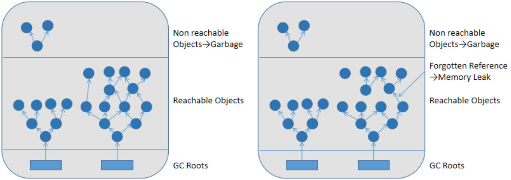
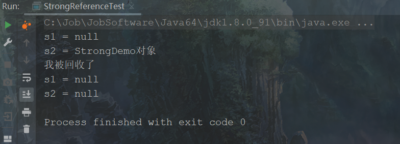

# 第15章 垃圾收集相关概念

​
通过上一章的学习，让我们对垃圾收集的算法思路有所了解，相当于主体思路有了，但是要把这些算法落地，还涉及很多细节。本章将为大家讲解除了收集算法之外的其他相关技术点，为第16章垃圾收集器的学习扫清障碍。本章讲解的内容包括System.gc()
、内存溢出、内存泄漏、STW机制以及垃圾收集的串行、并行、并发三种情况，还有强引用、软引用、弱引用、虚引用四种引用。

## 15.1 System.gc()的理解

​ 在默认情况下，通过System.gc()或者Runtime.getRuntime().gc()的调用，会显式触发Full
GC，同时对老年代和新生代进行回收，尝试释放被丢弃对象占用的内存。然而System.gc()
调用附带一个免责声明，无法保证对垃圾收集器的调用，也就是说该方法的作用只是提醒垃圾收集器执行垃圾收集(GarbageCollection,GC)
，但是不确定是否马上执行GC。一般情况下，垃圾收集是自动进行的，无须手动触发，否则就失去自动内存管理的意义了。下面使用代码演示调用System.gc()
手动触发GC，如下代码所示。

<span style="color:#40E0D0;">案例1：手动调用System.gc()</span>

- 代码

```java
public class TestSystem {
    public static void main(String[] args) {
        byte[] buffer = new byte[10 * 1024 * 1024];
        buffer = null;
        // System.gc(); // 手动触发GC
    }
}
```

​ 执行上面方法之前配置JVM参数-XX:
+PrintGCDetails，方便看到GC日志信息，进而分析内存是否被回收。虽然“buffer=null”操作使得上一行代码的byte[]
数组对象成了垃圾对象，但是因为当前JVM内存充足，不加“System.gc();”这句代码的话，自动GC操作并没有被触发。当加上“System.gc()
;”这句代码时，就手动触发了GC操作，如下图所示。

<div style="text-align:center;font-weight:bold;">没有手动调用System.gc()方法运行结果</div>


<div style="text-align:center;font-weight:bold;">手动调用System.gc()方法运行结果</div>


## 15.2 内存溢出与内存泄漏

### 15.2.1 内存溢出

​ 内存溢出(Out Of Memory,OOM)是引发程序崩溃的罪魁祸首之一。由于垃圾收集技术一直在发展，一般情况下，除非应用程序占用的内存增长速度非常快，造成垃圾收集已经跟不上内存消耗的速度，否则不太容易出现内存溢出的情况。

​ 大多数情况下，GC会进行各个内存区域的垃圾收集，实在不行了就放大招，来一次独占式的Full GC操作，这时候会回收大量的内存，供应用程序继续使用。

​
Java中对内存溢出的解释是，没有空闲内存，并且垃圾收集器也无法回收更多内存。如果出现没有空闲内存的情况，说明JVM的堆内存不够，此时会报“java.lang.OutOfMemoryError”的错误。发生堆内存溢出错误的原因可能有以下几方面。

1. JVM的堆内存设置不够。

​
也很有可能就是堆的大小不合理，比如要处理比较大的数据量，但是没有显式指定JVM堆大小或者指定数值偏小，可以通过参数“-Xms”“-Xmx”来调整。如果堆内存设置不够，将会报“java.lang.OutOfMemoryError:
Java heap space”的错误。

2. 代码中创建了大量的大对象，并且长时间不能被垃圾收集器收集，因为这些对象仍然被引用。
3. 对于老版本的Oracle
   JDK，因为永久代的大小是有限的，并且JVM对永久代垃圾收集（例如常量池回收、卸载不再需要的类型）非常不积极，所以当不断添加新类型、字符串常量对象时占用太多空间，都会导致内存溢出问题。永久代内存溢出的错误信息为“java.lang.OutOfMemoryError:
   PermGen
   space”。随着字符串常量池从方法区中移出，以及元空间的引入，方法区内存已经不再那么窘迫，所以相应的内存溢出现象也会有所改观。当在元空间出现内存溢出时，异常信息则变成了“java.lang.OutOfMemoryError:
   Metaspace”。

4. 可能存在内存泄漏问题。

### 15.2.2 内存泄漏

​ 内存泄漏(Memory Leak)
也称作“存储渗漏”。严格来说，只有对象不会再被程序用到了，但是GC又不能回收它们的情况，才叫内存泄漏。比如，内存一共有1024MB，分配了512MB的内存一直不回收，那么可以用的内存只有512MB了，仿佛泄漏掉了一部分。如下图所示，从GC
Roots出发，可以找到当前被引用的所有对象，当对象不再被GC Roots可达时，就变成了垃圾对象；下图中的右侧有部分对象(Forgotten
Reference)在程序中已经不可用，但是还可以被GC Roots引用到，这时就是内存泄漏。

<div style="text-align:center;font-weight:bold;">内存泄漏图示</div>



​ 实际上，很多时候一些不太好的实践（或疏忽）会导致对象的生命周期变得很长甚至导致内存溢出，也可以叫作宽泛意义上的内存泄漏。

​ 尽管内存泄漏并不会立刻引起程序崩溃，但是一旦发生内存泄漏，程序中的可用内存就会被逐步蚕食，直至耗尽所有内存，最终出现内存溢出异常，导致程序崩溃。

​ 注意，这里的存储空间并不是指物理内存，而是指虚拟内存，这个虚拟内存的大小取决于磁盘交换区设定的大小。

​ 下面举两个内存泄漏的例子。

1. 单例模式

​ 单例的生命周期和应用程序是一样长的，所以单例程序中，如果持有对外部对象的引用，那么这个外部对象是不能被回收的，则会导致内存泄漏的产生。

2. 未手动关闭资源

​ 如数据库连接、网络连接、IO连接等资源，除非用户显示调用其close()方法，否则这些资源不会自动被垃圾收集器回收。

​ Java中把内存泄漏容易发生的场景归类为8种情况，如下所示。

**1 静态集合类内存泄漏**

​
静态集合类有HashMap、LinkedList等。如果这些容器为静态的，那么它们的生命周期与JVM程序一致，则容器中的对象在程序结束之前将不能被释放，从而造成内存泄漏。简单而言，长生命周期的对象持有短生命周期对象的引用，尽管短生命周期的对象不再使用，但是因为长生命周期对象持有它的引用而导致不能被回收。如下代码所示，每次调用oomTests()
方法的时候都会往list中存放对象，调用次数多了就会占用很大的内存空间。

<span style="color:#40E0D0;">案例1：静态集合类内存泄漏案例</span>

- 代码

```java
public class MemoryLeak {

    static List list = new ArrayList<>();

    public void oomTests() {
        Object obj = new Object(); // 局部变量
        list.add(obj);
    }
}
```

**2 单例模式**

​ 单例模式和静态集合导致内存泄漏的原因类似，因为单例的静态特性，它的生命周期和JVM的生命周期一样长，所以如果单例对象持有外部对象的引用，那么这个外部对象也不会被回收，那么就会造成内存泄漏。

**3 内部类持有外部类**

​ 如果一个外部类的实例对象的方法返回了一个内部类的实例对象，这个内部类对象被长期引用了，即使那个外部类实例对象不再被使用，但由于内部类持有外部类的实例对象，这个外部类对象将不会被垃圾回收，也会造成内存泄漏。

**4 连接未及时关闭**

​ 在对数据库进行操作的过程中，首先需要建立与数据库的连接，当不再使用时，需要调用close()
方法来释放与数据库的连接。只有连接被关闭后，垃圾收集器才会回收对应的对象。否则，如果在访问数据库的过程中，对Connection、Statement或ResultSet不显性地关闭，将会造成大量的对象无法被回收，从而引起内存泄漏，类似的还有网络连接和IO连接等。如代码清单15-3所示，使用jdbc的时候没有及时关闭连接，如果频繁地连接数据库，就会造成对象的堆积。

<span style="color:#40E0D0;">案例1：连接未及时关闭</span>

- 代码

```java
public static void main(String[] args) {
    Connection conn = null;
    Class.forName("com.mysql.jdbc.Driver");
    conn = DriverManager.getConnection("url", "", "");
    Statement stmt = conn.createStatement();
    ResultSet rs = stmt.executeQuery("...");
} catch (Exception e) { // 异常日志
} finally {
    // 1.关闭结果集 Statement
    // 2.关闭声明的对象ResultSet
    // 3.关闭连接 Connection
}
```

**5 变量不合理的作用域**

​
一般而言，一个变量定义的作用范围大于其使用范围，很有可能会造成内存泄漏。另一方面，如果没有及时地把对象设置为null，很有可能导致内存泄漏的发生。如下代码所示，通过readFromNet()
方法把接收的消息保存在变量msg中，然后调用saveDB()方法把msg的内容保存到数据库中，此时msg已经没用了，由于msg的生命周期与对象的生命周期相同，此时msg还不能回收，因此造成了内存泄漏。

​ 实际上，这个msg变量可以放在receiveMsg()
方法内部，当方法使用完，那么msg的生命周期也就结束了，此时就可以回收了。还有一种方法，在使用完msg后，把msg设置为null，这样垃圾收集器也会回收msg的内存空间。

<span style="color:#40E0D0;">案例1：变量不合理的作用域</span>

- 代码

```java
public class UsingRandom {
    private String msg;
    public void receiveMsg() {
        // private String msg;
        readFromNet(); // 从网络中接收数据保存到msg中
        saveDB(); // 把msg保存到数据库中
        // msg = null;
    }
}
```

**6 改变哈希值**

​
当一个对象被存储进HashSet集合中以后，就不能修改这个对象中的那些参与计算哈希值的字段了。否则，对象修改后的哈希值与最初存储进HashSet集合中的哈希值就不同了，在这种情况下，即使在contains()
方法中使用该对象的引用地址作为参数去检索HashSet集合中的对象，也将返回该对象不存在的结果，就会导致无法从HashSet集合中单独删除该对象，造成内存泄漏。这也是为什么String被设置成了final类型，可以放心地把String存入HashSet，或者把String当作HashMap的key值。当我们想把自己定义的类保存到Hash表的时候，需要保证对象的hashCode不可变。如下代码演示了修改对象的hashCode之后对象无法被删除的场景。

<span style="color:#40E0D0;">案例1：更改对象的hashCode之后对象无法被删除</span>

- 代码

```java
package com.coding.jvm07.gui;

import java.util.HashSet;

public class ChangeHashCode1 {
    public static void main(String[] args) {
        HashSet<Point> hs = new HashSet<>();
        Point cc = new Point();
        cc.setX(10); // hashCode = 41
        hs.add(cc);
        cc.setX(20); // hashCode = 51
        System.out.println("hs.remove=" + hs.remove(cc)); // false
        hs.add(cc);
        System.out.println("hs.size=" + hs.size()); // size = 2
        System.out.println(hs);
    }
}

class Point {
    int x;

    public int getX() {
        return x;
    }

    public void setX(int x) {
        this.x = x;
    }

    @Override
    public int hashCode() {
        final int prime = 31;
        int result = 1;
        result = prime * result + x;
        return result;
    }

    @Override
    public boolean equals(Object o) {
        if (this == o) return true;
        if (o == null || getClass() != o.getClass()) return false;
        Point point = (Point) o;
        return x == point.x;
    }

    @Override
    public String toString() {
        return "Point{" +
                "x=" + x +
                '}';
    }
}
```

​ 执行结果如下所示。

```cmd
hs.remove=false
hs.size=2
[Point{x=20}, Point{x=20}]
```

​ 可以看到HashSet中的对象改变了hash值以后，无法移除元素导致元素滞留内存当中，还可以继续新增元素，导致内存泄漏。

**7 缓存泄漏**

​ 内存泄漏的另一个常见来源是缓存，一旦把对象引用放入缓存中，就很容易遗忘，如果程序长时间运行下去，就会让内存中的对象越来越多，导致程序溢出。

​
对于这个问题，可以使用WeakHashMap代表缓存，此类Map的特点是，当除了自身有对key的引用外，此key没有其他对象引用，那么此Map会自动丢弃此值，WeakHashMap的原理就是弱引用（见15.5.3节）。下面代码演示了HashMap和WeakHashMap之间的区别。

<span style="color:#40E0D0;">案例1：缓存泄漏</span>

- 代码

```java
/**
 * 演示内存泄漏
 */
public class MapTest {
    static Map wMap = new WeakHashMap<>();
    static Map map = new HashMap();

    public static void main(String[] args) {
        init();
        testWeakHashMap();
        testHashMap();
    }

    public static void init() {
        String ref1 = new String("object1");
        String ref2 = new String("object2");
        String ref3 = new String("object3");
        String ref4 = new String("object4");
        wMap.put(ref1, "cacheObject1");
        wMap.put(ref2, "cacheObject2");
        map.put(ref3, "cacheObject3");
        map.put(ref4, "cacheObject4");
        System.out.println("String引用ref1,ref2,ref3,ref4消失");
    }

    private static void testWeakHashMap() {
        System.out.println("WeakHashMap GC之前");
        for (Object o : wMap.entrySet()) {
            System.out.println(o);
        }
        try {
            System.gc();
            TimeUnit.SECONDS.sleep(5);
        } catch (Exception e) {
            e.printStackTrace();
        }
        System.out.println("WeakHashMap GC之后");
        for (Object o : wMap.entrySet()) {
            System.out.println(o);
        }
    }

    private static void testHashMap() {
        System.out.println("HashMap GC之前");
        for (Object o : map.entrySet()) {
            System.out.println(o);
        }
        try {
            System.gc();
            TimeUnit.SECONDS.sleep(5);
        } catch (Exception e) {
            e.printStackTrace();
        }
        System.out.println("HashMap GC之后");
        for (Object o : map.entrySet()) {
            System.out.println(o);
        }
    }
}
```

​ 运行结果如下。

```cmd
String引用ref1,ref2,ref3,ref4消失
WeakHashMap GC之前
object2=cacheObject2
object1=cacheObject1
WeakHashMap GC之后
HashMap GC之前
object4=cacheObject4
object3=cacheObject3
HashMap GC之后
object4=cacheObject4
object3=cacheObject3
```

​
上面代码演示了WeakHashMap如何自动释放缓存对象，当init函数执行完成后，局部变量字符串引用ref1、ref2、ref3和ref4都会消失，此时只有静态Map中保存对字符串对象的引用，可以看到，调用gc之后，HashMap没有被回收，而WeakHashMap里面的缓存被回收了。

**8 监听器和回调**

​ 内存泄漏另一个常见来源是监听器和其他回调，如果客户端在实现的API中注册回调，却没有显式取消，那么就会积聚。需要确保回调立即被当作垃圾回收的最佳方法是只保存它的弱引用，例如将它们保存为WeakHashMap中的键。

## 15.3 Stop-The-World

​ 在垃圾回收过程中，整个应用程序都会暂停，没有任何响应，所以被形象地称为“Stop-The-World”，简称STW。

​ 可达性分析算法中枚举根节点(GC Roots)造成STW，原因是如果出现分析过程中对象引用关系还在不断变化，则分析结果的准确性无法保证。所以分析工作必须在一个能确保一致性的快照中进行。

​ 被STW中断的应用程序线程会在完成GC之后恢复，频繁中断会让用户感觉像是网速不给力造成电影卡顿一样，体验非常不好，所以我们需要减少STW的发生。

​ STW的发生与所使用的垃圾收集器是什么无关，每一种垃圾收集器都会发生STW，即使G1回收器也不能完全避免。随着垃圾收集器的发展演变，回收效率越来越高，STW的时间也在进一步缩短。

​
STW是JVM在后台自动发起和自动完成的。在用户不可见的情况下，把用户正常的工作线程全部停掉。下面我们编写一段代码，通过调用System.gc()
方法来感受STW的发生，如下面代码所示，注意在实际开发中一般不会手动调用System.gc()方法。

<span style="color:#40E0D0;">案例1：感受STW</span>

- 代码

```java
public class StopTheWorldDemo {

    public static class WorkThread extends Thread {
        List<byte[]> list = new ArrayList<byte[]>();

        @Override
        public void run() {
            try {
                while (true) {
                    for (int i = 0; i < 1000; i++) {
                        byte[] buffer = new byte[1024 * 256]; // 若不明显，可以增加这里的byte数组大小
                        list.add(buffer);
                    }

                    if (list.size() > 10000) {
                        list.clear();
                        System.gc(); // 会触发full gc，进而会出现STW事件
                    }
                }
            } catch (Exception e) {
                e.printStackTrace();
            }
        }
    }

    public static class PrintThread extends Thread {
        SimpleDateFormat s = new SimpleDateFormat("yyyy 年 MM 月 dd 日 HH:mm:ss");

        @Override
        public void run() {
            try {
                while (true) {
                    // 每秒打印时间信息
                    String str = s.format(new Date());
                    System.out.println(str);
                    Thread.sleep(1000);
                }
            } catch (InterruptedException e) {
                e.printStackTrace();
            }
        }
    }

    public static void main(String[] args) {
        WorkThread w = new WorkThread();
        PrintThread p = new PrintThread();
        w.start();
        p.start();
    }
}
```

​ 代码中PrintThread线程是每隔一秒钟打印一次时间，在WorkThread线程被注释掉的情况下，代码输出的情况是每隔一秒打印一次时间，如下图所示。

<div style="text-align:center;font-weight:bold;">PrintThread线程结果示意图</div>


​ 代码中WorkThread线程负责把byte数组放到list集合中，如果list集合的长度大于10000，清除list集合的数据并进行Full
GC，进而触发STW，就会使PrintThread线程出现卡顿的情况，从而使之前每隔一秒打印的时间变长。打开WorkThread线程注释，运行结果如下图所示，可以看到图中画框的部分间隔时间为2秒，表明PrintThread线程被暂停了1秒。

<div style="text-align:center;font-weight:bold;">StopTheWorld代码的运行结果示意图</div>


## 15.4 安全点与安全区域

### 15.4.1 安全点

​
在第15.3节讲到，在垃圾回收过程中，应用程序会产生停顿，发生STW现象。但是应用程序在执行过程中，并不是在任意位置都适合停顿下来进行GC的，只有在特定的位置才能停顿下来进行GC操作，这些特定的位置被称为安全点(
SafePoint)。

​ 安全点的选择至关重要，如果安全点太少可能导致GC等待的时间太长，如果安全点太密可能导致运行时的性能问题。那么，哪些位置作为安全点合适呢？通常选择一些运行时间较长的指令位置，例如方法调用、循环跳转等。

​ 当GC发生时，如何保证应用程序的线程是在安全点呢？

​ 抢先式中断：GC抢先中断所有线程。如果发现某个线程不在安全点，就重新恢复该线程，让线程跑到安全点。这种方式是由GC线程占主导位置的，违背了应用程序才是主角的定位，所以目前几乎所有虚拟机都不选择这种方式。

​ 主动式中断：GC线程给自己设置一个中断标志，各个应用线程运行到安全点的时候主动轮询这个标志，如果此时GC线程的中断标志为真，则将自己中断挂起。这种方式的好处是由应用程序在安全点主动发起中断，而不会出现被迫在非安全点的位置先中断的情况。

### 15.4.2 安全区域

​
安全点机制保证了程序执行时，在不太长的时间内就会遇到可进入GC的安全点。但是，应用程序的线程“不执行”怎么办呢？例如线程处于阻塞(
Blocked)
状态，这时候应用线程无法响应JVM的中断请求，“走”到安全点去中断挂起，JVM也不太可能等待应用线程被唤醒之后再进行GC。对于这种情况，就需要安全区域(
Safe Region)机制来解决。

​    <span style="color:#9400D3;">
安全区域是指在一段代码片段中，对象的引用关系不会发生变化，在这个区域中的任何位置开始GC都是安全的</span>
。我们也可以把安全区域看作是被“放大”了的安全点。

​ 在程序实际运行过程中，线程对于安全区域的处理方式如下。

1. 当线程运行安全区域的代码时，首先标识已经进入了安全区域，如果这段时间内发生GC,JVM会忽略标识为安全区域状态的线程。
2. 当线程即将离开安全区域时，会检查JVM是否已经完成GC，如果完成了，则继续运行，否则线程必须等待直到收到可以安全离开安全区域的信号为止。

## 15.5 四种引用

​ 所谓的引用就是记录一个对象的地址，然后通过这个地址值找到这个对象并使用这个对象。最初Java只有强引用，例如“User user=new
User（"问秋","666"）”，user变量记录了一个User对象的地址，之后程序便可以通过user这个变量访问对象的属性值"问秋"和"666"
，或者通过user这个变量调用对象的方法。<span style="color:#9400D3;">
Java中8种基本数据类型以外的变量都称为引用数据类型的变量</span>，上面的user就是对象的引用，也称为对象名。

​    <span style="color:red;font-weight:bold;">在JDK
1.2版之后，Java对引用的概念进行了细分，将引用分为强引用、软引用、弱引用和虚引用，这四种引用强度依次递减。</span>

​
除强引用外，其他三种引用均需要创建特殊的引用类对象来“构建”引用关系。这些特殊的引用类在java.lang.ref包中，如下图所示，它们分别是SoftReference（软引用）、PhantomReference（虚引用）、WeakReference（弱引用），开发人员可以在应用程序中直接使用它们。

<div style="text-align:center;font-weight:bold;">软引用、弱引用、虚引用对应的类</div>


​ 针对不同引用类型的对象，GC的态度也是完全不同的。

1. 强引用(StrongReference)：是最传统的引用关系，比如前面提到的“Useruser=new User（"问秋","666"
   ）”这种引用关系。只要强引用关系还存在，无论任何情况垃圾收集器都永远不会回收掉被引用的对象。
2. 软引用(SoftReference)：在系统将要发生内存溢出之前，垃圾收集器收集完垃圾对象的内存之后，内存仍然吃紧，此时垃圾收集器会把软引用的对象列入回收范
   围之中进行第二次回收，如果这次回收后还没有足够的内存，才会抛出内存溢出异常。
3. 弱引用(WeakReference)：被弱引用关联的对象只能生存到下一次垃圾收集之前。当垃圾收集器工作时，无论内存空间是否足够，都会回收掉被弱引用关联的对象。
4. 虚引用(PhantomReference)：一个对象是否有虚引用的存在，完全不会对其生存时间构成影响，也无法通过虚引用来获得一个对象的实例。为一个对象设置虚引用关联的唯一目的就是能在这个对象被收集器回收时收到一个系统通知。

### 15.5.1 强引用——不回收

​ 在Java程序中，最常见的引用类型是强引用（普通系统99%以上都是强引用），也就是我们最常见的普通对象引用，也是默认的引用类型。

​ 当在Java语言中使用new关键字创建一个新的对象，并将其赋值给一个变量的时候，这个变量就成为指向该对象的一个强引用。

​
如果一个对象被某个变量强引用了，只有引用它的变量超过了作用域或者显式地被赋值为null值，并且此时没有其他变量引用这个对象，那么这个对象才成了不可达的垃圾对象，可以被回收了，当然具体回收时机还是要看垃圾收集策略。换句话说，只要一个对象，被某个变量强引用了，这个变量还在作用域范围内，就表示这个对象是可达的、可触及的，垃圾收集器永远不会回收被强引用的对象。所以，强引用是造成Java内存泄漏的主要原因之一。

​ 相对的，软引用、弱引用和虚引用的对象是软可触及、弱可触及和虚可触及的，在一定条件下，都是可以被回收的。

​ 下面通过代码演示强引用关系的对象可达时不会被GC回收，不可达时才会被GC回收，如下代码所示。

<span style="color:#40E0D0;">案例1：强引用测试</span>

- 代码

```java
/**
 * 强引用的测试
 */
public class StrongReferenceTest {
    public static void main(String[] args) {
        StrongDemo s1 = new StrongDemo();
        StrongDemo s2 = s1;

        s1 = null;
        System.gc();

        try {
            // 3秒的延迟保证GC有时间工作
            Thread.sleep(3000);
        } catch (InterruptedException e) {
            e.printStackTrace();
        }

        System.out.println("s1 = " + s1);
        System.out.println("s2 = " + s2);

        s2 = null;
        System.gc();

        try {
            // 3秒的延迟保证GC有时间工作
            Thread.sleep(3000);
        } catch (InterruptedException e) {
            e.printStackTrace();
        }
        System.out.println("s1 = " + s1);
        System.out.println("s2 = " + s2);
    }
}
```

​ 创建StrongDemo类如下所示，重写finalize()方法，如果该方法被执行，表明该类型对象被回收。

- 代码

```java
public class StrongDemo {
    @Override
    protected void finalize() throws Throwable {
        System.out.println("我被回收了");
    }

    @Override
    public String toString() {
        return "StrongDemo对象";
    }
}
```

​ 上面代码的运行结果如下。

<div style="text-align:center;font-weight:bold;">强引用关系对象的回收观察</div>



​ 执行完“StrongDemo s1 = new StrongDemo();”语句时，对应内存结构如下图所示。

<div style="text-align:center;font-weight:bold;">强引用StrongDemo对象内存结构图</div>


​ 执行完“StrongDemo s2 = s1;”语句时，对应内存结构如下图所示。

<div style="text-align:center;font-weight:bold;">强引用StrongDemo赋值语句内存结构图</div>


​ 在第一次GC工作时，虽然通过“s1 =
null”解除了s1变量和StrongDemo对象的强引用关系，但是因为s2仍然指向该StrongDemo对象，所以GC不会回收StrongDemo对象。此时通过s1无法再找到StrongDemo对象，而通过s2还可以找到StrongDemo对象。

​ 在第二次GC工作时，因为“s2 =
null”语句也解除了s2变量和StrongDemo对象的强引用关系，此时没有其他变量引用StrongDemo对象了，所以GC会回收StrongDemo对象。此时通过s1和s2都无法找到StrongDemo对象了。

​ 本例中的两个变量和StrongDemo对象，都是强引用关系，强引用关系具备以下特点。

1. 可以通过变量名直接访问目标对象。
2. 强引用所指向的对象在任何时候都不会被系统回收，虚拟机宁愿抛出内存溢出异常，也不会回收强引用所指向对象。
3. 强引用可能导致内存泄漏。

### 15.5.2 软引用——内存不足立即回收

​ 软引用是用来描述一些还有用，但非必需的对象。如果内存空间足够，垃圾收集器就不会回收它，如果内存空间不足，就会回收这些对象的内存。只要垃圾收集器没有回收它，该对象就可以被程序使用。

​
当内存空间不是很充足的时候，用户可以通过软引用机制实现缓存，其工作原理是：当内存还富裕时，就暂时保留缓存对象；当内存开始吃紧时，就可以清理掉缓存对象。这样就保证了在将对象进行缓存时不会耗光内存。软引用实现的缓存既提高了程序性能，又节省了内存空间。

​ 垃圾收集器在某个时刻决定回收软可达的对象的时候，JVM会尽量让软引用的存活时间长一些，迫不得已才清理。一般而言，在JVM内存非常紧张临近溢出之前，垃圾收集器会收集这部分对象。

​ 在JDK 1.2版之后提供了java.lang.ref.SoftReference类来实现软引用，使用方法如下所示。

```java
SoftReference<Object> sf = new SoftReference<Object>(对象);
```

​ 也可以在建立软引用关系时，指定一个引用队列(Reference Queue)，之后可以通过这个引用队列跟踪这些软引用对象。

```java
SoftReference<Object> sf = new SoftReference<Object>(对象, 引用队列);
```

​ 下面我们使用代码演示软引用对象被回收的现象，如下代码所示，在执行程序之前需要配置JVM参数，JVM参数配置在代码上面的注释中。

<span style="color:#40E0D0;">案例1：软引用测试</span>

- 代码

```java
/**
 * 软引用的测试：内存不足即回收
 * -Xms10m -Xmx10m -XX:+PrintGCDetails
 */
public class SoftReferenceTest {

    public static class User {
        public int id;
        public String name;
        private byte[] data = new byte[1024 * 1024];

        public User(int id, String name) {
            this.id = id;
            this.name = name;
        }

        @Override
        public String toString() {
            return "User{" + "id=" + id + ", name='" + name + '\'' + '}';
        }
    }

    public static void main(String[] args) {
        // 创建对象，建立软引用
        SoftReference<User> userSoftRef = new SoftReference<>(new User(1, "emon"));
        // 上面的一行代码，等价于如下的三行代码
        /*User u1 = new User(1, "emon");
        SoftReference<User> userSoftRef = new SoftReference<User>(u1);
        u1 = null; // 取消强引用*/

        // 从软引用中重新获得强引用
        System.out.println(userSoftRef.get());

        System.gc();
        System.out.println("After GC:");
        // 垃圾回收之后获得软引用中的对象，由于堆空间内存足够，所以不会回收软引用的可达对象
        System.out.println(userSoftRef.get());

        try {
            // 让系统认为内存资源紧张
            // byte[] b = new byte[1024 * 1024 * 6];
        } catch (Exception e) {
            e.printStackTrace();
        } finally {
            // 再次从软引用中获取数据
            System.out.println(userSoftRef.get()); // 在报OOM之前，垃圾回收器会回收软引用的可达对象，已经找不到了
        }
    }
}
```

​ 上面代码运行到第一次GC时，内存充足，软引用的可达对象没有被回收，所以“After
GC：”之后仍然可以从软引用中获取到引用对象。当代码继续运行，创建了一个byte数组，因为这个byte数组的长度为“1024 * 1024 *
6”，此时JVM的堆内存变得很紧张，软引用的可达对象被回收了，之后再从软引用中获取对象得到的是null值，运行结果如下图所示。

<div style="text-align:center;font-weight:bold;">内存不足未报内存溢出时回收软引用</div>


​ 如果修改代码中字节数组的大小为“1024 * 1024 * 7”，或者更大，此时会发生OOM异常，如图15-10所示，那么软引用对象一定是会被GC清理掉的。

<div style="text-align:center;font-weight:bold;">内存不足时回收软引用</div>


### 15.5.3 弱引用——发现即回收

​ 弱引用是用来描述那些非必需对象，只被弱引用关联的对象只能生存到下一次垃圾收集发生时。在垃圾收集器准备清理垃圾对象时，只要发现弱引用，不管系统堆空间是否充足，就会回收只被弱引用关联的对象。

​ 弱引用是用来描述那些非必需对象，只被弱引用关联的对象只能生存到下一次垃圾收集发生时。在垃圾收集器准备清理垃圾对象时，只要发现弱引用，不管系统堆空间是否充足，就会回收只被弱引用关联的对象。

​ 但是，由于垃圾收集器的线程通常优先级很低，因此，并不一定能迅速地清理完所有弱引用的对象。在这种情况下，弱引用对象可以存在较长的时间。

​ 在JDK
1.2版之后提供了java.lang.ref.WeakReference类来实现弱引用，使用方法如下面代码所示。弱引用和软引用一样，在构造弱引用时，也可以指定一个引用队列，当弱引用对象被回收时，就会加入指定的引用队列，之后这个队列可以跟踪对象的回收情况。软引用、弱引用都非常适合来保存那些可有可无的缓存数据。

```java
WeakReference<Object> wr = new WeakReference<Object>(对象);
```

​ 弱引用对象与软引用对象的最大不同就在于，当垃圾收集器在进行回收时，需要通过算法检查是否回收软引用对象，而对于弱引用对象，垃圾收集器直接进行回收。弱引用对象更容易、更快被垃圾收集器回收。

​ 下面我们使用代码演示弱引用对象被回收的现象，如下代码所示。

<span style="color:#40E0D0;">案例1：若引用测试</span>

- 代码

```java
public class WeakReferenceTest {

    public static class User {
        public int id;
        public String name;

        public User(int id, String name) {
            this.id = id;
            this.name = name;
        }

        @Override
        public String toString() {
            return "User{" + "id=" + id + ", name='" + name + '\'' + '}';
        }
    }

    public static void main(String[] args) {
        // 创建对象，建立软引用
        WeakReference<User> userWeakRef = new WeakReference<>(new User(1, "emon"));
        // 上面的一行代码，等价于如下的三行代码
        /*User u1 = new User(1, "emon");
        WeakReference<User> userWeakRef = new WeakReference<User>(u1);
        u1 = null; // 取消强引用*/

        // 从软引用中重新获得强引用
        System.out.println(userWeakRef.get());

        System.gc();
        System.out.println("After GC:");
        // 垃圾回收之后获得软引用中的对象
        System.out.println(userWeakRef.get()); // 已经找不到了

    }
}
```

​ 上面代码的运行结果如下图所示，可以看到弱引用对象在GC行为发生时就被直接回收了。

<div style="text-align:center;font-weight:bold;">弱引用对象被GC回收</div>


### 15.5.4 虚引用——对象回收跟踪

​ 虚引用也称为“幽灵引用”或者“幻影引用”，是所有引用类型中最弱的一个。

​ 一个对象是否有虚引用存在，完全不会决定对象的生命周期。如果一个对象仅持有虚引用，那么它和没有引用几乎是一样的，随时都可能被垃圾收集器回收。

​ 它不能单独使用，也无法通过虚引用来获取被引用的对象。当试图通过虚引用的get()方法取得对象时，总是null。

​    <span style="color:#9400D3;">为一个对象设置虚引用的唯一目的在于跟踪垃圾收集过程</span>。比如在这个对象被收集器回收时收到一个系统通知。

​    <span style="color:#9400D3;">虚引用必须和引用队列一起使用。虚引用在创建时必须提供一个引用队列作为参数</span>
。当垃圾收集器准备回收一个对象时，如果发现它还有虚引用，就会在回收对象后，将这个虚引用加入引用队列，以通知应用程序对象的回收情况。由于虚引用可以跟踪对象的回收时间，因此，也可以将一些资源释放操作放置在虚引用中执行和记录。在JDK
1.2版之后提供了PhantomReference类来实现虚引用，使用方法如下面代码所示。

- 代码

```java
ReferenceQueue phantomQueue = new ReferenceQueue();
PhantomReference<Object> pf = new PhantomReference<Object>(对象, phantomQueue);
```

​ 我们使用代码演示虚引用，如下代码所示。

<span style="color:#40E0D0;">案例1：虚引用测试</span>

- 代码

```java
/**
 * 虚引用的测试
 */
public class PhantomReferenceTest {

    private static PhantomReferenceTest obj; // 当前类对象的声明
    private static ReferenceQueue<PhantomReferenceTest> phantomQueue = null; // 引用队列的声明

    public static class CheckRefQueue extends Thread {
        @Override
        public void run() {
            while (true) {
                if (phantomQueue != null) {
                    PhantomReference<PhantomReferenceTest> obj = null;
                    try {
                        obj = (PhantomReference<PhantomReferenceTest>) phantomQueue.remove();
                    } catch (Exception e) {
                        e.printStackTrace();
                    }
                    if (obj != null) {
                        System.out.println("追踪垃圾回收过程：PhantomReferenceTest实例被GC了");
                    }
                }
            }
        }
    }

    // finalize() 方法只能被调用一次
    @Override
    protected void finalize() throws Throwable {
        super.finalize();
        System.out.println("调用当前类的finalize()方法");
        obj = this;
    }

    public static void main(String[] args) {
        Thread t = new CheckRefQueue();
        t.setDaemon(true); // 设置为守护线程
        t.start();

        phantomQueue = new ReferenceQueue<PhantomReferenceTest>();
        obj = new PhantomReferenceTest();
        // 构造了 PhantomReferenceTest 对象的虚引用，并指定了引用队列
        PhantomReference<PhantomReferenceTest> phantomRef = new PhantomReference<PhantomReferenceTest>(obj, phantomQueue);


        try {
            // 不可获取虚引用中的对象
            System.out.println(phantomRef.get());

            // 将强引用去除
            obj = null;
            // 第一次进行GC，由于对象可复活，GC无法回收该对象
            System.out.println("第一次进行GC");
            System.gc();
            Thread.sleep(1000);
            if (obj == null) {
                System.out.println("obj 是 null");
            } else {
                System.out.println("obj 可用"); // 输出结果
            }

            // 将强引用去除
            obj = null;
            // 第二次进行GC
            System.out.println("第二次进行GC");
            System.gc();
            Thread.sleep(1000);
            if (obj == null) {
                System.out.println("obj 是 null"); // 输出结果
            } else {
                System.out.println("obj 可用");
            }
        } catch (InterruptedException e) {
            e.printStackTrace();
        }
    }
}
```

​ 虚引用不同于软引用和弱引用，试图用get()方法去获取对象是徒劳的，得到的永远是null值。

​ 上面代码中CheckRefQueue线程用来操作引用队列，第二次GC时在队列中就能取到obj对象，代码就会输出“追踪垃圾收集过程：PhantomReferenceTest实例被GC了”，如下图所示。

<div style="text-align:center;font-weight:bold;">虚引用的验证</div>

