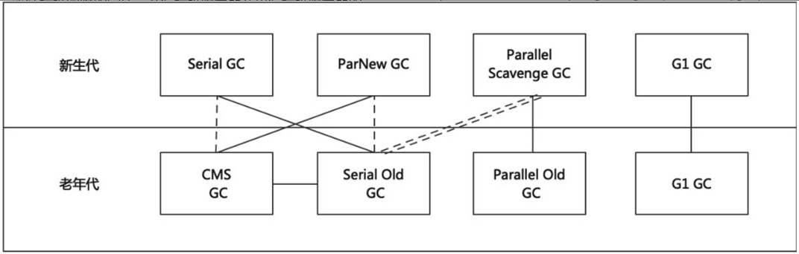
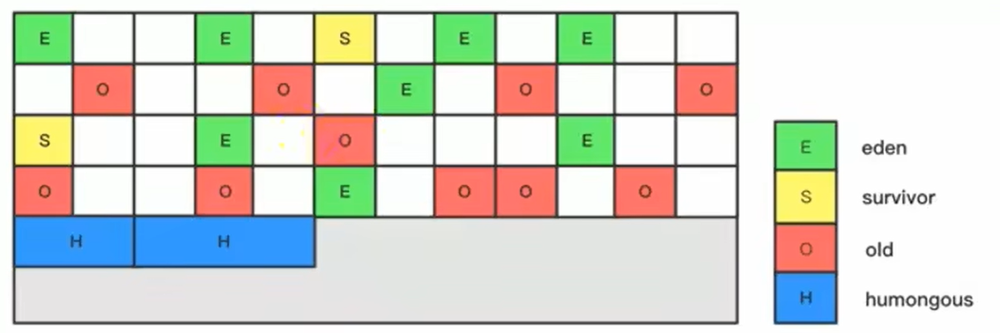
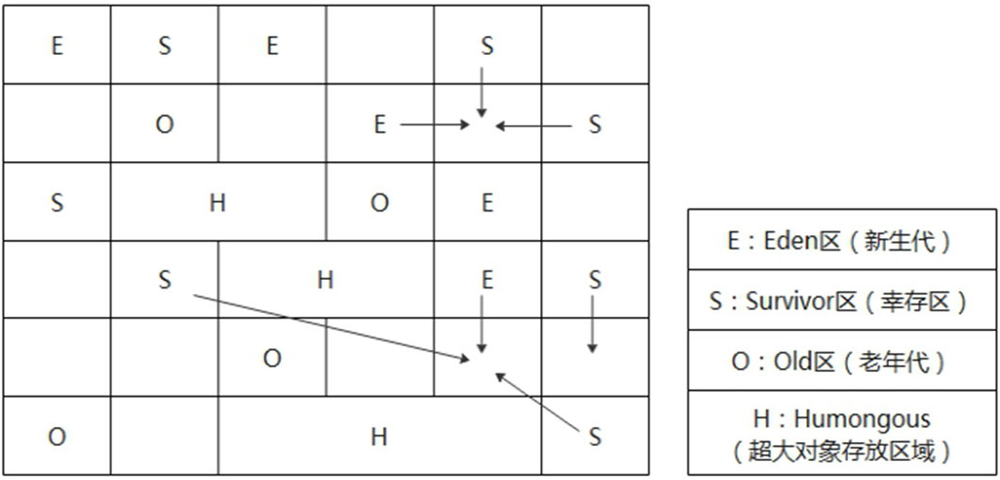
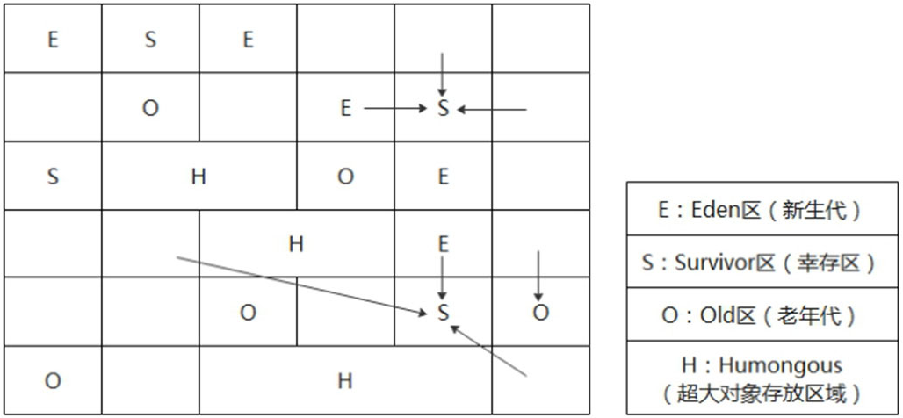

# 第16章 垃圾收集器

​	前面讲了垃圾收集算法有复制算法、标记–清除算法和标记–压缩算法。此时相当于对垃圾收集的理解还处于一种理论状态，相当于只定义了接口，还没有完成实现细节。本章要讲的垃圾收集器就是针对垃圾收集算法的具体实现。接下来我们会从垃圾收集器的发展史开始，详细讲解各种类型的垃圾收集器和其适用的应用场景。

## 16.1 垃圾收集器的发展和分类

​	内存处理是编程人员容易出现问题的地方，忘记或者错误的内存回收会导致程序或系统的不稳定甚至崩溃。JVM有一套内存的自动管理机制，Java程序员可以把绝大部分精力放在业务逻辑的实现上，不用过多地关心对象的内存申请、分配、回收等问题。自动内存管理机制是Java的招牌能力，极大地提高了开发效率，也大大降低了内存溢出或内存泄漏的风险。

​	自动内存管理的内存回收是靠垃圾收集器来实现的，垃圾收集器，英文全称为Garbage Collector，简称GC。在JVM规范中，没有对垃圾收集器做过多的规定。不同厂商、不同版本的JVM对垃圾收集器的实现也各有不同，随着JDK版本的高速迭代，衍生了很多类型的垃圾收集器。

### 16.1.1 评估垃圾收集器的性能指标

​	没有一款垃圾收集器能够适用所有场合，不同的用户需求、不同的程序运行环境和平台对垃圾收集器的要求也各不相同，所以目前HotSpot虚拟机中是多种垃圾收集器并存的。另外，衡量一款垃圾收集器的优劣也有多个指标，而且多个指标之间甚至互相矛盾、互相牵制，很难两全其美。

- <span style="color:red;font-weight:bold;">吞吐量</span>：运行用户代码的时间占总运行时间的比例。总运行时间=程序的运行时间+内存回收的时间。

- 垃圾收集开销：吞吐量的补数，内存回收所用时间与总运行时间的比例。

- <span style="color:red;font-weight:bold;">停顿时间</span>：执行垃圾收集时，程序的工作线程被暂停的时间。

- 收集频率：垃圾收集操作发生的频率。

- <span style="color:red;font-weight:bold;">内存占用</span>：Java堆区大小设置。

​	其中吞吐量、停顿时间、内存占用这三者共同构成一个“不可能三角”，即不可能同时都满足，一款优秀的收集器通常最多同时满足其中的两项。下面就吞吐量和停顿时间做个对比。

**1 吞吐量**

​	吞吐量就是CPU用于运行用户代码的时间与CPU总消耗时间的比值，即吞吐量=运行用户代码时间/（运行用户代码时间+垃圾收集时间）。比如虚拟机总共运行了100分钟，其中垃圾收集花掉1分钟，那吞吐量就是99%。

​	高吞吐量的应用程序往往有更长的时间基准，快速响应是不必考虑的，这种情况下，应用程序能容忍较高的单次停顿时间。如下图所示，图中的垃圾回收时间是200 + 200 = 400ms,CPU消耗总时间是6000ms，那么吞吐量为(6000-400)/6000 = 93.33%。

<div style="text-align:center;font-weight:bold;">注重吞吐量</div>


**2 停顿时间**

​	停顿时间是指一个时间段内应用程序线程暂停，让垃圾收集线程执行的状态。例如，GC期间100ms的停顿时间意味着在这100ms期间内没有应用程序线程是活动的。

​	停顿时间优先，意味着尽可能让单次程序停顿的时间最短。如下图所示，总的停顿时间是100 + 100 + 100 + 100 + 100 = 500ms。虽然总的停顿时间变长了，但是每次停顿的时间都很短，这样应用程序看起来延迟是比较低的，此时程序的吞吐量为(6000-500)/6000 =91.67%，明显吞吐量会有所降低，但是单次停顿的时间变短了。

<div style="text-align:center;font-weight:bold;">注重低延时</div>


**3 吞吐量和停顿时间的比较**

​	高吞吐量会让应用程序的用户感觉只有应用程序线程在做“生产性”工作。直觉上，吞吐量越高程序运行越快。

​	停顿时间较高会让用户感觉延迟严重，不管是垃圾收集还是其他原因导致一个应用被挂起始终是不好的。不同类型的应用程序对停顿时间的要求有很大差异，有时候甚至短暂的200ms暂停都可能打断终端用户体验。因此，对于一个交互式应用程序，具有低停顿时间是非常重要的。

​	不幸的是，应用程序无法同时满足高吞吐量和低停顿时间。如果选择以吞吐量优先，那么必然需要降低内存回收的执行频率，这样会导致垃圾收集需要更长的停顿时间来执行内存回收。相反的，如果选择以低延迟优先为原则，为了降低每次执行内存回收时的停顿时间，也只能频繁地执行内存回收，但这又引起了新生代内存的缩减和程序吞吐量的下降。

​	在垃圾收集器的发展过程中，不同的垃圾收集器也是在不断地挑战性能指标的极限，或者在尽量兼顾多个性能指标。

### 16.1.2 垃圾收集器的发展史

​	1998年12月8日，第二代Java平台的企业版J2EE正式对外发布。为了配合企业级应用落地，1999年4月27日，Java程序的舞台——Java HotSpot VirtualMachine（以下简称HotSpot）正式对外发布，并从这之后发布的JDK1.3版本开始，HotSpot成为Sun JDK的默认虚拟机。

​	<span style="color:#FF1493;font-weight:bold;">1999年随JDK1.3.1一起发布的是串行方式的Serial GC，它是第一款GC</span>，并且这只是起点。Serial收集器是最基本、历史最悠久的垃圾收集器，它是一个单线程收集器。而之后的ParNew垃圾收集器是Serial收集器的多线程升级版本，除了Serial收集器外，也只有它能与CMS收集器配合工作。

​	2002年2月26日，J2SE1.4发布。<span style="color:#FF1493;font-weight:bold;">Parallel GC和Concurrent MarkSweep(CMS)GC跟随JDK1.4.2一起发布，并且Parallel GC在JDK6之后成为HotSpot默认GC</span>。Parallel GC收集器看似与ParNew收集器在功能上类似，但是它们的侧重点不同，<span style="color:#32CD32;font-weight:bold;">Parallel Scavenge收集器关注点是吞吐量（高效率地利用CPU），CMS等垃圾收集器的关注点更多的是用户线程的停顿时间（提高用户体验）</span>。但是在2020年3月发布的JDK14中，CMS垃圾收集器被彻底删除了。

​	2012年，在JDK1.7u4版本中，又有一种优秀的垃圾收集器被正式投入使用，它就是Garbage First(G1)。随着G1 GC的出现，GC从传统的连续堆内存布局设计，逐渐走向不连续内存块，这是通过引入Region概念实现，也就是说，由一堆不连续的Region组成了堆内存。其实也不能说是不连续的，只是它从传统的物理连续逐渐改变为逻辑上的连续，这是通过Region的动态分配方式实现的，我们可以把一个Region分配给Eden、Survivor、老年代、大对象区间、空闲区间等的任意一个，而不是固定它的作用，因为越是固定，越是呆板。<span style="color:#FF1493;font-weight:bold;">到2017年JDK9中，G1变成了默认的垃圾收集器，替代了CMS</span>。2018年3月发布的JDK10中，G1垃圾收集器已经可以并行完整垃圾回收了，G1实现并行性来改善最坏情况下的延迟。之后在JDK12，继续增强G1，自动返回未用堆内存给操作系统。

​	2018年9月，JDK11发布，在该版本中提到了两个垃圾收集器，一个是Epsilon垃圾收集器，又被称为“No-Op（无操作）”收集器。另一个是ZGC(The ZGarbage Collector)，这是一款可伸缩的低延迟垃圾收集器，此时还是实验性的。ZGC在2019年9月发布的JDK13中继续得到增强，实现自动返回未用堆内存给操作系统。在2020年3月发布的JDK14中ZGC扩展了在macOS和Windows平台上的应用。经过了几个版本的迭代，ZGC在JDK15中成为正式特性，并且进行了进一步改进，将线程栈的处理从安全点移到了并发阶段，这样ZGC在扫描根时就不用Stop-The-World了。

​	2019年3月，JDK12发布，另一种实验性GC被引入，它就是Shenandoah GC，也是一种低停顿时间的GC。

### 16.1.3 垃圾收集器的分类

​	首先，在本书7.3节提到Java堆分为新生代和老年代，生命周期较短的对象一般放在新生代，生命周期较长的对象会进入老年代。不同区域的对象，采取不同的收集方式，以便提高回收效率。因此根据垃圾收集器工作的内存区间不同，可分为新生代垃圾收集器、老年代垃圾收集器和整堆垃圾收集器，如下图所示。

新生代收集器：Serial、ParNew、Parallel Scavenge。

老年代收集器：Serial Old、Parallel Old、CMS。

整堆收集器：G1。

<div style="text-align:center;font-weight:bold;">垃圾收集器与垃圾分代之间的关系</div>


​	其次，新生代在每次垃圾收集发生时，大部分对象会被回收，存活对象数量较少，因此每次回收进行碎片整理是非常高效的。而老年代的每次回收，存活对象数量较多，复制算法明显变得不合适，一般选用标记–清除算法，或者标记–清除算法与标记–压缩算法混合实现。因此垃圾收集器可分为压缩式垃圾收集器和非压缩式垃圾收集器。<span style="color:#9400D3;">压缩式垃圾收集器会在回收完成后，对存活对象进行压缩整理，消除回收后的碎片，如果再次分配对象空间，使用指针碰撞技术实现，比如Serial Old就是压缩式垃圾收集器。非压缩式垃圾收集器不进行这步操作，如果再分配对象空间，只能使用空闲列表技术实现，比如CMS就是非压缩式垃圾收集器</span>。

​	最后，垃圾收集器还可以分为串行垃圾收集器、并行垃圾收集器、并发式垃圾收集器等。这又是怎么回事呢？要弄清楚这些，我们需要先来看一下在操作系统中串行(Serial)、并行(Parallel)和并发(Concurrent)的概念。

​	在操作系统中串行是指单个线程处理多任务时，多个任务需要按顺序执行，即完成一个任务之后再去完成另外一个任务，多个任务之间的时间没有重叠。

​	在操作系统中并发是指同一个时间段中有多个任务都处于已启动运行到运行完毕之间，且这几个任务都是在同一个CPU上运行。并发不是真正意义上的“同时”执行，只是CPU把一个时间段划分成几个小的时间片段，然后多个任务分别被安排在不同的时间片段内执行，即CPU在这几个任务之间来回切换，由于CPU处理的速度非常快，只要时间间隔处理得当，即可让用户感觉是多个任务同时在进行。如下图所示，有三个应用程序A、B、C，当前只有一个处理器，在当前时间节点上，只能有一个应用被处理器执行，另外两个应用暂停，这种情景就是并发。即并发从微观角度看，多个任务不是同时进行的，多个任务之间是互相抢占CPU资源的，但是从宏观角度看，多个任务是“同时”进行的，它们的时间互相重叠，一个任务还未结束，另一个任务已经开始了。

<div style="text-align:center;font-weight:bold;">单核处理器的并发</div>


​	在操作系统中并行是指如果操作系统有一个以上CPU可用时，当一个CPU执行一个任务的代码时，另一个CPU可以执行另一个任务的代码，两个任务互不抢占CPU资源，可以同时进行。如图16-5所示，A、B、C三个应用在当前时间节点可以同时被不同的处理器执行。因此要实现并行的效果的关键是需要有多个CPU可用，或者一个CPU存在多核也可以。

<div style="text-align:center;font-weight:bold;">多核处理器的并行</div>


​	总结来看，串行指的是多个任务在不同时间段按顺序执行。并发指的是多个任务，在同一时间段内“同时”发生了。并行指的是多个任务，在同一时间点上同时发生了。串行的多个任务是不会抢同一个CPU资源的，因为它们是顺序执行。并发的多个任务之间是会互相抢占CPU资源的。并行的多个任务之间是不互相抢占CPU资源的。而且只有在多CPU或者一个CPU多核的情况中，才会发生并行，否则，看似同时发生的事情，其实都是并发执行的。

​	那么，串行垃圾收集器、并行垃圾收集器、并发垃圾收集器又是怎么回事呢？

​	串行垃圾收集器是指使用单线程收集垃圾，即使存在多个CPU可用，也只能用一个CPU执行垃圾回收，所以应用程序一定会发生STW。<span style="color:#FF1493;font-weight:bold;">使用串行方式的垃圾收集器有Serial等</span>。

​	并行垃圾收集器指使用多个垃圾收集线程并行工作，当多个CPU可用时，并行垃圾收集器会使用多个CPU同时进行垃圾回收，因此提升了应用的吞吐量，但此时用户线程仍会处于等待状态，即STW现象仍然会发生。<span style="color:#FF1493;font-weight:bold;">使用并行方式的垃圾收集器有ParNew、Parallel Scavenge、Parallel Old等</span>。

​	并发垃圾收集器是指用户线程与垃圾收集线程“同时”，但此时用户线程和垃圾收集线程不一定是并行的，可能会交替执行。如果此时存在多个CPU或者一个CPU存在多核的情况，垃圾收集线程在执行时不会“停顿”用户程序的运行，即垃圾收集线程不会独占CPU资源，用户程序再继续运行，而垃圾收集程序线程运行于另一个CPU上。<span style="color:#FF1493;font-weight:bold;">使用并发方式的垃圾收集器有CMS和G1等</span>。

​	因此，根据进行垃圾收集的工作线程数不同，垃圾收集器可以分为串行垃圾收集器和并行垃圾收集器。根据垃圾收集器的工作模式不同，即垃圾收集器工作时是否独占CPU资源，可以把垃圾收集器分为并发式垃圾收集器和独占式垃圾收集器。

​	独占式垃圾收集器一旦运行，就停止应用程序中的其他所有线程，直到垃圾收集过程完全结束。

​	并发式垃圾收集器与应用程序线程交替工作，以尽可能减少应用程序的停顿时间。我们把上面提到的垃圾收集器分类如下。

​	串行收集器：Serial、Serial Old。

​	并行收集器：ParNew、Parallel Scavenge、Parallel Old。

​	并发收集器：CMS、G1。

​	三种类型的垃圾收集器的工作流程如下图所示，图中实线表示应用线程(Application threads)，虚线表示垃圾回收线程(GC threads)。串行垃圾收集器是指使用单线程进行垃圾回收，垃圾回收时，只有一个线程在工作，并且Java应用中的所有线程都要暂停，等待垃圾回收的完成。并行垃圾收集器在串行垃圾收集器的基础之上做了改进，将单线程改为多线程进行垃圾回收，这样可以缩短垃圾回收的时间。并发垃圾收集器是指垃圾收集线程和用户线程同时运行。

<div style="text-align:center;font-weight:bold;">串行、并行、并发收集器流程示意图</div>


​	其中经典的7个垃圾收集器之间的组合关系如下图所示。

<div style="text-align:center;font-weight:bold;">垃圾收集器的组合关系</div>



​	两个收集器之间由实线连线，表明它们可以搭配使用，常见的组合有：Serial/Serial Old、Serial/CMS、ParNew/Serial Old、ParNew/CMS、ParallelScavenge/Serial Old、Parallel Scavenge/Parallel Old、G1，其中Serial Old作为CMS出现“Concurrent Mode Failure”失败的后备预案。

​	两个收集器之间由单虚线连接，表示由于维护和兼容性测试的成本，在JDK 8时将Serial/CMS和ParNew/Serial Old这两个组合声明为废弃，并在JDK 9中完全移除了这些组合。

​	两个收集器之间由双虚线连接，表示JDK 14中，弃用Parallel Scavenge和Serial  Old GC组合。需要注意的是JDK 14中已经彻底删除了CMS垃圾收集器。

​	为什么要有很多收集器，因为Java的使用场景很多，如移动端、服务器等。所以需要针对不同的场景，提供不同的垃圾收集器，提高垃圾收集的性能。

​	虽然我们会对各个收集器进行比较，但并非为了挑选一个最好的收集器出来。没有一种可以在任何场景下都适用的万能垃圾收集器。所以我们选择的只是对具体应用最合适的收集器。

<span style="color:#FF1493;font-weight:bold;">另外一种图文描述</span>


说明：

- JDK8时，上图<span style="color:red;font-weight:bold;">红色虚线</span>被Deprecated（废弃），仍可用。
- JDK9时，上图<span style="color:red;font-weight:bold;">红色虚线</span>被移除了
- JDK9时，CMS GC被Deprecated（废弃），仍可用
- JDK14时，CMS GC被移除了
- JDK14时，<span style="color:green;font-weight:bold;">绿色虚线</span>被Deprecated（废弃），仍可用

### 16.1.4 查看默认的垃圾收集器

​	查看默认的垃圾收集器可以参考下面的方式：

1. -XX:+PrintCommandLineFlags：查看命令行相关参数（包含使用的垃圾收集器）。
2. 使用命令行指令：“jinfo -flag相关垃圾收集器参数进程ID”。

​	下面我们用一段代码让程序处于执行状态，使用上面的方式查看虚拟机默认的垃圾收集器，JDK版本为JDK8，如下代码所示。

<span style="color:#40E0D0;">案例1：查看默认的垃圾收集器</span>

- 代码

```java
/**
 * -XX:+PrintCommandLineFlags
 *  JDK8下，使用的是： -XX:+UseParallelGC 和 -XX:+UseParallelOldGC
 *  JDK9下，使用的是： -XX:+UseG1GC
 *  也可以手动指定使用其他垃圾收集器：   -XX:+UseSerialGC        新生代用 Serial GC，且老年代用 Serial Old GC
 *  也可以手动指定使用其他垃圾收集器：   -XX:+UseParNewGC        新生代使用并行收集器，不影响老年代
 *  也可以手动指定使用其他垃圾收集器：   -XX:+UseParallelGC      新生代使用 Parallel GC，老年代使用 ParallelOld GC（UseParallelGC与UseParallelOldGC开启一个，另一个也会被开启）
 *  也可以手动指定使用其他垃圾收集器：   -XX:+UseParallelOldGC   新生代使用 Parallel GC，老年代使用 ParallelOld GC（UseParallelGC与UseParallelOldGC开启一个，另一个也会被开启）
 *  也可以手动指定使用其他垃圾收集器：   -XX:+UseConcMarkSweepGC 新生代使用ParNew+，老年代使用CMS（Serial Old作为CMS由于内存碎片出现“Concurrent Mode Failure”失败的后备预案）
 *  也可以手动指定使用其他垃圾收集器：   -XX:+UseG1GC    表示年轻代与老年代都使用G1GC
 */
public class GCUseTest {
    public static void main(String[] args) {
        ArrayList<byte[]> list = new ArrayList<byte[]>();

        while (true) {
            byte[] arr = new byte[100];
            list.add(arr);
            try {
                Thread.sleep(10);
            } catch (InterruptedException e) {
                e.printStackTrace();
            }
        }
    }
}
```

​	设置VM options的参数为“-XX:+PrintCommandLineFlags”，即可查看当前JDK使用的是哪种垃圾收集器。例如，以下是基于JDK8的运行结果，其中“-XX:+UseParallelGC”表示使用了ParallelGC。

```bash
-XX:InitialHeapSize=264987584 -XX:MaxHeapSize=4239801344 -XX:+PrintCommandLineFlags -XX:+UseCompressedClassPointers -XX:+UseCompressedOops -XX:-UseLargePagesIndividualAllocation -XX:+UseParallelGC
```

​	也可以使用命令行“jinfo –flag相关垃圾收集器参数进程ID”进行查看。如下图展示了在JDK8中是使用ParallelGC。

<div style="text-align:center;font-weight:bold;">基于JDK8运行程序后在命令行查看使用的垃圾收集器</div>


## 16.2 Serial收集器：串行回收

​	Serial收集器是最基本、历史最悠久的垃圾收集器了，是JDK1.3之前回收新生代唯一的选择。Serial收集器作为HotSpot中Client模式下的默认新生代垃圾收集器，<span style="color:red;font-weight:bold;">采用的是复制算法、串行回收和STW机制的方式执行内存回收</span>。

​	除了新生代，Serial收集器还提供了用于执行老年代垃圾收集的Serial Old收集器。<span style="color:red;font-weight:bold;">Serial Old收集器同样采用了串行回收和STW机制，只不过内存回收算法使用的是标记—压缩算法</span>。

​	Serial Old是运行在Client模式下默认的老年代的垃圾收集器。Serial Old在Server模式下主要有两个用途。

1. 与新生代的Parallel Scavenge垃圾收集器搭配。
2. 作为老年代CMS收集器的后备方案。

​	它只会使用一条垃圾收集线程去完成垃圾收集工作，更重要的是它在进行垃圾收集工作的时候必须暂停其他所有的工作线程——“Stop The World”，直到它收集结束。这就意味着每次垃圾收集时都会给用户带来一定的卡顿现象，造成不良的用户体验，如下图所示。

<div style="text-align:center;font-weight:bold;">Serial/Serial Old收集器与各线程的运作关系</div>


​	Serial垃圾收集器相比于其他收集器也有一定的优点：简单而高效。Serial收集器由于没有线程交互的开销，只需要专心做垃圾收集，自然可以获得很高的单线程收集效率。虚拟机的Client模式下使用Serial垃圾收集器是个不错的选择。比如在用户的桌面应用场景中，可用内存一般不大（几十M至一两百M），可以在较短时间内完成垃圾收集（几十ms至一百多ms），只要不频繁发生，使用Serial收集器是一个不错的选择。

​	<span style="color:red;font-weight:bold;">在HotSpot虚拟机中，可以通过设置“-XX:+UseSerialGC”参数明确指定新生代和老年代都使用串行收集器</span>。配置完该参数以后表示新生代用Serial垃圾收集器，老年代用Serial Old垃圾收集器。

​	依然使用<span style="color:blue;font-weight:bold;">GCUseTest</span>演示，在JDK8中手动设置使用Serial垃圾收集器。设置VMoptions的参数为“-XX:+PrintCommandLineFlags -XX:+UseSerialGC”，指定新生代和老年代都使用串行收集器。运行结果如下，其中“-XX:+ UseSerialGC”表示使用了SerialGC。

```bash
-XX:InitialHeapSize=264987584 -XX:MaxHeapSize=4239801344 -XX:+PrintCommandLineFlags -XX:+UseCompressedClassPointers -XX:+UseCompressedOops -XX:-UseLargePagesIndividualAllocation -XX:+UseSerialGC
```

## 16.3 ParNew收集器：并行回收

​	如果说Serial GC是新生代中的单线程垃圾收集器，那么ParNew收集器则是Serial收集器的多线程版本。Par是Parallel的缩写，New指的是该收集器只能处理新生代。

​	ParNew收集器除了采用并行回收的方式执行内存回收外，和Serial垃圾收集器之 间几乎没有任何区别。<span style="color:red;font-weight:bold;">ParNew收集器在新生代中同样也是采用复制算法和STW机制</span>。ParNew是很多JVM运行在Server模式下新生代的默认垃圾收集器。

​	对于新生代，回收次数频繁，使用并行方式高效。对于老年代，回收次数少，使用串行方式更加节省CPU资源。ParNew收集器与各线程的运作关系如下图所示。

<div style="text-align:center;font-weight:bold;">ParNew收集器与各线程的运作关系</div>


​	由于ParNew收集器是基于并行回收，那么是否可以断定ParNew收集器的回收效率在任何场景下都会比Serial收集器更高效呢？

​	ParNew收集器运行在多CPU的环境下，由于可以充分利用多CPU、多核心等物理硬件资源优势，可以更快速地完成垃圾收集，提升程序的吞吐量。

​	但是在单个CPU的环境下，ParNew收集器不比Serial收集器更高效。虽然Serial收集器是基于串行回收，但是由于CPU不需要频繁地做任务切换，因此可以有效避免多线程交互过程中产生的一些额外开销。

​	<span style="color:red;font-weight:bold;">除Serial外，目前只有ParNew垃圾收集器能与CMS收集器配合工作</span>。在程序中，开发人员可以通过选项“-XX:+UseParNewGC”手动指定使用ParNew收集器执行内存回收任务。它表示新生代使用并行收集器，不影响老年代。

​	依然使用<span style="color:blue;font-weight:bold;">GCUseTest</span>演示使用ParNew垃圾收集器。设置VM options的参数为“-XX:+PrintCommandLineFlags -XX:+UseParNewGC”，指定新生代使用ParNew垃圾收集器。运行结果如下，其中“-XX:+UseParNewGC”表示使用了ParNew垃圾收集器。

```bash
-XX:InitialHeapSize=264987584 -XX:MaxHeapSize=4239801344 -XX:+PrintCommandLineFlags -XX:+UseCompressedClassPointers -XX:+UseCompressedOops -XX:-UseLargePagesIndividualAllocation -XX:+UseParNewGC 
```

## 16.3 Parallel Scavenge收集器：吞吐量优先

​	HotSpot的新生代中除了拥有ParNew收集器是基于并行回收的以外，<span style="color:red;font-weight:bold;">ParallelScavenge收集器同样也采用了复制算法、并行回收和STW机制</span>。那么ParallelScavenge收集器的出现是否多余？Parallel Scavenge收集器的目标是达到一个可控制的吞吐量，它也被称为吞吐量优先的垃圾收集器。<span style="color:#FF1493;font-weight:bold;">自适应调节策略也是Parallel Scavenge与ParNew一个重要区别，Parallel Scavenge获取应用程序的运行情况收集系统的性能监控信息，动态调整参数以提供最合适的停顿时间或最大的吞吐量，这种调节方式称为垃圾收集的自适应调节策略</span>。

​	高吞吐量可以高效率地利用CPU时间，尽快完成程序的运算任务，主要适合在后台运算而不需要太多交互的任务，例如，那些执行批量处理、订单处理、工资支付、科学计算的应用程序。

​	Parallel Scavenge收集器在JDK1.6时提供了用于执行老年代垃圾收集的ParallelOld收集器，用来代替老年代的Serial Old收集器。<span style="color:red;font-weight:bold;">Parallel Old收集器采用了标记—压缩算法，但同样也是基于并行回收和STW机制</span>。

​	在程序吞吐量优先的应用场景中，Parallel Scavenge收集器和Parallel Old收集器的组合，在Server模式下的内存回收性能很不错。Parallel Scavenge/Parallel Old收集器中GC线程和用户线程之间的运作关系如下图所示。在JDK8中，默认使用此垃圾收集器。

<div style="text-align:center;font-weight:bold;">Parallel Scavenge/Parallel Old收集器与各线程的运作关系</div>


​	Parallel垃圾收集器常用参数配置如下。

1. XX:+UseParallelGC：指定新生代使用Parallel并行收集器执行内存回收任务；-XX:+UseParallelOldGC：指定老年代都是使用并行回收收集器，JDK8默认开启。默认情况下，开启其中一个参数，另一个也会被开启（互相激活）。

2. -XX:ParallelGCThreads：设置新生代并行收集器的线程数。一般最好与CPU核心数量相等，以避免过多的线程数影响垃圾收集性能。在默认情况下，当CPU核心数量小于8个，ParallelGCThreads的值等于CPU核心数量。当CPU核心数量大于8个，ParallelGCThreads的值等于3+[5*CPU_Count]/8]。

3. -XX:MaxGCPauseMillis：设置垃圾收集器最大停顿时间（即STW的时间）。单位是毫秒。为了尽可能地把停顿时间控制在MaxGCPauseMills以内，收集器在工作时会调整Java堆大小或者其他一些参数。

   对于用户来讲，停顿时间越短体验越好，但是在服务器端，我们更加注重高并发和应用程序的吞吐量，所以Parallel垃圾收集器更适合服务器端。

4. -XX:GCTimeRatio：设置垃圾收集时间占总时间的比例(1 /(N+1))。用于衡量吞吐量的大小。该参数取值范围是(0,100)，默认值是99，表示垃圾收集时间不超过1%。

​	该参数与前一个-XX:MaxGCPauseMillis参数有一定矛盾性。停顿时间越长，GCTimeRatio参数就越容易超过设定的比例。

5. -XX:+UseAdaptiveSizePolicy：开启自适应调节策略。在这种模式下，新生代的大小、Eden区和Survivor区的比例、晋升老年代的对象年龄等参数会被自动调整，以达到在堆大小、吞吐量和停顿时间之间的平衡点。

   在手动调优比较困难的场合，可以直接使用这种自适应的方式，仅指定虚拟机的最大堆、目标的吞吐量(GCTimeRatio)和停顿时间(MaxGCPauseMills)，让虚拟机自己完成调优工作。

​	依然使用<span style="color:blue;font-weight:bold;">GCUseTest</span>演示使用Parallel垃圾收集器。设置VM options的参数为“-XX:+PrintCommandLineFlags -XX:+UseParallelGC”，指定新生代和老年代使用Parallel垃圾收集器。运行结果如下，其中“-XX:+UseParallelGC”表示使用了Parallel垃圾收集器。

```bash
-XX:InitialHeapSize=264987584 -XX:MaxHeapSize=4239801344 -XX:+PrintCommandLineFlags -XX:+UseCompressedClassPointers -XX:+UseCompressedOops -XX:-UseLargePagesIndividualAllocation -XX:+UseParallelGC 
```

## 16.5 CMS收集器：低延迟

### 16.5.1 CMS收集器介绍

​	<span style="color:#FF1493;font-weight:bold;">CMS(Concurrent Low Pause Collector)是JDK1.4.2开始引入的新GC算法</span>，在JDK5和JDK6中得到了进一步改进，它的主要适合场景是对响应时间的需求大于对吞吐量的要求。CMS垃圾收集器在强交互应用中几乎可认为有划时代意义。它是HotSpot虚拟机中第一款真正意义上的并发收集器，第一次实现了让垃圾收集线程与用户线程同时工作。

​	CMS收集器的关注点是尽可能缩短垃圾收集时用户线程的停顿时间。停顿时间越短，延迟就越低，就越适合与用户强交互的程序，因为良好的响应速度能更好地提升用户体验。

​	目前很大一部分的Java应用集中在互联网站或者B/S系统的服务端上，这类应用尤其重视服务的响应速度，希望减少系统停顿时间，以给用户带来较好的使用体验。CMS收集器就非常符合这类应用的需求。

​	<span style="color:red;font-weight:bold;">CMS的垃圾收集算法采用标记–清除算法，并且也会STW</span>。不幸的是，CMS作为老年代的收集器，却无法与新生代收集器Parallel Scavenge配合工作，所以在JDK 1.5中使用CMS来收集老年代的时候，新生代只能选择ParNew或者Serial收集器中的一个。

### 16.5.2 CMS的工作原理

​	CMS整个过程比之前的收集器要复杂，整个过程分为4个主要阶段，即初始标记阶段、并发标记阶段、重新标记阶段和并发清除阶段，如下图所示。

<div style="text-align:center;font-weight:bold;">Concurrent Mark Sweep收集器与各线程的运作关系</div>


**1 初始标记阶段**

​	初始标记(Initial-Mark)阶段：在这个阶段中，程序中所有的工作线程都将会因为STW机制而出现短暂的暂停，这个阶段的主要任务仅仅只是<span style="color:red;font-weight:bold;">标记出GC Roots能直接关联到的对象</span>。一旦标记完成之后就会恢复之前被暂停的所有应用线程。由于直接关联对象比较小，所以这里的速度非常快。

**2 并发标记阶段**

​	并发标记(Concurrent-Mark)阶段：从GC Roots的直接关联对象开始遍历整个对象图的过程，这个过程耗时较长但是不需要停顿用户线程，可以与垃圾收集线程一起并发运行。

**3 重新标记阶段**

​	重新标记(Remark)阶段：由于在并发标记阶段中，程序的工作线程会和垃圾收集线程同时运行或者交叉运行，为了修正在并发标记期间因用户程序继续运作而导致标记产生变动的那一部分对象的标记记录，需要一次重新标记操作，通常这个阶段的停顿时间会比初始标记阶段稍长一些，但也远比并发标记阶段的时间短。

**4 并发清除阶段**

​	并发清除(Concurrent-Sweep)阶段：此阶段清理已经被标记为死亡的对象，释放内存空间。由于不需要移动存活对象，所以这个阶段也是可以与用户线程同时并发的。


​	尽管CMS收集器采用的是并发回收，但是在其初始化标记和再次标记这两个阶段中仍然需要执行STW机制暂停程序中的工作线程，不过停顿时间并不会太长，因此可以说明目前所有的垃圾收集器都做不到完全不需要STW，只是尽可能地缩短停顿时间。

​	由于最耗费时间的并发标记与并发清除阶段都不需要暂停工作，所以整体的回收是低停顿的。

​	另外，由于在垃圾收集阶段用户线程没有中断，所以在CMS回收过程中，还应该确保应用程序用户线程有足够的内存可用。因此CMS收集器不能像其他收集器那样等到老年代几乎完全被填满了再进行收集，而是当堆内存使用率达到某一阈值时，便开始进行回收，以确保应用程序在CMS工作过程中依然有足够的空间支持应用程序运行。要是CMS运行期间预留的内存无法满足程序需要，就会出现一次“Concurrent Mode Failure”失败，这时虚拟机将启动后备预案：临时启用Serial Old收集器来重新进行老年代的垃圾收集，这样停顿时间就很长了。

​	CMS收集器的垃圾收集算法采用的是标记–清除算法，这意味着每次执行完内存回收后，由于被执行内存回收的无用对象所占用的内存空间极有可能是不连续的一些内存块，不可避免地将会产生一些内存碎片，如下图所示，图中清理完内存之后零碎的小内存区域就是所谓的内存碎片。那么CMS在为新对象分配内存空间时，将无法使用指针碰撞(Bump the Pointer)技术，而只能够选择空闲列表(FreeList)执行内存分配。

​	<span style="color:red;font-weight:bold;">有人会觉得既然标记–清除会造成内存碎片，那么为什么不把算法换成标记–压缩呢</span>？

​	<span style="color:#9400D3;font-weight:bold;">答案其实很简单，要保证用户线程能继续执行，前提是它运行的资源（比如内存占用）不受影响。当CMS并发清除的时候，原来的用户线程依然在使用内存，所以也就无法整理内存。标记—压缩算法更适合在STW这种场景下使用</span>。

​	CMS的优点是并发收集和低延迟。CMS的弊端也很明显。

1. 会产生内存碎片，导致并发清除后，用户线程可用的空间不足。在无法分配大对象的情况下，不得不提前触发Full GC。
2. 对CPU资源非常敏感。在并发阶段，它虽然不会导致用户停顿，但是会因为占用了一部分线程而导致应用程序变慢，总吞吐量会降低。
3. 由于在垃圾收集阶段用户线程没有中断，要是CMS运行期间预留的内存无法满足程序需要，就会出现一次“Concurrent Mode Failure”失败而导致另一次FullGC的产生。
4. 无法处理浮动垃圾。在并发清除阶段由于程序的工作线程和垃圾收集线程是同时运行或者交叉运行的，那么在并发清除阶段如果产生新的垃圾对象，CMS将无法对这些垃圾对象进行标记，最终会导致这些新产生的垃圾对象没有被及时回收，从而只能在下一次执行GC时释放这些之前未被回收的内存空间。

### 16.5.3 CMS收集器的参数设置

​	CMS收集器可以设置的参数如下。

1. -XX:+UseConcMarkSweepGC：指定使用CMS收集器执行内存回收任务。开启该参数后会自动将-XX:+UseParNewGC打开。即垃圾收集器组合为ParNew（Young区用）、CMS（Old区用）和Serial Old（CMS的备用方案）。
2. -XX:CMSlnitiatingOccupanyFraction：设置堆内存使用率的阈值，一旦达到该阈值，便开始进行回收。JDK5及以前版本的默认值为68，即当老年代的空间使用率达到68%时，会执行一次CMS回收。JDK6及以上版本默认值为92%。如果内存增长缓慢，则可以设置一个稍大的值，大的阈值可以有效降低CMS的触发频率，减少老年代回收的次数，可以较为明显地改善应用程序性能。反之，如果应用程序内存使用率增长很快，则应该降低这个阈值，以避免频繁触发老年代串行收集器。
3. -XX:+UseCMSCompactAtFullCollection：用于指定在执行完Full GC后对内存空间进行压缩整理，以此避免内存碎片的产生。不过由于内存压缩整理过程无法并发执行，所带来的问题就是停顿时间变得更长了。
4. -XX:CMSFullGCsBeforeCompaction：设置在执行多少次Full GC后对内存空间进行压缩整理。
5. -XX:ParallelCMSThreads：设置CMS的线程数量。CMS默认启动的线程数是(ParallelGCThreads+3)/4,ParallelGCThreads是新生代并行收集器的线程数。当CPU资源比较紧张时，受到CMS收集器线程的影响，应用程序的性能在垃圾回收阶段可能会非常糟糕。

​	依然使用<span style="color:blue;font-weight:bold;">GCUseTest</span>演示使用CMS垃圾收集器。设置VM options的参数为“-XX:+PrintCommandLineFlags -XX:+UseConcMarkSweepGC”，指定老年代使用CMS垃圾收集器，同时，新生代会触发对ParNew的使用。运行结果如下，其中“-XX:+UseConcMarkSweepGC”表示老年代使用了CMS垃圾收集器，“-XX:+UseParNewGC”表示新生代使用了ParNew垃圾收集器。

```bash
-XX:InitialHeapSize=264987584 -XX:MaxHeapSize=4239801344 -XX:MaxNewSize=872415232 -XX:MaxTenuringThreshold=6 -XX:OldPLABSize=16 -XX:+PrintCommandLineFlags -XX:+UseCompressedClassPointers -XX:+UseCompressedOops -XX:+UseConcMarkSweepGC -XX:-UseLargePagesIndividualAllocation -XX:+UseParNewGC
```

​	到目前为止，已经介绍了3种非常经典的垃圾收集器：Serial垃圾收集器、Parallel垃圾收集器和Concurrent Mark Sweep垃圾收集器。那么这三个垃圾收集器该如何进行选择呢？<span style="color:red;font-weight:bold;">如果想要最小化地使用内存和并行开销，请选Serial垃圾收集器；如果想要最大化应用程序的吞吐量，请选Parallel垃圾收集器；如果想要最小化垃圾收集的停顿时间，请选CMS垃圾收集器</span>。

### 16.5.4 JDK后续版本中CMS的变化

​	2017年JDK9中，G1变成了默认的垃圾收集器，替代了CMS。JDK9中CMS被标记为Deprecate，如果对JDK 9及以上版本的HotSpot虚拟机使用参数“-XX:+UseConcMarkSweepGC”来开启CMS收集器的话，用户会收到一个警告信息，提示CMS未来将会被废弃。

​	2020年3月，JDK14发布，该版本彻底删除了CMS垃圾收集器。如果在JDK14中使用“-XX:+UseConcMarkSweepGC”的话，JVM不会报错，只是给出一个warning信息，不会退出JVM。JVM会自动回退以默认GC方式启动JVM。


## 16.6 G1收集器：区域化分代式

### 16.6.1 G1收集器

​	G1(Garbage-First)垃圾收集器是在Java7 update 4之后引入的一个新的垃圾收集器，是当今收集器技术发展的最前沿成果之一。

​	既然我们已经有了前面几个强大的垃圾收集器，为什么还要发布G1垃圾收集器呢？原因就在于应用程序所应对的业务越来越庞大、复杂，用户越来越多，没有垃圾收集器不能保证应用程序正常进行，而经常造成STW的垃圾收集器又跟不上实际的需求，所以才会不断地尝试对垃圾收集器进行优化。为了实现在应用程序运行环境内存不断扩大，处理器数量不断增加的情况下，进一步降低停顿时间，同时还能兼顾良好的吞吐量的目标，G1垃圾收集器应运而生。

​	官方给G1设定的目标是在延迟可控的情况下获得尽可能高的吞吐量，担负着“全功能的垃圾收集器”的重任和期望。<span style="color:#FF1493;font-weight:bold;">G1是一款基于并行和并发的收集器，它把堆内存分割为很多区域(Region)，它们虽然物理上不连续，但是逻辑上是连续的</span>。然后使用不同的Region来表示Eden区、Survivor 0区、Survivor 1区、老年代等。

​	G1有计划地避免在整个Java堆中进行全区域的垃圾收集。G1跟踪各个Region里面的垃圾堆积的价值大小（回收所获得的空间大小以及回收所需时间的经验值），在后台维护一个优先列表，每次根据允许的收集时间，优先回收价值最大的Region。

​	由于这种方式的侧重点在于回收垃圾最大量的区间(Region)，所以我们给G1取一个名字就是垃圾优先(Garbage First)。

​	G1在JDK1.7版本正式启用，移除了Experimental（实验性）的标识，是JDK 9以后的默认垃圾收集器，取代了CMS收集器以及Parallel/ Parallel Old组合。在JDK8中还不是默认的垃圾收集器，需要使用“-XX:+UseG1GC”来启用。

### 16.6.2 G1收集器的特点和使用场景

​	G1是一款面向服务端应用的垃圾收集器，主要针对配备多核CPU及大容量内存的机器，极大可能降低垃圾回收停顿时间的同时，还兼具高吞吐量的性能特征。与其他垃圾收集器相比，G1使用了全新的分区算法，其特点如下。

**1 并行与并发**

​	并行性是指G1在回收期间，可以有多个垃圾收集线程同时工作，有效利用多核计算能力。此时用户线程STW。

​	并发性是指G1拥有与应用程序交替执行的能力，部分工作可以和应用程序同时执行，因此，一般来说，不会在整个回收阶段发生完全阻塞应用程序的情况。

**2 分代收集**

​	从分代上看，G1依然属于分代型垃圾收集器，它会区分新生代和老年代，新生代依然有Eden区和Survivor区。但从堆的结构上看，它不要求整个Eden区、新生代或者老年代都是连续的，也不再坚持固定大小和固定数量。详细分区请看16.6.3节。

​	和之前的各类收集器不同，G1可以工作在新生代和老年代。其他收集器要么工作在新生代，要么工作在老年代。

**3 空间整合**

​	CMS采用了标记–清除算法，会存在内存碎片，会在若干次GC后进行一次碎片整理。

​	<span style="color:red;font-weight:bold;">G1将内存划分为一个个的Region。内存的回收是以Region作为基本单位的。Region之间是复制算法，但整体上实际可看作是标记–压缩算法，两种算法都可以避免内存碎片</span>。这种特性有利于程序长时间运行，分配大对象时不会因为无法找到连续内存空间而提前触发下一次GC。尤其是当Java堆非常大的时候，G1的优势更加明显。

**4 可预测的停顿时间模型**

​	这是G1相对于CMS的另一大优势，G1除了追求低停顿外，还能建立可预测的停顿时间模型，能让使用者明确指定在一个长度为Mms的时间片段内，消耗在垃圾收集上的时间不得超过Nms。由于分区的原因，G1可以只选取部分区域进行内存回收，这样缩小了回收的范围，因此STW的情况也可以得到较好的控制。G1跟踪各个Region里面的垃圾堆积的价值大小（回收所获得的空间大小以及回收所需时间的经验值），在后台维护一个优先列表，每次根据允许的收集时间，优先回收价值最大的Region。保证了G1收集器在有限的时间内可以获取尽可能高的收集效率。相比于CMS GC,G1未必能做到CMS在最好情况下的延时停顿，但是比最差情况要好很多。

​	G1垃圾收集器相较于CMS，还不具备全方位、压倒性优势。比如在用户程序运行过程中，G1无论是为了垃圾收集产生的内存占用(Footprint)还是程序运行时的额外执行负载(Overload)都要比CMS要高。从经验上来说，在小内存应用上CMS的表现大概率会优于G1，而G1在大内存应用上则发挥其优势，平衡点在6～8G。

​	G1收集器主要面向服务端应用，针对具有大内存、多处理器的机器，在普通大小的堆里表现并不惊喜。如果应用需要较低停顿时间，并且需要比较大的堆内存提供支持时，那么G1收集器无疑是比较合适的垃圾收集器，例如在堆大小约6GB或更大时，可预测的停顿时间可以低于0.5秒。

​	一般我们认为在下面的几种情况中，使用G1可能比CMS更好。

1. 超过50%的Java堆被活动数据占用。
2. 对象分配频率或年代提升频率变化很大。
3. GC停顿时间过长（长于0.5～1s）。

​	HotSpot垃圾收集器里，除了G1以外，其他的垃圾收集器使用内置的JVM线程执行垃圾收集的多线程操作，而G1可以采用应用线程承担后台运行的垃圾收集工作，即当JVM的垃圾收集线程处理速度慢时，系统会调用应用程序线程帮助加速垃圾回收过程。

### 16.6.3 分区Region：化整为零

​	使用G1收集器时，它将整个Java堆划分成约2048个大小相同的独立Region块，每个Region块大小根据堆空间的实际大小而定，整体被控制在1MB到32MB，且为2的N次幂，即1MB、2MB、4MB、8MB、16MB、32MB。Region块大小可以通过“-XX:G1HeapRegionSize”设定。所有的Region大小相同，且在JVM生命周期内不会被改变。

​	虽然还保留有新生代和老年代的概念，但新生代和老年代不再是物理隔离的了，它们都是一部分Region（不需要连续）的集合。通过Region的动态分配方式实现逻辑上的连续，如下图所示。



<div style="text-align:center;font-weight:bold;">Region分区</div>


​	一个Region有可能属于Eden、Survivor或者Old/Tenured内存区域。注意一个Region只可能属于一个角色。上图中的E表示该Region属于Eden内存区域，S表示属于Survivor内存区域，O表示属于Old内存区域。上图中空白区域表示未使用的内存空间。

​	G1垃圾收集器还增加了一种新的内存区域，叫作Humongous内存区域，如上图中的H块，主要用于存储大对象，如果超过1.5个Region，就放到H。设置H的原因是对于堆中的大对象，默认直接会被分配到老年代，但是如果它是一个短期存在的大对象，就会对垃圾收集器造成负面影响。为了解决这个问题，G1划分了一个Humongous区，它用来专门存放大对象。如果一个H区装不下一个大对象，那么G1会寻找连续的H区来存储。为了能找到连续的H区，有时候不得不启动FullGC。G1的大多数行为都把H区作为老年代的一部分来看待。

​	正常的Region的内存大小为4MB左右。Region区域使用指针碰撞算法来为对象分配内存，每一个分配的Region被分成两部分，已分配(allocated)和未分配(unallocate)的，它们之间的界限称为top指针。将变量或对象实体存放到当前的allocated区域，未使用的unallocate区域。当再分配新的对象的时候指针(top)右移将新对象存放到allocated区域，如下图所示。当然在多线程情况下，会有并发的问题，G1收集器采用的是TLAB(Thread Local Allocation Buffer)和CAS(Compare and Swap)来解决并发的安全问题，关于TLAB和CAS的介绍本书第9章已经讲过，此处不再赘述。

<div style="text-align:center;font-weight:bold;">Region的指针碰撞</div>


### 16.6.4 G1收集器垃圾回收过程

​	G1可以作用于整个新生代和老年代，G1的垃圾回收过程主要包括如下三个环节。

​	新生代GC(Young GC)。

​	老年代并发标记(Concurrent Marking)。

​	混合回收(Mixed GC)。

​	作为JVM的兜底逻辑，如果应用程序垃圾收集时内存不足，G1会像其他收集器一样执行Full GC，即强力回收内存。

​	垃圾回收的流程如下图所示，按图中顺时针走向，以新生代GC=>新生代GC+并发标记过程=>混合GC顺序进行垃圾回收。首先执行新生代GC，之后执行并发标记过程，该过程会伴随着Young GC的发生，最后执行混合GC。


<div style="text-align:center;font-weight:bold;">G1垃圾收集器回收过程</div>


​	应用程序分配内存，当新生代的Eden区用尽时开始新生代回收过程。G1的新生代收集阶段是一个并行的独占式收集器。在新生代回收期，G1暂停所有应用程序线程，启动多线程执行新生代回收。然后从新生代区移动存活对象到Survivor区或者老年代区，也有可能是两个区都会涉及。

​	当堆内存使用达到一定值（默认45%）时，开始老年代并发标记过程。标记完成马上开始混合回收过程。对于一个混合回收期，G1从老年代区移动存活对象到空闲区，这些空闲区也就成为老年代的一部分。G1收集器在老年代的处理方式和其他垃圾收集器不同，G1不需要回收整个老年代，一次只需要扫描／回收一小部分老年代的Region就可以了。同时，这个老年代Region是和新生代一起被回收的。

​	G1收集器在回收的过程会有很多问题，比如一个对象被不同区域引用的问题，一个Region不可能是孤立的，一个Region中的对象可能被其他任意Region中对象引用，判断对象存活时，是否需要扫描整个Java堆才能保证准确。在其他的分代收集器，也存在这样的问题（而G1更突出）。回收新生代也不得不同时扫描老年代，因为判断对象可达，需要通过GC Roots来判断对象是否可达，那么寻找GC Roots的过程可能会放大范围，查找到老年代的对象，这样会降低Young GC的效率。

​	针对上述问题，JVM给出的解决方法如下。

​	无论G1还是其他分代收集器，JVM都是使用记忆集(Remembered Set,Rset)来避免全局扫描。

​	每个Region都有一个对应的Remembered Set。

​	每次Reference类型数据写操作时，都会产生一个写屏障(Write Barrier)暂时中断操作。然后检查将要写入的引用指向的对象是否和该引用类型数据在不同的Region（其他收集器：检查老年代对象是否引用了新生代对象）。

​	如果不同，通过CardTable把相关引用信息记录到引用指向对象的所在Region对应的Remembered Set中。

​	当进行垃圾收集时，在GC根节点的枚举范围加入Remembered Set；就可以保证不进行全局扫描，也不会有遗漏。

​	如下图所示，存在3个Region，每个Region包含一个Rset，当产生一个新对象放在Region2中时，此时判断指向该对象的引用是否都在Region2中；可以发现该对象存在两个引用对象，分别在Region1和Region3中，所以需要通过CardTable把引用信息记录到Region2中的Rset中。

<div style="text-align:center;font-weight:bold;">Remembered Set的执行过程</div>


**1 G1回收过程一：新生代GC**

​	JVM启动时，G1先准备好Eden区，程序在运行过程中不断创建对象到Eden区，当Eden空间耗尽时，G1会启动一次新生代垃圾回收过程。新生代垃圾回收只会回收Eden区和Survivor区。

​	新生代GC时，首先G1停止应用程序的执行(Stop-The-World)，G1创建回收集(Collection Set)，回收集是指需要被回收的内存分段的集合，新生代回收过程的回收集包含新生代Eden区和Survivor区所有的内存分段。如下图所示，可以看到内存回收之后部分Eden区和Survivor区直接清空变为新的Survivor区，也有Survivor区的直接晋升为Old区。

<div style="text-align:center;font-weight:bold;">回收前内存分段图</div>



<div style="text-align:center;font-weight:bold;">回收后内存分段图</div>



​	然后开始如下回收过程。

​	第一阶段，扫描根。

​	根是指static变量指向的对象，正在执行的方法调用链条上的局部变量等。根引用连同RSet记录的外部引用作为扫描存活对象的入口。

​	第二阶段，更新RSet。

​	对于应用程序的引用赋值语句“object.field=object”，JVM会在之前和之后执行特殊的操作，在dirty card queue中入队一个保存了对象引用信息的card。

​	处理dirty card queue中的card，更新RSet。此阶段完成后，RSet可以准确地反映老年代对所在的内存分段中对象的引用。

​	那为什么不在引用赋值语句处直接更新RSet呢？这是为了性能的需要，RSet的处理需要线程同步，开销会很大，使用队列性能会好很多。

​	第三阶段，处理RSet。

​	识别被老年代对象指向的Eden中的对象，这些被指向的Eden中的对象被认为是存活的对象。

​	第四阶段，复制对象。

​	此阶段，对象树被遍历，Eden区内存段中存活的对象会被复制到Survivor区中空的内存分段，Survivor区内存段中存活的对象如果年龄未达阈值，年龄会加1，达到阈值会被复制到Old区中空的内存分段。如果Survivor空间不够，Eden空间的部分数据会直接晋升到老年代空间。

​	第五阶段，处理引用。

​	处理Soft、Weak、Phantom、Final、JNI Weak等引用。最终Eden空间的数据为空，GC停止工作，而目标内存中的对象都是连续存储的，没有碎片，所以复制过程可以达到内存整理的效果，减少碎片。

​	新生代GC完成以后，接下来就是老年代并发标记过程了。

**2 G1回收过程二：并发标记过程**

​	并发标记过程主要包含5个步骤，如下所示。

​	初始标记阶段：标记从根节点直接可达的对象。这个阶段是STW的，并且会触发一次新生代GC。

​	根区域扫描(Root Region Scanning)：G1GC扫描Survivor区直接可达的老年代区域对象，并标记被引用的对象。这一过程必须在新生代GC之前完成。

​	并发标记(Concurrent Marking)：在整个堆中进行并发标记（和应用程序并发执行），此过程可能被新生代GC中断。在并发标记阶段，若发现区域对象中的所有对象都是垃圾，那这个区域会被立即回收。同时，并发标记过程中，会计算每个区域的对象活性（区域中存活对象的比例）。

​	再次标记(Remark)：由于应用程序持续进行，需要修正上一次的标记结果，是STW的。G1中采用了比CMS更快的初始快照算法snapshot-at-the-beginning（SATB）。

​	独占清理(Cleanup)：计算各个区域的存活对象和GC回收比例，并进行排序，识别可以混合回收的区域。为下阶段做铺垫，这个过程是STW的。这个阶段并不会实际上去做垃圾的收集。

​	并发清理阶段：识别并清理完全空闲的区域。

**3 G1回收过程三：混合回收(Mixed GC)**

​	如下图所示，当越来越多的对象晋升到老年代区时，为了避免堆内存被耗尽，虚拟机会触发一个混合的垃圾收集器，即Mixed GC，该算法并不是一个OldGC，除了回收整个新生代区，还会回收一部分的老年代区。这里需要注意的是回收一部分老年代，而不是全部老年代。可以选择哪些老年代区进行收集，从而可以对垃圾回收的所耗时间进行控制。也要注意的是Mixed GC并不是Full GC。

<div style="text-align:center;font-weight:bold;">混合回收</div>


​	并发标记结束以后，老年代中百分百为垃圾的内存分段被回收了，部分为垃圾的内存分段被计算了出来。G1的混合回收阶段是可以分多次进行的，但每次都会进入STW状态，次数默认是8次（可以通过“-XX:G1MixedGCCountTarget”设置）被回收。运行逻辑是先STW，执行一次混合回收回收一些Region，接着恢复系统运行，然后再STW，再执行混合回收。

​	每次混合回收的回收集(Collection Set)包括需要回收的老年代区的八分之一、Eden区以及Survivor区。混合回收的算法和新生代回收的算法完全一样，只是回收集多了老年代的内存Region。具体过程请参考上面的新生代回收过程。

​	由于老年代中的内存分段默认分8次回收，G1会优先回收垃圾多的Region。垃圾占Region比例越高，越会被先回收。并且有一个阈值会决定Region是否被回收，“-XX:G1Mixe dGCLiveThresholdPercent”默认为65%，意思是垃圾占内存分段比例要达到65%才会被回收。如果垃圾占比太低，意味着存活的对象占比高，在复制的时候会花费更多的时间。

​	混合回收并不一定要进行8次，事实上，混合回收阶段具体执行几次回收，看的是空闲的Region数量何时达到堆内存的10%，如果执行3次回收就达到了10%，就不会再继续执行回收了。这个10%可以使用参数“-XX:G1HeapWastePercent”来控制。该参数默认值为10%，意思是允许整个堆内存中有10%的空间被浪费，意味着如果发现可以回收的垃圾占堆内存的比例低于10%，则不再进行混合回收。因为GC会花费很多的时间但是回收到的内存却很少。

**4 G1回收可选的过程四：Full GC**

​	G1的初衷就是要避免Full GC的出现。但是如果上述方式不能正常工作，G1会停止应用程序的执行(Stop-The-World)，使用单线程的内存回收算法进行垃圾回收，性能会非常差，应用程序停顿时间会很长。

​	要避免Full GC的发生，一旦发生需要进行调整。什么时候会发生Full GC呢？比如堆内存太小，当G1在复制存活对象的时候没有空的内存分段可用，则会回退到FullGC，这种情况可以通过增大内存解决。

​	导致G1 Full GC的原因可能有两个：

1. Evacuation的时候没有足够的to-space来存放晋升的对象；
2. 并发处理过程完成之前空间耗尽。

**5 G1回收过程：补充**

​	从Oracle官方透露出来的信息可获知，回收阶段(Evacuation)其实本也有想过设计成与用户程序一起并发执行，但这件事情做起来比较复杂，考虑到G1只回收一部分Region，停顿时间是用户可控制的，所以并不迫切去实现，而选择把这个特性放到了G1之后出现的低延迟垃圾收集器（即ZGC）中。另外，还考虑到G1不是仅仅面向低延迟，停顿用户线程能够最大幅度提高垃圾收集效率，为了保证吞吐量所以才选择了完全暂停用户线程的实现方案。

**6 G1收集器优化建议**

​	针对G1收集器优化，我们给出以下建议，大家在学习过程中可以参考。

1. 新生代大小不要固定。避免使用“-Xmn”或“-XX:NewRatio”等相关选项显式设置新生代大小，固定新生代的大小会覆盖停顿时间目标。
2. 停顿时间目标不要太过严苛。G1的吞吐量目标是90%的应用程序时间和10%的垃圾回收时间。评估G1的吞吐量时，停顿时间目标不要太严苛。目标太过严苛表示你愿意承受更多的垃圾回收开销，而这些会直接影响到吞吐量。

### 16.6.5 G1收集器的参数设置

​	G1收集器的相关参数说明如下。

​	-XX:+UseG1GC：指定使用G1收集器执行内存回收任务，JDK 9之后G1是默认垃圾收集器。

​	-XX:G1HeapRegionSize：设置每个Region的大小，值是2的幂次方，范围是1MB到32MB，目标是根据最小的Java堆大小划分出约2048个区域。默认值是堆内存的1/2000。

​	-XX:MaxGCPauseMillis：设置期望达到的最大GC停顿时间指标（JVM会尽力实现，但不保证达到）。默认值是200ms。

​	-XX:ParallelGCThread：设置STW时并行的GC线程数量值。最多可以设置为8。-XX:ConcGCThreads：设置并发标记的线程数。通常设置为并行垃圾回收线程数(ParallelGCThreads)的1/4左右。

​	-XX:ConcGCThreads：设置并发标记的线程数。通常设置为并行垃圾回收线程数(ParallelGCThreads)的1/4左右。

​	-XX:InitiatingHeapOccupancyPercent：设置触发并发GC周期的Java堆占用率阈值，超过此值，就触发GC。默认值是45。

​	G1的设计原则就是简化JVM性能调优，开发人员只需要简单地配置即可完成调优。首先开启G1垃圾收集器，然后设置堆的最大内存，最后设置最大停顿时间即可。

​	G1中提供了三种垃圾回收模式，它们分别是Young GC、Mixed GC和Full GC，在不同的条件下被触发。

## 16.7 垃圾收集器的新发展

​	垃圾收集器仍然处于飞速发展之中，目前的默认收集器G1仍在不断地改进，例如串行的Full GC在JDK 10以后，已经改成了并行运行。

​	即使是Serial GC，虽然比较古老，但是简单的设计和实现未必就是过时的，它本身的开销，不管是GC相关数据结构的开销，还是线程的开销，都是非常小的。随着云计算的兴起，在Serverless等新的应用场景下，Serial GC也有了新的舞台。

​	比较不幸的是CMS GC，因为其算法的理论缺陷等原因，虽然现在还有非常大的用户群体，但在JDK 9中已经被标记为废弃，并在JDK 14版本中移除。

​	在JDK 11中出现了两个新的垃圾收集器：Epsilon和ZGC。

​	在JDK 12中引入了Shenandoah GC。

### 16.7.1 Epsilon和ZGC

​	在JDK 11中出现了两个新的垃圾收集器：Epsilon和ZGC。Epsilon垃圾收集器是一个无操作的收集器(A No-Op Garbage Collector)。Epsilon垃圾收集器是为不需要或禁止GC的场景提供的最小实现，它仅实现了“分配”部分，我们可以在它上面来实现回收功能。

​	ZGC垃圾收集器是一个可伸缩的低延迟垃圾收集器，处于实验性阶段[A ScalableLow-Latency Garbage Collector(Experimental)]。

​	ZGC与Shenandoah（请看16.7.2节）目标高度相似，在尽可能减小对吞吐量影响的前提下，实现在任意堆内存大小下把垃圾回收的停顿时间限制在10ms以内的超低延迟。《深入理解Java虚拟机》一书中这样定义ZGC：“ZGC收集器是一款基于Region内存布局的，（暂时）不设分代的，使用了读屏障、染色指针和内存多重映射等技术来实现可并发的标记–整理算法的，以低延迟为首要目标的一款垃圾收集器。”

<div style="text-align:center;font-weight:bold;">吞吐量测试数据</div>


​	ZGC的工作过程可以分为4个阶段：并发标记→并发预备重分配→并发重分配→并发重映射。

​	ZGC几乎在所有地方都是并发执行的，除了初始标记的是STW。所以停顿时间几乎就耗费在初始标记上，这部分的实际时间是非常少的。吞吐量的测试数据如上图所示。

​	低延迟性的测试数据如下图所示。

<div style="text-align:center;font-weight:bold;">低延迟性测试数据</div>


​	在ZGC的强项停顿时间测试上，它毫不留情地将Parallel、G1拉开了两个数量级的差距。无论平均停顿、95%停顿、99%停顿、99.9%停顿，还是最大停顿时间，ZGC都能毫不费劲地控制在10ms以内。

​	虽然ZGC还在试验状态，没有完成所有特性，但此时性能已经相当亮眼，用“令人震惊、革命性”来形容，不为过。未来将在服务端、大内存、低延迟应用的首选垃圾收集器。JDK14之前，ZGC仅Linux才支持，尽管许多使用ZGC的用户都使用类Linux的环境，但在Windows和macOS上，人们也需要ZGC进行开发部署和测试，在JDK14中ZGC扩展了在macOS和Windows平台上的应用。许多桌面应用也可以从ZGC中受益。想要使用ZGC，可以通过如下参数实现。

```bash
-XX:+UnlockExperimentalVMOptions -XX:+UseZGC
```

### 16.7.2 Shenandoah GC

​	2019年3月，JDK12发布，另一种实验性GC被引入，它就是Shenandoah GC，也是一种低停顿时间的GC。

​	但是Shenandoah无疑是众多GC中最孤独的一个。因为它是第一款不由Oracle公司团队领导开发的HotSpot垃圾收集器，不可避免地受到官方的排挤。Shenandoah垃圾收集器最初由RedHat进行的一项垃圾收集器研究项目PauselessGC实现，旨在针对JVM上的内存回收实现低停顿的需求，在2014年贡献给OpenJDK，但是OracleJDK目前还未正式接纳Shenandoah GC。

​	Shenandoah GC和ZGC一样都是强调低停顿时间的GC。Shenandoah研发团队对外宣称，Shenandoah垃圾收集器的停顿时间与堆大小无关，这意味着无论将堆设置为200 MB还是200GB,99.9%的目标都可以把垃圾收集的停顿时间限制在10ms以内。不过实际使用性能将取决于实际工作堆的大小和工作负载。RedHat 在2016年使用Elastic Search对200GB的维基百科数据进行索引，如表16-1所示是论文中展示的测试数据。

<div style="text-align:center;font-weight:bold;">不同垃圾收集器性能测试</div>


​	从结果可以发现：

1. Shenandoah停顿时间比其他几款收集器确实有了质的飞跃，但也未实现最大停顿时间控制在10ms以内的目标。
2. Shenandoah吞吐量方面出现了明显的下降，总运行时间是所有测试收集器里最长的。

​	Shenandoah的弱项是高运行负担下的吞吐量下降。Shenandoah的强项是低延迟时间。Shenandoah的工作过程大致分为九个阶段，这里就不再过多介绍了，有兴趣的读者可以查看尚硅谷官网公开视频。

## 16.8 垃圾收集器总结

​	每一款不同的垃圾收集器都有不同的特点，在具体使用的时候，需要根据具体的情况选用不同的垃圾收集器，目前主流垃圾收集器的特点对比如下表所示。

<div style="text-align:center;font-weight:bold;">垃圾收集器特点</div>


| 垃圾收集器   | 分类           | 作用位置             | 使用算法                | 特点         | 适用场景                             |
| ------------ | -------------- | -------------------- | ----------------------- | ------------ | ------------------------------------ |
| Serial       | 串行运行       | 作用于新生代         | 复制算法                | 响应速度优先 | 适用于单CPU环境下的Clien模式         |
| ParNew       | 并行运行       | 作用于新生代         | 复制算法                | 响应速度优先 | 多CPU环境Server模式下与CMS配合使用   |
| Parallel     | 并行运行       | 作用于新生代         | 复制算法                | 吞吐量优先   | 适用于后台运算而不需要太多交互的场景 |
| Serial Old   | 串行运行       | 作用于老年代         | 标记-压缩算法           | 响应速度优先 | 适用于单CPU环境下的Clien模式         |
| Parallel Old | 并行运行       | 作用于老年代         | 标记-压缩算法           | 吞吐量优先   | 适用于后台运算而不需要太多交互的场景 |
| CMS          | 并发运行       | 作用于老年代         | 标记-清除算法           | 响应速度优先 | 适用于互联网或B/S业务                |
| G1           | 并发、并行运行 | 作用于新生代、老年代 | 标记-压缩算法、复制算法 | 响应速度优先 | 面相服务端应用                       |

​	垃圾收集器从Serial发展到ZGC，经历了很多不同的版本，Serial=>Parallel（并行）=>CMS（并发）=>G1=>ZGC。不同厂商、不同版本的虚拟机实现差别很大。HotSpot虚拟机在JDK7/8后所有收集器及组合（连线）在第16.1.3节给大家做了展示。

​	Java垃圾收集器的配置对于JVM优化来说是很重要的，选择合适的垃圾收集器可以让JVM的性能有一个很大的提升。怎么选择垃圾收集器呢？我们可以参考下面的选择标准。

​	优先让JVM自适应调整堆的大小。

​	如果内存小于100M，使用串行收集器。

​	如果是单核、单机程序，并且没有停顿时间的要求，串行收集器。

​	如果是多CPU、需要高吞吐量、允许停顿时间超过1s，选择并行或者JVM自己选择。

​	如果是多CPU、追求低停顿时间，需快速响应（比如延迟不能超过1s，如互联网应用），使用并发收集器。

​	最后需要明确一个观点，没有最好的收集器，更没有万能的收集器。调优永远是针对特定场景、特定需求，不存在一劳永逸的收集器。