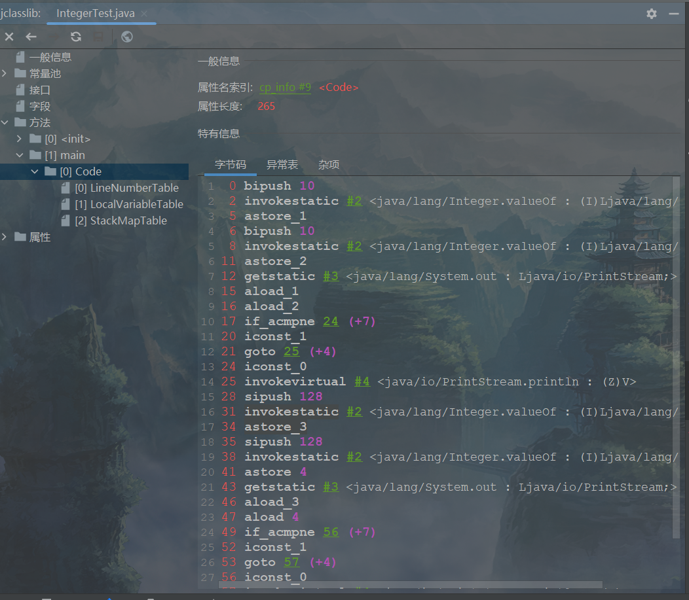
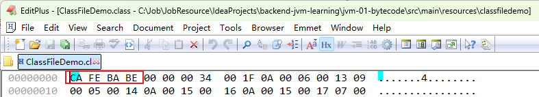
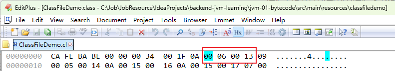
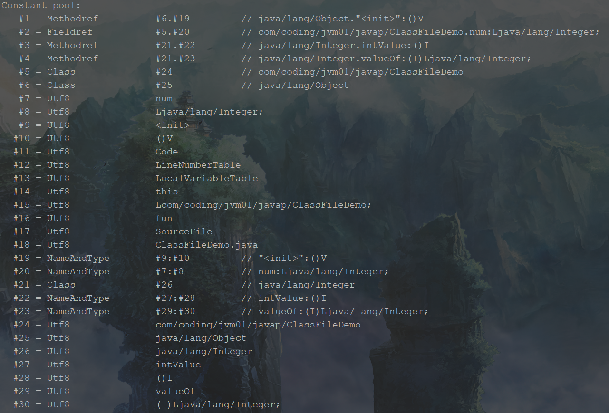
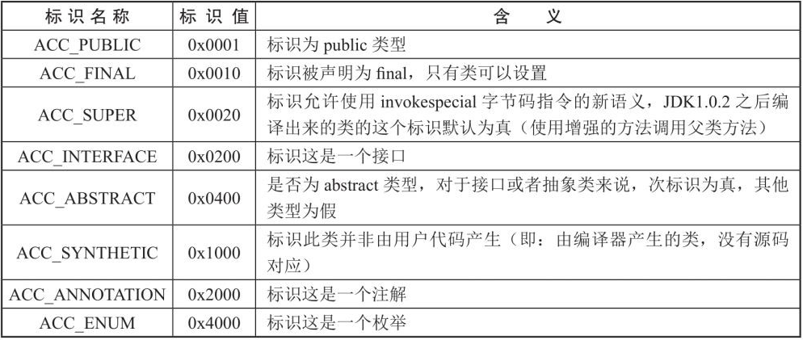
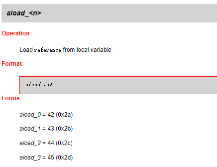
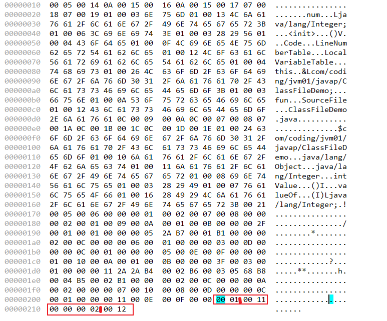
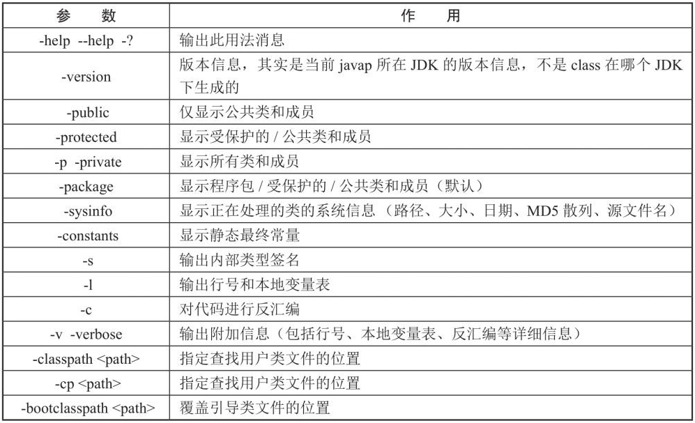

# 第17章 class文件结构

​	一段Java程序编写完成后，会被存储到以.java为后缀的源文件中，源文件会被编译器编译为以.class为后缀的二进制文件，之后以.class为后缀的二进制文件会经由类加载器加载至内存中。本章我们要讲的重点就是以.class为后缀的二进制文件，也简称为class文件或者字节码文件。接下来将会介绍class文件的详细结构，以及如何解析class文件。

## 17.1 概述

### 17.1.1 class文件的跨平台性

​	Java是一门跨平台的语言，也就是我们常说的“Write once,run anywhere”，意思是当Java代码被编译成字节码后，就可以在不同的平台上运行，而无须再次编译。但是现在这个优势不再那么吸引人了，Python、PHP、Perl、Ruby、Lisp等语言同样有强大的解释器。跨平台几乎成为一门开发语言必备的特性。

​	虽然很多语言都有跨平台性，但是JVM却是一个跨语言的平台。JVM不和包括Java在内的任何语言绑定，它只与class文件这种特定的二进制文件格式关联。无论使用何种语言开发软件，只要能将源文件编译为正确的class文件，那么这种语言就可以在JVM上执行，如下图所示，比如Groovy语言、Scala语言等。可以说规范的class文件结构，就是JVM的基石、桥梁。

<div style="text-align:center;font-weight:bold;">跨语言的JVM</div>


​	JVM有很多不同的实现，但是所有的JVM全部遵守Java虚拟机规范，也就是说所有的JVM环境都是一样的，只有这样class文件才可以在各种JVM上运行。在Java发展之初，设计者就曾经考虑并实现了让其他语言运行在Java虚拟机之上的可能性，他们在发布规范文档的时候，也刻意把Java的规范拆分成了Java语言规范及Java虚拟机规范。官方虚拟机规范如下图所示。

<div style="text-align:center;font-weight:bold;">虚拟机规范</div>


​	想要让一个Java程序正确地运行在JVM中，Java源文件就必须要被编译为符合JVM规范的字节码。前端编译器就是负责将符合Java语法规范的Java代码转换为符合JVM规范的class文件。常用的javac就是一种能够将Java源文件编译为字节码的前端编译器。javac编译器在将Java源文件编译为一个有效的class文件过程中经历了4个步骤，分别是词法解析、语法解析、语义解析以及生成字节码。

​	Oracle的JDK软件中除了包含将Java源文件编译成class文件外，还包含JVM的运行时环境。如下图所示，Java源文件(Java Source)经过编译器编译为class文件，之后class文件经过ClassLoader加载到虚拟机的运行时环境。需要注意的是ClassLoader只负责class文件的加载，至于class文件是否可以运行，则由执行引擎决定。

<div style="text-align:center;font-weight:bold;">JDK结构</div>


### 17.1.2 编译器分类

​	Java源文件的编译结果是字节码，那么肯定需要有一种编译器将Java源文件编译为class文件，承担这个重要责任的就是配置在path环境变量中的javac编译器。javac是一种能够将Java源文件编译为字节码的前端编译器。

​	HotSpot VM并没有强制要求前端编译器只能使用javac来编译字节码，其实只要编译结果符合JVM规范都可以被JVM所识别。

​	在Java的前端编译器领域，除了javac，还有一种经常用到的前端编译器，那就是内置在Eclipse中的ECJ(Eclipse Compiler for Java)编译器。和javac的全量式编译不同，ECJ是一种增量式编译器。

​	在Eclipse中，当开发人员编写完代码，使用Ctrl+S快捷键保存代码时，ECJ编译器会把未编译部分的源码逐行进行编译，而不是每次都全量编译。因此ECJ的编译效率更高。

​	ECJ不仅是Eclipse的默认内置前端编译器，在Tomcat中同样也是使用ECJ编译器来编译jsp文件。由于ECJ编译器是采用GPLv2的开源协议进行开源的，所以大家可以在Eclipse官网下载ECJ编译器的源码进行二次开发。另外，IntelliJ IDEA默认使用javac编译器。

​	我们把不同的编程语言类比为不同国家的语言，它们经过前端编译器处理之后，都变成同一种class文件。如图17-4所示，前端编译器把各个国家的“你好”编译为一样的“乌拉库哈吗哟”，这个“乌拉库哈吗哟”就好比class文件中的内容。class文件对于执行引擎是可以识别的，所以JVM是跨语言的平台，其中起关键作用的就是前端编译器。

<div style="text-align:center;font-weight:bold;">前端编译器</div>


​	前端编译器并不会直接涉及编译优化等方面的技术，而是将这些具体优化细节移交给HotSpot内置的即时编译器(Just In Time,JIT)负责，比如前面第11章讲过JIT编译器可以对程序做栈上分配、同步省略等优化。为了区别前面讲的javac，把JIT称为后端编译器。

​	除了上面提到的前端编译器和后端编译器，还有我们在11章提到的AOT编译器和Graal编译器。

### 17.1.3 透过字节码指令看代码细节

​	通过学习class文件，可以查看代码运行的详细信息。如下代码所示，测试不同Integer变量是否相等。

<span style="color:#40E0D0;">案例1：测试不同Integer值是否相等</span>

- 代码

```java
/**
 * 测试不同Integer值是否相等
 */
public class IntegerTest {
    public static void main(String[] args) {
        Integer i1 = 10;
        Integer i2 = 10;
        System.out.println(i1 == i2); // true

        Integer i3 = 128;
        Integer i4 = 128;
        System.out.println(i3 == i4); // false
    }
}
```

​	显而易见，两次运行结果并不相同。定义的变量是Integer类型，采用的是直接赋值的形式，并没有通过某一个方法进行赋值，所以无法看到代码底层的执行逻辑是怎样的，那么只能通过查看class文件来分析问题原因。通过IDEA中的插件jclasslib查看class文件，如下图所示。

<div style="text-align:center;font-weight:bold;">IntegerTest字节码文件</div>



​	class文件中包含很多字节码指令，分别表示程序代码执行期间用到了哪些指令，具体指令会在后面的章节中详细讲解。这里仅说一下Integer i1 = 10语句执行的是`<java/lang/Integer.valueOf>`方法，也就是Integer类中的valueOf方法，我们查看源代码如下图所示。

<div style="text-align:center;font-weight:bold;">java.lang.Integer#valueOf源代码</div>


​	可以发现对Integer赋值的时候，通过i和IntegerCache类高位值和低位值的比较，判断i是否直接从IntegerCache内cache数组获取数据。IntegerCache类的低位值为-128，高位值为127。如果赋值在低位值和高位值范围内，则返回IntegerCache内cache数组中的同一个值；否则，重新创建Integer对象。这也是为什么当Integer变量赋值为10的时候输出为true,Integer变量赋值为128的时候输出为false。

## 17.2 虚拟机的基石：class文件

​	源代码经过编译器编译之后生成class文件，字节码是一种二进制的文件，它的内容是JVM的指令，其不像C、C++经由编译器直接生成机器码。

### 17.2.1 字节码指令

​	JVM的指令由一个字节长度的、代表着某种特定操作含义的操作码(opcode)以及跟随其后的零至多个代表此操作所需参数的操作数(operand)所构成。虚拟机中许多指令并不包含操作数，只有一个操作码。如下图所示，其中aload_1是操作码，没有操作数。bipush 10中的bipush是操作码，30是操作数。

<div style="text-align:center;font-weight:bold;">字节码指令</div>


### 17.2.2 解读字节码方式

​	由于class文件是二进制形式的，所以没办法直接打开查看，需要使用一些工具将class文件解析成我们可以直接阅读的形式。解析方式主要有以下三种。

**1 使用第三方文本编辑工具**

​	我们常用的第三方文本编辑工具有Notepad++和Binary Viewer以及EditPlus。以EditPlus为例，打开后选择Hex viewer即可，如下图所示。

<div style="text-align:center;font-weight:bold;">选择Hex viewer</div>


<div style="text-align:center;font-weight:bold;">EditPlus查看十六进制的class文件</div>


**2 使用javap指令**

​	JDK自带的解析工具，前面的篇章经常使用到，详细介绍见第17.4节。

**3 jclasslib工具**

​	jclasslib工具在解析class文件时，已经进行了二进制数据的“翻译”工作，可以更直观地反映class文件中的数据。各位读者可以下载安装jclasslib Bytecodeviewer客户端工具或者在IDEA的插件市场安装jclasslib插件，如下图所示。


## 17.3 class文件结构

​	任何一个class文件都对应着唯一一个类或接口的定义信息，但是并不是所有的类或接口都必须定义在文件中，它们也可以通过类加载器直接生成。也就是说class文件实际上并不一定以磁盘文件的形式存在。class文件是一组以8位字节为基础单位的二进制流，它的结构不像XML等描述语言，由于它没有任何分隔符号，所以在其中的数据项，无论是字节顺序还是数量，都是被严格限定的，哪个字节代表什么含义，长度是多少，先后顺序如何，都不允许改变，就好像一篇没有标点符号的文章。这使得整个class文件中存储的内容几乎全部是程序运行的必要数据，没有空隙存在。class文件格式采用一种类似于C语言结构体的伪结构来存储数据，这种伪结构只有无符号数和表两种数据类型。

​	无符号数属于基本的数据类型，以u1、u2、u4、u8来分别代表1个字节、2个字节、4个字节和8个字节的无符号数，无符号数可以用来描述数字、索引引用、数量值或者按照UTF-8编码构成字符串值。对于字符串，则使用u1数组进行表示。

​	表是由多个无符号数或者其他表作为数据项构成的复合数据类型，所有表都习惯性地以“_info”结尾。表用于描述有层次关系的复合结构的数据，整个class文件本质上就是一张表。由于表没有固定长度，所以通常会在其前面加上长度说明。在学习过程中，只要充分理解了每一个class文件的细节，甚至可以自己反编译出Java源文件。

​	class文件的结构并不是一成不变的，随着JVM的不断发展，总是不可避免地会对class文件结构做出一些调整，但是其基本结构和框架是非常稳定的。class文件的整体结构如下表所示。

<div style="text-align:center;font-weight:bold;">class文件总体结构</div>


​	官方对class文件结构的详细描述如下所示。

https://docs.oracle.com/javase/specs/jvms/se8/html/jvms-4.html

<div style="text-align:center;font-weight:bold;">class文件结构图</div>

A `class` file consists of a single `ClassFile` structure:

```
ClassFile {
    u4             magic;
    u2             minor_version;
    u2             major_version;
    u2             constant_pool_count;
    cp_info        constant_pool[constant_pool_count-1];
    u2             access_flags;
    u2             this_class;
    u2             super_class;
    u2             interfaces_count;
    u2             interfaces[interfaces_count];
    u2             fields_count;
    field_info     fields[fields_count];
    u2             methods_count;
    method_info    methods[methods_count];
    u2             attributes_count;
    attribute_info attributes[attributes_count];
}
```

​	上面class文件的结构解读如下表所示。

<div style="text-align:center;font-weight:bold;">class文件结构解读</div>


​	下面我们按照上面的顺序逐一解读class文件结构。首先编写一段简单的代码，对照上面的结构表来分析class文件，如下代码所示。

<span style="color:#40E0D0;">案例1：class文件结构测试用例</span>

- 代码

```java
package com.coding.jvm01.javap;

public class ClassFileDemo {
    private Integer num;

    public void fun() {
        num = num * 2;
    }
}
```

​	这段代码很简单，只有一个成员变量num和一个方法fun()。将源文件编译为class文件，我们使用命令javac编译，如下所示。

```bash
# 直接执行javac xx.java，就不会在生成对应的局部变量表等信息，如果使用javac -g xx.java就可以生成所有相关信息了。如果使用Eclipse或IDEA，则默认情况下Eclipse、IDEA在编译时会帮助生成局部变量表、指令和代码行偏移量映射表等信息。
$ javac -g ClassFileDemo.java
```

​	上面命令的执行结果是生成一个ClassFileDemo.class文件。使用EditPlus打开该文件结果如下图所示，可以看到每个字节都是十六进制数字，通过分析每个字节来解析class文件。

<div style="text-align:center;font-weight:bold;">图17-1：IDEA编译得到ClassFileDemo.class文件（Consolas 12号字体）</div>


### 17.3.1 魔数：class文件的标识

​	每个class文件开头的<span style="color:#FF1493;font-weight:bold;">4个字节</span>的无符号整数称为魔数(Magic Number)。魔数的唯一作用是确定class文件是否有效合法，也就是说魔数是class文件的标识符。魔数值固定为0xCAFEBABE，如下图框中所示。之所以使用CAFEBABE，可以从Java的图标（一杯咖啡）窥得一二。

<div style="text-align:center;font-weight:bold;">魔数</div>



​	如果一个class文件不以0xCAFEBABE开头，JVM在文件校验的时候就会直接抛出以下错误的错误。

```bash
# 切换到classes路径下（包含com/coding/jvm01/javap目录）
$ java com.coding.jvm01.javap.ClassFileDemo
Error: A JNI error has occurred, please check your installation and try again
Exception in thread "main" java.lang.ClassFormatError: Incompatible magic value 1885430635 in class file com/coding/jvm01/javap/ClassFileDemo
```

​	比如将ClassFileDemo.java文件后缀改成ClassFileDemo.class，然后使用命令行解释运行，就报出上面的魔数不对的错误。

​	使用魔数而不是扩展名识别class文件，主要是基于安全方面的考虑，因为文件扩展名可以随意改动。除了Java的class文件以外，其他常见的文件格式内部也会有类似的设计手法，比如图片格式gif或者jpeg等在头文件中都有魔数。

### 17.3.2 class文件版本号

​	紧接着魔数存储的是class文件的版本号，同样也是<span style="color:#FF1493;font-weight:bold;">4个字节</span>。第5个和第6个字节所代表的含义是class文件的副版本号minor_version，第7个和第8个字节是class文件的主版本号major_version。它们共同构成了class文件的版本号，例如某个class文件的主版本号为M，副版本号为m，那么这个class文件的版本号就确定为M.m。版本号和Java编译器版本的对应关系如下表所示。

<div style="text-align:center;font-weight:bold;">Java编译器与版本号对应关系</div>


​	Java的版本号是从45开始的，JDK 1.1之后每发布一个JDK大版本，主版本号向上加1。当虚拟机JDK版本为1.k(k≥2)时，对应的class文件版本号的范围为45.0到44+k.0之间（含两端）。字节码指令集多年不变，但是版本号每次发布都会变化。

​	不同版本的Java编译器编译的class文件对应的版本是不一样的。目前，<span style="color:red;font-weight:bold;">高版本的JVM可以执行由低版本编译器生成的class文件，可以理解为向下兼容。但是低版本的JVM不能执行由高版本编译器生成的class文件</span>。一旦执行，JVM会抛出java.lang.UnsupportedClass VersionError异常。在实际应用中，由于开发环境和生产环境的不同，可能会导致该问题的发生。因此，需要我们在开发时，特别注意开发环境的JDK版本和生产环境中的JDK版本是否一致。

​	上面的ClassFileDemo.class文件使用JDK8版本编译而成，第5个字节到第8个字节如图17-14所示，其中第5个字节和第6个字节都是00，第7个字节和第8个字节为十六进制的34，换算为十进制为52，对应表17-3可知使用的版本为1.8，即JDK8。

​	上面的ClassFileDemo.class文件使用JDK8版本编译而成，第5个字节到第8个字节如图17-14所示，其中第5个字节和第6个字节都是00，第7个字节和第8个字节为十六进制的34，换算为十进制为52，对应表17-3可知使用的版本为1.8，即JDK8。

<div style="text-align:center;font-weight:bold;">字节码版本号</div>


### 17.3.3 常量池：存放所有常量

​	紧跟在版本号之后的是常量池中常量的数量(constant_pool_count)以及若干个常量池表项(constant_pool[])。常量池是class文件中内容最为丰富的区域之一。常量池表项用于存放编译时期生成的各种字面量(Literal)和符号引用(SymbolicReferences)，这部分内容在经过类加载器加载后存放在方法区的运行时常量池中存放。常量池对于class文件中的字段和方法解析起着至关重要的作用。随着JVM的不断发展，常量池的内容也日渐丰富。可以说，常量池是整个class文件的基石。

**1 constant_pool_count（常量池计数器）**

​	由于常量池的数量不固定，时长时短，所以需要放置<span style="color:#FF1493;font-weight:bold;">两个字节（u2类型）来表示常量池容量计数值</span>。常量池容量计数器从1开始计数，constant_pool_count=1表示常量池中有0个常量项。通常我们写代码时都是从0开始的，但是这里的常量池计数器却是从1开始，因为它把第0项常量空出来了，这是为了满足某些指向常量池的索引值的数据在特定情况下需要表达“不引用任何一个常量池项目”的含义，这种情况可用索引值0来表示。如下图17-15所示，第9个字节和第10个字节表示常量池计数器，其值为0x001f，换算为十进制为31，需要注意的是，实际上只有30项常量，索引范围是1～30。

<div style="text-align:center;font-weight:bold;">字节码常量池计数器</div>


​	我们也可以通过jclasslib插件来查看常量池数量，如下图所示，可以看到一共有30个常量。

<div style="text-align:center;font-weight:bold;">jclasslib查看字节码常量池计数器</div>


**2 constant_pool[]（常量池）**

​	常量池是一种表结构，从1到constant_pool_count–1为索引。常量池主要存放字面量和符号引用两大类常量。常量池包含了class文件结构及其子结构中引用的所有字符串常量、类或接口名、字段名和其他常量。<span style="color:#9400D3;font-weight:bold;">常量池中的每一项常量的结构都具备相同的特征，那就是每一项常量入口都是一个u1类型的标识，该标识用于确定该项的类型，这个字节称为tag byte（标识字节</span>），如下图所示。

https://docs.oracle.com/javase/specs/jvms/se8/html/jvms-4.html#jvms-4.4

<div style="text-align:center;font-weight:bold;">常量池中每一项结构</div>


​	一旦JVM获取并解析这个标识，JVM就会知道在标识后的常量类型是什么。常量池中的每一项都是一个表，其项目类型共有14种，下表列出了所有常量项的类型和对应标识的值，比如当标识值为1时，表示该常量的类型为CONSTANT_utf8_info。

<div style="text-align:center;font-weight:bold;">常量池中每一项结构</div>


​	这14种类型的结构各不相同，各个类型的结构如下表所示，比如CONSTANT_utf8_info由tag、length和bytes组成。

<div style="text-align:center;font-weight:bold;">图17-2：常量类型及其结构</div>


​	根据上表中对每个类型的描述，我们可以知道每个类型是用来描述常量池中的字面量、符号引用，比如CONSTANT_Integer_info是用来描述常量池中字面量信息，而且只是整型字面量信息。标识值为15、16、18的常量项类型是用来支持动态语言调用的，它们在JDK7时加入。下面按照标识的大小顺序分别进行介绍。

1. CONSTANT_Utf8_info用于表示字符常量的值。
2. CONSTANT_Integer_info和CONSTANT_Float_info表示4字节（int和float）的数值常量。
3. CONSTANT_Long_info和CONSTANT_Double_info表示8字节（long和double）的数值常量；在class文件的常量池表中，所有的8字节常量均占两个表项的空间。如果一个CONSTANT_Long_info或CONSTANT_Double_info的项在常量池表中的索引位n，则常量池表中下一个可用项的索引为n+2，此时常量池表中索引为n+1的项仍然有效但必须视为不可用的。
4. CONSTANT_Class_info用于表示类或接口。
5. CONSTANT_String_info用于表示String类型的常量对象。
6. CONSTANT_Fieldref_info、CONSTANT_Methodref_info表示字段、方法。
7. CONSTANT_InterfaceMethodref_info表示接口方法。
8. CONSTANT_NameAndType_info用于表示字段或方法，但是和之前的3个结构不同，CONSTANT_NameAndType_info没有指明该字段或方法所属的类或接口。
9. CONSTANT_MethodHandle_info用于表示方法句柄。
10. CONSTANT_MethodType_info表示方法类型。
11. CONSTANT_InvokeDynamic_info用于表示invokedynamic指令所用到的引导方法(Bootstrap Method)、引导方法所用到的动态调用名称(DynamicInvocation name)、参数和返回类型，并可以给引导方法传入一系列称为静态参数(Static Argument)的常量。

​	这14种表（或者常量项结构）的共同点是表开始的第一位是一个u1类型的标识位(tag)，代表当前这个常量项使用的是哪种表结构，即哪种常量类型。在常量池列表中，CONSTANT_Utf8_info常量项是一种使用改进过的UTF-8编码格式来存储诸如文字字符串、类或者接口的全限定名、字段或者方法的简单名称以及描述符等常量字符串信息。这14种常量项结构还有一个特点是，其中13个常量项占用的字节固定，只有CONSTANT_Utf8_info占用字节不固定，其大小由length决定。因为从常量池存放的内容可知，其存放的是字面量和符号引用，最终这些内容都会是一个字符串，这些字符串的大小是在编写程序时才确定，比如定义一个类，类名可以取长取短，所以在代码源文件没编译前，大小不固定；代码源文件编译后，可以通过utf-8编码知道其长度。

​	常量池可以理解为class文件之中的资源仓库，它是class文件结构中与其他项目关联最多的数据类型（后面讲解的很多数据结构都会指向此处），也是占用class文件空间最大的数据项目之一。

​	Java代码在进行javac编译的时候，并不像C和C++那样有“连接”这一步骤，而是在虚拟机加载class文件的时候进行动态链接。也就是说，在class文件中不会保存各个方法、字段的最终内存布局信息，因此这些字段、方法的符号引用不经过运行期转换的话无法得到真正的内存入口地址，也就无法直接被虚拟机使用。当虚拟机运行时，需要从常量池获得对应的符号引用，再在类创建时或运行时解析、翻译到具体的内存地址之中。本章先弄清楚class文件中常量池中的字面量符号引用。关于类加载和动态链接的内容，在第18章类的加载过程会进行详细讲解。

<span style="color:blue;font-weight:bold;">（1）字面量和符号引用。</span>

​	常量池主要存放两大类常量字面量和符号引用。字面量和符号引用的具体定义如下表所示。

<div style="text-align:center;font-weight:bold;">字面量和符号引用定义</div>


​	字面量很容易理解，例如定义String str = “emon”和final int NUM = 10，其中atguigu和10都是字面量，它们都放在常量池中，注意没有存放在内存中。符号引用包含类和接口的全限定名、简单名称、描述符三种常量类型。

①类和接口的全限定名。

​	com.coding.jvm01.javap.ClassFileDemo就是类的全限定名，仅仅是把包名的“.”替换成“/”，为了使连续的多个全限定名之间不产生混淆，在使用时最后一般会加入一个“;”表示全限定名结束。

②简单名称。

​	简单名称是指没有类型和参数修饰的方法或者字段名称，代码清单17-2中fun()方法和num字段的简单名称分别是fun和num。

③描述符。

​	描述符的作用是用来描述字段的数据类型、方法的参数列表（包括数量、类型以及顺序）和返回值。关于描述符规则，详见17.3.6节和17.3.7节。

<span style="color:blue;font-weight:bold;">（2） 常量解读。</span>

​	针对<span style="color:blue;font-weight:bold;">图17-1：IDEA编译得到ClassFileDemo.class文件（Consolas 12号字体）</span>的class文件，我们解读其中的常量池中存储的信息。首先是第一个常量，其标识位如下图所示。

<div style="text-align:center;font-weight:bold;">首个常量项标识位</div>


​	其值为0x0a，即10，查找表<span style="color:blue;font-weight:bold;">图17-2：常量类型及其结构</span>可知，其对应的项目类型为CONSTANT_Methodref_info，即类中方法的符号引用，其结构如图17-19所示。

<div style="text-align:center;font-weight:bold;">首个常量结构</div>


​	可以看到标识后面还有4个字节的内容，分别为两个索引项，如下图所示。

<div style="text-align:center;font-weight:bold;">首个常量项标识位后面的内容</div>



​	其中前两位的值为0x0006，即6，指向常量池第6项的索引；后两位的值为0x0013，即19，指向常量池第19项的索引。至此，常量池中第一个常量项解析完毕。再来看下第二个常量，其标识位如下图所示。

<div style="text-align:center;font-weight:bold;">第二个常量项标识位</div>


​	标识值为0x09，即9，查找表<span style="color:blue;font-weight:bold;">图17-2：常量类型及其结构</span>可知，其对应的项目类型为CONSTANT_Fieldref_info，即字段的符号引用，其结构如下图所示。

<div style="text-align:center;font-weight:bold;">第二个常量结构</div>


​	同样后面也有4字节的内容，分别为两个索引项，如下图所示。

<div style="text-align:center;font-weight:bold;">第二个常量项标识位后面的内容</div>


​	同样也是4字节，前后都是两个索引。分别指向第5项的索引和第20项的索引。后面常量项就不一一去解读了，这样的class文件解读起来既费力又费神，还很有可能解析错误。我们可以使用“<span style="color:#32CD32;font-weight:bold;">javap -verbose ClassFileDemo.class</span>”命令去查看class文件，如下图所示。

<div style="text-align:center;font-weight:bold;">第二个常量项标识位后面的内容</div>



​	可以看到，常量池中总共有30个常量项，第一个常量项指向常量池第6项的索引以及指向常量池第19项的索引，第二个常量项指向常量池第5项的索引和指向常量池第20项的索引。和我们上面按照字节码原文件解析结果一样。虽然使用javap命令很方便，但是通过手动分析才知道这个结果是怎么出来的，做到知其然也知其所以然。

### 17.3.4 访问标识

​	常量池后紧跟着访问标识。访问标识(access_flag)描述的是当前类（或者接口）的访问修饰符，如public、private等标识使用两个字节表示，用于识别一些类或者接口层次的访问信息，识别当前Java源文件属性是类还是接口；是否定义为public类型；是否定义为abstract类型；如果是类的话，是否被声明为final等。访问标识的类型如表17-7所示，比如当标识值为0x0001的时候，访问标识的类型是public。

<div style="text-align:center;font-weight:bold;">访问标识对照表</div>



​	从上表中可以看到类的访问权限通常是以ACC_开头的常量。一个public final类型的类，该类标识为ACC_PUBLIC|ACC_FINAL。带有ACC_INTERFACE标识的class文件表示的是接口而不是类，其他标识则表示的是类而不是接口。下面介绍访问标识的设置规则。

1. 如果一个class文件被设置了ACC_INTERFACE标识，那么同时也得设置ACC_ABSTRACT标识。它不能再设置ACC_FINAL、ACC_SUPER或ACC_ENUM标识。

2. 如果没有设置ACC_INTERFACE标识，那么这个class文件可以具有上表中除ACC_ANNOTATION外的其他所有标识。当然，ACC_FINAL和ACC_ABSTRACT这类互斥的标识除外，这两个标识不得同时设置。

3. ACC_SUPER标识用于确定类或接口里面的invokespecial指令使用的是哪一种执行语义。针对JVM指令集的编译器都应当设置这个标识。使用ACC_SUPER可以让类更准确地定位到父类的方法super.method()。ACC_SUPER标识是为了向后兼容由旧Java编译器所编译的代码而设计的。对于JavaSE 8及后续版本来说，无论class文件中这个标识的实际值是什么，也不管class文件的版本号是多少，JVM都认为每个class文件均设置了ACC_SUPER标识。也就是说JavaSE 8及后续版本不再支持没有设置ACC_SUPER标识的class文件了。ACC_SUPER这个标识位在JDK1.0.2之前的版本中没有任何含义，即使设置了标志，Oracle的JVM实现也会忽略该标志。

4. ACC_SYNTHETIC标识意味着该类或接口的class文件是由编译器生成的，而不是由源代码生成的。

5. 注解类型必须设置ACC_ANNOTATION标识。而且，如果设置了ACC_ANNOTATION标识，那么也必须设置ACC_INTERFACE标识。

6. ACC_ENUM标识表明该类或其父类为枚举类型。

​	<span style="color:#FF1493;font-weight:bold;">访问标识占用2字节，表示其有16位可以使用，目前只定义了8种类型</span>，表中没有使用的标识是为未来扩充而预留的，这些预留的标识在编译器中设置为0。我们把ClassFileDemo.class文件中的内容全部放到表格中展示，访问标识的值如下图所示。

<div style="text-align:center;font-weight:bold;">访问标识</div>


​	其值为0x0021，我们上面的表格里没有0x0021，那么0x0021只能是组合后的数值，0x0021只能是0x0020和0x0001的并集，即这是一个public的类，再回头看看我们的源码，该类是由public修饰的。

### 17.3.5 类索引、父类索引、接口索引集合

​	在访问标识后，会指定该类的类别、父类类别以及实现的接口，这三项数据来确定这个类的继承关系，格式如下表所示。

<div style="text-align:center;font-weight:bold;">类别格式</div>


​	类索引用于确定这个类的全限定名，父类索引用于确定这个类的父类的全限定名。由于Java语言不允许多重继承，所以父类索引只有一个，注意java.lang.Object类除外。一个类如果没有继承其他类，默认继承java.lang.Object类。

​	接口索引集合用来描述这个类实现了哪些接口，这些被实现的接口将按implements语句后面接口的顺序从左到右排列在接口索引集合中。如果这个类本身是接口类型，则应当是按extends语句后面接口的顺序从左到右排列在接口索引集合中。

**1 this_class（类索引）**

​	类索引占用2字节，指向常量池的索引，它提供了类的全限定名，如ClassFileDemo文件的全限定名为com/atguigu/ClassFileDemo。类索引的值必须是对常量池表中某项的一个有效索引值。常量池在这个索引处的成员必须为CONSTANT_Class_info类型结构体，该结构体表示这个class文件所定义的类或接口。我们直接来看下ClassFileDemo字节码中的值，如下图所示。

<div style="text-align:center;font-weight:bold;">图17-3:：类索引，父类索引、接口索引集合</div>


​	类索引的值为0x0005，即为指向常量池中第五项的索引。这里就用到了常量池中的值。接下来查看常量池中第五项的值，如下所示。


​	通过类索引我们可以确定到类的全限定名。

**2 super_class（父类索引**

​	父类索引占用2字节，指向常量池的索引。它提供了当前类的父类的全限定名。如果我们没有继承任何类，其默认继承的是java/lang/Object类。同时，由于Java不支持多继承，所以其父类只有一个。super_class指向的父类不能是final。

​	从<span style="color:blue;font-weight:bold;">图17-3:：类索引，父类索引、接口索引集合</span>可以看出，父类索引的值为0x0006，即常量池中的第六项，接下来查看常量池中第六项的值，如下所示。


​	这样我们就可以确定到父类的全限定名。可以看到，如果我们没有继承任何类，其默认继承的是java/lang/Object类。同时，由于Java不支持多继承，所以其父类只有一个。对于类来说，super_class的值要么是0，要么是对常量池表中某项的一个有效索引值。如果它的值不为0，那么常量池在这个索引处的成员必须为CONSTANT_Class_info类型常量，它表示这个class文件所定义的类的直接超类。在当前类的直接超类，以及它所有间接超类的ClassFile结构体中，访问标识里面均不能有ACC_FINAL标志。

​	<span style="color:#9400D3;font-weight:bold;">如果class文件的super_class的值为0，那这个class文件只可能用来表示Object类，因为它是唯一没有父类的类</span>。

**3 interfaces**

​	指向常量池索引集合，它提供了一个符号引用到所有已实现的接口。由于一个类可以实现多个接口，因此需要以数组形式保存多个接口的索引，表示接口的每个索引也是一个指向常量池的CONSTANT_Class（当然这里就必须是接口，而不是类）。和常量池计数器以及常量池的设计一样，interfaces同样设计了接口计数器和接口索引集合。

1、interfaces_count（接口计数器）

​	interfaces_count项的值表示当前类或接口的直接超接口数量。从<span style="color:blue;font-weight:bold;">图17-3:：类索引，父类索引、接口索引集合</span>可以看出，接口索引个数的值为0x0000，即没有任何接口索引，ClassFileDemo的源码也确实没有去实现任何接口。

2、interfaces[]（接口索引集合）

​	interfaces []中每个成员的值必须是对常量池表中某项的有效索引值，它的长度为interfaces_count。每个成员interfaces[i]必须为CONSTANT_Class_info结构，其中0≤i<interfaces_count。在interfaces[]中，各成员所表示的接口顺序和对应的源代码中给定的接口顺序（从左至右）一样，即interfaces[0]对应的是源代码中最左边的接口。

​	由于ClassFileDemo的源码没有去实现任何接口，所以接口索引集合就为空了，不占空间。可以看到，由于Java支持多接口，因此这里设计成了接口计数器和接口索引集合来实现。

### 17.3.6 字段表集合

​	接口计数器或接口索引集合后面就是字段表了，用于描述接口或类中声明的变量。字段包括类级变量以及实例级变量，但是不包括方法内部、代码块内部声明的局部变量。

​	字段叫什么名字、字段被定义为什么数据类型，这些都是无法固定的，只能引用常量池中的常量来描述。它指向常量池索引集合，它描述了每个字段的完整信息，比如字段的标识符、访问修饰符（public、private或protected）、是类变量（static修饰符）还是实例变量、是否为常量（final修饰符）等。

​	需要注意的是字段表集合中不会列出从父类或者实现的接口中继承而来的字段，但有可能列出原本Java代码之中不存在的字段，<span style="color:#9400D3;font-weight:bold;">例如在内部类中为了保持对外部类的访问性，会自动添加指向外部类实例的字段</span>。

​	在Java语言中字段是无法重载的，两个字段的数据类型、修饰符不管是否相同，都必须使用不一样的名称，但是对于字节码来讲，如果两个字段的描述符不一致，那字段重名就是合法的。由于存储在字段表项中的字段信息并不包括声明在方法内部或者代码块内的局部变量，因此多个字段之间的作用域就都是一样的，那么Java语法规范必然不允许在一个类或者接口中声明多个具有相同标识符名称的字段。

​	和常量池计数器以及常量池的设计一样，字段表同样设计了字段计数器和字段表，<span style="color:#FF1493;font-weight:bold;">在接口计数器或接口索引集合后面就是字段计数器，占用2个字节，后面便是字段表了</span>。

**1 fields_count（字段计数器）**

​	fields_count的值表示当前class文件fields表的成员个数，使用两个字节表示。fields表中每个成员都是一个field_info结构，用于表示该类或接口所声明的所有类字段或者实例字段，不包括方法内部声明的变量，也不包括从父类或父接口继承的那些字段。查看ClassFileDemo字节码中的值，如图17-27所示。

​	其值为0x0001，表示只有一个字段。

**2 　fields[]（字段表）**

​	fields表中的每个成员都必须是一个fields_info结构的数据项，用于表示当前类或接口中某个字段的完整描述。

​	一个字段的信息包括如下这些：作用域（public、private、protected修饰符）；

​	是实例变量还是类变量（static修饰符）；可变性(final)；并发可见性（volatile修饰符，是否强制从主内存读写）；可否序列化（transient修饰符）；字段数据类型（基本数据类型、对象、数组）；字段名称。

<div style="text-align:center;font-weight:bold;">字段计数器</div>


​	字段表作为一个表，同样有它自己的结构，如下表所示。

<div style="text-align:center;font-weight:bold;">字段表结构</div>


​	下面分别介绍每个结构所代表的含义。

1、字段表访问标识

​	我们知道，一个字段可以被各种关键字去修饰，比如作用域修饰符(public、private、protected)、static修饰符、final修饰符、volatile修饰符等。因此，和类的访问标识类似，使用一些标识来标识字段。字段的访问标识分类如下表所示。

<div style="text-align:center;font-weight:bold;">字段访问标识</div>


2、字段名索引

​	根据字段名索引的值，查询常量池中的指定索引项即可。

3、描述符索引

​	字段描述符的作用是用来描述字段的数据类型。我们知道数据类型分为基本数据类型和引用数据类型。基本数据类型(byte、short、int、long、float、double、boolean、char)都用一个大写字符来表示。引用数据类型中的对象类型用字符L加对象的全限定名来表示。对于数组类型，每一维度将使用一个前置的“[”字符来描述，如表17-11所示。例如int实例变量的描述符是I。Object类型的实例，描述符是Ljava/lang/Object;。三维数组double d[][][]的描述符是[[[D。

<div style="text-align:center;font-weight:bold;">描述符索引</div>


4、属性表集合

​	一个字段还可能拥有一些属性，用于存储更多的额外信息。比如字段的初始化值、一些注释信息等。属性个数存放在attribute_count中，属性具体内容存放在attributes数组中，以常量属性为例，结构如下。

https://docs.oracle.com/javase/specs/jvms/se8/html/jvms-4.html#jvms-4.7.2

<div style="text-align:center;font-weight:bold;">常量属性</div>


​	注意，对于常量属性而言，attribute_length值恒为2。

**3 解析字段表**

​	我们在ClassFileDemo中定义的字段为num，如下所示。

```java
	private Integer num;
```

​	查看ClassFileDemo字节码中的值，如下图所示。

<div style="text-align:center;font-weight:bold;">字段表</div>


​	访问标识的值为0x0002，查询上面字段访问标识的表格，可得字段为private。

​	字段名索引的值为0x0007，查询常量池中的第7项，如下所示，可以得到字段名为num。


​	描述符索引的值为0x0008，查询常量池中的第8项，如下所示，可以得到其为Integer类型的实例。如果定义数据类型的时候写为int类型，就会显示为I。


### 17.3.7 方法表集合

​	字段表之后就是方法表信息了，它指向常量池索引集合，它完整描述了每个方法的信息。在class文件中，一个方法表与类或者接口中方法一一对应。方法信息包含方法的访问修饰符（public、private或protected）、方法的返回值类型以及方法的参数信息等。如果这个方法不是抽象的或者不是native的，那么字节码中会体现出来。方法表只描述当前类或接口中声明的方法，不包括从父类或父接口继承的方法，除非当前类重写了父类方法。方法表有可能会出现由编译器自动添加的方法，最典型的便是编译器产生的方法信息，比如类或接口的初始化方法`<clinit>`()，以及实例初始化方法`<init>`()。

​	Java语法规范中，要重载(Overload)一个方法，要求参数类型或者参数个数必须不同，方法返回值不会作为区分重载方法的标准。但是在class文件中，如果两个方法仅仅返回值不同，那么也是可以合法共存于同一个class文件中。方法表和常量池计数器以及常量池的设计一样，同样设计了方法计数器和方法表。

**1 methods_count（方法计数器）**

​	methods_count的值表示当前class文件methods表的成员个数。使用<span style="color:red;font-weight:bold;">两个字节来表示</span>。methods表中每个成员都是一个method_info结构。

**2 methods[]（方法表）**

​	方法表中的每个成员都必须是一个method_info结构，用于表示当前类或接口中某个方法的完整描述。如果某个method_info结构的access_flags项既没有设置ACC_NATIVE标识也没有设置ACC_ABSTRACT标识，那么该结构中也应包含实现这个方法所用的JVM指令。

​	method_info结构可以表示类和接口中定义的所有方法，包括实例方法、类方法、实例初始化方法和类或接口初始化方法。方法表的结构实际跟字段表是一样的，方法表结构如下表所示。

<div style="text-align:center;font-weight:bold;">方法表结构表</div>


1、方法表访问标识

​	跟字段表一样，方法表也有访问标识，而且它们的标识有部分相同，部分则不同，方法表的具体访问标识如下表所示。

<div style="text-align:center;font-weight:bold;">图17-4：方法表访问标识</div>


2、方法名索引

​	根据方法名索引的值，查询常量池中的指定索引项即可。

3、描述符索引

​	根据描述符索引的值，查询常量池中的指定索引项即可。用描述符来描述方法时，按照参数列表、返回值的顺序描述，参数列表严格按照参数的顺序放在一组小括号“()”之内。如方法java.lang.String toString()的描述符为()LJava/lang/String;，方法int abc(int[] x,int y)的描述符为([II)I。

4、属性计数器

​	根据属性计数器的值，判断出方法中属性的个数。

5、属性表

​	属性计数器后面就是属性表。


**3 解析方法表**

​	前面两个字节依然用来表示方法计数器，我们在ClassFileDemo中定义的方法如下。

```java
    public void fun() {
        num = num * 2;
    }
```

​	查看ClassFileDemo字节码中的值，如下图所示。

<div style="text-align:center;font-weight:bold;">图17-5：第一个方法解析</div>


​	前面两个字节依然用来表示方法表的容量，值为0x0002，表示有两个方法。ClassFileDemo源码中只定义了一个方法，但是这里却显示两个方法，这是因为它包含了默认的构造方法。

​	继续分析字节码，在方法计数器之后是方法表，方法表中前两个字节表示访问标识，即0x0001，对应访问标识表<span style="color:blue;font-weight:bold;">图17-4：方法表访问标识</span>可知访问标识为public。

​	接下来2个字节是方法名索引的值为0x0009，查询常量池中的第9项，这个名为`<init>`的方法实际上就是默认的构造方法了。

```java
#9 = Utf8               <init>
```

​	描述符索引的值为0x000a，查询常量池中的第10项，如下所示，可以得到该方法是一个返回值为空的方法。

```java
#10 = Utf8               ()V
```

​	属性计数器的值为0x0001，即这个方法表有一个属性。属性计数器后面就是属性表了，由于只有一个属性，所以这里也只有一个属性表。由于涉及属性表，这里简单讲一下，17.3.8节会详细介绍。

​	属性表的前两个字节是属性名称索引，这里的值为0x000b，查下常量池中的第11项，如下所示，表示这是一个Code属性，我们方法里面的代码就是存放在这个Code属性里面。相关细节暂且不表。

```java
#11 = Utf8               Code
```

​	属性表的通用结构见第17.3.8节，<span style="color:#9400D3;font-weight:bold;">这里我们需要跳过47个字节（0x000b是属性名Code，其后4个字节是属性长度的值为0x0000002f=47）个字节</span>，再继续看第二个方法的字节码，如下图所示。

<div style="text-align:center;font-weight:bold;">第二个方法解析</div>


​	访问标识的值为0x0001，查询上面字段访问标识的表格，可得字段为public。方法名索引的值为0x0010，查询常量池中的第16项，可知方法名称为fun。可以看到，第二个方法表就是我们自定义的fun()方法了。

```java
#16 = Utf8               fun
```

​	描述符索引的值为0x000a，查询常量池中的第10项，可以得到该方法同样也是一个返回值为空的方法。对照源代码，结果一致。

```java
#10 = Utf8               ()V
```

​	属性计数器的值为0x0001，即这个方法表有一个属性。属性名称索引的值同样也是0x000b，即这也是一个Code属性。

### 17.3.8 属性表集合

​	方法表集合之后的属性表集合，指的是class文件所携带的辅助信息，比如该class文件的源文件的名称以及任何带有RetentionPolicy.CLASS或者RetentionPolicy.RUNTIME的注解。这类辅助信息通常被用于JVM的验证和运行，以及Java程序的调试，一般无须深入了解。此外，字段表、方法表都可以有自己的属性表。用于描述某些场景专有的信息。属性表集合的限制没有那么严格，不再要求各个属性表具有严格的顺序，并且只要不与已有的属性名重复，任何人实现的编译器都可以向属性表中写入自己定义的属性信息，但JVM运行时会忽略掉它不认识的属性。前面我们看到的属性表都是Code属性。Code属性就是存放在方法体里面的代码，像接口或者抽象方法，它们没有具体的方法体，因此也就不会有Code属性了。和常量池计数器以及常量池的设计一样，属性表同样设计了属性计数器和属性表。

**1 attributes_count（属性计数器）**

​	attributes_count的值表示当前class文件属性表的成员个数。

**2 attributes[]（属性表）**

​	属性表的每个项的值必须是attribute_info结构。属性表的结构比较灵活，各种不同的属性只要满足以下结构即可。

1、属性的通用格式

​	属性表的通用格式如下表所示，只需说明属性的名称以及占用位数的长度即可，属性表具体的结构可以自定义。

<div style="text-align:center;font-weight:bold;">属性表通用格式</div>


2、属性类型

​	属性表实际上可以有很多类型，上面看到的Code属性只是其中一种，Java虚拟机规范里面定义了23种属性。下面这些是虚拟机中预定义的属性，如下表所示，表格按照属性可能出现的位置排序。

<div style="text-align:center;font-weight:bold;">属性类型</div>


**3 部分属性详解**

1、ConstantValue属性

https://docs.oracle.com/javase/specs/jvms/se8/html/jvms-4.html#jvms-4.7.2

​	ConstantValue属性表示一个常量字段的值。位于field_info结构的属性表中。它的结构如下所示。

<div style="text-align:center;font-weight:bold;">ConstantValue属性</div>

```
ConstantValue_attribute {
    u2 attribute_name_index;
    u4 attribute_length;
    // 字段值在常量池的索引，常量池在该索引处的项给出该属性表示的常量值。（例如，值是long型的，在常量池中便是CONSTANT_Long）
    u2 constantvalue_index;
}
```

2、Deprecated属性

https://docs.oracle.com/javase/specs/jvms/se8/html/jvms-4.html#jvms-4.7.15

​	Deprecated属性是在JDK 1.1为了支持注释中的关键词@deprecated而引入的。它的结构如下所示。

<div style="text-align:center;font-weight:bold;">Deprecated属性</div>

```
Deprecated_attribute {
    u2 attribute_name_index;
    u4 attribute_length;
}
```

3、Code属性

https://docs.oracle.com/javase/specs/jvms/se8/html/jvms-4.html#jvms-4.7.3

​	Code属性就是存放在方法体里面的代码。但是，并非所有方法表都有Code属性。

​	像接口或者抽象方法，它们没有具体的方法体，因此也就不会有Code属性了。Code属性表的结构如下表所示。

<div style="text-align:center;font-weight:bold;">Code属性表的结构</div>


​	可以看到Code属性表的前两项跟属性表是一致的，即Code属性表遵循属性表的结构，后面那些则是它自定义的结构。

​	下面对Code属性进行字节码解析，紧跟在<span style="color:blue;font-weight:bold;">图17-5：第一个方法解析</span>中属性计数器后面的字节就是Code属性结构，如下图所示。


​	前面两个字节为属性名索引，其值为0x000b，前面有讲过其对应常量池中的值为Code，表明这是一个Code属性。<span style="color:#9400D3;">属性长度的值为0x0000002f，即长度为47，注意，这里的长度是指后面自定义的属性长度，不包括属性名索引和属性长度这两个所占的长度，因为这两个类型所占的长度都是固定6个字节，所以往后47个字节都是Code属性的内容。这也是为什么在17.3.7节中分析第二个方法的时候，我们说需要跳过47个字节</span>。

​	max_stack的值为0x0001，即操作数栈深度的最大值为1。

​	max_locals的值为0x0001，即局部变量表所需的存储空间为1,max_locals的单位是slot,slot是虚拟机为局部变量分配内存所使用的最小单位。

​	code_length的值为0x000000005，即字节码指令的长度是5。

​	code总共有5个值，分别是0x2a、0xb7、0x00、0x01、0xb1。这里的值就代表一系列的字节码指令。一个字节代表一个指令，一个指令可能有参数也可能没参数，如果有参数，则其后面字节码就是它的参数；如果没参数，后面的字节码就是下一条指令。可以通过jclasslib插件来查看这些字节分别代表哪些命令，如下图所示。

<div style="text-align:center;font-weight:bold;">第一个方法的Code属性结构之code</div>


​	从上图看到只有三个命令存在，单击aload_0，会自动跳转到JVM官网，如下图所示，可以看到aload_0指令对应的字节码是0x2a，对应class文件中code的第一个字节。

https://docs.oracle.com/javase/specs/jvms/se19/html/jvms-6.html#jvms-6.5.aload_n

<div style="text-align:center;font-weight:bold;">aload_&lt;n&gt;指令</div>



​	继续单击“invokespecial”命令，如下图所示，可以看到invokespecial指令对应的字节码是0xb7，对应class文件中code的第二个字节，大家可以看到这个指令需要两个参数，每个参数占用一个字节，也就是说0x00和0x01分别是invokespecial的参数。

https://docs.oracle.com/javase/specs/jvms/se19/html/jvms-6.html#jvms-6.5.invokespecial

<div style="text-align:center;font-weight:bold;">invokespecial指令</div>


​	继续单击“return”命令，如下图所示，可以看到return指令对应的字节码是0xb1，对应class文件中code的第五个字节。

https://docs.oracle.com/javase/specs/jvms/se19/html/jvms-6.html#jvms-6.5.return

<div style="text-align:center;font-weight:bold;">return指令</div>


​	也可以直接使用javap命令来解析，如下图所示。

<div style="text-align:center;font-weight:bold;">javap命令查看code属性</div>


​	由上图可知，code属性的操作数栈深度的最大值为1，局部变量表所需的存储空间为1，整个方法需要三个字节码指令。exception_table_length的值为0x0000，即异常表长度为0，所以其异常表也就没有了。attributes_count的值为0x0002，即code属性表里面还有2个其他的属性表，后面就是其他属性的属性表了。所有的属性都遵循属性表的结构，同样，这里的结构也不例外。前两个字节为属性名索引，其值为0x000c，查看常量池中的第12项。

```java
#12 = Utf8               LineNumberTable
```

​	这是一个LineNumberTable属性。LineNumberTable属性先跳过。再来看下第二个方法表中的Code属性，如下图所示。

<div style="text-align:center;font-weight:bold;">第二个方法Code属性结构</div>


​	属性名索引的值同样为0x000b，所以这也是一个Code属性。属性长度的值为0x0000003f，即长度为63。max_stack的值为0x0003，即操作数栈深度的最大值为3。max_locals的值为0x0001，即局部变量表所需的存储空间为1。code_length的值为0x00000011，即字节码指令的长度为17。code的值为0x2a,0x2a,0xb4,0x00,0x02,0xb6,0x00,0x03,0x05,0x68,0xb8,0x00,0x04,0xb5,0x00,0x02,0xb1命令，对应的fun()方法的字节码指令如下图所示。

<div style="text-align:center;font-weight:bold;">javap命令查看code属性</div>


​	继续解析后面的字节码，exception_table_length的值为0x0000，表示异常表长度为0，所以没有异常表。attributes_count的值为0x0002，表示code属性表里面还有一个其他的属性表。属性名索引值为0x000c，这同样也是一个LineNumberTable属性，继续往下看。

4、LineNumberTable属性

​	LineNumberTable属性是可选变长属性，位于Code结构的属性表。用来描述Java源文件行号与字节码行号之间的对应关系。这个属性可以用来在调试的时候定位代码执行的行数。start_pc表示字节码行号；line_number表示Java源文件行号。在Code属性的属性表中，LineNumberTable属性可以按照任意顺序出现，此外，多个LineNumberTable属性可以共同表示一个行号在源文件中表示的内容，即LineNumberTable属性不需要与源文件的行一一对应。LineNumberTable属性表结构如下。

https://docs.oracle.com/javase/specs/jvms/se8/html/jvms-4.html#jvms-4.7.12

<div style="text-align:center;font-weight:bold;">LineNumberTable属性</div>

```
LineNumberTable_attribute {
    u2 attribute_name_index;
    u4 attribute_length;
    u2 line_number_table_length;
    {   u2 start_pc;
        u2 line_number;	
    } line_number_table[line_number_table_length];
}
```

​	前面出现了两个LineNumberTable属性，先看第一个，如下图所示。

<div style="text-align:center;font-weight:bold;">第1个Code属性之LineNumberTable属性</div>


​	attributes_count的值为0x0002，表明code属性表里面还有一个其他的属性表。属性名索引值为0x000c，查看常量池中的第12项，如下所示，表明这是一个LineNumberTable属性。

```
#12 = Utf8               LineNumberTable
```

​	attribute_length的值为0x00000006，即其长度为6，后面6个字节都是LineNumberTable属性的内容。line_number_table_length的值为0x0001，即其行号表长度为1，表示有一个行号表。行号表值为0x00 00 00 03，表示字节码第0行对应Java源文件第3行，同样，使用javap命令也能看到，如下所示。

```
    LineNumberTable:
            line 3: 0
```

​	第二个LineNumberTable属性如下图所示。

<div style="text-align:center;font-weight:bold;">第2个Code属性之LineNumberTable属性</div>


​	attribute_length的值为0x0000000a，表示其长度为10，后面10个字节都是LineNumberTable属性的内容。line_number_table_length的值为0x0002，表示其行号表长度为2，即有一个行号表。行号表其值为0x00 00 00 07，表示字节码第0行对应Java源文件第7行。第二个行号表其值为0x00 10 00 08，即字节码第16行对应Java源文件第8行。同样，使用javap命令也能看到，如下所示。

```
      LineNumberTable:
        line 7: 0
        line 8: 16
```

​	这些行号主要用于当程序抛出异常时，可以看到报错的行号，这利于我们排查问题。工作使用debug断点时，也是根据源码的行号来设置的。

5、LocalVariableTable属性

​	LocalVariableTable是可选变长属性，位于Code属性的属性表中。它被调试器用于确定方法在执行过程中局部变量的信息。在Code属性的属性表中，LocalVariableTable属性可以按照任意顺序出现。Code属性中的每个局部变量最多只能有一个LocalVariableTable属性。“start pc + length”表示这个变量在字节码中的生命周期起始和结束的偏移位置（this生命周期从头0到结尾），index就是这个变量在局部变量表中的槽位（槽位可复用），name就是变量名称，Descriptor表示局部变量类型描述。LocalVariableTable属性表结构如下所示。

https://docs.oracle.com/javase/specs/jvms/se8/html/jvms-4.html#jvms-4.7.13

<div style="text-align:center;font-weight:bold;">LocalVariableTable属性</div>

```
LocalVariableTable_attribute {
    u2 attribute_name_index;
    u4 attribute_length;
    u2 local_variable_table_length;
    {   u2 start_pc;
        u2 length;
        u2 name_index;
        u2 descriptor_index;
        u2 index;
    } local_variable_table[local_variable_table_length];
}
```

​	大家还记得上面的code属性中存在2个其他属性，其中之一是LineNumberTable属性，在上一小节我们已经讲过，那么接下来分析另外一个属性。所有的属性都遵循属性表的结构，同样，这里的结构也不例外。前两个字节为属性名索引，其值为0x000d，查看常量池中的第13项。

```
#13 = Utf8               LocalVariableTable
```

​	这是一个LocalVariableTable属性，如下图所示。

<div style="text-align:center;font-weight:bold;">第1个Code属性之LocalVariableTable属性</div>


​	attribute_length的值为0x0000000c，表示其长度为12，后面12个字节都是LocalVariableTable属性的内容。line_variable_table_length的值为0x0001，表示其行号表长度为1，即有一个local_variable_table表。start_pc的值为0x0000,length的值为0x0005，其十进制值为5，从字节码偏移量start_pc到start_pc+length就是当前局部变量的作用域范围。name_index的值为0x000e，转为十进制为14，查看常量池中的第14项，可知，当前局部变量为this。

```
#14 = Utf8               this
```

​	descriptor_index的值为0x000f，转为十进制为15，查看常量池中的第15项。该变量的描述符为引用数据类型com/coding/jvm01/javap/ClassFileDemo。index的值为0x0000，转为十进制为0，当前局部变量在栈帧中局部变量表中的位置是0

```
#15 = Utf8               Lcom/coding/jvm01/javap/ClassFileDemo;
```

​	同样，使用javap命令也能看到，如下所示。

```
      LocalVariableTable:
        Start  Length  Slot  Name   Signature
            0       5     0  this   Lcom/coding/jvm01/javap/ClassFileDemo;
```

​	对于Java类中的每一个实例方法（非static方法），其实在编译后所生成的字节码当中，方法参数的数量总是会比源代码中方法参数的数量多一个，多的参数是this，它位于方法的第一个参数位置处，就可以在Java的实例方法中使用this去访问当前对象的属性以及其他方法。

​	这个操作是在编译期间完成的，即由javac编译器在编译的时候将对this的访问转化为对一个普通实例方法参数的访问，接下来在运行期间，由JVM在调用实例方法时，自动向实例方法传入该this参数，所以，在实例方法的局部变量表中，至少会有一个指向当前对象的局部变量。

6、InnerClasses属性

​	假设一个类或接口的class文件为C。如果C的常量池中包含某个CONSTANT_Class_info成员，且这个成员所表示的类或接口不属于任何一个包，那么C的属性表中就必须含有对应的InnerClasses属性。InnerClasses属性是在JDK 1.1中为了支持内部类和内部接口而引入的，位于class文件中的属性表。

https://docs.oracle.com/javase/specs/jvms/se8/html/jvms-4.html#jvms-4.7.6

<div style="text-align:center;font-weight:bold;">InnerClasses属性</div>

```
InnerClasses_attribute {
    u2 attribute_name_index;
    u4 attribute_length;
    u2 number_of_classes;
    {   u2 inner_class_info_index;
        u2 outer_class_info_index;
        u2 inner_name_index;
        u2 inner_class_access_flags;
    } classes[number_of_classes];
}
```

7、Signature属性

​	Signature属性是可选的定长属性，位于ClassFile、field_info或method_info结构的属性表中。在Java语言中，任何类、接口、初始化方法或成员的泛型签名如果包含了类型变量或参数化类型，则Signature属性会为它记录泛型签名信息。

https://docs.oracle.com/javase/specs/jvms/se8/html/jvms-4.html#jvms-4.7.9

<div style="text-align:center;font-weight:bold;">Signature属性</div>

```
Signature_attribute {
    u2 attribute_name_index;
    u4 attribute_length;
    u2 signature_index;
}
```

8、SourceFile属性

SourceFile属性结构如下表所示，其长度是固定的8个字节。

<div style="text-align:center;font-weight:bold;">SourceFile属性表结构</div>


9、其他属性

​	最后还有几个字节没有解析，如下图所示。

<div style="text-align:center;font-weight:bold;">其他属性</div>



​	我们前面带大家解析的是方法表中的一些属性信息，包括code属性以及code属性中的LineNumberTable属性和LocalVariableTable属性，<span style="color:red;font-weight:bold;">最后的就是我们本节所说的属性表集合</span>。前面2个字节表示属性表计数器，其值为0x0001，即还有一个附加属性，属性名索引的值为0x0011，即常量池中的第17项，如下所示，这一个属性是SourceFile属性，即源码文件属性。

```
#17 = Utf8               SourceFile
```

​	属性长度的值为0x00000002，即长度为2。源码文件索引的值为0x0012，即常量池中的第18项，如下所示。所以，我们能够从这里知道，这个class文件的源码文件名称为ClassFileDemo.java。同样，当抛出异常时，可以通过这个属性定位到报错的文件。至此，字节码完全解读完毕。

```
#18 = Utf8               ClassFileDemo.java
```

​	JVM中预定义的属性有20多个，这里就不一一介绍了，通过上面几个属性的介绍，只要领会其精髓，其他属性的解读也是易如反掌。

​	通过手动去解读class文件，终于大概了解到其构成和原理了。实际上，可以使用各种工具来帮我们去解读class文件，而不用直接去看这些十六进制的数据。下面介绍javap指令解析class文件。

## 17.4 使用javap指令解析class文件

​	前面小节中通过解析反编译生成的class文件，可以帮助我们深入地了解Java代码的工作机制。但是，手动解析class文件结构太麻烦，除了使用第三方的jclasslib工具之外，Oracle官方也提供了javap命令工具。

​	javap是JDK自带的反编译工具。它的作用就是根据class文件，反编译出当前类对应的字节码指令、局部变量表、异常表和代码行偏移量映射表、常量池等信息。例如通过局部变量表，我们可以查看局部变量的作用域范围、所在槽位等信息，甚至可以看到槽位复用等信息。

​	解析class文件得到的信息中，有些信息（如局部变量表、指令和代码行偏移量映射表、常量池中方法的参数名称等）需要在使用javac编译成class文件时，指定参数才能输出。<span style="color:#FF1493;font-weight:bold;">比如直接执行javac xx.java，就不会在生成对应的局部变量表等信息，如果使用javac -g xx.java就可以生成所有相关信息了</span>。如果使用Eclipse或IDEA，则默认情况下Eclipse、IDEA在编译时会帮助生成局部变量表、指令和代码行偏移量映射表等信息。

​	javap的用法格式如下。

```cmd
$ javap -help
用法: javap <options> <classes>
其中, 可能的选项包括:
  -help  --help  -?        输出此用法消息
  -version                 版本信息
  -v  -verbose             输出附加信息
  -l                       输出行号和本地变量表
  -public                  仅显示公共类和成员
  -protected               显示受保护的/公共类和成员
  -package                 显示程序包/受保护的/公共类
                           和成员 (默认)
  -p  -private             显示所有类和成员
  -c                       对代码进行反汇编
  -s                       输出内部类型签名
  -sysinfo                 显示正在处理的类的
                           系统信息 (路径, 大小, 日期, MD5 散列)
  -constants               显示最终常量
  -classpath <path>        指定查找用户类文件的位置
  -cp <path>               指定查找用户类文件的位置
  -bootclasspath <path>    覆盖引导类文件的位置
```

​	其中，classes就是要反编译的class文件。在命令行中直接输入javap或javap -help可以看到javap命令有如下选项，如下表所示。

| 命令                                                         | 含义                                                         |
| ------------------------------------------------------------ | ------------------------------------------------------------ |
| <span style="background-color:#ff9b00;font-weight:bold;width:350px;display:inline-block;">-help --help -?</span> | 输出此用法消息                                               |
| <span style="background-color:#ff9b00;font-weight:bold;width:350px;display:inline-block;">-version</span> | 版本信息，其实是当前javap所在jdk的版本信息，不是class在哪个jdk下生成的。 |
| <span style="background-color:#00d900;font-weight:bold;width:350px;display:inline-block;">-public</span> | 仅显示公共类和成员                                           |
| <span style="background-color:#00d900;font-weight:bold;width:350px;display:inline-block;">-protected</span> | 显示受保护的/公共类和成员                                    |
| <span style="background-color:#00d900;color:red;font-weight:bold;width:350px;display:inline-block;">-p -private</span> | <span style="color:red;font-weight:bold;">显示所有类和成员</span> |
| <span style="background-color:#00d900;font-weight:bold;width:350px;display:inline-block;">-package</span> | <span style="color:blue;font-weight:bold;">显示程序包/受保护的/公共类 和成员（默认）</span> |
| <span style="background-color:#00d900;font-weight:bold;width:350px;display:inline-block;">-sysinfo</span> | 显示正在处理的类的系统信息（路径，大小，日期，MD5 散列，源文件名） |
| <span style="background-color:#00d900;font-weight:bold;width:350px;display:inline-block;">-constants</span> | 显示静态最终常量                                             |
| <span style="background-color:#fff000;font-weight:bold;width:350px;display:inline-block;;">-s</span> | 输出内部类型签名                                             |
| <span style="background-color:#fff000;font-weight:bold;width:350px;display:inline-block;">-l</span> | 输出行号表和本地变量表                                       |
| <span style="background-color:#fff000;font-weight:bold;width:350px;display:inline-block;">-c</span> | 对代码进行反汇编（也即方法的Code）                           |
| <span style="background-color:#fff000;color:red;font-weight:bold;width:350px;display:inline-block;">-v -verbose</span> | <span style="color:red;font-weight:bold;">输出附加信息（包括行号、本地变量表，反汇编等详细信息）</span> |
| <span style="background-color:#ccc;font-weight:bold;width:350px;display:inline-block;">-classpath `<path>`</span> | 指定查找用户类文件的位置                                     |
| <span style="background-color:#ccc;font-weight:bold;width:350px;display:inline-block;">-cp `<path>`</span> | 指定查找用户类文件的位置                                     |

<div style="text-align:center;font-weight:bold;">javap参数解析</div>



​	一般常用的是-l、-c、-v三个选项。

- javap -l 会输出行号和本地变量表信息。
- javap -c 会对当前class字节码进行反编译生成汇编代码。
- javap –v 除了包含-c内容外，还会输出行号、局部变量表信息、常量池等信息。

常用示例：

```cmd
# <classes>可以不带有.class
$ javap -v -p JavapTest.class
$ javap -v -p JavapTest
```

**1 使用举例**

​	通过一段代码来查看使用javap命令的效果，Java源文件如下代码所示。

<span style="color:#40E0D0;">案例1：测试javap命令的效果</span>

- 代码

```java
package com.coding.jvm01.javap;

public class JavapTest {
    private int num;
    boolean flag;
    protected char gender;
    public String info;

    public static final int COUNTS = 1;

    static {
        String url = "www.baidu.com";
    }

    {
        info = "java";
    }

    public JavapTest() {
    }

    private JavapTest(boolean flag) {
        this.flag = flag;
    }

    private void methodPrivate() {
    }

    int getNum(int i) {
        return num + i;
    }

    protected char showGender() {
        return gender;
    }

    public void showInfo() {
        int i = 10;
        System.out.println(info + i);
    }
}
```

​	输入如下命令可以看到比较完整的字节码信息。

​	结果如下，相关的信息在字节码中有注释。

​	下面的内容用来描述字段表集合信息，包括字段名称（例如private int num表示字段名称为num），字段描述符（例如descriptor:I表示字段类型为int）和字段的访问权限（例如flags:ACC_PRIVATE表示字段访问权限为private）。如果包含常量则用ConstantValue来表示。

​	接着就是方法表集合的信息，包含了类中方法信息，关于详细解释请查看下面内容中的注释，以showinfo()方法为例注释。

```cmd
$ javap -v -p JavapTest.class 
Classfile /C:/Job/JobResource/IdeaProjects/backend-jvm-learning/jvm-01-bytecode/src/main/java/com/coding/jvm01/javap/JavapTest.class
  Last modified 2024-11-21; size 1366 bytes
  MD5 checksum 225bfadf6de46ec57299a118d141aefb
  Compiled from "JavapTest.java"
public class com.coding.jvm01.javap.JavapTest
  minor version: 0							// 副版本
  major version: 52							// 主版本
  flags: ACC_PUBLIC, ACC_SUPER				// 访问标识
Constant pool:								// 常量池
   #1 = Methodref          #16.#46        // java/lang/Object."<init>":()V
   #2 = String             #47            // java
   #3 = Fieldref           #15.#48        // com/coding/jvm01/javap/JavapTest.info:Ljava/lang/String;
   #4 = Fieldref           #15.#49        // com/coding/jvm01/javap/JavapTest.flag:Z
   #5 = Fieldref           #15.#50        // com/coding/jvm01/javap/JavapTest.num:I
   #6 = Fieldref           #15.#51        // com/coding/jvm01/javap/JavapTest.gender:C
   #7 = Fieldref           #52.#53        // java/lang/System.out:Ljava/io/PrintStream;
   #8 = Class              #54            // java/lang/StringBuilder
   #9 = Methodref          #8.#46         // java/lang/StringBuilder."<init>":()V
  #10 = Methodref          #8.#55         // java/lang/StringBuilder.append:(Ljava/lang/String;)Ljava/lang/StringBuilder;
  #11 = Methodref          #8.#56         // java/lang/StringBuilder.append:(I)Ljava/lang/StringBuilder;
  #12 = Methodref          #8.#57         // java/lang/StringBuilder.toString:()Ljava/lang/String;
  #13 = Methodref          #58.#59        // java/io/PrintStream.println:(Ljava/lang/String;)V
  #14 = String             #60            // www.baidu.com
  #15 = Class              #61            // com/coding/jvm01/javap/JavapTest
  #16 = Class              #62            // java/lang/Object
  #17 = Utf8               num
  #18 = Utf8               I
  #19 = Utf8               flag
  #20 = Utf8               Z
  #21 = Utf8               gender
  #22 = Utf8               C
  #23 = Utf8               info
  #24 = Utf8               Ljava/lang/String;
  #25 = Utf8               COUNTS
  #26 = Utf8               ConstantValue
  #27 = Integer            1
  #28 = Utf8               <init>
  #29 = Utf8               ()V
  #30 = Utf8               Code
  #31 = Utf8               LineNumberTable
  #32 = Utf8               LocalVariableTable
  #33 = Utf8               this
  #34 = Utf8               Lcom/coding/jvm01/javap/JavapTest;
  #35 = Utf8               (Z)V
  #36 = Utf8               methodPrivate
  #37 = Utf8               getNum
  #38 = Utf8               (I)I
  #39 = Utf8               i
  #40 = Utf8               showGender
  #41 = Utf8               ()C
  #42 = Utf8               showInfo
  #43 = Utf8               <clinit>
  #44 = Utf8               SourceFile
  #45 = Utf8               JavapTest.java
  #46 = NameAndType        #28:#29        // "<init>":()V
  #47 = Utf8               java
  #48 = NameAndType        #23:#24        // info:Ljava/lang/String;
  #49 = NameAndType        #19:#20        // flag:Z
  #50 = NameAndType        #17:#18        // num:I
  #51 = NameAndType        #21:#22        // gender:C
  #52 = Class              #63            // java/lang/System
  #53 = NameAndType        #64:#65        // out:Ljava/io/PrintStream;
  #54 = Utf8               java/lang/StringBuilder
  #55 = NameAndType        #66:#67        // append:(Ljava/lang/String;)Ljava/lang/StringBuilder;
  #56 = NameAndType        #66:#68        // append:(I)Ljava/lang/StringBuilder;
  #57 = NameAndType        #69:#70        // toString:()Ljava/lang/String;
  #58 = Class              #71            // java/io/PrintStream
  #59 = NameAndType        #72:#73        // println:(Ljava/lang/String;)V
  #60 = Utf8               www.baidu.com
  #61 = Utf8               com/coding/jvm01/javap/JavapTest
  #62 = Utf8               java/lang/Object
  #63 = Utf8               java/lang/System
  #64 = Utf8               out
  #65 = Utf8               Ljava/io/PrintStream;
  #66 = Utf8               append
  #67 = Utf8               (Ljava/lang/String;)Ljava/lang/StringBuilder;
  #68 = Utf8               (I)Ljava/lang/StringBuilder;
  #69 = Utf8               toString
  #70 = Utf8               ()Ljava/lang/String;
  #71 = Utf8               java/io/PrintStream
  #72 = Utf8               println
  #73 = Utf8               (Ljava/lang/String;)V
{
  private int num;
    descriptor: I
    flags: ACC_PRIVATE

  boolean flag;
    descriptor: Z
    flags:

  protected char gender;
    descriptor: C
    flags: ACC_PROTECTED

  public java.lang.String info;
    descriptor: Ljava/lang/String;
    flags: ACC_PUBLIC

  public static final int COUNTS;
    descriptor: I
    flags: ACC_PUBLIC, ACC_STATIC, ACC_FINAL
    ConstantValue: int 1

  public com.coding.jvm01.javap.JavapTest();	// 无参构造器的信息
    descriptor: ()V
    flags: ACC_PUBLIC
    Code:
      stack=2, locals=1, args_size=1
         0: aload_0
         1: invokespecial #1                  // Method java/lang/Object."<init>":()V
         4: aload_0
         5: ldc           #2                  // String java
         7: putfield      #3                  // Field info:Ljava/lang/String;
        10: return
      LineNumberTable:
        line 19: 0
        line 16: 4
        line 20: 10
      LocalVariableTable:
        Start  Length  Slot  Name   Signature
            0      11     0  this   Lcom/coding/jvm01/javap/JavapTest;

  private com.coding.jvm01.javap.JavapTest(boolean);	// 含参构造器的信息
    descriptor: (Z)V
    flags: ACC_PRIVATE
    Code:
      stack=2, locals=2, args_size=2
         0: aload_0
         1: invokespecial #1                  // Method java/lang/Object."<init>":()V
         4: aload_0
         5: ldc           #2                  // String java
         7: putfield      #3                  // Field info:Ljava/lang/String;
        10: aload_0
        11: iload_1
        12: putfield      #4                  // Field flag:Z
        15: return
      LineNumberTable:
        line 22: 0
        line 16: 4
        line 23: 10
        line 24: 15
      LocalVariableTable:
        Start  Length  Slot  Name   Signature
            0      16     0  this   Lcom/coding/jvm01/javap/JavapTest;
            0      16     1  flag   Z

  private void methodPrivate();
    descriptor: ()V
    flags: ACC_PRIVATE
    Code:
      stack=0, locals=1, args_size=1
         0: return
      LineNumberTable:
        line 27: 0
      LocalVariableTable:
        Start  Length  Slot  Name   Signature
            0       1     0  this   Lcom/coding/jvm01/javap/JavapTest;

  int getNum(int);
    descriptor: (I)I
    flags:
    Code:
      stack=2, locals=2, args_size=2
         0: aload_0
         1: getfield      #5                  // Field num:I
         4: iload_1
         5: iadd
         6: ireturn
      LineNumberTable:
        line 30: 0
      LocalVariableTable:
        Start  Length  Slot  Name   Signature
            0       7     0  this   Lcom/coding/jvm01/javap/JavapTest;
            0       7     1     i   I

  protected char showGender();
    descriptor: ()C
    flags: ACC_PROTECTED
    Code:
      stack=1, locals=1, args_size=1
         0: aload_0
         1: getfield      #6                  // Field gender:C
         4: ireturn
      LineNumberTable:
        line 34: 0
      LocalVariableTable:
        Start  Length  Slot  Name   Signature
            0       5     0  this   Lcom/coding/jvm01/javap/JavapTest;

  public void showInfo();
    descriptor: ()V							// 方法描述符主要包含方法的形参列表和返回值类型
    flags: ACC_PUBLIC						// 方法的访问标识
    Code:									// 方法的Code属性
      stack=3, locals=2, args_size=1		// stack:操作数栈的最大深度；locals:局部变量表的长度，注意包含this；args_size：方法接收参数的个数，static代码块值为0，无参值为1，有一个参数值为2，以此类推。
      	// 第一行的10表示操作数，前面加#表示指向常量池中的索引地址
         0: bipush        10
         2: istore_1
         3: getstatic     #7                  // Field java/lang/System.out:Ljava/io/PrintStream;
         6: new           #8                  // class java/lang/StringBuilder
         9: dup
        10: invokespecial #9                  // Method java/lang/StringBuilder."<init>":()V
        13: aload_0
        14: getfield      #3                  // Field info:Ljava/lang/String;
        17: invokevirtual #10                 // Method java/lang/StringBuilder.append:(Ljava/lang/String;)Ljava/lang/StringBuilder;
        20: iload_1
        21: invokevirtual #11                 // Method java/lang/StringBuilder.append:(I)Ljava/lang/StringBuilder;
        24: invokevirtual #12                 // Method java/lang/StringBuilder.toString:()Ljava/lang/String;
        27: invokevirtual #13                 // Method java/io/PrintStream.println:(Ljava/lang/String;)V
        30: return
        // 行号表：指明字节码指令的偏移量与java源程序中代码的行号的一一对应关系。
      LineNumberTable:
        line 38: 0							// 0：表示上面字节码指令前面的0；38表示java代码中的行号
        line 39: 3
        line 40: 30
      LocalVariableTable:					// 局部变量表：描述方法内部局部变量的相关信息
        Start  Length  Slot  Name   Signature
            0      31     0  this   Lcom/coding/jvm01/javap/JavapTest;
            3      28     1     i   I

  static {};
    descriptor: ()V
    flags: ACC_STATIC
    Code:
      stack=1, locals=1, args_size=0
         0: ldc           #14                 // String www.baidu.com
         2: astore_0
         3: return
      LineNumberTable:
        line 12: 0
        line 13: 3
      LocalVariableTable:
        Start  Length  Slot  Name   Signature
}
SourceFile: "JavapTest.java"						// 附加属性：指明当前class文件对应的源程序文件名
```

