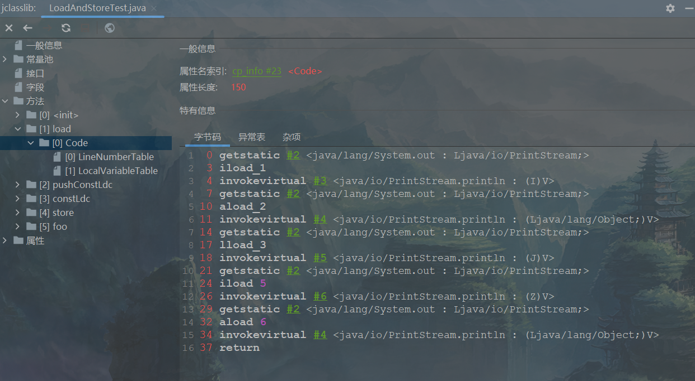
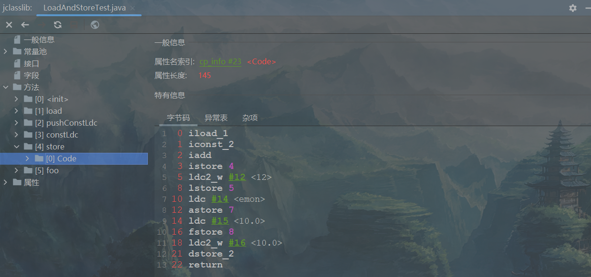
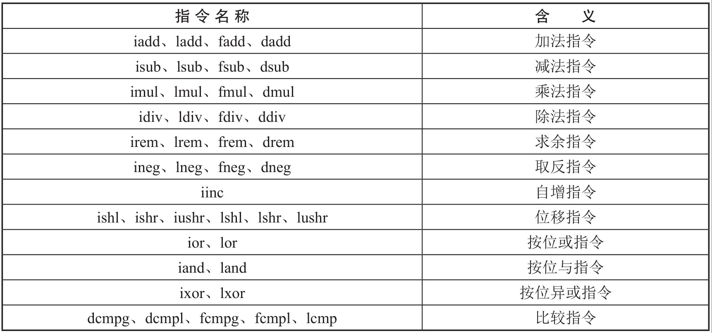
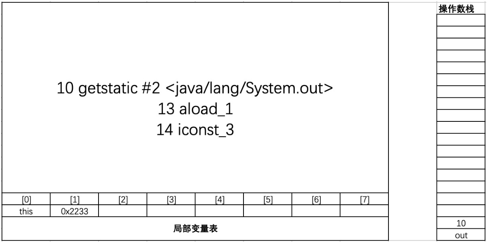
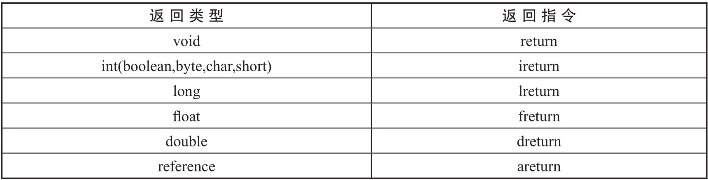
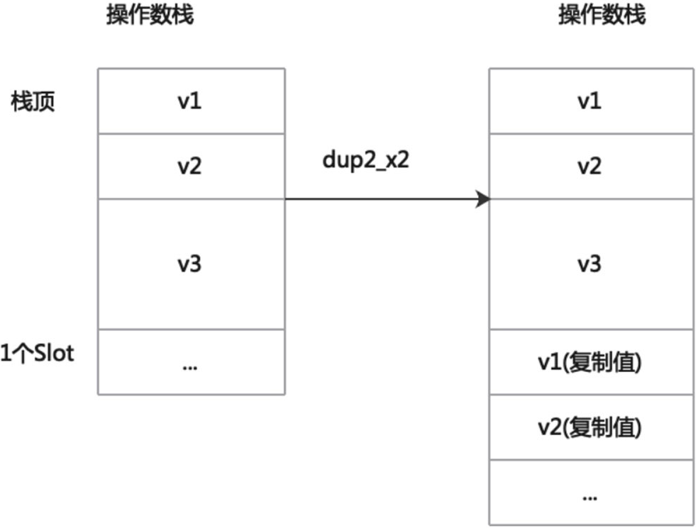

# 第18章 字节码指令集与解析

​	如果大家还有印象的话，前面的章节也有使用到字节码指令，比如第4章讲解操作数栈的时候就使用到iconst和istore指令。字节码指令就是JVM层面对于Java语法逻辑的底层实现，比如在程序中使用的“if else”语句，对应JVM中的指令就是控制转移指令。JVM中还有很多其他类型的字节码指令，比如控制转移指令、异常处理指令等。本章将详细介绍JVM的不同用途的字节码指令，可以更好地帮助理解Java中的语法逻辑在JVM中是如何实现的。

## 18.1 概述

​	Java字节码对于虚拟机，就好像汇编语言对于计算机，属于基本执行指令。<span style="color:red;font-weight:bold;">JVM字节码指令由一个字节长度的、代表着某种特定操作含义的数字（称为操作码，Opcode）以及跟随其后的零至多个代表此操作所需参数（称为操作数，Operands）而构成</span>。由于JVM是基于栈结构而不是寄存器的结构，所以大多数的指令都不包含操作数，只有一个操作码。JVM操作码的长度为一个字节（即0～255），这意味着指令集的操作码总数不可能超过256条。

​	不考虑异常处理的情况下，JVM解释器的执行模型可以使用下面的伪代码表示。

```java
do {
    自动计算PC寄存器的值加1;
    根据PC寄存器的指示位置，从字节码流中取出操作码;
    if(字节码存在操作数) 从字节码流中取出操作数;
	执行操作码所定义的操作;
} while(字节码长度>0);
```

​	掌握常见的字节码指令可以帮助更方便地阅读class文件。

### 18.1.1 字节码与数据类型

​	在JVM的指令集中，大多数的指令都包含了其操作所对应的数据类型信息，例如iload指令用于从局部变量表中加载int型的数据到操作数栈中，fload指令中的f表示加载float类型的数据。对于大部分与数据类型相关的字节码指令，它们的操作码助记符中都有特殊的字符来表明专门为哪种数据类型服务，如下表所示。

<div style="text-align:center;font-weight:bold;">特殊字符对应数据类型</div>


​	也有一些指令的助记符中没有明确地指明操作类型的字母，如arraylength指令，它没有代表数据类型的特殊字符，但操作数永远只能是一个数组类型的对象。还有另外一些指令，如无条件跳转指令goto则是与数据类型无关的。

​	由于JVM的操作码长度只有一个字节，所以包含了数据类型的操作码就为指令集的设计带来了很大的压力。如果每一种与数据类型相关的指令都支持JVM所有运行时数据类型的话，那指令的数量就会超出一个字节所能表示的数量范围了。

​	字节码指令集中大部分的指令都不支持byte、char和short，甚至没有任何指令支持boolean类型，例如，load指令有操作int类型的iload，但是没有操作byte类型的同类指令。编译器会在编译期或运行期将byte和short类型的数据带符号扩展(Sign-Extend)为相应的int类型数据，将boolean和char类型数据零位扩展(Zero-Extend)为相应的int类型数据。与之类似，在处理boolean、byte、short和char类型的数组时，也会转换为使用对应的int类型的字节码指令来处理。因此，大多数对于boolean、byte、short和char类型数据的操作，实际上都是使用相应的int类型作为运算类型。在编写Java代码时也有所体现，比如Java允许byte b1 =12,short s1 = 10，而b1 + s1的结果至少要使用int类型来接收等语法。

### 18.1.2 指令分类

​	由于完全介绍和学习这些指令需要花费大量时间。为了让大家能够更快地熟悉和了解这些基本指令，这里将JVM中的字节码指令集按用途大致分成9类，如下表所示。

<div style="text-align:center;font-weight:bold;">指令分类</div>


​	在做值相关操作时，指令可以从局部变量表、常量池、堆中对象、方法调用、系统调用等区域取得数据，这些数据（可能是值，可能是对象的引用）被压入操作数栈。也可以从操作数栈中取出一个到多个值（pop多次），完成赋值、加减乘除、方法传参、系统调用等操作。下面分别讲解各种指令的详细含义。

## 18.2 加载与存储指令

​	加载和存储指令用于将数据在栈帧中的局部变量表和操作数栈之间来回传输，这类指令包括如下内容。

1、局部变量入栈指令表示将一个局部变量加载到操作数栈，指令如下。

```
xload、xload_<n>（其中x为i、l、f、d、a，分别表示int类型，long类型，float类型，double类型，引用类型；n为数值0到3）
```

2、常量入栈指令表示将一个常量加载到操作数栈，指令如下。

```
bipush
sipush
ldc
ldc_w
ldc2_w
aconst_null
iconst_m1
iconst_<i>
lconst_<l>
fconst_<f>
dconst_<d>
```

3、出栈装入局部变量表指令表示将一个数值从操作数栈存储到局部变量表，指令如下。

```
xstore、xstore_<n>（其中x为i、l、f、d、a，分别表示int类型，long类型，float类型，double类型，引用类型；n为0到3）
```

4、扩充局部变量表的访问索引的指令如下。

```
wide
```

​	上面所列举的指令助记符中，有一部分是以尖括号结尾的（例如`iload_<n>`），这些指令助记符实际上代表了一组指令（例如`iload_<n>`代表了iload_0、iload_1、iload_2和iload_3这几个指令）。这几组指令都是某个带有一个操作数的通用指令（例如iload）的特殊形式，对于这若干组特殊指令来说，它们表面上没有操作数，不需要进行取操作数的动作，但操作数都隐含在指令中。具体含义如下所示。

<div style="text-align:center;font-weight:bold;">指令含义</div>


​	除此之外，它们的语义与原生的通用指令完全一致（例如iload_0的语义与操作数为0时的iload指令语义完全一致）。在尖括号之间的字母指定了指令隐含操作数的数据类型，`<n>`代表非负的整数，`<i>`代表int类型数据，`<l>`代表long类型，`<f>`代表float类型，`<d>`代表double类型。

### 18.2.1 局部变量入栈指令

​	局部变量入栈指令将给定的局部变量表中的数据压入操作数栈。这类指令大体可以分为以下两种类型。

```
xload_<n> (x为i、l、f、d、a，n为0到3)
xload (x为i、l、f、d、a)
```

​	在这里，x的取值表示数据类型。指令xload_n表示将局部变量表中索引为n的位置中的数据压入操作数栈，比如iload_0、fload_0、aload_0等指令。其中aload_n表示将一个对象引用入栈。

​	指令xload通过指定参数的形式，把局部变量压入操作数栈，当使用这个命令时，表示局部变量的数量可能超过了4个，比如指令iload、fload等。

​	我们使用代码来演示局部变量入栈指令，如下代码所示。

<span style="color:#40E0D0;">案例1：局部变量入栈指令示例</span>

- 代码

```java
package com.coding.jvm01.instruct;

/**
 * 1、加载与存储指令
 */
public class LoadAndStoreTest {

    // 1、局部变量压栈指令
    public void load(int num, Object obj, long count, boolean flag, short[] arr) {
        System.out.println(num);
        System.out.println(obj);
        System.out.println(count);
        System.out.println(flag);
        System.out.println(arr);
    }
}
```

​	其对应的字节码指令如下。

<div style="text-align:center;font-weight:bold;">字节码数据</div>



​	这段指令只需要看load相关指令即可，其他指令暂且不表。load指令作用是将局部变量表中的数据压入操作数栈，局部变量表的数据如下图所示。

​	由下图可知在0的位置存储的是this,1的位置存储num代表的值，2的位置存储obj，由于long类型占用两个槽位，所以3和4的位置存储count代表的值，5的位置存储flag表示的值，6的位置存储arr。对应的指令iload_1将1号槽位的int类型的num压入操作数栈；指令aload_2将2号槽位的引用类型的obj压入操作数栈；指令lload_3将3号和4号槽位（合为3号槽位）的long类型的count压入操作数栈；指令iload 5将5号槽位的int类型的flag压入操作数栈（前面讲过操作byte、char、short和boolean类型数据时，用int类型的指令来表示），当槽位超过3之后，需要加上操作数；指令aload 6将6号槽位的引用类型的num压入操作数栈。

<div style="text-align:center;font-weight:bold;">局部变量表数据</div>


### 18.2.2 常量入栈指令

​	常量入栈指令主要负责将常量加载到操作数栈，根据常量的数据类型和入栈内容的不同，又可以分为const系列、push系列和ldc系列指令。

**1 指令const系列**

​	用于对特定的常量入栈，入栈的常量隐含在指令本身里并使用下画线连接，如下表所示，比如指令iconst_`<i>`,`<i>`的取值是从0到5，表示的含义是将i加载到操作数栈。

<div style="text-align:center;font-weight:bold;">常量入栈指令</div>


​	指令的第一个字符表示数据类型，i表示int类型，l表示long类型，f表示float类型，d表示double类型，a表示对象引用。

​	对于非特定的常量入栈，比如需要将int类型的常量128压入到操作数栈，就需要用到push指令，或者常量数值更大的话就需要用到ldc指令了。

**2 指令push系列**

​	push系列主要包括bipush和sipush。它们的区别在于接收数据类型的范围不同，bipush接收一个字节（8个比特位，即-128～127）整数作为参数，sipush接收两个字节（16个比特位，即-32768～32767）整数，它们都将参数压入栈。

**3 指令ldc系列**

​	如果常量超出上面指令的范围，可以使用万能的ldc系列指令，ldc系列指令包含ldc、ldc_w和ldc2_w。ldc接收一个字节的无符号参数，该参数指向常量池中的int、float或者String的索引，将指定的内容压入操作数栈。ldc_w指令接收两个字节的无符号参数，能支持的索引范围大于ldc。如果要入栈的元素是long或者double类型，则使用ldc2_w指令，使用方式都是类似的。

**4 常量入栈指令使用范围**

​	const、push和ldc指令的区别在于常量的使用范围不同，常量入栈指令的使用范围汇总如下表所示。

<div style="text-align:center;font-weight:bold;">常量入栈指令使用范围</div>


**5 案例**

​	我们使用代码来演示常量入栈指令的使用范围，如下代码所示。

<span style="color:#40E0D0;">案例1：常量入栈指令示例</span>

- 代码

```java
package com.coding.jvm01.instruct;

/**
 * 1、加载与存储指令
 */
public class LoadAndStoreTest {

    // 2、常量压栈指令
    public void pushConstLdc() {
        int i = -1;
        int a = 5;
        int b = 6;
        int c = 127;
        int d = 128;
        int e = 1234567;
        int f = 32767;
        int g = 32768;
    }
}
```

​	其对应的字节码指令如下。

<div style="text-align:center;font-weight:bold;">字节码数据</div>


​	从字节码指令中可以看到，上面讲到的三种命令都有使用到，由于代码中定义的都是int类型，所以使用的是iconst、bipush、sipush和ldc。大家可以看到当数值小于5时，使用的是iconst命令；当大于5小于128时，使用的是bipush命令；当大于127小于32768时，使用的是sipush命令；当大于32767时，使用的是ldc命令，“#7”表示常量池中索引为7。

<div style="text-align:center;font-weight:bold;">局部变量表数据</div>


### 18.2.3 出栈装入局部变量表指令

​	出栈装入局部变量表指令用于将一个数值从操作数栈存储到局部变量表的指定位置。这类指令主要以store的形式存在，整体可以分为三类，分别是xstore（x为i、l、f、d、a）、xstore_n（x为i、l、f、d、a,n为0至3）和xastore（其中x为i、l、f、d、a、b、c、s）。xstore和xstore_n类型的指令负责对基本数据类型和引用数据类型的操作，xastore类型的指令主要负责数组的操作。

​	一般说来，出栈装入局部变量表指令需要接收一个参数，用来指明将弹出的元素放在局部变量表的第几个位置。但是，由于局部变量表前几个位置使用非常频繁，为了尽可能压缩指令大小，使用专门的istore_1指令表示将弹出的元素放置在局部变量表索引为1的位置。类似的还有istore_0、istore_2、istore_3，它们分别表示从操作数栈顶弹出一个元素，存放在局部变量表索引为0、2、3的位置。这种做法虽然增加了指令数量，但是可以大大压缩生成的字节码的体积。如果局部变量表很大，需要存储的槽位大于3，那么可以使用xstore指令，外加一个参数，用来表示需要存放的槽位位置。

​	我们使用代码来演示常量出栈指令，如下代码所示。

<span style="color:#40E0D0;">案例1：常量出栈指令示例</span>

- 代码

```java
package com.coding.jvm01.instruct;

/**
 * 1、加载与存储指令
 */
public class LoadAndStoreTest {
    // 3、出栈装入局部变量表指令
    public void store(int k, double d) {
        int m = k + 2;
        long l = 12;
        String str = "emon";
        float f = 10.0F;
        d = 10;
    }
}
```

​	其对应的字节码指令如下。

<div style="text-align:center;font-weight:bold;">字节码数据</div>



​	非静态方法定义完以后，局部变量表中已经存储了参数的值，本案例存储的是k和d的值（在方法调用过程中会有值存在），字节码执行步骤追踪如下所示。

1、iload_1把局部变量表索引为1位置的数据放入操作数栈，也就是把k的值放入操作数栈。

2、iconst_2表示把常量2放入操作数栈。

3、iadd表示把栈内的数据进行算数加的操作，此处不做详细介绍，参考18.3节。

4、istore 4表示把iadd指令的结果放入局部变量表中索引为4的位置。

5、ldc2_w#8 `<12>`表示把12放入操作数栈。

6、lstore 5表示把栈顶元素12放入局部变量表中索引为5的位置。

7、ldc #10`<atguigu>`把字符串“atguigu”放入操作数栈。

8、astore 7表示把栈顶元素字符串“atguigu”放入局部变量表中索引为7的位置。

9、ldc #11 `<10.0>`表示把10.0（此处的类型是float）放入操作数栈。

10、fstore 8表示把栈顶元素（10.0，此处的类型是float）放入局部变量表中索引为8的位置。

11、ldc2_w #12 `<10.0>`表示把10.0（此处的类型为double）放入操作数栈。

12、dstore_2表示把栈顶元素（double类型的10.0）放入局部变量表索引为2的位置。

​	最终局部变量表如下图所示。

<div style="text-align:center;font-weight:bold;">局部变量表数据</div>


## 18.3 算术指令

​	算术指令用于对两个操作数栈上的值进行某种特定运算，并把结果重新压入操作数栈。基本运算包括加法、减法、乘法、除法、取余、取反、自增等。算术指令如下表18-6所示，每一类指令也支持多种数据类型，例如add指令就包括iadd、ladd、fadd和dadd四种，分别支持int类型、long类型、float类型和double类型。本书第4章讲解操作数栈（见4.4节）的时候就用到了iadd指令，不再赘述。

<div style="text-align:center;font-weight:bold;">算数指令汇总</div>



​	所有运算指令中，都没有直接支持byte、short、char和boolean类型的指令，对于这些数据的运算，都使用int类型的指令来处理。此外，在处理boolean、byte、short和char类型的数组时，也会转换为对应的int类型的字节码指令来处理。JVM中的实际数据类型与运算类型的对应关系如下表所示。

<div style="text-align:center;font-weight:bold;">JVM中的实际类型与运算类型</div>


​	数据运算可能会导致溢出，例如两个很大的正整数相加，结果可能是一个负数。其实JVM规范并无明确规定过整型数据溢出的具体结果，仅规定了在处理整型数据时，只有除法指令以及求余指令中当出现除数为0时会导致虚拟机抛出异常“ArithmeticException”。当一个操作产生溢出时，将会使用有符号的无穷大表示，如果某个操作结果没有明确的数学定义的话，将会使用NaN值来表示。所有使用NaN值作为操作数的算术操作，结果都会返回NaN。在数据运算过程中，所有的运算结果都必须舍入到适当的精度，比如要求保留3位小数，那么就需要丢弃多余的数位，常见的运算模式包括向最接近数舍入模式和向零舍入模式。

1、向最接近数舍入模式

​	JVM要求在进行浮点数计算时，所有的运算结果都必须舍入到适当的精度，非精确结果必须舍入为可被表示的最接近的精确值，如果有两种可表示的形式与该值一样接近，将优先选择最低有效位为零的那种。

2、向零舍入模式

​	将浮点数转换为整数时，采用向零舍入模式，该模式将在目标数值类型中选择一个最接近但是不大于原值的数字作为最精确的舍入结果，这种模式会使小数部分被丢弃。

### 18.3.1 彻底理解i++与++i

​	大家都知道i++与++i都是对自身进行加1操作，但是它们之间的区别到底是什么呢？我们今天从字节码指令的角度来理解i++和++i，具体代码如下代码所示。

<span style="color:#40E0D0;">案例1：i++与++i示例</span>

- 代码

```java
public class ArithmeticTest {

    public void method1() {
        int i = 10;
        i++;
    }

    public void method2() {
        int i = 10;
        ++i;
    }
}
```

​	方法method1( )对应的字节码指令如下。

```
0 bipush 10
2 istore_1
3 iinc 1 by 1
6 return
```

​	方法method2( )对应的字节码指令如下。

```
0 bipush 10
2 istore_1
3 iinc 1 by 1
6 return
```

​	如果只对变量进行++i或者i++操作，可以看到字节码指令是完全一样的，所以在性能上并没有什么不同，两者完全可以替换使用。两段代码的字节码指令的含义如下。

1、bipush 10表示把常量10放入操作数栈。

2、istore_1表示从操作数栈弹出10放入局部变量表，此时操作数栈为空，局部变量表索引为1的槽位存储10（描述符索引为i）。

3、iinc 1 by 1表示对局部变量表中索引为1的槽位中的数值进行加1操作，即更改为11，这便是上面代码的所有流程。

​	再看另外一段代码，当自增运算符和其他运算符混合运算时，如下代码所示。

<span style="color:#40E0D0;">案例1：i++与++i示例</span>

- 代码

```java
public class ArithmeticTest {

    public void method3() {
        int i = 10;
        int a = i++;
        int j = 20;
        int b = ++j;
    }
}
```

​	方法method3( )对应的字节码指令如下。

```
 0 bipush 10
 2 istore_1
 3 iload_1
 4 iinc 1 by 1
 7 istore_2
 8 bipush 20
10 istore_3
11 iinc 3 by 1
14 iload_3
15 istore 4
17 return
```

​	对代码的解析如下。

1、执行bipush 10指令，此时操作数栈存放数据10。

2、执行istore_1指令，此时把数据10放入局部变量表1的位置，同时把栈中数据弹出，栈为空。

3、执行iload_1指令，此时把局部变量表中1号位置中的数据10放入操作数栈。

4、执行iinc 1 by 1指令，局部变量表中1号位置的数据加1,1号位置的数据变为11。

5、执行istore_2指令，此时把操作数栈中的10放入局部变量表2的位置，同时把栈中数据弹出，栈为空，此时局部变量表中1号位置存放的数据为11,2号位置存放的数据是10，也就是我们常说的先赋值再进行自增操作，所以此时a的值为10,i的值为11。

6、执行bipush 20指令，此时操作数栈存放数据20。

7、执行istore_3指令，此时把数据20放入局部变量表3的位置，同时把栈中数据弹出，栈为空。

8、执行iinc 3 by 1指令，局部变量表中3号位置的数据加1,3号位置的数据变为21。

9、执行iload_3指令，此时把局部变量表中3号位置中的数据21放入操作数栈。

10、执行istore_4指令，此时把操作数栈中的21放入局部变量表4的位置，同时把栈中数据弹出，栈为空，此时局部变量表中3号位置存放的数据为21,4号位置存放的数据是21，也就是我们常说的先自增再进行赋值操作，所以此时j的值为21,b的值为21。

### 18.3.2 比较指令

​	比较指令的作用是比较栈顶两个元素的大小，并将比较结果入栈。比较指令有dcmpg、dcmpl、fcmpg、fcmpl、lcmp。与前面讲解的指令类似，首字符d表示double类型，f表示float,l表示long。

​	可以发现，对于double和float类型的数字，分别有两套指令，即xcmpg和xcmpl（x取值d或f），以float为例，有fcmpg和fcmpl两个指令，它们的区别在于在数字比较时，若遇到NaN值，处理结果不同，指令dcmpl和dcmpg也是类似。指令lcmp针对long型整数，由于long型整数没有NaN值，故无须准备两套指令。

​	比如指令fcmpg和fcmpl都从栈中弹出两个操作数，并将它们做比较，设栈顶的元素为v2，栈顶顺位第2位的元素为v1，比较结果如下。

1、若v1等于v2，则压入0。

2、若v1大于v2，则压入1。

3、若v1小于v2，则压入-1。

​	两个指令的不同之处在于，如果遇到NaN值，fcmpg会压入1，而fcmpl会压入-1。dcmpg和dcmpl指令同理。

​	数值类型的数据才可以比较大小，例如byte、short、char、int、long、float、double类型的数据可以比较大小，但是boolean和引用数据类型的数据不能比较大小。

## 18.4 类型转换指令

​	类型转换指令可以将两种不同的数值类型进行相互转换。这些转换操作一般用于实现用户代码中的显式类型转换操作，或者用来处理数据类型相关指令与数据类型无法一一对应的问题。类型转换指令又分为宽化类型转换和窄化类型转换。

### 18.4.1 宽化类型转换

​	宽化类型转换简单来说就是把小范围类型向大范围类型转换，它是隐式转换，也可以理解为自动类型转换，不需要强制类型转换。

**1 转换规则**

​	JVM直接支持以下数值的宽化类型转换（Widening Numeric Conversion，小范围类型向大范围类型的安全转换）。虽然在代码中不需要强制转换，但是在class文件中依然存在转换指令，宽化转换指令包含以下指令。

- 从int类型到long、float或者double类型。对应的指令为i2l、i2f、i2d。

- 从long类型到float、double类型。对应的指令为l2f、l2d。
- 从float类型到double类型。对应的指令为f2d。
- 简化可以理解为int→long→float→double。如下代码展示了宽化类型转换。

<span style="color:#40E0D0;">案例1：宽化类型转换</span>

- 代码

```java
/**
 * 指令3、类型转换指令
 */
public class ClassCastTest {
    // 宽化类型转换，针对宽化类型转换的基本测试
    public void upCast1() {
        int i = 10;
        long l = i;
        float f = i;
        double d = i;

        float f1 = l;
        double d1 = l;
        double d2 = f1;
    }
}
```

​	方法upCast1()对应的字节码指令如下。

```
 0 bipush 10
 2 istore_1
 3 iload_1
 4 i2l
 5 lstore_2
 6 iload_1
 7 i2f
 8 fstore 4
10 iload_1
11 i2d
12 dstore 5
14 lload_2
15 l2f
16 fstore 7
18 lload_2
19 l2d
20 dstore 8
22 fload 7
24 f2d
25 dstore 10
27 return
```

​	可以看到字节码指令中包含宽化类型转换指令i2l、i2f、i2d、l2f、l2d和f2d，而且不需要在代码中进行强制类型转换。

​	除了上面讲演示的类型转换，还会经常遇到byte类型转int类型的情况。大家请注意，从byte、char和short类型到int类型，宽化类型转换实际上是没有指令存在的，如下代码演示了byte类型转换为int和long类型的情况。

<span style="color:#40E0D0;">案例1：byte类型转换为int和long类型</span>

- 代码

```java
/**
 * 指令3、类型转换指令
 */
public class ClassCastTest {
    public void upCast2() {
        byte b = 10;
        int i = b;
        long l = b;
    }
}
```

​	字节码指令如下。

```
0 bipush 10
2 istore_1
3 iload_1
4 istore_2
5 iload_1
6 i2l
7 lstore_3
8 return
```

​	从字节码指令可以看到，对于byte类型转为int，虚拟机并没有做实质性的转化处理，也就是说没有使用类型转换指令，因为JVM内部会使用int来表示byte类型数据。而将byte转为long时，使用的是i2l指令，也说明了使用int类型代替byte类型。这种处理方式有两个特点，一方面可以减少实际的数据类型，如果为short和byte都准备一套指令，那么指令的数量就会大增，而虚拟机目前的指令总数不超过256个，为了节省指令资源，将short和byte当作int处理也在情理之中；另一方面，由于<span style="color:red;font-weight:bold;">局部变量表中的slot固定为32位</span>，每个int、float、reference占用1个slot，而比int类型窄的byte或者short存入局部变量表也要占用1个slot，那么还不如直接提升为int类型，这样还能减少JVM对类型支持的数量。

**2 精度损失**

​	宽化类型转换是不会因为超过目标类型最大值而丢失信息的，例如，从int转换到long，或者从int转换到double，都不会丢失任何信息，转换前后的值是精确相等的。

​	<span style="color:red;font-weight:bold;">但是从int、long类型数值转换到float，或者long类型数值转换到double时，将可能发生精度损失</span>，可能丢失掉几个最低有效位上的值，转换后的浮点数值是根据IEEE 754最接近舍入模式所得到的正确整数值。<span style="color:red;font-weight:bold;">尽管宽化类型转换实际上是可能发生精度损失的，但是这种转换永远不会导致JVM抛出运行时异常</span>。如下代码展示了宽化类型转换精度损失的情况。

<span style="color:#40E0D0;">案例1：宽化类型转换精度损失</span>

- 代码

```java
/**
 * 指令3、类型转换指令
 */
public class ClassCastTest {
	// 举例：精度损失的问题
    @Test
    public void upCast3() {
        int i = 123123123;
        float f = i;
        System.out.println(f);
    }
}
```

​	运行结果如下。

```bash
1.2312312E8
```

​	由结果可知，虽然程序运行期间没有报异常，但是最后的结果却是1.2312312E8，也就是1.23123120乘以10的8次方，最后损失了一位精度。

### 18.4.2 窄化类型转换]()

​	对应宽化类型转换的隐式转换，窄化类型转换就是显示类型转换或者强制类型转换。

**1 转换规则**

​	JVM直接支持以下窄化类型转换。

- 从int类型到byte、short或者char类型。对应的指令有i2b、i2s、i2c。
- 从long类型到int类型。对应的指令有l2i。
- 从float类型到int或者long类型。对应的指令有f2i、f2l。
- 从double类型到int、long或者float类型。对应的指令有d2i、d2l、d2f。

​	简化可以理解为double→float→long→int。如下代码展示了窄化类型转换。

<span style="color:#40E0D0;">案例1：窄化类型转换</span>

- 代码

```java

/**
 * 指令3、类型转换指令
 */
public class ClassCastTest {
    // 窄化类型转换基本的使用
    public void downCast1() {
        int i = 10;
        byte b = (byte) i;
        short s = (short) i;
        char c = (char) i;

        long l = 10L;
        int i1 = (int) l;
        byte b1 = (byte) l;
    }
}
```

​	downCast1()方法对应的字节码指令如下。

```
 0 bipush 10
 2 istore_1
 3 iload_1
 4 i2b
 5 istore_2
 6 iload_1
 7 i2s
 8 istore_3
 9 iload_1
10 i2c
11 istore 4
13 ldc2_w #10 <10>
16 lstore 5
18 lload 5
20 l2i
21 istore 7
23 lload 5
25 l2i
26 i2b
27 istore 8
29 return
```

​	从方法中可以看出，窄化类型转换需要强制类型转换。在class文件中使用到了前面讲到的i2b（int类型到byte类型）、i2s（int类型到short类型）、i2c（int类型到char类型）等指令。需要注意的是当从long类型转换到byte类型时，字节码指令中使用了两个指令（25行和26行），分别是l2i和i2b，这里先将long类型转换至int类型，再从int类型转换至byte类型。

**2 精度损失**

​	窄化类型转换可能会导致转换结果具备不同的正负号、不同的数量级，因此，转换过程很可能会导致数值丢失精度。尽管数据类型窄化转换可能会发生上限溢出、下限溢出和精度损失等情况，<span style="color:red;font-weight:bold;">但是JVM规范中明确规定数值类型的窄化转换指令永远不可能导致虚拟机抛出运行时异常</span>。如下代码展示了窄化类型转换精度损失的情况。

<span style="color:#40E0D0;">案例1：窄化类型转换精度损失</span>

- 代码

```java
/**
 * 指令3、类型转换指令
 */
public class ClassCastTest {
    // 窄化类型转换的精度损失
    @Test
    public void downCast1() {
        int i = 128;
        byte b = (byte) i;
        System.out.println(b); // -128
    }
}
```

​	上面代码的运行结果如下。

```
-128
```

​	原因是int类型的128的二进制数如下。

```
0000 0000 0000 0000 0000 0000 1000 0000
```

​	当转化为byte类型时，把高位去掉，剩下的二进制数如下。

```
1000 0000
```

​	最高位是1，表明该数为负数，即-128。可知窄化转换类型会造成精度损失。

​	当将一个浮点值窄化转换为整数类型T（T限于int或long类型之一）的时候，将遵循以下转换规则。

1、如果浮点值是NaN，那转换结果就是int或long类型的0。

2、如果浮点值不是无穷大的话，浮点值使用IEEE 754的标准向零舍入模式取整，获得整数值v，如果v在目标类型T（int或long）的表示范围之内，那转换结果就是v。否则，将根据v的符号，转换为T所能表示的最大或者最小正数。

​	当将一个double类型窄化转换为float类型时，通过向最接近数舍入模式舍入一个可以使用float类型表示的数字。最后结果根据下面这3条规则判断。

1、如果转换结果的绝对值太小而无法使用float来表示，将返回float类型的正负零。

2、如果转换结果的绝对值太大而无法使用float来表示，将返回float类型的正负无穷大。

3、对于double类型的NaN值将按规定转换为float类型的NaN值。

<span style="color:#40E0D0;">案例2：窄化类型转换示例</span>

- 代码

```java
/**
 * 指令3、类型转换指令
 */
public class ClassCastTest {
    // 测试NaN和无穷大的情况
    @Test
    public void downCast2() {
        // 定义NaN值，查看转换为低精度整数类型结果
        double d1 = Double.NaN;
        int i = (int) d1;
        System.out.println(i);

        // 定义double类型正向无穷大，查看转换为低精度整数类型结果
        double d2 = Double.POSITIVE_INFINITY;
        long l = (long) d2;
        System.out.println(l);
        System.out.println(Long.MAX_VALUE);
        int j = (int) d2;
        System.out.println(j);
        System.out.println(Integer.MAX_VALUE);

        // 查看转换为低精度浮点类型结果
        float f = (float) d1;
        System.out.println(f);
        float f1 = (float) d2;
        System.out.println(f1);
    }
}
```

​	代码运行结果如下。

```
0
9223372036854775807
9223372036854775807
2147483647
2147483647
NaN
Infinity
```

​	从结果可知，当double为NaN值时，整数类型转换结果为0；但是转换为float类型时结果依然为NaN。

​	当double为正向无穷大时，整数类型转换结果为整数类型的正向最大值；但是转换为float类型时结果依然是Infinity（无穷大)。

## 18.5 对象、数组的创建与访问指令

​	Java作为一门面向对象语言，创建和访问对象是其一大特点，JVM也在字节码层面为其提供了一些指令专门用于操作类的对象。这类指令细分为创建指令、字段访问指令、数组操作指令和类型检查指令。

### 18.5.1 创建指令

​	虽然类实例和数组都是对象，但JVM对类实例和数组的创建与操作使用了不同的字节码指令。

**1 创建类实例的指令**

​	创建类实例的指令是new，它接收一个操作数，操作数为指向常量池的索引，表示要创建的类型，执行完成后，将对象的引用压入操作数栈。如下代码清单演示了创建类实例指令的使用。

<span style="color:#40E0D0;">案例1：创建类实例的指令</span>

- 代码

```java
/**
 * 指令4：对象、数组的创建与访问指令
 */
public class NewTest {

    // 1、创建指令
    public void newInstance() {
        Object obj = new Object();
        File file = new File("emon.avi");
    }
}
```

​	方法newInstance()对应的字节码指令如下。

```
0 new #2 <java/lang/Object>
3 dup
4 invokespecial #1 <java/lang/Object.<init> : ()V>
7 astore_1
8 return
```

​	字节码指令含义如下。

1、new #2 `<java/lang/Object>`指令：创建一个对象并且将对象地址（比如为0x1234）放入操作数栈。

2、dup指令：复制一份栈顶的数据（此时为0x1234）继续放入操作数栈，此时操作数栈中有两条一样的地址。

3、invokespecial #1 `<java/lang/Object.<init>>`指令：调用Object的构造方法，并且弹出栈顶元素，此时操作数栈中还有一份0x1234数据。

4、astore_1指令：把操作数栈中的数据放入局部变量表中索引为1的位置。

​	new语句的三个作用分别是在内存中<span style="color:#FF1493;font-weight:bold;">开辟内存空间</span>，<span style="color:#FF1493;font-weight:bold;">创建对象</span>和<span style="color:#FF1493;font-weight:bold;">将对象赋给一个局部变量</span>。

**2 创建数组的指令**

​	创建数组的指令包含newarray、anewarray和multianewarray。newarray负责创建基本类型数组，anewarray负责创建引用类型数组，multianewarray负责创建多维数组。

​	上述创建指令可以用于创建数组，由于数组在Java中广泛使用，这些指令的使用频率也非常高。如下代码演示了创建数组使用到的字节码指令。

<span style="color:#40E0D0;">案例1：创建数组指令</span>

```java
/**
 * 指令4：对象、数组的创建与访问指令
 */
public class NewTest {

    public void newArray() {
        // 创建int数组
        int[] intArray = new int[10];
        // 创建引用类型数组
        Object[] objArray = new Object[10];
        // 创建二位数组
        int[][] mintArray = new int[10][10];
        // 创建没有初始化的二维数组
        String[][] strArray = new String[10][];
    }
}
```

​	newArray( )方法对应的字节码指令如下。

```
 0 bipush 10
 2 newarray 10 (int)
 4 astore_1
 5 bipush 10
 7 anewarray #2 <java/lang/Object>
10 astore_2
11 bipush 10
13 bipush 10
15 multianewarray #6 <[[I> dim 2
19 astore_3
20 bipush 10
22 anewarray #7 <[Ljava/lang/String;>
25 astore 4
27 return
```

​	从字节码指令中可以看到创建基本类型数组intArray使用的指令是newarray；创建引用类型数组objArray使用的指令是anewarray；创建多维数组intmutiArray使用的指令是multianewarray，但是当多维数组intArray1只有一个数组有长度时，使用的指令是anewarray，把其作为引用类型数组创建。

### 18.5.2 字段访问指令

​	对象创建后，就可以通过对象访问指令获取对象实例或数组实例中的字段或者数组元素。访问类字段（static字段，或者称为类变量）的指令包括getstatic和putstatic。访问类实例字段（非static字段，或者称为实例变量）的指令包括getfield和putfield。

​	以getstatic指令为例，它含有一个操作数，操作数指明了一个常量池中的索引值，该索引处的值为常量池的字段符号引用。getstatic指令的作用就是获取字段符号引用指定的对象或者值，并将其压入操作数栈，如下代码所示。

<span style="color:#40E0D0;">案例1：getstatic指令示例</span>

- 代码

```java
/**
 * 指令4：对象、数组的创建与访问指令
 */
public class NewTest {
    // 2、字段访问指令
    public void sayHello() {
        System.out.println("hello");
    }
}
```

​	这是一段很简单的代码，在sayHello( )方法中输出"hello"字符串。对应的字节码指令如下。

```
0 getstatic #8 <java/lang/System.out : Ljava/io/PrintStream;>
3 ldc #9 <hello>
5 invokevirtual #10 <java/io/PrintStream.println : (Ljava/lang/String;)V>
8 return
```

​	字节码常量池中的内容如下所示。

```
   #8 = Fieldref           #59.#60        // java/lang/System.out:Ljava/io/PrintStream;
   #9 = String             #61            // hello
  #10 = Methodref          #62.#63        // java/io/PrintStream.println:(Ljava/lang/String;)V
  #59 = Class              #72            // java/lang/System
  #60 = NameAndType        #73:#74        // out:Ljava/io/PrintStream;
  #61 = Utf8               hello
  #62 = Class              #75            // java/io/PrintStream
  #63 = NameAndType        #76:#71        // println:(Ljava/lang/String;)V
  #71 = Utf8               (Ljava/lang/String;)V
  #72 = Utf8               java/lang/System
  #73 = Utf8               out
  #74 = Utf8               Ljava/io/PrintStream;
  #75 = Utf8               java/io/PrintStream
  #76 = Utf8               println
```

​	字节码执行步骤追踪。

​	第一步：首先会由“getstatic”指令将常量池中第8号常量放入操作数栈，我们追踪第8号常量指向的位置，从常量池结构中可以看到，8指向59和60,59指向72,60指向73和74。通过8指向59,59指向72可以确定该常量在System类中使用，通过8指向60，60指向73和74确定其类型是PrintStream类型，常量值为“out”，最终将静态常量“out”压入操作数栈的栈顶。

​	第二步：“ldc”指令将常量中第9号常量入栈，第9号常量指向61号的“Hello“字符串，所以将“Hello”压入操作数栈的栈顶。

​	第三步：“invokevirtual”指令将操作数栈中的数据弹出，执行println()方法。

### 18.5.3 数组操作指令

​	数组操作指令主要包含xaload和xastore指令。xaload指令表示把一个数组元素加载到操作数栈的指令。根据不同的类型数组操作指令又分为baload、caload、saload、iaload、laload、faload、daload和aaload。指令前面第一个字符表示指令对应的数据类型，比如saload和caload分别表示操作short类型数组和char类型数组。指令xaload在执行时，要求操作数中栈顶元素为数组索引i，栈顶顺位第2个元素为数组引用a，该指令会弹岀栈顶这两个元素，并将a[i]重新压入栈。

​	xastore指令表示将一个操作数栈的值存储到数组元素中。根据不同类型数组操作指令又分为bastore、castore、sastore、iastore、lastore、fastore、dastore和aastore。指令前面第一个字符表示指令对应的数据类型，比如iastore指令表示给一个int数组的给定索引赋值。在iastore执行前，操作数栈顶需要准备3个元素，分别是赋值给数组的值、索引（数组角标）、数组引用，iastore会弹出这3个值，并将值赋给数组中指定索引的位置。

​	不同类型数组和数组操作指令的对应关系如下表所示。

<div style="text-align:center;font-weight:bold;">数组操作指令</div>


​	此外，获取数组长度的指令为arraylength，该指令会弹出栈顶的数组元素，获取数组的长度，将长度压入栈。如下代码展示了数组操作指令。

<span style="color:#40E0D0;">案例1：数组操作指令</span>

- 代码

```java
/**
 * 指令4：对象、数组的创建与访问指令
 */
public class NewTest {
    // 3、数组操作指令
    public void setArray() {
        int[] intArray = new int[10];
        intArray[3] = 10;
        System.out.println(intArray[3]);
    }
}
```

​	setArray( )方法对应的字节码指令如下。

```
 0 bipush 10
 2 newarray 10 (int)
 4 astore_1
 5 aload_1
 6 iconst_3
 7 bipush 10
 9 iastore
10 getstatic #8 <java/lang/System.out : Ljava/io/PrintStream;>
13 aload_1
14 iconst_3
15 iaload
16 invokevirtual #14 <java/io/PrintStream.println : (I)V>
19 return
```

​	bipush 10指令把常量10放入操作数栈。newarray 10(int)指令负责在堆中生成一个数组对象并且把数组地址（假如此时数组地址为0x2233）放入操作数栈，指令后面紧跟的10表示数组中元素的类型为int，注意区分bipush 10，这个10表示数组的长度，此时需要把数组的长度出栈，如下图所示，图中没有展示常量10。

<div style="text-align:center;font-weight:bold;">bipush和newarray字节码指令操作</div>


​	astore_1指令把栈顶数据弹出并且放入到局部变量表中索引为1的槽位；aload_1指令把局部变量表中索引为1的槽位中的数据放入操作数栈；iconst_3指令把常量3放入操作数栈；bipush 10指令把常量10放入操作数栈，如下图所示。

<div style="text-align:center;font-weight:bold;">前6条字节码指令操作</div>


​	iastore指令把常量10（赋值元素）、常量3（数组角标）以及数组地址(0x2233)弹出，给数组元素赋值，如下图所示。

<div style="text-align:center;font-weight:bold;">iastore字节码指令操作</div>


​	getstatic #2 `<java/lang/System.out>`指令把常量“out”放入操作数栈；aload_1把局部变量表中1号槽位的值放入操作数栈；iconst_3把常量3放入操作数栈，如下图所示。

<div style="text-align:center;font-weight:bold;">getstatic,aload以及iconst字节码指令操作</div>


​	iaload指令把栈顶元素为数组的索引3弹出，继续弹出数组引用(0x2233)，继而找到数组角标为3的元素，即10，重新把常量10压入栈，如下图所示。

<div style="text-align:center;font-weight:bold;">iaload字节码指令操作</div>



​	至此就完成了数组的赋值和取值操作，最后输出结果即可。

### 18.5.4 类型检查指令

​	检查类实例或数组类型的指令主要包括instanceof和checkcast。指令instanceof用来判断给定对象是否为某一个类的实例，它会将判断结果压入操作数栈。指令checkcast用于检查类型强制转换是否可以进行。这两个指令很相似，区别在于checkcast指令如果可以强制类型转换，那么checkcast指令不会改变操作数栈，否则它会抛出“ClassCastException”异常，instanceof指令会将判断结果压入操作数栈，如果某对象属于某一个类的实例，将1压入操作数栈，否则将0压入操作数栈。如下代码演示了类型检查指令的使用。

<span style="color:#40E0D0;">案例1：类型检查指令</span>

- 代码

```java
/**
 * 指令4：对象、数组的创建与访问指令
 */
public class NewTest {
	// 4、类型检查指令
    public String checkCast(Object obj) {
        if (obj instanceof String) {
            return (String) obj;
        } else {
            return null;
        }
    }
}
```

​	字节码指令如下所示。

```
 0 aload_1
 1 instanceof #17 <java/lang/String>
 4 ifeq 12 (+8)
 7 aload_1
 8 checkcast #17 <java/lang/String>
11 areturn
12 aconst_null
13 areturn
```

​	对代码的解析如下。

1、aload_1表示把局部变量表中索引为1的位置中的数据压入操作数栈，即将obj压入操作数栈。

2、instanceof #17`<java/lang/String>`表示将操作数栈中栈顶元素obj弹出，判断obj类型是否为java.lang.String，如果是，将1压入操作数栈；否则将0压入操作数栈。

3、ifeq 12(+8)比较栈顶元素是否等于0，如果不等于0，进行下一步，否则跳转到指令行号为12的指令。括号中的+8表示当前指令的行号加8之后正好为跳转的指令行号，此时会有出栈的操作。

4、aload_1表示把局部变量表中索引为1的位置中的数据压入操作数栈，即将obj压入操作数栈。

5、checkcast #17 `<java/lang/String>`指令判断obj是否可以转换为java.lang.String，如果不可以转换，抛出“ClassCastException”异常；如果可以转换，该指令也不会影响操作数栈。

## 18.6 方法调用与返回指令

### 18.6.1 方法调用指令

​	方法调用指令包括invokevirtual、invokeinterface、invokespecial、invokestatic和invokedynamic，上述5条指令含义如下表所示。

<div style="text-align:center;font-weight:bold;">方法调用指令集</div>


​	如下代码展示了方法调用指令的使用。

<span style="color:#40E0D0;">案例1：方法调用指令</span>

```java
/*
指令5：方法调用与返回指令
 */
public class MethodInvokeReturnTest {

    // 方法调用指令：invokespecial：静态分派
    public void invoke1() {
        // 情况1：类实例构造器方法：<init>()
        Date date = new Date();
        Thread t1 = new Thread();
        // 情况2：父类的方法
        super.toString();
        // 情况3：私有方法
        methodPrivate();
    }
}
```

​	对应的字节码指令如下。

```
 0 new #2 <java/util/Date>
 3 dup
 4 invokespecial #3 <java/util/Date.<init> : ()V>
 7 astore_1
 8 new #4 <java/lang/Thread>
11 dup
12 invokespecial #5 <java/lang/Thread.<init> : ()V>
15 astore_2
16 aload_0
17 invokespecial #6 <java/lang/Object.toString : ()Ljava/lang/String;>
20 pop
21 aload_0
22 invokespecial #7 <com/coding/jvm01/instruct/MethodInvokeReturnTest.methodPrivate : ()V>
25 return
```

​	可以看到invokespecial指令调用了Date的构造方法、Thread对象的构造方法，以及该类的父类方法以及私有方法。其他的指令就不再举例说明了，知道其含义即可。关于方法调用指令在本书4.7.2节已经介绍过了，此处不再赘述。

### 18.6.2 方法返回指令

​	方法调用结束前，需要返回方法调用结果。方法返回指令是根据返回值的类型区分的，包括ireturn（当返回值是boolean、byte、char、short和int类型时使用）、lreturn、freturn、dreturn和areturn，另外还有一条return指令供声明返回值为void的方法、实例初始化方法以及类和接口的类初始化方法使用。方法返回指令如下表所示。

<div style="text-align:center;font-weight:bold;">方法返回指令</div>



​	例如，ireturn指令表示将当前方法操作数栈中的栈顶元素弹出，并将这个元素压入调用者方法的操作数栈中，因为调用者非常关心方法的返回值，所有在当前方法操作数栈中的其他元素都会被丢弃。如果当前返回的是synchronized()方法，那么还会执行一个隐含的monitorexit指令，退出临界区，在18.10节我们会介绍同步控制指令。最后，会丢弃当前方法的整个栈帧，恢复调用者的栈帧，并将控制权转交给调用者。如下代码演示了方法返回指令的使用。

<span style="color:#40E0D0;">案例1：方法返回指令</span>

- 代码

```java
/*
指令5：方法调用与返回指令
 */
public class MethodInvokeReturnTest {
    
    // 方法的返回指令
    public int returnInt() {
        int i = 500;
        return i;
    }
}
```

​	对应的字节码指令如下。

```
0 sipush 500
3 istore_1
4 iload_1
5 ireturn
```

​	第一步通过sipush 500指令将常量500放入操作数栈；第二步通过istore指令把栈顶元素弹出，放入局部变量表中槽位为1的位置；第三步通过iload_1指令把局部变量1号槽位的元素放入操作数栈；最后通过ireturn指令弹出栈顶元素给到调用者方法的操作数栈。其他指令同理，不再举例。

## 18.7 操作数栈管理指令

​	JVM提供的操作数栈管理指令，可以直接作用于操作数栈，和数据结构中的栈操作类似，都会有入栈和出栈的操作，这类指令如下表所示。

<div style="text-align:center;font-weight:bold;">操作数栈指令集</div>


​	pop指令表示将栈顶的1个32位的元素（比如int类型）出栈，即该元素占用一个slot即可。pop2指令表示将栈顶的1个64位的元素（比如long、double类型）或2个32位的元素出栈，即弹出操作数栈栈顶的2个slot。

​	dup和dup2表示复制栈顶数据并压入栈顶，dup后面的数字表示要复制的slot个数。dup开头的指令用于复制1个32位元素数据，即复制1个slot中的元素。dup2开头的指令用于复制1个64位或2个32位元素数据，即复制2个slot中的元素。

​	带_x的指令是复制栈顶数据并插入栈顶以下的某个位置。4个指令分别是dup_x1、dup_x2、dup2_x1、dup2_x2。

1、dup_x1表示复制1个栈顶元素，然后将复制的值插入原来栈顶第2个slot下面。假设原来操作数栈中的元素从栈顶向下顺序是v1,v2，…；执行dup_x1指令之后的元素从栈顶向下顺序为v1,v2,v1（复制值），…，如下图所示。

<div style="text-align:center;font-weight:bold;">dup_x1字节码指令操作</div>


2、dup_x2表示复制1个栈顶32位元素数据，然后将复制的值插入原来栈顶第3个slot下面。

①假设原来操作数栈中的元素从栈顶向下顺序是v1,v2,v3，…，且所有元素都是32位；执行dup_x2指令之后的元素从栈顶向下顺序为v1,v2,v3,v1（复制值），…，如下图所示。

<div style="text-align:center;font-weight:bold;">dup_x2字节码指令操作</div>


②假设原来操作数栈中的元素顺序是v1,v2，…，其中v1占用1个slot,v2占用2个slot；那么执行dup_x2指令之后的元素从栈顶向下顺序为v1,v2,v1（复制值），…，也就是复制到第3个slot下面，如下图所示。

<div style="text-align:center;font-weight:bold;">dup_x2字节码指令操作</div>


3、dup2_x1表示复制1个64位数据或2个32位数据的元素（从栈顶开始计数），然后将复制的值插入原来栈顶第3个slot下面。

①假设原来操作数栈中的元素顺序是v1,v2,v3，…，且所有元素都是32位；执行dup2_x1指令之后的元素顺序可能为v1,v2,v3,v1（复制值），v2（复制值），…，如下图所示。

<div style="text-align:center;font-weight:bold;">dup2_x1字节码指令操作</div>


②假设原来操作数栈中的元素顺序是v1,v2，…，其中v1占用2个slot,v2占用1个slot；那么执行dup2_x1指令之后的元素从栈顶向下顺序为v1,v2,v1（复制值），…，即复制到第3个slot下面，如下图所示。

<div style="text-align:center;font-weight:bold;">dup2_x1字节码指令操作</div>


2、dup2_x2表示复制复制1个64位数据或2个32位数据的元素（从栈顶开始计数），然后将复制的值插入原来栈顶第4个slot下面，该类型包含的情况较多，分类如下。

①假设原来操作数栈中的元素从栈顶向下顺序是v1,v2,v3,v4，…，且所有元素都是32位；执行dup2_x2指令之后的元素从栈顶向下顺序为v1,v2,v3,v4,v1（复制值），v2（复制值），…，如下图所示。

<div style="text-align:center;font-weight:bold;">dup2_x2字节码指令操作</div>


②假设原来操作数栈中的元素从栈顶向下顺序是v1,v2,v3，…，其中v1占用2个slot，其它元素占用1个slot；执行dup2_x2指令之后的元素从栈顶向下顺序为v1,v2,v3,v1（复制值），…，如下图所示。

<div style="text-align:center;font-weight:bold;">dup2_x2字节码指令操作</div>


③假设原来操作数栈中的元素从栈顶向下顺序是v1,v2,v3，…，其中v1和v2占用1个slot,v3元素占用2个slot；执行dup2_x2指令之后的元素从栈顶向下顺序为v1,v2,v3,v1（复制值），v2（复制值），…，如下图所示。

<div style="text-align:center;font-weight:bold;">dup2_x2字节码指令操作</div>



④假设原来操作数栈中的从栈顶向下元素顺序是v1,v2，…，其中v1和v2占用2个slot；执行dup2_x2指令之后的从栈顶向下元素顺序为v1,v2,v1（复制值），…，如下图所示。

<div style="text-align:center;font-weight:bold;">dup2_x2字节码指令操作</div>


<span style="color:#40E0D0;">案例1：操作数栈管理指令。</span>

- 代码

```java
package com.coding.jvm01.instruct;

/**
 * 指令6：操作数栈管理指令
 */
public class StackOperateTest {
    private long index = 0;

    public long nextIndex() {
        return index++;
    }
}
```

​	对应的字节码指令如下。

```
 0 aload_0
 1 dup
 2 getfield #2 <com/coding/jvm01/instruct/StackOperateTest.index : J>
 5 dup2_x1
 6 lconst_1
 7 ladd
 8 putfield #2 <com/coding/jvm01/instruct/StackOperateTest.index : J>
11 lreturn
```

​	aload_0指令把局部变量表0号位置的this（当前对象）地址（比如地址为0x1212）放入操作数栈。dup指令把this对象地址复制一份放入操作数栈，如下图所示。

<div style="text-align:center;font-weight:bold;">aload_0与dup字节码指令操作</div>


​	getfield #2指令弹出this对象，并且把变量index的值0放入操作数栈，该值是long类型，占用两个slot，如下图所示。

<div style="text-align:center;font-weight:bold;">getfield #2指令操作</div>


​	dup2_x1复制栈顶元素放入第3个slot下面，如下图所示。

<div style="text-align:center;font-weight:bold;">dup2_x1指令操作</div>


​	lconst_1指令把常量1放入操作数栈，如下图所示。

<div style="text-align:center;font-weight:bold;">lconst_1字节码指令操作</div>


​	ladd指令把栈顶两个弹出操作数栈，并且相加之后再放入操作数栈，如下图所示。

<div style="text-align:center;font-weight:bold;">ladd指令操作</div>


​	putfield #2指令，给当前对象的字段赋值，即将栈顶元素1赋值给当前对象中的index字段。此时当前对象地址和元素1弹出操作数栈，如下图所示。

<div style="text-align:center;font-weight:bold;">putfield #2指令操作</div>


## 18.8 控制转移指令

​	程序的执行流程一般都会包含条件跳转语句，相应的JVM提供了大量字节码指令用于实现程序的条件跳转，这些字节码指令我们称为控制转移指令，用于让程序有条件或者无条件地跳转到指定指令处。这些指令大体上可以分为比较指令、条件跳转指令、比较条件跳转指令、多条件分支跳转指令和无条件跳转指令等。比较指令已经在18.3节中详细介绍过了，此处不再赘述，下面讲述其他控制转移指令。

### 18.8.1 条件跳转指令

​	条件跳转指令通常和比较指令结合使用。在条件跳转指令执行前，一般可以先用比较指令进行栈顶元素的准备，然后进行条件跳转。条件跳转指令的格式为if_`<condition>`，以“if_”开头，`<condition>`的值包括eq（等于）、ne（不等于）、lt（小于）、le（小于或等于）、gt（大于）和ge（大于或等于），这些指令的意思都是弹出栈顶元素，然后和0比较，当满足给定的条件时则跳转到给定位置。此外还有两条指令用于判断是否为空，分别是ifnull和ifnonnull，条件跳转指令详细说明如下表所示。

<div style="text-align:center;font-weight:bold;">条件跳转指令集</div>


​	与前面运算规则一致，对于boolean、byte、char、short类型的条件分支比较操作，都是使用int类型的比较指令完成。对于long、float、double类型的条件分支比较操作，则会先执行相应类型的比较运算指令，运算指令会返回一个整型值到操作数栈中，随后再执行int类型的条件分支比较操作来完成整个分支跳转。由于各类型的比较最终都会转为int类型的比较操作，所以JVM提供的int类型的条件分支指令是最为丰富和强大的。如下码演示了条件跳转指令的使用。

<span style="color:#40E0D0;">案例1：条件跳转指令</span>

- 代码

```java
package com.coding.jvm01.instruct;

/**
 * 指令7：控制转移指令
 */
public class IfSwitchGotoTest {

    // 1、条件跳转指令
    public void compare1() {
        int a = 0;
        if (a != 0) {
            a = 10;
        } else {
            a = 20;
        }
    }
}
```

​	对应的字节码指令如下。

```
 0 iconst_0
 1 istore_1
 2 iload_1
 3 ifeq 12 (+9)
 6 bipush 10
 8 istore_1
 9 goto 15 (+6)
12 bipush 20
14 istore_1
15 return
```

​	字节码指令的执行流程如下。

1、iconst表示把常量0放入操作数栈；istore出栈压入局部变量表中索引为1的位置，这两条指令相当于代码int a = 0;的含义。

2、iload把局部变量表索引为1的数据压到操作数栈中，此时操作数栈栈顶的元素是0。

3、ifeq 12(+9)比较栈顶元素是否等于0，如果不等于0，则进行下一步。否则跳转到指令行号为12的指令。括号中的+9表示当前指令的行号加9之后正好为跳转的指令行号，此时会有出栈的操作。

4、bipush指令将10压入操作数栈，此时操作数栈中的元素为10。

5、istore_1出栈压入局部变量表中为1的位置，此时局部变量表中有2个元素，索引为0的位置存放this，索引为1的位置存放10。

6、goto 15(+6)跳转到指令行号为15的指令直接返回。

​	后面的操作是当第3步判断等于0时执行的，bipush 20，将20压入操作数栈，此时操作数栈中的元素为20;istore_1表示出栈压入局部变量表中为1的位置，此时局部变量表中有2个元素，索引为0的位置存放this，索引为1的位置存放20。其他的指令就不再举例说明了，知道其含义即可。

### 18.8.2 比较条件跳转指令

​	比较条件跳转指令类似于比较指令和条件跳转指令的结合体，它将比较和跳转两个步骤合二为一。这类指令的格式可分为if_icmp`<condition>`和if_acmp`<condition>`，以“if_”开头，紧跟着第一个字母表示对应的数据类型，比如字符“i”开头的指令针对int型整数操作（也包括short和byte类型），以字符“a”开头的指令表示对象引用的比较。`<condition>`的值包括eq（等于）、ne（不等于），lt（小于）、le（小于或等于）、gt（大于）和ge（大于或等于）。

​	if_icmp`<condition>`类型的指令细化为具体指令包括if_icmpeq、if_icmpne、if_icmplt、if_icmple、if_icmpgt和if_icmpge。if_acmp`<condition>`类型的指令细化为具体指令包括if_acmpeq和if_acmpne。

​	<span style="color:#FF1493;font-weight:bold;">这些指令都接收两个字节的操作数作为参数，用于计算跳转到新的指令地址执行</span>。指令执行时，弹出栈顶两个元素进行比较，如果比较结果成立，则跳转到新的指令地址处继续执行；否则在该指令之后的指令地址处继续执行，注意比较结果没有任何数据入栈。关于各个指令的详细说明如下表所示。

<div style="text-align:center;font-weight:bold;">比较条件跳转指令集</div>


​	如下代码展示了比较条件跳转指令的作用。

<span style="color:#40E0D0;">案例1：比较条件跳转指令</span>

- 代码

```java
package com.coding.jvm01.instruct;

/**
 * 指令7：控制转移指令
 */
public class IfSwitchGotoTest {
    
	// 2、比较条件跳转指令
    public void ifCompare1() {
        int i = 10;
        int j = 20;
        System.out.println(i < j);
    }
}
```

​	对应的字节码指令如下。

```
 0 bipush 10
 2 istore_1
 3 bipush 20
 5 istore_2
 6 getstatic #4 <java/lang/System.out : Ljava/io/PrintStream;>
 9 iload_1
10 iload_2
11 if_icmple 18 (+7)
14 iconst_1
15 goto 19 (+4)
18 iconst_0
19 invokevirtual #5 <java/io/PrintStream.println : (Z)V>
22 return
```

​	字节码整个流程如下。

1、bipush 10将10压入操作数栈，此时操作数栈中的元素为10。istore_1将操作数栈中栈顶元素弹出并将数据放入局部变量表中索引为1的位置，此时局部变量表中有2个元素，索引为0的位置存放this，索引为1的位置存放10。

2、bipush 20将20压入操作数栈，此时操作数栈中的元素为20。istore_2将操作数栈中栈顶元素弹出并将数据放入局部变量表中为2的位置，此时局部变量表中有3个元素，索引为0的位置存放this，索引为1的位置存放10，索引为2的位置存放20。

3、getstatic #4 `<java/lang/System.out>`把“out”压入操作数栈。

4、iload1把局部变量表索引为1的数据压入到操作数栈中，此时操作数栈栈顶的元素是10。

5、iload 2把局部变量表索引为2的数据压入到操作数栈中，此时操作数栈栈顶的元素是20。

6、if_icmple 18(+7)比较栈顶两int类型数值大小，当前者小于或等于后者时跳转，此时比较的是10<20，条件成立，跳转到指令行号为18的指令，也就是执行iconst_0，把常量0放入操作数栈；字节码指令中是不支持boolean的，0对应的是false,1对应的是true，这里返回的是0，所以结果为false。

### 18.8.3 多条件分支跳转

​	多条件分支跳转指令是专为Java语法中switch-case语句设计的，包含tableswitch和lookupswitch，如下表所示。

<div style="text-align:center;font-weight:bold;">多条件分支跳转指令集</div>


​	两条指令都是JVM对switch语句的底层实现，它们的区别如下。

1、tableswitch，指令主要作用于多个条件分支case跨度较小的数值，比如case的值是(1,2,3,4,5,default)。在tableswitch的操作码index后面存放了default选项、case值的最小值low、case值的最大值high，以及high-low+1个地址偏移量(offset)。当执行到tableswitch指令时，检测操作数index值是否在low～high，如果不在，执行default分支；如果在范围之内，通过index-low进行简单的计算即可定位指定的目标地址，查找效率较高。指令tableswitch的示意图如图18-26所示。

<div style="text-align:center;font-weight:bold;">指令tableswitch示意图</div>


2、指令lookupswitch指令主要作用于多个条件分支case跨度较大，数值不连续的情况，比如case的值是(1,10,100,1000,10000,default)，lookupswitch指令内部存放各个离散的case值，因为是离散的，如果像switchtable那样，存储high-low+1个地址偏移量(offset)，就会造成空间的浪费。在lookupswitch的操作码index后面存放了default选项和若干个<key,offset>的形式存储的匹配对，这些匹配对按key递增排序，以便实现可以使用比线性扫描更有效的搜索。每次调用lookupswitch指令的时候通过操作码index去匹配key，如果匹配成功，则通过地址偏移量计算目标地址，如果不匹配，则跳转到default选项。指令lookupswitch如下图所示。

<div style="text-align:center;font-weight:bold;">指令lookupswitch示意图</div>


<span style="color:#40E0D0;">案例1：多条件跳转指令</span>

- 代码

```java
package com.coding.jvm01.instruct;

/**
 * 指令7：控制转移指令
 */
public class IfSwitchGotoTest {
    
	// 3、多条件分支跳转
    public void switch1(int select) {
        int num;
        switch (select) {
            case 1:
                num = 10;
                break;
            case 2:
                num = 20;
                // break;
            case 3:
                num = 30;
                break;
            default:
                num = 40;
        }
    }
}
```

​	对应的字节码指令如下。

```
 0 iload_1
 1 tableswitch 1 to 3
	1:  28 (+27)
	2:  34 (+33)
	3:  37 (+36)
	default:  43 (+42)
28 bipush 10
30 istore_2
31 goto 46 (+15)
34 bipush 20
36 istore_2
37 bipush 30
39 istore_2
40 goto 46 (+6)
43 bipush 40
45 istore_2
46 return
```

​	字节码指令执行流程如下。

1、iload1把局部变量表索引为1的对象引用到操作数栈中，这里是方法的参数压入操作数栈。

2、tableswitch 1 to 3

1:28(+27)

2:34(+33)

3:37(+36)

default:43(+42)

​	表示的意思是指令仅支持从1到3，当栈顶元素为1的时候跳转到指令行号为28的指令执行；当为2的时候跳转到指令行号为34的指令执行；当为3的时候跳转到指令行号为37的指令执行；否则跳转到指令行号为43的指令执行。符合switch语句的执行流程。

3、后续执行对应的指令即可。

<span style="color:#40E0D0;">案例1：case跨度较大的多条件跳转指令</span>

- 代码

```java
package com.coding.jvm01.instruct;

/**
 * 指令7：控制转移指令
 */
public class IfSwitchGotoTest {
    
    public void switch2(int select) {
        int num;
        switch (select) {
            case 10:
                num = 10;
                break;
            case 20:
                num = 20;
                // break
            case 30:
                num = 30;
                break;
            default:
                num = 40;
        }
    }
}
```

​	对应的字节码指令如下。可以看到当case值跨度较大时，使用的是lookupswitch指令。

```
 0 iload_1
 1 lookupswitch 3
	10:  36 (+35)
	20:  42 (+41)
	30:  45 (+44)
	default:  51 (+50)
36 bipush 10
38 istore_2
39 goto 54 (+15)
42 bipush 20
44 istore_2
45 bipush 30
47 istore_2
48 goto 54 (+6)
51 bipush 40
53 istore_2
54 return
```

​	下面我们再看一段代码，case值跨度设置较小时候的情况，如下代码所示。

<span style="color:#40E0D0;">案例1：case值跨度较小的多条件跳转指令</span>

- 代码

```java
package com.coding.jvm01.instruct;

/**
 * 指令7：控制转移指令
 */
public class IfSwitchGotoTest {
    
    public void switch3(int select) {
        int num;
        switch (select) {
            case 1:
                num = 10;
                break;
            case 2:
                num = 20;
                // break
            case 4:
                num = 40;
                break;
            case 6:
                num = 60;
                break;
            case 7:
                num = 70;
                break;
            default:
                num = 40;
        }
    }
}
```

​	对应的字节码指令如下，在源代码swtich3(int select)中可以看到，case值为1、2、4、6和7，并没有3和5。但是JVM为了便于利用数组连续的特性，添加了3和5，所以这也就解释了，当case中的值跨度较大时不宜使用tableswitch的原因，会导致空间浪费，比如方法swtich2(int select)中的case的值有10、20和30，如果继续使用tableswitch，就需要补充上11～19和21～29的值，而这些其实很多都是无效的值，会导致浪费很多空间。所以针对方法swtich2(int select)使用lookupswitch。

```
 0 iload_1
 1 tableswitch 1 to 7
	1:  44 (+43)
	2:  50 (+49)
	3:  71 (+70)
	4:  53 (+52)
	5:  71 (+70)
	6:  59 (+58)
	7:  65 (+64)
	default:  71 (+70)
44 bipush 10
46 istore_2
47 goto 74 (+27)
50 bipush 20
52 istore_2
53 bipush 40
55 istore_2
56 goto 74 (+18)
59 bipush 60
61 istore_2
62 goto 74 (+12)
65 bipush 70
67 istore_2
68 goto 74 (+6)
71 bipush 40
73 istore_2
74 return
```

### 18.8.4 无条件跳转

​	JVM目前主要使用的无条件跳转指令包括goto和goto_w。指令goto接收两个字节的无符号操作数，共同构造一个带符号的整数，用于指定目标指令地址的偏移量。goto指令的作用就是跳转到偏移量给定的位置处，目标指令地址必须和go指令在同一个方法中。goto_w和goto作用相同，区别是goto_w接收4个字节的无符号操作数，可以构造范围更大的地址偏移量。指令jsr、jsr_w、ret虽然也是无条件跳转的，但主要用于try-finally语句，且已经被虚拟机逐渐废弃，本书不再过多赘述，无条件跳转指令如下表所示。

<div style="text-align:center;font-weight:bold;">无条件跳转指令集</div>


​	如下代码所示。

<span style="color:#40E0D0;">案例1：无条件跳转指令</span>

- 代码

```java
package com.coding.jvm01.instruct;

/**
 * 指令7：控制转移指令
 */
public class IfSwitchGotoTest {
    
    // 4、无条件跳转指令
    public void whileInt() {
        int i = 0;
        while (i < 100) {
            String s = "emon";
            i++;
        }
    }
}
```

​	对应的字节码指令如下。

```
 0 iconst_0
 1 istore_1
 2 iload_1
 3 bipush 100
 5 if_icmpge 17 (+12)
 8 ldc #17 <emon>
10 astore_2
11 iinc 1 by 1
14 goto 2 (-12)
17 return
```

​	字节码指令执行流程如下。

(1)iconst_0指令表示把常量0放入操作数栈；istore_1指令表示将操作数栈中栈顶元素弹出并放入局部变量表中为索引为1的位置，这两条指令相当于代码int i = 0;的含义。

(2)iload_1指令表示把局部变量表索引为1的数据压入到操作数栈中，此时操作数栈栈顶的元素是0;bipush 100指令表示将数值100压入操作数栈，此时操作数栈有两个元素，栈顶是100，栈底是0。

(3)if_icmpge 17(+12)指令表示比较栈顶两int类型数值大小，判断0是否大于100，如果大于则跳转到行号为17的指令，也就是直接return；否则接着往下执行。括号中的+12表示当前指令的行号加12之后正好为跳转的指令行号。

(4)ldc #17 <atguigu.com>指令表示把字符串“emon”地址压入操作数栈。

(5)astore_2指令表示将操作数栈中栈顶元素弹出并将数据放入局部变量表中索引为2的位置，此时局部变量表中有3个元素，索引为0的位置存储this，索引为1的位置存储0，索引为2的位置存储字符串s的地址。

(6)iinc 1 by 1指令表示对局部变量表中索引为1的位置中的数值进行加1操作，也就是i++。

(7)goto 2指令表示跳转到指令行号为2的指令，继续下一次循环。

## 18.9 异常处理指令

### 18.9.1 抛出异常指令

​	在Java程序中显式抛出异常的操作（throw语句）都是由athrow指令来实现。除了使用throw语句显式抛出异常情况之外，JVM规范还规定了许多运行时异常会在其他JVM指令检测到异常状况时自动抛出，例如之前介绍整数运算时，当除数为零时，虚拟机会在idiv或ldiv指令中抛出ArithmeticException异常。正常情况下，操作数栈的压入弹出都是一条条指令完成的。唯一的例外情况是在抛出异常时，JVM会清除操作数栈上的所有内容，而后将异常实例压入调用者操作数栈上。通过下面的案例演示JVM中的抛出异常指令。

```java
package com.coding.jvm01.instruct;

import java.io.File;
import java.io.FileInputStream;
import java.io.FileNotFoundException;
import java.io.IOException;

/**
 * 指令8、异常处理
 */
public class ExceptionTest {
    public void throwZero(int i) {
        if (i == 0) {
            throw new RuntimeException("参数值为0");
        }
    }

    public void throwOne(int i) throws RuntimeException, IOException {
        if (i == 1) {
            throw new RuntimeException("参数值为1");
        }
    }

    public void throwArithmetic() {
        int i = 10;
        int j = i / 0;
        System.out.println(j);
    }
}
```

​	throwZero()方法对应的字节码指令如下，通过athrow指令抛出异常。

```
 0 iload_1
 1 ifne 14 (+13)
 4 new #2 <java/lang/RuntimeException>
 7 dup
 8 ldc #3 <参数值为0>
10 invokespecial #4 <java/lang/RuntimeException.<init> : (Ljava/lang/String;)V>
13 athrow
14 return
```

​	throwOne()方法对应的字节码指令如下，可以看到和throwZero()方法的字节码指令基本相同。通过jclasslib工具查看时，会发现多了一项“Exceptions”，该选项表示throws语句产生的异常信息，如下图所示，可以看到“Exceptions”选项中包括RuntimeException和IOException两个异常。

```
 0 iload_1
 1 iconst_1
 2 if_icmpne 15 (+13)
 5 new #2 <java/lang/RuntimeException>
 8 dup
 9 ldc #5 <参数值为1>
11 invokespecial #4 <java/lang/RuntimeException.<init> : (Ljava/lang/String;)V>
14 athrow
15 return
```

<div style="text-align:center;font-weight:bold;">throws语句产生的异常信息</div>


​	throwArithmetic()方法对应的字节码指令如下，JVM没有通过athrow指令抛出异常。

```
 0 bipush 10
 2 istore_1
 3 iload_1
 4 iconst_0
 5 idiv
 6 istore_2
 7 getstatic #6 <java/lang/System.out : Ljava/io/PrintStream;>
10 iload_2
11 invokevirtual #7 <java/io/PrintStream.println : (I)V>
14 return
```

### 18.9.2 异常处理和异常表

​	在JVM中，处理异常（catch语句）不是由字节码指令来实现的，而是采用异常表来完成的。

​	如果一个方法定义了一个try-catch或者try-finally的异常处理，就会创建一个异常表。它包含了每个异常处理或者finally块的信息。异常表保存了每个异常处理信息，比如异常的起始位置、结束位置、程序计数器记录的代码处理的偏移地址、被捕获的异常类在常量池中的索引等信息。当一个异常被抛出时，JVM会在当前的方法里寻找一个匹配的处理，如果没有找到，这个方法会强制结束并弹出当前栈帧，并且异常会重新抛给上层调用的方法（在调用方法栈帧）。如果在所有栈帧弹出前仍然没有找到合适的异常处理，这个线程将终止。如果这个异常在最后一个非守护线程里抛出，将会导致JVM自己终止，比如这个线程是个main线程。不管什么时候抛出异常，如果异常处理最终匹配了所有异常类型，代码就会继续执行。如果方法结束后没有抛出异常，仍然执行finally块，在return前，它直接跳到finally块来完成目标。如下代码展示了异常处理指令的作用。

<span style="color:#40E0D0;">案例1：异常处理指令</span>

- 代码

```java
package com.coding.jvm01.instruct;

import java.io.File;
import java.io.FileInputStream;
import java.io.FileNotFoundException;
import java.io.IOException;

/**
 * 指令8、异常处理
 */
public class ExceptionTest {
    public void tryCatch() {
        try {
            File file = new File("d:/hello.txt");
            FileInputStream fis = new FileInputStream(file);
        } catch (FileNotFoundException e) {
            e.printStackTrace();
        } catch (RuntimeException e) {
            e.printStackTrace();
        }
    }
}
```

​	对应的字节码指令如下。

```
 0 new #8 <java/io/File>
 3 dup
 4 ldc #9 <d:/hello.txt>
 6 invokespecial #10 <java/io/File.<init> : (Ljava/lang/String;)V>
 9 astore_1
10 new #11 <java/io/FileInputStream>
13 dup
14 aload_1
15 invokespecial #12 <java/io/FileInputStream.<init> : (Ljava/io/File;)V>
18 astore_2
19 goto 35 (+16)
22 astore_1
23 aload_1
24 invokevirtual #14 <java/io/FileNotFoundException.printStackTrace : ()V>
27 goto 35 (+8)
30 astore_1
31 aload_1
32 invokevirtual #15 <java/lang/RuntimeException.printStackTrace : ()V>
35 return
```

​	new #8 `<java/io/File>`指令创建一个File对象，把对象地址压入操作数栈，假如地址为0x1122,dup指令把栈顶对象地址复制一份再放入操作数栈，如下图所示。

<div style="text-align:center;font-weight:bold;">new和dup字节码指令操作</div>


​	ldc #9 <d:/hello.txt>把字符串“d:/hello.txt”地址压入操作数栈，假如地址为0x1111，如下图所示。

<div style="text-align:center;font-weight:bold;">ldc指令操作</div>


​	invokespecial #10 `<java/io/File.<init>>`指令调用java/io/File类的构造器方法，此时弹出栈顶2个元素，如下图所示。

<div style="text-align:center;font-weight:bold;">invokespecial指令操作</div>


​		astore_1指令把操作数栈顶元素放入局部变量表中1号槽位并出栈；new #11`<java/io/FileInputStream>`指令创建FileInputStream类型的实例，并把地址放入操作数栈，假如地址为0x2233;dup指令把栈顶对象地址复制一份再放入操作数栈，如下图所示。

<div style="text-align:center;font-weight:bold;">astore_1和new以及dup字节码指令操作</div>


​	aload_1指令把局部变量表中1号槽位的数据放入操作数栈，如下图所示。

<div style="text-align:center;font-weight:bold;">aload_1指令操作</div>


​	invokespecial #12 `<java/io/FileInputStream.<init>>`指令调用java/io/FileInputStream类的构造器方法，此时弹出栈顶2个元素，如下图所示。

<div style="text-align:center;font-weight:bold;">invokespecial指令操作</div>


​	astore_2指令把操作数栈顶元素弹出并放入局部变量表中2号槽位；goto 35(+16)指令直接跳转到第35号指令位置，也就是执行return指令返回，括号中的“+16”表示当前指令号“19+16”就是跳转的指令位置，如下图所示。

<div style="text-align:center;font-weight:bold;">astore_2和goto指令操作</div>


​	以上流程是程序在正常执行过程，没有使用到捕获异常情况，当程序发生异常时，首先应该查看异常表，使用插件jclasslib可以查看异常表，如下图所示。

<div style="text-align:center;font-weight:bold;">异常表</div>


​	起始PC和结束PC表示在字节码指令中指令前面的序号位置，这里表示的意思是程序只有在第0个指令（即0 new #8 `<java/io/File>`指令）和第19个指令（即19goto 35(+16)）之间会发生异常。跳转PC表示当程序发生异常时，需要跳转到的指令位置，当发生FileNotFoundException异常时，跳转到第22号指令，即astore_1指令。当发生RuntimeException异常时，跳转到第30号指令，这里也是astore_1指令。

​	分析第一种情况，如果发生FileNotFoundException异常，会产生一个异常对象e，假如对象e的地址为0x7788，该地址存入操作数栈。之后跳转到第22号指令，执行astore_1指令，把操作数栈中的数据出栈并放入局部变量表，如下图所示。

<div style="text-align:center;font-weight:bold;">FileNotFoundException异常情况</div>


​	执行aload_1指令，把局部变量表中槽位为1的数据放入操作数栈，如下图所示。

<div style="text-align:center;font-weight:bold;">FileNotFoundException异常情况</div>


​	之后执行invokevirtual #14 `<java/io/FileNotFoundException.printStackTrace>`指令，弹出栈中元素。最后执行goto 35(+8)指令跳转到return指令，程序结束。

## 18.10 同步控制指令

​	JVM支持两种同步结构，分别是方法内部一段指令序列的同步和方法级的同步，这两种同步都是使用monitor来支持的。

### 18.10.1 方法内指定指令序列的同步

​	Java中通常是由synchronized语句代码块来表示同步。JVM通过monitorenter和monitorexit两条指令支持synchronized关键字的语义。在JVM中，任何对象都有一个监视器与之相关联，用来判断对象是否被锁定，当监视器被持有后，对象处于锁定状态，指令monitorenter和monitorexit在执行时，都需要在操作数栈顶压入对象。monitorenter和monitorexit的锁定和释放都是针对这个对象的监视器进行的。

​	如果一段代码块使用了synchronized关键字修饰，当一个线程进入同步代码块时，在字节码指令层面会使用monitorenter指令表示有线程请求进入，如果锁定的当前对象的监视器的计数器为0，则该线程会被准许进入；若为1，则判断持有当前监视器的线程是否当前线程，如果是，则允许该线程继续进入（重入锁），否则进行等待，直到对象的监视器计数器为0，当前线程才会被允许进入同步块。当线程退岀同步代码块时，需要使用monitorexit指令声明退出。下图展示了监视器如何保护临界区代码不同时被多个线程访问，只有当线程4离开临界区后，线程1、2、3才有可能进入。


<div style="text-align:center;font-weight:bold;">多个线程竞争临界区代码块</div>


​	如下代码演示了同步控制指令的使用。

<span style="color:#40E0D0;">案例1：同步控制指令示例</span>

- 代码

```java
package com.coding.jvm01.instruct;

/**
 * 指令9：同步控制指令
 */
public class SynchronizedTest {
    private int i = 0;
    private Object obj = new Object();

    public void subtract() {
        synchronized (obj) {
            i--;
        }
    }
}
```

​	其对应的字节码指令如下。

```
 0 aload_0
 1 getfield #4 <com/coding/jvm01/instruct/SynchronizedTest.obj : Ljava/lang/Object;>
 4 dup
 5 astore_1
 6 monitorenter
 7 aload_0
 8 dup
 9 getfield #2 <com/coding/jvm01/instruct/SynchronizedTest.i : I>
12 iconst_1
13 isub
14 putfield #2 <com/coding/jvm01/instruct/SynchronizedTest.i : I>
17 aload_1
18 monitorexit
19 goto 27 (+8)
22 astore_2
23 aload_1
24 monitorexit
25 aload_2
26 athrow
27 return
```

​	可以看到monitorenter指令和monitorexit指令都是为同步代码块服务的。需要注意的是编译器必须确保无论方法通过何种方式完成，方法中调用过的每条monitorenter指令都必须执行其对应的monitorexit指令，而无论这个方法是正常结束还是异常结束。为了保证在方法异常完成时monitorenter和monitorexit指令依然可以正确配对执行，编译器会自动产生一个异常处理器，这个异常处理器声明可处理所有的异常，它的目的就是用来执行monitorexit指令，所以会多出一个monitorexit指令。

### 18.10.2 方法级的同步

​	方法级的同步是隐式的，即无须通过字节码指令来控制，它实现在方法调用和返回操作之中。虚拟机可以从方法常量池的方法表结构中的ACC_SYNCHRONIZED访问标志得知一个方法是否声明为同步方法。当调用方法时，调用指令将会检查方法的ACC_SYNCHRONIZED访问标志是否设置。如果设置了，执行线程将先持有同步锁，然后执行方法，最后在方法完成（无论是正常完成还是非正常完成）时释放同步锁。在方法执行期间，执行线程持有了同步锁，其他任何线程都无法再获得同一个锁。如果一个同步方法执行期间抛出了异常，并且在方法内部无法处理此异常，那这个同步方法所持有的锁将在异常抛到同步方法之外时自动释放，如下代码所示。

<span style="color:#40E0D0;">案例1：方法级同步控制示例</span>

- 代码

```java
package com.coding.jvm01.instruct;

/**
 * 指令9：同步控制指令
 */
public class SynchronizedTest {
    private int i = 0;

    public synchronized void add() {
        i++;
    }
}
```

​	这是一段很简单的代码，在add()方法上加synchronized关键字修饰，对应的字节码指令如下，可以看到字节码指令中并没有使用monitorenter和monitorexit进行同步控制，但是方法设置了ACC_SYNCHRONIZED访问标志。

