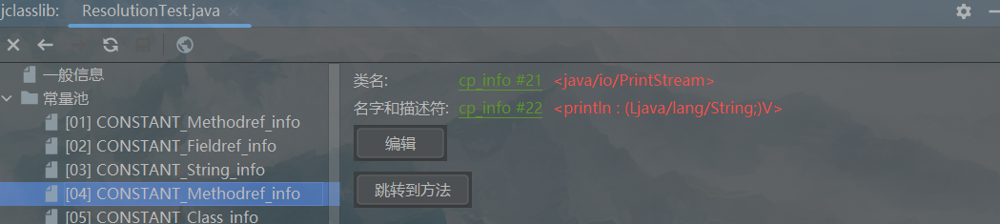
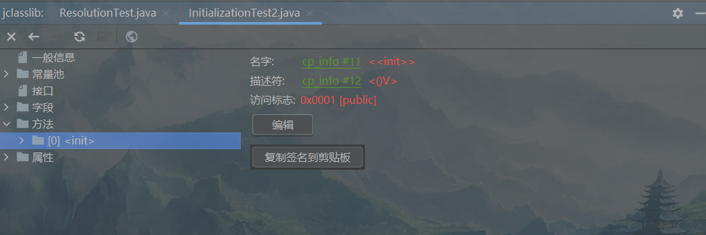
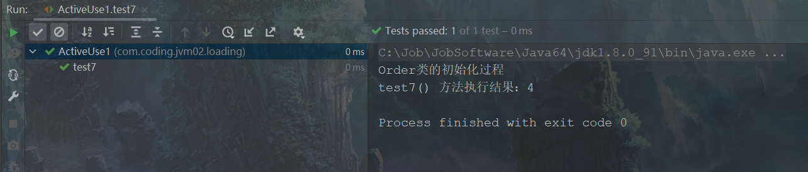
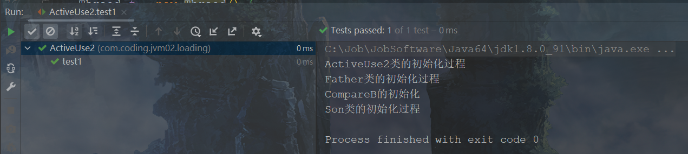

# 第19章 类的加载过程详解

​ 我们知道class文件是存放在磁盘上的，如果想要在JVM中使用class文件，需要将其加载至内存当中。前面我们已经讲解了class文件的结构，本章将详细介绍class文件加载到内存中的过程。


## 19.1 概述

​
在Java中数据类型分为基本数据类型和引用数据类型。基本数据类型由JVM预先定义，可以直接被用户使用，引用数据类型则需要执行类的加载才可以被用户使用。Java虚拟机规范中规定，class文件加载到内存，再到类卸载出内存会经历7个阶段，分别是加载、验证、准备、解析、初始化、使用和卸载，其中，验证、准备和解析3个阶段统称为链接(
Linking)，整个过程称为类的生命周期，如下图所示。

<div style="text-align:center;font-weight:bold;">类的生命周期</div>


## 19.2 加载(Loading)阶段

### 19.2.1 加载完成的操作

​
所谓加载，简而言之就是将Java类的class文件加载到机器内存中，并在内存中构建出Java类的原型，也就是类模板对象。所谓类模板对象，其实就是Java类在JVM内存中的一个快照，JVM将从class文件中解析出的常量池、类字段、类方法等信息存储到类模板对象中。JVM在运行期可以通过类模板对象获取Java类中的任意信息，能够访问Java类中的成员变量，也能调用Java方法，反射机制便是基于这一基础，如果JVM没有将Java类的声明信息存储起来，则JVM在运行期也无法使用反射。在加载类时，JVM必须完成以下3件事情。

(1)通过类的全名，获取类的二进制数据流。

(2)解析类的二进制数据流为方法区内的数据结构（Java类模型）。

(3)创建java.lang.Class类的实例，作为方法区中访问类数据的入口。

### 19.2.2 二进制流的获取方式

​ JVM可以通过多种途径产生或获得类的二进制数据流，下面列举了常见的几种方式。

(1)通过文件系统读入一个后缀为.class的文件（最常见）。

(2)读入jar、zip等归档数据包，提取类文件。

(3)事先存放在数据库中的类的二进制数据。

(4)使用类似于HTTP之类的协议通过网络加载。

(5)在运行时生成一段Class的二进制信息。

​ 在获取到类的二进制信息后，JVM就会处理这些数据，并最终转为一个java.lang.Class的实例。如果输入数据不是JVM规范的class文件的结构，则会抛出“ClassFormatError”异常。

### 19.2.3 类模型与Class实例的位置

**1 类模型的位置**

​ 加载的类在JVM中创建相应的类结构，类结构会存储在方法区中。

**2 Class实例的位置**

​
类加载器将class文件加载至方法区后，会在堆中创建一个Java.lang.Class对象，用来封装类位于方法区内的数据结构，<span style="color:#9400D3;">
该Class对象是在加载类的过程中创建的，每个类都对应有一个Class类型的对象</span>。类模型和Class实例的位置对应关系如下图所示。

<div style="text-align:center;font-weight:bold;">类模型和Class实例的位置</div>


​
外部可以通过访问代表Order类的Class对象来获取Order类的数据结构。java.lang.Class类的构造方法是私有的，只有JVM能够创建。java.lang.Class实例是访问类型元数据的入口，也是实现反射的关键数据。通过Class类提供的接口，可以获得目标类所关联的class文件中具体的数据结构、方法、字段等信息。如下代码所示，展示了如何通过java.lang.Class类获取方法信息。

<span style="color:#40E0D0;">案例1：通过Class类获取方法信息</span>

- 代码

```java
package com.coding.jvm02.loading;

import java.lang.reflect.Method;
import java.lang.reflect.Modifier;

/**
 * 过程一：加载阶段
 * <p>
 * 通过Class类，获得了java.lang.String类的所有方法信息，并打印方法访问标识符、描述符
 */
public class LoadingTest {
    public static void main(String[] args) {
        try {
            Class<?> clazz = Class.forName("java.lang.String");
            // 获取当前运行时类声明的所有方法
            Method[] ms = clazz.getDeclaredMethods();
            for (Method m : ms) {
                // 获取方法修饰符
                String mod = Modifier.toString(m.getModifiers());
                System.out.print(mod + " ");
                // 获取方法返回值类型
                String returnType = m.getReturnType().getSimpleName();
                System.out.print(returnType + " ");
                // 获取方法名
                System.out.print(m.getName() + "(");
                // 获取方法参数列表
                Class<?>[] ps = m.getParameterTypes();
                if (ps.length == 0) System.out.print(")");
                for (int i = 0; i < ps.length; i++) {
                    char end = (i == ps.length - 1) ? ')' : ',';
                    // 获取参数的类型
                    System.out.print(ps[i].getSimpleName() + end);
                }
                System.out.println();
            }
        } catch (ClassNotFoundException e) {
            throw new RuntimeException(e);
        }
    }
}
```

​ 通过上面的代码可以直接获取到String类的方法信息，运行结果如下，由于String类方法太多，只展示部分方法。

```bash
public boolean equals(Object)
public String toString()
public int hashCode()
public int compareTo(String)
public volatile int compareTo(Object)
......
```

### 19.2.4 数组类的加载

​ 创建数组类的情况稍微有些特殊，<span style="color:#9400D3;">
数组类由JVM在运行时根据需要直接创建，所以数组类没有对应的class文件，也就没有二进制形式，所以也就无法使用类加载器去创建数组类</span>
。但数组的元素类型仍然需要依靠类加载器去创建。创建数组类的过程如下。

(1)如果数组的元素类型是引用类型，那么就遵循定义的加载过程递归加载和创建数组的元素类型，JVM使用指定的元素类型和数组维度来创建新的数组类。

(2)如果数组的元素是基本数据类型，比如int类型的数组，由于基本数据类型是由JVM预先定义的，所以也不需要类加载，只需要关注数组维度即可。

​ 如果数组的元素类型是引用类型，数组类的可访问性就由元素类型的可访问性决定。否则数组类的可访问性将被缺省定义为public。

## 19.3 链接(Linking)阶段

### 19.3.1 链接阶段之验证(Verification)

​
类加载到机器内存后，就开始链接操作，验证是链接操作的第一步。验证的目的是保证加载的字节码是合法、合理并符合规范的。验证的步骤比较复杂，实际要验证的项目也很繁多，如下图所示，验证的内容涵盖了类数据信息的格式检查、语义检查、字节码验证、符号引用验证，其中格式检查会和加载阶段一起执行。<span style="color:#9400D3;">
验证通过之后，类加载器才会成功将类的二进制数据信息加载到方法区中。格式检查之外的验证操作将会在方法区中进行</span>
。如果不在链接阶段进行验证，那么class文件运行时依旧需要进行各种检查，虽然链接阶段的验证拖慢了加载速度，但是却提高了程序执行的速度，正所谓“磨刀不误砍柴工”。

<div style="text-align:center;font-weight:bold;">验证流程</div>


**1 格式检查**

​ 主要检查是否以魔数OxCAFEBABE开头，主版本和副版本号是否在当前JVM的支持范围内，数据中每一个项是否都拥有正确的长度等。

**2 语义检查**

​ JVM会进行字节码的语义检查，但凡在语义上不符合规范的，JVM也不会验证通过，比如JVM会检查下面4项语义是否符合规范。

(1)是否所有的类都有父类的存在（Object除外）。

(2)是否一些被定义为final的方法或者类被重写或继承了。

(3)非抽象类是否实现了所有抽象方法或者接口方法。

(4)是否存在不兼容的方法，比如方法的签名除了返回值不同，其他都一样。

**3 字节码验证**

​ JVM还会进行字节码验证，字节码验证也是验证过程中最为复杂的一个过程。它试图通过对字节码流的分析，判断字节码是否可以被正确地执行，比如JVM会验证字节码中的以下内容。

(1)在字节码的执行过程中，是否会跳转到一条不存在的指令。

(2)函数的调用是否传递了正确类型的参数。

(3)变量的赋值是不是给了正确的数据类型等。

(4)检查栈映射帧的局部变量表和操作数栈是否有着正确的数据类型。

​
遗憾的是，百分之百准确地判断一段字节码是否可以被安全执行是无法实现的，因此，该过程只是尽可能地检查出可以预知的明显的问题。如果在这个阶段无法通过检查，JVM也不会正确装载这个类。但是，如果通过了这个阶段的检查，也不能说明这个类是完全没有问题的。在前面3次检查中，已经排除了文件格式错误、语义错误以及字节码的不正确性。但是依然不能确保类是没有问题的。

**4 符号引用验证**

​
class文件中的常量池会通过字符串记录将要使用的其他类或者方法。因此，在验证阶段，JVM就会检查这些类或者方法是否存在，检查当前类是否有权限访问这些数据，如果一个需要使用的类无法在系统中找到，则会抛出“NoClassDefFoundError”错误，如果一个方法无法被找到，则会抛出“NoSuchMethodError”错误。注意，这个过程发生在链接阶段的解析环节。

### 19.3.2 链接阶段之准备(Preparation)

​ 当一个类验证通过时，JVM就会进入准备阶段。<span style="color:red;font-weight:bold;">
准备阶段主要负责为类的静态变量分配内存，并将其初始化为默认值</span>。JVM为各类型变量默认的初始值如下表所示。

<div style="text-align:center;font-weight:bold;">表19-1：静态变量默认初始值</div>


​ 各类型默认初始值以及占用大小。

| 类型        | 默认初始值    | 占用字节 |
|-----------|----------|------|
| byte      | (byte)0  | 1个字节 |
| short     | (short)0 | 2个字节 |
| int       | 0        | 4个字节 |
| long      | 0L       | 8个字节 |
| float     | 0.0f     | 4个字节 |
| double    | 0.0      | 8个字节 |
| char      | \u0000   | 2个字节 |
| boolean   | false    | 1个字节 |
| reference | null     | ---  |

​ Java并不直接支持boolean类型，对于boolean类型，内部实现是int,int的默认值是0，对应的boolean类型的默认值是false。

​ 注意，这个阶段不会为使用static
final修饰的基本数据类型初始化为0，因为final在编译的时候就会分配了，准备阶段会显式赋值。也不会为实例变量分配初始化，因为实例变量会随着对象一起分配到Java堆中。这个阶段并不会像初始化阶段（见19.4节）那样会有初始化或者代码被执行。如下代码展示了static
final修饰的基本数据类型不会被初始化为0。

<span style="color:#40E0D0;">案例1：准备阶段测试</span>

- 代码

```java
/**
 * 过程二：链接阶段
 * <p>
 * 基本数据类型：非final修饰的变量，在准备环节进行默认初始化赋值。 final修饰以后，在准备环节直接进行显式赋值。
 * <p>
 * 拓展：如果使用字面量的方式定义一个字符串的常量的话，也是在准备环节直接进行显式赋值。
 */
public class LinkingTest {
    // 定义静态变量id
    private static long id;
    // 定义静态常量num，并且赋值为1
    private static final int num = 1;
}
```

​ 查看该类的字节码字段属性，如下图所示。

<div style="text-align:center;font-weight:bold;">LinkingTest字段属性</div>


​
如果类字段的字段属性表中存在ConstantValue属性，那么在准备阶段该类字段value就会被显式赋值，也就是说在准备阶段，num的值是1，而不是0。仅被static修饰的类变量，在准备阶段初始化为默认值，默认值见表<span style="color:blue;font-weight:bold;">
表19-1：静态变量默认初始值</span>。

### 19.3.3 链接阶段之解析(Resolution)

​ 在准备阶段完成后，类加载进入解析阶段。解析阶段主要负责将类、接口、字段和方法的符号引用转为直接引用。

​
符号引用就是一些字面量的引用，和JVM的内部数据结构及内存布局无关。比如class文件中，常量池存储了大量的符号引用。在程序实际运行时，只有符号引用是不够的，比如当println()
方法被调用时，系统需要明确知道该方法的位置。

​
以方法为例，JVM为每个类都准备了一张方法表，将其所有的方法都列在表中，当需要调用一个类的方法的时候，只要知道这个方法在方法表中的偏移量就可以直接调用该方法。通过解析操作，符号引用就可以转变为目标方法在类中方法表中的位置，从而使得方法被成功调用。如下代码演示了方法在解析阶段的调用过程。

<span style="color:#40E0D0;">案例1:方法的解析阶段</span>

- 代码

```java
package com.coding.jvm02.loading;

public class ResolutionTest {
    public void print() {
        System.out.println("emon");
    }
}
```

​ 其对应的字节码如下。

```
0 getstatic #2 <java/lang/System.out : Ljava/io/PrintStream;>
3 ldc #3 <emon>
5 invokevirtual #4 <java/io/PrintStream.println : (Ljava/lang/String;)V>
8 return
```

​ invokevirtual #4 `<java/io/PrintStream.println>`方法的符号引用指向常量池中第四个选项，如下图所示。

<div style="text-align:center;font-weight:bold;">常量池项</div>



​ 方法调用的常量是类中方法的符号引用，包含类名和方法以及方法参数，解析阶段就是获取这些属性在内存中的地址，具体过程如下图所示，通过第4项常量找到第21项类名常量和第22项方法的名称描述符即可。

<div style="text-align:center;font-weight:bold;">方法解析</div>


## 19.4 初始化(Initialization)阶段

​ 类的初始化是类装载的最后一个阶段。如果前面的步骤都没有问题，那么表示类可以顺利装载到系统中，然后JVM才会开始执行Java字节码，也就是说到了初始化阶段，JVM才真正开始执行类中定义的Java程序代码。初始化阶段的重要工作是执行类的
`<clinit>`()方法（即类初始化方法），该方法仅能由Java编译器生成并被JVM调用，程序开发者无法自定义一个同名的方法，也无法直接在Java程序中调用该方法。
`<clinit>`()方法是由类静态成员的赋值语句以及static语句块合并产生的。通常在加载一个类之前，JVM总是会试图加载该类的父类，因此父类的
`<clinit>`()方法总是在子类`<clinit>`()
方法之前被调用，也就是说，父类的static语句块优先级高于子类，简要概括为<span style="color:#9400D3;font-weight:bold;">
由父及子，静态先行</span>。

​ Java编译器并不会为所有的类都产生`<clinit>`()方法。以下情况class文件中将不会包含`<clinit>`()方法。

(1)一个类中并没有声明任何的类变量，也没有静态代码块时。

(2)一个类中声明类变量，但是没有明确使用类变量的初始化语句以及静态代码块来执行初始化操作时。

(3)一个类中包含static final修饰的基本数据类型的字段，这些类字段初始化语句采用编译时常量表达式。

<span style="color:#40E0D0;">案例1：没有&lt;clinit&gt;()方法</span>

- 代码

```java
package com.coding.jvm02.loading;

/**
 * 过程三：初始化阶段
 * <p>
 * 哪些场景下，java编译器不会生成<clinit>()方法
 */
public class InitializationTest2 {
    // 场景1：一个类中并没有声明任何的类变量，也没有静态代码块时。
    public int num = 1;
    // 场景2：一个类中声明类变量，但是没有明确使用类变量的初始化语句以及静态代码块来执行初始化操作时。
    public static int num2;
    // 场景3：一个类中包含static final修饰的基本数据类型的字段，这些类字段初始化语句采用编译时常量表达式。
    public static final int num3 = 1;
}
```

​ 查看该类对应的方法信息，如下图所示，可以看到不存在`<clinit>`()方法。

<div style="text-align:center;font-weight:bold;">方法表</div>



### 19.4.1 static与final搭配

​ 在第19.3.2节中讲解了static与final定义的变量在准备阶段完成赋值，但是并不是所有的变量都在链接阶段的准备阶段完成赋值，下面通过代码案例说明不同情况下的不同阶段赋值，如下代码所示。

<span style="color:#40E0D0;">案例1：static与final搭配使用的不同阶段赋值</span>

- 代码

```java
package com.coding.jvm02.loading;

import java.util.Random;

/**
 * 过程三：初始化阶段
 * <p>
 * 说明：使用static+final修饰的字段的显式赋值的操作，到底是在哪个阶段进行的赋值？
 * 情况1：在链接阶段的准备环境赋值
 * 情况2：在初始化阶段赋值
 * <p>
 * 结论：
 * 在链接阶段的准备环节赋值的情况：
 * 1.对于基本数据类型的字段来说，如果使用static final修饰，则显式赋值（赋值常量，而非调用方法生成值）通常是在链接阶段的准备环节进行。
 * 2.对于String来说，如果使用字面量赋值，使用static final修饰的话，则显式赋值通常是在链接阶段的准备环节进行。
 * 在初始化阶段赋值：
 * 1.排除上述的在准备环节赋值的情况之外的情况。
 * <p>
 * 最终结论：使用static + final修饰，且显式赋值中不涉及到方法或构造器调用的基本数据类型或String类型的显式赋值，是在链接阶段的准备环节进行。
 */
public class InitializationTest3 {
    public static int a = 1; // 在初始化阶段赋值
    public static final int INT_CONSTANT = 10; // 在链接阶段的准备环境赋值

    public static final Integer INTEGER_CONSTANT1 = Integer.valueOf(100); // 在初始化阶段赋值
    public static Integer INTEGER_CONSTANT2 = Integer.valueOf(1000); // 在初始化阶段赋值

    public static final String s0 = "helloworld0"; // 在链接阶段的准备环境赋值
    public static final String s1 = new String("helloworld1"); // 在初始化阶段赋值
    public static String s2 = "helloworld2"; // 在初始化阶段赋值

    public static final int NUM1 = new Random().nextInt(10); // 在初始化阶段赋值
}
```

​ 对应字节码指令在`<clinit>`()方法中。

```
 0 iconst_1
 1 putstatic #2 <com/coding/jvm02/loading/InitializationTest3.a : I>
 4 bipush 100
 6 invokestatic #3 <java/lang/Integer.valueOf : (I)Ljava/lang/Integer;>
 9 putstatic #4 <com/coding/jvm02/loading/InitializationTest3.INTEGER_CONSTANT1 : Ljava/lang/Integer;>
12 sipush 1000
15 invokestatic #3 <java/lang/Integer.valueOf : (I)Ljava/lang/Integer;>
18 putstatic #5 <com/coding/jvm02/loading/InitializationTest3.INTEGER_CONSTANT2 : Ljava/lang/Integer;>
21 new #6 <java/lang/String>
24 dup
25 ldc #7 <helloworld1>
27 invokespecial #8 <java/lang/String.<init> : (Ljava/lang/String;)V>
30 putstatic #9 <com/coding/jvm02/loading/InitializationTest3.s1 : Ljava/lang/String;>
33 ldc #10 <helloworld2>
35 putstatic #11 <com/coding/jvm02/loading/InitializationTest3.s2 : Ljava/lang/String;>
38 new #12 <java/util/Random>
41 dup
42 invokespecial #13 <java/util/Random.<init> : ()V>
45 bipush 10
47 invokevirtual #14 <java/util/Random.nextInt : (I)I>
50 putstatic #15 <com/coding/jvm02/loading/InitializationTest3.NUM1 : I>
53 return
```

​ 从字节码指令中看到只有定义类成员变量a、INTEGER_CONSTANT1、INTEGER_CONSTANT2和s1、s2以及NUM1时是在初始化阶段的`<clinit>`()
方法中完成。那么另外两个类变量是怎么赋值的呢？通过jclasslib查看字段属性表，如下图所示，可以看到只有INT_CONSTANT和helloworld0两个常量拥有ConstantValue，说明INT_CONSTANT =
10和String s0="helloworld0"是在链接阶段的准备阶段完成的。

<div style="text-align:center;font-weight:bold;">字段属性表</div>


​    <span style="color:red;font-weight:bold;">
我们得出的结论就是，基本数据类型和String类型使用static和final修饰，并且显式赋值中不涉及方法或构造器调用，其初始化是在链接阶段的准备环节进行，其他情况都是在初始化阶段进行赋值。</span>

### 19.4.2 &lt;clinit&gt;()方法的线程安全性

​ 对于`<clinit>`()方法的调用，JVM会在内部确保其多线程环境中的安全性。JVM会保证一个类的`<clinit>`()
方法在多线程环境中被正确地加锁、同步，如果多个线程同时去初始化一个类，那么只会有一个线程去执行这个类的`<clinit>`()
方法，其他线程都需要阻塞等待，直到活动线程执行`<clinit>`()方法完毕。正是因为方法`<clinit>`()带锁线程安全的，如果在一个类的
`<clinit>`()方法中有耗时很长的操作，就可能造成多个线程阻塞，导致死锁，这种死锁是很难发现的，因为并没有可用的锁信息。如果之前的线程成功加载了类，则等在队列中的线程就没有机会再执行
`<clinit>`()方法了，当需要使用这个类时，JVM会直接返回给它已经准备好的信息。

### 19.4.3 类的初始化时机：主动使用和被动使用

​ 初始化阶段是执行类构造器`<clinit>`()方法的过程。虽然有些类已经存在`<clinit>`()方法，但是并不确定什么时候会触发执行，可以触发
`<clinit>`()方法的情景称为主动使用，不能触发`<clinit>`()方法执行的情景称为被动使用。主动使用可以触发类的初始化，被动使用不能触发类的初始化。

**1 主动使用**

​ JVM不会无条件地装载class文件，class文件只有在首次使用的时候才会被装载。JVM规定，一个类或接口在初次使用前，必须要进行初始化。这里的“使用”是指主动使用，主动使用包含下列几种情况。

(1)创建一个类的实例时，比如使用new关键字、反射、克隆或反序列化等方式创建实例。首先创建Order类，Order类中写了一段静态代码块，如下代码所示。

<span style="color:#40E0D0;">案例1：Order类</span>

- 代码

```java
class Order implements Serializable {
    private static final long serialVersionUID = -6166346450199490389L;

    static {
        System.out.println("Order类的初始化过程");
    }
}
```

​ 一个类被初始化的标志就是执行`<clinit>`()方法，查看Order类的`<clinit>`()方法，如下图所示，说明只要执行了静态代码块就表示执行了
`<clinit>`()方法，即Order类被初始化。

<div style="text-align:center;font-weight:bold;">Order类的&lt;clinit&gt;() </div>


​ 如下代码演示了new［test1()方法］关键字创建实例、反射［test2()方法］，以及反序列化［test3_1()
方法］都会调用类的初始化，代码中如果输出了Order类中对应的输出语句即表示执行了类的初始化。注意，案例中序列化［test3_0()
方法］的作用仅仅是将对象序列化为order.dat文件，为反序列化［test3_2()方法］做铺垫，虽然序列化［test3_1()
方法］也输出了Order类中的语句，这是因为new关键字调用了类的初始化，而不是序列化调用了类的初始化。

<span style="color:#40E0D0;">案例1：ActiveUse1类</span>

- 代码

```java
public class ActiveUse1 {
    // new 创建实例
    @Test
    public void test1() {
        Order order = new Order();
    }

    // 反射
    @Test
    public void test2() throws InstantiationException, IllegalAccessException, ClassNotFoundException {
        // Order.class.newInstance(); // 方式一
        Class clazz = Class.forName("com.coding.jvm02.loading.Order"); // 方式二
    }

    // 序列化
    @Test
    public void test3_0() throws IOException, ClassNotFoundException {
        try (ObjectOutputStream oos = new ObjectOutputStream(Files.newOutputStream(Paths.get("order.data")))) {
            oos.writeObject(new Order());
        }
    }

    // 反序列化
    @Test
    public void test3_1() throws IOException, ClassNotFoundException {
        try (ObjectInputStream ois = new ObjectInputStream(Files.newInputStream(Paths.get("order.data")))) {
            Object o = ois.readObject();
        }
    }

}
```

​ test1()、test2()、test3_1()方法的执行结果如下，表明使用new关键字、反射、反序列化等方式都会执行类的初始化。


(2)调用类的静态方法时，即当使用了字节码invokestatic指令时。

​ Order类中添加静态方法，如下所示。

```java
    public static void method() {
        System.out.println("Order method()...");
    }
```

​ ActiveUse1类中添加test4()方法用于调用类的静态方法，如下所示。

```java
    // 当调用类的静态方法时
    @Test
    public void test4() {
        Order.method();
    }
```

​ test4()方法执行结果如下，可以发现调用类的静态方法的时候也执行了类的初始化。


​    (3)使用类、接口的静态字段时（final修饰特殊考虑），字节码指令中使用了getstatic或者putstatic指令。

​ 在Order类中添加以下属性。

```java
    public static int num1 = 1;
    public static final int num2 = 2;
    public static final int num3 = new Random().nextInt(10);
```

​ 在ActiveUse1中增加如下测试方法。

```java
    @Test
    public void test5() {
        // 会主动使用
        System.out.println("test5() 方法执行结果：" + Order.num1);
    }

    @Test
    public void test6() {
        // 不会主动使用
        System.out.println("test6() 方法执行结果：" + Order.num2);
    }

    @Test
    public void test7() {
        // 会主动使用
        System.out.println("test7() 方法执行结果：" + Order.num3);
    }
```

​ test5()方法的执行结果如下所示。


​ test6()方法的执行结果如下所示。


​ test7()方法的执行结果如下所示。



​
从结果来看，当字段使用static修饰且没有使用final字段修饰时，如果使用该字段会触发类的初始化；当static和final同时修饰字段时，且该字段是一个固定值则不会触发类的初始化，因为该类型的字段在链接过程的准备阶段就已经被初始化赋值了，不需要类初始化以后才能使用，所以不会执行类的初始化；num3是因为在程序执行之前无法确定具体的数值，所以需要执行类的初始化以后才能继续执行。

​ 上面讲述了类的静态字段是否触发类的初始化，接下来再测试接口的静态字段是否会触发接口的初始化，创建CompareA接口如下代码所示。

<span style="color:#40E0D0;">案例1：创建CompareA接口</span>

- 代码

```java
interface CompareA {
    Thread t = new Thread() {
        {
            System.out.println("CompareA的初始化");
        }
    };
    int NUM1 = 1;
    int NUM2 = new Random().nextInt(10);
}
```

​ 查看CompareA中`<clinit>`()方法，如下图所示，可以看到如果创建了线程对象t并且里面的代码块语句输出则表示执行了`<clinit>`()
方法。

<div style="text-align:center;font-weight:bold;">Order类的&lt;clinit&gt;()</div>


​ 在ActiveUse2类中添加test8()和test9()方法用于测试接口的静态属性是否会触发类的初始化。

```java
    @Test
    public void test8() {
        // 不会主动使用
        int num1 = CompareA.NUM1;
    }

    @Test
    public void test9() {
        // 会主动使用
        int num2 = CompareA.NUM2;
    }
```

​ test8()方法执行结果如下。


​ test9()方法执行结果如下。


​ 可以看到接口的静态字段和类的静态不可变字段对类的初始化效果是一样的，需要注意的是接口的字段默认是由static
final修饰的，接口中没有字段是被static单独修饰的。

<span style="color:#40E0D0;">案例2：ActiveUse2类</span>

- 代码

```java
public class ActiveUse2 {
	// 当初始化子类时，如果发现其父类还没有进行过初始化，则需要先触发其父类的初始化
    // 在初始化一个类时，并不会先初始化它所实现的接口。
    // 如果一个接口定义了default方法，那么直接实现或者间接实现了该接口的类若初始化，该接口要在其之前被初始化
    @Test
    public void test1() {
        int num = Son.num;
    }

    // 在初始化一个接口时，并不会先初始化它的父接口。
    @Test
    public void test2() {
        int num2 = CompareC.NUM1;
    }
}

class Father {

    static {
        System.out.println("Father类的初始化过程");
    }
}

class Son extends Father implements CompareB {

    public static int num = 1;

    static {
        System.out.println("Son类的初始化过程");
    }
}

interface CompareB {
    Thread t = new Thread() {
        {
            System.out.println("CompareB的初始化");
        }
    };

    // 如果一个接口定义了default方法，那么直接实现或者间接实现了该接口的类若初始化，该接口要在其之前被初始化
    //    default void method1() {
    //        System.out.println("CompareB->method1()");
    //    }
}

interface CompareC extends CompareB {
    Thread t = new Thread() {
        {
            System.out.println("CompareC的初始化");
        }
    };

    int NUM2 = new Random().nextInt(10);
}
```

(4)初始化子类时，如果发现其父类还没有进行过初始化，则需要先触发其父类的初始化。<span style="color:red;font-weight:bold;">
JVM虚拟机初始化一个类时，要求它的所有父类都已经被初始化，但是这条规则并不适用于接口。在初始化一个类时，并不会先初始化它所实现的接口</span>
；在初始化一个接口时，并不会先初始化它的父接口。因此，一个父接口并不会因为它的子接口或者实现类的初始化而初始化。只有当程序首次使用特定接口的静态字段时，才会导致该接口的初始化，下面我们使用案例验证上述结论。

​ test1()方法执行结果如下，可以看到在Son类初始化之前执行了Father类的静态代码块，表示初始化子类时，需要先触发其父类的初始化。但也可以发现并没有执行父接口的初始化方法。


(5)如果一个接口定义了default方法，那么直接实现或者间接实现该接口的类在初始化之前需要实现接口的初始化。

​ 我们在接口CompareB中添加default修饰的方法method1()，如下所示。

```java
interface CompareB {
    Thread t = new Thread() {
        {
            System.out.println("CompareB的初始化");
        }
    };

    // 如果一个接口定义了default方法，那么直接实现或者间接实现了该接口的类若初始化，该接口要在其之前被初始化
    default void method1() {
        System.out.println("CompareB->method1()");
    }
}
```

​ 再次执行ActiveUse2类中的test1()方法，执行结果如下，从结果可知接口CompareB也执行了初始化。



(6)JVM启动时，用户需要指定一个要执行的主类［包含main()方法的那个类］,JVM会先初始化这个主类。这个类在调用main()
方法之前被链接和初始化，main()方法的执行将依次加载，链接和初始化后面需要使用到的类。

​ 在ActiveUse2类中添加静态代码块和main()方法，如下代码所示。

```java
public class ActiveUse2 {

    // 当初始化子类时，如果发现其父类还没有进行过初始化，则需要先触发其父类的初始化
    // 在初始化一个类时，并不会先初始化它所实现的接口。
    // 如果一个接口定义了default方法，那么直接实现或者间接实现了该接口的类若初始化，该接口要在其之前被初始化
    @Test
    public void test1() {
        int num = Son.num;
    }

    // 在初始化一个接口时，并不会先初始化它的父接口。
    @Test
    public void test2() {
        int num2 = CompareC.NUM1;
    }

    // 当虚拟机启动时，用户需要指定一个要执行的主类（包含 main() 方法的那个类），虚拟机会先初始化这个主类
    static {
        System.out.println("ActiveUse2类的初始化过程");
    }

    public static void main(String[] args) {
        System.out.println("main() 方法执行......");
    }

}
```

​ 执行main()方法，结果如下，从结果可知，在main()方法执行之前，先执行了该类的初始化。


**2 被动使用**

​ 除了以上的情况属于主动使用，其他的情况均属于被动使用。被动使用不会引起类的初始化。也就是说并不是在代码中出现的类，就一定会被加载或者初始化。如果不符合主动使用的条件，类就不会初始化。被动使用包含如以下几种情况。

(1)当访问一个静态字段时，只有真正声明这个字段的类才会被初始化。当通过子类引用父类的静态变量，不会导致子类初始化。

<span style="color:#40E0D0;">案例1：PassiveUse1</span>

- 代码

```java
public class PassiveUse1 {

    // 当通过子类引用父类的静态变量，不会导致子类初始化。
    @Test
    public void test1() {
        System.out.println(Child.num);
    }

    // 通过数组定义类引用，不会触发此类的初始化
    @Test
    public void test2() {
        Parent[] parents = new Parent[10];
        System.out.println(parents.getClass());
    }
    
    @Test
    public void test3() {
        Parent[] parents = new Parent[10];
        System.out.println(parents.getClass());
        parents[0] = new Parent(); // 会导致初始化
    }
}

class Parent {
    static {
        System.out.println("Parent的初始化过程");
    }

    public static int num = 1;
}

class Child extends Parent {
    static {
        System.out.println("Child的初始化过程");
    }
}
```

​ test1()方法执行结果如下，只执行了父类的初始化，没有执行子类的初始化。


(2)通过数组定义类引用，不会触发此类的初始化。

​ test2()方法执行结果如下.


​ 如果加入以下语句，则会执行类的初始化。

​ test3()方法执行结果如下。


<span style="color:#40E0D0;">案例2：PassiveUse2</span>

- 代码

```java
public class PassiveUse2 {


    // 引用常量不会触发此类或接口的初始化。因为常量在链接阶段的准备环节就已经被显式赋值了
    @Test
    public void test1() {
        int num = Person.NUM;
    }

    // 引用常量不会触发此类或接口的初始化。因为常量在链接阶段的准备环节就已经被显式赋值了
    @Test
    public void test2() {
        int num1 = SerialA.NUM1;
    }

    // 调用ClassLoader类的loadClass()方法加载一个类，并不是对类的主动使用，不会导致类的初始化
    @Test
    public void test3() throws ClassNotFoundException {
        ClassLoader.getSystemClassLoader().loadClass("com.coding.jvm02.loading.Person");
    }
}

class Person {
    static {
        System.out.println("Person类的初始化");
    }

    public static final int NUM = 1;
}

interface SerialA {
    Thread t = new Thread() {
        {
            System.out.println("SerialA的初始化");
        }
    };
    int NUM1 = 1;
}
```

(3)引用常量不会触发此类或接口的初始化，因为常量在链接阶段已经被显式赋值。

​ test1()执行结果，引用常量不会触发此类或接口的初始化。因为常量在链接阶段的准备环节就已经被显式赋值了。


​ test2()执行结果，引用常量不会触发此类或接口的初始化。因为常量在链接阶段的准备环节就已经被显式赋值了。


(4)调用ClassLoader类的loadClass()方法加载一个类，并不是对类的主动使用，不会导致类的初始化。

​ test3()执行结果，调用ClassLoader类的loadClass()方法加载一个类，并不是对类的主动使用，不会导致类的初始化。


## 19.5 类的使用(Using)

​
任何一个类在使用之前都必须经历过完整的加载、链接和初始化3个步骤。一旦一个类成功经历这3个步骤之后，便“万事俱备，只欠东风”，就等着开发者使用了。开发人员可以在程序中访问和调用它的静态类成员信息（比如静态字段、静态方法等），或者使用new关键字创建对象实例。

## 19.6 类的卸载(Unloading)

​ 和前面讲过对象的生命周期类似，对象在使用完以后会被垃圾收集器回收，那么对应的类在使用完成以后，也有可能被卸载掉。在了解类的卸载之前，需要先厘清类、类的加载器、类的Class对象和类的实例之间的引用关系。

**1 类、类的加载器、类的Class对象、类的实例之间的引用关系**

(1)类加载器和类的Class对象之间的关系。

​
在类加载器的内部实现中，用一个Java集合来存放所加载类的引用。另外，一个Class对象总是会引用它的类加载器，调用Class对象的getClassLoader()
方法，就能获得它的类加载器。由此可见，代表某个类的Class对象与该类的类加载器之间为双向关联关系。

(2)类、类的Class对象、类的实例对象之间的关系。

​ 一个类的实例总是引用代表这个类的Class对象。Object类中定义了getClass()
方法，这个方法返回代表实例所属类的Class对象的引用。此外，所有的Java类都有一个静态属性class，它引用代表这个类的Class对象。

**2 类的生命周期**

​
当类被加载、链接和初始化后，它的生命周期就开始了。当代表类的Class对象不再被引用，即不可触及时，Class对象就会结束生命周期，类在方法区内的数据也会被卸载，从而结束类的生命周期。一个类何时结束生命周期，取决于代表它的Class对象何时结束生命周期。

**3 案例**

​ 自定义一个类加载器MyClassLoader加载自定义类Order，那么就可以通过Order的Class对象获取到对应的类加载器，再通过Order类的实例对象获取到类Class对象，如下代码所示。

<span style="color:#40E0D0;">案例1：类、类的加载器、类的Class对象、类的实例之间的引用关系</span>

- 代码

```java
        // 通过类加载器加载Order类java.lang.Class对象
        MyClassLoader myLoader = new MyClassLoader("d:/");
        Class clazz = myLoader.loadClass("Order");
        // 获取java.lang.Class对象
        Class<Order> orderClass = Order.class;
        // 获取类加载器
        ClassLoader classLoader = orderClass.getClassLoader();
        // 通过实例对象获取java.lang.Class对象
        Order order = new Order();
        Class<? extends Order> aClass = order.getClass();
```

​ 类、类的加载器、类的Class对象、类的实例之间的引用关系如下图所示。

<div style="text-align:center;font-weight:bold;">类、类的加载器、类的Class对象类的实例之间的引用关系</div>


​
myLoader变量和order变量间接引用代表Order类的Class对象，而orderClass变量则直接引用代表Order类的Class对象。如果程序运行过程中，将上图左侧三个引用变量都置为null，此时Order对象结束生命周期，myLoader对象结束生命周期，代表Order类的Class对象也结束生命周期，Order类在方法区内的二进制数据被卸载。当再次有需要时，会检查Order类的Class对象是否存在，如果存在会直接使用，不再重新加载；如果不存在Order类会被重新加载，在JVM的堆区会生成一个新的代表Order类的Class实例。

**4 类的卸载**

​ 通过上面的案例可以知道当类对象没有引用时，可能会产生类的卸载，类的卸载需要满足如下三个条件。

(1)该类所有的实例已经被回收。

(2)加载该类的类加载器的实例已经被回收。

(3)该类对应的Class对象没有在任何地方被引用。

​
但是需要注意，并不是所有类加载器下面的类都可以被卸载，Java自带的三种类加载器的实例是不可以被卸载的，所以它们加载的类在整个运行期间是不可以被卸载的，只有被开发者自定义的类加载器实例加载的类才有可能被卸载。一个已经加载的类被卸载的概率很小，至少被卸载的时间是不确定的。开发者在开发代码的时候，不应该对虚拟机的类卸载做任何假设，在此前提下，再来实现系统中的特定功能。

**5 回顾：方法区的垃圾回收**

​ 方法区的垃圾收集主要回收两部分内容，分别是常量池中废弃的常量和不再使用的类。HotSpot虚拟机对常量池的回收策略是很明确的，只要常量池中的常量没有被任何地方引用，就可以被回收。

​ JVM判定一个常量是否“废弃”还相对简单，而要判定一个类是否属于“不再被使用的类”的条件就比较苛刻了，需要同时满足下面三个条件。

(1)该类所有的实例都已经被回收。也就是Java堆中不存在该类及其任何派生子类的实例。

(2)加载该类的类加载器已经被回收。这个条件除非是经过精心设计的可替换类加载器的场景，如OSGi、JSP的重加载等，否则通常是很难达成的。

(3)该类对应的java.lang.Class对象没有在任何地方被引用，无法在任何地方通过反射访问该类的方法。

​ 上述三个条件并不是JVM卸载无用类的必要条件，JVM可以卸载类也可以不卸载类，不会像对象那样没有引用就肯定回收。