# 第20章 类加载器

​	前面的章节讲解了类的装载过程，其中第一个阶段是加载环节。在Java语言中，实现该环节的工具就是类加载器(ClassLoader)。本章将详细介绍类加载器的相关知识。

## 20.1 概述

​	类加载器从文件系统或者网络中加载class文件到JVM内部，至于class文件是否可以运行，则由执行引擎决定，类加载器将加载的类信息存放到方法区。类加载器在整个装载阶段，只能影响到类的加载，而无法改变类的链接和初始化行为。它最早出现在Java 1.0版本中，当时主要为了满足Java Applet应用的需要，虽然目前JavaApplet应用极少，但类加载器并没有随之消失不见，相反类加载器在OSGi、热部署等领域依然应用广泛。这主要是因为JVM没有将所有的类加载器绑定在JVM内部，这样做的好处就是能够更加灵活和动态地执行类加载操作。


### 20.1.1 类加载的分类

​	类的加载分为显式加载和隐式加载两种类型。显式加载指的是在代码中通过类加载器的方法加载class对象，如直接使用Class.forName(name)或this.getClass().getClassLoader().loadClass()加载class对象。隐式加载则是不直接在代码中调用类加载器的方法加载class文件，而是通过JVM自动加载到内存中，如在加载某个类的class文件时，该类的class文件中引用了另外一个类的对象，此时额外引用的类将通过JVM自动加载到内存中。在日常开发中以上两种方式一般会混合使用。

### 20.1.2 类加载器的必要性

​	一般情况下，Java开发人员并不需要在程序中显式地使用类加载器，但是了解类加载器的加载机制却显得至关重要。主要原因有以下几个方面。

(1)避免在开发中遇到java.lang.ClassNotFoundException异常或java.lang.NoClassDefFoundError异常时手足无措。

(2)只有了解类加载器的加载机制，才能够在出现异常的时候快速地根据错误异常日志定位并解决问题。

(3)需要支持类的动态加载或需要对编译后的class文件进行加解密操作时，就需要与类加载器打交道。

(4)开发人员可以在程序中编写自定义类加载器来重新定义类的加载规则，以便实现一些自定义的处理逻辑。

### 20.1.3 命名空间

​	对于任意一个类，都需要<span style="color:red;font-weight:bold;">由加载它的类加载器和这个类本身一同确认其在JVM中的唯一性</span>。每个类加载器都有自己的命名空间，<span style="color:red;font-weight:bold;">命名空间由该类加载器及所有的父类加载器组成</span>，在同一命名空间中，不会出现类的完整名字（包括类的包名）相同的两个类；在不同的命名空间中，有可能会出现类的完整名字（包括类的包名）相同的两个类；在大型应用中，我们往往借助这一特性，来运行同一个类的不同版本。

### 20.1.4 类加载机制的基本特征

​	通常类加载机制有三个基本特征，分别是双亲委派模型、可见性和单一性。

**1 双亲委派模型**

​	如果一个类加载器在接到加载类的请求时，它首先不会自己尝试去加载这个类，而是把这个请求任务委托给父类加载器去完成，依次递归，如果父类加载器可以完成类加载任务，就成功返回。只有父类加载器无法完成此加载任务时，才自己去加载。详细讲解见20.6节。

**2 可见性**

​	子类加载器可以访问父类加载器加载的类型，但是反过来是不允许的。不然，因为缺少必要的隔离，就没有办法利用类加载器去实现容器的逻辑。

**3 单一性**

​	由于父类加载器的类型对于子类加载器是可见的，所以父类加载器中加载过的类型，就不会在子加载器中重复加载。但是注意，同一个类仍然可以被同级别的类加载器加载多次，因为互相并不可见。

## 20.2 类加载器分类

​	JVM支持两种类型的类加载器，分别为启动类加载器(Bootstrap ClassLoader)和自定义类加载器(User-Defined ClassLoader)。从概念上来讲，自定义类加载器一般指的是程序中由开发人员自定义的一类类加载器，但是Java虚拟机规范却没有这么定义，而是将所有派生于抽象类ClassLoader的类加载器都划分为自定义类加载器。无论类加载器的类型如何划分，在程序中我们最常见的类加载器结构如下图所示，其中扩展类加载器和应用程序类由抽象类ClassLoader派生而来。

<div style="text-align:center;font-weight:bold;">类加载器结构</div>

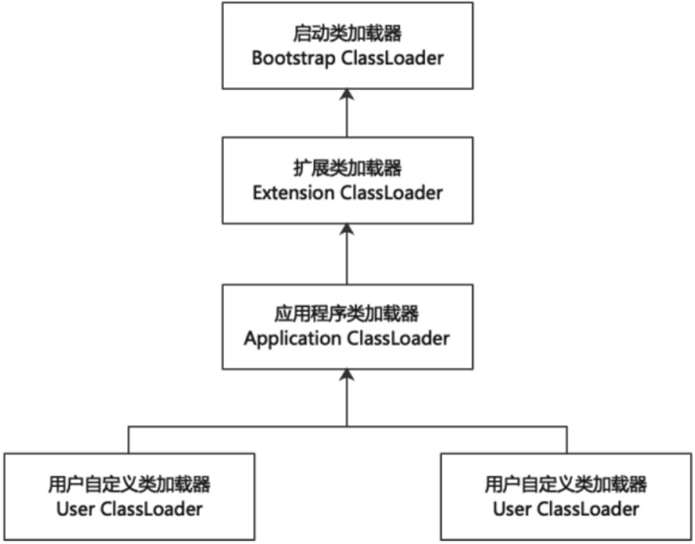

​	<span style="color:#9400D3;font-weight:bold;">除了顶层的启动类加载器，其余的类加载器都应当有自己的“父类”加载器。不同类加载器看似是继承关系，实际上是聚合关系</span>。在下层加载器中，包含着上层加载器的引用，也就是说应用程序类加载器并不是扩展类加载器的子类。如下代码所示，展示了类加载器直接的包含关系，定义了ParentClassLoader和ChildClassLoader两个类继承抽象类ClassLoader。习惯上把ChildClassLoader称为子类加载器，ParentClassLoader称为父类加载器，但是它们之间并不是继承关系，而是在构造子类的时候以参数的形式传入ParentClassLoader而已，在实例化ChildClassLoader时，构造器形参使用ParentClassLoader实例进行赋值，给属性初始化。虽然说法上称为父类加载器，但是却不是继承关系，大家需要注意这一点。

<span style="color:#40E0D0;">案例1：类加载器的包含关系</span>

- 代码

```java
/**
 * 类加载器的包含关系
 */
public abstract class ClassLoader {
    private final ClassLoader parent; // 父类加载器
    protected ClassLoader(ClassLoader parent) {
        this(checkCreateClassLoader(), parent);
    }
}

class ParentClassLoader extends ClassLoader {
    public ParentClassLoader(ClassLoader parent) {
        super(parent);
    }
}

class ChildClassLoader extends ParentClassLoader {
    public ChildClassLoader(ClassLoader parent) {
        // parent = new ParentClassLoader();
        super(parent);
    }
}
```

### 20.2.1 引导类加载器

​	引导类加载器（BootstrapClassLoader，又称启动类加载器）使用C/C++语言实现，嵌套在JVM内部。引导类加载器不继承java.lang.ClassLoader，没有父类加载器。出于安全考虑，引导类加载器主要用来加载Java的核心库，也就是“JAVA_HOME/jre/lib/rt.jar”或“<span style="color:#FF1493;font-weight:bold;">sun.boot.class.path</span>”路径下的内容，指定为扩展类和应用程序类加载器的父类加载器。使用-XX:+TraceClassLoading参数可以得到类加载器加载了哪些类，注意该参数只能得到所有加载器加载的全部类文件，不能得到各个加载器加载了什么类。查看引导类加载器加载的类文件，如下代码所示。

<span style="color:#40E0D0;">案例1：引导类加载器加载范围</span>

- 代码

```java
package com.coding.jvm02.classloader;

/**
 * 查看引导类加载器加载范围
 */
public class BootStrapClassLoaderTest {
    public static void main(String[] args) {
        String pathBoot = System.getProperty("sun.boot.class.path");
        System.out.println("BootStrapClassLoader 加载范围 开始 --------");
        System.out.println(pathBoot.replaceAll(";", System.lineSeparator()));
        System.out.println("BootStrapClassLoader 加载范围 结束 --------");
    }
}
```

​	运行结果如下。

```
BootStrapClassLoader 加载范围 开始 --------
C:\Job\JobSoftware\Java64\jdk1.8.0_91\jre\lib\resources.jar
C:\Job\JobSoftware\Java64\jdk1.8.0_91\jre\lib\rt.jar
C:\Job\JobSoftware\Java64\jdk1.8.0_91\jre\lib\sunrsasign.jar
C:\Job\JobSoftware\Java64\jdk1.8.0_91\jre\lib\jsse.jar
C:\Job\JobSoftware\Java64\jdk1.8.0_91\jre\lib\jce.jar
C:\Job\JobSoftware\Java64\jdk1.8.0_91\jre\lib\charsets.jar
C:\Job\JobSoftware\Java64\jdk1.8.0_91\jre\lib\jfr.jar
C:\Job\JobSoftware\Java64\jdk1.8.0_91\jre\classes
BootStrapClassLoader 加载范围 结束 --------
```

​	引导类加载器加载了如上路径的类文件。

### 20.2.2 扩展类加载器

​	扩展类加载器(ExtensionClassLoader)由Java语言编写，该类的全路径名为sun.misc.Launcher$ExtClassLoader,ExtClassLoader是Launcher类的内部类，间接继承于ClassLoader类，父类加载器为启动类加载器，类的继承关系如下图所示。扩展类加载器主要负责从<span style="color:#FF1493;font-weight:bold;">java.ext.dirs</span>系统属性所指定的目录或者JDK的安装目录的jre/lib/ext子目录下加载类库。如果用户创建的类放在上述目录下，也会自动由扩展类加载器加载。简言之扩展类加载器主要负责加载Java的扩展库。

<div style="text-align:center;font-weight:bold;">扩展类加载器继承关系</div>

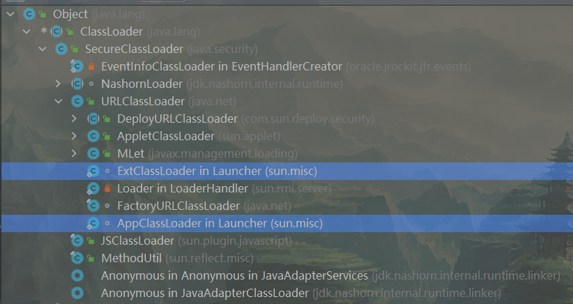

​	查看扩展加载器加载的类文件，如下代码所示。

<span style="color:#40E0D0;">案例1：扩展类加载器加载范围</span>

- 代码

```java
package com.coding.jvm02.classloader;

/**
 * 查看扩展类加载器加载范围
 */
public class ExtClassLoaderTest {
    public static void main(String[] args) {
        String pathExt = System.getProperty("java.ext.dirs");
        System.out.println("ExtClassLoader 加载范围 开始 --------");
        System.out.println(pathExt.replaceAll(";", System.lineSeparator()));
        System.out.println("ExtClassLoader 加载范围 结束 --------");
    }
}
```

​	运行结果如下。

```
ExtClassLoader 加载范围 开始 --------
C:\Job\JobSoftware\Java64\jdk1.8.0_91\jre\lib\ext
C:\Windows\Sun\Java\lib\ext
ExtClassLoader 加载范围 结束 --------
```

​	扩展类加载器加载了如上路径的类文件，如下所示。

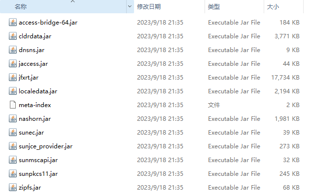

### 20.2.3 应用程序类加载器

​	应用程序类加载器(AppClassLoader)和扩展类加载器一样也是由Java语言编写，该类的全路径名为sun.misc.Launcher$AppClassLoader，间接继承于ClassLoader类，父类加载器为扩展类加载器，应用程序类加载器也称系统类加载器。它负责加载环境变量classpath或系统属性<span style="color:#FF1493;font-weight:bold;">java.class.path</span>指定路径下的类库，应用程序中的类加载器默认是应用程序类加载器。它是用户自定义类加载器的默认父类加载器，通过ClassLoader的getSystemClassLoader()方法可以获取到该类加载器。查看应用类加载器加载的类文件，如下代码所示。

<span style="color:#40E0D0;">案例1：应用类加载器加载范围</span>

- 代码

```java
package com.coding.jvm02.classloader;

/**
 * 查看应用类加载器加载范围
 */
public class AppClassLoaderTest {
    public static void main(String[] args) {
        String pathApp = System.getProperty("java.class.path");
        System.out.println("AppClassLoader 加载范围 开始 --------");
        System.out.println(pathApp.replaceAll(";", System.lineSeparator()));
        System.out.println("AppClassLoader 加载范围 结束 --------");
    }
}
```

​	运行结果如下。

```
AppClassLoader 加载范围 开始 --------
C:\Job\JobSoftware\Java64\jdk1.8.0_91\jre\lib\charsets.jar
C:\Job\JobSoftware\Java64\jdk1.8.0_91\jre\lib\deploy.jar
C:\Job\JobSoftware\Java64\jdk1.8.0_91\jre\lib\ext\access-bridge-64.jar
C:\Job\JobSoftware\Java64\jdk1.8.0_91\jre\lib\ext\cldrdata.jar
C:\Job\JobSoftware\Java64\jdk1.8.0_91\jre\lib\ext\dnsns.jar
C:\Job\JobSoftware\Java64\jdk1.8.0_91\jre\lib\ext\jaccess.jar
C:\Job\JobSoftware\Java64\jdk1.8.0_91\jre\lib\ext\jfxrt.jar
C:\Job\JobSoftware\Java64\jdk1.8.0_91\jre\lib\ext\localedata.jar
C:\Job\JobSoftware\Java64\jdk1.8.0_91\jre\lib\ext\nashorn.jar
C:\Job\JobSoftware\Java64\jdk1.8.0_91\jre\lib\ext\sunec.jar
C:\Job\JobSoftware\Java64\jdk1.8.0_91\jre\lib\ext\sunjce_provider.jar
C:\Job\JobSoftware\Java64\jdk1.8.0_91\jre\lib\ext\sunmscapi.jar
C:\Job\JobSoftware\Java64\jdk1.8.0_91\jre\lib\ext\sunpkcs11.jar
C:\Job\JobSoftware\Java64\jdk1.8.0_91\jre\lib\ext\zipfs.jar
C:\Job\JobSoftware\Java64\jdk1.8.0_91\jre\lib\javaws.jar
C:\Job\JobSoftware\Java64\jdk1.8.0_91\jre\lib\jce.jar
C:\Job\JobSoftware\Java64\jdk1.8.0_91\jre\lib\jfr.jar
C:\Job\JobSoftware\Java64\jdk1.8.0_91\jre\lib\jfxswt.jar
C:\Job\JobSoftware\Java64\jdk1.8.0_91\jre\lib\jsse.jar
C:\Job\JobSoftware\Java64\jdk1.8.0_91\jre\lib\management-agent.jar
C:\Job\JobSoftware\Java64\jdk1.8.0_91\jre\lib\plugin.jar
C:\Job\JobSoftware\Java64\jdk1.8.0_91\jre\lib\resources.jar
C:\Job\JobSoftware\Java64\jdk1.8.0_91\jre\lib\rt.jar
C:\Job\JobResource\IdeaProjects\backend-jvm-learning\jvm-02-classloader\target\classes
C:\Job\JobResource\local-repository\junit\junit\4.6\junit-4.6.jar
C:\Job\JobResource\local-repository\org\projectlombok\lombok\1.18.30\lombok-1.18.30.jar
C:\Job\JobSoftware\JetBrains\IntelliJ IDEA 2022.1.3\lib\idea_rt.jar
AppClassLoader 加载范围 结束 --------
```

​	从结果可以看出，一部分内容是由扩展类加载器加载的，这是因为IntelliJ IDEA工具中的CLASSPATH值如下图所示，所以应用程序类加载器的加载范围才会输出下面的结果。

<div style="text-align:center;font-weight:bold;">IntelliJ IDEA工具的CLASSPATH</div>


​	而直接在命令行中编译执行时，应用程序类加载器的加载路径就是环境变量CLASSPATH的值，如下图所示，运行结果表示只加载当前路径下的类文件。

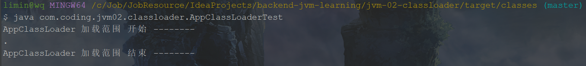

### 20.2.4 自定义类加载器

​	在Java的日常应用程序开发中，类的加载几乎是由前面讲解的3种类加载器相互配合执行的。必要时，还可以自定义类加载器来定制类的加载方式。体现Java语言强大生命力和巨大魅力的关键因素之一便是Java开发者可以自定义类加载器来实现类库的动态加载，加载源可以是本地的JAR包，也可以是网络上的远程资源。以下是自定义类加载器的好处。

(1)插件机制。

​	通过类加载器可以实现非常绝妙的插件机制，这方面的实际应用案例不胜枚举。例如，著名的OSGi组件框架，再如Eclipse的插件机制。类加载器为应用程序提供了一种动态增加新功能的机制，这种机制无须重新打包发布应用程序就能实现。

(2)隔离加载类。

​	在某些框架内进行中间件与应用的模块隔离，把类加载到不同的环境中。比如Tomcat这类Web应用服务器，内部自定义了好几种类加载器，用于隔离同一个Web应用服务器上的不同应用程序。再比如两个模块依赖某个类库的不同版本，如果分别被不同的类加载器加载，就可以互不干扰。

(3)修改类加载的方式。

​	类的加载模型并非强制，除引导类加载器外，其他的类加载器并非一定要引入，或者根据实际情况在某个时间点进行按需进行动态加载。

(4)扩展加载源。

​	应用需要从不同的数据源获取类定义信息，例如网络数据源，而不是本地文件系统。或者是需要自己操纵字节码，动态修改或者生成类型。

(5)提高程序安全性。

​	在一般情况下，使用不同的类加载器去加载不同的功能模块，会提高应用程序的安全性。但是，如果涉及Java类型转换，则加载器反而容易产生不美好的事情。在做Java类型转换时，只有两个类型都是由同一个加载器所加载，才能进行类型转换，否则转换时会发生异常。

​	用户通过定制自己的类加载器，可以重新定义类的加载规则，以便实现一些自定义的处理逻辑。

## 20.3 获取不同的类加载器

​	每个对象都会包含一个定义它的类加载器的一个引用。获取类加载器的途径方式如下表所示。

<div style="text-align:center;font-weight:bold;">多种获取类加载器方式</div>

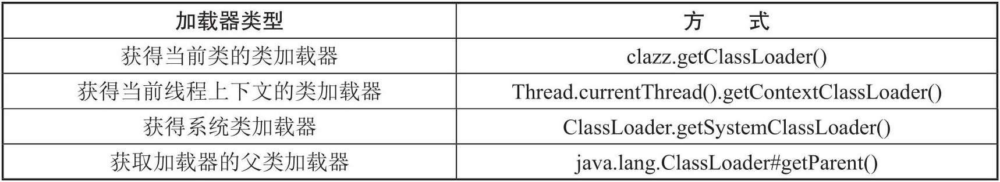

​	具体操作如下代码所示。

<span style="color:#40E0D0;">案例1：获取类加载器</span>

- 代码

```java
package com.coding.jvm02.classloader;

public class ClassLoaderTest {
    public static void main(String[] args) {
        // 获取当前类的类加载器 sun.misc.Launcher$AppClassLoader@18b4aac2
        ClassLoader classLoader = ClassLoaderTest.class.getClassLoader();
        System.out.println("获取当前类的类加载器=" + classLoader);
        // 获取当前线程的上下文加载器 sun.misc.Launcher$AppClassLoader@18b4aac2
        ClassLoader contextClassLoader = Thread.currentThread().getContextClassLoader();
        System.out.println("获取当前线程的上下文加载器=" + contextClassLoader);
        // 获取系统类加载器 sun.misc.Launcher$AppClassLoader@18b4aac2
        ClassLoader systemClassLoader = ClassLoader.getSystemClassLoader();
        System.out.println("获取系统类加载器=" + systemClassLoader);
        // 获取扩展类加载器 sun.misc.Launcher$ExtClassLoader@14ae5a5
        ClassLoader extClassLoader = systemClassLoader.getParent();
        System.out.println("获取扩展类加载器=" + extClassLoader);
        // 获取引导类加载器 null
        ClassLoader bootstrapClassLoader = extClassLoader.getParent();
        System.out.println("获取引导类加载器=" + bootstrapClassLoader);
    }
}
```

​	运行结果如下。

```
获取当前类的类加载器=sun.misc.Launcher$AppClassLoader@18b4aac2
获取当前线程的上下文加载器=sun.misc.Launcher$AppClassLoader@18b4aac2
获取系统类加载器=sun.misc.Launcher$AppClassLoader@18b4aac2
获取扩展类加载器=sun.misc.Launcher$ExtClassLoader@14ae5a5
获取引导类加载器=null
```

​	需要注意的是，引导类加载器结果为null，原因是引导类加载器是C++语言编写，并不是一个java对象，所以这里用null展示。

​	数组类的Class对象，不是由类加载器创建的，而是在Java运行期JVM根据需要自动创建的。数组类的类加载器可以通过Class.getClassLoader()方法返回，如果数组元素是引用数据类型，类加载器与数组当中元素类型相同，如果数组元素类型是基本数据类型，数组类没有类加载器，如下代码所示。

<span style="color:#40E0D0;">案例2：获取数组类加载器</span>

- 代码

```java
package com.coding.jvm02.classloader;

public class ClassLoaderTest {
    public static void main(String[] args) {
        // String类使用引导类加载器进行加载的 ---> Java的核心类库都是使用引导类加载器进行加载的
        ClassLoader stringClassLoader = String.class.getClassLoader();
        System.out.println(stringClassLoader); // null
        try {
            ClassLoader stringForNameClassLoader = Class.forName("java.lang.String").getClassLoader();
            System.out.println(stringForNameClassLoader); // null
        } catch (ClassNotFoundException e) {
            e.printStackTrace();
        }


        // 关于数组类型的加载：使用的类加载器与元素的类加载器相同
        String[] strArr = new String[6];
        System.out.println(strArr.getClass()); // class [Ljava.lang.String;
        System.out.println(strArr.getClass().getClassLoader()); // null 表示使用的是引导类加载器

        ClassLoaderTest[] arr = new ClassLoaderTest[6]; // class [Lcom.coding.jvm02.classloader.ClassLoaderTest;
        System.out.println(arr.getClass());
        System.out.println(arr.getClass().getClassLoader()); // sun.misc.Launcher$AppClassLoader@18b4aac2 表示使用的是系统类加载器

        int[] arr2 = new int[6];
        System.out.println(arr2.getClass().getClassLoader()); // null 表示没有类加载器
    }
}

```

​	运行结果如下。

```
null
null
class [Ljava.lang.String;
null
class [Lcom.coding.jvm02.classloader.ClassLoaderTest;
sun.misc.Launcher$AppClassLoader@18b4aac2
null
```

​	前2个null，表示String等Java的核心类库都是使用引导类加载器进行加载的。

​	后面2个null中，第一个null表示引导类加载器，第二个null表示当数组中元素为基本数据类型时，结果也为null，但是第二个null表示的含义是没有类加载器，而不是引导类加载器。

## 20.4 类加载器源码解析

​	前面我们多次提到了抽象类java.lang.ClassLoader，该类在类加载中起着至关重要的作用，除了引导类加载器之外，其他的类加载器都需要继承它，所以对该类的源码学习就显得尤为重要。ClassLoader与JVM提供的类加载器关系如下图所示。

<div style="text-align:center;font-weight:bold;">类加载器关系图</div>


​	从上图中可以看到ClassLoader类位于所有类加载器的顶层，20.3节讲述了通过ClassLoader.getSystemClassLoader()来获得系统类加载器，下面讲述其获取过程。

(1)通过ClassLoader.getSystemClassLoader()进入源码分析，如下所示。

```java
public static void main(String[] args) {
    // 1. 获取 classLoader 的方法
    ClassLoader systemClassLoader = ClassLoader.getSystemClassLoader();
}
```

(2)进入getSystemClassLoader()方法，如下所示，其中需要重点关注initSystemClassLoader()方法。

```java
    @CallerSensitive
    public static ClassLoader getSystemClassLoader() {
        initSystemClassLoader();
        if (scl == null) {
            return null;
        }
        SecurityManager sm = System.getSecurityManager();
        if (sm != null) {
            checkClassLoaderPermission(scl, Reflection.getCallerClass());
        }
        return scl;
    }
```

(3)initSystemClassLoader()方法的作用是对应用程序类加载器进行初始化，代码如下。

```java
	// 初始化系统加载器，包括初始化父类加载器
	private static synchronized void initSystemClassLoader() {
        // boolean类型的静态变量，标记是否被初始化了，解决并发问题
        if (!sclSet) {
            if (scl != null)
                throw new IllegalStateException("recursive invocation");
            // 获取 Launcher 类实例，加载器都是它的内部类，直接去看 Launcher 源码
            sun.misc.Launcher l = sun.misc.Launcher.getLauncher();
            if (l != null) {
                Throwable oops = null;
                // scl为classLoader内部的缓存静态变量，存储系统类加载器
                scl = l.getClassLoader();
                try {
                    // 是否用户指定了默认的加载类 System.getProperty("java.system.class.loader")
                    scl = AccessController.doPrivileged(
                        new SystemClassLoaderAction(scl));
                } catch (PrivilegedActionException pae) {
                    oops = pae.getCause();
                    if (oops instanceof InvocationTargetException) {
                        oops = oops.getCause();
                    }
                }
                if (oops != null) {
                    if (oops instanceof Error) {
                        throw (Error) oops;
                    } else {
                        // wrap the exception
                        throw new Error(oops);
                    }
                }
            }
            // 初始化完毕
            sclSet = true;
        }
    }
```

​	通过获取Launcher类实例的代码直接跳转到Launcher类的源码，如下。

```java
// Launcher的部分源代码
public class Launcher {
    private static URLStreamHandlerFactory factory = new Factory();
    private static Launcher launcher = new Launcher();
    private static String bootClassPath = System.getProperty("sun.boot.class.path");
    // 定义类加载器
    private ClassLoader loader;
    private static URLStreamHandler fileHandler;
	// 返回类加载器
    public static Launcher getLauncher() {
        return launcher;
    }
    
    // 构造方法
    public Launcher() {
        // 1.创建ExtClassLoader
        ExtClassLoader var1;
        try {
            var1 = Launcher.ExtClassLoader.getExtClassLoader();
        } catch (IOException var10) {
            throw new InternalError("Could not create extension class loader", var10);
        }

        // 2.用ExtClassLoader作为parent去创建AppClassLoader
        try {
            this.loader = Launcher.AppClassLoader.getAppClassLoader(var1);
        } catch (IOException var9) {
            throw new InternalError("Could not create application class loader", var9);
        }

        // 3.设置AppClassLoader为ContextClassLoader
        Thread.currentThread().setContextClassLoader(this.loader);
		// ......
    }
	// 定义内部类扩展类加载器ExtClassLoader
    static class ExtClassLoader extends URLClassLoader {
        public static ExtClassLoader getExtClassLoader() throws IOException {
            final File[] var0 = getExtDirs();
            return new ExtClassLoader(var0);
        }
        public ExtClassLoader(File[] var1) throws IOException {
            super(getExtURLs(var1), (ClassLoader)null, Launcher.factory);
        }
        private static File[] getExtDirs() {
            String var0 = System.getProperty("java.ext.dirs");
            File[] var1;
            ......
            return var1;
        }
    }
    // 定义内部类系统类加载器AppClassLoader
    static class AppClassLoader extends URLClassLoader {
        public static ClassLoader getAppClassLoader(final ClassLoader var0) throws IOException {
            final String var1 = System.getProperty("java.class.path");
            final File[] var2 = var1 == null ? new File[0] : Launcher.getClassPath(var1);
            URL[] var1x = var1 == null ? new URL[0] : Launcher.pathToURLs(var2);
            return new AppClassLoader(var1x, var0);
        }
        AppClassLoader(URL[] var1, ClassLoader var2) {
            super(var1, var2, Launcher.factory);
        }
        public Class<?> loadClass(String var1, boolean var2) throws ClassNotFoundException {
            int var3 = var1.lastIndexOf(46);
            if (var3 != -1) {
                SecurityManager var4 = System.getSecurityManager();
                if (var4 != null) {
                    var4.checkPackageAccess(var1.substring(0, var3));
                }
            }
            return super.loadClass(var1, var2);
        }
    }
```

​	Launcher源码里定义了static类型的扩展类加载器ExtClassLoader和static类型的系统类加载器AppClassLoader。

​	如下面代码所示，在ExtClassLoader构造器里，并没有指定parent，或者说ExtClassLoader的parent为null。因为ExtClassLoader的parent是BootstrapLoader，而BootstrapLoader不存在于Java API里，只存在于JVM里，我们是看不到的，所以请正确理解“ExtClassLoader的parent为null”的含义。

```java
        public ExtClassLoader(File[] var1) throws IOException {
            super(getExtURLs(var1), (ClassLoader)null, Launcher.factory);
        }
```

​	如下面代码所示，在AppClassLoader构造器里有了parent。实例化AppClassLoader的时候，传入的parent就是一个ExtClassLoader实例。

```java
        AppClassLoader(URL[] var1, ClassLoader var2) {
            super(var1, var2, Launcher.factory);
        }
```

​	Launcher的构造方法如下。

```java
    // 构造方法
    public Launcher() {
        // 1.创建ExtClassLoader
        ExtClassLoader var1;
        try {
            var1 = Launcher.ExtClassLoader.getExtClassLoader();
        } catch (IOException var10) {
            throw new InternalError("Could not create extension class loader", var10);
        }

        // 2.用ExtClassLoader作为parent去创建AppClassLoader
        try {
            this.loader = Launcher.AppClassLoader.getAppClassLoader(var1);
        } catch (IOException var9) {
            throw new InternalError("Could not create application class loader", var9);
        }

        // 3.设置AppClassLoader为ContextClassLoader
        Thread.currentThread().setContextClassLoader(this.loader);
		// ......
    }
```

​	首先，实例化ExtClassLoader，从java.ext.dirs系统变量里类加载路径，也说明了为什么扩展类加载器加载的路径是java.ext.dirs，如下。

```java
        private static File[] getExtDirs() {
            // 这里说明了为什么扩展类加载器加载的路径是“java.ext.dirs”
            String var0 = System.getProperty("java.ext.dirs");
            File[] var1;
            if (var0 != null) {
                StringTokenizer var2 = new StringTokenizer(var0, File.pathSeparator);
                int var3 = var2.countTokens();
                var1 = new File[var3];

                for(int var4 = 0; var4 < var3; ++var4) {
                    var1[var4] = new File(var2.nextToken());
                }
            } else {
                var1 = new File[0];
            }

            return var1;
        }
```

​	通过ExtClassLoader作为parent去实例化AppClassLoader，从java.class.path系统变量里获得类加载路径，如下所示。

```java
        public static ClassLoader getAppClassLoader(final ClassLoader var0) throws IOException {
			// 应用类加载器获取加载目录
            final String var1 = System.getProperty("java.class.path");
            final File[] var2 = var1 == null ? new File[0] : Launcher.getClassPath(var1);
            return (ClassLoader)AccessController.doPrivileged(new PrivilegedAction<AppClassLoader>() {
                public AppClassLoader run() {
                    URL[] var1x = var1 == null ? new URL[0] : Launcher.pathToURLs(var2);
                    return new AppClassLoader(var1x, var0);
                }
            });
        }
```

​	最终Launcher getClassLoader()返回的就是AppClassLoader。以上便是获取类加载器源码的分析。

### 20.4.1 ClassLoader的主要方法

​	抽象类ClassLoader的主要方法（内部没有抽象方法）如下。

1、public final ClassLoader getParent()

​	该方法作用是返回该类加载器的父类加载器

2、public Class`<?>`loadClass(String name)throws ClassNotFoundException

​	该方法作用是加载名称为name的类，返回结果为java.lang.Class类的实例。如果找不到类，则抛出“ClassNotFoundException”异常。该方法中的逻辑就是双亲委派模型（见20.6节）的实现，该方法详细解析如下。

```java
	// resolve:true-加载class的同时进行解析操作。
	protected Class<?> loadClass(String name, boolean resolve)
        throws ClassNotFoundException
    {
        // 同步操作，保证只能加载一次。
        synchronized (getClassLoadingLock(name)) {
            // 首先，在缓存中判断是否已经加载同名的类。
            // First, check if the class has already been loaded
            Class<?> c = findLoadedClass(name);
            if (c == null) {
                long t0 = System.nanoTime();
                try {
                    // 获取当前类加载器的父类加载器。
                    if (parent != null) {
                        // 如果存在父类加载器，则调用父类加载器进行类的加载
                        c = parent.loadClass(name, false);
                    } else {
                        // parent为null：父类加载器是引导类加载器
                        c = findBootstrapClassOrNull(name);
                    }
                } catch (ClassNotFoundException e) {
                    // ClassNotFoundException thrown if class not found
                    // from the non-null parent class loader
                }

                // 当前类加载器的父类加载器未加载此类或者当前类加载器未加载此类
                if (c == null) {
                    // If still not found, then invoke findClass in order
                    // to find the class.
                    long t1 = System.nanoTime();
                    // 调用当前ClassLoader的findClass()
                    c = findClass(name);

                    // this is the defining class loader; record the stats
                    sun.misc.PerfCounter.getParentDelegationTime().addTime(t1 - t0);
                    sun.misc.PerfCounter.getFindClassTime().addElapsedTimeFrom(t1);
                    sun.misc.PerfCounter.getFindClasses().increment();
                }
            }
            if (resolve) { // 是否进行解析操作
                resolveClass(c);
            }
            return c;
        }
    }
}
```

​	可以发现调用类加载方法时，先从缓存中查找该类对象，如果存在直接返回；如果不存在则交给当前类加载器的父类加载器去加载，最终交给引导类加载器去加载该类。如果还没有找到则调用findClass()方法，关于findClass()方法稍后介绍。

3、protected Class`<?>`findClass(String name)throwsClassNotFoundException

​	上面讲了loadClass(String name,boolean resolve)方法中会调用findClass(name)方法作为兜底逻辑。该方法作用是查找二进制名称为name的类，返回结果为java.lang.Class类的实例。这是一个受保护的方法，<span style="color:#FF1493;font-weight:bold;">JVM建议自定义类加载器的时候重写此方法使得自定义类加载器遵循双亲委托机制</span>，该方法会在检查完父类加载器之后被loadClass()方法调用。

​	在JDK1.2之前，在自定义类加载时，总会去继承ClassLoader类并重写loadClass()方法，从而实现自定义的类加载类。但是在JDK1.2之后已不再建议用户去覆盖loadClass()方法，而是建议把自定义的类加载逻辑写在findClass()方法中。从前面的分析可知，findClass()方法是在loadClass()方法中被调用的，当loadClass()方法中父类加载器加载失败后，则会调用自己的findClass()方法来完成类加载，这样就可以保证自定义的类加载器也符合双亲委托模型。

​	需要注意的是ClassLoader类中并没有实现findClass()方法的具体代码逻辑，取而代之的是抛出ClassNotFoundException异常，同时应该知道的是<span style="color:#9400D3;font-weight:bold;">findClass()方法通常是和defineClass()方法一起使用的</span>。

4、protected final Class`<?>`defineClass(String name,byte [] b,int off,int len)

​	该方法作用是根据给定的字节数组b转换为Class的实例，off和len参数表示实际Class信息在byte数组中的位置和长度，其中字节数组b是ClassLoader从外部获取的。这是受保护的方法，只有在自定义ClassLoader子类中可以使用。

​	defineClass()方法是用来将字节流解析成JVM能够识别的Class对象（ClassLoader中已实现该方法逻辑），通过这个方法不仅能够通过class文件实例化Class对象，也可以通过其他方式实例化Class对象，如通过网络接收一个类的字节码，然后转换为byte字节流创建对应的Class对象。

​	defineClass()方法通常与findClass()方法一起使用，一般情况下，在自定义类加载器时，会直接覆盖ClassLoader的findClass()方法并编写加载规则，取得要加载类的字节码后转换成流，然后调用defineClass()方法生成类的Class对象，使用举例如下。

```java
protected Class<?> findClass(String name) throws ClassNotFoundException {
    // 获取类的字节数组
    byte[] classData = getClassData(name);
    if (classData == null) {
        throw new ClassNotFoundException();
    } else {
        // 使用 defineClass 生成 class 对象
        return defineClass(name, classData, 0, classData.length);
    }
}
```

5、protected final void resolveClass(Class`<?>`c)

​	<span style="color:#FF1493;font-weight:bold;">该方法作用是链接指定的一个Java类。使用该方法可以使用类的Class对象创建完成的同时也被解析</span>。前面我们说链接阶段主要是对字节码进行验证，为类变量分配内存并设置初始值同时将class文件中的符号引用转换为直接引用。

6、protected final Class`<?>`findLoadedClass(String name)

​	该方法作用是查找名称为name的已经被加载过的类，返回结果为java.lang.Class类的实例。这个方法是final()方法，无法被修改。

​	此外，ClassLoader中还声明有一个重要的成员变量，该变量表示一个ClassLoader的实例，这个字段所表示的ClassLoader也称为这个ClassLoader的双亲。在类加载的过程中，ClassLoader可能会将某些请求交予自己的双亲处理。


### 20.4.2 SecureClassLoader与URLClassLoader

​	从加载器关系图20-4中可以看出，类SecureClassLoader扩展了ClassLoader，该类中新增了几个与使用相关的代码源（对代码源的位置及其证书的验证）和权限定义类验证（主要指对class源码的访问权限）的方法，一般我们不会直接跟这个类打交道，更多是与它的子类URLClassLoader有所关联。

​	前面说过，ClassLoader是一个抽象类，很多方法是空的没有实现，比如findClass()、findResource()等。而URLClassLoader这个实现类为这些方法提供了具体的实现，并新增了URLClassPath类协助取得Class字节码流等功能。在编写自定义类加载器时，如果没有太过于复杂的需求，可以直接继承URLClassLoader类，这样就可以避免自己去编写findClass()方法及其获取字节码流的方式，使自定义类加载器编写更加简洁，下图展示了URLClassLoader类的类图关系。

<div style="text-align:center;font-weight:bold;">URLClassLoader类的类图关系</div>

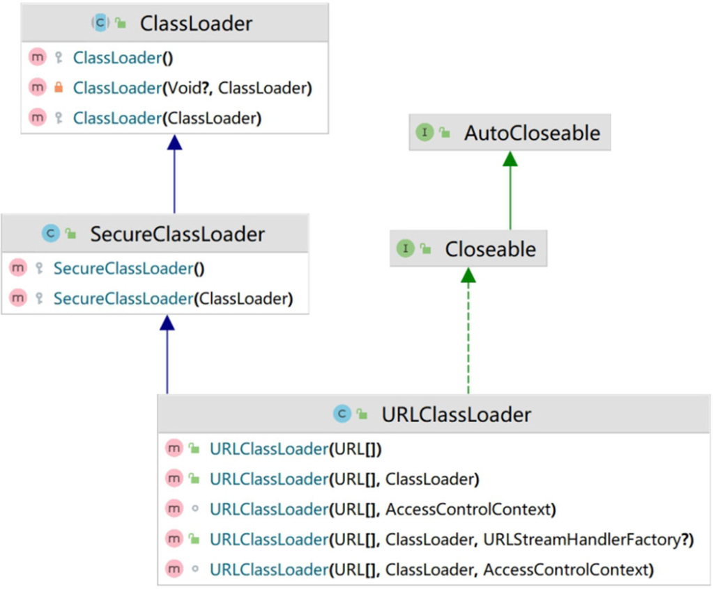


### 20.4.3 ExtClassLoader与AppClassLoader

​	了解完URLClassLoader后接着看剩余的两个类加载器，即拓展类加载器ExtClassLoader和应用程序类加载器AppClassLoader，这两个类都继承自URLClassLoader，是sun.misc.Launcher的静态内部类。sun.misc.Launcher主要被系统用于启动主应用程序，ExtClassLoader和AppClassLoader都是由sun.misc.Launcher创建的，其主要类结构如下图所示。

<div style="text-align:center;font-weight:bold;">ExtClassLoader和AppClassLoader的类结构</div>

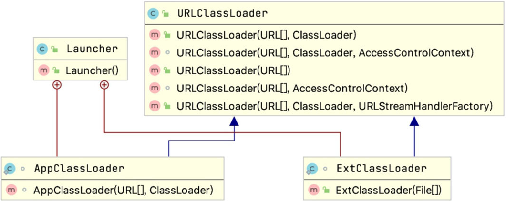

​	可以发现ExtClassLoader并没有重写loadClass()方法，这足以说明其遵循双亲委派模式，而AppClassLoader重载了loadClass()方法，但最终调用的还是父类loadClass()方法，因此依然遵守双亲委派模式。本小节没有对这些类的源码进行详细的解析，重点是弄清楚类与类间的关系和常用的方法，同时搞清楚双亲委派模式的实现过程，为编写自定义类加载器做铺垫。

### 20.4.4 Class.forName()与ClassLoader.loadClass()

​	Class.forName()是一个静态方法，最常用的是Class.forName(StringclassName);根据传入的类的全限定名返回一个Class对象。<span style="color:#FF1493;font-weight:bold;">该方法在将class文件加载到内存的同时会执行类的初始化</span>［即调用〈clinit〉()方法］，如Class.forName("com.coding.HelloWorld")。

​	ClassLoader.loadClass()是一个实例方法，需要一个ClassLoader对象来调用该方法。<span style="color:#FF1493;font-weight:bold;">该方法将class文件加载到内存时不会执行类的初始化，直到这个类第一次使用时才进行初始化</span>。该方法因为需要得到一个ClassLoader对象，所以可以根据需要指定使用哪个类加载器，使用格式为“ClassLoadercl=.......;cl.loadClass(“com.coding.HelloWorld”);”。

## 20.5 如何自定义类加载器

​	Java提供了抽象类java.lang.ClassLoader，所有用户自定义的类加载器都应该继承ClassLoader类。前面讲了在自定义ClassLoader子类的时候，常见的有两种做法，即重写loadClass()方法或者重写findClass()方法，重写findClass()方法是比较推荐的方式。

​	这两种方法本质上差不多，毕竟loadClass()也会调用findClass()，但是从逻辑上讲最好不要直接修改loadClass()的内部逻辑，建议的做法是只在findClass()里重写自定义类的加载方法，根据参数指定类的名字，返回对应的Class对象的引用。loadClass()这个方法是实现双亲委派模型逻辑的地方，擅自修改这个方法会导致模型被破坏，容易造成问题。因此最好是在双亲委派模型框架内进行小范围的改动，不破坏原有的稳定结构。同时，也避免了自己重写loadClass()方法的过程中必须写双亲委托的重复代码，从代码的复用性来看，不直接修改这个方法始终是比较好的选择。当编写好自定义类加载器后，便可以在程序中调用loadClass()方法来实现类加载操作。<span style="color:#9400D3;font-weight:bold;">需要注意的是自定义类加载器的父类加载器是应用程序类加载器</span>。

1、创建自定义类加载器MyClassLoader，如下代码所示，重写findClass()方法即可。

<span style="color:#40E0D0;">案例1：自定义类加载器</span>

- 代码

```java
package com.coding.jvm02.hotswap;

import java.io.ByteArrayOutputStream;
import java.io.FileInputStream;
import java.io.IOException;
import java.nio.ByteBuffer;
import java.nio.channels.Channels;
import java.nio.channels.FileChannel;
import java.nio.channels.WritableByteChannel;

public class MyClassLoader extends ClassLoader {
    private String rootDir;

    public MyClassLoader(String rootDir) {
        this.rootDir = rootDir;
    }

    @Override
    protected Class<?> findClass(String className) {
        Class clazz = this.findLoadedClass(className);
        if (null == clazz) {
            // 获取字节码文件的完整路径
            String classFile = getClassFile(className);
            // 获取输入输出流
            try (FileInputStream fis = new FileInputStream(classFile); FileChannel fileChannel = fis.getChannel();
                 ByteArrayOutputStream baos = new ByteArrayOutputStream(); WritableByteChannel outChannel = Channels.newChannel(baos)) {
                ByteBuffer byteBuffer = ByteBuffer.allocateDirect(1024);
                while (true) {
                    int i = fileChannel.read(byteBuffer);
                    if (i == 0 || i == -1) {
                        break;
                    }
                    byteBuffer.flip(); // 修改为读数据模式
                    outChannel.write(byteBuffer);
                    byteBuffer.clear(); // 清空，切换为写模式
                }

                byte[] bytes = baos.toByteArray();
                // 调用defineClass()，将字节数组的数据转换为Class的实例
                clazz = defineClass(null, bytes, 0, bytes.length);
            } catch (IOException e) {
                e.printStackTrace();
            }
        }
        return clazz;
    }

    private String getClassFile(String className) {
        return rootDir + "\\" + className.replace('.', '\\') + ".class";
    }
}
```

​	需要注意的是，自定义类加载器在调用clazz =defineClass(className,bytes,0,bytes.length)方法的过程中，如果传入className类的全路径名称，比如Demo1的全路径名称为com.coding.java1.Demo1，根据双亲委派模型可知，该类会通过sun.misc.Launcher$AppClassLoader类加载器加载。如果想让自定义类加载器加载类Demo1，需要在defineClass(className,bytes,0,bytes.length)方法中的className传入null，并且调用findClass方法的时候传入类名，不需要传入全路径名称，即传入Demo1即可。

​	使用自定义类加载器加载Demo1类，如下代码所示。

<span style="color:#40E0D0;">案例1：自定义类加载器测试代码</span>

- 代码

```java
package com.coding.jvm02.hotswap;

public class MyClassLoaderTest {
    public static void main(String[] args) {
        MyClassLoader myClassLoader = new MyClassLoader("D:");
        try {
            Class<?> clazz = myClassLoader.loadClass("Demo1");
            System.out.println("加载此类的类的加载器为：" + clazz.getClassLoader().getClass().getName());
            System.out.println("加载此类的类加载的父加载器为：" + clazz.getClassLoader().getParent().getClass().getName());
            System.out.println("加载此类的类加载的父加载器的父加载器为：" + clazz.getClassLoader().getParent().getParent().getClass().getName());
        } catch (ClassNotFoundException e) {
            throw new RuntimeException(e);
        }
    }
}
```

​	输出结果如下。

```
加载此类的类的加载器为：com.coding.jvm02.hotswap.MyClassLoader
加载此类的类加载的父加载器为：sun.misc.Launcher$AppClassLoader
加载此类的类加载的父加载器的父加载器为：sun.misc.Launcher$ExtClassLoader
```

## 20.6 双亲委派模型

### 20.6.1 定义与本质

​	类加载器用来把类文件加载到JVM内存中。从JDK1.2版本开始，类的加载过程采用双亲委派模型，这种机制能更好地保证Java平台的安全。

**1 双亲委派定义**

​	如果一个类加载器在接到加载类的请求时，它首先不会自己尝试去加载这个类，而是把这个请求任务委托给父类加载器去完成，依次递归，如果父类加载器可以完成类加载任务，就成功返回。只有父类加载器无法完成此加载任务时，才自己去加载，下图所示。

<div style="text-align:center;font-weight:bold;">双亲委派加载顺序图</div>

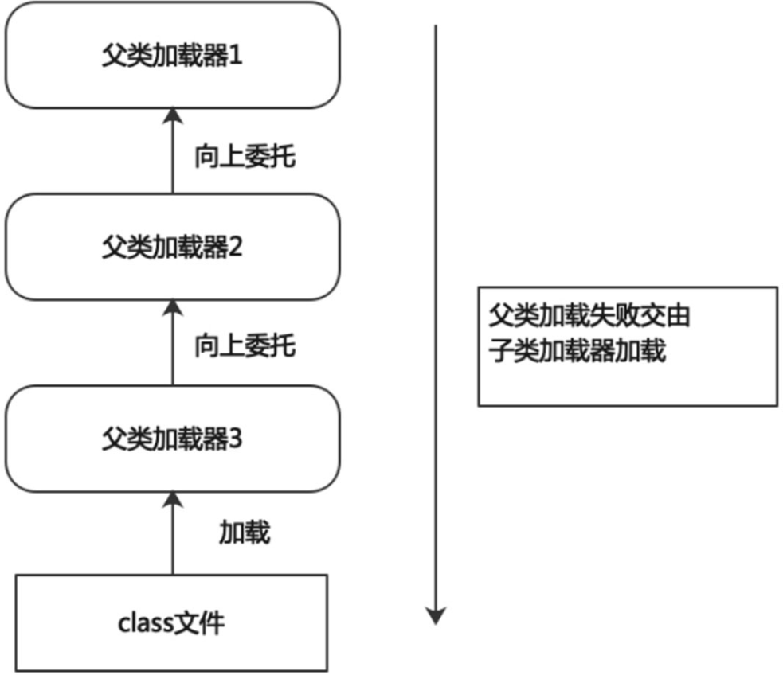

**2 双亲委派本质**

​	规定了类加载的顺序。首先是引导类加载器先加载，若加载不到，由扩展类加载器加载，若还加载不到，才会由应用程序类加载器或自定义的类加载器进行加载，如下图所示。

<div style="text-align:center;font-weight:bold;">双亲委派加载顺序图</div>

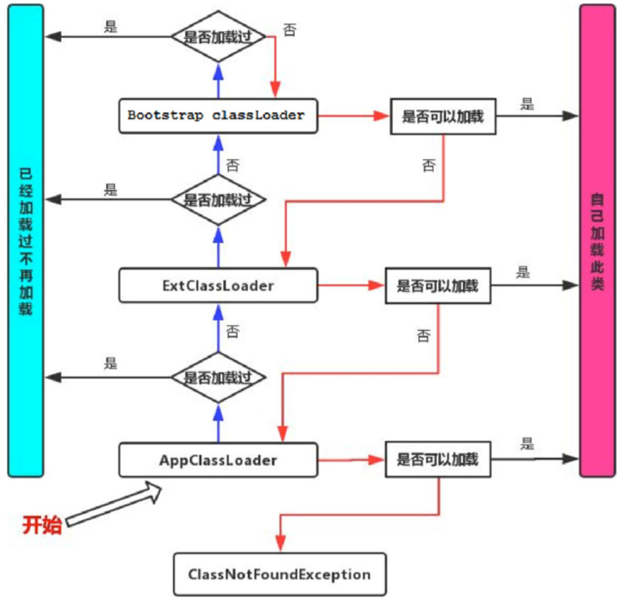

### 20.6.2 双亲委派模型的优势与劣势

​	下面我们谈谈双亲委派模型的优势与劣势。

**1 双亲委派模型优势**

​	避免类的重复加载，确保一个类的全局唯一性，Java类随着它的类加载器一起具备了一种带有优先级的层次关系，通过这种层级关系可以避免类的重复加载，当父类加载器已经加载了该类时，子类加载器就没有必要再加载一次。这样做可以保护程序安全，防止核心API被随意篡改，比如JVM不允许定义一个java.lang.String的类，会出现java.lang.SecurityException，类加载器会做安全检查。

**2 代码支持**

​	双亲委派模型在java.lang.ClassLoader.loadClass(String,boolean)接口中体现。20.4.1节已经详细讲过了，这里再整理一下具体流程。该接口的逻辑如下。

1、在当前加载器的缓存中查找有无目标类，如果有，直接返回。

2、判断当前加载器的父类加载器是否为空，如果不为空，则调用parent.loadClass(name,false)接口进行加载。

3、反之，如果当前加载器的父类加载器为空，则调用findBootstrapClassOrNull(name)接口，让引导类加载器进行加载。

4、如果通过以上3条路径都没能成功加载，则调用findClass(name)接口进行加载。该接口最终会调用java.lang.ClassLoader接口的defineClass系列的native接口加载目标Java类。

​	假设当前加载的是java.lang.Object这个类，很显然，该类属于JDK中核心得不能再核心的一个类，因此一定只能由引导类加载器进行加载。当JVM准备加载java.lang.Object时，JVM默认会使用应用程序类加载器去加载，按照上面4步加载的逻辑，在第1步从系统类的缓存中肯定查找不到该类，于是进入第2步。由于从应用程序类加载器的父类加载器是扩展类加载器，于是扩展类加载器继续从第1步开始重复。由于扩展类加载器的缓存中也一定查找不到该类，因此进入第2步，最终通过引导类加载器进行加载。

​	需要注意的是如果在自定义的类加载器中重写java.lang.ClassLoader#loadClass(String)或java.lang.ClassLoader#loadClass(String,boolean)方法，抹去其中的双亲委派机制，仅保留上面这4步中的第1步与第4步。虽然可以这样操作，但是这样却不能加载核心类库，因为JDK还为核心类库提供了一层保护机制，不管是自定义的类加载器，还是应用程序类加载器抑或扩展类加载器，最终都必须调用java.lang.ClassLoader#defineClass(String,byte[],int,int,ProtectionDomain)方法，该方法会执行java.lang.ClassLoader#preDefineClass()方法，该方法中提供了对JDK核心类库的保护。

**3 双亲委派模型劣势**
检查类加载的委派过程是否为单向的，这个方式虽然从结构上说比较清晰，使各个类加载器的职责非常明确，但同时会带来一个问题，即顶层的类加载器无法访问底层的类加载器所加载的类。

​	通常情况下，启动类加载器中的类为系统核心类，包括一些重要的系统接口，而在应用类加载器加载的类为应用类。按照这种模式，应用类访问系统类自然是没有问题，但是系统类访问应用类就会出现问题。比如在<span style="color:#FF00FF;font-weight:bold;">系统类中提供了一个接口，该接口需要在应用类中实现，该接口还绑定一个工厂方法，用于创建该接口的实例，而接口和工厂方法都在启动类加载器中。这时，就会出现该工厂方法无法创建由应用类加载器加载的应用实例的问题</span>。所以Java虚拟机规范并没有明确要求类加载器的加载机制一定要使用双亲委派模型，只是建议采用这种方式而已，比如在Tomcat中，类加载器所采用的加载机制就和传统的双亲委派模型有一定区别，当缺省的类加载器接收到一个类的加载任务时，首先会由它自行加载，当它加载失败时，才会将类的加载任务委派给它的超类加载器去执行，这同时也是Servlet规范推荐的一种做法。

### 20.6.3 破坏双亲委派模型

​	双亲委派模型并不是一个具有强制性约束的模型，而是Java设计者推荐给开发者的类加载器实现方式。在Java的世界中大部分的类加载器都遵循这个模型，但也有例外的情况，如下所示，注意破坏双亲委派模型并不一定就是一件坏事，如果有特殊需求，完全可以主动破坏双亲委派模型。

**1 破坏双亲委派机制一**
重写loadClass()方法破坏双亲委派模型，我们前面讲过双亲委派模型就是通过这个方法实现的，这个方法可以指定类通过什么加载器来加载，所以如果我们改写它的规则，就相当于打破了双亲委派模型。重写这个方法以后就能自己定义使用什么加载器了，也可以自定义加载委派机制。<span style="color:#FF00FF;font-weight:bold;">其实JDK在早期版本中已经发生过一次破坏了，双亲委派模型是在JDK 1.2之后引入的，但是类加载器的概念和抽象类java.lang.ClassLoader在Java的第一个版本中就已经存在</span>，面对已经存在的用户自定义类加载器的代码，Java设计者们引入双亲委派模型时不得不做出一些妥协，为了兼容这些已有代码，无法再以技术手段避免loadClass()被子类覆盖的可能性，只能在JDK1.2之后的java.lang.ClassLoader中添加一个新的protected方法findClass(),findClass()方法就是为了让开发人员在自定义类加载器的时候不要重写loadclass()方法以免破坏双亲委派模型，但是loadClass()方法比双亲委派模型出现得早，有很多程序已经重写了loadClass()方法，这已经是没有办法避免的事情了。

**2 破坏双亲委派机制二**
双亲委派模型有一定的局限性，父类加载器无法访问子类加载器路径中的类。<span style="color:#FF00FF;font-weight:bold;">双亲委派模型最典型的不适用场景就是SPI的使用，Java中所有涉及SPI的加载动作基本都采用这种方式，例如JNDI、JDBC等。所以提供了一种线程上下文类加载器，能够使父类加载器调用子类加载器进行加载</span>。

​	<span style="color:#9400D3;font-weight:bold;">简单来说就是接口定义在了启动类加载器中，而实现类定义在了其他类加载器中，当启动类加载器需要加载其他子类加载器路径中的类时，需要使用线程上下文类加载器（默认是应用程序类加载器），这样以上下文加载器为中介，使得启动类加载器中的代码也可以访问应用类加载器中的类</span>。比如Java中的核心jar包rt.jar，该包下面的类是由引导类加载器加载的，但是如果rt.jar包想要访问jdbc.jar中的类该怎么办呢？我们知道jdbc.jar是由应用程序类加载器加载的，此时引导类加载器就会委托线程上下文类加载器去加载jdbc.jar，间接访问子类加载器中的类了，如下图所示。

<div style="text-align:center;font-weight:bold;">双亲委派加载顺序图</div>

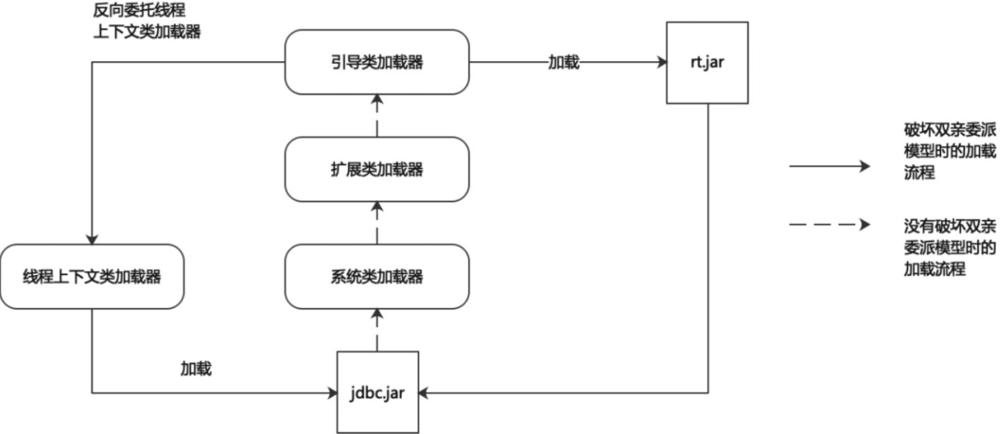

**3 破坏双亲委派机制三**
<span style="color:#FF00FF;font-weight:bold;">双亲委派模型的第三次“被破坏”是由于用户对程序动态性的追求而导致的，如代码热替换(Hot Swap)、模块热部署(Hot Deployment)等</span>。

​	IBM公司实现模块化热部署的关键是它自定义的类加载器机制的实现，每一个程序模块（OSGi中称为Bundle）都有一个自己的类加载器，当需要更换一个Bundle时，就把Bundle连同类加载器一起换掉以实现代码的热替换。在OSGi环境下，类加载器不再是双亲委派模型推荐的树状结构，而是进一步发展为更加复杂的网状结构。

### 20.6.4 热替换的实现

​	热替换是指在程序的运行过程中，不停止服务，只通过替换程序文件来修改程序的行为。热替换的关键需求在于服务不能中断，修改必须立即表现正在运行的系统之中。基本上大部分脚本语言都是天生支持热替换的，比如PHP，只要替换了PHP源文件，这种改动就会立即生效，而无须重启Web服务器。

​	但对Java来说，热替换并非天生就支持，如果一个类已经加载到系统中，通过修改类文件，并无法让系统再来加载并重定义这个类。因此，在Java中实现这一功能的一个可行的方法就是灵活运用类加载器。

​	由不同类加载器加载的同名类属于不同的类型，不能相互转换和兼容。即两个不同的类加载器加载同一个类，在虚拟机内部，会认为这两个类是完全不同的。

​	根据这个特点，可以用来模拟热替换的实现，基本思路如下图所示，首先创建自定义的类加载器，在服务不重启的条件下动态替换类文件，这样就可以直接执行新的类文件了。

<div style="text-align:center;font-weight:bold;">热替换流程图</div>

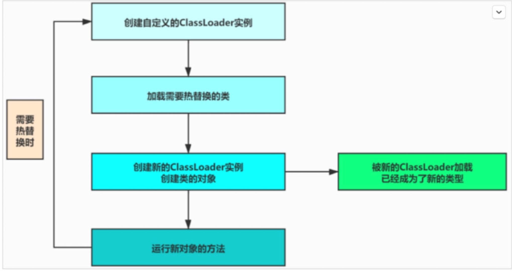

​	根据上面的流程来模拟热替换，代码如下所示。要想实现同一个类的不同版本的共存，那么这些不同版本必须由不同的类加载器进行加载，因此就不能把这些类的加载工作委托给系统类加载器来完成，因为它们只有一份。为了做到这一点，就不能采用系统默认的类加载器委托规则，也就是说定制的类加载器的父类加载器必须设置为null或者重写findClass()方法，加载类的时候调用findClass()方法即可，不去调用loadClass()方法，当通过loadClass()方法进行类的加载时，如果该类没有加载过，会委托给应用程序类加载器进行加载，这样就不会实现热部署了。

1、创建自定义类加载器，如<span style="color:blue;font-weight:bold;">20.5 案例1：自定义类加载器</span>的代码所示。

2、创建需要热替换的类Demo1，实现很简单，仅包含一个方法hot()，如代码清单20-9所示。

<span style="color:#40E0D0;">案例1：Demo1类</span>

- 代码

```java
public class Demo1 {

    public void hot() {
        System.out.println("OldDemo1");
    }
}
```

3、创建测试类LoopRun，把编译好的Demo1.class文件放在当前目录中。接下来要使用我们前面编写的MyClassLoader来实现该类的热替换。具体的做法为写一个死循环，每隔5秒钟执行一次。循环体中会创建新的类加载器实例加载Demo1类，生成实例，并调用hot()方法。接下来修改Demo1类中hot()方法的打印内容，重新编译，并在系统运行的情况下替换掉原来的Demo1.class，会看到系统会打印出更改后的内容，如下代码所示。

<span style="color:#40E0D0;">案例1：测试类LoopRun</span>

- 代码

```java
package com.coding.jvm02.hotswap;

import java.lang.reflect.Method;

public class LoopRun {
    public static void main(String[] args) {
        while (true) {
            try {
                // 1、创建自定义类加载器的实例
                MyClassLoader loader = new MyClassLoader("/Users/wenqiu/IdeaProjects/backend-jvm-learning/jvm-02-classloader/src/main/java");
                // 2、加载指定的类
                Class<?> clazz = loader.findClass("com.coding.jvm02.hotswap.Demo1");
                // 3、创建运行时类的实例
                Object demo = clazz.newInstance();
                // 4、获取运行时类中指定的方法
                Method m = clazz.getMethod("hot");
                // 5、调用指定方法
                m.invoke(demo);
                Thread.sleep(5000);
            } catch (Exception e) {
                System.out.println("not find");
                try {
                    Thread.sleep(5000);
                } catch (InterruptedException exception) {
                    exception.printStackTrace();
                }
            }
        }
    }
}

```

​	没有替换之前输出结果如下。

```bash
OldDemo1
OldDemo1
```

​	修改Demo1类中hot()方法输出内容为OldDemo1→NewDemo1之后，重新编译，程序不重启的情况下，输出结果如下。

```bash
OldDemo1
OldDemo1
OldDemo1 ---> NewDemo1
OldDemo1 ---> NewDemo1
```

## 20.7 沙箱安全机制

​	Java中沙箱安全机制主要是保证程序安全和保护Java原生的JDK代码。Java安全模型的核心就是Java沙箱(Sandbox)。沙箱是一个限制程序运行的环境，沙箱机制就是将Java代码限定在JVM特定的运行范围中，并且严格限制代码对本地系统资源访问。通过这样的措施来保证对代码的有限隔离，防止对本地系统造成破坏。沙箱主要限制系统资源访问，系统资源包括CPU、内存、文件系统、网络。不同级别的沙箱对这些资源访问的限制也可以不一样。所有的Java程序运行都可以指定沙箱，可以定制安全策略。下面我们看看不同的JDK版本中的沙箱机制是什么样的。

### 20.7.1 JDK 1.0时期

​	JDK 1.0安全模型如下图所示。在Java中将执行程序分成本地代码和远程代码两种，本地代码默认视为可信任的，而远程代码则被看作是不被信任的。对于本地代码，可以访问一切本地资源。而远程代码在早期的JDK中实现，程序安全依赖沙箱机制。

<div style="text-align:center;font-weight:bold;">JDK1.0安全模型</div>

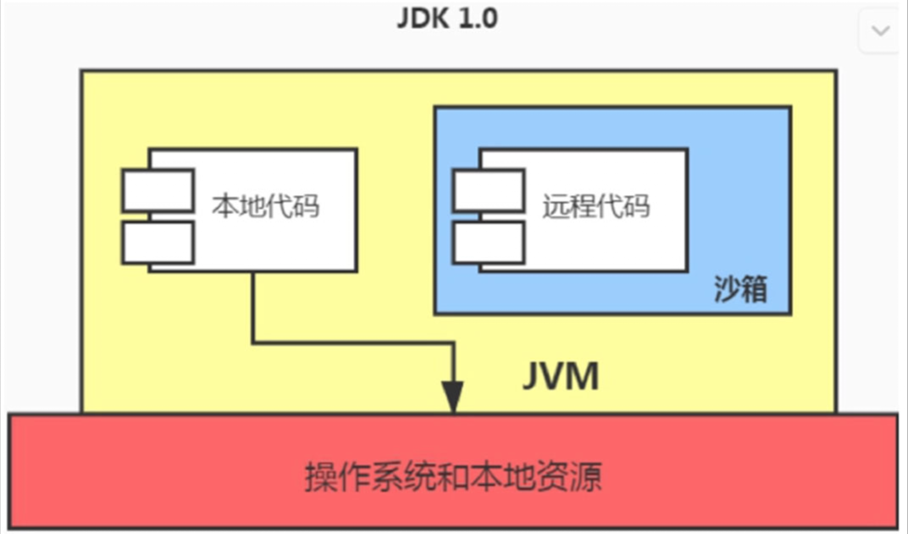

### 20.7.2 JDK 1.1时期

​	JDK 1.0中如此严格的安全机制也给程序的功能扩展带来障碍，比如当用户希望远程代码访问本地系统文件的时候，就无法实现。因此在后续的JDK 1.1版本中，针对安全机制做了改进，增加了安全策略，允许用户指定代码对本地资源的访问权限。JDK 1.1安全模型如下图所示。

<div style="text-align:center;font-weight:bold;">JDK1.1安全模型</div>

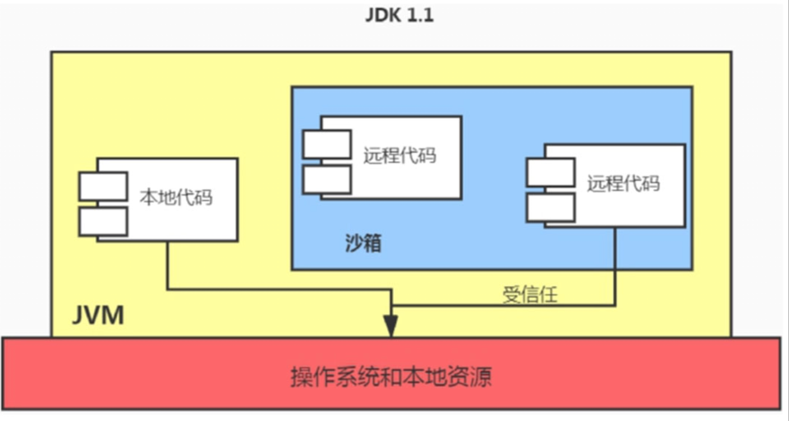

### 20.7.3 JDK 1.2时期

​	在JDK 1.2版本中，再次改进了安全机制，增加了代码签名。不论本地代码或是远程代码，都会按照用户的安全策略设定，由类加载器加载到虚拟机中权限不同的运行空间，来实现差异化的代码执行权限控制。JDK 1.2安全模型如下图所示。

<div style="text-align:center;font-weight:bold;">JDK 1.2安全模型</div>

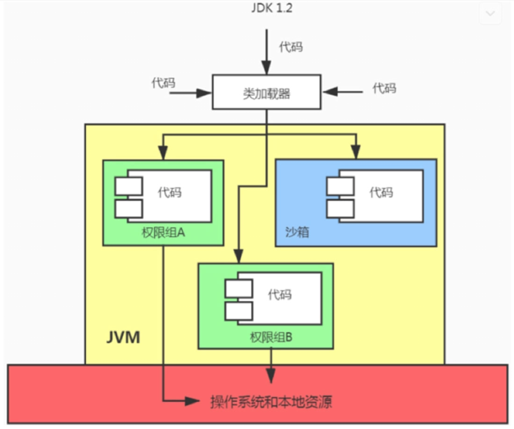

### 20.7.4 JDK 1.6时期

​	当前最新的安全机制实现则引入了域(Domain)的概念。虚拟机会把所有代码加载到不同的系统域和应用域。系统域专门负责与关键资源进行交互，而各个应用域则通过系统域部分代理来对各种需要的资源进行访问。虚拟机中不同的受保护域(Protected Domain)，对应不一样的权限(Permission)。存在于不同域中的类文件就具有了当前域的全部权限，最新的安全模型(JDK 1.6)如下图所示。

<div style="text-align:center;font-weight:bold;">JDK 1.6安全模型</div>

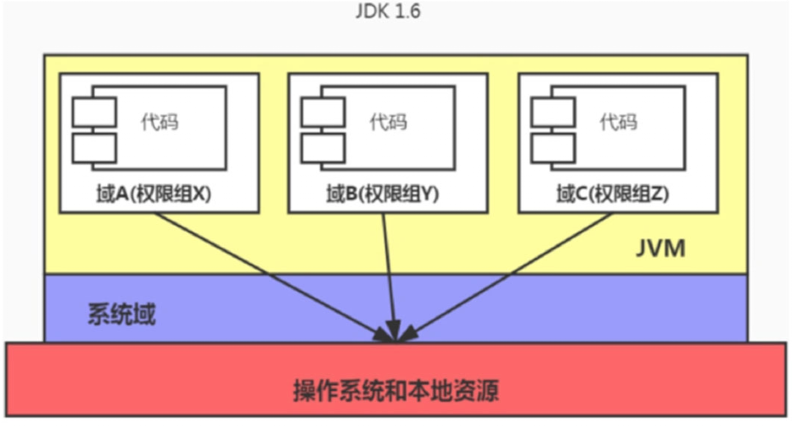

## 20.8 JDK 9新特性

​	为了保证兼容性，JDK 9没有从根本上改变三层类加载器架构和双亲委派模型，但为了模块化系统的顺利运行，仍然发生了一些值得被注意的变动。

​	扩展机制被移除，扩展类加载器由于向后兼容性的原因被保留，不过被重命名为平台类加载器(Platform Class Loader)。可以通过ClassLoader的新方法getPlatformClassLoader()来获取。JDK 9时基于模块化进行构建（原来的rt.jar和tools.jar被拆分成数十个JMOD文件），其中的Java类库就已天然地满足了可扩展的需求，那自然无须再保留`<JAVA_HOME>`\lib\ext目录，此前使用这个目录或者java.ext.dirs系统变量来扩展JDK功能的机制已经没有继续存在的价值了。

​	平台类加载器和应用程序类加载器都不再继承于java.net.URLClassLoader。启动类加载器、平台类加载器、应用程序类加载器全都继承于jdk.internal.loader.BuiltinClassLoader。如下图所示。

```
JDK1.8及以前：
sun.misc.Launcher$AppClassLoader
sun.misc.Launcher$ExtClassLoader

JDK1.9:
jdk.internal.loader.ClassLoaders$AppClassLoader
jdk.internal.loader.ClassLoaders$PlatformClassLoader
```

<div style="text-align:center;font-weight:bold;">JDK 9类加载器关系图</div>

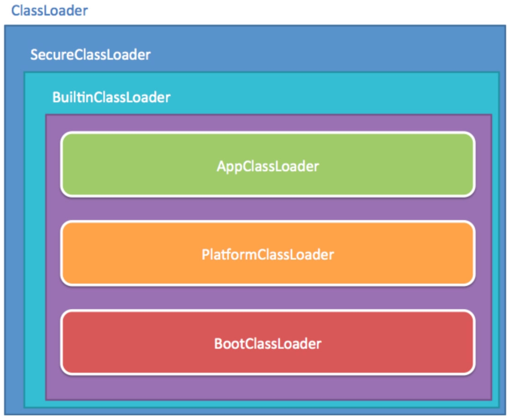

​	如果有程序直接依赖JDK 8之前类加载器的包含关系，或者依赖URLClassLoader类的特定方法，那代码很可能会在JDK 9及更高版本的JDK中崩溃。

​	在JDK 9中，类加载器有了名称。该名称在构造方法中指定，可以通过getName()方法来获取。平台类加载器的名称是Platform，应用类加载器的名称是App。类加载器的名称在调试与类加载器相关的问题时会非常有用。

​	启动类加载器在JDK 9中是由JVM内部和Java类库共同协作实现的类加载器（以前是C++实现），但为了与之前代码兼容，在获取启动类加载器的场景中仍然会返回null，而不会得到BootClassLoader实例。

​	类加载的委派关系也发生了变动。当平台及应用程序类加载器收到类加载请求，在委派给父类加载器加载前，要先判断该类是否能够归属到某一个系统模块中，如果可以找到这样的归属关系，就要优先委派给负责那个模块的加载器完成加载。

​	JDK 9前及JDK 9的双亲委派模式如下图所示。

<div style="text-align:center;font-weight:bold;">JDK 9前及JDK 9的双亲委派模式</div>


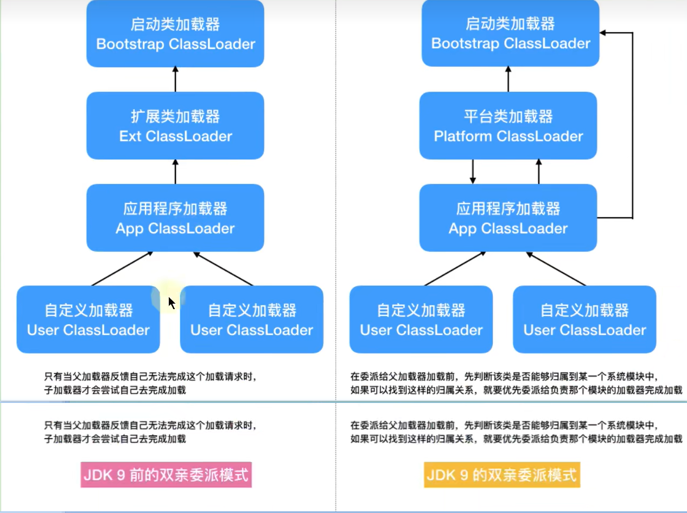

​	在Java模块化系统明确规定了三个类加载器负责各自加载的模块。

- 启动类加载器负责加载的模块

| java.base           | java.security.sasl   |
| ------------------- | -------------------- |
| java.datatransfer   | java.xml             |
| java.desktop        | jdk.httpserver       |
| java.instrument     | jdk.internal.vm.ci   |
| java.logging        | jdk.management       |
| java.management     | jdk.management.agent |
| java.management.rmi | jdk.naming.rmi       |
| java.naming         | jdk.net              |
| java.perfs          | jdk.sctp             |
| java.rmi            | jdk.unsupported      |

- 平台类加载器负责加载的模块

| java.activation*        | jdk.accessibility         |
| ----------------------- | ------------------------- |
| java.compiler*          | jdk.charsets              |
| java.corba*             | jdk.crypto.cryptoki       |
| java.scripting          | jdk.crypto.ec             |
| java.se                 | jdk.dynalink              |
| java.se.ee              | jdk.incubator.httpclient  |
| java.security.jgss      | jdk.internal.vm.compiler* |
| java.smartcardio        | jdk.jsobject              |
| java.sql                | jdk.localedata            |
| java.sql.rowset         | jdk.naming.dns            |
| java.transaction*       | jdk.scripting.nashorn     |
| java.xml.bind*          | jdk.security.auth         |
| java.xml.crypto         | jdk.security.jgss         |
| java.xml.ws*            | jdk.xml.dom               |
| java.xml.ws.annotation* | jdk.zipfs                 |

- 应用程序类加载器负责加载的模块

| jdk.aot                      | jdk.jdeps            |
| ---------------------------- | -------------------- |
| jdk.attach                   | jdk.jdi              |
| jdk.compiler                 | jdk.jdwp.agent       |
| jdk.editpad                  | jdk.jlink            |
| jdk.hotspot.agent            | jdk.jshell           |
| jdk.internal.ed              | jdk.jstatd           |
| jdk.jstatd                   | jdk.internal.jvmstat |
| jdk.pack                     | jdk.internal.le      |
| jdk.policytool               | jdk.internal.opt     |
| jdk.rmic                     | jdk.jartool          |
| jdk.scripting.nashorrn.shell | jdk.javadoc          |
| jdk.xml.bind*                | jdk.jcmd             |
| jdk.xml.ws*                  | jdk.jconsole         |