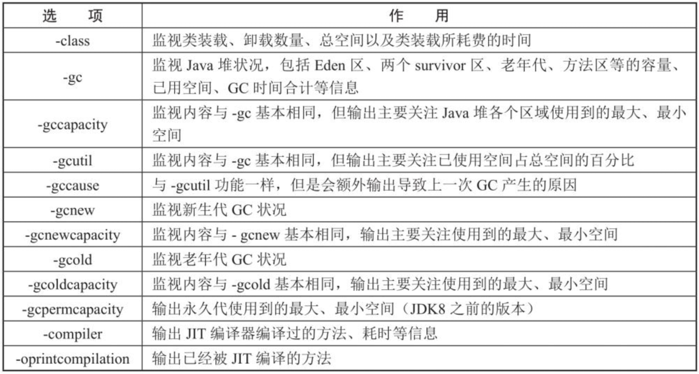
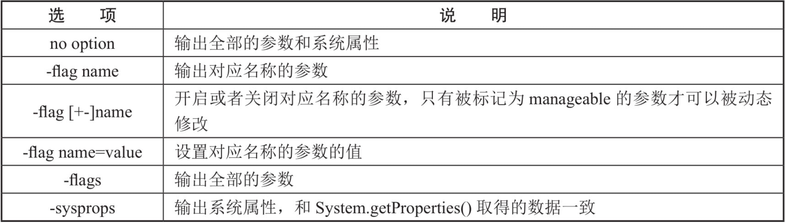
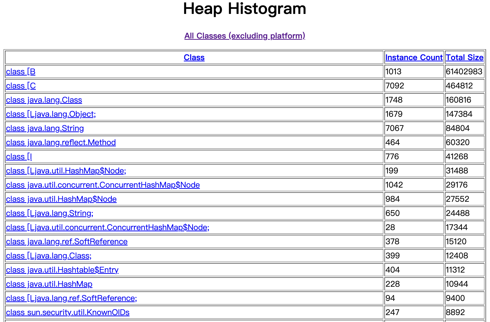
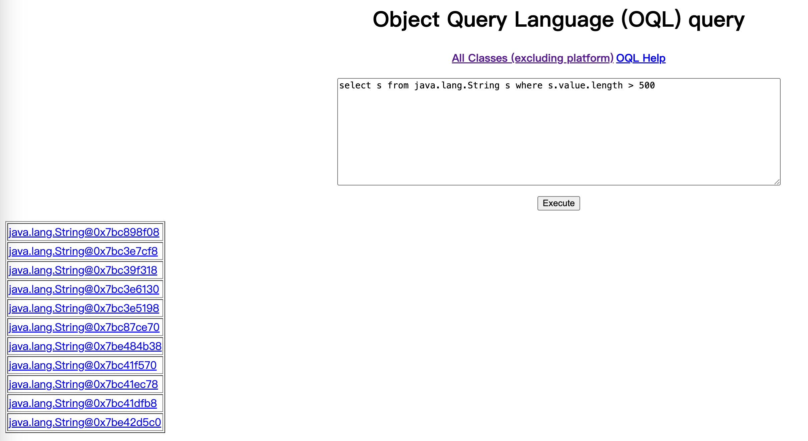
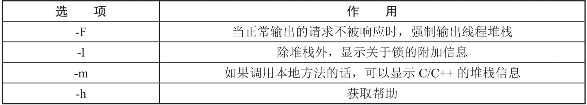

# 第21章 命令行工具

​	性能问题是软件工程师在日常工作中需要经常面对和解决的问题，在用户体验至上的今天，解决好应用的性能问题能带来非常大的收益。工欲善其事，必先利其器，想要解决性能相关问题，必须要有比较好的性能诊断工具。Java作为最流行的编程语言之一，应用的性能诊断一直受到业界广泛关注。造成Java应用出现性能问题的因素非常多，例如线程控制、磁盘读写、数据库访问、网络I/O、垃圾收集等。想要定位这些问题，一款优秀的性能诊断工具必不可少，就好比中医、西医看病，中医讲究的是望、闻、问、切，西医则是借助各种检查仪器。

## 21.1 概述

​	JDK本身已经集成了很多诊断工具。在大家刚接触Java学习的时候，最先了解的两个命令就是javac和java，但是除此之外，还有一些其他工具可以使用，可是并非所有的程序员都了解其他命令行程序的作用，接下来我们一起看看其他命令行程序的作用。进入到安装JDK的bin目录，会发现还有一系列辅助工具。这些辅助工具用来获取目标JVM不同方面、不同层次的信息，帮助开发人员很好地解决Java应用程序的一些疑难杂症。Mac系统bin目录的内容如下图所示。

<div style="text-align:center;font-weight:bold;">Mac系统JDK中的bin目录</div>


​	事实上，它们只是Java程序的一层包装，其真正实现是在tools.jar中，如下图所示。以jps工具为例，在控制台执行jps命令和执行`java -classpath $JAVA_HOME/lib/tools.jar sun.tools.jps.Jps`命令是等价的，即jps命令只是这个命令的一层包装。下面介绍一些常用的命令工具。

```bash
% java -classpath $JAVA_HOME/lib/tools.jar sun.tools.jps.Jps
20065 
60116 Main
72247 Jps
% jps
20065 
60116 Main
72350 Jps
```

<div style="text-align:center;font-weight:bold;">tool.jar内部情况</div>


## 21.2 jps:查看正在运行的Java进程

​	jps(JVM Process Status Tool)命令用于查看系统内所有的JVM进程，可根据参数选项指定是否显示JVM的执行主类［包含main()方法的类］，以及进程的本地JVMID(Local Virtual Machine Identifier)，对于本地JVM进程来说，进程的本地JVMID与操作系统的进程ID是一致的。简单来说，就是Java提供的一个显示当前所有Java进程pid的命令，和Linux系统里的ps命令很相似，ps命令主要是用来显示当前系统的进程情况，比如查看进程列表和进程ID。在日常工作中，此命令也是最常用的命令之一。

​	jps的基本使用语法如下：

```bash
% jps -help
usage: jps [-help]
       jps [-q] [-mlvV] [<hostid>]

Definitions:
    <hostid>:      <hostname>[:<port>]
```

| 基本语法                |
| ----------------------- |
| jps [options]  [hostid] |

**1 [ options ]选项说明**

​	jps工具[options]主要选项如下表所示。
<div style="text-align:center;font-weight:bold;">jps命令[options]选项说明</div>


**2 [hostid]说明**

​	hostid表示目标主机的主机名或IP地址，如果省略该参数，则目标主机为本地主机。如果想要远程监控主机上的Java程序，需要安装jstatd（见20.9节）。对于网络安全要求非常严格的场所，需要自定义策略文件来满足对特定的主机或网络的访问，但是这种技术容易受到IP地址欺诈攻击。如果由于安全问题无法通过定制的策略文件处理，那么最安全的操作是在主机本地使用jstat（见21.3节）和jps工具。

**3 使用案例**

​	Mac上启动Tomcat（一种Web应用服务器，通过Homebrew安装），然后使用ps命令查看Tomcat进程ID使用，如下所示。

```bash
% ps -ef|grep tomcat
```

```bash
  501 77188     1   0  2:33下午 ??         0:02.11 /opt/homebrew/opt/openjdk/bin/java -Djava.util.logging.config.file=/opt/homebrew/Cellar/tomcat@8/8.5.100/libexec/conf/logging.properties -Djava.util.logging.manager=org.apache.juli.ClassLoaderLogManager -Djdk.tls.ephemeralDHKeySize=2048 -Djava.protocol.handler.pkgs=org.apache.catalina.webresources -Dorg.apache.catalina.security.SecurityListener.UMASK=0027 -Dignore.endorsed.dirs= -classpath /opt/homebrew/Cellar/tomcat@8/8.5.100/libexec/bin/bootstrap.jar:/opt/homebrew/Cellar/tomcat@8/8.5.100/libexec/bin/tomcat-juli.jar -Dcatalina.base=/opt/homebrew/Cellar/tomcat@8/8.5.100/libexec -Dcatalina.home=/opt/homebrew/Cellar/tomcat@8/8.5.100/libexec -Djava.io.tmpdir=/opt/homebrew/Cellar/tomcat@8/8.5.100/libexec/temp org.apache.catalina.startup.Bootstrap start
  501 77505 41579   0  2:34下午 ttys000    0:00.01 grep tomcat
```

​	可以看到进程ID是77188。使用jps -l命令查看，如下所示。

```bash
% jps -l
20065 
60116 com.intellij.idea.Main
77188 org.apache.catalina.startup.Bootstrap
77965 sun.tools.jps.Jps
```

​	可以查看到Tomcat进程ID也是77188，与ps命令一致。接下来测试jps命令的其他参数选项。

1、-q选项：只输出进程ID，省略主类名称

```bash
% jps -q
20065
78192
60116
77188
```

2、-m选项：输出JVM进程启动时传递给主类main()方法的参数

```bash
% jps -m
20065 
60116 Main
77188 Bootstrap start
78301 Jps -m
```

3、-v选项：查看输出JVM进程启动时的JVM参数

```bash
% jps -v
20065  -Djna.nounpack=true -Djna.nosys=true -Djna.noclasspath=true -Djna.library.path=/Applications/JetBrains Toolbox.app/Contents/MacOS -Djna.boot.library.path=/Applications/JetBrains Toolbox.app/Contents/MacOS -Dskiko.library.path=/Applications/JetBrains Toolbox.app/Contents/MacOS -Duser.dir=/Applications/JetBrains Toolbox.app/Contents/MacOS -Dskiko.metal.gpu.priority=integrated -Xmx160m -Xms8m -Xss384k -XX:+UnlockExperimentalVMOptions -XX:+CreateCoredumpOnCrash -XX:MetaspaceSize=16m -XX:MinMetaspaceFreeRatio=10 -XX:MaxMetaspaceFreeRatio=10 -XX:+UseCompressedOops -XX:+UseCompressedClassPointers -XX:+UseSerialGC -XX:MinHeapFreeRatio=10 -XX:MaxHeapFreeRatio=10 -XX:-ShrinkHeapInSteps --add-opens=java.desktop/sun.awt=ALL-UNNAMED --add-opens=java.desktop/sun.awt.resources=ALL-UNNAMED --add-opens=java.desktop/com.jetbrains.desktop=ALL-UNNAMED vfprintf exit abort -DTOOLBOX_VERSION=2.5.2.35332 -XX:+HeapDumpOnOutOfMemoryError -XX:HeapDumpPath=/Users/wenqiu/Library/Logs/JetBrains/Toolbox/toolbox-oom-20065.hprof -XX:ErrorFil
60116 Main abort vfprintf -XX:ErrorFile=/Users/wenqiu/java_error_in_idea_%p.log -XX:HeapDumpPath=/Users/wenqiu/java_error_in_idea.hprof -Xms128m -Xmx2048m -XX:ReservedCodeCacheSize=512m -XX:+HeapDumpOnOutOfMemoryError -XX:-OmitStackTraceInFastThrow -XX:CICompilerCount=2 -XX:+IgnoreUnrecognizedVMOptions -ea -Dsun.io.useCanonCaches=false -Dsun.java2d.metal=true -Djbr.catch.SIGABRT=true -Djdk.http.auth.tunneling.disabledSchemes="" -Djdk.attach.allowAttachSelf=true -Djdk.module.illegalAccess.silent=true -Djdk.nio.maxCachedBufferSize=2097152 -Djava.util.zip.use.nio.for.zip.file.access=true -Dkotlinx.coroutines.debug=off -XX:+UnlockDiagnosticVMOptions -XX:TieredOldPercentage=100000 -Dapple.awt.application.appearance=system -Xmx2048m -Dide.managed.by.toolbox=/Applications/JetBrains Toolbox.app/Contents/MacOS/jetbrains-toolbox -Dtoolbox.notification.token=a5149d88-e0f9-43f8-9038-51a8f4e05984 -Dtoolbox.notification.portFile=/Users/wenqiu/Library/Caches/JetBrains/Toolbox/ports/8883a081-ad3c-4c00-99bf-7999bcfc74db.port -Djb.vmOpti
77188 Bootstrap --add-opens=java.base/java.lang=ALL-UNNAMED --add-opens=java.base/java.io=ALL-UNNAMED --add-opens=java.base/java.util=ALL-UNNAMED --add-opens=java.base/java.util.concurrent=ALL-UNNAMED --add-opens=java.rmi/sun.rmi.transport=ALL-UNNAMED -Djava.util.logging.config.file=/opt/homebrew/Cellar/tomcat@8/8.5.100/libexec/conf/logging.properties -Djava.util.logging.manager=org.apache.juli.ClassLoaderLogManager -Djdk.tls.ephemeralDHKeySize=2048 -Djava.protocol.handler.pkgs=org.apache.catalina.webresources -Dorg.apache.catalina.security.SecurityListener.UMASK=0027 -Dignore.endorsed.dirs= -Dcatalina.base=/opt/homebrew/Cellar/tomcat@8/8.5.100/libexec -Dcatalina.home=/opt/homebrew/Cellar/tomcat@8/8.5.100/libexec -Djava.io.tmpdir=/opt/homebrew/Cellar/tomcat@8/8.5.100/libexec/temp
78406 Jps -Dapplication.home=/Library/Java/JavaVirtualMachines/jdk-1.8.jdk/Contents/Home -Xms8m
```

## 21.3 jstat：查看JVM统计信息

​	jstat(JVM Statistics Monitoring Tool)用于收集JVM各方面的运行数据，显示本地或远程JVM进程中的类装载、内存、垃圾收集、JIT编译等运行数据。在没有图形用户界面时，只提供了纯文本控制台环境的服务器上，它是运行期定位JVM性能问题的首选工具。常用于检测垃圾回收问题以及内存泄漏问题。它的功能非常强大，可以通过它查看堆信息的详细情况。

​	jstat的基本使用语法如下。

```bash
% jstat -help
Usage: jstat -help|-options
       jstat -<option> [-t] [-h<lines>] <vmid> [<interval> [<count>]]

Definitions:
  <option>      An option reported by the -options option
  <vmid>        Virtual Machine Identifier. A vmid takes the following form:
                     <lvmid>[@<hostname>[:<port>]]
                Where <lvmid> is the local vm identifier for the target
                Java virtual machine, typically a process id; <hostname> is
                the name of the host running the target Java virtual machine;
                and <port> is the port number for the rmiregistry on the
                target host. See the jvmstat documentation for a more complete
                description of the Virtual Machine Identifier.
  <lines>       Number of samples between header lines.
  <interval>    Sampling interval. The following forms are allowed:
                    <n>["ms"|"s"]
                Where <n> is an integer and the suffix specifies the units as 
                milliseconds("ms") or seconds("s"). The default units are "ms".
  <count>       Number of samples to take before terminating.
  -J<flag>      Pass <flag> directly to the runtime system.
```

| 基本语法                                                    |
| ----------------------------------------------------------- |
| `jsat -<option>[-t] [-h<lines>] <vmid> [<interval>[<count>]]` |

**1 [options]选项说明**

<div style="text-align:center;font-weight:bold;">jstat命令[ options ]选项说明</div>



**2 [-t]参数说明**

​	[-t]参数可以在输出信息前加上一个Timestamp列，显示程序的运行时间。可以比较Java进程的启动时间以及总GC时间（GCT列），或者两次测量的间隔时间以及总GC时间的增量，来得出GC时间占运行时间的比例。如果该比例超过20%，则说明目前堆的压力较大；如果该比例超过90%，则说明堆里几乎没有可用空间，随时都可能抛出OOM异常。

**3 [-h&lt;lines&gt;]参数说明**

​	[-h]参数可以在周期性数据输岀时，输出设定的行数的数据后输出一个表头信息。

**4 [interval]参数说明**

​	[interval]参数用于指定输出统计数据的周期，单位为毫秒，简单来说就是查询间隔时间。

**5 [count]参数说明**

​	[count]用于指定查询的总次数。

**6 使用案例**

​	由于jstat参数选项比较多，这里只列举一个启动了Tomcat的Linux服务器案例，查看其监视状态，命令如下所示。

```bash
# 查看进程ID
% jps
# 查看进程GC信息
% jstat -gc 77188
 # 每隔1s打印一次进程信息，打印10次，并且加上时间戳
% jstat -gc -t 77188 1000 10
 # 每隔1s打印一次进程信息，打印10次，并且加上时间戳；且每5行输出一次表头信息
% jstat -gc -t -h5 77188 1000 10
```

​	运行结果如下图所示。

<div style="text-align:center;font-weight:bold;">jstat命令运行结果</div>


​	运行结果的各列表示的含义如下表所示。

<div style="text-align:center;font-weight:bold;">jstat命令运行结果说明</div>


​	jstat还可以用来判断是否出现内存泄漏，步骤如下。

1、在长时间运行的Java程序中，可以运行jstat命令连续获取多行性能数据，并取这几行数据中OU列（即已占用的老年代内存）的最小值。

2、每隔一段较长的时间重复一次上述操作，获得多组OU最小值。如果这些值呈上涨趋势，则说明该Java程序的老年代内存已使用量在不断上涨，这意味着无法回收的对象在不断增加，因此很有可能存在内存泄漏。

## 21.4 jinfo：实时查看和修改JVM配置参数

​	jinfo(Configuration Info for Java)可用于查看和调整JVM的配置参数。在很多情况下，Java应用程序不会指定所有的JVM参数。而此时，开发人员可能不知道某一个具体的JVM参数的默认值。在这种情况下，可能需要通过查找文档获取某个参数的默认值。这个查找过程可能是非常艰难的。但有了jinfo工具，开发人员可以很方便地找到JVM参数的当前值。上面讲解的jps -v命令虽然可以查看JVM启动时显示指定的参数列表，但是如果想要知道未被显式指定的参数的系统默认值，就需要用到jinfo工具了。

​	第二个作用就是在程序运行时修改部分参数，并使之立即生效。并非所有参数都支持动态修改，只有被标记为manageable的参数可以被实时修改。其实，这个修改能力是极其有限的，使用下面的命令查看被标记为manageable的参数。

```bash
% java -XX:+PrintFlagsFinal -version | grep manageable
```

```bash
     intx CMSAbortablePrecleanWaitMillis            = 100                                 {manageable}
     intx CMSTriggerInterval                        = -1                                  {manageable}
     intx CMSWaitDuration                           = 2000                                {manageable}
     bool HeapDumpAfterFullGC                       = false                               {manageable}
     bool HeapDumpBeforeFullGC                      = false                               {manageable}
     bool HeapDumpOnOutOfMemoryError                = false                               {manageable}
    ccstr HeapDumpPath                              =                                     {manageable}
    uintx MaxHeapFreeRatio                          = 100                                 {manageable}
    uintx MinHeapFreeRatio                          = 0                                   {manageable}
     bool PrintClassHistogram                       = false                               {manageable}
     bool PrintClassHistogramAfterFullGC            = false                               {manageable}
     bool PrintClassHistogramBeforeFullGC           = false                               {manageable}
     bool PrintConcurrentLocks                      = false                               {manageable}
     bool PrintGC                                   = false                               {manageable}
     bool PrintGCDateStamps                         = false                               {manageable}
     bool PrintGCDetails                            = false                               {manageable}
     bool PrintGCID                                 = false                               {manageable}
     bool PrintGCTimeStamps                         = false                               {manageable}
java version "1.8.0_421"
Java(TM) SE Runtime Environment (build 1.8.0_421-b09)
Java HotSpot(TM) 64-Bit Server VM (build 25.421-b09, mixed mode)
```

​	jinfo的基本使用语法如下。

```bash
% jinfo -help
Usage:
    jinfo [option] <pid>
        (to connect to running process)
    jinfo [option] <executable <core>
        (to connect to a core file)
    jinfo [option] [server_id@]<remote server IP or hostname>
        (to connect to remote debug server)

where <option> is one of:
    -flag <name>         to print the value of the named VM flag
    -flag [+|-]<name>    to enable or disable the named VM flag
    -flag <name>=<value> to set the named VM flag to the given value
    -flags               to print VM flags
    -sysprops            to print Java system properties
    <no option>          to print both of the above
    -h | -help           to print this help message
```

| 基本语法            |
| ------------------- |
| jinfo [options] pid |

**1 [ options ]选项说明**

​	jinfo工具options主要选项如下表所示。



**2 pid说明**

​	Java进程ID，必须要加上。

**3 使用案例**

​	由于jinfo可以查看JVM配置信息，也可用于调整JVM的配置参数，下面分两类案例分别讲解如何使用。

**4 jinfo用于查看JVM配置信息案例**

​	如下代码主要用于启动一个JVM进程，方便通过该进程查看JVM相关配置信息。

<div style="text-align:center;font-weight:bold;">jinfo查看JVM配置参数案例</div>

```java
package com.coding.jvm07.cmd;

import java.util.Scanner;

public class ScannerTest {
    public static void main(String[] args) {
        Scanner scanner = new Scanner(System.in);
        String info = scanner.next();
    }
}
```

​	程序很简单，只需要保证程序在执行状态即可。首先使用jps命令查看进程ID，如下所示。

```bash
# 查看进程ID
% jps -l
86721 jdk.jcmd/sun.tools.jps.Jps
20065 
86172 com.intellij.idea.Main
86510 com.coding.jvm07.cmd.ScannerTest
```

​	上面出现两个结果，ScannerTest程序的进程ID是81928，另外几个进程ID表示jps命令本身的进程以及IDEA开发工具的进程。下面使用jinfo命令来查看JVM配置参数，命令如下。

1、根据进程ID查询全部参数和系统属性。

```bash
# 查看全部参数和系统属性
% jinfo 86510
```

```bash
Java System Properties:
#Thu Dec 05 20:59:18 CST 2024
java.runtime.name=Java(TM) SE Runtime Environment
sun.boot.library.path=/Library/Java/JavaVirtualMachines/jdk-1.8.jdk/Contents/Home/jre/lib
java.vm.version=25.421-b09
gopherProxySet=false
java.vm.vendor=Oracle Corporation
java.vendor.url=http\://java.oracle.com/
path.separator=\:
java.rmi.server.randomIDs=true
java.vm.name=Java HotSpot(TM) 64-Bit Server VM
file.encoding.pkg=sun.io
user.country=CN
sun.java.launcher=SUN_STANDARD
sun.os.patch.level=unknown
java.vm.specification.name=Java Virtual Machine Specification
user.dir=/Users/wenqiu/IdeaProjects/backend-jvm-learning
java.runtime.version=1.8.0_421-b09
java.awt.graphicsenv=sun.awt.CGraphicsEnvironment
java.endorsed.dirs=/Library/Java/JavaVirtualMachines/jdk-1.8.jdk/Contents/Home/jre/lib/endorsed
os.arch=aarch64
java.io.tmpdir=/var/folders/lx/7npzn7997ps3t7g11876yqvw0000gn/T/
line.separator=\n
socksProxyPort=7890
java.vm.specification.vendor=Oracle Corporation
https.proxyHost=127.0.0.1
os.name=Mac OS X
sun.jnu.encoding=UTF-8
java.library.path=/Users/wenqiu/Library/Java/Extensions\:/Library/Java/Extensions\:/Network/Library/Java/Extensions\:/System/Library/Java/Extensions\:/usr/lib/java\:.
http.proxyPort=7890
java.specification.name=Java Platform API Specification
java.class.version=52.0
sun.management.compiler=HotSpot 64-Bit Tiered Compilers
os.version=15.1.1
http.nonProxyHosts=192.168.0.0/16|*.192.168.0.0/16|10.0.0.0/8|*.10.0.0.0/8|172.16.0.0/12|*.172.16.0.0/12|127.0.0.1|localhost|*.localhost|local|*.local|timestamp.apple.com|*.timestamp.apple.com|sequoia.apple.com|*.sequoia.apple.com|seed-sequoia.siri.apple.com|*.seed-sequoia.siri.apple.com
user.home=/Users/wenqiu
user.timezone=Asia/Shanghai
java.awt.printerjob=sun.lwawt.macosx.CPrinterJob
file.encoding=UTF-8
java.specification.version=1.8
java.class.path=/Library/Java/JavaVirtualMachines/jdk-1.8.jdk/Contents/Home/jre/lib/charsets.jar\:/Library/Java/JavaVirtualMachines/jdk-1.8.jdk/Contents/Home/jre/lib/deploy.jar\:/Library/Java/JavaVirtualMachines/jdk-1.8.jdk/Contents/Home/jre/lib/ext/cldrdata.jar\:/Library/Java/JavaVirtualMachines/jdk-1.8.jdk/Contents/Home/jre/lib/ext/dnsns.jar\:/Library/Java/JavaVirtualMachines/jdk-1.8.jdk/Contents/Home/jre/lib/ext/jaccess.jar\:/Library/Java/JavaVirtualMachines/jdk-1.8.jdk/Contents/Home/jre/lib/ext/jfxrt.jar\:/Library/Java/JavaVirtualMachines/jdk-1.8.jdk/Contents/Home/jre/lib/ext/localedata.jar\:/Library/Java/JavaVirtualMachines/jdk-1.8.jdk/Contents/Home/jre/lib/ext/nashorn.jar\:/Library/Java/JavaVirtualMachines/jdk-1.8.jdk/Contents/Home/jre/lib/ext/sunec.jar\:/Library/Java/JavaVirtualMachines/jdk-1.8.jdk/Contents/Home/jre/lib/ext/sunjce_provider.jar\:/Library/Java/JavaVirtualMachines/jdk-1.8.jdk/Contents/Home/jre/lib/ext/sunpkcs11.jar\:/Library/Java/JavaVirtualMachines/jdk-1.8.jdk/Contents/Home/jre/lib/ext/zipfs.jar\:/Library/Java/JavaVirtualMachines/jdk-1.8.jdk/Contents/Home/jre/lib/javaws.jar\:/Library/Java/JavaVirtualMachines/jdk-1.8.jdk/Contents/Home/jre/lib/jce.jar\:/Library/Java/JavaVirtualMachines/jdk-1.8.jdk/Contents/Home/jre/lib/jfr.jar\:/Library/Java/JavaVirtualMachines/jdk-1.8.jdk/Contents/Home/jre/lib/jfxswt.jar\:/Library/Java/JavaVirtualMachines/jdk-1.8.jdk/Contents/Home/jre/lib/jsse.jar\:/Library/Java/JavaVirtualMachines/jdk-1.8.jdk/Contents/Home/jre/lib/management-agent.jar\:/Library/Java/JavaVirtualMachines/jdk-1.8.jdk/Contents/Home/jre/lib/plugin.jar\:/Library/Java/JavaVirtualMachines/jdk-1.8.jdk/Contents/Home/jre/lib/resources.jar\:/Library/Java/JavaVirtualMachines/jdk-1.8.jdk/Contents/Home/jre/lib/rt.jar\:/Users/wenqiu/IdeaProjects/backend-jvm-learning/jvm-07-tools/target/classes\:/Users/wenqiu/.m2/repository/junit/junit/4.6/junit-4.6.jar\:/Users/wenqiu/.m2/repository/org/projectlombok/lombok/1.18.30/lombok-1.18.30.jar\:/Applications/IntelliJ IDEA.app/Contents/lib/idea_rt.jar
user.name=wenqiu
socksProxyHost=127.0.0.1
java.vm.specification.version=1.8
sun.java.command=com.coding.jvm07.cmd.ScannerTest
java.home=/Library/Java/JavaVirtualMachines/jdk-1.8.jdk/Contents/Home/jre
sun.arch.data.model=64
user.language=zh
java.specification.vendor=Oracle Corporation
awt.toolkit=sun.lwawt.macosx.LWCToolkit
java.vm.info=mixed mode
java.version=1.8.0_421
java.ext.dirs=/Users/wenqiu/Library/Java/Extensions\:/Library/Java/JavaVirtualMachines/jdk-1.8.jdk/Contents/Home/jre/lib/ext\:/Library/Java/Extensions\:/Network/Library/Java/Extensions\:/System/Library/Java/Extensions\:/usr/lib/java
sun.boot.class.path=/Library/Java/JavaVirtualMachines/jdk-1.8.jdk/Contents/Home/jre/lib/resources.jar\:/Library/Java/JavaVirtualMachines/jdk-1.8.jdk/Contents/Home/jre/lib/rt.jar\:/Library/Java/JavaVirtualMachines/jdk-1.8.jdk/Contents/Home/jre/lib/jsse.jar\:/Library/Java/JavaVirtualMachines/jdk-1.8.jdk/Contents/Home/jre/lib/jce.jar\:/Library/Java/JavaVirtualMachines/jdk-1.8.jdk/Contents/Home/jre/lib/charsets.jar\:/Library/Java/JavaVirtualMachines/jdk-1.8.jdk/Contents/Home/jre/lib/jfr.jar\:/Library/Java/JavaVirtualMachines/jdk-1.8.jdk/Contents/Home/jre/classes
http.proxyHost=127.0.0.1
java.vendor=Oracle Corporation
java.specification.maintenance.version=5
file.separator=/
java.vendor.url.bug=http\://bugreport.sun.com/bugreport/
sun.io.unicode.encoding=UnicodeBig
sun.cpu.endian=little
https.proxyPort=7890
socksNonProxyHosts=192.168.0.0/16|*.192.168.0.0/16|10.0.0.0/8|*.10.0.0.0/8|172.16.0.0/12|*.172.16.0.0/12|127.0.0.1|localhost|*.localhost|local|*.local|timestamp.apple.com|*.timestamp.apple.com|sequoia.apple.com|*.sequoia.apple.com|seed-sequoia.siri.apple.com|*.seed-sequoia.siri.apple.com
ftp.nonProxyHosts=192.168.0.0/16|*.192.168.0.0/16|10.0.0.0/8|*.10.0.0.0/8|172.16.0.0/12|*.172.16.0.0/12|127.0.0.1|localhost|*.localhost|local|*.local|timestamp.apple.com|*.timestamp.apple.com|sequoia.apple.com|*.sequoia.apple.com|seed-sequoia.siri.apple.com|*.seed-sequoia.siri.apple.com
sun.cpu.isalist=

VM Flags:
-XX:CICompilerCount=12 -XX:InitialHeapSize=2147483648 -XX:MaxHeapSize=32203866112 -XX:MaxNewSize=10734272512 -XX:MinHeapDeltaBytes=524288 -XX:NewSize=715653120 -XX:OldSize=1431830528 -XX:+UseCompressedClassPointers -XX:+UseCompressedOops -XX:+UseParallelGC 

VM Arguments:
jvm_args: -javaagent:/Applications/IntelliJ IDEA.app/Contents/lib/idea_rt.jar=65060:/Applications/IntelliJ IDEA.app/Contents/bin -Dfile.encoding=UTF-8 
java_command: com.coding.jvm07.cmd.ScannerTest
java_class_path (initial): /Library/Java/JavaVirtualMachines/jdk-1.8.jdk/Contents/Home/jre/lib/charsets.jar:/Library/Java/JavaVirtualMachines/jdk-1.8.jdk/Contents/Home/jre/lib/deploy.jar:/Library/Java/JavaVirtualMachines/jdk-1.8.jdk/Contents/Home/jre/lib/ext/cldrdata.jar:/Library/Java/JavaVirtualMachines/jdk-1.8.jdk/Contents/Home/jre/lib/ext/dnsns.jar:/Library/Java/JavaVirtualMachines/jdk-1.8.jdk/Contents/Home/jre/lib/ext/jaccess.jar:/Library/Java/JavaVirtualMachines/jdk-1.8.jdk/Contents/Home/jre/lib/ext/jfxrt.jar:/Library/Java/JavaVirtualMachines/jdk-1.8.jdk/Contents/Home/jre/lib/ext/localedata.jar:/Library/Java/JavaVirtualMachines/jdk-1.8.jdk/Contents/Home/jre/lib/ext/nashorn.jar:/Library/Java/JavaVirtualMachines/jdk-1.8.jdk/Contents/Home/jre/lib/ext/sunec.jar:/Library/Java/JavaVirtualMachines/jdk-1.8.jdk/Contents/Home/jre/lib/ext/sunjce_provider.jar:/Library/Java/JavaVirtualMachines/jdk-1.8.jdk/Contents/Home/jre/lib/ext/sunpkcs11.jar:/Library/Java/JavaVirtualMachines/jdk-1.8.jdk/Contents/Home/jre/lib/ext/zipfs.jar:/Library/Java/JavaVirtualMachines/jdk-1.8.jdk/Contents/Home/jre/lib/javaws.jar:/Library/Java/JavaVirtualMachines/jdk-1.8.jdk/Contents/Home/jre/lib/jce.jar:/Library/Java/JavaVirtualMachines/jdk-1.8.jdk/Contents/Home/jre/lib/jfr.jar:/Library/Java/JavaVirtualMachines/jdk-1.8.jdk/Contents/Home/jre/lib/jfxswt.jar:/Library/Java/JavaVirtualMachines/jdk-1.8.jdk/Contents/Home/jre/lib/jsse.jar:/Library/Java/JavaVirtualMachines/jdk-1.8.jdk/Contents/Home/jre/lib/management-agent.jar:/Library/Java/JavaVirtualMachines/jdk-1.8.jdk/Contents/Home/jre/lib/plugin.jar:/Library/Java/JavaVirtualMachines/jdk-1.8.jdk/Contents/Home/jre/lib/resources.jar:/Library/Java/JavaVirtualMachines/jdk-1.8.jdk/Contents/Home/jre/lib/rt.jar:/Users/wenqiu/IdeaProjects/backend-jvm-learning/jvm-07-tools/target/classes:/Users/wenqiu/.m2/repository/junit/junit/4.6/junit-4.6.jar:/Users/wenqiu/.m2/repository/org/projectlombok/lombok/1.18.30/lombok-1.18.30.jar:/Applications/IntelliJ IDEA.app/Conte
Launcher Type: SUN_STANDARD
```

​	结果中含有Java系统属性(System Properties)和JVM参数(VM Flags)。

2、根据进程ID查询系统属性（选项：-sysprops）命令如下。

```bash
# 查看系统属性
% jinfo -sysprops 86510
```

​	通过Java代码获取系统属性如下代码所示。

<div style="text-align:center;font-weight:bold;">获取系统属性</div>

```java
package com.coding.jvm07.cmd;

import java.util.Properties;

public class SystemProTest {
    public static void main(String[] args) {
        Properties properties = System.getProperties();
        String[] split = properties.toString().split(",");
        for (String str : split) {
            System.out.println(str);
        }
    }
}

```

​	运行结果如下图所示（部分结果）。

<div style="text-align:center;font-weight:bold;">Java代码获取系统属性</div>

```bash
{java.runtime.name=Java(TM) SE Runtime Environment
 sun.boot.library.path=/Library/Java/JavaVirtualMachines/jdk-1.8.jdk/Contents/Home/jre/lib
 java.vm.version=25.421-b09
 gopherProxySet=false
 java.vm.vendor=Oracle Corporation
 java.vendor.url=http://java.oracle.com/
 path.separator=:
 java.vm.name=Java HotSpot(TM) 64-Bit Server VM
 file.encoding.pkg=sun.io
 user.country=CN
 sun.java.launcher=SUN_STANDARD
 sun.os.patch.level=unknown
 java.vm.specification.name=Java Virtual Machine Specification
 user.dir=/Users/wenqiu/IdeaProjects/backend-jvm-learning
 java.runtime.version=1.8.0_421-b09
 java.awt.graphicsenv=sun.awt.CGraphicsEnvironment
 java.endorsed.dirs=/Library/Java/JavaVirtualMachines/jdk-1.8.jdk/Contents/Home/jre/lib/endorsed
 os.arch=aarch64
 java.io.tmpdir=/var/folders/lx/7npzn7997ps3t7g11876yqvw0000gn/T/
 line.separator=

 socksProxyPort=7890
 java.vm.specification.vendor=Oracle Corporation
 https.proxyHost=127.0.0.1
 os.name=Mac OS X
 sun.jnu.encoding=UTF-8
 java.library.path=/Users/wenqiu/Library/Java/Extensions:/Library/Java/Extensions:/Network/Library/Java/Extensions:/System/Library/Java/Extensions:/usr/lib/java:.
 http.proxyPort=7890
 java.specification.name=Java Platform API Specification
 java.class.version=52.0
 sun.management.compiler=HotSpot 64-Bit Tiered Compilers
 os.version=15.1.1
 http.nonProxyHosts=192.168.0.0/16|*.192.168.0.0/16|10.0.0.0/8|*.10.0.0.0/8|172.16.0.0/12|*.172.16.0.0/12|127.0.0.1|localhost|*.localhost|local|*.local|timestamp.apple.com|*.timestamp.apple.com|sequoia.apple.com|*.sequoia.apple.com|seed-sequoia.siri.apple.com|*.seed-sequoia.siri.apple.com
 user.home=/Users/wenqiu
 user.timezone=
 java.awt.printerjob=sun.lwawt.macosx.CPrinterJob
 file.encoding=UTF-8
 java.specification.version=1.8
 java.class.path=/Library/Java/JavaVirtualMachines/jdk-1.8.jdk/Contents/Home/jre/lib/charsets.jar:/Library/Java/JavaVirtualMachines/jdk-1.8.jdk/Contents/Home/jre/lib/deploy.jar:/Library/Java/JavaVirtualMachines/jdk-1.8.jdk/Contents/Home/jre/lib/ext/cldrdata.jar:/Library/Java/JavaVirtualMachines/jdk-1.8.jdk/Contents/Home/jre/lib/ext/dnsns.jar:/Library/Java/JavaVirtualMachines/jdk-1.8.jdk/Contents/Home/jre/lib/ext/jaccess.jar:/Library/Java/JavaVirtualMachines/jdk-1.8.jdk/Contents/Home/jre/lib/ext/jfxrt.jar:/Library/Java/JavaVirtualMachines/jdk-1.8.jdk/Contents/Home/jre/lib/ext/localedata.jar:/Library/Java/JavaVirtualMachines/jdk-1.8.jdk/Contents/Home/jre/lib/ext/nashorn.jar:/Library/Java/JavaVirtualMachines/jdk-1.8.jdk/Contents/Home/jre/lib/ext/sunec.jar:/Library/Java/JavaVirtualMachines/jdk-1.8.jdk/Contents/Home/jre/lib/ext/sunjce_provider.jar:/Library/Java/JavaVirtualMachines/jdk-1.8.jdk/Contents/Home/jre/lib/ext/sunpkcs11.jar:/Library/Java/JavaVirtualMachines/jdk-1.8.jdk/Contents/Home/jre/lib/ext/zipfs.jar:/Library/Java/JavaVirtualMachines/jdk-1.8.jdk/Contents/Home/jre/lib/javaws.jar:/Library/Java/JavaVirtualMachines/jdk-1.8.jdk/Contents/Home/jre/lib/jce.jar:/Library/Java/JavaVirtualMachines/jdk-1.8.jdk/Contents/Home/jre/lib/jfr.jar:/Library/Java/JavaVirtualMachines/jdk-1.8.jdk/Contents/Home/jre/lib/jfxswt.jar:/Library/Java/JavaVirtualMachines/jdk-1.8.jdk/Contents/Home/jre/lib/jsse.jar:/Library/Java/JavaVirtualMachines/jdk-1.8.jdk/Contents/Home/jre/lib/management-agent.jar:/Library/Java/JavaVirtualMachines/jdk-1.8.jdk/Contents/Home/jre/lib/plugin.jar:/Library/Java/JavaVirtualMachines/jdk-1.8.jdk/Contents/Home/jre/lib/resources.jar:/Library/Java/JavaVirtualMachines/jdk-1.8.jdk/Contents/Home/jre/lib/rt.jar:/Users/wenqiu/IdeaProjects/backend-jvm-learning/jvm-07-tools/target/classes:/Users/wenqiu/.m2/repository/junit/junit/4.6/junit-4.6.jar:/Users/wenqiu/.m2/repository/org/projectlombok/lombok/1.18.30/lombok-1.18.30.jar:/Applications/IntelliJ IDEA.app/Contents/lib/idea_rt.jar
 user.name=wenqiu
 socksProxyHost=127.0.0.1
 java.vm.specification.version=1.8
 sun.java.command=com.coding.jvm07.cmd.SystemProTest
 java.home=/Library/Java/JavaVirtualMachines/jdk-1.8.jdk/Contents/Home/jre
 sun.arch.data.model=64
 user.language=zh
 java.specification.vendor=Oracle Corporation
 awt.toolkit=sun.lwawt.macosx.LWCToolkit
 java.vm.info=mixed mode
 java.version=1.8.0_421
 java.ext.dirs=/Users/wenqiu/Library/Java/Extensions:/Library/Java/JavaVirtualMachines/jdk-1.8.jdk/Contents/Home/jre/lib/ext:/Library/Java/Extensions:/Network/Library/Java/Extensions:/System/Library/Java/Extensions:/usr/lib/java
 sun.boot.class.path=/Library/Java/JavaVirtualMachines/jdk-1.8.jdk/Contents/Home/jre/lib/resources.jar:/Library/Java/JavaVirtualMachines/jdk-1.8.jdk/Contents/Home/jre/lib/rt.jar:/Library/Java/JavaVirtualMachines/jdk-1.8.jdk/Contents/Home/jre/lib/jsse.jar:/Library/Java/JavaVirtualMachines/jdk-1.8.jdk/Contents/Home/jre/lib/jce.jar:/Library/Java/JavaVirtualMachines/jdk-1.8.jdk/Contents/Home/jre/lib/charsets.jar:/Library/Java/JavaVirtualMachines/jdk-1.8.jdk/Contents/Home/jre/lib/jfr.jar:/Library/Java/JavaVirtualMachines/jdk-1.8.jdk/Contents/Home/jre/classes
 http.proxyHost=127.0.0.1
 java.vendor=Oracle Corporation
 java.specification.maintenance.version=5
 file.separator=/
 java.vendor.url.bug=http://bugreport.sun.com/bugreport/
 sun.io.unicode.encoding=UnicodeBig
 sun.cpu.endian=little
 https.proxyPort=7890
 socksNonProxyHosts=192.168.0.0/16|*.192.168.0.0/16|10.0.0.0/8|*.10.0.0.0/8|172.16.0.0/12|*.172.16.0.0/12|127.0.0.1|localhost|*.localhost|local|*.local|timestamp.apple.com|*.timestamp.apple.com|sequoia.apple.com|*.sequoia.apple.com|seed-sequoia.siri.apple.com|*.seed-sequoia.siri.apple.com
 ftp.nonProxyHosts=192.168.0.0/16|*.192.168.0.0/16|10.0.0.0/8|*.10.0.0.0/8|172.16.0.0/12|*.172.16.0.0/12|127.0.0.1|localhost|*.localhost|local|*.local|timestamp.apple.com|*.timestamp.apple.com|sequoia.apple.com|*.sequoia.apple.com|seed-sequoia.siri.apple.com|*.seed-sequoia.siri.apple.com
 sun.cpu.isalist=}
```

​	通过比较两者结果一致。

3、查看全部JVM参数配置（选项：-flags），命令如下

```bash
# 查看全部JVM参数配置
% jinfo -flags 86510
```

```bash
VM Flags:
-XX:CICompilerCount=12 -XX:InitialHeapSize=2147483648 -XX:MaxHeapSize=32203866112 -XX:MaxNewSize=10734272512 -XX:MinHeapDeltaBytes=524288 -XX:NewSize=715653120 -XX:OldSize=1431830528 -XX:+UseCompressedClassPointers -XX:+UseCompressedOops -XX:+UseParallelGC 
```

​	可以看到里面包含初始堆大小、最大堆大小等参数配置。

4、查看某个Java进程的具体参数的值（选项：-flag name），命令如下。

```bash
# 查看JVM是否使用了ParallelGC垃圾收集器
% jinfo -flag UseParallelGC 86510
-XX:+UseParallelGC
```

​	可以看到结果为-XX:+UseParallelGC，其中UseParallelGC前面的“+”表示已经使用，如果没有使用的话，用“-”表示。也可以查看某个参数的具体数值，比如查看新生代对象晋升到老年代对象的最大年龄，命令如下。

```bash
# 新生代对象晋升到老年代对象的最大年龄
% jinfo -flag MaxTenuringThreshold 86510
-XX:MaxTenuringThreshold=15
```

​	从结果可知新生代对象晋升到老年代对象的最大年龄是15。

**5 jinfo用于修改JVM配置信息案例**

1、开启或者关闭对应名称的参数(-flag [+-]name)（或者称为修改布尔类型的参数）。

​	首先查看是否开启输出GC日志的参数，如果GC日志参数是开启状态，那么使用jinfo命令关闭；如果GC日志参数是关闭状态，那么使用jinfo命令开启，命令如下。

```bash
# 查看是否有设置输出GC日志
% jinfo -flag PrintGC 86510
-XX:-PrintGC
# 设置开启打印GC日志
% jinfo -flag +PrintGC 86510
# 查看是否开启输出GC日志成功
% jinfo -flag PrintGC 86510 
-XX:+PrintGC
# 设置关闭打印GC日志
% jinfo -flag -PrintGC 86510
# 查看是否关闭输出GC日志成功
% jinfo -flag PrintGC 86510 
-XX:-PrintGC
```

​	对于布尔类型的JVM参数，不仅可以使用-flag [+-]name的形式来进行值的改变，也可以使用-flag name=value的形式修改运行时的JVM参数。但是对value赋值必须是1或者0,1表示“+”，0表示“-”，如下所示。

```bash
# 设置开启打印GC日志
% jinfo -flag PringGC=1 86510
# 设置关闭打印GC日志
% jinfo -flag PringGC=0 86510
```

2、修改对应名称的参数(-flag name=value)（或者称为修改非布尔类型的参数）

​	修改非布尔类型MaxHeapFreeRatio的值，命令如下。

```bash
# 查看是否设置MaxHeapFreeRatio
% jinfo -flag MaxHeapFreeRatio 86510
-XX:MaxHeapFreeRatio=100
# 修改MaxHeapFreeRatio值
% jinfo -flag MaxHeapFreeRatio=80 86510
# 查看修改结果
% jinfo -flag MaxHeapFreeRatio 86510   
-XX:MaxHeapFreeRatio=80
```

​	除了使用jinfo查看JVM配置参数之外，还有如下方式。

```bash
# 查看所有JVM中-XX类型参数启动初始值
% java -XX:+PrintFlagsInitial
# 查看所有JVM中-XX类型参数
% java -XX:+PrintFlagsFinal -version
# 查看已经被用户或者JVM设置过的详细的-XX类型参赛的名称和值
% java -XX:+PrintCommandLineFlags -version
```

​	输出结果中包含五列。第一列表示参数的数据类型，第二列表示参数名称，第四列表示参数的值，第五列表示参数的类别。第三列“=”是参数的默认值，而“:=”表示参数被用户或者JVM赋值了。可以通过“java -XX:+PrintFlagsFinal | grep":="”命令查看哪些参数是被用户或者JVM赋值的。java -XX:+PrintFlagsInitial只展示了第三列为“=”的参数。

​	java -XX:+PrintCommandLineFlags执行结果是java -XX:+PrintFlagsFinal的结果中带有“:=”的部分参数。可以通过该命令快捷地查看修改过的参数。

## 21.5 jmap：导出内存映像文件和内存使用情况

​	jmap(JVM Memory Map)用于生成JVM的内存转储快照，生成heapdump文件且可以查询finalize执行队列，以及Java堆与元空间的一些信息。jmap的作用并不仅仅是为了获取dump文件（堆转储快照文件，二进制文件），它还可以获取目标Java进程的内存相关信息，包括Java堆各区域的使用情况、堆中对象的统计信息、类加载信息等。

​	开发人员可以在控制台中输入命令“jmap -help”，查阅jmap工具的具体使用方式和标准选项配置。

​	jmap的基本使用语法如下。

```bash
% jmap -help
Usage:
    jmap -clstats <pid>
        to connect to running process and print class loader statistics
    jmap -finalizerinfo <pid>
        to connect to running process and print information on objects awaiting finalization
    jmap -histo[:live] <pid>
        to connect to running process and print histogram of java object heap
        if the "live" suboption is specified, only count live objects
    jmap -dump:<dump-options> <pid>
        to connect to running process and dump java heap
    jmap -? -h --help
        to print this help message

    dump-options:
      live         dump only live objects; if not specified,
                   all objects in the heap are dumped.
      format=b     binary format
      file=<file>  dump heap to <file>

    Example: jmap -dump:live,format=b,file=heap.bin <pid>
```

| 基本语法                                                 |
| :------------------------------------------------------- |
| jmap [option] `<pid>`                                      |
| jmap [option] `<executable <core>>`                        |
| jmap [option] [server_id@]`<remote server ip or hostname>` |

**1 [ options ]选项说明**

​	jmap工具[options]主要选项如下表所示。

<div style="text-align:center;font-weight:bold;">jmap命令[options]选项说明</div>


​	这些参数和Linux下输入显示的命令多少会有一些不同，也受JDK版本的影响。其中选项-dump、-heap、-histo是开发人员在工作中使用频率较高的指令。

**2 使用案例**

<span style="color:#1E90FF;font-weight:bold;">1、-dump选项：导出内存映像文件。</span>

​	一般来说，使用jmap指令生成dump文件的操作算得上是最常用的jmap命令之一，将堆中所有存活对象导出至一个文件之中。执行该命令，JVM会将整个Java堆二进制格式转储到指定filename的文件中。live子选项是可选的，如果指定了live子选项，堆中只有存活的对象会被转储。

​	通常在写dump文件前会触发一次Full GC，所以dump文件里保存的都是Full GC后留下的对象信息。由于生成dump文件比较耗时，因此大家需要耐心等待，尤其是大内存镜像生成dump文件需要耗费更长的时间来完成。

​	如果想要浏览dump文件，读者可以使用jhat（Java堆分析工具）读取生成的文件，也可以使用本书第22章介绍的可视化工具进行解读，比如MAT内存分析工具。获取dump文件有手动获取和自动获取两种方式。

​	手动获取的意思是当发现系统需要优化或者需要解决内存问题时，需要开发者主动执行jmap命令，导出dump文件，手动获取命令如下。

```bash
# 手动获取堆内存全部信息
% jmap -dump:format=b,file=<filename.hprof><pid>
# 手动获取堆内存存活对象全部信息
% jmap -dump:live,format=b,file=<filename.hprof><pid>
```

​	如下代码所示，往堆内存中存放数据，然后导出dump文件。

<span style="color:#40E0D0;">案例1：堆中存放对象案例</span>

- 代码

```java
package com.coding.jvm07.cmd;

import java.util.ArrayList;

/**
 * -Xms60m -Xmx60m -XX:SurvivorRatio=8
 */
public class GCTest {
    public static void main(String[] args) {
        ArrayList<byte[]> list = new ArrayList<>();
        for (int i = 0; i < 1000; i++) {
            byte[] arr = new byte[1024 * 100]; // 100KB
            list.add(arr);
            try {
                Thread.sleep(60);
            } catch (InterruptedException e) {
                e.printStackTrace();
            }
        }
    }
}

```

​	运行程序，最终该程序会产生内存溢出，在执行过程中使用上述命令导出dump文件即可，运行结果如下所示。
```bash
% jmap -dump:format=b,file=$HOME/Misc/dump1.hprof 12991
Heap dump file created
```

​	上述命令中，file表示指定文件目录，这里将文件放到$HOME（用户目录），12991表示Java进程ID，结果如下图所示，dump1.hprof就是导出的结果文件。

<div style="text-align:center;font-weight:bold;">dump文件所在目录</div>


​	当程序发生内存溢出退出系统时，一些瞬时信息都随着程序的终止而消失，而重现OOM问题往往比较困难或者耗时。若能在OOM时，自动导出dump文件就显得非常迫切。可以配置JVM参数“-XX:+HeapDumpOnOutOfMemoryError：”使程序发生OOM时，导出应用程序的当前堆快照。

​	依然使用代码<span style="color:blue;font-weight:bold;">案例1：堆中存放对象案例</span>，在启动程序之前，在idea中添加如下JVM参数配置。

```bash
-Xms60m
-Xmx60m
-XX:SurvivorRatio=8
-XX:+HeapDumpOnOutOfMemoryError
-XX:HeapDumpPath=/Users/wenqiu/Misc/autoDump.hprof
```

​	启动程序，运行结果如下图所示。

<div style="text-align:center;font-weight:bold;">内存溢出运行结果</div>


<div style="text-align:center;font-weight:bold;">dump文件所在目录</div>


<span style="color:#1E90FF;font-weight:bold;">2、-heap选项：显示堆内存相关信息。</span>

​	命令如下。

```bash
% jmap -heap <pid>
```

​	依然使用代码<span style="color:blue;font-weight:bold;">案例1：堆中存放对象案例</span>，执行命令运行结果如下：

```bash
# 由于SIP开启，无法执行成功
% csrutil status
System Integrity Protection status: enabled.
% jmap -heap 12991
Attaching to process ID 12991, please wait...
ERROR: attach: task_for_pid(12991) failed: '(os/kern) failure' (5)
Error attaching to process: sun.jvm.hotspot.debugger.DebuggerException: Can't attach to the process. Could be caused by an incorrect pid or lack of privileges.
sun.jvm.hotspot.debugger.DebuggerException: sun.jvm.hotspot.debugger.DebuggerException: Can't attach to the process. Could be caused by an incorrect pid or lack of privileges.
```


​	打印heap的概要信息、GC使用的算法、heap的配置和使用情况，可以判断当前堆内存使用情况以及垃圾回收情况。

​	可以看到最大堆大小为60MB，和前面的VM配置信息一致；新生代大小等于Eden区加From区加To的大小，总共为20MB，符合新生代和老年代比例大小为2:1；老年代大小为40MB，老年代使用率达到了99.53%，说明老年代空间是不足的。

<span style="color:#1E90FF;font-weight:bold;">3、-hiso选项：显示堆中对象的统计信息</span>

​	命令如下。

```bash
% jmap -histo 38053

 num     #instances         #bytes  class name
----------------------------------------------
   1:          3622      118247168  [I
   2:          7029        5513136  [B
   3:         25594        2099600  [C
   4:         17710         425040  java.lang.String
   5:          6855         306024  [Ljava.lang.Object;
   6:          1841         209368  java.lang.Class
   7:          2958         165648  jdk.internal.org.objectweb.asm.Item
   8:          1302         114576  java.lang.reflect.Method
   9:          3031          96992  java.util.HashMap$Node
  10:           162          94560  [Ljdk.internal.org.objectweb.asm.Item;
  11:          3829          93936  [Ljava.lang.Class;
```

​	运行结果如下，由于篇幅原因，展示部分结果。

​	上面结果中，instances表示当前的实例数量；bytes表示对象占用的内存大小；classs name表示类名，按照内存大小逆序排列。

<span style="color:#1E90FF;font-weight:bold;">4、-permstat选项</span>

​	该选项主要以ClassLoader为口径输出永久代的内存状态信息，仅对Linux和solaris平台有效。

<span style="color:#1E90FF;font-weight:bold;">5、-finalizerinfo选项</span>

​	该选项主要用来显示F-Queue中等待Finalize线程执行finalize方法的对象，就是说查看堆积在finalizer队列中的对象。仅对Linux和solaris平台有效。

<span style="color:#1E90FF;font-weight:bold;">6、-F选项。</span>

​	该选项用于当JVM进程对-dump选项没有任何响应时，可使用此选项强制执行生成dump文件。仅对Linux和solaris平台有效。

​	由于jmap将访问堆中的所有对象，为了保证在此过程中不被应用线程干扰，jmap需要借助安全点机制，让所有线程不改变堆中数据的状态。也就是说，由jmap导出的堆快照必定是安全点位置的。这可能导致基于该快照的分析结果存在偏差。例如，<span style="color:#FF00FF;font-weight:bold;">假设在编译生成的机器码中，某些对象的生命周期在两个安全点之间，那么：live选项将无法探知到这些对象。另外如果某个线程长时间无法跑到安全点，jmap将一直等待下去。与前面讲的jstat不同，垃圾收集器会主动将jstat所需要的摘要数据保存至固定位置中，而jstat只需要直接读取即可</span>。

## 21.6 jhat:JDK自带堆分析工具

​	jhat(JVM Heap Analysis Tool)命令一般与jmap命令搭配使用，用于分析jmap生成的dump文件（堆转储快照）。jhat内置了一个微型的HTTP/HTML服务器，生成dump文件的分析结果后，用户可以在浏览器中查看分析结果。

​	使用了jhat命令，就启动了一个http服务，端口是7000，即通过访问http://localhost:7000/就可以在浏览器中查看结果。jhat命令在JDK9中已经被删除，官方建议用VisualVM代替。实际工作中一般不会直接在生产服务器使用jhat分析dump文件。

​	jhat的基本使用语法如下。

```bash
% jhat [options] [hostid]
```

**1 [ options ]选项说明**

​	jhat工具[options]主要选项如下表所示。

<div style="text-align:center;font-weight:bold;">jps命令[options]选项说明</div>


​	下面使用jhat命令分析jmap导出的dump文件，命令如下。

```bash
% jhat /Users/wenqiu/Misc/autoDump.hprof
```

​	运行结果如下所示。

```bash
% jhat /Users/wenqiu/Misc/autoDump.hprof
Reading from /Users/wenqiu/Misc/autoDump.hprof...
Dump file created Fri Dec 06 11:24:16 CST 2024
Snapshot read, resolving...
Resolving 32384 objects...
Chasing references, expect 6 dots......
Eliminating duplicate references......
Snapshot resolved.
Started HTTP server on port 7000
Server is ready.
```

​	当界面出现Server is ready时，就可以在浏览器访问 http://localhost:7000/ 了，如下图所示。


​	分析结果默认以包的形式分组展示，当分析内存溢出或者内存泄漏问题的时候一般会用到“Show heap histogram”功能，它的作用和jmap –histo一样，如下图所示。

<div style="text-align:center;font-weight:bold;">Heap Histogram</div>



​	在这里可以找到内存中使用空间最大的对象。通常导出的堆快照信息非常大，可能很难通过页面上简单的链接索引找到想要的信息。为此，jhat还支持使用OQL(Object Query Language)语句对堆快照进行查询。执行OQL语言的界面非常简洁。单击“Execute Object Query Language(OQL)query”即可进入OQL查询页面，它是一种类似SQL的语法，可以对内存中的对象进行查询统计，例如代码清单21-4，查询了内存中长度大于500的字符串。

<span style="color:#40E0D0;">案例1：通过OQL语句查询</span>
-  代码

```sql
select s from java.lang.String s where s.value.length > 500
```

​	结果如下图所示。

​	平常使用jhat命令的频率并不高，所以此处也不再过多赘述，各位读者将此作为了解内容即可。

<div style="text-align:center;font-weight:bold;">OQL查询结果集</div>



## 21.7 jstack：打印JVM中线程快照

​	jstack(JVM Stack Trace)用于生成JVM指定进程当前时刻的线程快照(Thread Dump)，方便用户跟踪JVM堆栈信息。线程快照就是当前JVM内指定进程的每一条线程正在执行的方法堆栈的集合。

​	生成线程快照的作用是可用于定位线程出现长时间停顿的原因，如线程间死锁、死循环、请求外部资源导致的长时间等待等问题，这些都是导致线程长时间停顿的常见原因。当线程出现停顿时，就可以用jstack显示各个线程调用的堆栈情况。

​	在线程快照中，有下面几种状态，如下表所示。

<div style="text-align:center;font-weight:bold;">线程状态</div>


​	其中线程的Deadlock、Waiting on condition、Waiting on monitor entry以及Blocked状态需要在分析线程栈的时候重点关注。

​	jstack的基本使用语法如下。

```bash
% jstack -help
Usage:
    jstack [-l] <pid>
        (to connect to running process)
    jstack -F [-m] [-l] <pid>
        (to connect to a hung process)
    jstack [-m] [-l] <executable> <core>
        (to connect to a core file)
    jstack [-m] [-l] [server_id@]<remote server IP or hostname>
        (to connect to a remote debug server)

Options:
    -F  to force a thread dump. Use when jstack <pid> does not respond (process is hung)
    -m  to print both java and native frames (mixed mode)
    -l  long listing. Prints additional information about locks
    -h or -help to print this help message
```

| 基本语法                |
| ----------------------- |
| jstack [ option ] `<pid>` |

**1 [ options ]选项说明**

​	jstack工具[options]主要选项如下表所示。

<div style="text-align:center;font-weight:bold;">jps命令[options]选项说明</div>



**2 使用案例**

​	如下代码演示了线程死锁，使用jstack命令观察线程状态。

<span style="color:#40E0D0;">案例1：死锁案例</span>

- 代码

```java
package com.coding.jvm07.cmd;

/**
 * 演示线程的死锁问题
 * 互相的 BLOCKED 导致-> Found one Java-level deadlock:
 */
public class ThreadDeadLock {
    public static void main(String[] args) {
        StringBuilder sb1 = new StringBuilder();
        StringBuilder sb2 = new StringBuilder();

        new Thread(() -> {
            synchronized (sb1) {
                sb1.append("a");
                sb2.append("1");

                try {
                    Thread.sleep(100);
                } catch (InterruptedException e) {
                    e.printStackTrace();
                }

                synchronized (sb2) {
                    sb1.append("b");
                    sb2.append("2");

                    System.out.println("sb1 = " + sb1);
                    System.out.println("sb2 = " + sb2);
                }
            }
        }).start();

        new Thread(() -> {
            synchronized (sb2) {
                sb1.append("c");
                sb2.append("3");

                try {
                    Thread.sleep(100);
                } catch (InterruptedException e) {
                    e.printStackTrace();
                }

                synchronized (sb1) {
                    sb1.append("d");
                    sb2.append("4");

                    System.out.println("sb1 = " + sb1);
                    System.out.println("sb2 = " + sb2);
                }
            }
        }).start();

    }
}

```

​	上面例子很简单，启动了两个线程，分别获取对方的资源，如此造成死锁。下面启动程序，使用jstack命令查看线程状态，命令如下，其中1776是程序的进程ID。

```bash
% jstack 26627
```

​	运行结果如下。

<div style="text-align:center;font-weight:bold;">获取所有线程的状态</div>


​	从上面结果中可以发现，Thread-1线程和Thread-0线程互相等待对方的资源，问题代码出现“com.coding.jvm07.cmd.ThreadDeadLock.lambda$main$1”行。在死锁情况出现时，可以很方便地帮助定位到问题。也可以通过Thread.getAllStackTraces()方法获取所有线程的状态，如下代码所示。

<span style="color:#40E0D0;">案例2：获取所有线程的状态</span>

- 代码

```bash
package com.coding.jvm07.cmd;

import java.util.Map;
import java.util.Set;

public class AllStackTrace {
    public static void main(String[] args) {
        Map<Thread, StackTraceElement[]> all = Thread.getAllStackTraces();
        Set<Map.Entry<Thread, StackTraceElement[]>> entries = all.entrySet();
        for (Map.Entry<Thread, StackTraceElement[]> entry : entries) {
            Thread t = entry.getKey();
            StackTraceElement[] value = entry.getValue();
            System.out.println("【Thread name is :" + t.getName() + "】");
            for (StackTraceElement stackTraceElement : value) {
                System.out.println("\t" + stackTraceElement.toString());
            }
        }
    }
}

```

​	运行结果如图21-26所示，可以看到各个线程的状态。

<div style="text-align:center;font-weight:bold;">获取所有线程状态</div>

```bash
【Thread name is :Signal Dispatcher】
【Thread name is :Reference Handler】
	java.lang.Object.wait(Native Method)
	java.lang.Object.wait(Object.java:502)
	java.lang.ref.Reference.tryHandlePending(Reference.java:191)
	java.lang.ref.Reference$ReferenceHandler.run(Reference.java:153)
【Thread name is :main】
	java.lang.Thread.dumpThreads(Native Method)
	java.lang.Thread.getAllStackTraces(Thread.java:1615)
	com.coding.jvm07.cmd.AllStackTrace.main(AllStackTrace.java:8)
【Thread name is :Monitor Ctrl-Break】
	java.util.Collections.unmodifiableSet(Collections.java:1120)
	jdk.net.ExtendedSocketOptions.options(ExtendedSocketOptions.java:154)
	jdk.net.ExtendedSocketOptions.`<clinit>`(ExtendedSocketOptions.java:142)
	java.lang.Class.forName0(Native Method)
	java.lang.Class.forName(Class.java:264)
	sun.net.ExtendedSocketOptions.`<clinit>`(ExtendedSocketOptions.java:157)
	java.net.AbstractPlainSocketImpl.`<clinit>`(AbstractPlainSocketImpl.java:348)
	java.net.Socket.setImpl(Socket.java:520)
	java.net.Socket.`<init>`(Socket.java:441)
	java.net.Socket.`<init>`(Socket.java:228)
	com.intellij.rt.execution.application.AppMainV2$1.run(AppMainV2.java:52)
【Thread name is :Finalizer】
	java.lang.Object.wait(Native Method)
	java.lang.ref.ReferenceQueue.remove(ReferenceQueue.java:150)
	java.lang.ref.ReferenceQueue.remove(ReferenceQueue.java:171)
	java.lang.ref.Finalizer$FinalizerThread.run(Finalizer.java:188)
```

## 21.8 jcmd：多功能命令行

​	在JDK1.7以后，新增了一个命令行工具jcmd。它是一个多功能的工具，可以用来实现前面除了jstat之外所有命令的功能，比如用它来导出堆、内存使用、查看Java进程、导出线程信息、执行GC、JVM运行时间等。jcmd拥有jmap的大部分功能，并且官方也推荐使用jcmd命令代替jmap命令。

​	至于jstat的功能，虽然jcmd复制了jstat的部分代码，并支持通过PerfCounter.print子命令来打印所有的Performance Counter，但是它没有保留jstat的输出格式，也没有重复打印的功能。

​	jcmd的基本使用语法如下表所示。

<div style="text-align:center;font-weight:bold;">jcmd命令使用语法</div>


​	命令jcmd可以针对给定的JVM进程执行一条命令。首先来看一下使用jcmd列出当前系统中的所有Java进程，命令如下所示。

```bash
% jcmd -l
```

​	运行结果如下图所示。可以看到当前有5个Java进程，其中包含命令自身。

<div style="text-align:center;font-weight:bold;">jcmd命令查看进程ID</div>

```bash
% jcmd -l
1732 com.intellij.idea.Main
853 
28821 sun.tools.jcmd.JCmd -l
28599 org.jetbrains.jps.cmdline.Launcher /Applications/IntelliJ IDEA.app/Contents/plugins/java/lib/jps-builders.jar:/Applications/IntelliJ IDEA.app/Contents/plugins/java/lib/jps-builders-6.jar:/Applications/IntelliJ IDEA.app/Contents/plugins/java/lib/jps-javac-extension.jar:/Applications/IntelliJ IDEA.app/Contents/lib/util-8.jar:/Applications/IntelliJ IDEA.app/Contents/lib/util_rt.jar:/Applications/IntelliJ IDEA.app/Contents/lib/platform-loader.jar:/Applications/IntelliJ IDEA.app/Contents/lib/annotations.jar:/Applications/IntelliJ IDEA.app/Contents/lib/trove.jar:/Applications/IntelliJ IDEA.app/Contents/plugins/java/lib/jetbrains.kotlinx.metadata.jvm.jar:/Applications/IntelliJ IDEA.app/Contents/plugins/java/lib/netty-codec-protobuf.jar:/Applications/IntelliJ IDEA.app/Contents/lib/protobuf.jar:/Applications/IntelliJ IDEA.app/Contents/lib/jps-model.jar:/Applications/IntelliJ IDEA.app/Contents/plugins/java/lib/javac2.jar:/Applications/IntelliJ IDEA.app/Contents/lib/forms_rt.jar:/Applications/IntelliJ IDEA.app/Contents/
28600 com.coding.jvm07.cmd.ScannerTest
```

1、jcmd pid help选项：针对指定的进程，列出支持的所有命令。

```bash
% jcmd 28600 help
```

​	运行结果如下。

```bash
% jcmd 28600 help
28600:
The following commands are available:
JFR.stop
JFR.start
JFR.dump
JFR.check
VM.native_memory
VM.check_commercial_features
VM.unlock_commercial_features
ManagementAgent.stop
ManagementAgent.start_local
ManagementAgent.start
VM.classloader_stats
GC.rotate_log
Thread.print
JVMTI.data_dump
VM.class_hierarchy
GC.class_stats
GC.class_histogram
GC.heap_dump
GC.finalizer_info
GC.heap_info
GC.run_finalization
GC.run
VM.info
VM.uptime
VM.dynlibs
VM.set_flag
VM.flags
VM.system_properties
VM.command_line
VM.version
help

For more information about a specific command use 'help <command>'.
```

​	上面罗列的是进程号为28600的JVM进程支持的jcmd相关命令操作，jcmd pid [options]中的options就是上面列出的所有命令参数选项。下面介绍常用的几个参数选项。

2、查看JVM启动时间VM.uptime。

```bash
% jcmd 28600 VM.uptime
```

​	运行结果如下所示，当前JVM进程已经运行了387.199秒。

```bash
% jcmd 28600 VM.uptime 
28600:
387.199 s
```

3、打印线程栈信息。

```bash
% jcmd 28600 Thread.print
```

​	运行结果如下所示。

```bash
% jcmd 28600 Thread.print
28600:
2024-12-07 22:36:31
Full thread dump Java HotSpot(TM) 64-Bit Server VM (25.421-b09 mixed mode):

"JMX server connection timeout 24" #24 daemon prio=9 os_prio=31 tid=0x000000011708b000 nid=0x6b03 in Object.wait() [0x000000017457e000]
   java.lang.Thread.State: TIMED_WAITING (on object monitor)
	at java.lang.Object.wait(Native Method)
	at com.sun.jmx.remote.internal.ServerCommunicatorAdmin$Timeout.run(ServerCommunicatorAdmin.java:168)
	- locked <0x0000000805fc33a8> (a [I)
	at java.lang.Thread.run(Thread.java:750)

"RMI Scheduler(0)" #23 daemon prio=9 os_prio=31 tid=0x0000000117067000 nid=0x6903 waiting on condition [0x0000000174372000]
   java.lang.Thread.State: TIMED_WAITING (parking)
	at sun.misc.Unsafe.park(Native Method)
......省略......
```

4、查看系统中类的统计信息

```bash
% jcmd 28600 GC.class_histogram
```

​	运行结果如下所示，篇幅原因，只展示部分结果。

```bash
% jcmd 28600 GC.class_histogram
28600:

 num     #instances         #bytes  class name
----------------------------------------------
   1:          9326         596832  [C
   2:          9300         223200  java.lang.String
   3:          1834         208576  java.lang.Class
   4:           487         190504  [B
   5:          1148         101024  java.lang.reflect.Method
   6:          1796          97552  [Ljava.lang.Object;
   7:          1532          49024  java.util.HashMap$Node
   8:           774          44312  [I
   9:           583          41976  java.lang.reflect.Field
  10:          1160          37120  java.util.concurrent.ConcurrentHashMap$Node
  11:          1349          31760  [Ljava.lang.Class;
  12:           897          28848  [Ljava.lang.String;
  ......省略......
```

5、导出堆信息。

```bash
% jcmd 28600 GC.heap_dump /Users/wenqiu/Misc/jcmd.hprof
```

​	运行结果如图21-31所示，可以直接存储堆文件。

```bash
% jcmd 28600 GC.heap_dump /Users/wenqiu/Misc/jcmd.hprof
28600:
Heap dump file created
```

6、获得系统的Properties内容。

```bash
% jcmd 28600 VM.system_properties
```

​	运行结果如下所示，篇幅原因，只展示部分结果。

```bash
% jcmd 28600 VM.system_properties
28600:
#Sat Dec 07 22:47:06 CST 2024
java.runtime.name=Java(TM) SE Runtime Environment
sun.boot.library.path=/Library/Java/JavaVirtualMachines/jdk-1.8.jdk/Contents/Home/jre/lib
java.vm.version=25.421-b09
gopherProxySet=false
java.vm.vendor=Oracle Corporation
java.vendor.url=http\://java.oracle.com/
path.separator=\:
java.rmi.server.randomIDs=true
java.vm.name=Java HotSpot(TM) 64-Bit Server VM
file.encoding.pkg=sun.io
user.country=CN
sun.java.launcher=SUN_STANDARD
......省略......
```

7、获得启动参数。

```bash
% jcmd 28600 VM.flags
```

​	运行结果如下图所示。

```bash
% jcmd 28600 VM.flags
28600:
-XX:CICompilerCount=12 -XX:InitialHeapSize=2147483648 -XX:MaxHeapSize=32203866112 -XX:MaxNewSize=10734272512 -XX:MinHeapDeltaBytes=524288 -XX:NewSize=715653120 -XX:OldSize=1431830528 -XX:+UseCompressedClassPointers -XX:+UseCompressedOops -XX:+UseParallelGC 
```

## 21.9 jstatd：远程主机信息收集

​	之前的指令只涉及监控本机的Java应用程序，而在这些工具中，一些监控工具也支持对远程计算机的监控（如jps、jstat）。为了启用远程监控，则需要配合使用jstatd工具。

​	命令jstatd是一个RMI服务端程序，它的作用相当于代理服务器，建立本地计算机与远程监控工具的通信。jstatd服务器将本机的Java应用程序信息传递到远程计算机。执行原理如下图所示。

<div style="text-align:center;font-weight:bold;">jstatd执行原理图</div>


​	直接打开jstatd服务器可能会抛出访问拒绝异常，这是因为jstatd程序没有足够的权限，如图21-35所示。jstatd内容各位读者了解即可。

```bash
% jstatd
Could not create remote object
access denied ("java.util.PropertyPermission" "java.rmi.server.ignoreSubClasses" "write")
java.security.AccessControlException: access denied ("java.util.PropertyPermission" "java.rmi.server.ignoreSubClasses" "write")
	at java.security.AccessControlContext.checkPermission(AccessControlContext.java:472)
	at java.security.AccessController.checkPermission(AccessController.java:886)
	at java.lang.SecurityManager.checkPermission(SecurityManager.java:549)
	at java.lang.System.setProperty(System.java:806)
	at sun.tools.jstatd.Jstatd.main(Jstatd.java:139)
```
