# 第22章 JVM监控及诊断工具

​	生产环境中，一旦出现内存泄漏，长期运行下非常容易引发内存溢出(Out Of Memory,OOM)故障。如果没有一个好的工具提供给开发人员定位问题和分析问题，那么这将会是一场噩梦。第21章讲解的命令行工具或命令行工具的组合使用或许能帮助获取目标Java应用性能相关的基础信息，但它们也有局限性，比如展示结果不够直观。本章将会介绍界面化的软件帮助我们诊断JVM相关问题。

## 22.1 概述

​	在工作中，通过命令行工具定位应用的性能问题，存在下列局限。

1、无法获取方法级别的分析数据，如方法间的调用关系、各方法的调用次数和调用时间等（这对定位应用性能瓶颈至关重要）。

2、要求用户登录到目标Java应用所在的宿主机上，使用起来不是很方便。

3、分析数据通过终端输出，结果展示不够直观。

​	基于上面的原因，JDK提供了一些内存泄漏的分析工具，如jconsole、jvisualvm等，用于辅助开发人员定位问题，但是这些工具很多时候并不足以满足快速定位问题的需求。所以本章作者将会介绍更多的实用性工具。我们把这些工具大致分为两种，一种是JDK自带的工具，另一种是第三方工具。

​	JDK自带的工具包含下面3种类型。

1、jconsole:JDK自带的可视化监控工具，位于JDK的bin目录下。用于查看Java应用程序的运行概况、监控堆信息、永久区（或元空间）使用情况、类加载情况等。

2、VisualVM:JDK自带的可视化监视工具，位于JDK的bin目录下。它提供了一个可视界面，用于查看JVM上运行的基于Java技术的应用程序的详细信息。

3、JMC:Java Mission Control，内置Java Flight Recorder。能够以极低的性能开销收集JVM的性能数据。

​	第三方工具包含下面4种类型。

1、MAT(Memory Analyzer Tool)：基于Eclipse的内存分析工具，是一个快速、功能丰富的Java heap分析工具，它可以帮助我们查找内存泄漏和减少内存消耗。

2、JProfiler：商业软件，需要付费使用，功能非常强大。

3、Arthas:Alibaba开源的Java诊断工具，深受开发者喜爱。

4、Btrace:Java运行时追踪工具。可以在不停机的情况下，跟踪指定的方法调用、构造函数调用和系统内存等信息。

## 22.2 jconsole

​	从Java5开始，jconsole就是JDK中自带的Java监控和管理控制台，主要用于对JVM中内存、线程和类等信息的监控，是一个基于JMX(Java Management Extensions)的GUI性能监控工具。jconsole使用JVM的扩展机制获取并展示JVM中运行的应用程序的性能和资源消耗等信息。

​	jconsole可以通过三种方式连接正在运行的JVM，分别是Local、Remote和Advanced。

​	1、Local：使用jconsole连接一个正在本地系统运行的JVM，并且执行程序的用户和运行jconsole的用户必须是同一个系统用户。jconsole使用文件系统的授权通过RMI连接器连接到平台的MBean服务器上。

​	2、Remote：使用下面的URL通过RMI连接器连接到一个JMX代理，service:jmx:rmi:///jndi/rmi://hostName:portNum/jmxrmio hostName填入主机名称，portNum为JMX代理启动时指定的端口。jconsole为建立连接，需要在环境变量中设置mx.remote.credentials来指定用户名和密码，从而进行授权。

​	3、Advanced：使用一个特殊的URL连接JMX代理。一般情况使用自己定制的连接器而不是RMI提供的连接器来连接JMX代理。

​	jconsole工具安装在JDK的bin目录下，启动jconsole后，将自动搜索本机运行的JVM进程，不需要jps命令来查询指定。双击其中一个JVM进程即可开始监控，也可使用“远程进程”来连接远程服务器，如下图所示。

<div style="text-align:center;font-weight:bold;">jconsole启动界面</div>

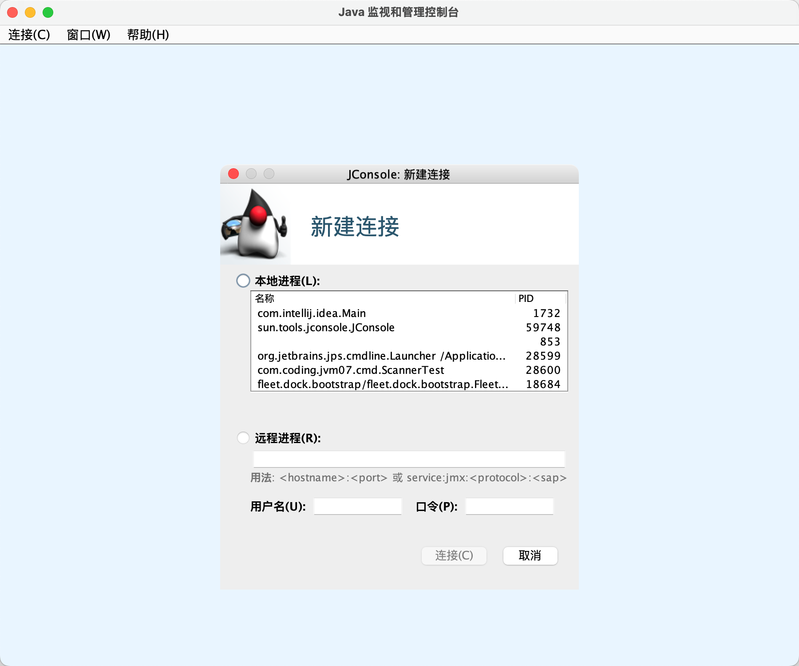

​	设置JVM参数如下，运行如下代码，然后使用jconsole进行监控。

<span style="color:#40E0D0;">案例1：jconsole示例代码</span>

- 代码

```java
package com.coding.jvm07.vmoptions;

import java.util.ArrayList;
import java.util.Random;

/**
 * -Xms600m -Xmx600m -XX:SurvivorRatio=8
 */
public class HeapInstanceTest {
    byte[] buffer = new byte[new Random().nextInt(1024 * 100)];

    public static void main(String[] args) {
        try {
            Thread.sleep(10000);
        } catch (InterruptedException e) {
            e.printStackTrace();
        }

        ArrayList<HeapInstanceTest> list = new ArrayList<>();
        while (true) {
            list.add(new HeapInstanceTest());
            try {
                Thread.sleep(20);
            } catch (InterruptedException e) {
                e.printStackTrace();
            }
        }
    }
}

```

​	选择如上代码的程序进程进入jconsole主界面，有“概览” “内存” “线程” “类” “VM概要” 和 “MBean” 六个选项卡，如下图所示。其中“概览”选项卡显示了关于堆内存使用量、线程、类、JVM进程的CPU占用率的关键监视信息。

<div style="text-align:center;font-weight:bold;">jconsole主界面</div>

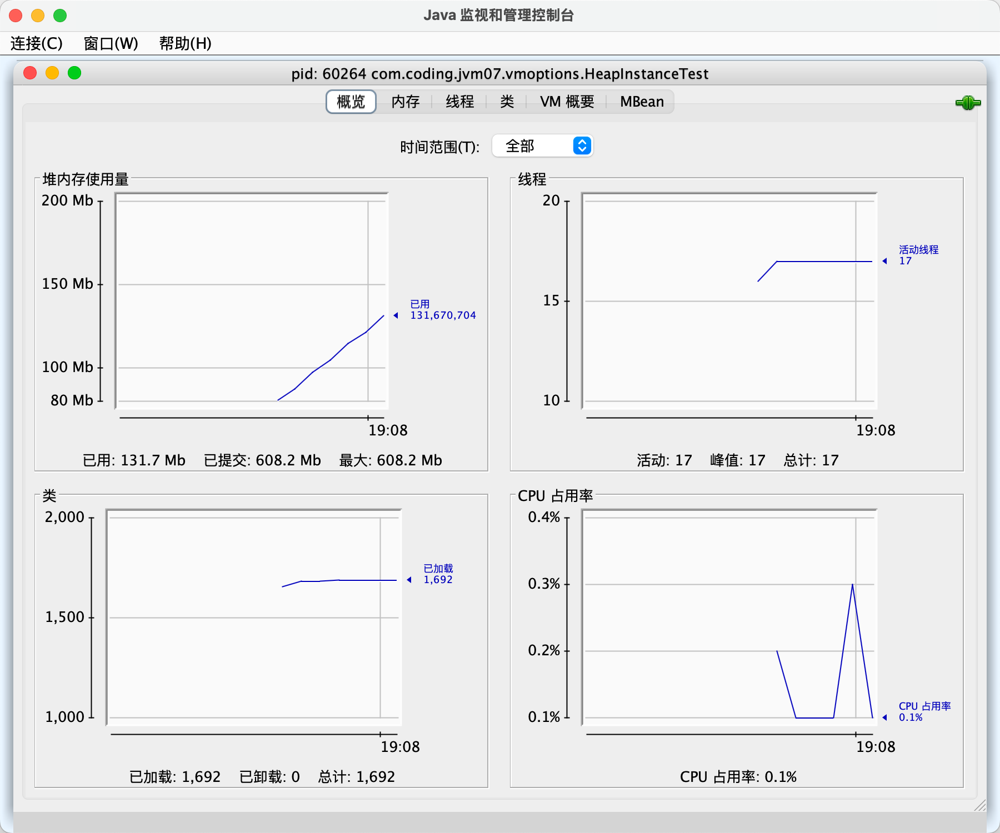

​	“内存”选项卡相当于jstat命令，用于监视收集器管理的JVM内存（Java堆和非堆）变化趋势，还可在“详细信息”选项观察GC执行的时间及次数，如下图所示。

​	“已用”代表当前使用的内存总量。使用的内存总量是指所有的对象占用的内存，包括可达和不可达的对象。

​	“已提交”内存数量会随时间变化而变化。JVM可能将某些内存释放，还给操作系统，所以已提交内存可能比启动时初始分配的内存量要少，但是已提交内存总是大于或等于已使用内存。

​	“最大值”代表内存管理可用的最大内存数量。此值可能改变或者为未定义，如果JVM试图增加使用内存容量超出了提交内存，那么即使使用内存小于或等于最大内存（比如系统虚拟内存较低），内存分配仍可能失败。

<div style="text-align:center;font-weight:bold;">内存选项卡</div>

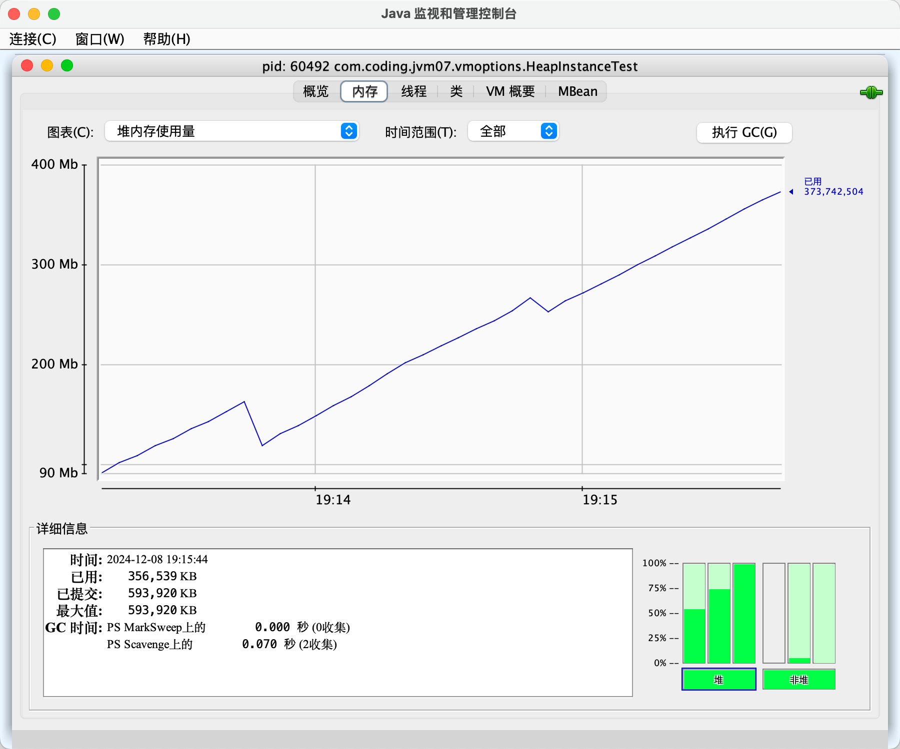

​	“线程”选项卡中活动线程代表当前活动的守护线程和非守护线程数量。峰值代表自JVM启动后，活动线程最高数量。该选项卡可以监控发生死锁的线程，在页面最下面有“检测死锁选项”。代码清单22-2演示了程序发生死锁的情况，使用jconsole检测如图22-4和图22-5所示。

<span style="color:#40E0D0;">案例2：死锁案例</span>

- 代码

```java
package com.coding.jvm07.cmd;

/**
 * 演示线程的死锁问题
 * 互相的 BLOCKED 导致-> Found one Java-level deadlock:
 */
public class ThreadDeadLock {
    public static void main(String[] args) {
        StringBuilder sb1 = new StringBuilder();
        StringBuilder sb2 = new StringBuilder();

        new Thread(() -> {
            synchronized (sb1) {
                sb1.append("a");
                sb2.append("1");

                try {
                    Thread.sleep(100);
                } catch (InterruptedException e) {
                    e.printStackTrace();
                }

                synchronized (sb2) {
                    sb1.append("b");
                    sb2.append("2");

                    System.out.println("sb1 = " + sb1);
                    System.out.println("sb2 = " + sb2);
                }
            }
        }).start();

        new Thread(() -> {
            synchronized (sb2) {
                sb1.append("c");
                sb2.append("3");

                try {
                    Thread.sleep(100);
                } catch (InterruptedException e) {
                    e.printStackTrace();
                }

                synchronized (sb1) {
                    sb1.append("d");
                    sb2.append("4");

                    System.out.println("sb1 = " + sb1);
                    System.out.println("sb2 = " + sb2);
                }
            }
        }).start();

    }
}

```

<div style="text-align:center;font-weight:bold;">“线程”选项卡</div>

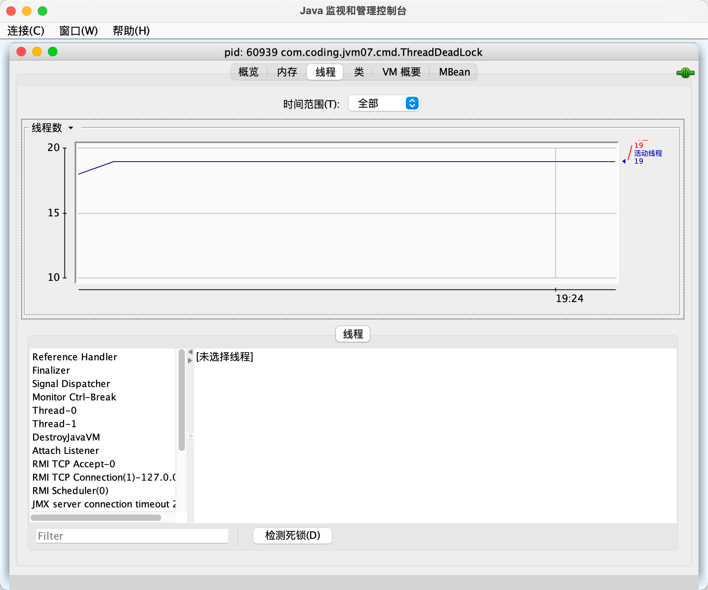

<div style="text-align:center;font-weight:bold;">线程死锁检测</div>

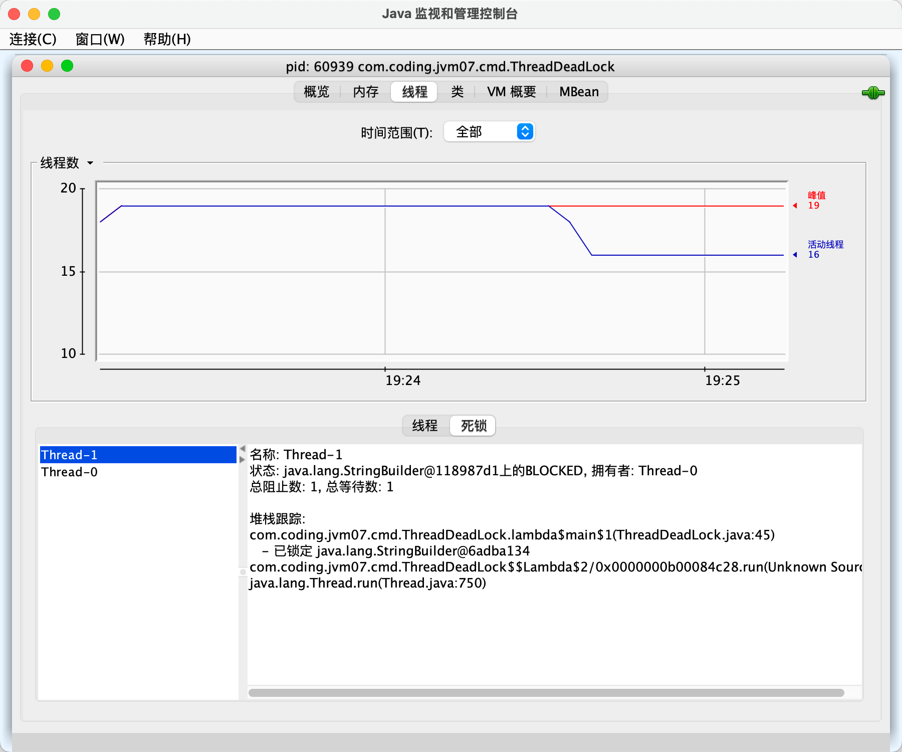

​	从上图可知线程Thread-1在等待一个被线程Thread-0持有StringBuilder对象，单击线程Thread-0则显示它也在等待一个Integer对象，被线程Thread-1持有，这样两个线程就互相卡住，都不存在等到锁释放的希望了，导致死锁。

​	VM概要”选项卡可清楚地显示指定的JVM参数及堆信息，如下图所示。

<div style="text-align:center;font-weight:bold;">VM概要”选项卡</div>

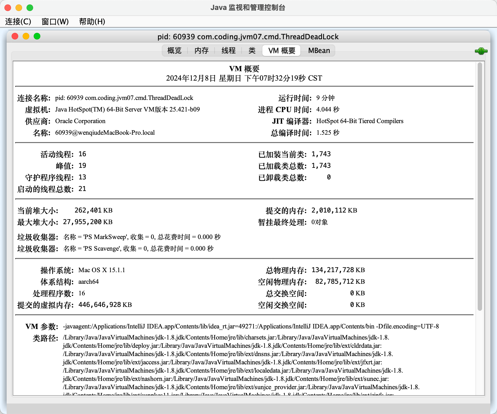

## 22.3 VisualVM

​	VisualVM是一个功能强大的故障诊断和性能监控的可视化工具。它集成了多个JDK命令行工具，使用VisualVM可用于显示JVM进程及进程的配置和环境信息（功能类似jps和jinfo命令），监视应用程序的CPU、GC、堆、方法区和线程的信息（功能类似jstat和jstack命令）等，甚至代替jconsole。在JDK6 Update 7以后，VisualVM便作为JDK的一部分发布（VisualVM在JDK/bin目录下，称为jvisualvm），这也意味着它完全免费。除了作为JDK的一部分发布以外，VisualVM也可以作为独立的软件安装，官网主页如下图所示。

​	VisualVM官网：https://visualvm.github.io/index.html

<div style="text-align:center;font-weight:bold;">VisualVM官网主页</div>

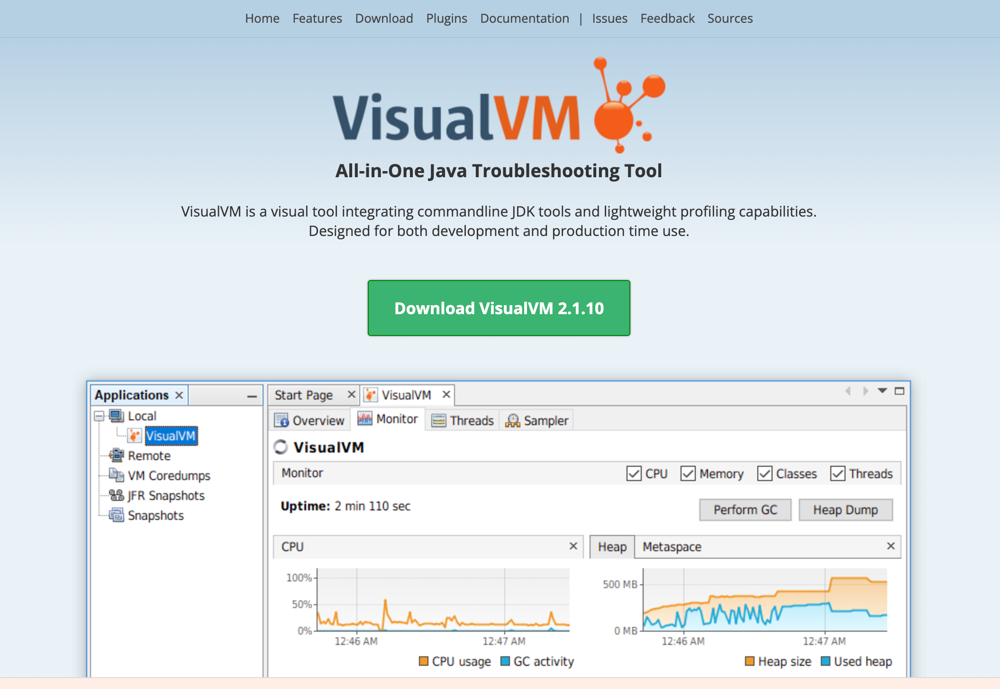

### 22.3.1 插件安装

​	VisualVM的一大特点是支持插件扩展，并且插件安装非常方便。在安装插件之前，需要先启动VisualVM，启动VisualVM有两种方式。VisualVM工具在JDK/bin目录下，双击jvisualvm.exe即可启动VisualVM。也可以直接从IntelliJ IDEA开发工具启动VisualVM监控工具。IntelliJ IDEA开发工具中安装VisualVM步骤如下。

1、点击“File”→“Settings”→“Plugins”，搜索“VisualVM Launcher”，安装重启即可，如下图所示。

<div style="text-align:center;font-weight:bold;">VisualVM Launcher插件安装</div>

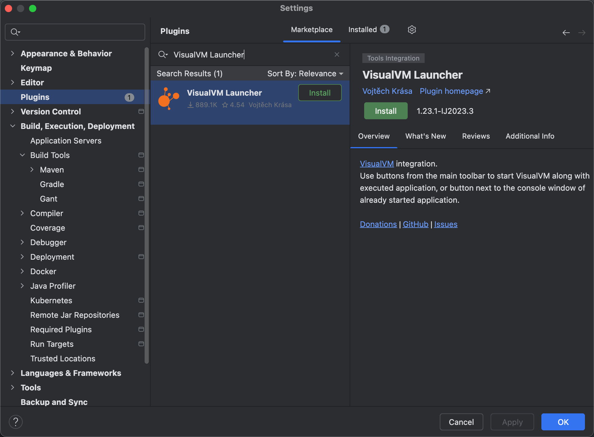

2、配置Idea VisualVM Launcher插件，如下图所示。

​	<span style="color:red;font-weight:bold;">由于Mac下Java没有随带jvisualvm命令，这里安装VisualVM。</span>

​	安装后的命令目录是：/Applications/VisualVM.app/Contents/Resources/visualvm/bin/visualvm

​	安装后的配置目录是：/Applications/VisualVM.app/Contents/Resources/visualvm/etc/visualvm.conf

<div style="text-align:center;font-weight:bold;">配置VisualVM Launcher插件</div>

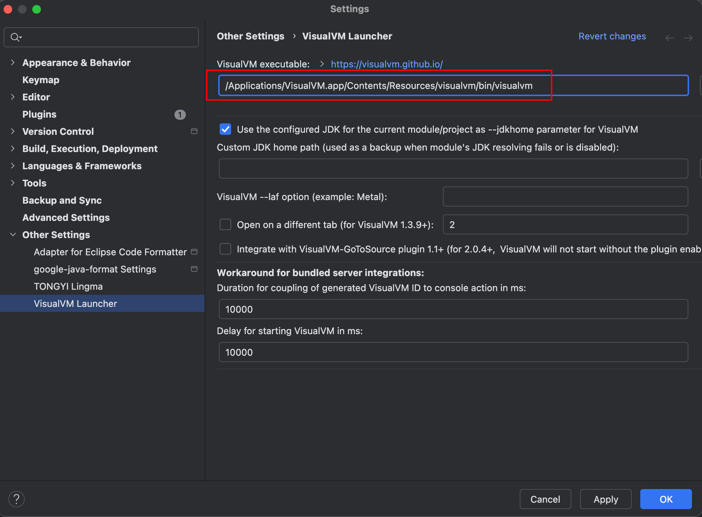

3、通过IntelliJ IDEA中的VisualVM启动应用程序，如下图所示。

<div style="text-align:center;font-weight:bold;">VisualVM Launcher启动应用程序</div>

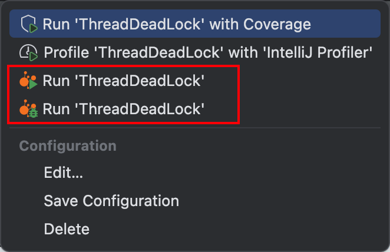

​	启动VisualVM后，可以离线下载插件文件*.nbm，然后在“插件”对话框的“已下载”选项下，添加已下载的插件即可。建议各位读者安装VisualGC插件，该插件可以查看JVM垃圾回收的具体信息，VisualVM插件主页如下图所示。

<div style="text-align:center;font-weight:bold;">VisualVM插件主页</div>


​	除了离线安装插件，也可以选择在线安装。在VisualVM中选择“工具”→“可用插件”，找到Visual GC插件，单击“安装”即可，如下图所

示。

<div style="text-align:center;font-weight:bold;">Visual GC插件在线安装</div>

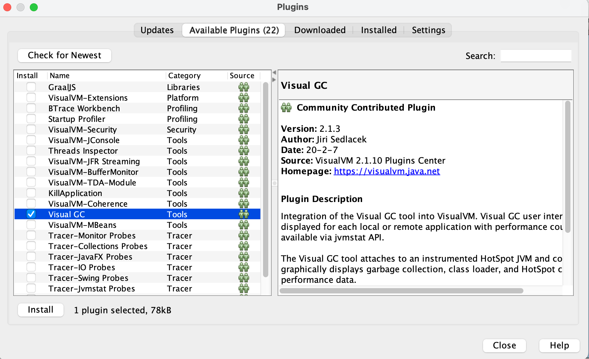


<span style="color:orange;font-weight:bold;">如何为Java VisualVM安装插件？</span>

插件地址：https://visualvm.github.io/pluginscenters.html 拷贝对应JDK版本的插件地址。

比如：

- 查看Java版本

```bash
% java -version
java version "1.8.0_91"
Java(TM) SE Runtime Environment (build 1.8.0_91-b15)
Java HotSpot(TM) 64-Bit Server VM (build 25.91-b15, mixed mode)
```

- 找到对应版本的插件地址

得到JDK 8 Update 40 - 121（包含了版本1.8.0_91）的地址，点击后打开页面 https://visualvm.github.io/archive/uc/8u40/updates.html 上寻找到：

Catalog URL:	https://visualvm.github.io/archive/uc/8u40/updates.xml.gz

打开 `jvisualvm` -> 【工具】 -> 【插件】 -> 【设置】 -> 【编辑】 -> 粘贴拷贝的地址，结果如下：


配置之后，点击【可用插件】面板，选择Visual GC 和 BTrace Workbench插件。

其他插件类似。

### 22.3.2 连接方式

​	启动VisualVM工具之后，它将自动搜索本机运行的JVM进程，同样不需要jps命令来查询指定。双击其中一个本地JVM进程即可开始监控，也可使用远程连接来连接远程服务器，如下图所示。

<div style="text-align:center;font-weight:bold;">VisualVM连接应用程序</div>

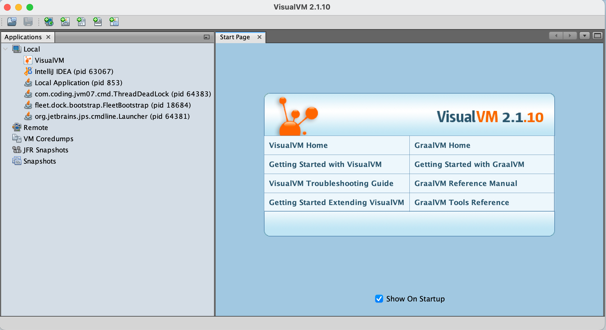

远程连接的时候需要注意以下事项。
(1)确定远程服务器的ip地址。
(2)添加JMX，通过JMX技术监控远端服务器具体是哪个Java进程。
(3)如果连接的服务器是Tomcat，需要修改bin/catalina.sh文件。
(4)在.../conf中添加jmxremote.access和jmxremote.password文件。
(5)如果服务部署在阿里云，需要将服务器地址改为公网ip地址并且设置阿里云安全策略和防火墙策略。
(6)启动tomcat，查看tomcat启动日志和端口监听。
(7)JMX中输入端口号、用户名、密码登录。

### 22.3.3 主要功能

​	下面介绍VisualVM的主要功能，包括使用VisualVM生成内存快照、查看JVM参数、系统属性、查看运行中的JVM进程、生成／读取线程快照和程序资源的实时监控等。

**1 使用VisualVM生成内存快照**

​	VisualVM生成内存快照的方式有两种，如下所示。

1、在“应用程序”窗口中右击应用程序节点，然后选择“堆Dump”，如下图所示。

<div style="text-align:center;font-weight:bold;">VisualVM生成堆快照方式1</div>

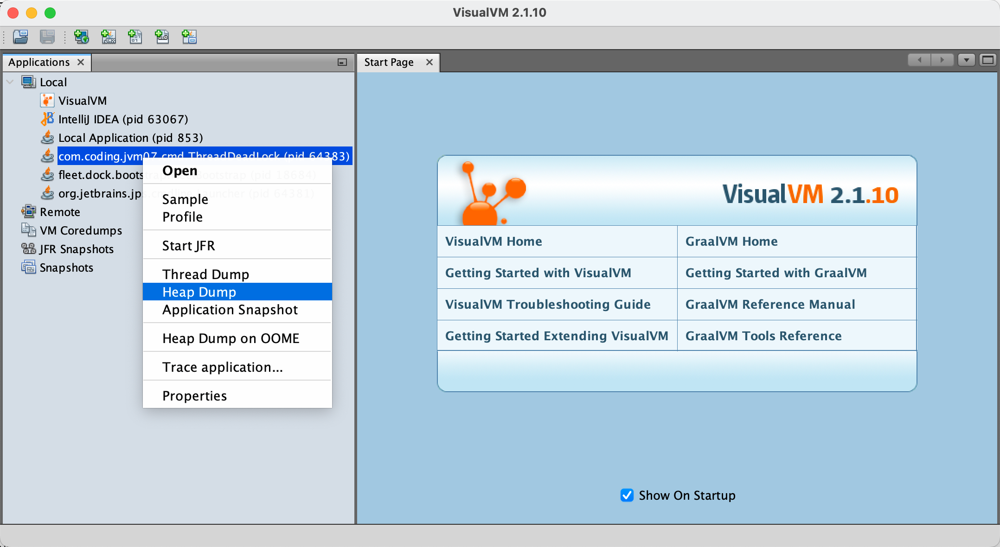

2、在“应用程序”窗口中双击应用程序节点以打开应用程序标签，然后在“监视”标签中单击“堆Dump”，如下图所示。

<div style="text-align:center;font-weight:bold;">VisualVM生成堆快照方式2</div>

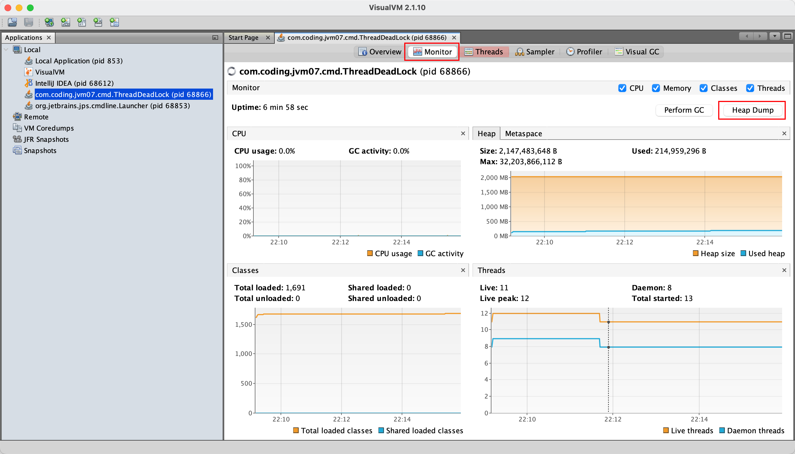

​	VisualVM生成内存快照之后，选择内存快照文件，右击“另存为”按钮，即可保存内存快照到本地目录，如下图所示。

<div style="text-align:center;font-weight:bold;">VisualVM保存堆快照</div>

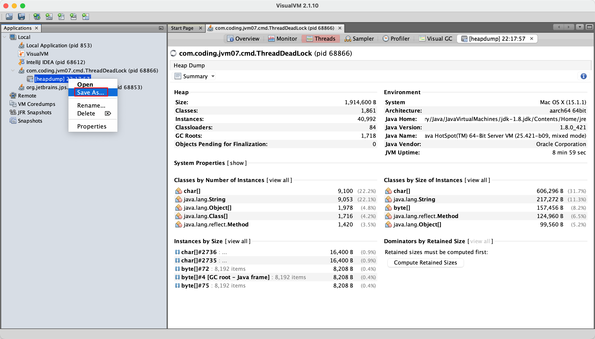

​	VisualVM中单击“文件”→“装入”，在文件类型一栏选择“堆”，选择要分析的dump文件即可打开堆文件，结果如下图所示。

​	单击“堆Dump”工具栏中的“类”，以查看活动类和对应实例的列表。双击某个类名打开“实例”视图以查看实例列表。从列表中选择某个实例查看对该实例的引用。

<div style="text-align:center;font-weight:bold;">VisualVM打开堆快照1</div>

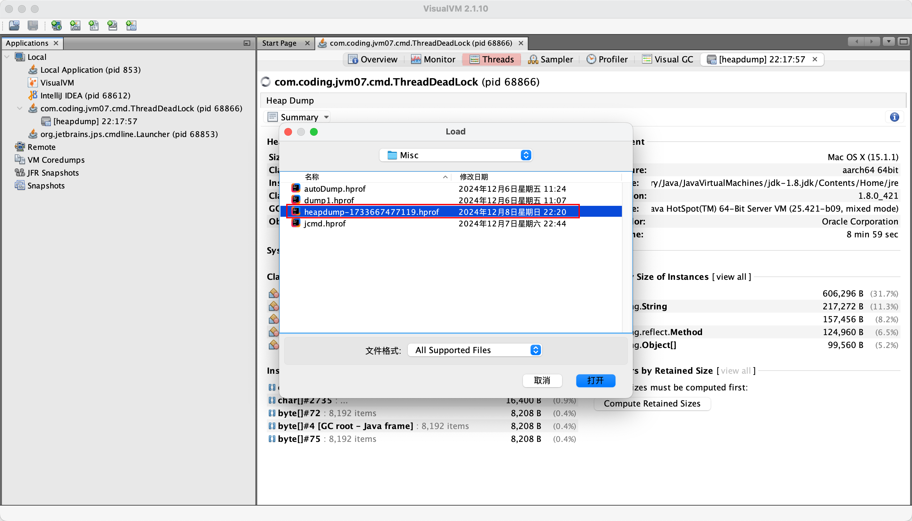

<div style="text-align:center;font-weight:bold;">VisualVM打开堆快照2</div>

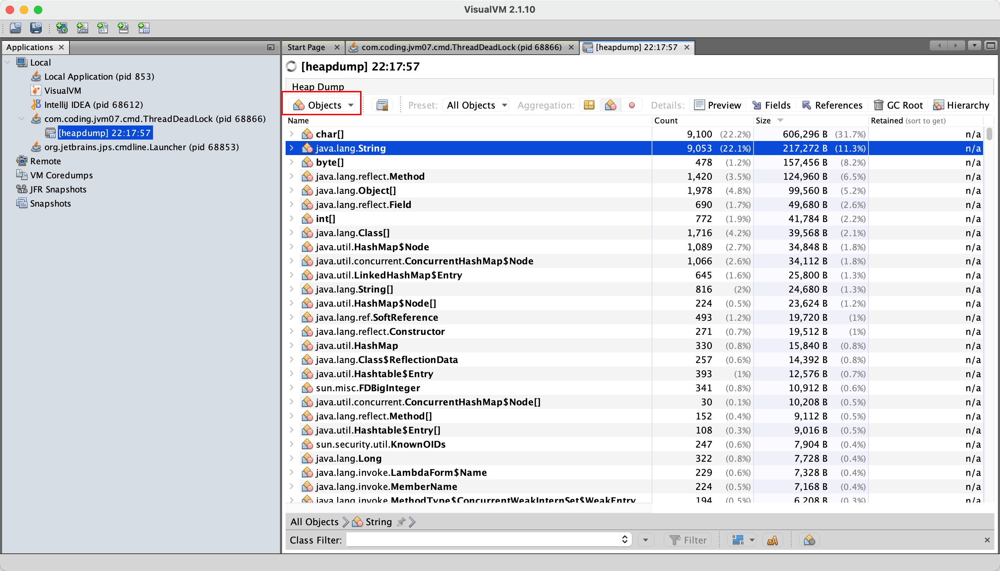

**2 查看JVM参数和系统属性**

​	使用jinfo可以查看的信息，在VisualVM中也可以查看。VisualVM查看JVM配置信息，直接在应用程序打开堆快照文件，在概述栏就可以看到JVM参数和系统属性，如下图所示。

<div style="text-align:center;font-weight:bold;">VisualVM查看JVM参数和系统属性</div>

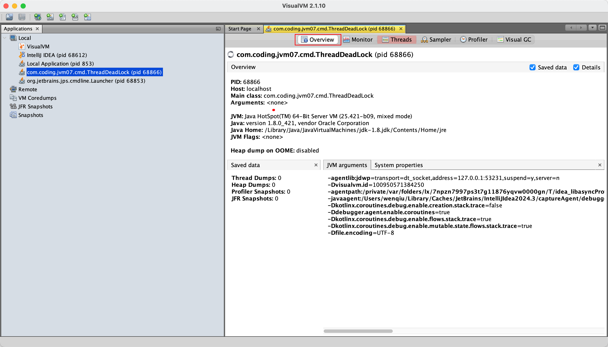

**3 查看运行中的JVM进程**

​	jps命令可以查看JVM进程信息，在VisualVM中也可以查看。VisualVM查看正在运行的JVM进程如下图所示。

<div style="text-align:center;font-weight:bold;">VisualVM查看JVM进程</div>

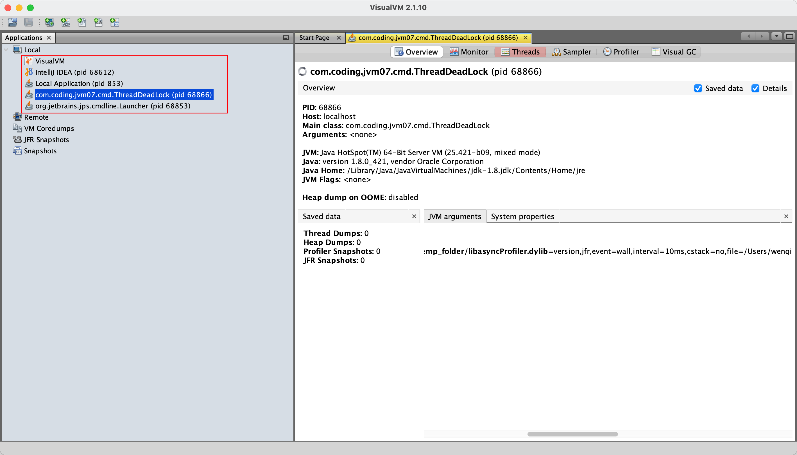

**4 查看线程快照**

​	jstack命令显示JVM当前时刻的线程快照，用来查找运行时死锁等问题的定位。VisualVM也可以生成JVM线程快照，生成线程快照的方式有两种。

1、在“应用程序”窗口中右击应用程序节点，然后选择“线程Dump”，如下图所示。

<div style="text-align:center;font-weight:bold;">VisualVM生成线程dump方式1</div>

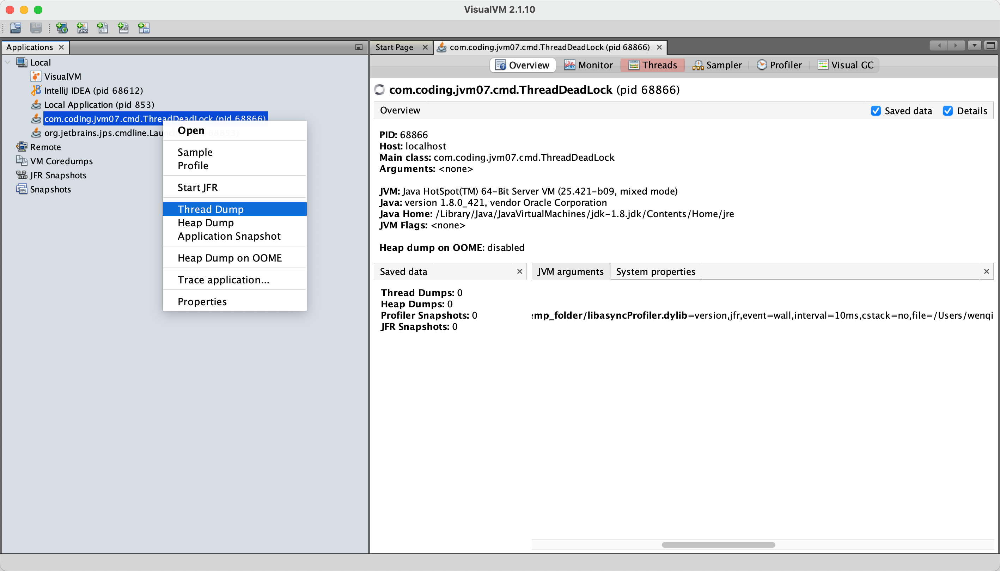

2、在“应用程序”窗口中双击应用程序节点以打开应用程序标签，然后在“线程”标签中单击“线程Dump”，如下图所示。

<div style="text-align:center;font-weight:bold;">VisualVM生成线程dump方式2</div>

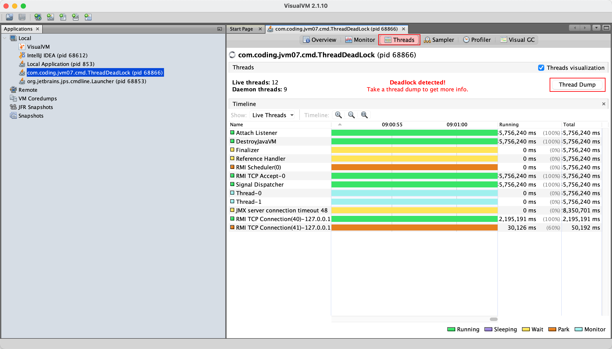

​	VisualVM在线程快照页面，也可以右击保存快照，如下图所示。

<div style="text-align:center;font-weight:bold;">VisualVM保存线程dump</div>

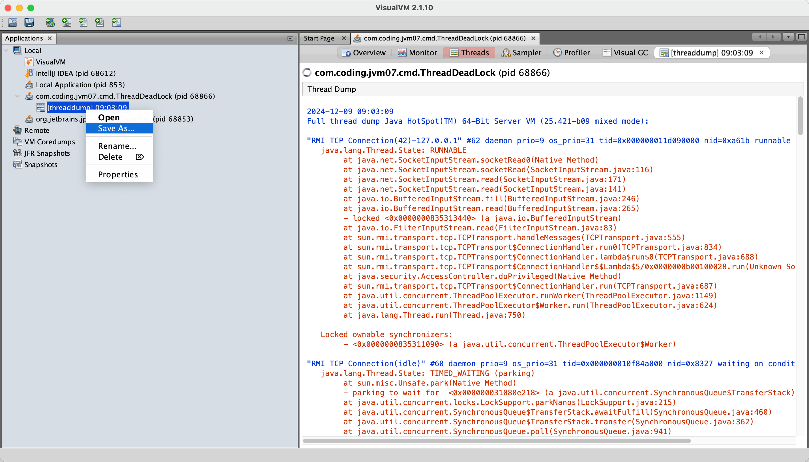

**5 使用VisualVM检测死锁**

​	依然使用代码<span style="color:blue;font-weight:bold;">案例2：死锁案例</span>，单击线程选项卡，如下图**VisualVM检测线程死锁**所示，可以看到提示信息“检测到死锁！”，单击右侧“线程Dump”按钮，即可看到死锁的明确信息，如下图**VisualVM线程dump**所示。

<div style="text-align:center;font-weight:bold;">VisualVM检测线程死锁</div>

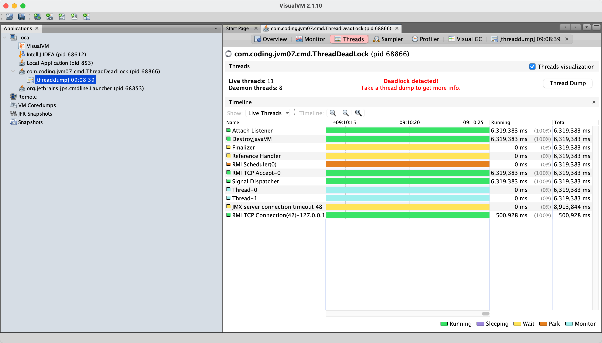

<div style="text-align:center;font-weight:bold;">VisualVM线程dump</div>


**6 程序资源的实时监控**

​	jstat命令收集HotSpot虚拟机各方面的运行数据，可以对Java应用程序的资源和性能进行实时监控，主要包括GC情况和Heap Size资源使用情况。VisualVM通过“监视”选项卡对程序资源的实时监控，如下图所示。

<div style="text-align:center;font-weight:bold;">VisualVM监视系统资源情况</div>

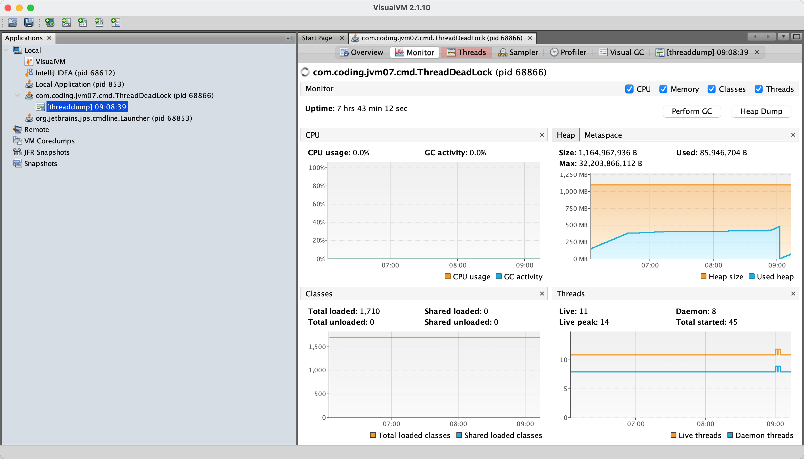

​	通过Visual GC插件查看堆内存使用情况，如下图所示。

<div style="text-align:center;font-weight:bold;">VisualVM监视系统堆内存使用情况</div>


## 22.4 Eclipse MAT

​	MAT(Memory Analyzer Tool)工具是一款功能强大的Java堆内存分析器，用于查找内存泄漏以及查看内存消耗情况。在进行内存分析时，只要获得了反映当前设备内存映像的hprof文件，通过MAT打开就可以直观地看到当前的内存信息。

​	在工作中遇到内存溢出这种灾难性的问题，那么程序肯定存在问题，找出问题至关重要。上文讲过jmap命令的使用方法，但是用jmap导出的文件，如果不使用工具看不到里面的内容，这个时候就可以使用MAT了，MAT工具能够解析这类二进制快照。MAT是基于Eclipse开发的，不仅可以单独使用，还可以作为插件的形式嵌入在Eclipse中使用。MAT是一款免费的性能分析工具，使用起来非常方便。各位读者可以下载并使用MAT，官网下载页面如下图所示。

​	MAT官网地址：https://www.eclipse.org/mat/download

<div style="text-align:center;font-weight:bold;">MAT下载页面</div>

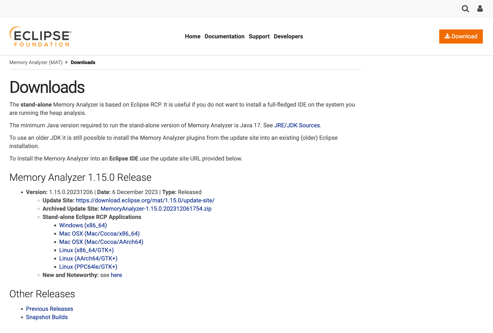

<div style="text-align:center;font-weight:bold;">MAT版本与JDK版本的关系</div>

| MAT版本                        | JDK版本 |
| ------------------------------ | ------- |
| MemoryAnalyzer-1.15.0.20231206 | 17+     |
| MemoryAnalyzer-1.14.0.20230315 | 17+     |
| MemoryAnalyzer-1.13.0.20220615 | 11+     |
| MemoryAnalyzer-1.12.0.20210602 | 11+     |
| MemoryAnalyzer-1.11.0.20201202 | 1.8+    |

​	只要确保机器上装有JDK并配置好相关的环境变量，MAT即可正常启动。也可以在Eclipse中以插件的方式安装。

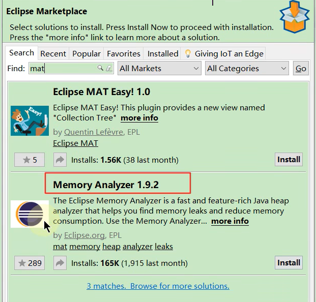

​	若启动失败？

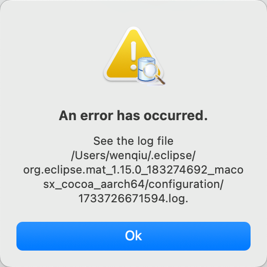

​	调整MAT的配置。

```bash
% vim /Applications/MemoryAnalyzer.app/Contents/Info.plist 
```

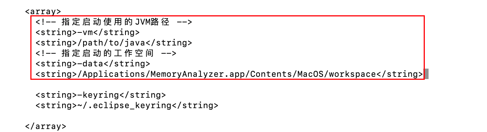

### 22.4.1 获取堆dump文件

​	MAT可以分析堆dump文件。在进行内存分析时，只要获得了反映当前设备内存映像的hprof文件，通过MAT打开就可以直观地看到当前的内存信息。一般来说，这些内存信息内容如下。

(1)所有的对象信息，包括对象实例、成员变量、存储于栈中的基本类型值和存储于堆中的其他对象的引用值。
(2)所有的类信息，包括classloader、类名称、父类、静态变量等。
(3)GCRoot到所有的这些对象的引用路径。
(4)线程信息，包括线程的调用栈及此线程的线程局部变量(TLS)。
但是MAT不是一个万能工具，它并不能处理所有类型的堆存储文件。但是比较主流的厂家和格式，例如Sun、HP、SAP所采用的HPROF二进制堆存储文件，以及IBM的PHD堆存储文件等都能被很好地解析。
MAT最吸引人的还是能够快速为开发人员生成内存泄漏报表，方便定位问题和分析问题。虽然MAT有如此强大的功能，但是内存分析也没有简单到一键完成的程度，很多内存问题还是需要我们从MAT展现给我们的信息当中通过经验来判断才能发现，使用MAT打开dump文件时，会弹出向导窗口，保持默认选项，单击“Finish”，就会导向内存泄漏报告(Leak Suspects)页面，如下图所示。

<div style="text-align:center;font-weight:bold;">MAT打开Dump时的界面</div>

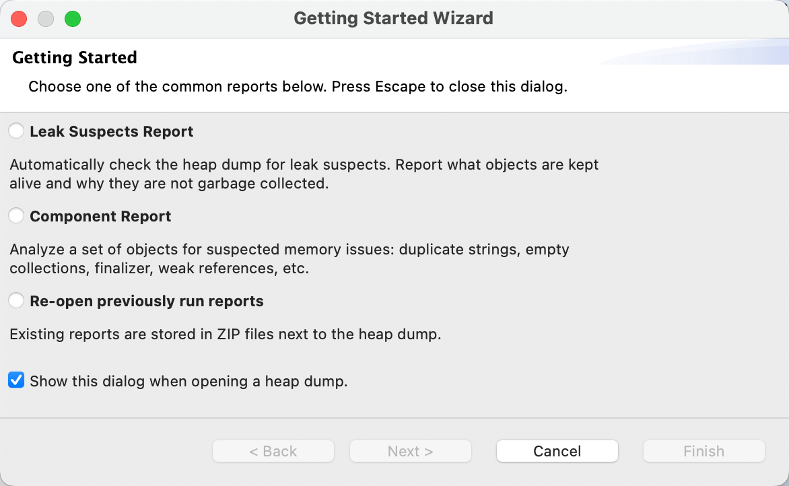

​	分析堆内存信息，首先要获取堆dump文件，获取方式有以下几种。

(1)通过第21章介绍的jmap工具生成，可以生成任意一个Java进程的dump文件。
(2)通过配置JVM参数生成，配置参数选项“-XX:+HeapDumpOnOutOfMemoryError -XX:HeapDumpPath”或“-XX:+HeapDumpBeforeFullGC”。选项“-XX:HeapDumpPath”所代表的含义就是当程序出现OutofMemory时，将会在相应的目录下生成一份dump文件。如果不指定选项“-XX:HeapDumpPath”则在当前目录下生成dump文件。考虑到生产环境中几乎不可能在线对系统分析，大都是采用离线分析，因此使用“jmap+MAT工具+配置JVM参数”是最常见的一套组合拳。

(3)使用VisualVM可以导出堆dump文件。

4)使用MAT既可以打开一个已有的堆快照，也可以通过MAT直接从活动Java程序中导出堆快照。该功能将借助jps列出当前正在运行的Java进程，以供选择并获取快照，如下图和所示。

<div style="text-align:center;font-weight:bold;">MAT获取堆dump文件</div>

<div style="dispaly:flex">
  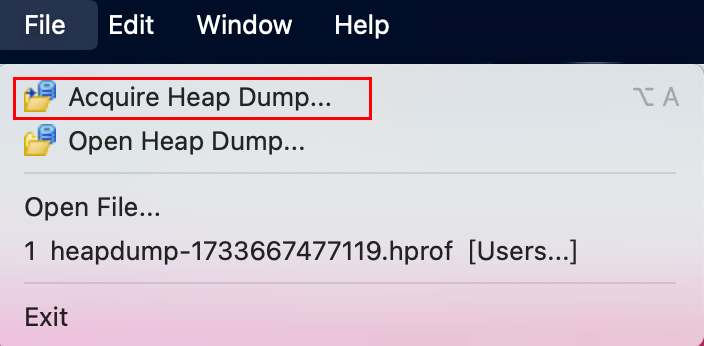
  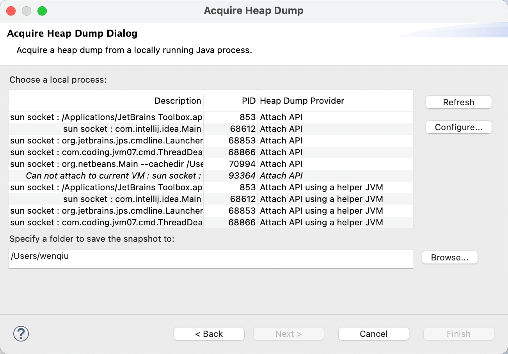
</div>

### 22.4.2 分析堆dump文件

#### Overriew-概述

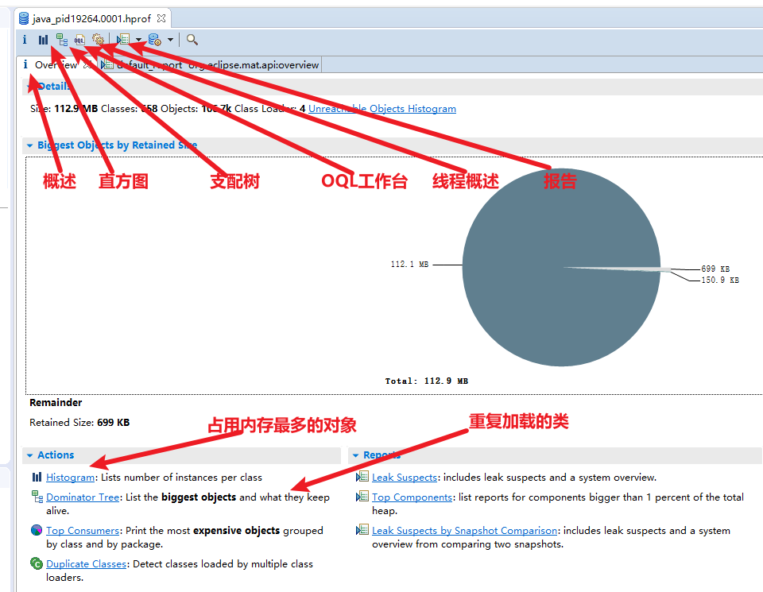

​	下面我们分别看一下MAT展示的各个标签页的含义。

#### Leak Suspects-内存泄露报告

​	打开堆dump文件，进入内存泄漏报告界面，“Leak Suspects”是MAT分析的可能有内存泄漏嫌疑的地方，可以体现出哪些对象被保存在内存中，以及为什么它们没有被垃圾回收器回收，如下图所示。

<div style="text-align:center;font-weight:bold;">内存泄漏报告界面</div>

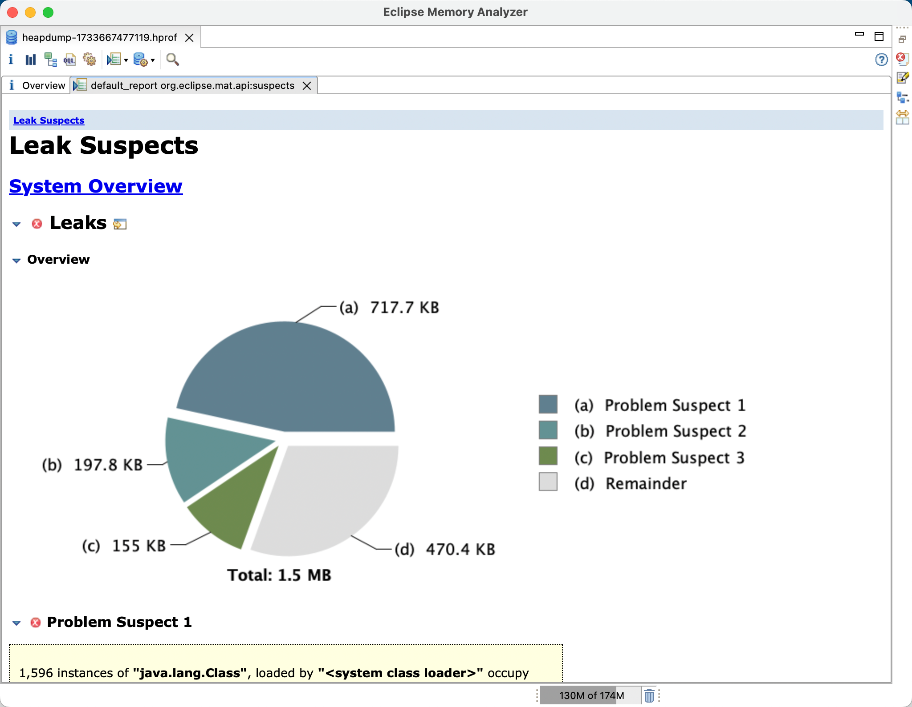

​	如果打开dump时跳过了的话，也可以从其他入口进入。

​	可以在工具栏上单击“Run Expect System Test”→“Leak Suspects”选项，如下图所示。

<div style="text-align:center;font-weight:bold;">内存泄漏报告界面入口(1)</div>

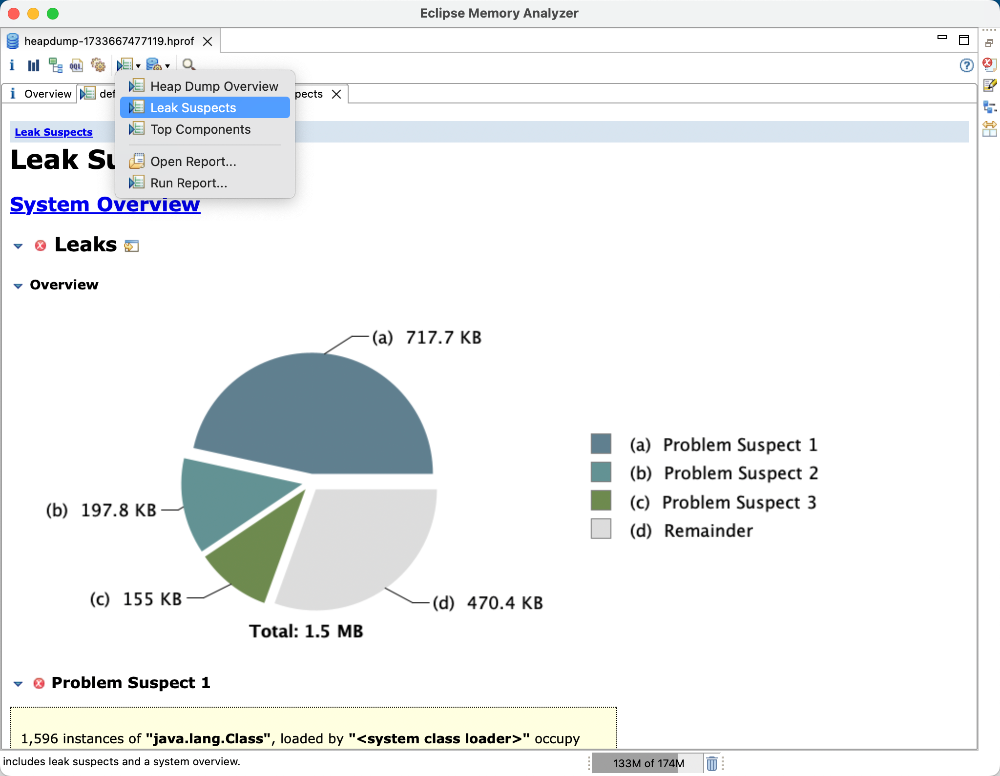

​	也可以从Overview页面的“Reports”选项中的“Leak Suspects”部分进入，如下图所示。

<div style="text-align:center;font-weight:bold;">内存泄漏报告界面入口(2)</div>

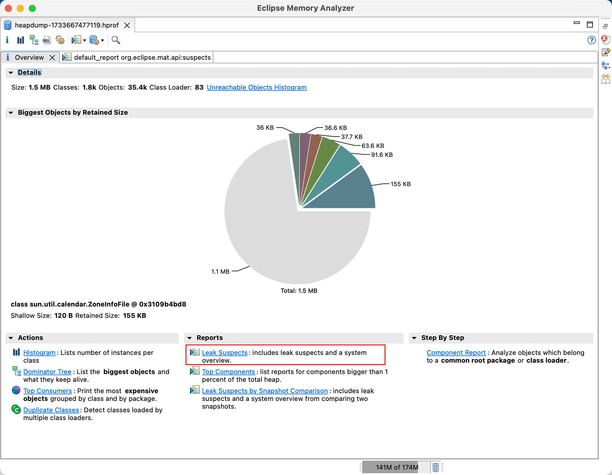

#### Histogram-直方图

​	MAT的histogram（直方图）和jmap的-histo子命令一样，都能够展示各个类的实例数目以及这些实例的浅堆(Shallow Heap)或者深堆(Retained Heap)总和。除此之外，MAT的直方图还可以将直方图中的类按照超类、类加载器或者包名分组。

​	单击Overview页面Actions区域内的“Histogram”视图，如下图所示。

<div style="text-align:center;font-weight:bold;">histogram报告界面入口</div>

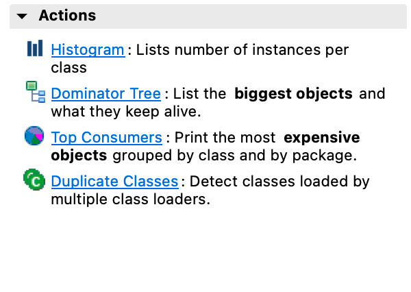

​	histogram视图如下图所示。

<div style="text-align:center;font-weight:bold;">histogram报告界面</div>

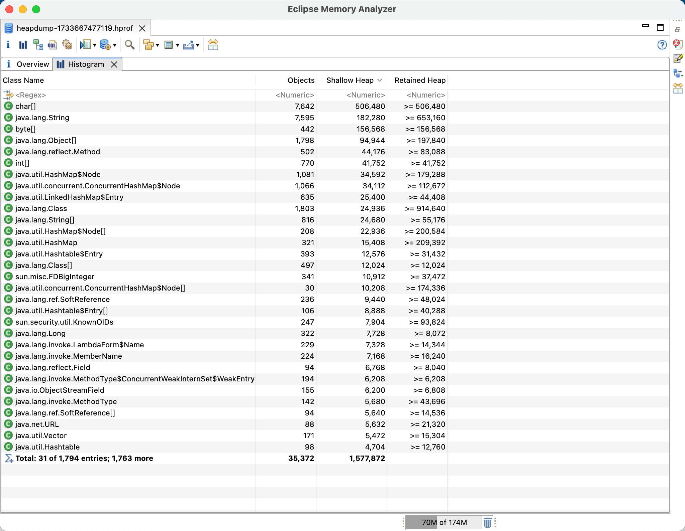

​	视图以类的维度展示每个类的实例存在的个数、占用的浅堆和深堆（见下文）大小，分别排序显示。从histogram视图可以看出，哪个类的对象实例数量比较多，以及占用的内存比较大，浅堆与深堆的区别会在下文说明。不过，多数情况下，在histogram视图看到实例对象数量比较多的类都是一些基础类型，如char[]、String、byte[]，所以仅这些是无法判断出具体导致内存泄漏的类或者方法的，可以使用“List objects”或“Merge Shortest Paths to GC roots”等功能继续分析数据。如果histogram视图展示的数量多的实例对象不是基础类型，是有嫌疑的某个类，如项目代码中自定义对象类型，那么就要重点关注了。

#### 浅堆与深堆

- Shallow Heap ： 浅堆

  <span style="color:red;font-weight:bold;">浅堆指一个对象所消耗的内存。</span>在32位系统中，一个对象引用会占4字节，一个int类型会占4字节，long型变量会占8字节，每个对象头需要占8字节。根据堆快照格式不同，对象的大小可能会向8字节进行对齐。

  以JDK7中的String为例，String类中有2个int类型属性，分别是hash32、hash,2个int值共占8字节，此外String类型的对象引用ref占用4字节，对象头8字节，合计20字节，向8字节对齐，故占24字节，如下表所示。

  | 变量类型 | 变量名 | 变量值                    |
        | -------- | ------ | ------------------------- |
  | int      | hash32 | 0                         |
  | int      | hash   | 0                         |
  | ref      | value  | C:\Users\Administrator... |

  这24字节为String对象的浅堆大小。它与String的value实际取值无关，无论字符串长度如何，浅堆大小始终是24字节。

- Retained Heap ： 深堆

  <span style="background-color:#ffe400;font-weight:bold;">保留集（Retained Set）：</span>

  在理解深堆之前，需要先了解保留集(Retained Set)的概念，<span style="color:#FF00FF;font-weight:bold;">对象A的保留集指当对象A被垃圾回收后，可以被释放的所有的对象集合（包括对象A本身），即对象A的保留集可以被认为是只能通过对象A被直接或间接访问到的所有对象的集合。通俗地说，就是指仅被对象A所持有的对象的集合</span>。

  <span style="background-color:#ffe400;font-weight:bold;">深堆（Retained Heap）：</span>

  <span style="color:red;font-weight:bold;">深堆是指对象的保留集中所有的对象的浅堆大小之和。</span>深堆和浅堆的区别是浅堆指对象本身占用的内存，不包括其内部引用对象的大小。一个对象的深堆指只能通过该对象访问到的（直接或间接）所有对象的浅堆之和，即对象被回收后，可以释放的真实空间。

  注意：浅堆指对象本身占用的内存，不包括其内部引用对象的大小。一个对象的深堆指只能通过该对象访问到的（直接或间接）所有对象的浅堆之和，即对象被回收后，可以释放的真实空间。

- 对象实际大小

  另外一个常用的概念是对象的实际大小。这里，对象的实际大小定义为一个对象所能触及的所有对象的浅堆大小之和，也就是通常意义上我们说的对象大小。与深堆相比，似乎这个在日常开发中更为直观和被人接受，<span style="color:red;font-weight:bold;">但实际上，这个概念和垃圾收集无关</span>

  下图显示了一个简单的对象引用关系图，对象A引用了C和D，对象B引用了C和E。那么对象A的浅堆大小只是A本身，不含C和D，而A的实际大小为A、C、D三者之和。而A的深堆大小为A与D之和，由于对象C还可以通过对象B访问到，因此不在对象A的深堆范围内。


<div style="text-align:center;font-weight:bold;">对象引用关系图</div>

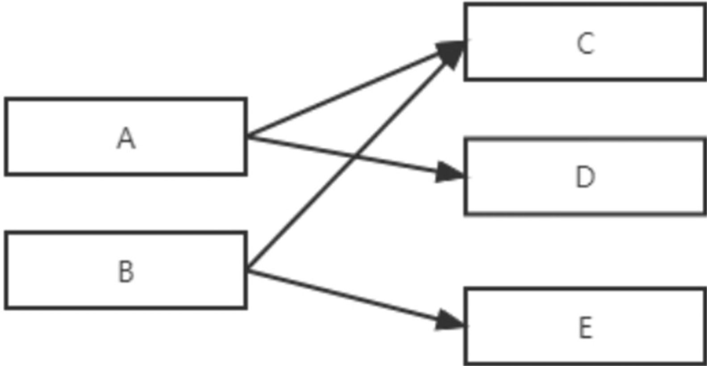

​	通过如下代码，详细了解MAT中深堆大小的计算方式，配置JVM参数，生成nurse.hprof堆文件。

<span style="color:#40E0D0;">案例1：理解深堆大小计算方式</span>

- 代码：NurseTrace类

```java
package com.coding.jvm07.gui.nurse;

import java.util.ArrayList;
import java.util.List;

/**
 * 护士给园区的工作人员注射疫苗
 * <p>
 * VM options：-XX:+HeapDumpBeforeFullGC -XX:HeapDumpPath=/Users/wenqiu/Misc/nurse.hprof
 */
public class NurseTrace {
    static List<People> peopleList = new ArrayList<>();

    /**
     * 创建100个需要打疫苗的人员
     */
    static Integer peopleNum = 100;

    public static void createInjectPeople() {
        for (int i = 0; i < peopleNum; i++) {
            People people = new People();
            people.setAddress("beijingshi" + Integer.toString(i) + "号");
            people.setNum(Integer.toString(i));
            peopleList.add(people);
        }
    }

    public static void main(String[] args) {
        // 创建了100个需要打疫苗的人员
        createInjectPeople();
        // 创建3个护士
        Nurse nurse3 = new Nurse(3, "ZhangSan");
        Nurse nurse5 = new Nurse(5, "LiSi");
        Nurse nurse7 = new Nurse(7, "WangWu");
        for (int i = 0; i < peopleList.size(); i++) {
            if (i % nurse3.getId() == 0) {
                nurse3.inject(peopleList.get(i));
            }
            if (i % nurse5.getId() == 0) {
                nurse5.inject(peopleList.get(i));
            }
            if (i % nurse7.getId() == 0) {
                nurse7.inject(peopleList.get(i));
            }
        }
        peopleList.clear();
        System.gc();
    }
}

```

- 代码：People类

```java
package com.coding.jvm07.gui.nurse;

/**
 * 需要打疫苗的人员
 */
public class People {
    /**
     * 人员信息
     */
    private String address;

    /**
     * 人员年龄
     */
    private String num;

    public String getAddress() {
        return address;
    }

    public void setAddress(String address) {
        this.address = address;
    }

    public String getNum() {
        return num;
    }

    public void setNum(String num) {
        this.num = num;
    }
}

```

- 代码：Nurse类

```java
package com.coding.jvm07.gui.nurse;

import java.util.ArrayList;
import java.util.List;

/**
 * 护士人员
 */
public class Nurse {
    private int id;
    private String name;
    private List<People> history = new ArrayList<>();

    public Nurse(int id, String name) {
        super();
        this.id = id;
        this.name = name;
    }

    public int getId() {
        return id;
    }

    public void setId(int id) {
        this.id = id;
    }

    public String getName() {
        return name;
    }

    public void setName(String name) {
        this.name = name;
    }

    public List<People> getHistory() {
        return history;
    }

    public void setHistory(List<People> history) {
        this.history = history;
    }

    public void inject(People wp) {
        if (wp != null) {
            history.add(wp);
        }
    }
}

```

​	执行后可得到hprof文件，打开堆文件，进入thread_overview页面，如下图所示。

<div style="text-align:center;font-weight:bold;">thread_overview页面</div>


​	找到3名护士的引用，如下图所示，为读者阅读方便，这里已经标出了每个实例的护士名。除了对象名称外，MAT还给出了浅堆大小和深堆大小。可以看到，所有Nurse类的浅堆统一为24字节，和它们持有的内容无关，而深堆大小各不相同，这和每名护士注射的人员多少有关。为了获得WangWu护士注射过的人员，可以在WangWu的记录中通过“外部引用(Outgoing References)”查找，就可以找到由WangWu可以触及的对象，也就是他负责注射过疫苗的人员。

<div style="text-align:center;font-weight:bold;">如何打开WangWu对象的外部引用</div>

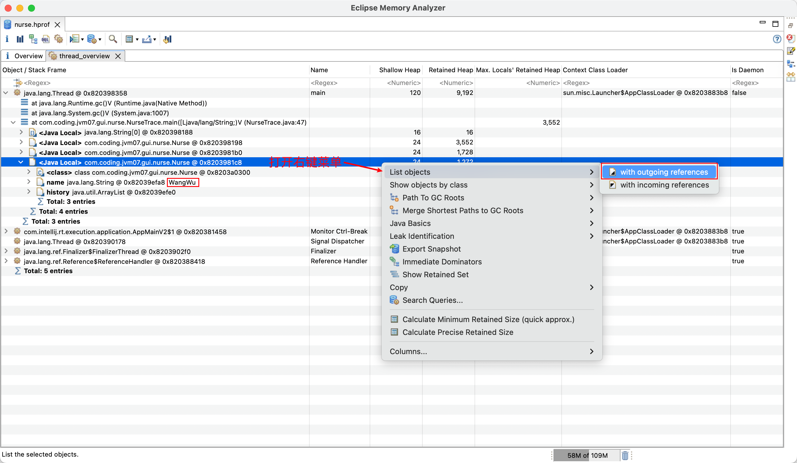

<div style="text-align:center;font-weight:bold;">WangWu对象的外部引用</div>

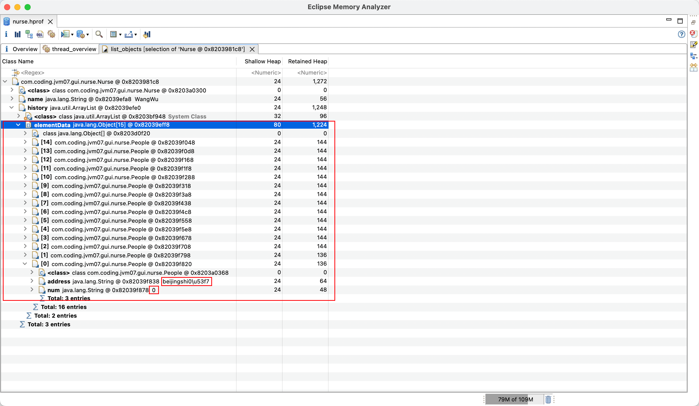

​	可以看到，堆中完整显示了所有WangWu护士的history中的人员（都是编号可以被7整除的人员）。如果现在希望查看哪些护士给“beijingshi0号”的人员注射过疫苗，则可以在对应的人员对象中通过“Incoming References”查找。如下图所示，显然该人员被3名护士都注射过疫苗，这里假如疫苗可以被注射3次。

<div style="text-align:center;font-weight:bold;">如何打开”beijingshi0号“人员的内部引用</div>

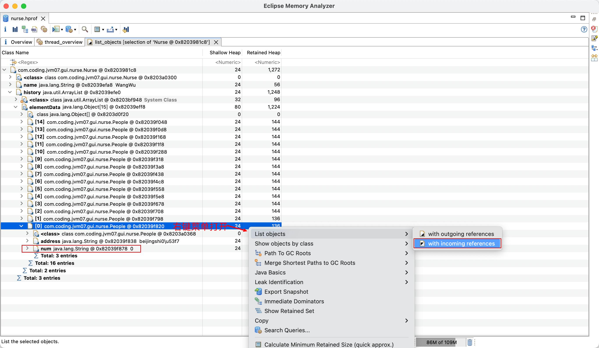

<div style="text-align:center;font-weight:bold;">”beijingshi0号“人员的内部引用</div>

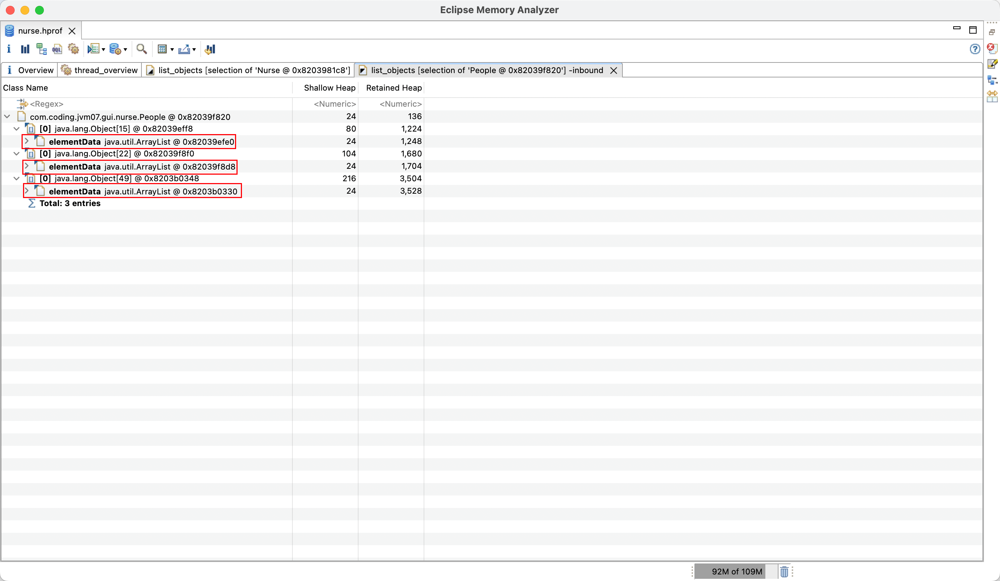

​	在这个实例中，我们再来理解一下深堆的概念，如图<span style="color:blue;font-weight:bold;">WangWu对象的外部引用</span>所示，在护士WangWu注射疫苗的人群中，一共有15条数据，其中13条People占144字节的空间（深堆），2条People占136字节的空间（深堆），之所以会产生不同的字节数，是因为地址长度不一样造成的。而15条数据合计共占13×144+2×136 = 2144字节。而history中的elementData数组实际深堆大小为1224字节。这是因为部分人员People既被WangWu注射疫苗，又被其他护士注射疫苗，因此WangWu并不是唯一可以引用到它们的对象，对于这些对象的大小，自然不应该算在护士WangWu的深堆中。根据程序的规律，只要人员编号(num)被3或者5整除，都不应该计算在内，满足条件的人员编号（能被3和7整除，或者能被5和7整除）有0、21、35、42、63、70、84。它们合计大小为1×136+6×144=1000字节，故WangWu的history对象中的elementData数组的深堆大小为2144-1000+80=1224字节。这里的80字节表示elementData数组的浅堆大小，由于elementData数组长度为15，每个引用占4字节，合计4×15=60字节，数组对象头大小为12字节（Object[] elementData，对象头8字节+引用4字），数组长度占4字节，合计60 + 8 + 4 = 76字节，须向后看齐8字节，对齐填充后最终为80字节。

#### Dominator Tree-支配树

​	支配树(Dominator Tree)的概念源自图论。MAT提供了一个称为支配树的对象图。支配树体现了对象实例间的支配关系。在对象引用图中，所有指向对象B的路径都经过对象A，则认为对象A支配对象B。如果对象A是离对象B最近的一个支配对象，则认为对象A为对象B的直接支配者。支配树是基于对象间的引用图所建立的，它有以下基本性质。

​	对象A的子树（所有被对象A支配的对象集合）表示对象A的保留集(Retained Set)，即深堆。如果对象A支配对象B，那么对象A的直接支配者也支配对象B。支配树的边与对象引用图的边不直接对应。如下图所示，左图表示对象引用图，右图表示左图所对应的支配树。对象A和对象B由根对象直接支配，由于在到对象C的路径中，可以经过对象A，也可以经过对象B，因此对象C的直接支配者也是根对象。对象F与对象D相互引用，因为到对象F的所有路径必然经过对象D，因此，对象D是对象F的直接支配者。而到对象D的所有路径中，必然经过对象C，即使是从对象F到对象D的引用，从根节点出发，也是经过对象C的，所以，对象D的直接支配者为对象C。

<div style="text-align:center;font-weight:bold;">支配树例图</div>

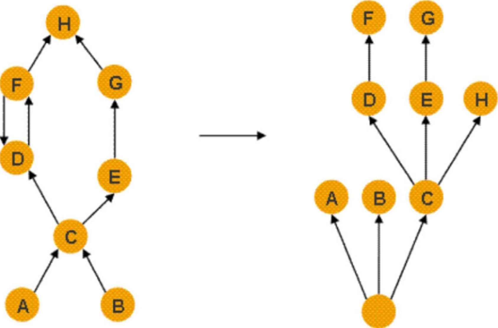

​	同理，对象E支配对象G。到达对象H的可以通过对象D，也可以通过对象E，因此对象D和对象E都不能支配对象H，而经过对象C既可以到达对象D也可以到达对象E，因此对象C为对象H的直接支配者。在MAT中，单击工具栏上的对象支配树按钮，可以打开对象支配树视图，如下图所示。

<div style="text-align:center;font-weight:bold;">MAT支配树</div>

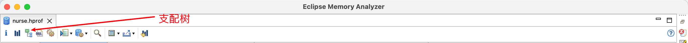

​	下图显示了对象支配树视图的一部分。该截图显示部分WangWu护士的history队列的直接支配对象。即当WangWu对象被回收，也会一并回收的所有对象。显然能被3或者5整除的人员不会出现在该列表中，因为它们同时被另外两名护士对象引用。

<div style="text-align:center;font-weight:bold;">MAT支配树界面</div>


#### Thread Overview-线程概述

​	Thread Overview界面的入口在工具栏上，如下图所示。

<div style="text-align:center;font-weight:bold;">MAT Thread Overview界面入口</div>

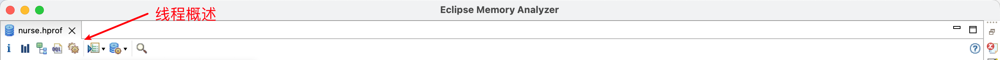

​	Thread Overview界面如下图所示。

<div style="text-align:center;font-weight:bold;">MAT Thread Overview界面</div>

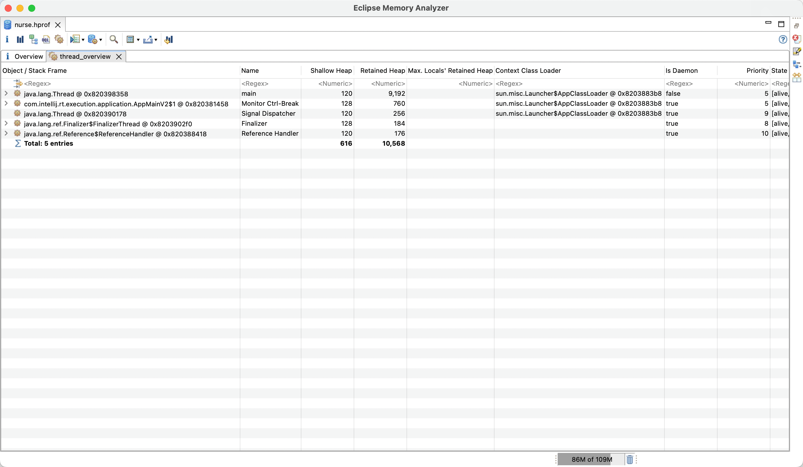

​	在Thread Overview视图可以看到线程对象／线程栈信息、线程名、Shallow Heap、Retained Heap、类加载器、是否Daemon线程等信息。

​	在分析内存Dump的MAT中还可以看到线程栈信息，这本身就是一个强大的功能，类似于jstack命令的效果。而且还能结合内存Dump分析，看到线程栈帧中的本地变量，在左下方的对象属性区域还能看到本地变量的属性。

#### 获得对象相互引用的关系

​	在Histogram或Dominator Tree视图中，想要看某个条目（对象／类）的引用关系图，可以使用“List objects”功能。在某个条目上右击，选择“List object”，如下图所示。

<div style="text-align:center;font-weight:bold;">查看对象引用关系</div>

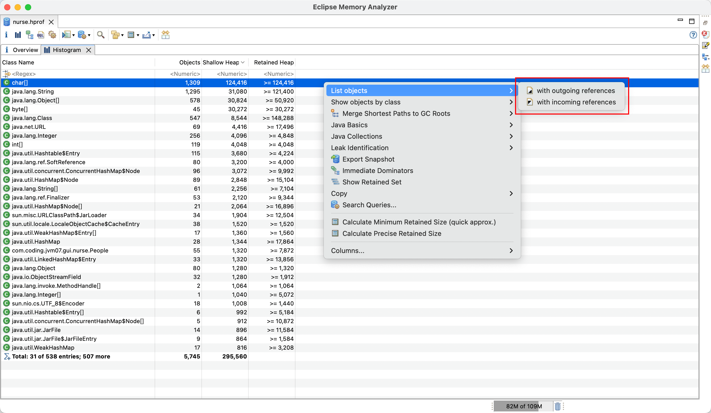

​	“with outgoing references”表示查看当前对象持有的外部对象引用，“with incoming references”表示查看当前对象被哪些外部对象引用。

假设对象A和对象B持有对象C的引用；对象C持有对象D和对象E的引用。

- List Objects
    - with outgoing references ： 对象C引用的所有对象都称为 outgoing references。比如：D和E对象。表示，查看C引用了那些对象。
        - C=>D
        - C=>E
    - with incoming references ： 拥有对象C的引用的所有对象都称为对象C的 incoming references。比如：A和B。表示，查看谁引用了C对象。
        - A=>C
        - B=>C
- Merge Shortest Paths to GC Roots ： 查看对象到GC Roots的最短路径
    - 右键选择 exclude all phantom/wek/soft etc. references 选项

### 22.4.3 支持使用OQL语言查询对象信息

​	MAT支持一种类似于SQL的查询语言OQL(Object Query Language)。OQL使用类SQL语法，可以在堆中进行对象的查找和筛选。

​	Object Query Language界面的入口在工具栏上，如下图所示。


​	Object Query Language界面如下图所示。

<div style="text-align:center;font-weight:bold;">Object Query Language界面</div>


​	录入OQL语句后，点击红色感叹号<span style="color:red;font-weight:bold;font-size:20px;">！</span>或者F5即可执行查询。

#### Select子句

​	在MAT中，Select子句的格式与SQL基本一致，用于指定要显示的列。Select子句中可以使用“*”，查看结果对象的引用实例（相当于outgoing references）。

```sql
select * from java.util.Vector v
```

​	以上查询的输出结果如下图所示，在输出结果中，结果集中的每条记录都可以展开，查看各自的引用对象。

<div style="text-align:center;font-weight:bold;">Select查询结果</div>

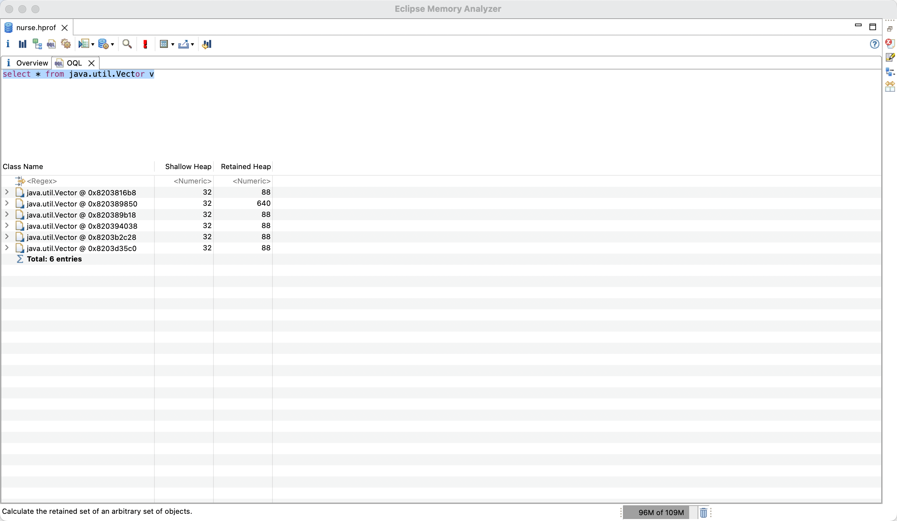

​	使用“OBJECTS”关键字，可以将返回结果集中的项以对象的形式显示，如下所示。

```sql
select objects v.elementData from java.util.Vector v
select objects s.value from java.lang.String s
```

​	结果如下图所示。

<div style="text-align:center;font-weight:bold;">OBJECTS查询结果</div>


​	Select子句中，使用“AS RETAINED SET”关键字可以得到所得对象的保留集。

```sql
select as retained set * from com.coding.jvm07.gui.nurse.Nurse
```

​	结果如下图所示。

<div style="text-align:center;font-weight:bold;">AS RETAINED SET查询结果</div>

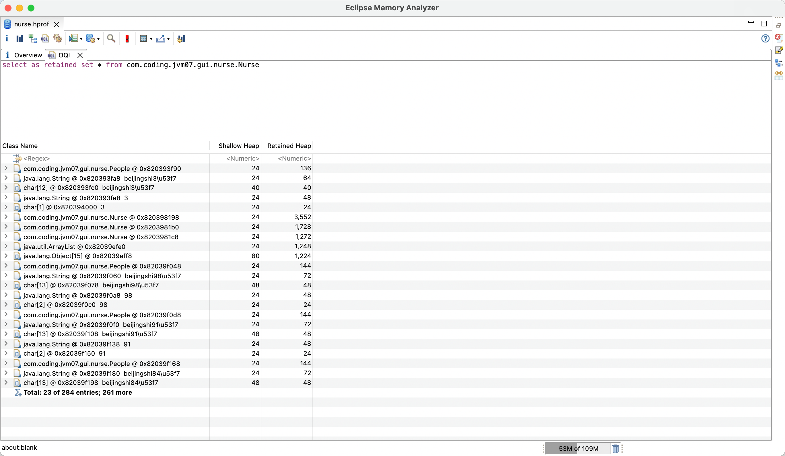

​	“DISTINCT”关键字用于在结果集中去除重复对象。

```sql
select distinct objects classof(s) from java.lang.String s
```

​	结果如下图所示。

<div style="text-align:center;font-weight:bold;">DISTINCT查询结果</div>

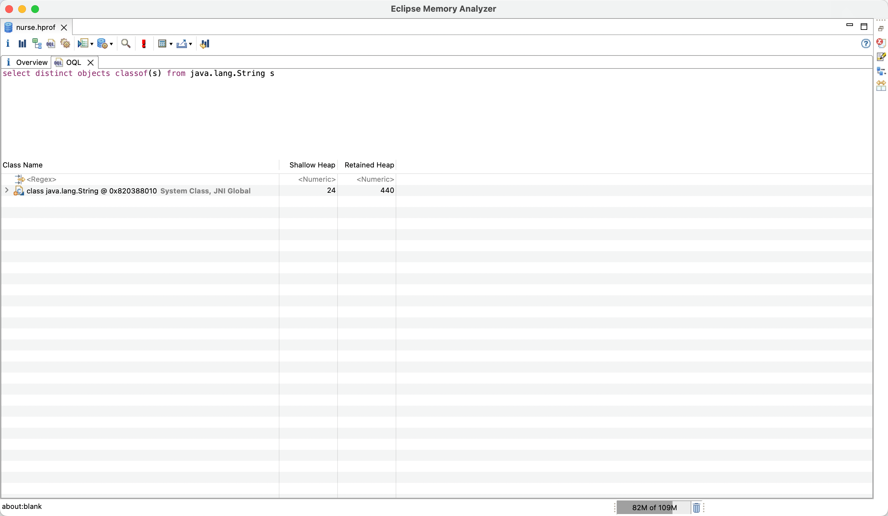

#### From子句

​	From子句用于指定查询范围，它可以指定类名、正则表达式或者对象地址。

```sql
select * from java.lang.String s
```

​	结果如下图所示。

<div style="text-align:center;font-weight:bold;">From查询结果</div>


​	下面使用正则表达式限定搜索范围，输出com.coding包下所有类的实例。

```sql
select * from "com.coding..*"
```

<div style="text-align:center;font-weight:bold;">范围查询结果</div>

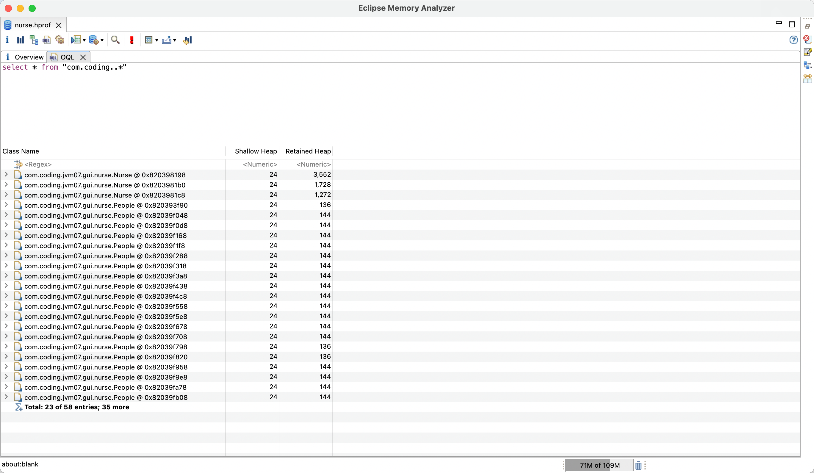

​	也可以直接使用类的地址进行搜索。使用类的地址的好处是可以区分被不同ClassLoader加载的同一种类型。

```sql
select * from 0x8203a0300
```

​	注意：0x8203a0300必须是一个`<class>`，

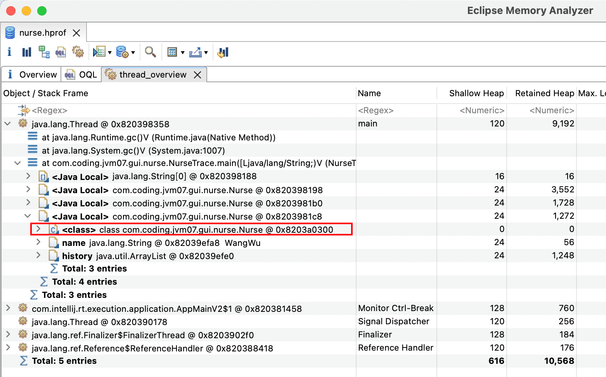

​	否则会提示：

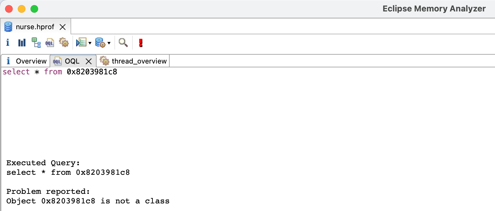

​	结果如下图所示。

<div style="text-align:center;font-weight:bold;">对象地址查询结果</div>

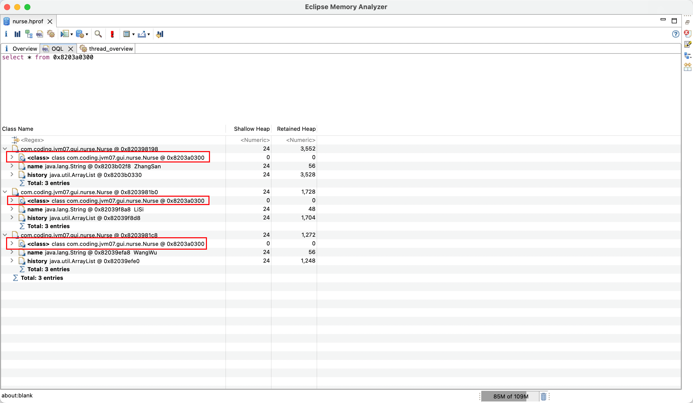

#### Where 子句

​	Where子句用于指定OQL的查询条件。OQL查询将只返回满足Where子句指定条件的对象。Where子句的格式与传统SQL极为相似。

​	下面返回长度大于10的char[]数组。

```sql
select * from char[] s where s.@length>10
```

​	结果如下图所示。

<div style="text-align:center;font-weight:bold;">Where查询结果</div>

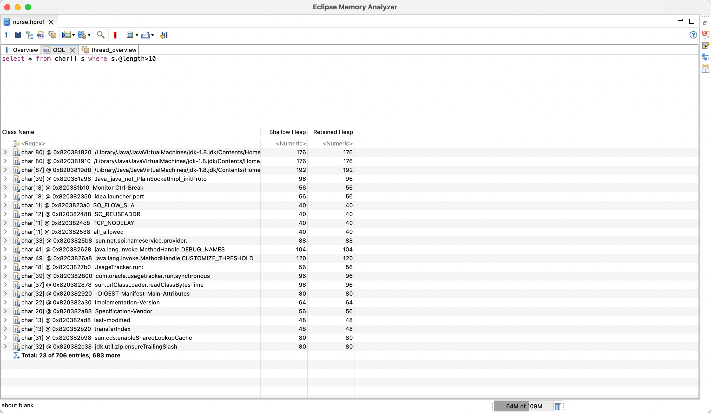

​	下面返回包含“Java”子字符串的所有字符串，使用“LIKE”操作符，“LIKE”操作符的操作参数为正则表达式。

```sql
select * from java.lang.String s where toString(s) like ".*java.*"
```

​	结果如下图所示。

<div style="text-align:center;font-weight:bold;">LIKE查询结果</div>


​	下面返回所有value域不为null的字符串，使用“=”操作符。

```sql
select * from java.lang.String s where s.value!=null
```

​	结果如下图所示。

<div style="text-align:center;font-weight:bold;">=”查询结果</div>

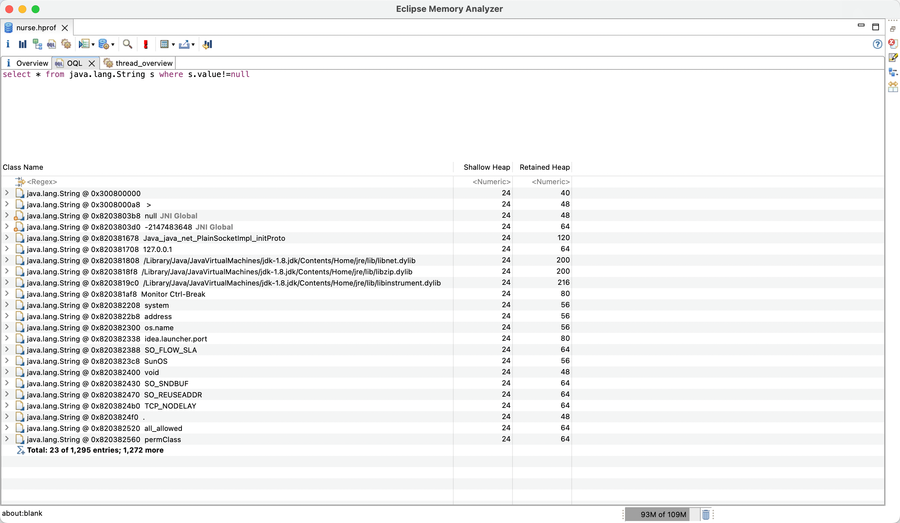

​	Where子句支持多个条件的AND、OR运算。下面返回数组长度大于5，并且深堆大于10字节的所有Vector对象。

```sql
select * from java.util.Vector v where v.elementData.@length>5 and v.@retainedHeapSize>10
```

​	结果如下图所示。

<div style="text-align:center;font-weight:bold;">多条件查询结果</div>


#### 内置对象与方法

​	OQL中可以访问堆内对象的属性，也可以访问堆内代理对象的属性。访问堆内对象的属性时格式如下，其中alias为对象名称。

```sql
[<alias>.] <field>.<field>.<field>
```

​	使用下面的语句可以访问java.io.File对象的path属性，并进一步访问path的value属性。

```sql
SELECT toString(f.path.value)FROM java.io.File f
```

​	下面的语句显示了String对象的内容、objectid和objectAddress。

```sql
SELECT s.toString(),s.@objectId,s.@objectAddress FROM java.lang.String s
```

​	下面的语句显示java.util.Vector内部数组的长度。

```sql
SELECT v.elementData.@length FROM java.util.Vector v
```

​	下面的语句显示了所有的java.util.Vector对象及其子类型。

```sql
select * from INSTANCEOF java.util.Vector
```

### 22.4.4 Tomcat案例分析

​	Tomcat是最常用的Java Servlet容器之一，同时也可以当作单独的Web服务器使用。Tomcat本身使用Java实现，并运行于JVM之上。在大规模请求时，Tomcat有可能会因为无法承受压力而发生内存溢出错误。这里根据一个被压垮的Tomcat的堆快照文件，来分析Tomcat在崩溃时的内部情况。

​	打开Tomcat堆内存文件，如下图所示，显示了Tomcat溢出时的总体信息，可以看到堆的大小为29.7MB。从统计饼图中得知，当前深堆最大的对象为StandardManager，它持有大约16.4MB的对象。

​	一般来说，我们总是会对占用空间最大的对象特别感兴趣，如果可以查看Standard Manager内部究竟引用了哪些对象，对于分析问题可能会起到很大的帮助。因此，在饼图中单击StandardManager所在区域，在弹出菜单中选择“with outgoing references”命令，查看其持有的外部对象引用，如下图所示，这样将会列出被StandardManager引用的所有对象。

<div style="text-align:center;font-weight:bold;">Tomcat堆内存文件</div>

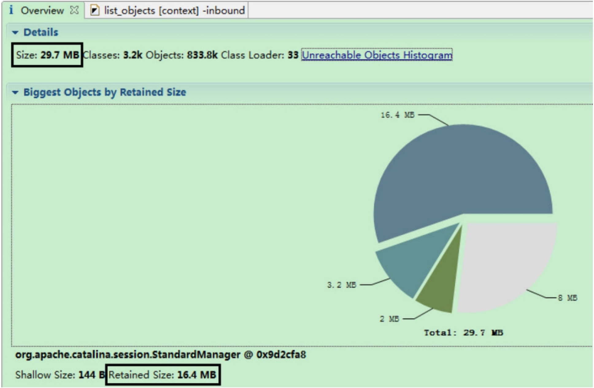

<div style="text-align:center;font-weight:bold;">StandardManager持有的外部对象引用</div>

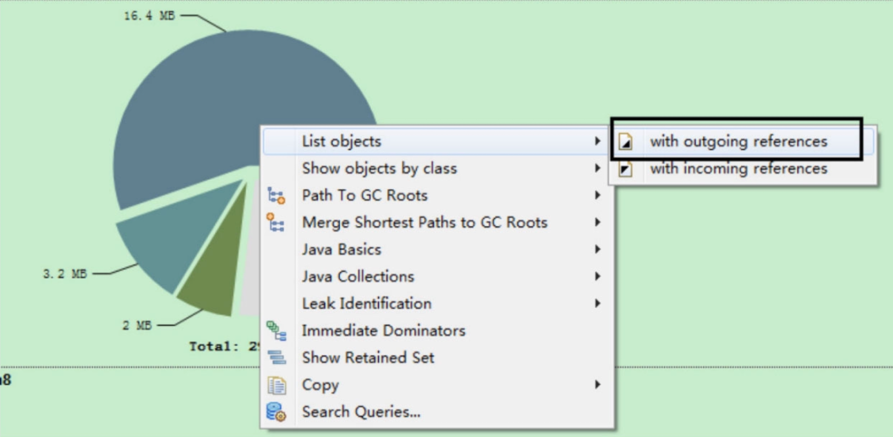

​	外部对象为sessions对象，它占用了约17MB空间，结果如下图所示。

<div style="text-align:center;font-weight:bold;">StandardManager对象的内部引用</div>

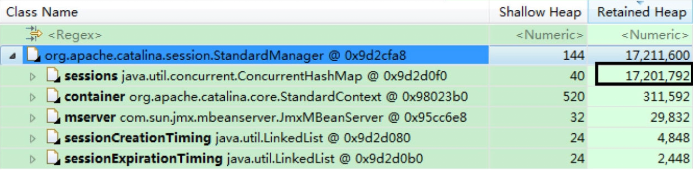

​	可以看到sessions对象为ConcurrentHashMap，其内部分为16个Segment。从深堆大小看，每个Segment都比较平均，大约为1MB，合计17MB，如下图所示。

<div style="text-align:center;font-weight:bold;">ConcurrentHashMap对象</div>

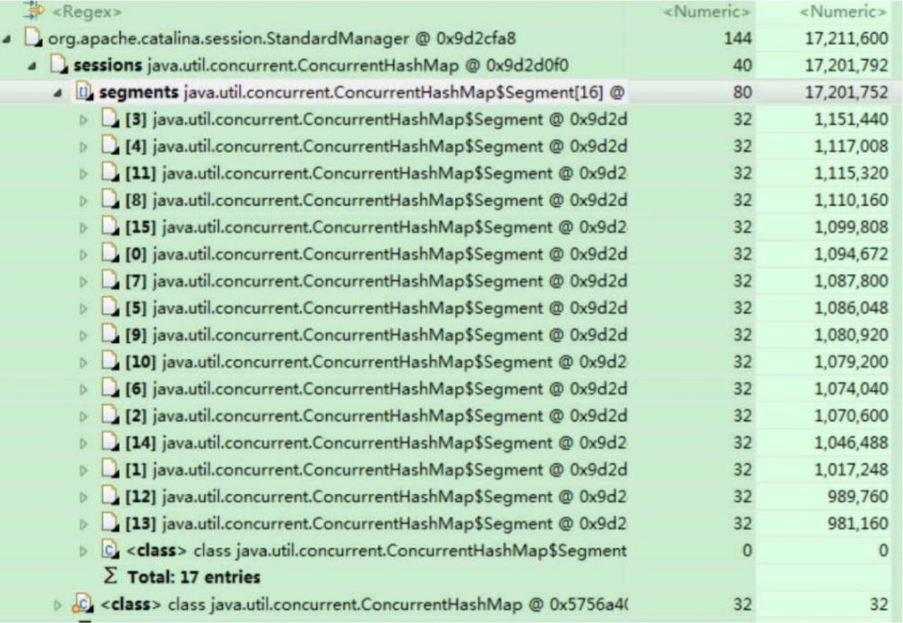

​	单击ConcurrentHashMap可以得到其value为Session对象，如下图所示。

<div style="text-align:center;font-weight:bold;">查找Session对象</div>


​	通过OQL语句“SELECT OBJECTS s from org.apache.catalina.session.StandardSession s”查找当前堆中session对象的数量，发现其含有9941个session，并且每一个session的深堆为1592字节，合计约15MB，达到当前堆大小的50%。由此可以知道，当前Tomcat发生内存溢出的原因，极可能是由于在短期内接收大量不同客户端的请求，从而创建大量session导致，如下图所示。

<div style="text-align:center;font-weight:bold;">查找所有session对象</div>

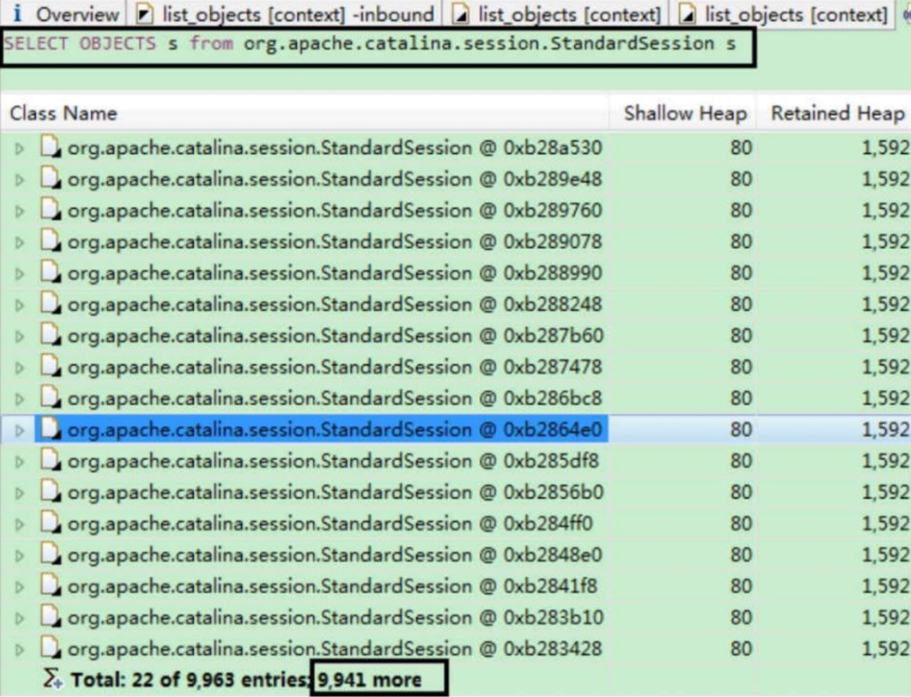

​	单击session对象，如下图所示，在左侧的对象属性表中，可以看到所选中的session的最后访问时间和创建时间。

<div style="text-align:center;font-weight:bold;">session内部数据</div>

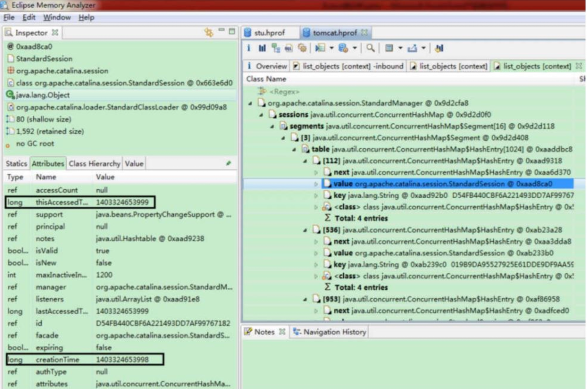

​	通过OQL语句和MAT的排序功能，可以找到当前系统中最早创建的session和最后创建的session，如下图所示。

<div style="text-align:center;font-weight:bold;">最早和最晚创建的session</div>

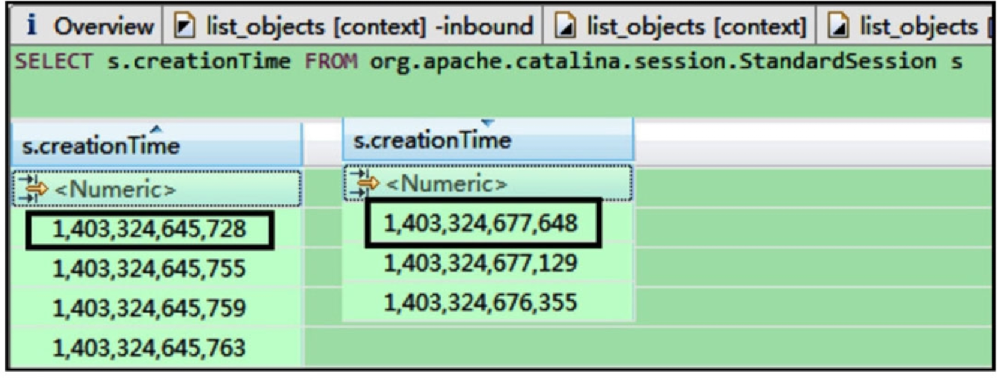

​	根据当前的session总数，可以计算每秒的平均压力为：9941/(1403324677648-1403324645728)×1000=311次／秒。由此推断，在发生Tomcat堆溢出时，Tomcat在连续30秒的时间内，平均每秒接收了约311次不同客户端的请求，创建了合计9941个session。

## 22.5 JProfiler

### 22.5.1 概述

​	如果在运行Java程序的时候想查看内存占用情况，在Eclipse里面有MAT插件可以看，在IntelliJ IDEA中也有类似的插件，就是JProfiler。JProfiler是由ej-technologies公司开发的一款Java应用性能诊断工具。

​	JProfiler使用方便、界面操作友好，对被分析的应用影响小，对系统的CPU、Thread、Memory分析功能尤其强大，支持对jdbc、noSql、jsp、servlet和socket等进行分析，支持多种模式（离线、在线）的分析，支持监控本地、远程的JVM，而且跨平台，拥有多种操作系统的安装版本。

​	主要功能有以下几个方面。

(1)对方法调用的分析可以帮助了解应用程序正在做什么，并找到提高其性能的方法。
(2)通过分析堆上对象，引用链和垃圾收集能帮助修复内存泄漏等问题。
(3)提供多种针对线程和锁的分析视图帮助分析多线程问题。
(4)支持对子系统进行集成分析，例如JDBC的调用，可以帮助找到执行比较慢的SQL语句。

### 22.5.2 安装与配置

​	官网下载页面如下图所示。

​	官网下载地址：https://www.ej-technologies.com/products/jprofiler/overview.html

<div style="text-align:center;font-weight:bold;"> JProfiler下载页面</div>


​	下载安装成功后，点击启动；启动完以后需要在JProfiler配置IntelliJ IDEA开发工具，如下所示。

(1)选择“Session”→“IDE Integration”，如下图所示。

<div style="text-align:center;font-weight:bold;">JProfiler配置IntelliJ IDEA</div>


(2)单击“Integrate”按钮，选择对应的IntelliJ IDEA版本，如下图所示。

<div style="text-align:center;font-weight:bold;">JProfiler配置IntelliJ IDEA</div>

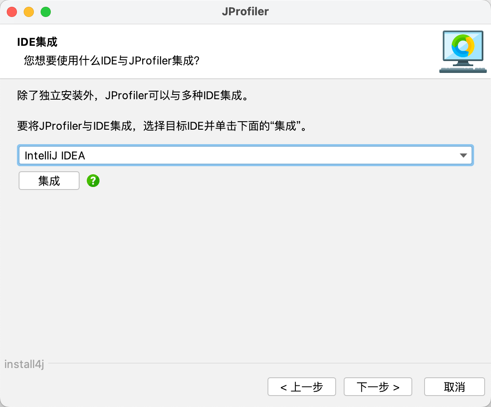

(3)单击“OK”即可，如下图所示。

<div style="text-align:center;font-weight:bold;">JProfiler配置IntelliJ IDEA</div>

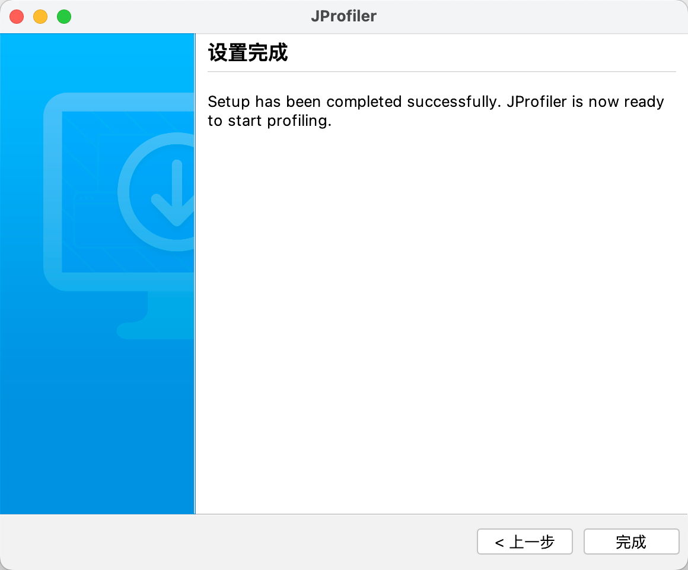

​	上面步骤执行完毕后，这里会自动配置完成。

<div style="text-align:center;font-weight:bold;">IntelliJ IDEA上的配置效果1</div>

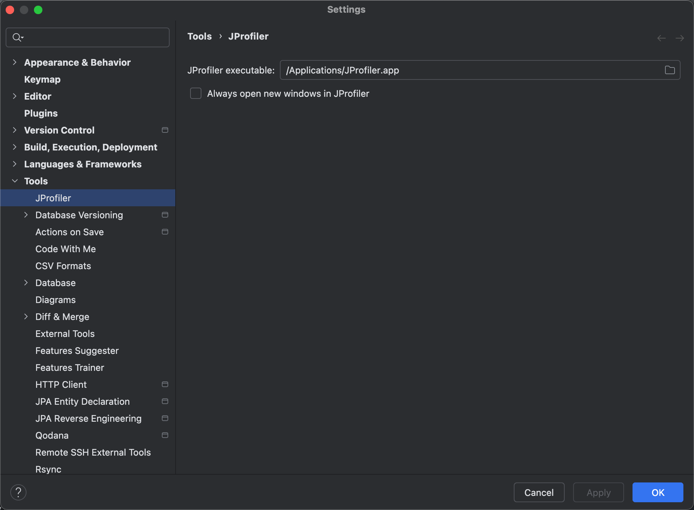

​	若要选择 Profile 'JProfilerTest' with 'IntelliJ Profiler'，会在IDEA中内嵌打开JProfiler效果如下图：

<div style="text-align:center;font-weight:bold;">IntelliJ IDEA上的配置效果2(Profile 'JProfilerTest' with 'IntelliJ Profiler')</div>


​	若要选择 Profile 'JProfilerTest' with JProfiler，会自动打开JProfiler效果如下图：

<div style="text-align:center;font-weight:bold;">IntelliJ IDEA上的配置效果3(Profile 'JProfilerTest' with JProfiler)</div>

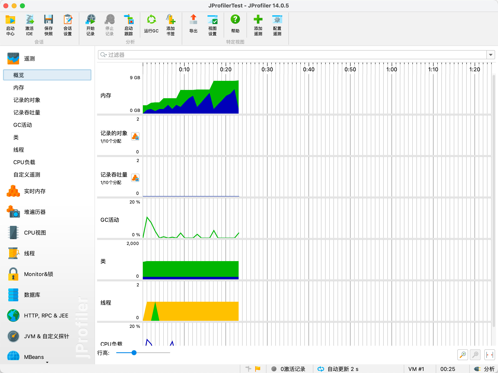

<div style="text-align:center;font-weight:bold;">IntelliJ IDEA后台日志</div>


### 22.5.3 具体使用

#### JProfier数据采集方式

​	数据采集方式分为两种，分别是Sampling（样本采集）和Instrumentation（重构模式），打开JProfier的时候进行选择，如下图所示。

<div style="text-align:center;font-weight:bold;">JProfiler数据采集方式界面</div>

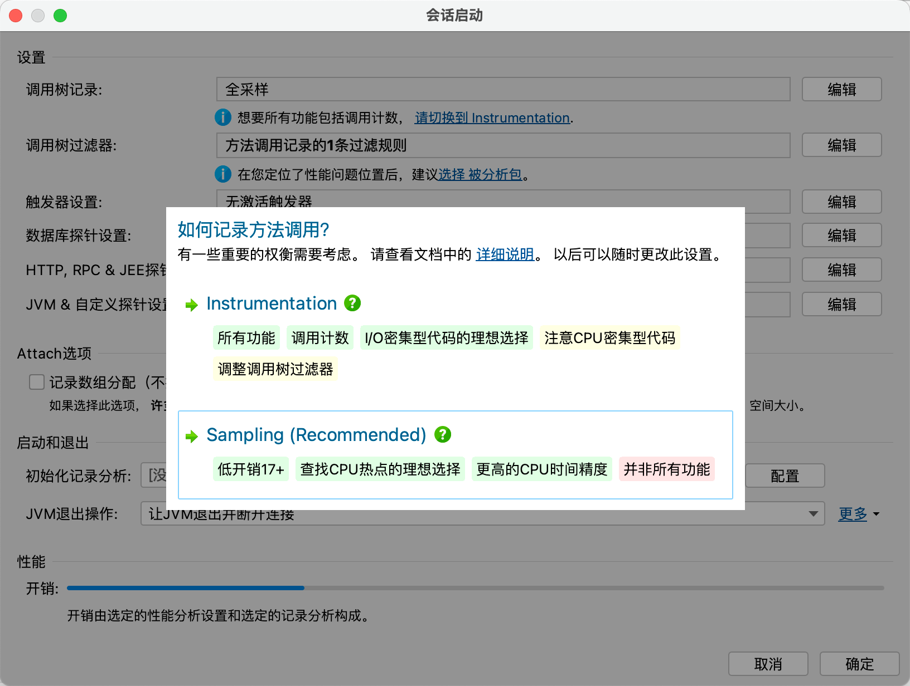

​	1、Instrumentation是JProfiler全功能模式。在加载类之前，JProfier把相关功能代码写入需要分析的class的bytecode中，对正在运行的JVM有一定影响。该方式的优点是功能强大。在此设置中，调用堆栈信息是准确的。缺点是如果要分析的class较多，则对应用的性能影响较大，CPU开销可能很高（取决于Filter的控制）。因此使用此模式一般配合Filter使用，只对特定的类或包进行分析。

​	2、Sampling类似于样本统计，每隔一定时间(5ms)将每个线程栈方法栈中的信息统计出来。该方式的优点是对CPU的开销非常低，对应用影响小。缺点是一些数据／特性不能提供，例如方法的调用次数、执行时间。

​	需要注意的是，JProfiler本身没有指出数据的采集类型，这里的采集类型是针对方法调用的采集类型。因为JProfiler的绝大多数核心功能都依赖方法调用采集的数据，所以可以直接认为是JProfiler的数据采集类型。

#### 遥感监测（Telemetries，查看JVM的运行信息）

​	1、整体视图(Overview)：显示堆内存、CPU、线程以及GC等活动视图，如下图所示。

<div style="text-align:center;font-weight:bold;">JProfiler遥感监测界面</div>

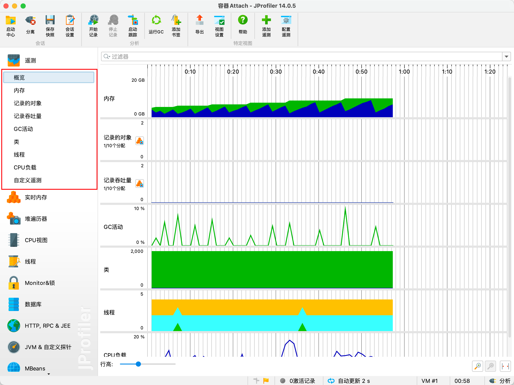

​	2、内存(Memory)：显示一张关于内存变化的活动时间表，如下图所示。

<div style="text-align:center;font-weight:bold;">JProfiler遥感监测之内存界面</div>

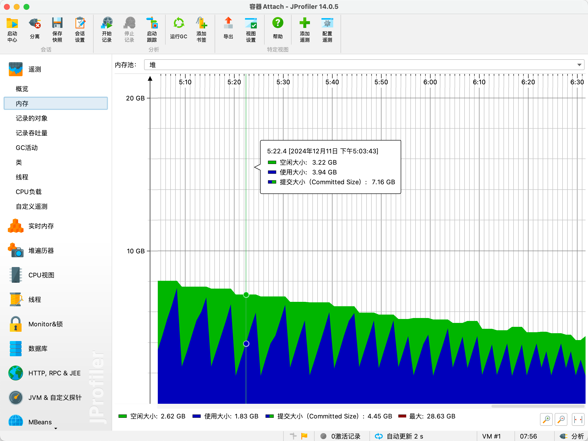

​	3、记录的对象(Recorded objects)：显示一张关于活动对象与数组的活动时间表，如下图所示，可以看到，在程序运行16分21秒后，非数组类型(Non-arrays)的活动对象的数量是130个，数组类型(Arrays)的对象是0个。

<div style="text-align:center;font-weight:bold;">JProfiler遥感监测之记录的对象界面</div>

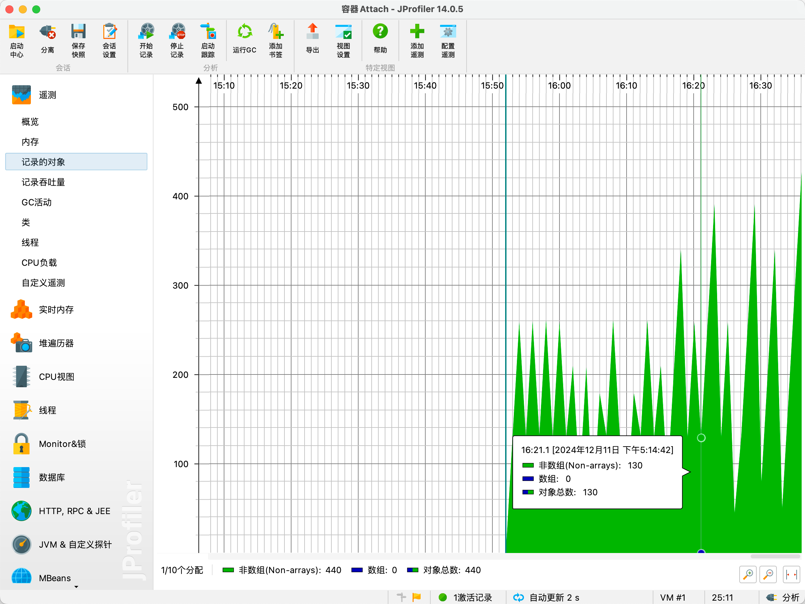

​	4、记录吞吐量(Record Throughput)：对象创建和回收对象记录，记录单位时间间隔内对象创建和回收的数量，如下图所示，在程序运行17分37秒后，JVM此时每秒回收520个对象，每秒创建87个对象。

<div style="text-align:center;font-weight:bold;">JProfiler遥感监测之吞吐量界面</div>

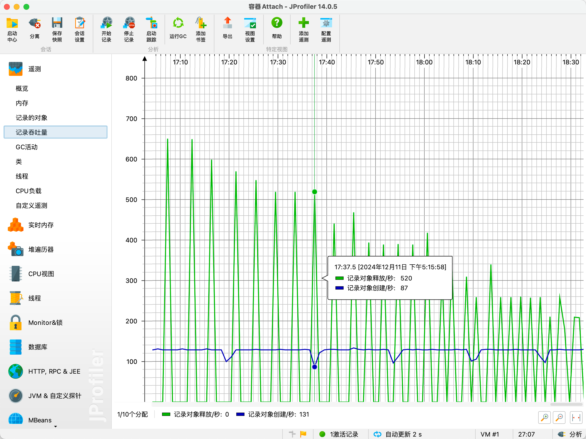

​	5、垃圾收集活动(GC Activity)：显示一张关于垃圾回收活动的活动时间表，如下图所示，可以看到在程序运行22分10秒后，JVM此时回收的内存占比是3.68%。

<div style="text-align:center;font-weight:bold;">JProfiler遥感监测之垃圾收集活动界面</div>


​	6、类(Classes)：显示一个CPU分析和非CPU分析已装载类的活动时间表，非CPU分析的类是Filter设置中未包含的类，对于样本统计，CPU将分析组成样本的类，而不分析JVM中加载的其他类。如下图所示，图中时刻CPU分析了17个类，非CPU分析的类有1895个，全部类的数量为1912个，如果想要改变CPU分析类的数量，通过“Session”→“Session Settings”→“Define Filters”即可在Filter选项中设置。

<div style="text-align:center;font-weight:bold;">JProfiler遥感监测之类界面</div>

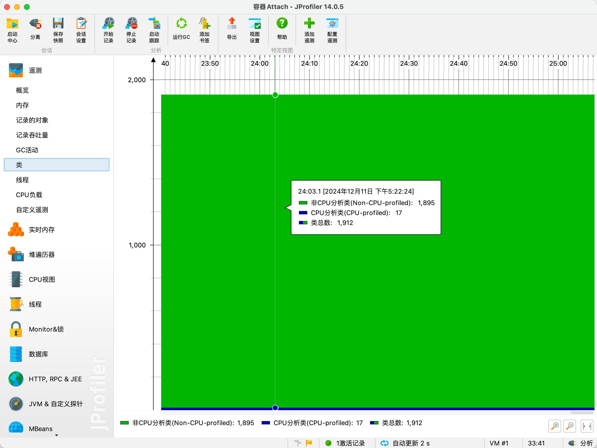

​	7、线程(Threads)：表示线程活动状态的时间表，如下图所示。

<div style="text-align:center;font-weight:bold;">JProfiler遥感监测之线程界面</div>

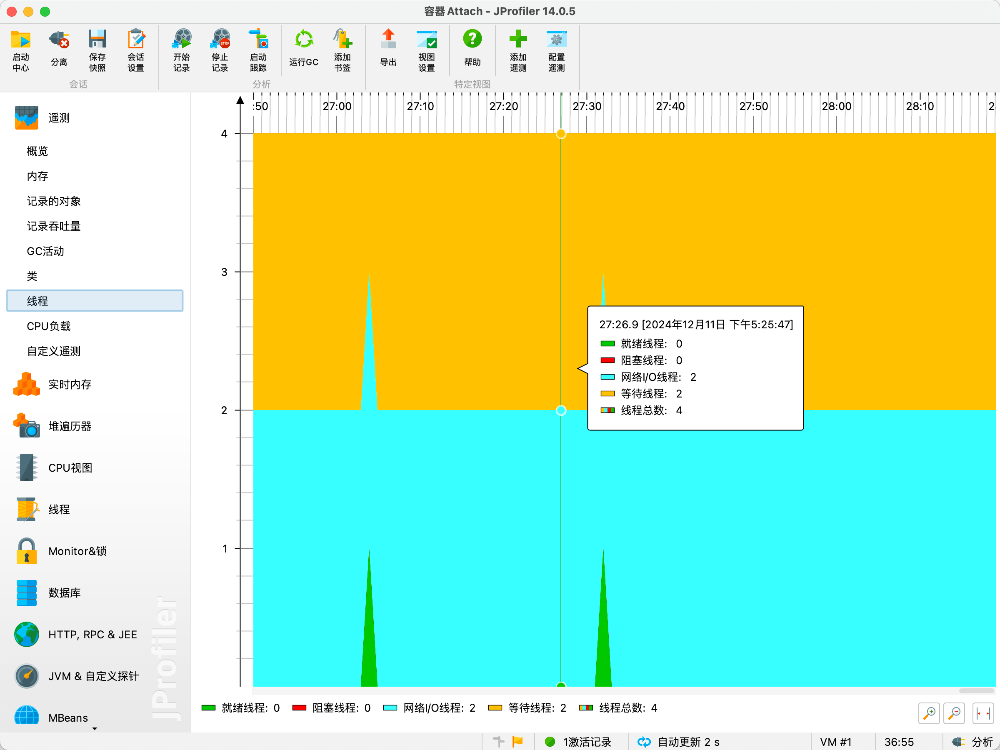

​	8、CPU负载(CPU Load)：显示一段时间中CPU的负载图表，如下图所示。

<div style="text-align:center;font-weight:bold;">JProfiler遥感监测之CPU负载界面</div>

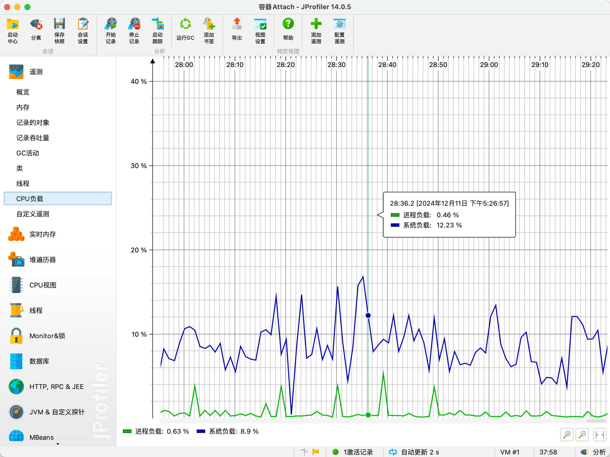

#### 内存视图(Live memory)

​	剖析内存中对象的相关信息。例如查看对象的个数、大小、对象创建的方法执行栈，以及对象创建的热点。

​	1、所有对象(All Objects)：显示所有加载的类的列表和在堆上分配的实例数，如下图所示。

<div style="text-align:center;font-weight:bold;">JProfiler内存界面</div>

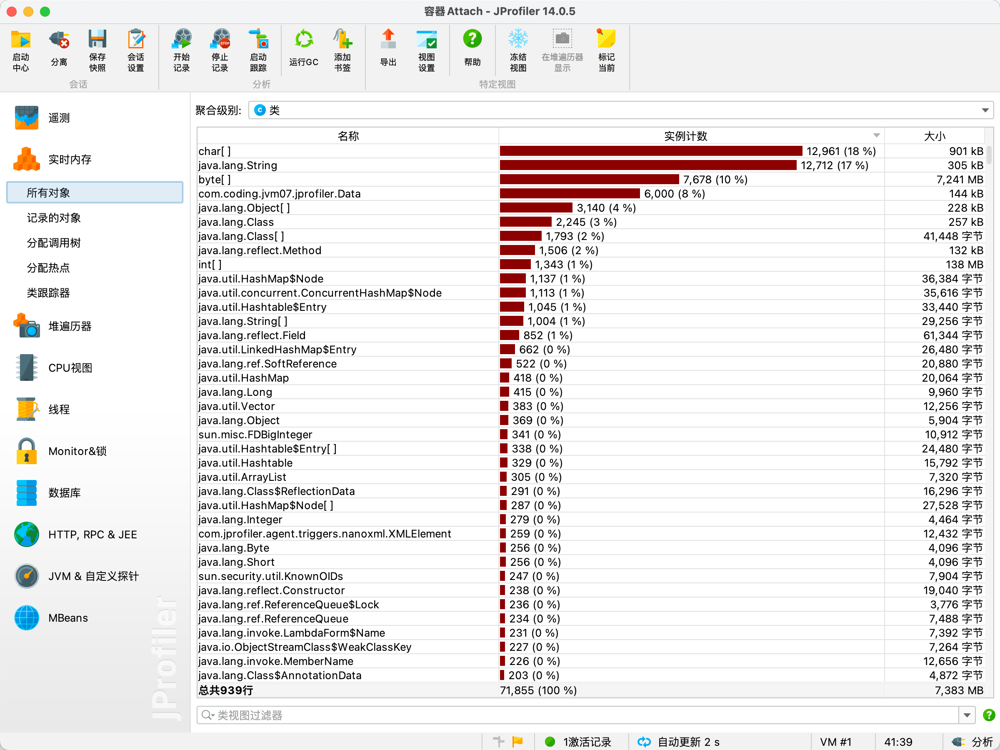

​	2、记录对象(Record Objects)：查看特定时间段对象的分配，并记录分配的调用堆栈。如下图所示，可以看到对象的分配数量等信息，也可以修改对象分配和记录的比例。

<div style="text-align:center;font-weight:bold;">JProfiler记录对象界面</div>


​	3、分配访问树(Allocation Call Tree)：显示一棵请求树，可以根据方法、类、包、组件等信息展示，默认不展示图表，需要手动单击右侧按钮查看，如下图所示。图<span style="color:blue;font-weight:bold;">JProfiler分配访问树界面</span>展示了按照方法展示访问树的图表效果。

<div style="text-align:center;font-weight:bold;">JProfiler分配访问树界面</div>

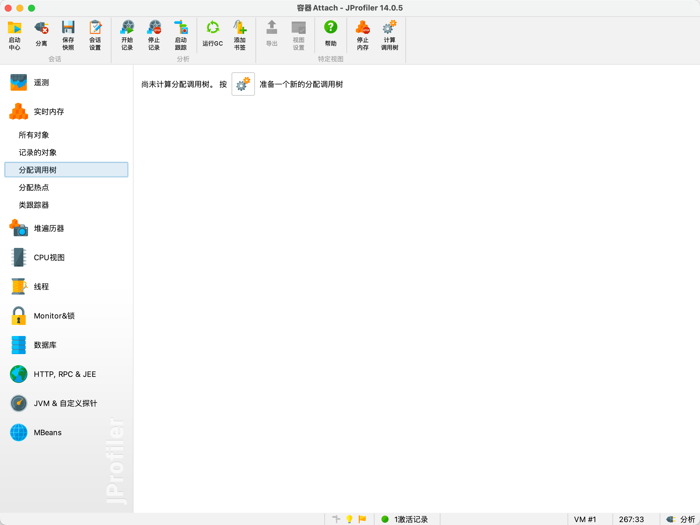

<div style="text-align:center;font-weight:bold;">JProfiler分配访问树界面</div>

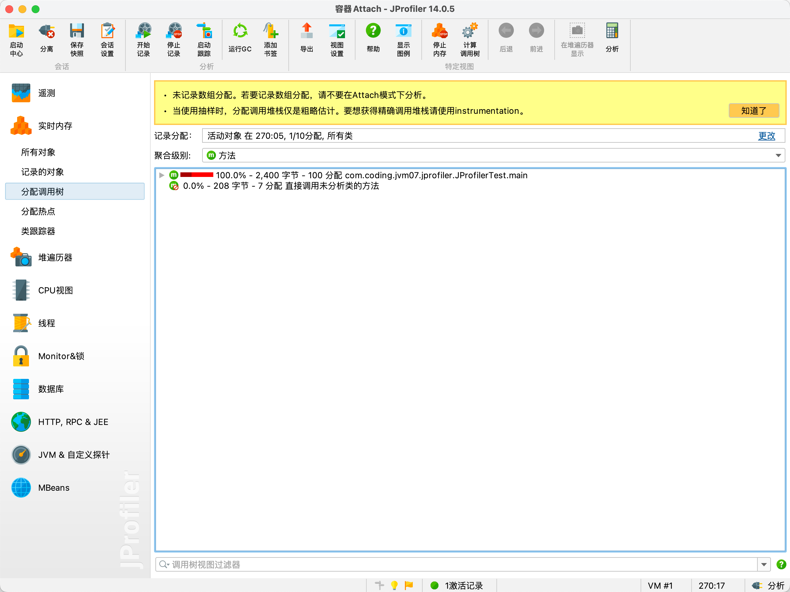

​	4、分配热点(Allocation Hot Spots)：显示一个列表，可以根据方法、类、包或组件展示内存分配的热点信息，对于每个热点都可以显示它的跟踪记录树，不再过多介绍。

<div style="text-align:center;font-weight:bold;">JProfile分配热点界面</div>

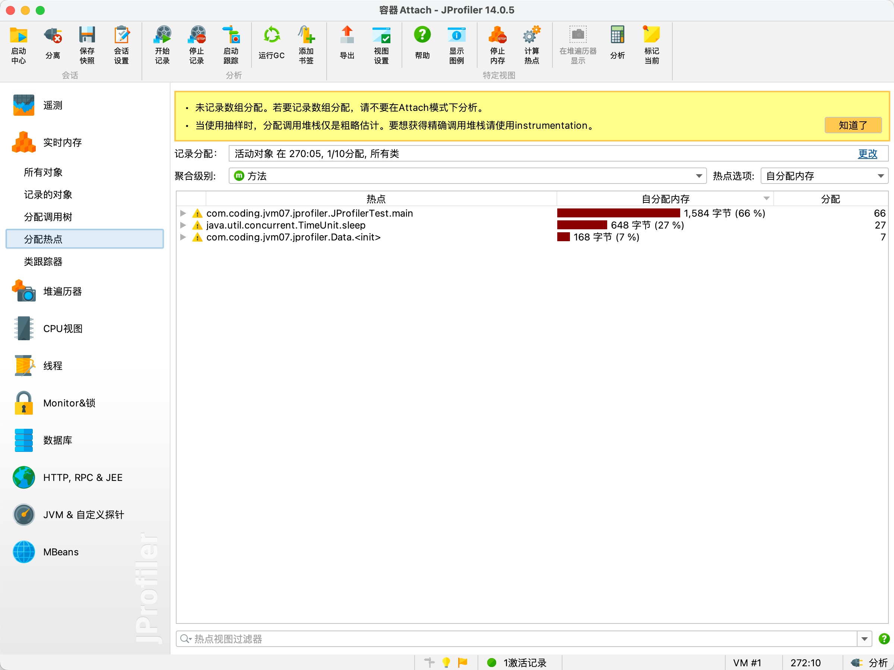

​	5、类追踪器(Class Tracker)：类追踪器视图可以包含任意数量的图表，显示选定的类和包的实例与时间，如下图所示，在程序不断创建对象的过程中，对象数量的变化曲线在逐步增高。

<div style="text-align:center;font-weight:bold;">JProfiler类追踪器界面</div>

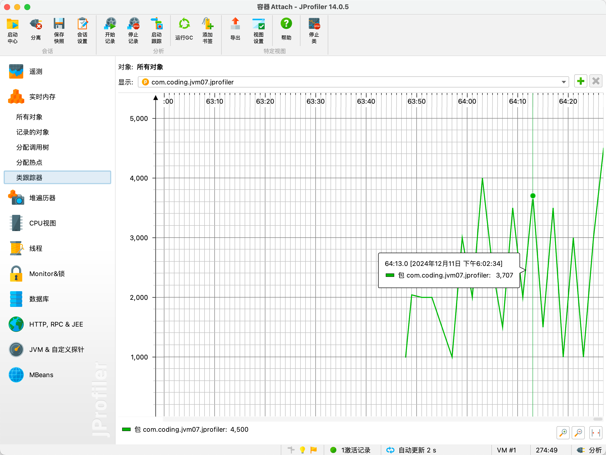

#### 堆遍历(Heap Walker)

​	堆遍历对一定时间内收集的内存对像信息进行静态分析，该模块可以明确查看对象的引用关系，功能强大且使用方便，包含对象的outgoing reference、incoming reference和biggest object等选项。

​	1、类“Classes”：显示所有类和它们的实例，可以右击具体的类“Used Selected Instance”实现进一步跟踪，如下图所示。

<div style="text-align:center;font-weight:bold;">JProfiler类界面</div>


​	2、分配(Allocations)：为所有记录对象显示分配树和分配热点，如下图所示。

<div style="text-align:center;font-weight:bold;">JProfiler对象分配界面</div>

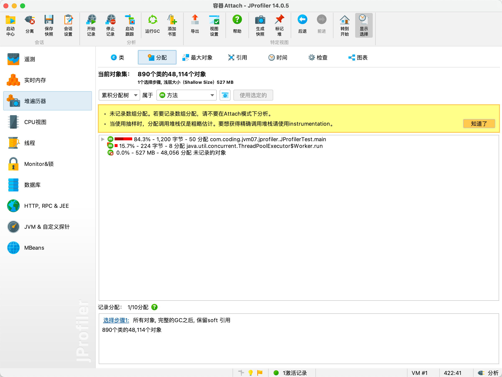

​	3、引用(References)：为单个对象和“显示到垃圾回收根目录的路径”提供索引图的显示功能。还能提供合并输入视图和输出视图的功能，和MAT中的with outgoing references功能一样，如下图所示。

<div style="text-align:center;font-weight:bold;">JProfiler对象引用界面</div>

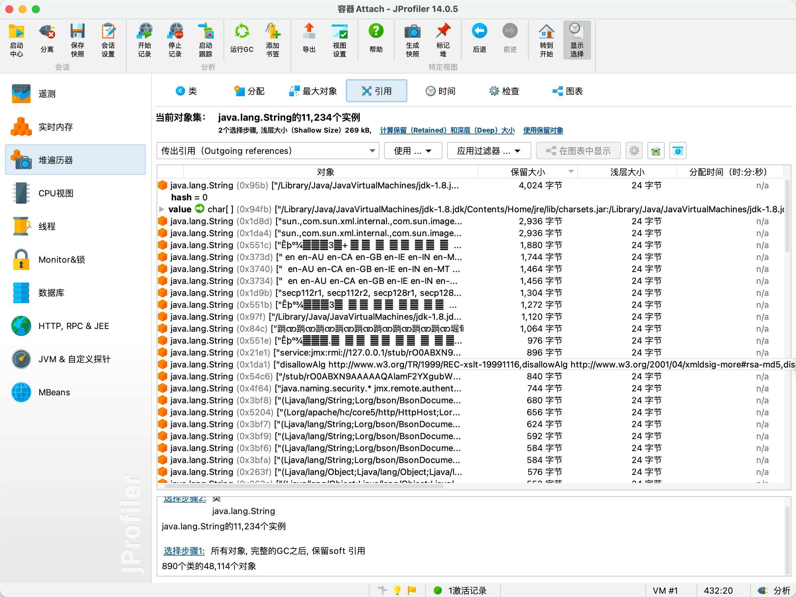

​	4、时间(Time)：显示一个对已记录对象集的分配时间直方图。
​	5、检查(Inspections)：显示一个数量的操作，将分析当前对象集在某种条件下的子集，实质是一个筛选的过程。
​	6、图表(Graph)：需要在references视图和biggest视图手动添加对象到图表，它可以显示对象的传入和传出引用，便于找到垃圾收集器根源。

#### CPU视图(CPU views)

​	JProfiler提供不同的方法来记录访问树以优化性能和细节。线程或者线程组以及线程状况可以被所有的视图选择。所有的视图可以在方法、类、包或组件等不同层面上展示。
​	1、访问树(Call Tree)：显示一个积累的自顶向下的树，以树结构自顶向下显示线程方法调用树以及各个方法对CPU的使用情况，如下图所示。

<div style="text-align:center;font-weight:bold;">JProfilerCPU之访问树界面</div>

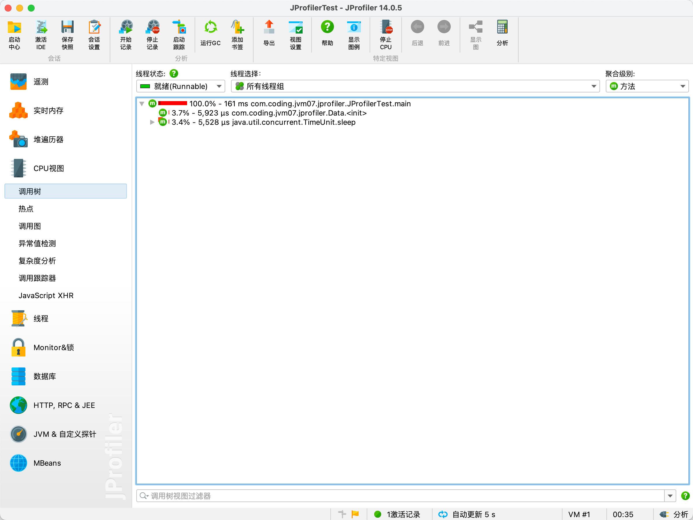

​	2、热点(Hot Spots)：显示消耗时间最多的方法的列表。对每个热点方法都能够显示回溯树，如下图所示。

<div style="text-align:center;font-weight:bold;">JProfilerCPU之热点方法界面</div>

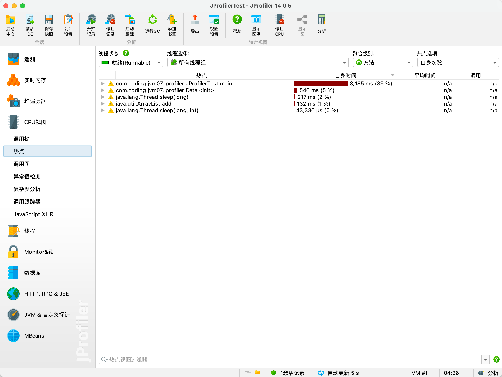

​	3、访问图(Call Graph)：显示一个从已选方法、类、包或J2EE组件开始的访问队列的图，如下图所示。

<div style="text-align:center;font-weight:bold;">JProfilerCPU之访问图界面</div>

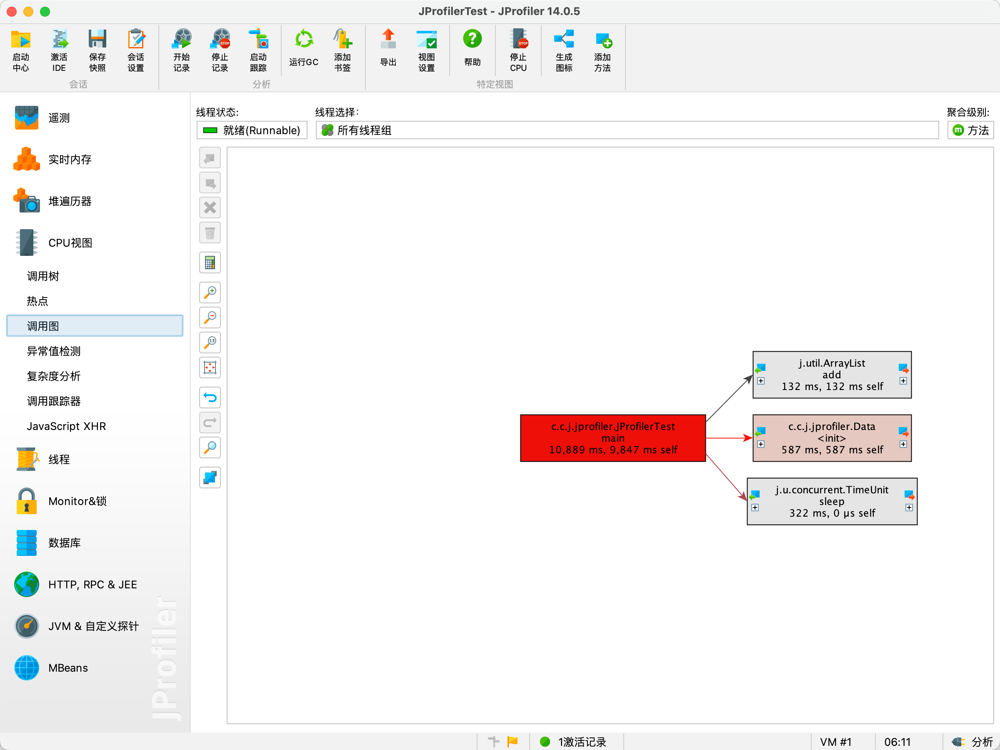

#### 线程视图(Threads)

​	JProfiler通过对线程历史的监控判断其运行状态，并监控是否有线程阻塞产生，还能将一个线程所管理的方法以树状形式呈现。对线程剖析，依旧使用如下代码来进行测试。

<span style="color:#40E0D0;">案例1：死锁案例</span>

- 代码

```java
package com.coding.jvm07.cmd;

/**
 * 演示线程的死锁问题
 * 互相的 BLOCKED 导致-> Found one Java-level deadlock:
 */
public class ThreadDeadLock {
    public static void main(String[] args) {
        StringBuilder sb1 = new StringBuilder();
        StringBuilder sb2 = new StringBuilder();

        new Thread(() -> {
            synchronized (sb1) {
                sb1.append("a");
                sb2.append("1");

                try {
                    Thread.sleep(100);
                } catch (InterruptedException e) {
                    e.printStackTrace();
                }

                synchronized (sb2) {
                    sb1.append("b");
                    sb2.append("2");

                    System.out.println("sb1 = " + sb1);
                    System.out.println("sb2 = " + sb2);
                }
            }
        }).start();

        new Thread(() -> {
            synchronized (sb2) {
                sb1.append("c");
                sb2.append("3");

                try {
                    Thread.sleep(100);
                } catch (InterruptedException e) {
                    e.printStackTrace();
                }

                synchronized (sb1) {
                    sb1.append("d");
                    sb2.append("4");

                    System.out.println("sb1 = " + sb1);
                    System.out.println("sb2 = " + sb2);
                }
            }
        }).start();

    }
}

```

​	1、程历史(Thread History)：显示一个与线程活动和线程状态在一起的活动时间表，如下图中可以看到，两个线程始终处于阻塞状态，红色代表Blocked。

<div style="text-align:center;font-weight:bold;">JProfiler历史线程界面</div>

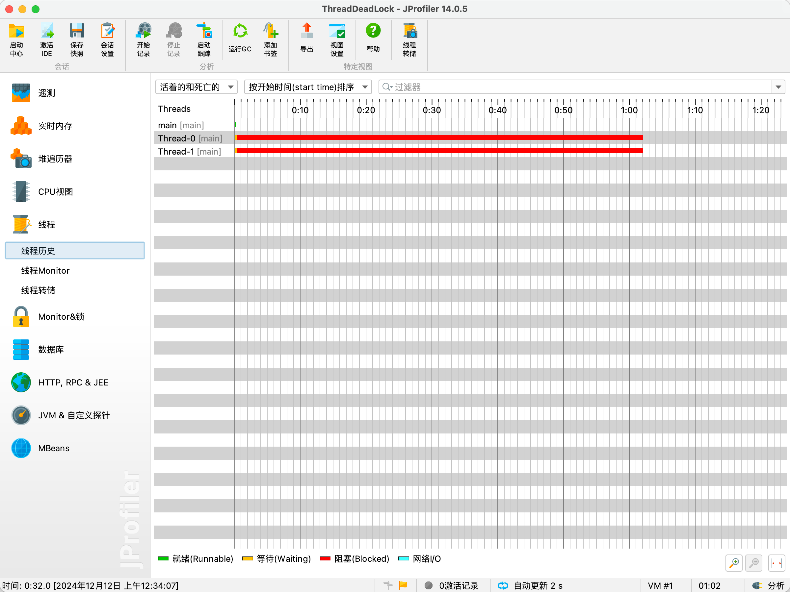

​	2、线程监控(Thread Monitor)：显示一个列表，包括所有的活动线程以及它们目前的活动状况，如下图所示，目前线程依然是阻塞状态。

<div style="text-align:center;font-weight:bold;">JProfiler线程监控界面</div>


​	3、线程转储(Thread Dumps)：显示所有线程的堆栈跟踪，下图中截取了两个时间段的线程dump。对比图22-100，从而可以查看线程不同时间段的状态。

<div style="text-align:center;font-weight:bold;">JProfiler线程dump界面</div>

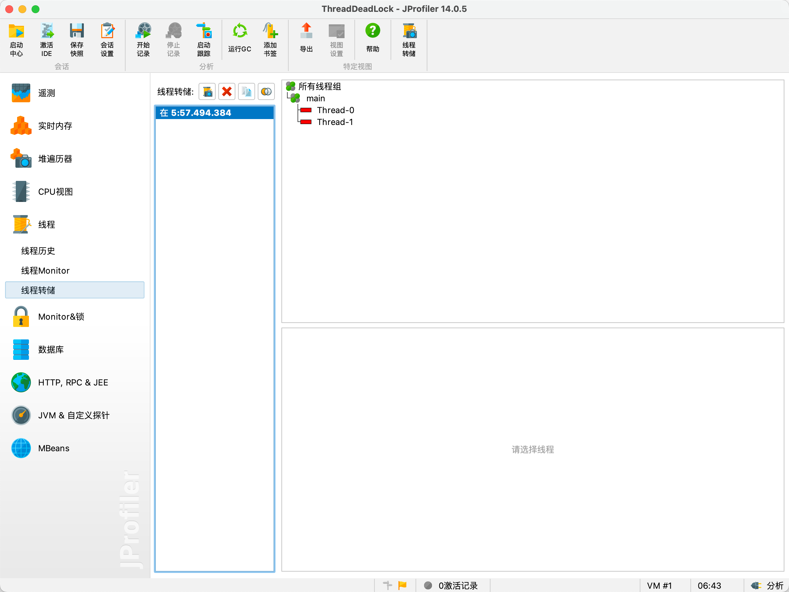

<div style="text-align:center;font-weight:bold;">JProfiler线程比对界面</div>

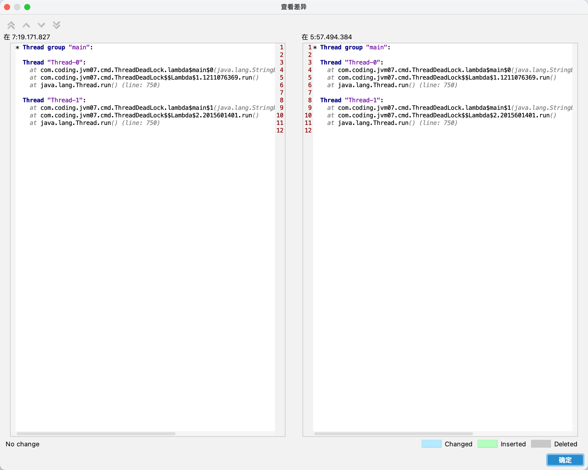

​	线程分析主要关心以下三个方面。

​	1、Web容器的线程最大数，比如Tomcat的线程容量应该略大于最大并发数。
​	2、线程阻塞。
​	3、线程死锁。

#### 监控和锁(Monitors&Locks)

​	所有线程持有锁的情况以及锁的信息，观察JVM的内部线程并查看状态。

​	1、死锁探测图表(Current Locking Graph)：显示JVM中的当前死锁图表，如下图所示。

<div style="text-align:center;font-weight:bold;">JProfiler线程死锁界面</div>

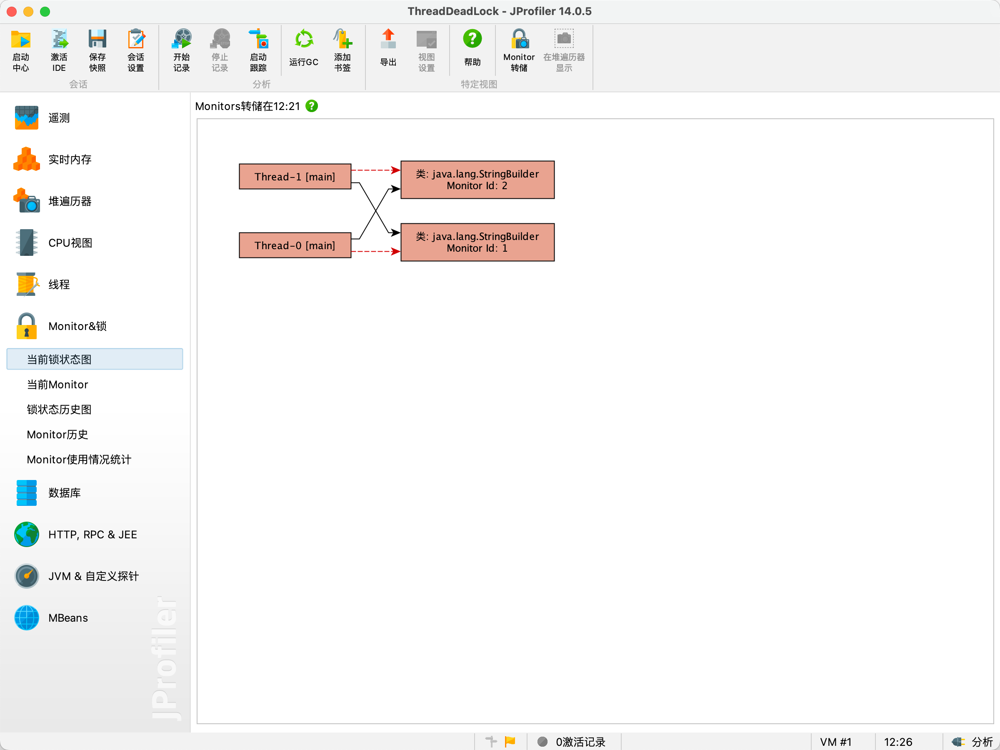

​	2、目前使用的监测器(Current Monitors)：显示目前使用的监测器并且包括它们的关联线程，如下图所示。

<div style="text-align:center;font-weight:bold;">JProfiler线程检测器界面</div>

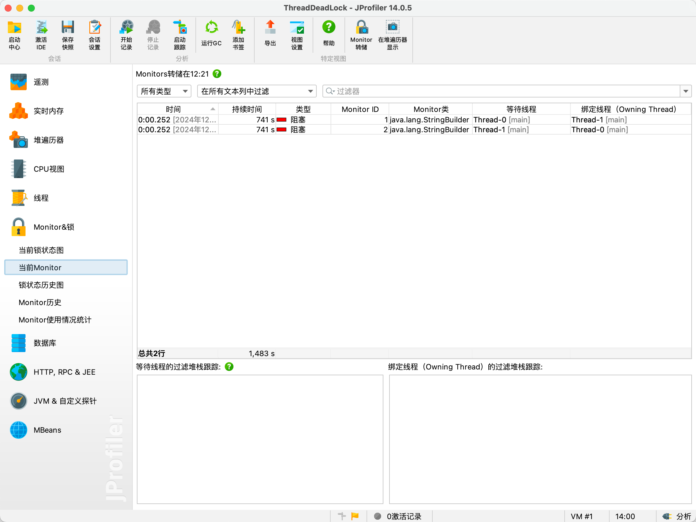

​	3、锁定历史图表(Locking History Graph)：显示记录在JVM中的锁定历史。

​	4、历史检测记录(Monitor History)：显示重大的等待事件和阻塞事件的历史记录。

​	5、监控器使用统计(Monitor Usage Statistics)：显示分组监测，线程和监测类的统计监测数据。

### 22.5.4 案例分析

​	下面我们写一段程序来进行JProfiler分析，如下代码所示。

<span style="color:#40E0D0;">案例1：JProfiler案例</span>

- 代码

```java
package com.coding.jvm07.jprofiler;

import java.util.ArrayList;
import java.util.concurrent.TimeUnit;

/**
 * 功能演示测试：正常程序
 */
public class JProfilerTest {
    public static void main(String[] args) {
        while (true) {
            ArrayList list = new ArrayList();
            for (int i = 0; i < 500; i++) {
                Data data = new Data();
                list.add(data);
            }

            try {
                TimeUnit.MILLISECONDS.sleep(500);
            } catch (InterruptedException e) {
                throw new RuntimeException(e);
            }
        }
    }
}

class Data {
    private int size = 10;
    private byte[] buffer = new byte[1024 * 1024]; // 1mb
    private String info = "hello,world";
}

```

​	通过JProfiler打开该程序，观察内存区域视图，可以发现，当内存使用到一段时间以后，会有一个快速回落的过程，这是由于GC造成的，最终形成一个锯齿的形状，比较平稳，这种一般来说都是比较正常的情况，如下图所示。

<div style="text-align:center;font-weight:bold;">JProfiler内存GC界面</div>

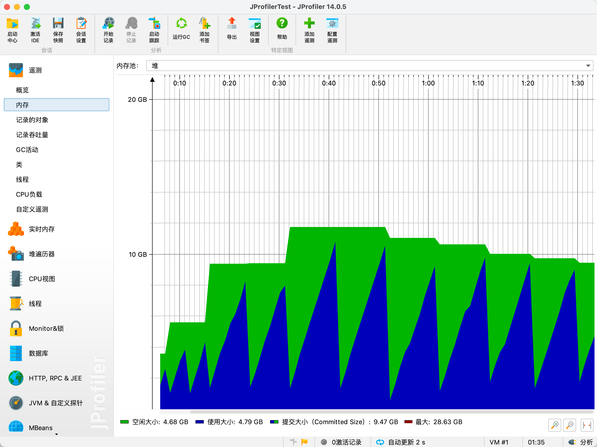

​	观察对象的过程中，也会发现Data对象的数量经过一段时间后就会变少，同样是GC的效果，如下图<span style="color:blue;font-weight:bold;">JProfiler类对象分配界面1</span>和图<span style="color:blue;font-weight:bold;">JProfiler类对象分配界面2</span>所示，前者图中Data对象数量是2000，一段时间后，后者图中Data对象数量减少为1500。

<div style="text-align:center;font-weight:bold;">JProfiler类对象分配界面1</div>

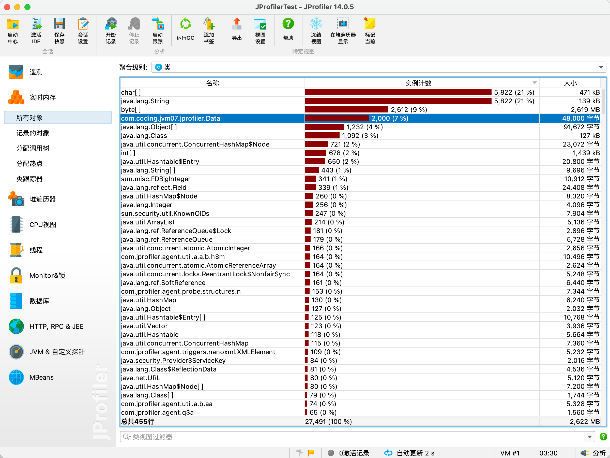

<div style="text-align:center;font-weight:bold;">JProfiler类对象分配界面2</div>

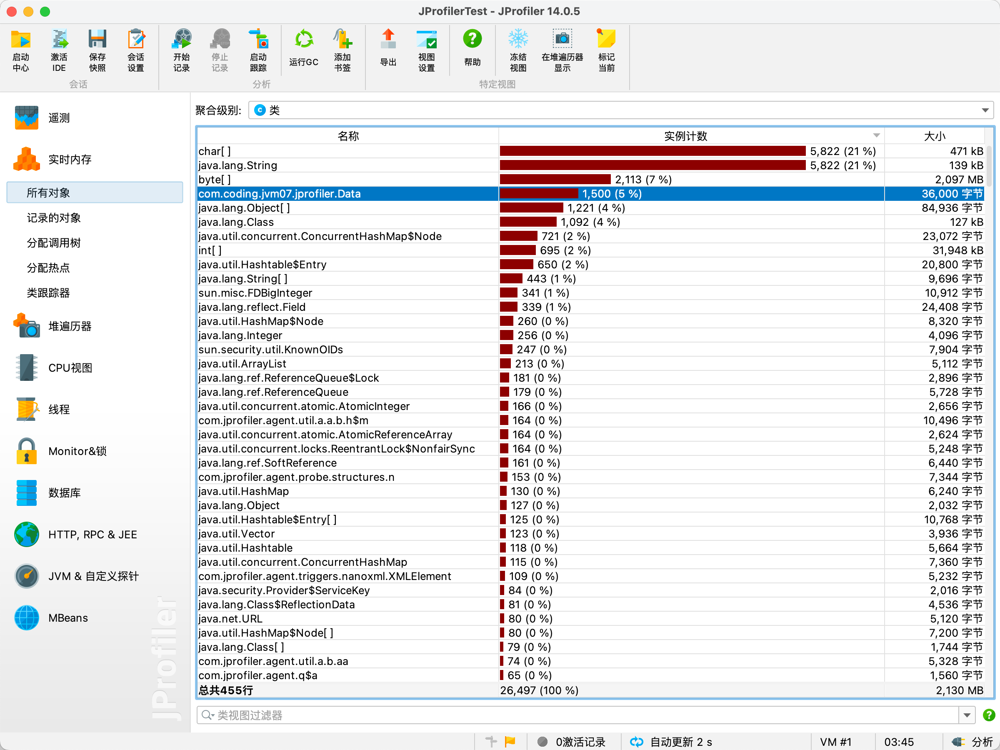

## 22.6 Arthas

### 22.6.1 基本概述

​	前面，我们介绍了JDK自带的VisualVM等免费工具，以及商业化工具JProfiler。这两款工具在业界知名度也比较高，它们的优点是可以在图形界面上看到各维度的性能数据，使用者根据这些数据进行综合分析，然后判断哪里出现了性能问题。

​	但是这两款工具也有个缺点，都必须在服务端项目进程中配置相关的监控参数，然后工具通过远程连接到项目进程，获取相关的数据。这样就会带来一些不便，比如线上环境的网络是隔离的，本地的监控工具根本连不上线上环境。那么有没有一款工具不需要远程连接，也不需要配置监控参数，同时也提供了丰富的性能监控数据呢？下面跟大家介绍一款阿里巴巴开源的性能分析神器Arthas（阿尔萨斯），如下图所示。

<div style="text-align:center;font-weight:bold;">Arthas图标</div>


​	Arthas是Alibaba开源的JVM诊断工具，深受开发者喜爱。开发者在线排查问题，无须项目重启，Arthas会动态跟踪Java程序，实时监控JVM状态。

​	Arthas支持JDK 6+（4.x 版本不再支持 JDK 6 和 JDK 7），支持Linux/Mac/Windows，采用命令行交互模式，同时提供丰富的Tab自动补全功能，进一步方便进行问题的定位和诊断。

​	当各位读者遇到以下类似问题而束手无策时，Arthas可以帮助解决。这个类从哪个jar包加载的？为什么会报各种类相关的Exception？修改的代码为什么没有执行到？遇到问题无法在线上debug，难道只能通过加日志再重新发布吗？线上遇到某个用户的数据处理有问题，但线上同样无法debug，线下无法重现。是否有一个全局视角来查看系统的运行状况？有什么办法可以监控到JVM的实时运行状态？Arthas代码基于Greys二次开发而来，Arthas的命令行实现基于termd开发，文本渲染功能基于crash中的文本渲染功能开发，命令行界面基于vert.x提供的cli库进行开发，等等，集各家所长开发的一款工具。下面作者带大家一起走进Arthas。

### 22.6.2 安装与使用

#### 安装

​	Arthas官方文档地址为https://arthas.aliyun.com/。Arthas有以下两种下载方式。

​	1、可以直接在Linux上通过wget或者curl命令下载，选择GitHub或者尝试国内的码云Gitee下载。

```bash
# GitHub下载
% wget https://alibaba.github.io/arthas/arthas-boot.jar
# Gitee下载
% wget https://arthas.gitee.io/arthas-boot.jar
# curl 下载
% curl -O https://arthas.aliyun.com/arthas-boot.jar
```

​	2、可以在浏览器直接访问https://alibaba.github.io/arthas/arthas-boot.jar，等待下载成功后，上传到Linux服务器。


#### 启动

​	Arthas是一段Java程序打包成的jar包，所以下载完成以后可以直接用java –jar命令运行，如下所示。

```bash
% java -jar arthas-boot.jar 
```

#### 退出

​	如果只是退出当前的连接，可以用`quit`或者`exit`命令。Attach 到目标进程上的 arthas 还会继续运行，端口会保持开放，下次连接时可以直接连接上。

​	如果想完全退出 arthas，可以执行`stop`命令。

#### 卸载

- 在 Linux/Unix/Mac 平台

```bash
% rm -rf ~/.arthas/
% rm -rf ~/logs/arthas
```

- Windows 平台直接删除 user home 下面的`.arthas`和`logs/arthas`目录

#### Arthas工程目录

​	Arthas工程目录如下表所示。

​	Arthas的GitHub地址：https://github.com/alibaba/arthas

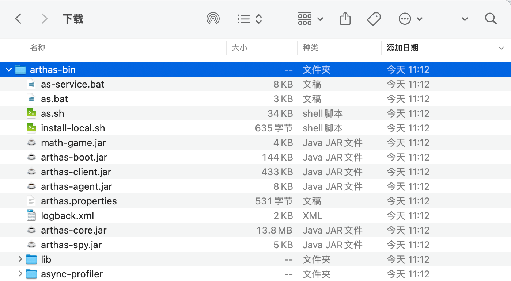

<div style="text-align:center;font-weight:bold;">Arthas工程目录</div>


#### 启动使用与Web Console

​	在工作中可以使用java -jar命令启动Arthas，这里可以选择输入对应的Java进程PID，也就可以不输入对应的Java进程PID。执行成功后，Arthas提供了一种命令行方式的交互方式，Arthas会检测当前服务器上的Java进程，并将进程列表展示出来，用户输入对应的编号(1、2、3、4…)进行选择，然后按Enter键。

​	方式1：不添加Java进程PID。

```bash
% java -jar arthas-boot.jar
```

​	运行结果如下。

```bash
[INFO] JAVA_HOME: /Library/Java/JavaVirtualMachines/jdk-17.jdk/Contents/Home
[INFO] arthas-boot version: 4.0.4
[INFO] Found existing java process, please choose one and input the serial number of the process, eg : 1. Then hit ENTER.
* [1]: 51234 com.intellij.idea.Main
  [2]: 62292 org.jetbrains.jps.cmdline.Launcher
  [3]: 853 
  [4]: 81531 math-game.jar
```

​	选择编号，注意输入的是“[]”内编号，不是PID，这里选择编号4，出现如下图所示界面表示Arthas启动成功了。

```bash
4
[INFO] arthas home: /Users/wenqiu/.arthas/lib/4.0.4/arthas
[INFO] Try to attach process 81531
Picked up JAVA_TOOL_OPTIONS: 
[INFO] Attach process 81531 success.
[INFO] arthas-client connect 127.0.0.1 3658
  ,---.  ,------. ,--------.,--.  ,--.  ,---.   ,---.                           
 /  O  \ |  .--. ''--.  .--'|  '--'  | /  O  \ '   .-'                          
|  .-.  ||  '--'.'   |  |   |  .--.  ||  .-.  |`.  `-.                          
|  | |  ||  |\  \    |  |   |  |  |  ||  | |  |.-'    |                         
`--' `--'`--' '--'   `--'   `--'  `--'`--' `--'`-----'                          

wiki       https://arthas.aliyun.com/doc                                        
tutorials  https://arthas.aliyun.com/doc/arthas-tutorials.html                  
version    4.0.4                                                                
main_class demo.MathGame                                                        
pid        81531                                                                
time       2024-12-12 11:32:01.835                                              

[arthas@81531]$ 
```

​	方式2：运行时选择Java进程PID。

```bash
% java -jar arthas-boot.jar [PID]
```

​	查看PID的方式可以通过ps命令，也可以通过JDK提供的jps命令，运行结果如下图所示。

```bash
% jps                       
51234 Main
62292 Launcher
853 
81531 math-game.jar
81567 arthas-boot.jar
81998 Jps
% java -jar arthas-boot.jar 81531
[INFO] JAVA_HOME: /Library/Java/JavaVirtualMachines/jdk-17.jdk/Contents/Home
[INFO] arthas-boot version: 4.0.4
[INFO] Process 81531 already using port 3658
[INFO] Process 81531 already using port 8563
[INFO] arthas home: /Users/wenqiu/.arthas/lib/4.0.4/arthas
[INFO] The target process already listen port 3658, skip attach.
[INFO] arthas-client connect 127.0.0.1 3658
  ,---.  ,------. ,--------.,--.  ,--.  ,---.   ,---.                           
 /  O  \ |  .--. ''--.  .--'|  '--'  | /  O  \ '   .-'                          
|  .-.  ||  '--'.'   |  |   |  .--.  ||  .-.  |`.  `-.                          
|  | |  ||  |\  \    |  |   |  |  |  ||  | |  |.-'    |                         
`--' `--'`--' '--'   `--'   `--'  `--'`--' `--'`-----'                          

wiki       https://arthas.aliyun.com/doc                                        
tutorials  https://arthas.aliyun.com/doc/arthas-tutorials.html                  
version    4.0.4                                                                
main_class demo.MathGame                                                        
pid        81531                                                                
time       2024-12-12 11:32:01.835                                              

[arthas@81531]$ 
```

​	可以通过“java -jar arthas-boot.jar –h”命令来查看启动Arthas的参数选项，如下图所示。

```bash
% java -jar arthas-boot.jar -h
```

​	使用如下命令可以查看Arthas日志。

```bash
% cat ~/logs/arthas/arthas.log
```

​	除了在命令行查看外，Arthas目前还支持Web Console。在成功启动连接进程之后就已经自动启动，可以直接访问http://127.0.0.1:8563/，页面上的操作模式和控制台完全一样，如下图所示。

<div style="text-align:center;font-weight:bold;">Arthas Web Console</div>

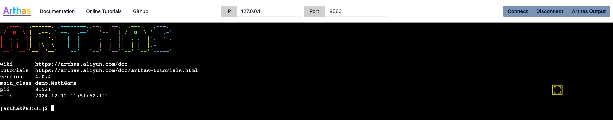

​	使用“quit”或“exit”命令可以退出当前客户端使用。“stop”或“shutdown”命令可以关闭Arthas服务端，并退出所有客户端。

```bash
$ stop
Resetting all enhanced classes ...
Affect(class count: 0 , method count: 0) cost in 0 ms, listenerId: 0
Arthas Server is going to shutdown...
[arthas@81531]$ session (2803ff64-9ffc-47ed-9dc6-11a54d2f1f7e) is closed because server is going to shutdown.
```

### 22.6.3 相关诊断命令

​	进入到客户端之后，需要输入相关的命令，基础命令如下表所示。

<div style="text-align:center;font-weight:bold;">Arthas基础命令</div>

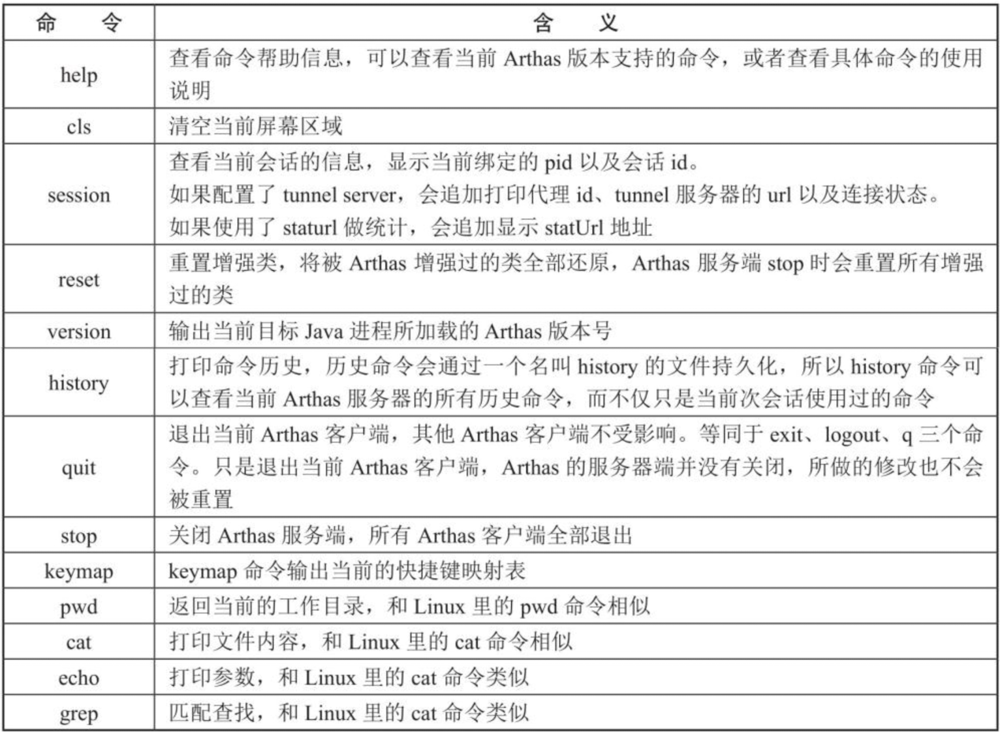

​	例如，在客户端输入help命令，结果如下图所示。

<div style="text-align:center;font-weight:bold;">Arthas Web Console</div>

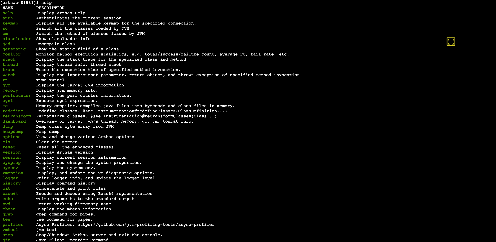

​	命令可以分为JVM相关命令、class/classloader相关命令和monitor/watch/trace相关命令以及其他的命令，下面分别展开讲解。

#### 1 JVM相关命令

##### dashboard命令

​	可以查看当前系统的实时数据面板。展示当前应用的多线程状态、JVM各区域、GC情况等信息，输入“Q”或者按“Ctrl+C”可以退出dashboard命令，如果加入“-n”参数，则在输出指定次数之后，自动退出。dashboard命令参数说明如下表所示。

<div style="text-align:center;font-weight:bold;">dashboard命令参数</div>


​	例如“dashboard -i 1000 -n 2”表示每隔1s输出一次信息，总共输出两次。

​	dashboard命令输出结果如下图所示。

<div style="text-align:center;font-weight:bold;">dashboard命令输出结果</div>

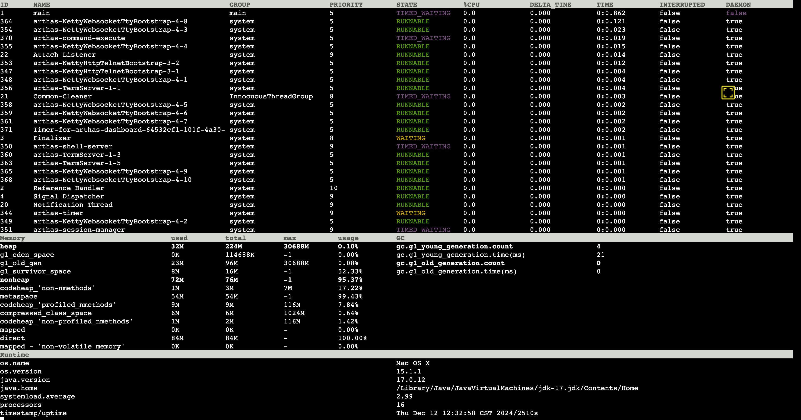

​	可以看到，这里会显示出线程（按照CPU占用百分比倒排）、内存（堆空间实时情况）、GC情况等数据。对上图的内容进行解析，如下表所示。

<div style="text-align:center;font-weight:bold;">dashboard命令结果含义</div>

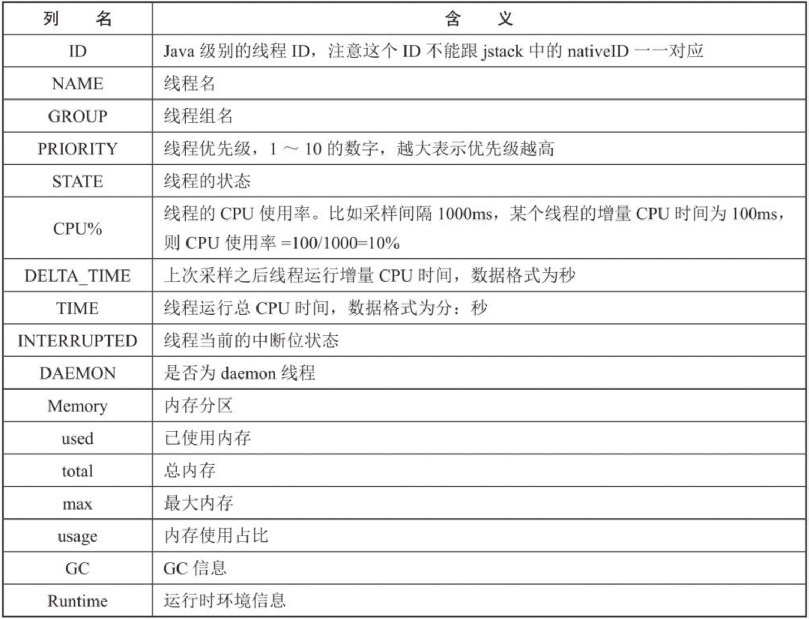

##### thread命令

查看当前JVM的线程堆栈信息。thread命令参数说明如下表所示。

<div style="text-align:center;font-weight:bold;">thread命令参数</div>

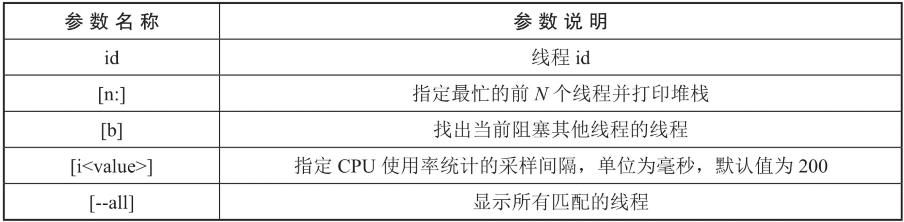

​	例如，有时候发现应用卡住了，通常是由于某个线程拿住了某个锁，并且其他线程都在等待这把锁。为了排查这类问题，Arthas提供了thread –b命令可以一键找出罪魁祸首，如下图所示。

<div style="text-align:center;font-weight:bold;">Arthas thread命令</div>

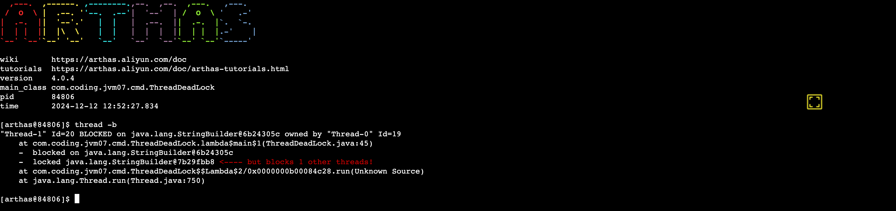

##### JVM命令

​	查看JVM详细的性能数据，由于篇幅原因，只展示部分截图，如下图所示。

<div style="text-align:center;font-weight:bold;">Arthas JVM命令</div>

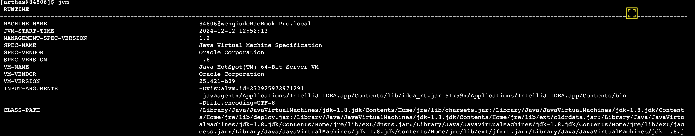

​	Arthas关于JVM相关的命令很多，剩下的命令作者不再一一演示，如下表所示。

<div style="text-align:center;font-weight:bold;">JVM相关命令</div>

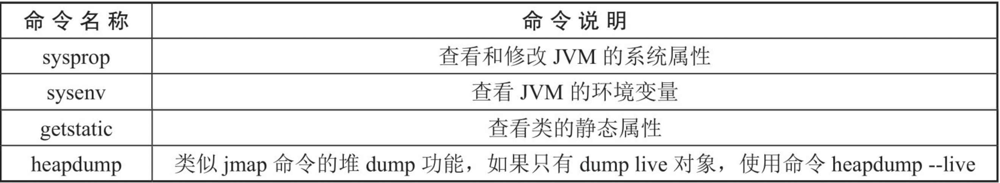

#### 2 class/classloader相关命令

​	与类的字节码文件以及类加载器相关的命令有以下几种，如下表所示。

<div style="text-align:center;font-weight:bold;">字节码相关命令</div>

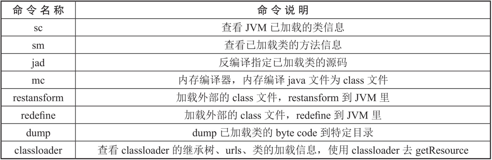

##### sc命令

​	查看JVM已加载的类信息，参数说明如表所示。

<div style="text-align:center;font-weight:bold;">sc命令参数选项</div>

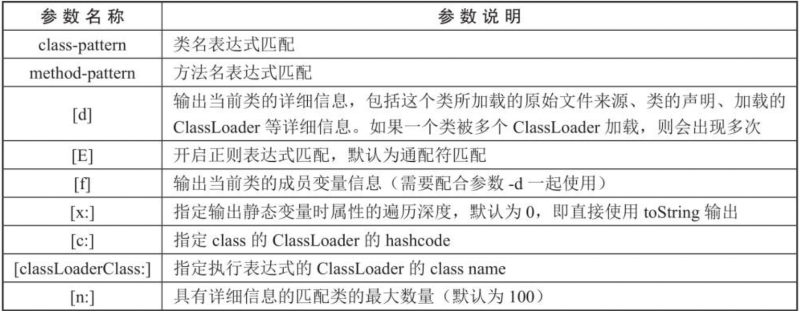

​	class-pattern支持全限定名，如com/test/AAA，也支持com.test.AAA这样的格式，这样从异常堆栈里面把类名复制过来的时候，不需要再手动把“/”替换为“.”了。

​	sc默认开启了子类匹配功能，也就是说所有当前类的子类也会被搜索出来，想要精确地匹配，请打开options disable-sub-class true开关。

​	使用案例如下，模糊查询com.coding.*包下的相关类信息，其中有两个动态类，如下图所示。

<div style="text-align:center;font-weight:bold;">模糊查询类信息</div>


​	打印类的详细信息，如下图所示。

<div style="text-align:center;font-weight:bold;">打印类的详细信息</div>

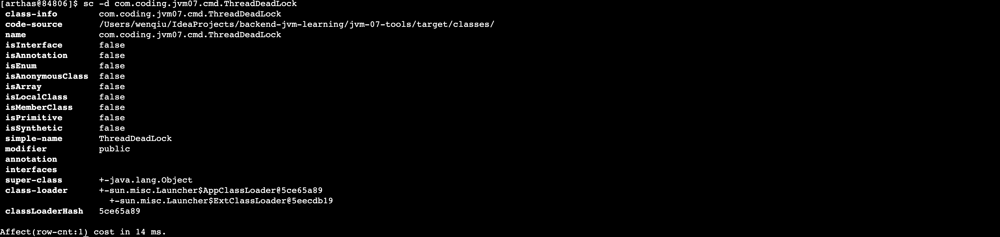

##### sm命令

​	“Search-Method”的简写，这个命令能搜索出所有已经加载了Class信息的方法信息。sm命令只能看到由当前类所声明的方法，父类则无法看到。参数说明如下表所示。

<div style="text-align:center;font-weight:bold;">sm命令参数选项</div>

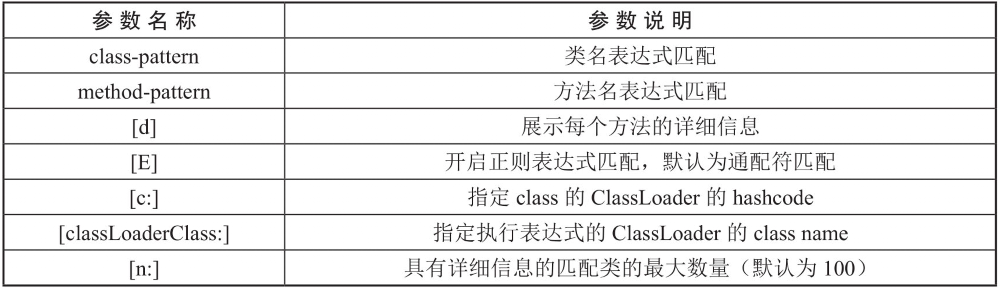

​	使用案例如下，这里注意要写类的全路径，如下图所示。

<div style="text-align:center;font-weight:bold;">打印类的方法信息</div>

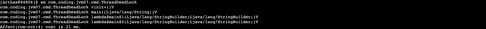

##### jad命令

​	反编译指定已加载类的源码，jad命令将JVM中实际运行的类的字节码反编译成Java代码，便于理解业务逻辑。在Arthas Console上，反编译出来的源码是带语法高亮的，阅读更方便。当然，反编译出来的Java代码可能会存在语法错误，但不影响进行阅读理解。参数说明如下表所示。

<div style="text-align:center;font-weight:bold;">jad命令参数选项</div>

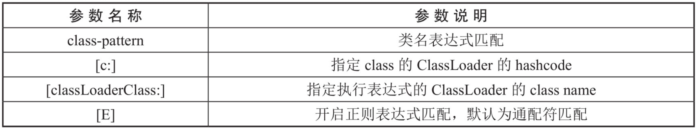

​	下面的案例反编译demo.MathGame，结果如下。


​	反编译时只显示源代码。默认情况下，反编译结果里会带有ClassLoader信息，通过--source-only选项，可以只打印源代码，方便和mc/retransform命令结合使用。

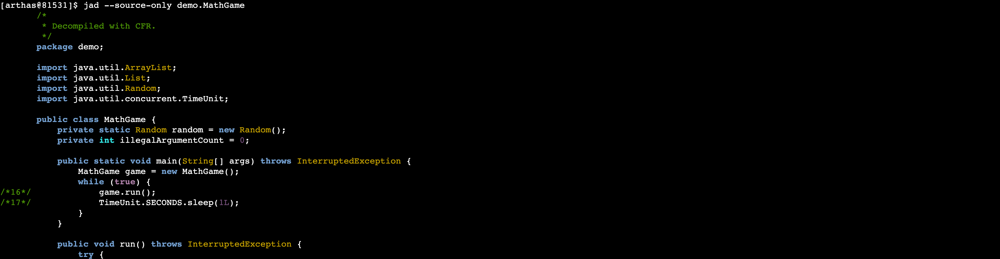

​	反编译指定的方法。

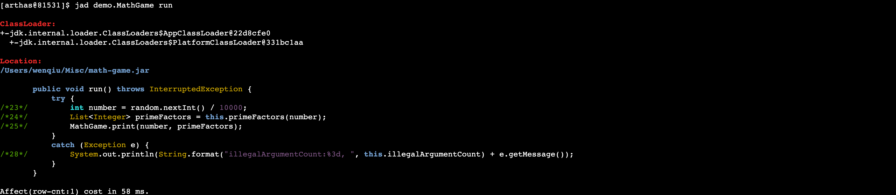

​	反编译时不显示行号(lineNumber)，参数默认值为true，显示指定为false则不打印行号.

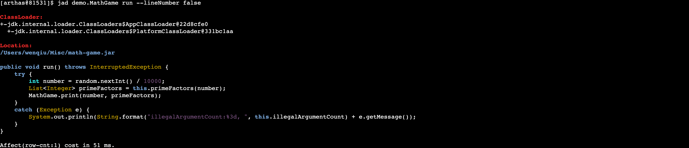

​	反编译时指定ClassLoader，当有多个ClassLoader都加载了这个类时，jad命令会输出对应ClassLoader实例的hashcode，然后只需要重新执行jad命令，并使用参数-c `<hashcode>`就可以反编译指定ClassLoader加载的那个类了。

​	对于只有唯一实例的ClassLoader，还可以通过--classLoaderClass指定class name，使用起来更加方便。--classLoaderClass的值是ClassLoader的类名，只有匹配到唯一的ClassLoader实例时才能工作，目的是方便输入通用命令，而-c `<hashcode>`是动态变化的。

##### mc命令

​	Memory Compiler/内存编译器，编译.java文件生成class。

##### redefine命令

​	加载外部的class文件，redefine JVM已加载的类。推荐使用retransform命令代替redefine命令。

##### ClassLoader命令

​	查看ClassLoader的继承树、urls和类加载信息。了解当前系统中有多少类加载器，以及每个加载器加载的类数量，帮助判断是否有类加载器泄漏。可以让指定的ClassLoader去getResources，打印出所有查找到的resources的url，对于ResourceNotFoundException比较有用。参数说明如下表所示。

<div style="text-align:center;font-weight:bold;">ClassLoader命令参数选项</div>

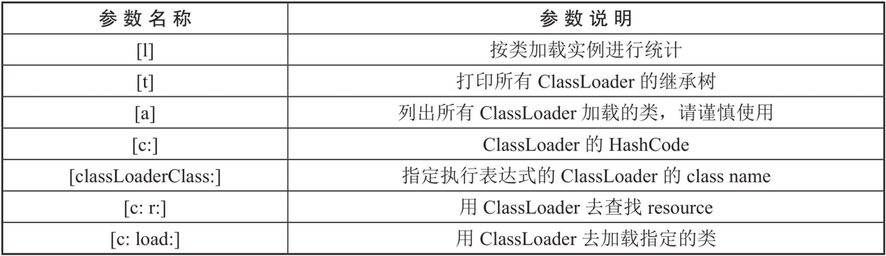

​	使用案例如下，按类加载类型查看统计信息，如下图所示，可以看到AppClassLoader总共加载了4173个类。

<div style="text-align:center;font-weight:bold;">ClassLoader指令</div>


#### 3 monitor/watch/trace相关命令

​	系统监控相关的命令有以下几种，如下表所示。

<div style="text-align:center;font-weight:bold;">系统监控相关命令</div>

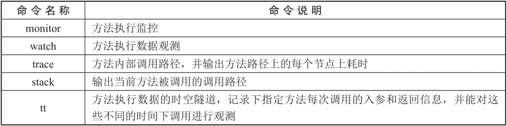

##### monitor命令

​	方法执行监控。对匹配class-pattern/method-pattern的类、方法的调用进行监控，涉及方法的调用次数、执行时间、失败率等。monitor命令是一个非实时返回命令。实时返回命令是输入之后立即返回，而非实时返回的命令，则是不断地等待目标Java进程返回信息，直到用户输入Ctrl+C为止。服务端是以任务的形式在后台跑任务，植入的代码随着任务的中止而不会被执行，所以任务关闭后，不会对原有性能产生太大影响，而且原则上，任何Arthas命令不会引起原有业务逻辑的改变，监控的维度说明如下表所示。

<div style="text-align:center;font-weight:bold;">monitor命令监控项</div>

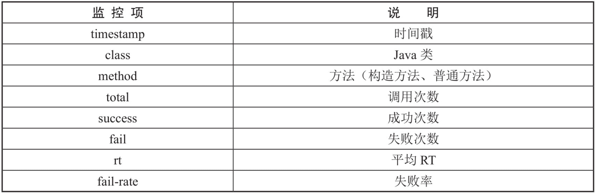

​	参数说明如下表所示，方法拥有一个命名参数[c:]，意思是统计周期(cycle of output)，拥有一个整型的参数值。

<div style="text-align:center;font-weight:bold;">monitor命令参赛选项</div>

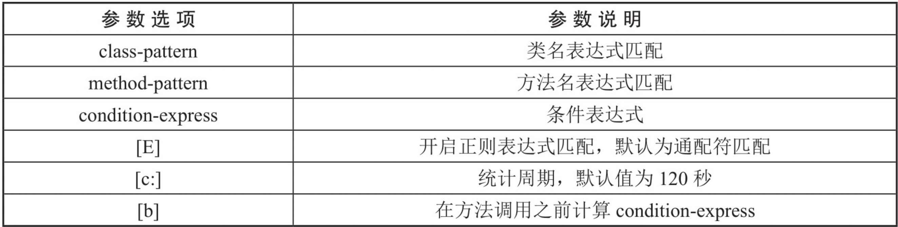

##### watch命令

​	方法执行数据观测，可以方便地观察到指定方法的调用情况。能观察到的范围为返回值、抛出异常、入参，通过编写groovy表达式进行对应变量的查看。watch的参数比较多，主要是因为它能在4个不同的场景观察对象，参数说明如下表所示。

<div style="text-align:center;font-weight:bold;">watch命令参数选项</div>

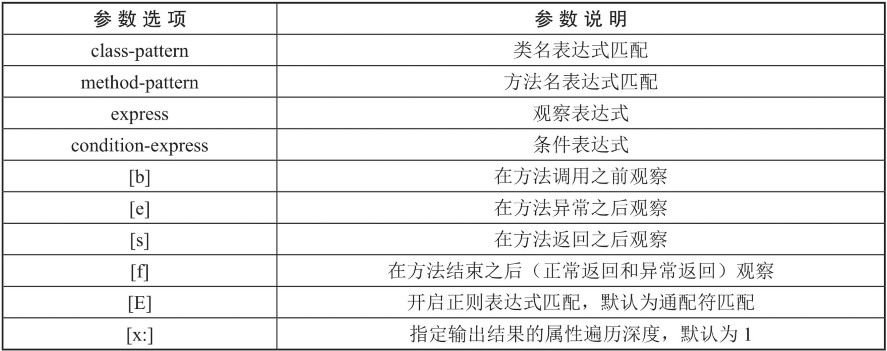

​	这里重点要说明的是观察表达式，观察表达式主要由ognl表达式组成，所以可以这样写“{params,returnObj}”，只要是一个合法的ognl表达式，都能被正常支持。观察的维度也比较多，主要体现在参数advice的数据结构上。Advice参数最主要是封装了通知节点的所有信息。

##### trace命令

​	方法内部调用路径，并输出方法路径上的每个节点上耗时。trace命令能主动搜索class-pattern/method-pattern对应的方法调用路径，渲染和统计整个调用链路上的所有性能开销和追踪调用链路，便于帮助定位和发现因RT高而导致的性能问题缺陷，但其每次只能跟踪一级方法的调用链路。trace在执行的过程中本身是会有一定的性能开销，在统计的报告中并未像JProfiler一样预先减去其自身的统计开销，所以统计出来有些不准，渲染路径上调用的类、方法越多，性能偏差越大，但还是能让各位读者看清一些事情的。参数说明如下表所示。

<div style="text-align:center;font-weight:bold;">trace命令参数选项</div>

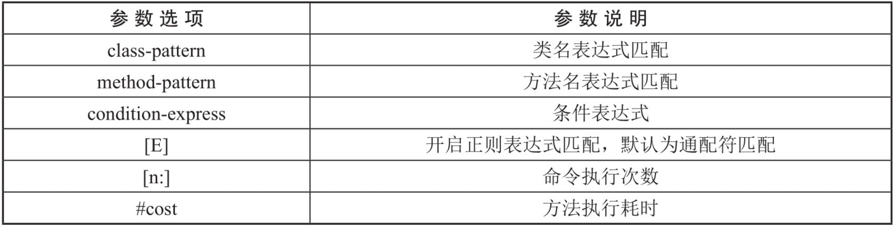

##### stack命令

​	输出当前方法被调用的调用路径。很多时候我们都知道一个方法被执行了，但这个方法被执行的路径非常多，根本不知道这个方法是从哪里被执行了，此时需要的是stack命令。参数说明如下表所示。

<div style="text-align:center;font-weight:bold;">stack命令参数选项</div>

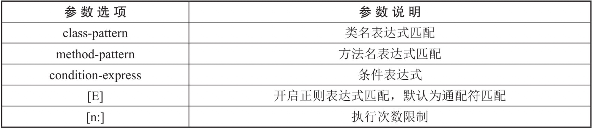

​	使用案例如下，打印run方法的调用栈信息，如下图所示。

<div style="text-align:center;font-weight:bold;">stack命令</div>

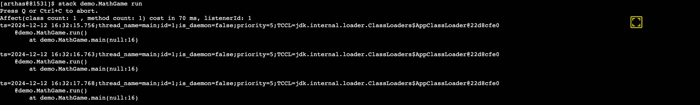

##### tt命令

​	TimeTunnel的缩写，方法执行数据的时空隧道，记录下指定方法每次调用的入参和返回信息，并能对这些不同时间下的调用进行观测。watch虽然方便灵活，但需要提前想清楚观察表达式的拼写，这对排查问题而言要求太高，因为很多时候我们并不清楚问题出自何方，只能靠蛛丝马迹进行猜测，这个时候如果能记录下当时方法调用的所有入参和返回值、抛出的异常，会对整个问题的思考与判断非常有帮助。于是，TimeTunnel命令就诞生了。参数说明如下表所示。

<div style="text-align:center;font-weight:bold;">tt命令参数选项</div>

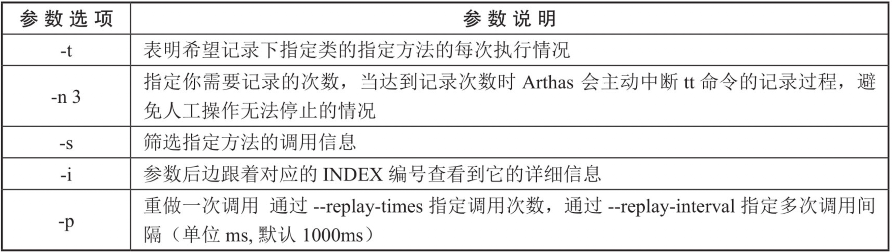

​	如下图所示，打印run方法的每次执行情况。

<div style="text-align:center;font-weight:bold;">tt命令</div>


#### 其他命令

​	除了上面作者为大家归类好的一些命令，还有很多其他命令，这里再列举两个供各位读者参考学习。

##### profiler命令

​	支持生成应用热点的火焰图。本质上是通过不断地采样，然后把收集到的采样结果生成火焰图。参数说明如下表所示。

<div style="text-align:center;font-weight:bold;">profiler命令参数选项</div>

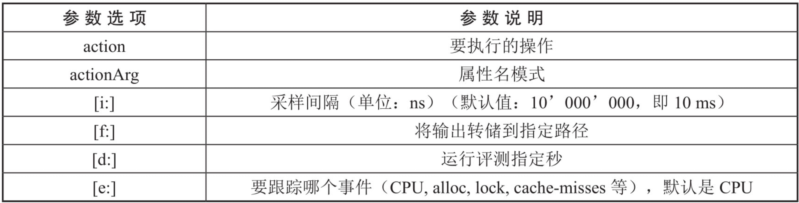

​	案例如下。

①启动profiler，如下所示。

```bash
[arthas@81531]$ profiler start
Profiling started
```

②获取已采集的sample的数量，如下所示。

```bash
[arthas@81531]$ profiler getSamples
4
```

③查看profiler状态

```bash
[arthas@81531]$ profiler status
Profiling is running for 24 seconds
```

④停止profiler，生成svg格式结果，如图22-122所示。

```bash
[arthas@81531]$ profiler stop
OK
profiler output file: /Users/wenqiu/Misc/arthas-output/20241212-164822.html
```

​	默认情况下，生成的结果保存到应用的工作目录下的arthas-output目录。可以通过--file参数来指定输出结果路径。比如，profiler stop --file /tmp/output.svg。可以通过--format来设置生成html格式结果。比如，profiler stop --format html。通过浏览器查看arthas-output下面的profiler结果。

​	默认情况下，Arthas使用3658端口，可以打开http://localhost:3658/arthas-output/查看arthas-output目录下面的profiler结果，如下图所示。

<div style="text-align:center;font-weight:bold;">profiler结果目录</div>


​	单击可以查看具体的结果，如下图所示，这种图称为火焰图。在追求极致性能的场景下，了解程序运行过程中CPU在干什么很重要，火焰图就是一种非常直观的展示CPU在程序整个生命周期过程中时间分配的工具。这个工具可以非常直观地显示出调用栈中的CPU消耗瓶颈，通过x轴横条宽度来度量时间指标，y轴代表线程栈的层次。

<div style="text-align:center;font-weight:bold;">火焰图</div>


##### options命令

​	全局开关。参数说明如下表所示。

<div style="text-align:center;font-weight:bold;">options命令参数选项</div>

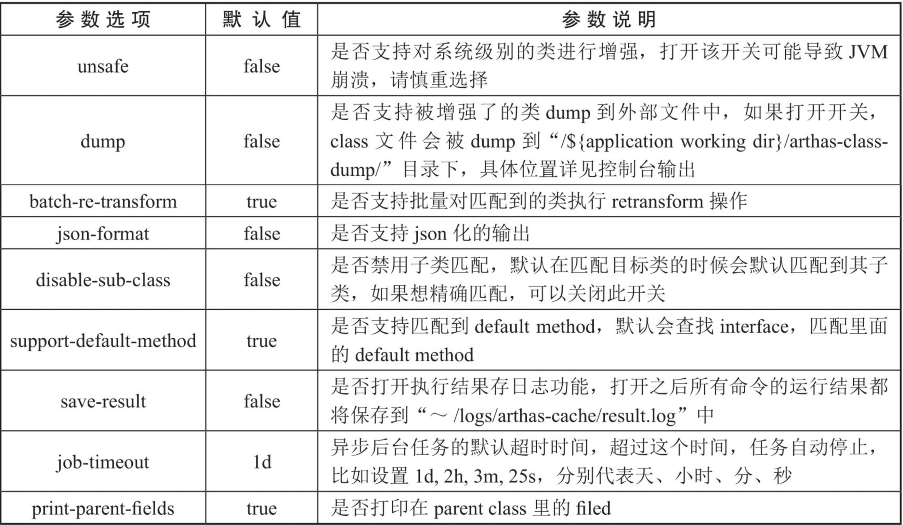

​	案例如下。

①查看所有的options，如下图所示。

<div style="text-align:center;font-weight:bold;">查看所有options</div>

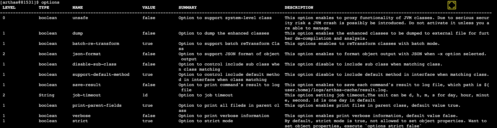

②获取option的值，如下图所示，json-format的值为false。

<div style="text-align:center;font-weight:bold;">获取options的值</div>

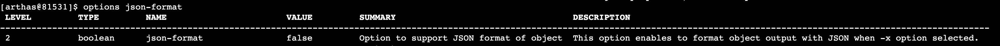

③设置指定的option，例如，打开执行结果存日志功能，输入如下命令即可。


## 22.7 Java Mission Control

### 22.7.1 概述

​	Java Mission Control(JMC)是Java官方提供的性能强劲的工具，它是一个用于对Java应用程序进行管理、监视、概要分析和故障排除的工具套件。它包含一个GUI客户端，以及众多用来收集JVM性能数据的插件，如JMX Console（能够访问用来存放JVM各个子系统运行数据的MXBeans），以及JVM内置的高效profiling工具Java Flight Recorder(JFR)。

​	JMC的另一个优点就是采用取样，而不是传统的代码植入技术，对应用性能的影响非常非常小，完全可以开着JMC来做压测（唯一影响可能是Full GC次数增多）。

​	在Oracle收购Sun之前，Oracle的JRockit虚拟机提供了一款名为JRockit Mission Control的虚拟机诊断工具。在Oracle收购Sun之后，Oracle公司同时拥有了Sun HotSpot和JRockit两款虚拟机。根据Oracle对于Java的战略，在今后的发展中，会将JRockit的优秀特性移植到HotSpot上。其中，一个重要的改进就是在Sun的JDK中加入了JRockit的支持。

### 22.7.2 安装使用

​	Java组件官网：https://docs.oracle.com/en/java/java-components/index.html

​	Java Mission Control官网： https://docs.oracle.com/en/java/java-components/jdk-mission-control/

​	Java Mission Control下载官网：https://www.oracle.com/java/technologies/javase/products-jmc8-downloads.html

​	下载解压完成后，执行包拖入“应用程序”即可。

​	点击打开，如下图所示。

<div style="text-align:center;font-weight:bold;">JMC界面</div>


​	如果是远程服务器，使用前要开JMX，使用如下流程即可打开。

​	(1)服务器配置如下。

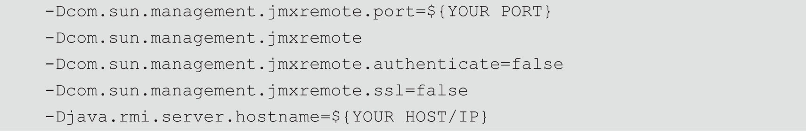

​	(2)客户端单击“文件”→“连接”→“创建新连接”，填入上面JMX参数的host和port。


​	点击”单击此处可开始使用 JDK Mission Control“即可进入主界面，然后右键一个Java进程，选择”启动 JMX 控制台“即可打开控制台。

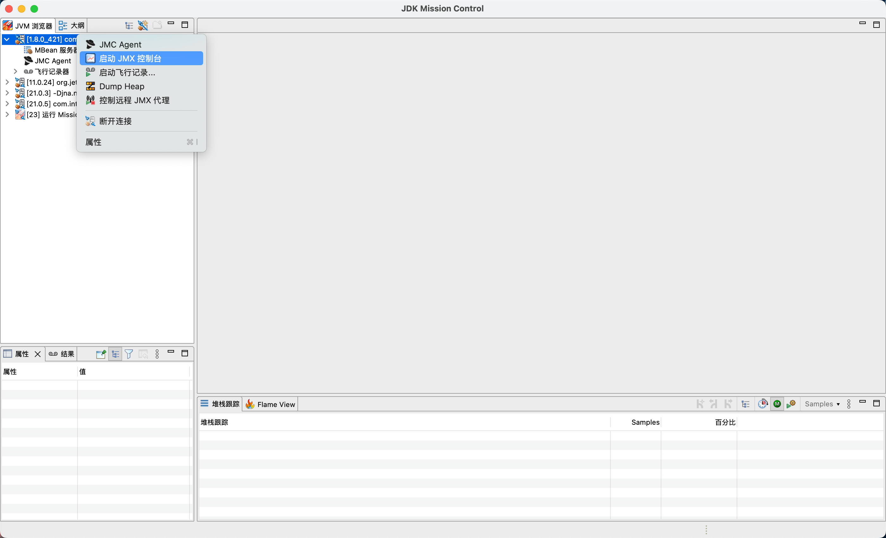

​	“概览”界面如下图所示，Mission Control的界面非常有特色，在默认的界面中，以飞机仪表的视图显示了Java堆使用率、CPU使用率、Live Set和Fragmentation。

<div style="text-align:center;font-weight:bold;">JMC概览界面</div>

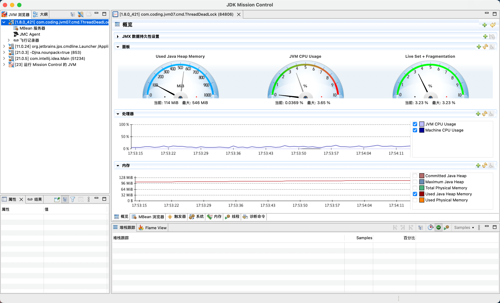

### 22.7.3 功能介绍

​	JMC的一大特点是可以自由设置图表内容。比如，如果希望在飞机仪表面板再增加一个监控项，可以单击右侧的添加按钮“+”，按需添加各种统计图表，如下图所示。

<div style="text-align:center;font-weight:bold;">JMC画板界面</div>


​	例如添加Java堆的空闲内存仪表监控，如下图所示。

<div style="text-align:center;font-weight:bold;">JMC添加仪表监控界面</div>

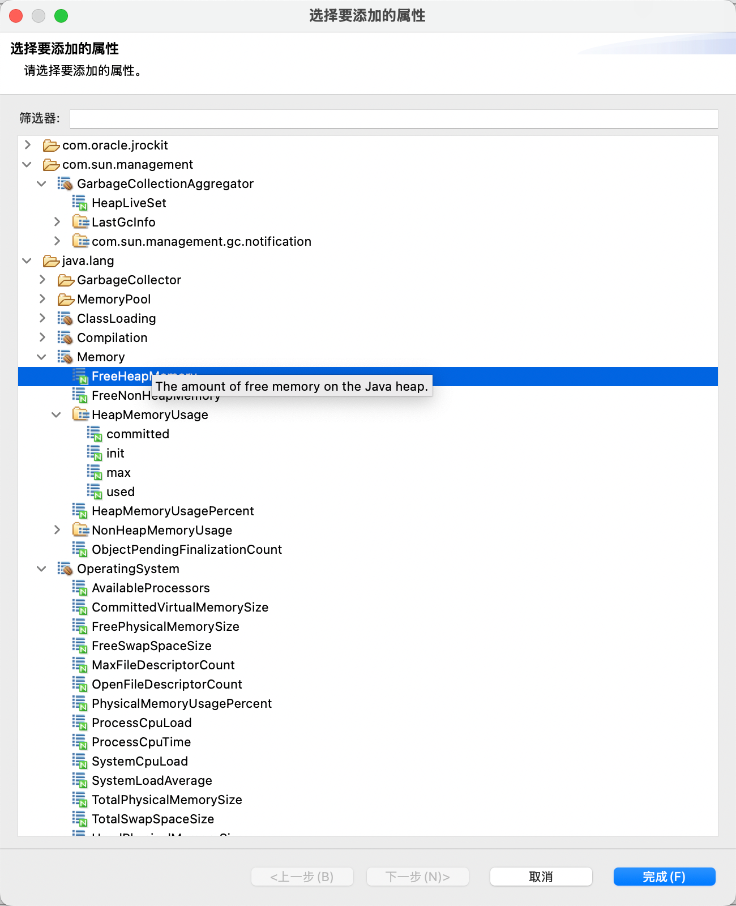

​	单击“完成”按钮，可以看到面板中多了“Free Java Heap Memory”仪表监控，如下图所示。

<div style="text-align:center;font-weight:bold;">JMC添加仪表监控界面</div>

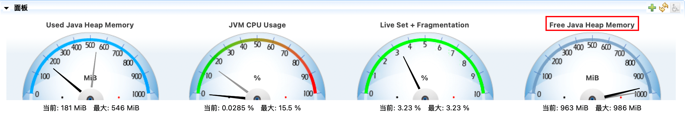

​	JMC概览界面底部选项中的“触发器”选项可以根据CPU、线程等信息，设定一定的阈值来触发报警，如下图所示。

<div style="text-align:center;font-weight:bold;">JMC触发器设置界面</div>

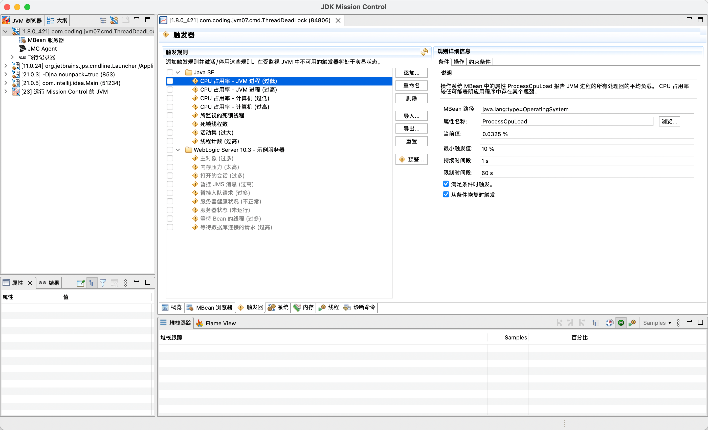

​	“内存”选项提供堆和GC的信息。重点关注GC次数、时间，以及随着GC发生堆的内存变化情况，以此来调整JVM参数，如下图所示。

<div style="text-align:center;font-weight:bold;">JMC内存界面</div>


​	“线程”选项可以关注每条线程所占的CPU、死锁情况和线程堆栈信息，如下图所示。

<div style="text-align:center;font-weight:bold;">JMC线程界面</div>

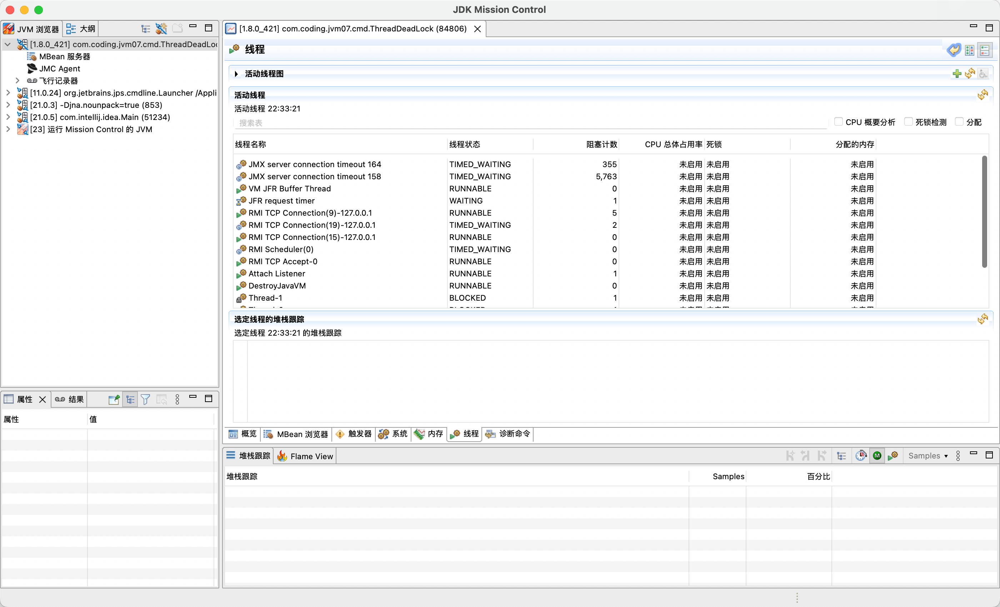

### 22.7.4 Java Flight Recorder介绍

​	Java Flight Recorder(JFR)是JMC的一个组件。JFR能够以极低的性能开销收集JVM的性能数据。自Java11开始，JFR已经开源。但在之前的Java版本，JFR属于商业范畴，需要通过JVM参数-XX:+UnlockCommercialFeatures开启。JFR的性能开销很小，在默认配置下平均低于1%。与其他工具相比，JFR能够直接访问JVM内的数据，并且不会影响JVM的优化。因此，它非常适用于生产环境下满负荷运行的Java程序。

​	JFR和JMC共同创建了一个完整的工具链。JMC可对JFR连续收集低水平和详细的运行时信息进行高效详细的分析。

​	当启用时，JFR将记录运行过程中发生的一系列事件。其中包括Java层面的事件，如线程事件、锁事件，以及JVM内部的事件，如新建对象、垃圾回收和即时编译事件。

​	按照发生时机以及持续时间来划分，JFR的事件共有四种类型。

​	1、瞬时事件(Instant Event)：用户关心的是它们发生与否，例如异常、线程启动事件。

​	2、持续事件(Duration Event)：用户关心的是它们的持续时间，例如垃圾回收事件。

​	3、计时事件(Timed Event)：时长超出指定阈值的持续事件。

​	4、取样事件(Sample Event)：周期性取样的事件。

​	取样事件的其中一个常见例子便是方法抽样(Method Sampling)，即每隔一段时间统计各个线程的栈轨迹。如果在这些抽样取得的栈轨迹中存在一个反复出现的方法，那么就可以推测该方法是否为热点方法。

​	JFR启动方式主要有三种。

​	1、第一种是在运行目标Java程序时添加-XX:StartFlightRecording=参数。

​	比如，下面命令中，JFR将会在JVM启动5s后（对应delay=5s）收集数据，持续20s（对应duration=20s）。当收集完毕后，JFR会将收集得到的数据保存至指定的文件中（对应filename=myrecording.jfr）。settings=profile指定了JFR所收集的事件类型。默认情况下，JFR将加载配置文件JDK/lib/jfr/default.jfc，并识别其中所包含的事件类型。当使用了settings=profile配置时，JFR将加载配置文件JDK/lib/jfr/default.jfc，并识别其中所包含的事件类型。该配置文件所包含的事件类型要多于默认的default.jfc，因此性能开销也要大一些（约为2%）。default.jfc以及profile.jfc均为XML文件。

```bash
-XX:StartFlightRecording=delay=5s,duration=20s,filename=myrecording.jfr,settings=profile
```

​	由于JFR将持续收集数据，如果不加以限制，那么JFR可能会填满硬盘的所有空间。因此，我们有必要对这种模式下所收集的数据进行限制。比如，在这条命令中，maxage=10m指的是仅保留10分钟以内的事件，maxsize=100m指的是仅保留100MB以内的事件。一旦所收集的事件达到其中任意一个限制，JFR便会开始清除不合规格的事件。然而，为了保持较小的性能开销，JFR并不会频繁地校验这两个限制。因此，在实践过程中往往会发现指定文件的大小超出限制，或者文件中所存储事件的时间超出限制。最后一个参数name就是一个标签，当同一进程中存在多个JFR数据收集操作时，可以通过该标签来辨别。

```bash
-XX:StartFlightRecording=maxage=10m,maxsize=100m,name=SomeLabel
```

​	2、通过jcmd来让JFR开始收集数据、停止收集数据，或者保存所收集的数据，对应的子命令分别为JFR.start、JFR.stop，以及JFR.dump。

```bash
$ jcmd <PID>JFR.start settings=profile maxage=10m maxsize=150mname=SomeLabel
```

​	上述命令运行过后，目标进程中的JFR已经开始收集数据。此时，可以通过下述命令来导出已经收集到的数据。

```bash
$ jcmd <PID>JFR.dump name=SomeLabel filename=myrecording.jfr
```

​	最后，可以通过下述命令关闭目标进程中的JFR。

```bash
$ jcmd <PID>JFR.stop name=SomeLabel
```

​	3、通过JMC的JFR组件来启动，如下图所示。

<div style="text-align:center;font-weight:bold;">启动JFR组件界面</div>

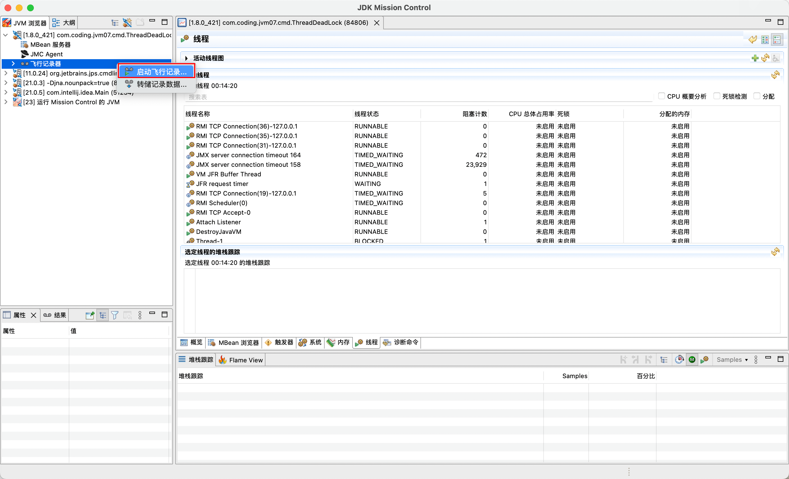

​	通过JFR取样分析需要先在程序运行前添加JVM参数，参数如下。

```bash
# JDK9及更高版本
-XX:+UnlockCommercialFeatures -XX:StartFlightRecording
# JDK7u4及更高版本：
-XX:+UnlockCommercialFeatures -XX:+FlightRecorder -XX:FlightRecorderOptions=defaultrecording=true
```

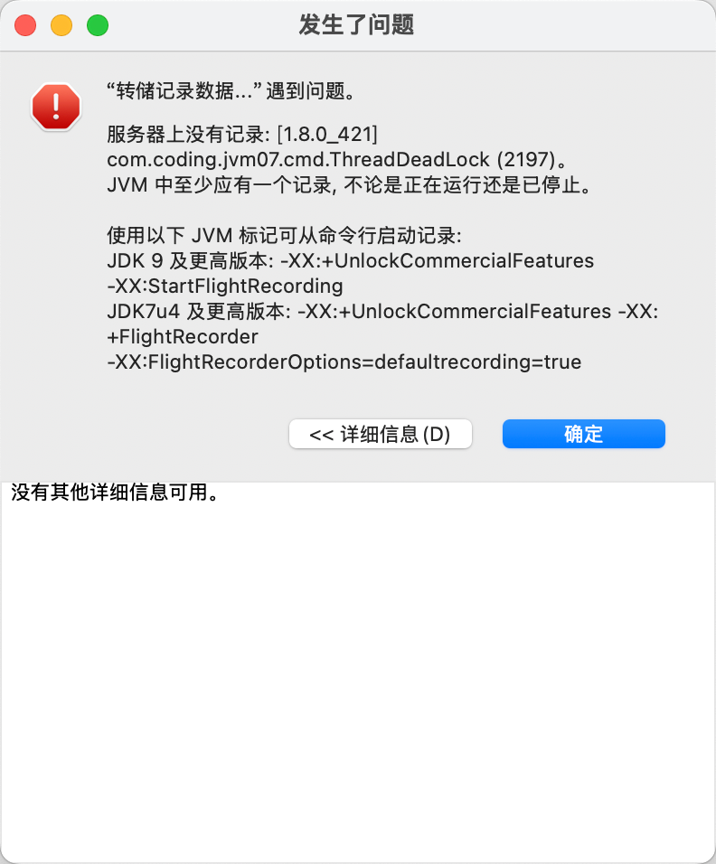

​	否则将会报以下问题，如下图所示。

<div style="text-align:center;font-weight:bold;">问题提示界面</div>

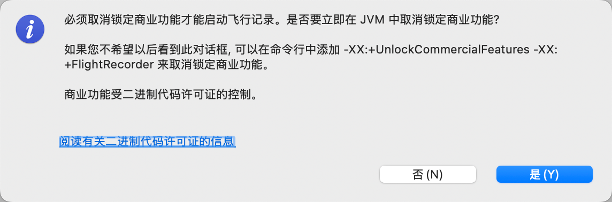

​	当右击选择弹出菜单中的“Start Flight Recording…”或者直接双击，JMC便会弹出另一个窗口，用来配置JFR的启动参数，如下图所示。

<div style="text-align:center;font-weight:bold;">配置JFR的启动参数</div>

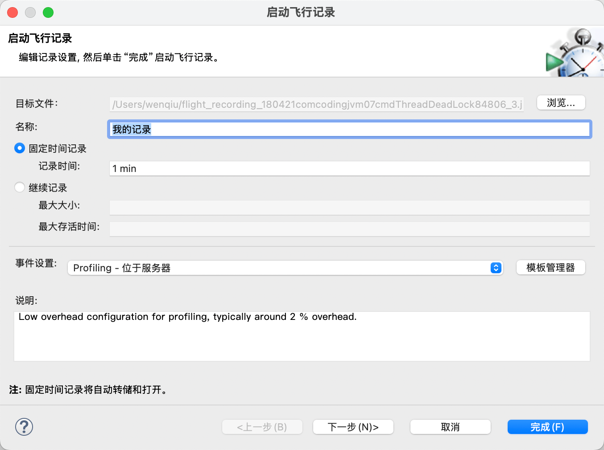

​	这里的配置参数与前两种启动JFR的方式并无二致，同样也包括标签名、收集数据的持续时间、缓存事件的时间及空间限制，以及配置所要监控事件的Event settings（这里对应前两种启动方式的settings=default|profile）。JMC提供了两个选择：Continuous和Profiling，分别对应$JDK/lib/jfr/里的default.jfc和profile.jfc。

​	取样时间默认1分钟，可自行按需调整，事件设置选Profiling，然后可以设置取样Profile哪些信息。比如加上对象数量的统计：“Java Virtual Machine”→“GC”→“Detailed”→“Object Count/Object Count after GC”，如下图所示，勾选右侧“已启用”。

<div style="text-align:center;font-weight:bold;">设置取样指标</div>

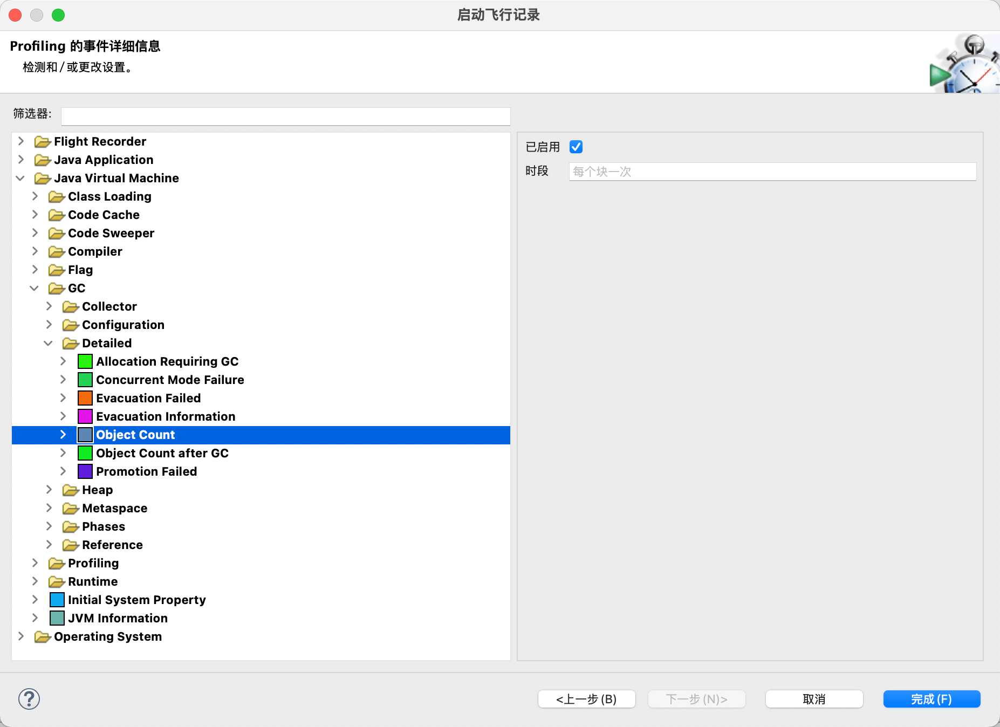

​	方法调用采样的间隔从10ms改为1ms，注意不能低于1ms，否则会影响性能。选择“Java Virtual Machine”→“Profiling”→“Method Profiling Sample/Method Sampling Information”选项，如下图所示。

<div style="text-align:center;font-weight:bold;">设置采样间隔时间</div>

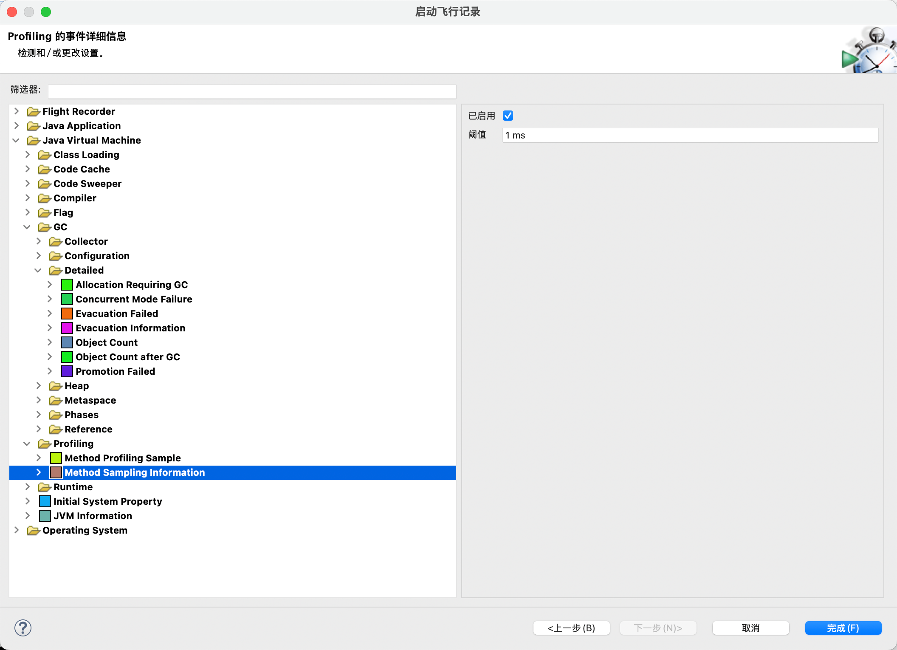

​	然后就开始Profile，到时间后Profile结束，会自动把记录下载回来，在JMC中展示，如下图所示。

<div style="text-align:center;font-weight:bold;">采样记录展示</div>

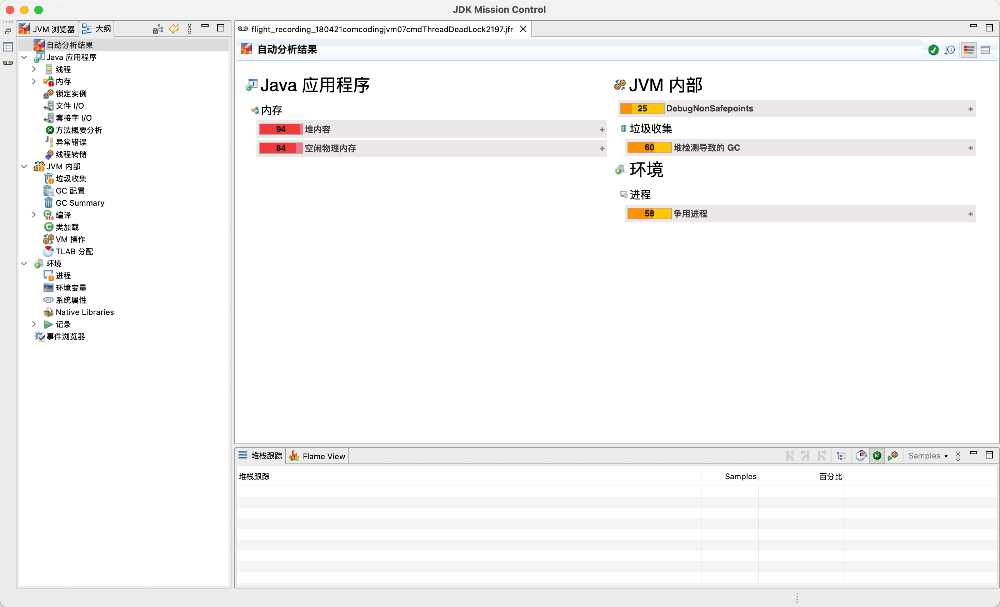

​	从展示信息中，我们大致可以读到内存、CPU、代码、线程和I/O等比较重要的信息展示。它可以显示系统中的热点方法和占用的时间，下图显示了占用CPU时间最多的方法调用树信息。

## 22.8 其他工具

### 22.8.1 TProfiler

​	TProfiler的下载： https://github.com/alibaba/TProfiler/wiki

​	阿里开源工具TProfiler可以用来定位性能代码，解决GC过于频繁的性能瓶颈，并最终将系统TPS再提升。TProfiler的下载地址可扫码获取。

​	TProfiler配置部署、远程操作、日志阅读都不太复杂，但是其却能够起到一针见血、立竿见影的效果，帮助解决GC过于频繁的性能瓶颈。

​	TProfiler最重要的特性就是能够统计出指定时间段内JVM的top method，这些top method极有可能就是造成JVM性能瓶颈的元凶。这是其他大多数JVM调优工具所不具备的，包括JRockit Mission Control。JRockit开发人员Marcus Hirt曾明确指出JRMC并不支持TOP方法的统计。

### 22.8.2 Java运行时追踪工具BTrace

​	BTrace是SUN Kenai云计算开发平台下的一个开源项目，旨在为Java提供安全可靠的动态跟踪分析工具，是一个Java平台的安全的动态追踪工具，可以用来动态地追踪一个运行的Java程序。BTrace通过动态调整目标应用程序的类，从而注入跟踪代码，我们称这种方法为字节码跟踪。

​	另外还有其他工具可以供各位读者参考使用，例如HouseMD（该项目已经停止开发）、Greys-Anatomy（个人开发）、Byteman（JBoss出品）、YourKit、JProbe，以及Spring Insight等。
