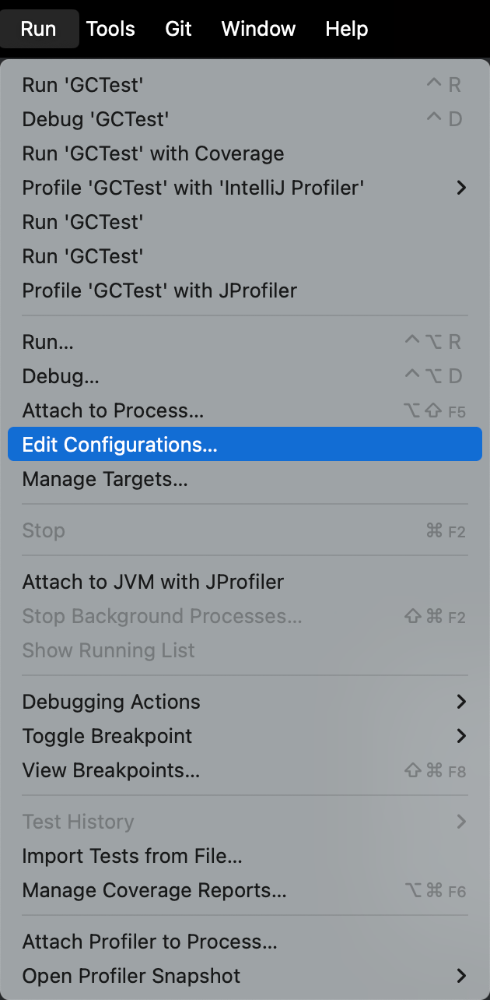
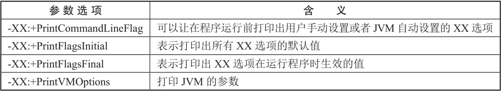
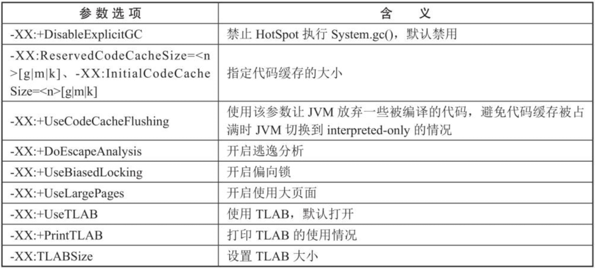

# 第23章 JVM运行时参数

​	熟悉JVM参数对于系统调优是非常重要的。比如一个高流量的延迟的电子交易平台，它要求的响应时间都是毫秒级的。要获得适合的参数组合需要大量的分析和不断地尝试，更依赖交易系统的特性。

​	在前面的章节中，多多少少都使用到了JVM参数，比如配置堆的初始化大小、堆空间最大值，以及输出日志信息等参数。但是并没有很详细地介绍JVM运行时参数都有哪些以及它们有哪些分类。本章将主要讲解JVM的运行时参数的分类及其使用方式。

## 23.1 JVM参数选项类型

​	JVM参数总体上来说分为三大类，分别是标准参数选项、非标准参数选项和非稳定参数选项，下面分别详细介绍三大参数类型。

### 23.1.1 标准参数选项

​	所有的JVM都必须实现标准参数的功能，而且向后兼容。标准参数是相对比较稳定的参数，后续版本基本不会发生变化，参数以“-”开头，例如读者常见的“-version”参数就是标准参数。获取标准参数的命令是在终端输入“java”或者“java --help”命令即可，获取结果如下表所示。

<div style="text-align:center;font-weight:bold;">标准化参数选项</div>


​	需要注意的是HotSpot虚拟机的两种模式，分别是Server和Client，分别通过-server和-client模式设置。

​	在32位Windows系统上，默认使用Client类型的JVM。要想使用Server模式，则机器配置至少有2个以上的CPU和2GB以上的物理内存。Client模式适用于对内存要求较小的桌面应用程序，默认使用Serial串行垃圾收集器。

​	64位机器上只支持Server模式的JVM，适用于需要大内存的应用程序，默认使用并行垃圾收集器。

​	关于server和client的官网介绍为：

​	https://docs.oracle.com/javase/8/docs/technotes/guides/vm/server-class.html

### 23.1.2 非标准参数选项

​	我们知道JVM可以有不同的生产厂商，非标准参数的意思是并不保证所有JVM都对非标准参数进行实现，即只能被部分JVM识别且不保证向后兼容，功能相对来说也是比较稳定的，但是后续版本有可能会变更，参数以“-X”开头。可以用java -X来检索非标准参数，不能保证所有参数都可以被检索出来，例如其中就没有-Xcomp。下表列出了常见的非标准参数。

<div style="text-align:center;font-weight:bold;">非标准参数</div>


​	特别注意的是-Xint参数表示禁用JIT，所有的字节码都被解释执行，这个模式下系统启动最快，但是执行效率最低。-Xcomp表示JVM采用编译模式，代码执行很快，但是启动会比较慢。-Xmixed表示JVM采用混合模式，启动速度较快，让JIT根据程序运行的情况，对热点代码实行检测和编译。

​	虽然-Xms、-Xmx和-Xss三个参数归属于-X参数选项，但是这三个参数的执行效果分别等同于非稳定参数中的-XX:InitialHeapSize、-XX:MaxHeapSize和-XX:ThreadStackSize。

​	非标准选项：https://docs.oracle.com/javase/8/docs/technotes/tools/unix/java.html#BABHDABI

| 参数选项名                                                   | 含义                                                         |
| ------------------------------------------------------------ | ------------------------------------------------------------ |
| <span style="color:red;font-weight:bold;">-Xmixed</span>     | 混合模式执行 (默认)                                          |
| <span style="color:red;font-weight:bold;">-Xint</span>       | 仅解释模式执行                                               |
| <span style="color:red;font-weight:bold;">-Xcomp</span>      | 仅采用即时编译器模式                                         |
| -Xbootclasspath:<用 ; 分隔的目录和 zip/jar 文件>             | 设置搜索路径以引导类和资源                                   |
| -Xbootclasspath/a:<用 ; 分隔的目录和 zip/jar 文件>           | 附加在引导类路径末尾                                         |
| -Xbootclasspath/p:<用 ; 分隔的目录和 zip/jar 文件>           | 置于引导类路径之前                                           |
| -Xdiag                                                       | 显示附加诊断消息                                             |
| -Xnoclassgc                                                  | 禁用类垃圾收集                                               |
| -Xincgc                                                      | 启用增量垃圾收集                                             |
| -Xloggc:`<file>`                                               | 将 GC 状态记录在文件中 (带时间戳)                            |
| -Xbatch                                                      | 禁用后台编译                                                 |
| <span style="color:blue;font-weight:bold;">`-Xms<size>`</span> | 设置初始 Java 堆大小，等价于 -XX:InitialHeapSize             |
| <span style="color:blue;font-weight:bold;">`-Xmx<size>`</span> | 设置最大 Java 堆大小，等价于 -XX:MaxHeapSize                 |
| <span style="color:blue;font-weight:bold;">`-Xss<size>`</span> | 设置 Java 线程堆栈大小，等价于 -XX:ThreadStackSize           |
| <span style="color:blue;font-weight:bold;">`-Xmn<size>`</span> | 设置新生代内存，比-XX:NewRatio优先级高，等价于 -XX:NewSize 和 -XX:MaxNewSize |
| -Xprof                                                       | 输出 cpu 配置文件数据                                        |
| -Xfuture                                                     | 启用最严格的检查, 预期将来的默认值                           |
| -Xrs                                                         | 减少 Java/VM 对操作系统信号的使用 (请参阅文档)               |
| -Xcheck:jni                                                  | 对 JNI 函数执行其他检查                                      |
| -Xshare:off                                                  | 不尝试使用共享类数据                                         |
| -Xshare:auto                                                 | 在可能的情况下使用共享类数据 (默认)                          |
| -Xshare:on                                                   | 要求使用共享类数据, 否则将失败。                             |
| -XshowSettings                                               | 显示所有设置并继续                                           |
| -XshowSettings:all                                           | 显示所有设置并继续                                           |
| -XshowSettings:vm                                            | 显示所有与 vm 相关的设置并继续                               |
| -XshowSettings:properties                                    | 显示所有属性设置并继续                                       |
| -XshowSettings:locale                                        | 显示所有与区域设置相关的设置并继续                           |

### 23.1.3 非稳定参数选项

​	非稳定参数选项以-XX开头，也属于非标准参数，相对不稳定，在JVM中是不健壮的，也可能会突然直接取消某项参数，主要用于JVM调优和调试。但是这些参数中有很多参数对于JVM调优很有用处，所以也是使用最多的参数选项。

​	-XX参数又分为布尔类型参数和非布尔类型参数。布尔类型的格式为`-XX:+/-<option>`,`-XX:+<option>`表示启用option,`-XX:-<option>`表示禁用option。例如-XX:+UseParallelGC表示开启ParallelGC垃圾收集器，-XX:-UseParallelGC表示关闭ParallelGC垃圾收集器，有些参数是默认开启的，调优的时候可以考虑关闭某些参数。

​	非布尔类型的参数也可以理解为Key-Value型的参数，可以分为数值类型和非数值类型。数值类型格式为`-XX:<option>=<number>`,number可以带上单位（k、K表示千字节，m、M表示兆，或者使用更大的内存单位g、G），例如-XX:NewSize=1024m表示设置新生代初始大小为1024MB。非数值类型格式为`-XX:<option>=<String>`，例如-XX:HeapDumpPath=/usr/local/heapdump.hprof用来指定heap转存文件的存储路径。

​	通过“java -XX:+PrintFlagsFinal”命令可以查看所有的-XX参数，如下图所示，篇幅原因截取部分截图。

<div style="text-align:center;font-weight:bold;">XX参数选项</div>


​	上图倒数第二列参数的取值有多种，如下所示。

(1)product表示该类型参数是官方支持的，属于JVM内部选项。
(2)rw表示可动态写入。
(3)C1表示Client JIT编译器。
(4)C2表示Server JIT编译器。
(5)pd表示平台独立。
(6)lp64表示仅支持64位JVM。
(7)manageable表示可以运行时修改。
(8)diagnostic表示用于JVM调试。
(9)experimental表示非官方支持的参数。

​	默认不包含diagnostic和experimental两种类型，想要包含该类型的参数可以配合参数-XX:+UnlockDiagnosticVMOptions和-XX:+UnlockExperimentalVMOptions使用，例如java -XX:+PrintFlagsFinal -XX:+UnlockDiagnosticVMOptions命令结果如下（部分结果），包含了diagnostic类型的参数。同理可以添加-XX:+UnlockExperimentalVMOptions参数用于包含experimental类型的参数，不再演示。


- 特点：

    - 非标准化参数
    - <span style="color:red;font-weight:bold;">使用的最多的参数类型</span>
    - 这类选项属于实现性，不稳定
    - <span style="color:red;font-weight:bold;">以 -XX 开头</span>

- 作用：用于开发和调试JVM

- 分类：

    - Boolean类型格式
        - `-XX:+<option>` 表示启用option属性
        - `-XX:-<option>` 表示禁用option属性
        - 说明：因为有的指令默认是开启的，所以可以使用`-`关闭
        - 举例
            - -XX:+UseParallelGC 选择垃圾收集器为并行收集器
            - -XX:+UseG1GC 表示启用G1收集器
            - -XX:+UseAdaptiveSizePolicy 自动选择年轻代区大小和相应的Survivor区比例

    - 非Boolean类型格式（key-value类型）
        - 子类型1：数值型格式`-XX:<option>=<number>`
            - number表示数值，number可以带上单位，比如：'m'、'M'表示兆，'k'、'K'表示KB，'g'、'G'表示g（例如32K跟32768是一样的效果）
            - 例如：
                - -XX:NewSize=1024m 表示设置新生代初识大小为1024兆
                - -XX:MaxGCPauseMillis=500 表示设置GC停顿时间：500毫秒
                - -XX:GCTimeRatio=19 表示设置吞吐量（默认99），表示收集器执行时间占总耗时的1/(1+N)，N默认99.
                - -XX:NewRatio=2 表示新生代与老年代的比例
        - 子类型2：非数值型格式`-XX:<name>=<string>`
            - 例如：
                - -XX:HeapDumpPath=/usr/local/heapdump.hprof 用来指定heap转存文件的存储路径

- 特别地：

    - -XX:+PrintFlagsFinal
        - 输出所有参数的名称和默认值
        - 默认不包括 Diagnostic 和 Experimental 的参数
        - 可以配合 -XX:+UnlockDiagnosticVMOptions 和 -XX:UnlockExperimentalVMOption 使用

## 23.2 添加JVM参数的方式

​	在工作中经常需要配置JVM参数，一般有以下几种方式。

### 23.2.1 Eclipse界面配置

​	单击鼠标右键选中目标工程，选择“Run As”→“Run Configurations”→“Arguments”选项。在VM arguments里面填入需要的JVM参数即可。例如填入-Xmx256m，这样就可以设置运行时最大内存为256MB,Eclipse配置参数如下图所示。

<div style="text-align:center;font-weight:bold;">EclipseJVM参数配置</div>


### 23.2.2 IDEA界面配置

​	鼠标右键选中目标工程，选择“Run”→“Edit Configurations”选项，如图23-3所示。选中要添加JVM参数的Application，然后在Configuration里面的VM options中输入想要添加的JVM参数即可，如图23-4所示，例如填入-Xmx256m，这样就可以设置运行时最大内存为256MB。

<div style="text-align:center;font-weight:bold;">IDEA参赛配置1</div>



<div style="text-align:center;font-weight:bold;">IDEA参赛配置2</div>


### 23.2.3 通过java命令配置

​	通过java命令运行class或者jar包的时候也可以添加JVM参数，一般多用于工程测试，如下所示。

```bash
# 运行jar包时添加JVM参赛
% java -Xms128m -Xmx256m -jar demo.jar
% java -Xms50m -Xmx50m -XX:+PrintGCDetails -XX:+PrintGCTimeStamps -jar demo.jar
# 运行类的字节码文件时添加JVM参赛
% java -Xms128m -Xmx256m 类名
```

### 23.2.4 通过web服务器配置

​	Linux系统下可以在tomcat/bin/catalina.sh中添加如下JVM配置。

```bash
JAVA_OPTS="-Xms512M -Xmx1024M"
```

​	Windows系统下可以在catalina.bat中添加如下配置。

```bash
set "JAVA_OPTS=-Xms512M -Xmx1024M"
```

### 22.2.5 通过jinfo命令配置

​	jinfo命令在第20章已经详细讲过，这里不再赘述。

## 23.3 常用JVM参数选项

​	JVM参数选项那么多，在工作中有很多参数是很少用到的，这里汇总了几大常用的参数分类，如下所示。

### 23.3.1 打印设置的XX选项及值

​	输出设置的-XX参数以及参数值的参数选项如下表所示。

<div style="text-align:center;font-weight:bold;">输出设置的-XX参数以及参数值的参数选项</div>



### 23.3.2 堆、栈、方法区等内存大小设置

​	堆、栈、方法区等内存大小设置的参数选项如下表所示。

<div style="text-align:center;font-weight:bold;">堆、栈、方法区等内存大小设置的参数选项</div>


- 堆内存参数

| 参数                            | 作用                                                         |
| ------------------------------- | ------------------------------------------------------------ |
| -Xms3550m                       | 等价于-XX:InitialHeapSize，设置JVM初始堆内存为3550M          |
| -Xmx3550m                       | 等价于-XX:MaxHeapSize，设置JVM最大堆内存为3550M              |
| -Xmn2g                          | 等价于-XX:-XX:NewSize,设置年轻代大小为2G，官方推荐配置为整个堆大小的3/8 |
| -XX:NewSize=1024m               | 设置年轻代初始值为1024M                                      |
| -XX:MaxNewSize=1024m            | 设置年轻代最大值为1024M                                      |
| -XX:SurvivorRatio=8             | 设置年轻代中Eden区与一个Survivor区的比值，默认为8            |
| -XX:+UseAdaptiveSizePolicy      | 自动选择各区大小比例，默认开启的                             |
| -XX:NewRatio=4                  | 设置老年代与年轻代（包括1个Eden和2个Survivor区）的比值；默认值2 |
| -XX:PretenureSizeThreshold=1024 | 设置让大于此阈值的对象直接分配在老年代，单位为字节；<br />仅对Serial、ParNew收集器有效。 |
| -XX:MaxTenuringThreshold=15     | 默认值为15；<br />新生代每次MinorGC后，还存活的对象年龄+1，<br />当对象的年龄大于设置的这个值时就进入老年代。 |
| -XX:+PrintTenuringDistribution  | 让JVM在每次MinorGC后打印出当前使用的Survivor中对象的年龄分布 |
| -XX:TargetSurvivorRatio         | 表示MinorGC结束后Survivor区域中占用空间的期望比例            |

- 栈

| 参数     | 作用                                                   |
| -------- | ------------------------------------------------------ |
| -Xss128k | 设置每个线程的栈大小为128k，等价于 -XX:ThreadStackSize |

- 方法区

    - 永久代

      | 参数                 | 作用                   |
                      | -------------------- | ---------------------- |
      | -XX:PermSize=256m    | 设置永久代初始值为256M |
      | -XX:MaxPermSize=256m | 设置永久代最大值为256M |

    - 元空间

      | 参数                            | 作用                              |
                      | ------------------------------- | --------------------------------- |
      | -XX:MetaspaceSize               | 初始空间大小                      |
      | -XX:MaxMetaspaceSize            | 最大空间，默认没有限制            |
      | -XX:+UseCompressedOops          | 压缩对象指针                      |
      | -XX:+UseCompressedClassPointers | 压缩类指针                        |
      | -XX:CompressedClassSpaceSize    | 设置Klass Metaspace的大小，默认1G |

    - 直接内存

      | 参数                    | 作用         |
                      | ----------------------- | ------------ |
      | -XX:MaxDirectMemorySize | 直接内存大小 |

### 23.3.3 OutOfMemory相关选项

​	OutOfMemory相关的参数选项如下表所示。

<div style="text-align:center;font-weight:bold;">OutOfMemory相关的参数选项</div>


​	XX:OnOutOfMemoryError表示当发生内存溢出的时候，还可以让JVM调用任一个shell脚本。大多数时候，内存溢出并不会导致整个应用都挂掉，但是最好还是把应用重启一下，因为一旦发生了内存溢出，可能会让应用处于一种不稳定的状态，一个不稳定的应用可能会提供错误的响应。例如使用以下命令。

```bash
-XX:OnOutOfMemoryError=/opt/Server/restart.sh
```

​	当给JVM传递上述参数的时候，如果发生了内存溢出，JVM会调用/opt/Server/restart.sh这个脚本，在这个脚本中可以去用优雅的办法来重启应用。restart.sh脚本如下所示。

Linux环境：

```bash
#!/bin/bash
pid=$(ps -ef|grep Server.jar|awk '{if($8=="java"){print $2}}')
kill -9 $pid
cd /opt/Server/;sh run.sh
```

Windows环境：

```bat
echo off
wmic process where Name='java.exe' delete
cd D:\Server
start run.bat
```

### 23.3.4 垃圾收集器相关选项

​	垃圾收集器相关的参数选项因垃圾收集器的不同而不同，关于垃圾收集器的分类以及配合使用，在第16章有详细的讲解。使用-XX:+PrintCommandLineFlags查看命令行相关参数，从中可以查看到当前系统使用的垃圾收集器，也可以使用命令行指令jinfo查看。

​	Serial收集器作为HotSpot中Client模式下的默认新生代垃圾收集器。Serial Old收集器是运行在Client模式下默认的老年代的垃圾收集器。-XX:+UseSerialGC参数可以指定新生代和老年代都使用串行收集器，表示新生代用Serial GC，且老年代用Serial Old收集器。可以获得最高的单线程收集效率。现在已经很少使用Serial收集器了，本书也不再赘述。

​	ParNew收集器可以使用-XX:+UseParNewGC参数指定。它表示新生代使用并行收集器，不影响老年代。

​	Parallel收集器的相关JVM参数选项如下表所示。

<div style="text-align:center;font-weight:bold;">Parallel收集器的相关JVM参数选项</div>


​	CMS收集器的相关JVM参数选项如下表所示。

<div style="text-align:center;font-weight:bold;">CMS收集器的相关JVM参数选项</div>


​	需要注意的是JDK 9新特性中CMS被标记为Deprecate了，如果对JDK 9及以上版本的HotSpot虚拟机使用参数-XX:+UseConcMarkSweepGC来开启CMS收集器的话，用户会收到一个警告信息，提示CMS未来将会被废弃。JDK 14新特性中删除了CMS垃圾收集器，如果在JDK 14中使用-XX:+UseConcMarkSweepGC的话，JVM不会报错，只是给出一个warning信息，但是不会exit。JVM会自动回退以默认GC方式启动JVM。

​	G1收集器的相关JVM参数选项如下表所示。

<div style="text-align:center;font-weight:bold;">G1收集器的相关JVM参数选项</div>


​	G1收集器主要涉及Mixed GC,Mixed GC会回收新生代和部分老年代，G1关于Mixed GC调优常用参数选项如下表所示。

<div style="text-align:center;font-weight:bold;">G1关于Mixed GC调优常用参数选项</div>


- 查看默认垃圾收集器

    - <span style="color:blue;font-weight:bold;">-XX:+PrintCommandLineFlags</span>：查看命令行相关参数（包含使用的垃圾收集器）

    - 使用命令行指令：**jinfo -flag 相关垃圾回收器参数 进程ID**

      > $ jinfo -flag UseParallelGC 17280
      >
      > $ jinfo -flag UseParallelOldGC 17352

- Serial回收器

  Serial收集器作为HotSpot中Client模式下的默认新生代垃圾收集器。Serial Old是运行在Client模式下默认的老年代的垃圾回收器。

    - <span style="color:blue;font-weight:bold;">-XX:+UseSerialGC</span> ：指定年轻代和老年代都使用串行收集器。等价于新生代用Serial GC，且老年代用Serial Old GC。可以获得最高的单线程收集效率。

- ParNew回收器：  响应速度优先

    - <span style="color:blue;font-weight:bold;">-XX:+UseParNewGC</span> ： 手动指定使用ParNew收集器执行内存回收任务。它表示年轻代使用并行收集器，不影响老年代。
    - <span style="color:blue;font-weight:bold;">-XX:ParallelGCThreads=N</span> ： 限制线程数量，默认开启和CPU数据相同的线程数。

- Parallel回收器：吞吐量优先

    - <span style="color:blue;font-weight:bold;">-XX:+UseParallelGC</span> ： 手动指定年轻代使用Parallel并行收集器执行内存回收任务。
    - <span style="color:blue;font-weight:bold;">-XX:+UseParallelOldGC</span> ： 手动指定老年代都是使用并行回收收集器。
        - 分别适用于新生代和老年代。默认jdk8是开启的。
        - 上面两个参数，默认开启一个，另一个也会被开启。<span style="color:red;font-weight:bold;">（互相激活）</span>
    - <span style="color:blue;font-weight:bold;">-XX:ParallelGCThreads</span> ： 设置年轻代并行收集器的线程数。一般地，最好与CPU数量相等，以避免过多的线程数影响垃圾收集性能。
        - 在默认情况下，当CPU数量小于8个，ParallelGCThreads的值等于CPU数量。
        - 当CPU数量大于8个，ParallelGCThreads的值等于3+[5*CPU_Count]/8]。
    - <span style="color:blue;font-weight:bold;">-XX:MaxGCPauseMillis</span> ： 设置垃圾收集器最大停顿时间（即STW的时间）。单位是毫秒。
        - 为了尽可能地把停顿时间控制在MaxGCPauseMills以内，收集器在工作时会调整Java堆大小或者其他一些参数。
        - 对于用户来讲，停顿时间越短体验越好。但是在服务器端，我们注重高并发，整体的吞吐量。所以服务器端适合Parallel，进行控制。
        - <span style="color:red;font-weight:bold;">该参数使用需谨慎。</span>
    - <span style="color:blue;font-weight:bold;">-XX:GCTimeRatio</span> ： 垃圾收集时间占总时间的比例（=1/(N+1）。用于衡量吞吐量的大小。
        - 取值范围（0,100）。默认值99，也就是垃圾回收时间不超过1%。
        - 与前一个-XX:MaxGCPauseMillis参数有一定矛盾性。暂停时间越长，Radio参数就越容易超过设定的比例。
    - <span style="color:blue;font-weight:bold;">-XX:+UseAdaptiveSizePolicy</span> ： 设置Parallel Scavenge收集器具有**自适应调节策略**。
        - 在这种模式下，年轻代的大小、Eden和Survivor的比例、晋升老年代的对象年龄等参数会被自动调整，已达到在堆大小、吞吐量和停顿时间之间的平衡点。
        - 在手动调优比较困难的场合，可以直接使用这种自适应的方式，仅指定虚拟机的最大堆、目标的吞吐量（GCTimeRatio）和停顿时间（MaxGCPauseMills），让虚拟机自己完成调优工作。

- CMS回收器

    - <span style="color:blue;font-weight:bold;">-XX:+UseConcMarkSweepGC</span> 手动指定使用CMS收集器执行内存回收任务。

        - 开启该参数后会自动将-XX:+UseParNewGC打开。即：ParNew（Young区使用）+CMS（Old区使用）+Serial Old的组合。

    - <span style="color:blue;font-weight:bold;">-XX:CMSInitiatingOccupanyFraction</span> ： 设置堆内存使用率的阈值，一旦达到该阈值，便开始进行回收。

        - JDK5及以前版本的默认值为68，即当老年代的空间使用率达到68%时，会执行一次CMS回收。<span style="color:blue;font-weight:bold;">JDK6及以上版本默认值为92%</span>。
        - 如果内存增长缓慢，则可以设置一个稍微大的值，打的阈值可以有效降低CMS的触发频率，减少老年代回收的次数可以较为明显地改善应用程序性能。反之，如果应用程序内存使用率增长很快，则应该降低这个阈值，以避免频繁触发老年代串行收集器。因此<span style="color:blue;font-weight:bold;">通过该选项便可以有效降低Full GC的执行次数。</span>

    - <span style="color:blue;font-weight:bold;">-XX:+UseCMSCompactAtFullCollection</span> ： 用于指定在执行完Full GC后对内存空间进行压缩整理，以此避免内存碎片的产生。不过由于内存压缩整理过程无法并发执行，所带来的问题就是停顿时间变得更长了。

    - <span style="color:blue;font-weight:bold;">-XX:CMSFullGCsBeforeCompaction</span> ： 设置在执行多少次Full GC后对内存空间进行压缩整理。

    - <span style="color:blue;font-weight:bold;">-XX:ParallelCMSThreads</span> ： 设置CMS的线程数量。

        - CMS默认启动的线程数是（ParallelGCThreads+3）/4，ParallelGCThreads是年轻代并行收集器的线程数。当CPU资源比较紧张时，受到CMS收集器线程的影响，应用程序的性能在垃圾回收阶段可能会非常糟糕。

    - 补充参数

      另外，CMS收集器还有如下常用参数：

        - <span style="color:blue;font-weight:bold;">-XX:ConcGCThreads</span> ： 设置并发垃圾收集的线程数，默认该值是基于ParallelGCThreads计算出来的。
        - <span style="color:blue;font-weight:bold;">-XX:+UseCMSInitiatingOccupancyOnly</span> ： 是否动态可调，用这个参数可以使CMS一直按CMSInitiatingOccupancyFraction设定的值启动。
        - <span style="color:blue;font-weight:bold;">-XX:+CMSScavengeBeforeRemark</span> ： 强制HotSpot虚拟机在CMS remark阶段之前做一次minor gc，用于提高 remark 阶段的速度。
        - <span style="color:blue;font-weight:bold;">-XX:+CMSClassUnloadingEnable</span> ： 如果有的话，启用回收Perm区（JDK8之前）
        - <span style="color:blue;font-weight:bold;">-XX:+CMSParallelInitialEnabled</span> ： 用于开启CMS initial-mark阶段采用多线程的方式进行标记，用于提高标记速度，在Java8开始已经默认开启。
        - <span style="color:blue;font-weight:bold;">-XX:+CMSParallelRemarkEnabled</span> ： 用户开启CMS remark阶段使用多线程的方式进行重新标记，默认开启。
        - <span style="color:blue;font-weight:bold;">-XX:+ExplicitGCInvokesConcurrent、-XX:+ExplicitGCInvokesConcurrentAndUnloadClasses</span> ： 这两个参数用户指定HotSpot虚拟在执行System.gc()时使用CMS周期。
        - <span style="color:blue;font-weight:bold;">-XX:+CMSPrecleaningEnabled</span> ： 指定CMS是否需要进行Pre cleaning这个阶段。

    - 特别说明

        - <span style="color:blue;font-weight:bold;">JDK9新特性：CMS被标记为Deprecate了（JEP291）</span>

            - 如果对JDK9及以上版本的HotSpot虚拟机使用参数-XX:+UseConcMarkSweepGC来开启CMS收集器的话，用户会收到一个警告信息，提示CMS未来将会被废弃。

        - <span style="color:blue;font-weight:bold;">JDK14新特性：删除CMS垃圾回收器（JEP363）</span>

            - 移除了CMS垃圾收集器，如果在JDK14中使用-XX:+UseConcMarkSweepGC的话，JVM不会报错，只是给出一个warning信息，但是不会exit。JVM会自动回退以默认GC方式启动JVM。

          <span style="color:red;font-weight:bold;">OpenJDK 64-Bit Server VM warning: Ignoring option UseConcMarkSweepGC;</span>

          <span style="color:red;font-weight:bold;">support was removed in 14.0</span>

          <span style="color:red;font-weight:bold;">and the VM will continue execution using the default collector.</span>


- G1回收器

    - <span style="color:blue;font-weight:bold;">-XX:+UseG1GC</span> ： 手动指定使用G1收集器执行内存回收任务。

    - <span style="color:blue;font-weight:bold;">-XX:G1HeapRegionSize</span> ： 设置每个Region的大小。值是2的幂，范围是1MB到32MB之间，目标是根据最小的Java堆大小划分出约2048个区域。默认是堆内存的1/2000。

    - <span style="color:blue;font-weight:bold;">-XX:MaxGCPauseMillis</span> ： 设置期望达到的最大GC停顿时间指标（JVM会尽力实现，但不保证达到）。默认值是200ms

    - <span style="color:blue;font-weight:bold;">-XX:ParallelGCThreads</span> ： 设置STW时GC线程数的值。最多设置为8。

    - <span style="color:blue;font-weight:bold;">-XX:ConcGCThreads</span> ： 设置并发标记的线程数。将n设置为并行垃圾回收线程数（ParallelGCThreads）的1/4左右。

    - <span style="color:blue;font-weight:bold;">-XX:InitiatingHeapOccupancyPercent</span> ： 设置触发并发GC周期的Java堆占用率阈值。超过此值，就触发GC。默认值是45。

    - <span style="color:blue;font-weight:bold;">-XX:G1NewSizePercent、-XX:G1MaxNewSizePercent</span> ： 新生代占用整个堆内存的最小百分比（默认5%）、最大百分比（默认60%）

    - <span style="color:blue;font-weight:bold;">-XX:G1ReservePercent=10</span> ： 保留内存区域，防止to space（Survivor中的to区）溢出。

    - Mixed GC调优参数

      注意：G1收集器主要涉及到Mixed GC，Mixed GC会回收young区和部分old区。

      G1关于Mixed GC调优常用参数：

        - <span style="color:blue;font-weight:bold;">-XX:InitiatingHeapOccupancyPercent</span> ： 设置堆占用率的百分比（0到100）达到这个数值的时候触发global concurrent marking（全局并发标记），默认为45%。值为0表示间断进行全局并发标记。
        - <span style="color:blue;font-weight:bold;">-XX:G1MixedGCLiveThresholdPercent</span> ： 设置Old区的region被回收的时候的对象占比，默认占用率为85%。只有Old区的region中存活的对象占用达到了这个百分比，才会在Mixed GC中被回收。
        - <span style="color:blue;font-weight:bold;">-XX:G1HeapWastePercent</span> ： 在global concurrent marking（全局并发标记）结束之后，可以知道所有的区有多少空间要被回收，在每次young GC之后再次发生Mixed GC之前，会检查垃圾占比是否达到此参数，只有达到了，下次才会发生Mixed GC。
        - <span style="color:blue;font-weight:bold;">-XX:G1MixedGCCountTarget</span> ： 一次global concurrent marking（全局并发标记）之后，最多执行Mixed GC的次数，默认是8.
        - <span style="color:blue;font-weight:bold;">-XX:G1OldCSetRegionThresholdPercent</span> ： 设置Mixed GC收集周期中药收集的Old region数的上限。默认值是Java堆的10%。

- 怎么选择垃圾回收器

    - 优先调整堆的大小让JVM自适应完成。
    - 如果内存小于100M，使用串行收集器。
    - 如果是单核、单机程序，并且没有停顿时间的要求，串行收集器。
    - 如果是多CPU、需要高吞吐量、允许停顿时间超过1秒，选择并行或者JVM自己选择。
    - r四是多CPU、最求低停顿时间，需要快速响应（比如，延迟不能超过1秒，如互联网应用），使用并发收集器。官方推荐G1，性能高。<span style="color:blue;font-weight:bold;">现在互联网的项目，基本都是使用G1。</span>

  特别说明：

    1. 没有最好的收集器，更没有万能的收集器。
    2. 调优永远是针对特定场景、特定需求，不存在一劳永逸的收集器。

### 23.3.5 GC日志相关选项

​	GC日志相关的参数选项如下表所示。

<div style="text-align:center;font-weight:bold;">GC日志相关的参数选项</div>


- <span style="color:blue;font-weight:bold;">-verbose:gc</span> ： 输出gc日志信息，默认输出到标准输出。<span style="color:orange;font-weight:bold;">可独立使用</span>
- <span style="color:blue;font-weight:bold;">-XX:+PrintGC</span> 等同于 -verbose:gc ；表示打开简化的GC日志。<span style="color:orange;font-weight:bold;">可独立使用</span>
- <span style="color:blue;font-weight:bold;">-XX:+PrintGCDetails</span> ： 在发生垃圾回收时打印内存回收详细的日志，并在进程退出时输出当前内存各个区域分配情况。<span style="color:orange;font-weight:bold;">可独立使用</span>
- <span style="color:blue;font-weight:bold;">-XX:+PrintGCTimeStamps</span> ： 输出GC发生时的时间戳。<span style="color:orange;font-weight:bold;">需要配合-XX:+PrintGCDetails使用</span>
- <span style="color:blue;font-weight:bold;">-XX:+PrintGCDateStamps</span> ： 输出GC发生时的时间戳（以日期的形式，如2013-05-04T21:53:59.234+0800）。<span style="color:orange;font-weight:bold;">需要配合-XX:+PrintGCDetails使用</span>
- <span style="color:blue;font-weight:bold;">-XX:+PrintHeapAtGC</span> ： 每一次GC前和GC后，都打印堆信息。<span style="color:orange;font-weight:bold;">**可独立使用**</span>
- <span style="color:blue;font-weight:bold;">-Xloggc:`<file>`</span> ： 把GC日志写入到一个文件中去，而不是打印到标准输出中。<span style="color:orange;font-weight:bold;">需要配合-XX:+PrintGCDetails使用</span>


- <span style="color:blue;font-weight:bold;">-XX:+TraceClassLoading</span> ： 监控类的加载
- <span style="color:blue;font-weight:bold;">-XX:+PrintGCApplicationStoppedTime</span> ： 打印GC时线程的停顿时间
- <span style="color:blue;font-weight:bold;">-XX:+PrintGCApplicationConcurrentTime</span> ： 垃圾收集之前打印出应用未中断的执行时间
- <span style="color:blue;font-weight:bold;">-XX:+PrintReferenceGC</span> ： 记录回收了多少种不同引用类型的引用
- <span style="color:blue;font-weight:bold;">-XX:+PrintTenuringDistribution</span> ： 让JVM在每次MinorGC后打印出当前使用的Survivor中对象的年龄分布。
- <span style="color:blue;font-weight:bold;">-XX:+UseGCLogFileRotation</span> ： 启用GC日志文件的自动转储。
- <span style="color:blue;font-weight:bold;">-XX:NumberOfGCLogFiles=1</span> ： GC日志文件的循环数量
- <span style="color:blue;font-weight:bold;">-XX:GCLogFileSize=1M</span> ： 控制GC日志文件的大小

### 23.3.6 其他参数

​	其他常用的参数选项如下表所示。

<div style="text-align:center;font-weight:bold;">其他常用的参数选项</div>




- <span style="color:blue;font-weight:bold;">-XX:+DisableExplicitGC</span> ： 禁止hotspot执行System.gc()，默认禁用。
- <span style="color:blue;font-weight:bold;">-XX:ReservedCodeCacheSize=`<n>`[g|m|k]、-XX:InitialCodeCacheSize=`<n>`[g|m|k]</span> ： 指定代码缓存的大小
- <span style="color:blue;font-weight:bold;">-XX:+UseCodeCacheFlushing</span> ： 使用该参数让jvm放弃一些被编译的代码，避免代码缓存被占满时JVM切换到interpreted-only的情况
- <span style="color:blue;font-weight:bold;">-XX:+DoEscapeAnalysis</span> ： 开启逃逸分析
- <span style="color:blue;font-weight:bold;">-XX:+UseBiasedLocking</span> ： 开启偏向锁
- <span style="color:blue;font-weight:bold;">-XX:+UseLargePages</span> ： 开启使用大页面
- <span style="color:blue;font-weight:bold;">-XX:+UseTLAB</span> ： 使用TLAB，默认打开
- <span style="color:blue;font-weight:bold;">-XX:+PrintTLAB</span> ： 打印TLAB的使用情况
- <span style="color:blue;font-weight:bold;">-XX:TLABSize</span> ： 设置TLAB大小

## 23.4 通过Java代码获取JVM参数

​	Java提供了java.lang.management包用于监视和管理JVM和Java运行时中的其他组件，它允许本地和远程监控和管理运行的JVM，会经常使用到其中的ManagementFactory类。另外还有Runtime类也可以获取一些内存、CPU核数等相关的数据。通过这些API可以监控我们的应用服务器的堆内存使用情况，也可以设置一些阈值进行报警等处理，如下代码演示了Java代码获取应用的内存使用情况。

<span style="color:#40E0D0;">案例1：获取JVM内存使用情况</span>

- 代码

```java
package com.coding.jvm07.vmoptions;

import java.lang.management.ManagementFactory;
import java.lang.management.MemoryMXBean;
import java.lang.management.MemoryPoolMXBean;
import java.lang.management.MemoryUsage;

/**
 * 监控我们的应用服务器的堆内存使用情况，设置一些阈值进行报警等处理。
 */
public class MemoryMonitor {

    public static void main(String[] args) {
        System.out.println("\nAuto Information:");
        for (MemoryPoolMXBean memoryPoolMXBean : ManagementFactory.getMemoryPoolMXBeans()) {
            System.out.println(memoryPoolMXBean.getName() + " 已经使用：" + memoryPoolMXBean.getUsage().getUsed() / 1024 / 1024 + "MB" + " 总大小：" +
                    memoryPoolMXBean.getUsage().getCommitted() / 1024 / 1024 + "MB");
        }
        System.out.println("\nSome Information:");
        MemoryMXBean memoryMXBean = ManagementFactory.getMemoryMXBean();
        MemoryUsage usage = memoryMXBean.getHeapMemoryUsage();
        System.out.println("INIT HEAP:" + usage.getInit() / 1024 / 1024 + "m");
        System.out.println("MAX HEAP:" + usage.getMax() / 1024 / 1024 + "m");
        System.out.println("USE HEAP:" + usage.getUsed() / 1024 / 1024 + "m");
        System.out.println("\nFull Information:");
        System.out.println("Heap Memory Usage:" + memoryMXBean.getHeapMemoryUsage());
        System.out.println("Non-Heap Memory Usage:" + memoryMXBean.getNonHeapMemoryUsage());
        System.out.println("\n========================通过Java来获取相关系统状态========================\n");
        System.out.println("当前堆内存大小totalMemory:" + (int) Runtime.getRuntime().totalMemory() / 1024 / 1024 + "m");
        System.out.println("空闲堆内存大小freeMemory:" + (int) Runtime.getRuntime().freeMemory() / 1024 / 1024 + "m");
        System.out.println("最大可用总堆内存maxMemory:" + Runtime.getRuntime().maxMemory() / 1024 / 1024 + "m");
    }
}

```

​	运行结果如下，可以看到堆内存的各项信息。


