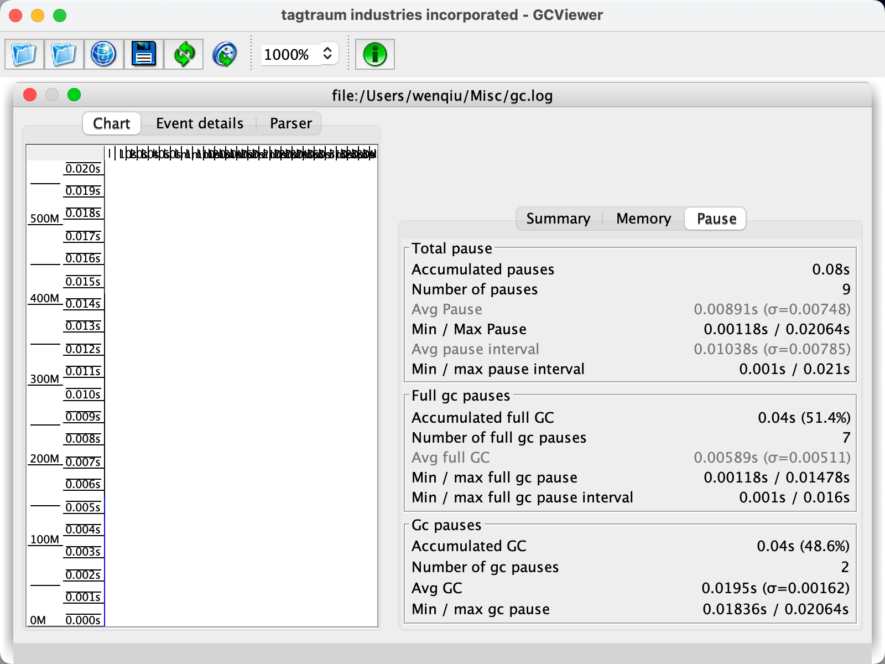
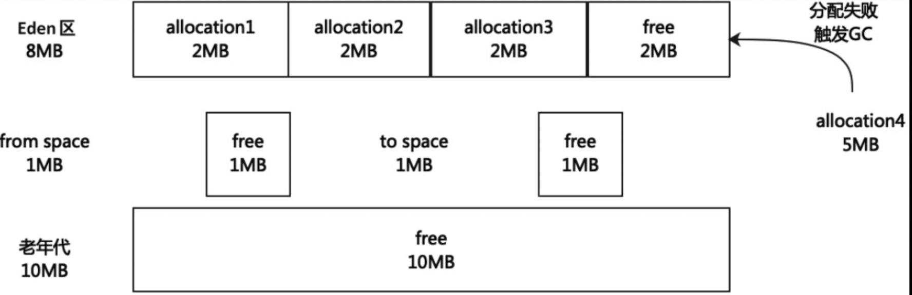
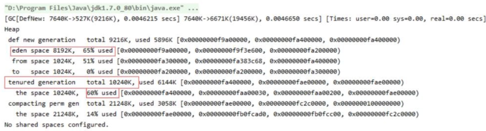

# 第24章 GC日志分析

​	GC日志是JVM产生的一种描述性的文本日志。就像开发Java程序需要输出日志一样，JVM通过GC日志来描述垃圾收集的情况。通过GC日志，我们能直观地看到内存清理的工作过程，了解垃圾收集的行为，比如何时在新生代执行垃圾收集，何时在老年代执行垃圾收集。本章将详细讲解如何分析GC日志。

## 24.1 概述

​	GC日志主要用于快速定位系统潜在的内存故障和性能瓶颈，通过阅读GC日志，我们可以了解JVM的内存分配与回收策略。GC日志根据垃圾收集器分类可以分为Parallel垃圾收集器日志、G1垃圾收集器日志和CMS垃圾收集器日志。第7章讲解堆的时候，垃圾收集分为部分收集和整堆收集，所以也可以把GC日志分为Minor GC日志、Major GC日志和Full GC日志。下面开始解析不同垃圾收集器的GC日志。

## 24.2 生成GC日志

​	解析日志之前，我们需要先生成日志，打印内存分配与垃圾收集日志信息的相关参数如下，更多关于GC日志参数见第23章表<span style="color:blue;font-weight:bold;">GC日志相关的参数选项</span>。

​	1、-XX:+PrintGC

​	该参数表示输出GC日志，和参数-verbose:gc效果一样。

​	2、-XX:+PrintGCDetails

​	该参数表示输出GC的详细日志。

​	3、-XX:+PrintGCTimeStamps

​	该参数表示输出GC的时间戳（以基准时间的形式）

​	4、-XX:+PrintGCDateStamps

​	该参数表示输出GC的时间戳（以日期的形式，如2013-05-04T21:53:59.234+0800）

​	5、-XX:+PrintHeapAtGC

​	该参数表示在进行GC的前后打印出堆的信息。

​	6、-Xloggc:../logs/gc.log

​	该参数表示日志文件的输出路径。

​	使用如下代码演示不同的GC日志参数打印出来的日志效果。

<span style="color:#40E0D0;">案例1：GC日志演示</span>

- 代码

```java
package com.coding.jvm07.vmoptions;

import java.util.ArrayList;

/**
 * -Xms60m -Xmx60m -XX:SurvivorRatio=8 -verbose:gc
 * <p>
 * jdk1.8:
 * -Xms60m -Xmx60m -XX:SurvivorRatio=8 -XX:+PrintGCDetails -XX:+PrintGCTimeStamps -XX:+PrintGCDateStamps -XX:+PrintHeapAtGC -Xloggc:/Users/wenqiu/Misc/gc.log
 * jdk1.8使用G1GC：
 * -Xms60m -Xmx60m -XX:SurvivorRatio=8 -XX:+PrintGCDetails -XX:+PrintGCTimeStamps -XX:+PrintGCDateStamps -XX:+UnlockExperimentalVMOptions -XX:+UseG1GC
 * jdk1.8使用CMS：
 * -Xms60m -Xmx60m -XX:SurvivorRatio=8 -XX:+PrintGCDetails -XX:+PrintGCTimeStamps -XX:+PrintGCDateStamps -XX:+UseConcMarkSweepGC
 * <p>
 * jdk11:
 * -Xlog:gc*:file=/Users/wenqiu/Misc/gc11.log:tags,uptime,time,level
 */
public class GCLogTest {

    public static void main(String[] args) {
        ArrayList<byte[]> list = new ArrayList<>();

        for (int i = 0; i < 600; i++) {
            byte[] arr = new byte[1024 * 100]; // 100KB
            list.add(arr);
            try {
                Thread.sleep(20);
            } catch (InterruptedException e) {
                e.printStackTrace();
            }
        }
    }
}

```

​	配置JVM参数如下。

```bash
-Xms60m -Xmx60m -XX:SurvivorRatio=8
```

​	(1)增加输出GC日志参数如下。

```bash
-verbose:gc
```

​	这个参数只会显示总的GC堆的变化，结果如下。

```bash
[GC (Allocation Failure)  17353K->6841K(63488K), 0.0054519 secs]
[GC (Allocation Failure)  24208K->23716K(63488K), 0.0067550 secs]
[GC (Allocation Failure)  41118K->40566K(63488K), 0.0063732 secs]
[Full GC (Ergonomics)  40566K->40380K(63488K), 0.0179042 secs]
[Full GC (Ergonomics)  57710K->57374K(63488K), 0.0204342 secs]
[Full GC (Ergonomics)  61157K->60606K(63488K), 0.0217548 secs]
```

​	(2)在控制台输出GC日志详情命令如下。

```bash
-verbose:gc
-XX:+PrintGCDetails
```

​	输出日志信息如下。

```bash
[GC (Allocation Failure) [PSYoungGen: 17353K->2032K(19456K)] 17353K->6804K(63488K), 0.0080861 secs] [Times: user=0.01 sys=0.01, real=0.01 secs] 
[GC (Allocation Failure) [PSYoungGen: 19399K->2028K(19456K)] 24172K->23711K(63488K), 0.0057697 secs] [Times: user=0.00 sys=0.01, real=0.01 secs] 
[GC (Allocation Failure) [PSYoungGen: 19430K->2016K(19456K)] 41113K->40506K(63488K), 0.0077306 secs] [Times: user=0.01 sys=0.01, real=0.01 secs] 
[Full GC (Ergonomics) [PSYoungGen: 2016K->0K(19456K)] [ParOldGen: 38489K->40379K(44032K)] 40506K->40379K(63488K), [Metaspace: 8663K->8663K(1056768K)], 0.0215998 secs] [Times: user=0.09 sys=0.01, real=0.02 secs] 
[Full GC (Ergonomics) [PSYoungGen: 17329K->13602K(19456K)] [ParOldGen: 40379K->43772K(44032K)] 57709K->57374K(63488K), [Metaspace: 8672K->8672K(1056768K)], 0.0215331 secs] [Times: user=0.05 sys=0.01, real=0.02 secs] 
[Full GC (Ergonomics) [PSYoungGen: 17323K->17103K(19456K)] [ParOldGen: 43772K->43502K(44032K)] 61096K->60606K(63488K), [Metaspace: 8695K->8644K(1056768K)], 0.0231095 secs] [Times: user=0.06 sys=0.01, real=0.02 secs]
```

​	可以发现较之前的日志信息更加详细了，可以明确看到每个区域的内存变化，这使得对日志的分析更加精确了。

​	(3)增加GC日志打印时间命令如下。

```bash
-verbose:gc
-XX:+PrintGCDetails
-XX:+PrintGCTimeStamps
-XX:+PrintGCDateStamps
```

​	输出日志信息如下。

```bash
2024-12-13T16:55:14.247-0800: 1.198: [GC (Allocation Failure) [PSYoungGen: 17353K->2024K(19456K)] 17353K->6872K(63488K), 0.0071370 secs] [Times: user=0.02 sys=0.01, real=0.01 secs] 
2024-12-13T16:55:18.242-0800: 5.194: [GC (Allocation Failure) [PSYoungGen: 19391K->2024K(19456K)] 24239K->23787K(63488K), 0.0063350 secs] [Times: user=0.01 sys=0.01, real=0.00 secs] 
2024-12-13T16:55:22.309-0800: 9.261: [GC (Allocation Failure) [PSYoungGen: 19365K->2044K(19456K)] 41128K->40606K(63488K), 0.0074474 secs] [Times: user=0.01 sys=0.02, real=0.01 secs] 
2024-12-13T16:55:22.317-0800: 9.268: [Full GC (Ergonomics) [PSYoungGen: 2044K->0K(19456K)] [ParOldGen: 38561K->40382K(44032K)] 40606K->40382K(63488K), [Metaspace: 8663K->8663K(1056768K)], 0.0160206 secs] [Times: user=0.12 sys=0.01, real=0.02 secs] 
2024-12-13T16:55:26.404-0800: 13.356: [Full GC (Ergonomics) [PSYoungGen: 17330K->13602K(19456K)] [ParOldGen: 40382K->43772K(44032K)] 57712K->57374K(63488K), [Metaspace: 8672K->8672K(1056768K)], 0.0232205 secs] [Times: user=0.14 sys=0.02, real=0.02 secs] 
2024-12-13T16:55:27.298-0800: 14.249: [Full GC (Ergonomics) [PSYoungGen: 17384K->17203K(19456K)] [ParOldGen: 43772K->43502K(44032K)] 61157K->60706K(63488K), [Metaspace: 8695K->8644K(1056768K)], 0.0093000 secs] [Times: user=0.08 sys=0.00, real=0.01 secs] 
2024-12-13T16:55:27.357-0800: 14.309: [Full GC (Ergonomics) [PSYoungGen: 17408K->17403K(19456K)] [ParOldGen: 43502K->43502K(44032K)] 60910K->60906K(63488K), [Metaspace: 8646K->8646K(1056768K)], 0.0038409 secs] [Times: user=0.02 sys=0.00, real=0.01 secs]
```

​	可以看到日志信息中带上了日期，方便在生产环境中根据日期去定位GC日志2022-03-25T16:14:53.423-0800表示的日志打印时间，该信息是参数“-XX:+PrintGCDateStamps”起的作用；后面的6.948表示虚拟机启动以来到目前打印日志经历的时间，该信息由参数“-XX:+PrintGCTimeStamps”起作用。

​	(4)在生产环境中，一般都会把日志存放到某个文件中，如果想要达到这一效果可以使用下面的参数。

```bash
-Xloggc:/Users/wenqiu/Misc/gc.log
```

## 24.3 Parallel垃圾收集器日志解析

### 24.3.1 Minor GC

​	下面是一段Parallel垃圾收集器在新生代产生的Minor GC日志，接下来逐步展开解析。

```bash
2024-12-13T23:44:52.839-0800: 1.217: [GC (Allocation Failure) [PSYoungGen: 17353K->2044K(19456K)] 17353K->6868K(63488K), 0.0071326 secs] [Times: user=0.01 sys=0.01, real=0.01 secs] 
```

​	日志解析如下表所示。

<div style="text-align:center;font-weight:bold;">Parallel垃圾收集器Minor GC日志解析</div>


### 24.3.2 FULL GC

​	下面解析一段Parallel垃圾收集器产生的FULL GC日志。

```bash
2024-12-13T23:45:00.855-0800: 9.232: [Full GC (Ergonomics) [PSYoungGen: 2044K->0K(19456K)] [ParOldGen: 38453K->40380K(44032K)] 40498K->40380K(63488K), [Metaspace: 8663K->8663K(1056768K)], 0.0191522 secs] [Times: user=0.14 sys=0.01, real=0.02 secs]
```

​	日志解析如下表所示。

<div style="text-align:center;font-weight:bold;">Parallel垃圾收集器FULL GC日志解析</div>


​		通过日志分析可以总结出Parallel垃圾收集器输出日志的规律，如下图所示。

<div style="text-align:center;font-weight:bold;">日志规律</div>


## 24.4 G1垃圾收集器日志解析

​	G1垃圾收集器的垃圾收集过程在前面的章节已经讲过了，它是区域化分代式垃圾收集器。G1垃圾收集器的垃圾收集包含四个环节，分别是Minor GC、并发收集、混合收集(Mixed GC)和Full GC，下面针对每个环节的GC日志进行解析。

### 24.4.1 Minor GC

​	下面解析G1垃圾收集器产生的Minor GC日志。

​	<span style="color:red;font-weight:bold;">JDK1.8使用G1GC，配置：`-XX:+UnlockExperimentalVMOptions -XX:+UseG1GC`</span>

<div style="text-align:center;font-weight:bold;">JDK1.8下UseG1GC日志</div>


​	日志解析如下表所示。

<div style="text-align:center;font-weight:bold;">G1垃圾收集器Minor GC日志解析</div>


<div style="text-align:center;font-weight:bold;">续表</div>


### 24.4.2 并发收集

​	经过Minor GC之后就会来到G1垃圾收集的下一个阶段：并发收集，以下面一段G1垃圾收集器并发收集为案例进行解析。

```bash
2024-12-15T15:41:41.194-0800: 9.734: [GC pause (G1 Evacuation Pause) (young) (initial-mark), 0.0062652 secs]
...这里和Minor GC日志一样，不再展示）...
2024-12-15T15:41:41.201-0800: 9.740: [GC concurrent-root-region-scan-start]
2024-12-15T15:41:41.202-0800: 9.741: [GC concurrent-root-region-scan-end, 0.0005710 secs]
2024-12-15T15:41:41.202-0800: 9.741: [GC concurrent-mark-start]
2024-12-15T15:41:41.203-0800: 9.742: [GC concurrent-mark-end, 0.0013951 secs]
2024-12-15T15:41:41.203-0800: 9.742: [GC remark 2024-12-15T15:41:41.203-0800: 9.742: [Finalize Marking, 0.0004757 secs] 2024-12-15T15:41:41.203-0800: 9.743: [GC ref-proc, 0.0000587 secs] 2024-12-15T15:41:41.204-0800: 9.743: [Unloading, 0.0021112 secs], 0.0029866 secs]
 [Times: user=0.02 sys=0.00, real=0.00 secs] 
2024-12-15T15:41:41.206-0800: 9.745: [GC cleanup 43M->43M(64M), 0.0007060 secs]
 [Times: user=0.00 sys=0.00, real=0.00 secs] 
```

**1 并发垃圾收集阶段的开始**

​	GC pause(G1 Evacuation Pause)(young)(initial-mark)标志着并发垃圾收集阶段的初始标记开始，该阶段会伴随一次Minor GC。

**2 根分区扫描**

​	GC concurrent-root-region-scan-start：根分区扫描开始，根分区扫描主要扫描新的Survivor分区，找到这些分区内的对象指向当前分区的引用，如果发现有引用，则做个记录。

​	GC concurrent-root-region-scan-end：根分区扫描结束，耗时0.0001166 s。

**3 并发标记阶段**

​	GC Concurrent-mark-start：并发标记阶段开始。并发标记阶段的线程是跟应用线程一起运行的，不会STW，所以称为并发，此过程可能被Minor GC中断。在并发标记阶段，若发现区域对象中的所有对象都是垃圾，那这个区域会被立即收集。

​	GC concurrent-mark-reset-for-overflow：表示全局标记栈已满，发生了栈溢出。并发标记检测到该溢出并重置数据结构，之后重新启动标记。

​	GC Concurrent-mark-end：并发标记阶段结束，耗时2.3018752 s。

**4 重新标记阶段**

​	Finalize Marking:Finalizer列表里的Finalizer对象处理，耗时0.0002438 s；

​	GC ref-proc：引用（soft、weak、final、phantom、JNI等）处理，耗时0.0018184 s；

​	Unloading：类卸载，耗时0.0042254 s。

​	除了前面这几个事情，这个阶段最关键的结果是绘制出当前并发周期中整个堆的最后面貌，剩余的SATB缓冲区会在这里被处理，所有存活的对象都会被标记。

**5 清理阶段**

​	[GC cleanup 1912M->1753M(2000M),0.0019143 secs]：清理阶段会发生STW。它遍历所有区域的标记信息，计算每个区域的活跃数据信息，重置标记数据结构，根据垃圾收集效率对区域进行排序。总堆大小是2000M，计算活跃数据之后，发现总活跃数据大小从1912M降到了1753M，耗时0.0019143secs。

**6 并发清理阶段**

​	2021-06-08T20:18:26.024-0800:12.431:[GC concurrent-cleanup-start]：表示并发清理阶段开始，它释放在上一个STW阶段期间被发现为空的regions（不包含任何的活跃数据的区域）。

### 24.4.3 混合收集

​	在并发收集阶段结束后，会看到混合收集阶段的日志。该日志的大部分内容跟之前讨论的新生代收集相同，只有第1部分不一样，即GC pause(G1 Evacuation Pause)(mixed),0.0129474s，这一行表示垃圾混合收集。在混合垃圾收集处理的CSet不仅包括新生代的分区，还包括并发标记阶段标记出来的那些老年代分区。

### 24.4.4 Full GC

​	如果堆内存空间不足以分配新的对象，或者是Metasapce空间使用率达到了设定的阈值，那么就会触发Full GC，在使用G1的时候应该尽量避免这种情况发生，因为G1的Full GC是单线程，会发生STW，代价非常高。Full GC的日志如下所示。

```bash
2024-12-15T15:41:45.745-0800: 14.285: [Full GC (Allocation Failure)  64M->59M(64M), 0.0106176 secs]
   [Eden: 0.0B(3072.0K)->0.0B(3072.0K) Survivors: 0.0B->0.0B Heap: 64.0M(64.0M)->59.5M(64.0M)], [Metaspace: 8788K->8732K(1056768K)]
 [Times: user=0.01 sys=0.00, real=0.01 secs] 
```

​	Full GC(Allocation Failure)，表示Full GC的原因，这里是Allocation Failure，表示空间不足，1852M->1615M(2000M)表示内存区域收集，和之前讲解的含义一样，不再赘述，可以看到GC的原因是由堆内存不足导致的。4.1360525 secs表示Full GC的耗时。Full GC频率不能太快，每隔几天发生一次Full GC暂且可以接受，但是每隔1小时发生一次Full GC则不可接受。

## 24.5 CMS垃圾收集器日志解析

### 24.5.1 Minor GC

​	<span style="color:red;font-weight:bold;">JDK1.8使用CMS，配置：`-XX:+UseConcMarkSweepGC`</span>

​	选择了CMS垃圾收集器之后，新生代默认选择了ParNew垃圾收集器，以下面一段ParNew垃圾收集器GC日志案例进行解析。

```bash
2024-12-15T16:23:56.532-0800: 0.791: [GC (Allocation Failure) 2024-12-15T16:23:56.532-0800: 0.791: [ParNew: 15281K->1855K(17216K), 0.0120883 secs] 15281K->5032K(63680K), 0.0122867 secs] [Times: user=0.04 sys=0.01, real=0.01 secs]
```

​	日志解析如下表所示。

<div style="text-align:center;font-weight:bold;">CMS垃圾收集器Minor日志解析</div>


### 24.5.2 Major GC

​	CMS垃圾收集器主要收集老年代的垃圾，所以产生的日志称为Major GC。CMS垃圾收集器的垃圾收集过程分为7个阶段，分别是初始标记、并发标记、并发预清除、可终止的并发预清理、最终标记、并发清除和并发重置，其中初始标记和最终标记阶段是需要暂停用户线程的，其他阶段垃圾收集线程与用户线程并发执行。下面解析CMS垃圾收集器的GC日志。

```bash
2024-12-15T16:24:05.564-0800: 9.823: [GC (CMS Initial Mark) [1 CMS-initial-mark: 33025K(46464K)] 43389K(63680K), 0.0004636 secs] [Times: user=0.00 sys=0.00, real=0.00 secs] 
2024-12-15T16:24:05.564-0800: 9.824: [CMS-concurrent-mark-start]
2024-12-15T16:24:05.566-0800: 9.825: [CMS-concurrent-mark: 0.001/0.001 secs] [Times: user=0.01 sys=0.00, real=0.00 secs] 
2024-12-15T16:24:05.566-0800: 9.825: [CMS-concurrent-preclean-start]
2024-12-15T16:24:05.566-0800: 9.825: [CMS-concurrent-preclean: 0.000/0.000 secs] [Times: user=0.00 sys=0.00, real=0.00 secs] 
2024-12-15T16:24:05.566-0800: 9.825: [CMS-concurrent-abortable-preclean-start]
2024-12-15T16:24:06.300-0800: 10.560: [CMS-concurrent-abortable-preclean: 0.002/0.734 secs] [Times: user=0.00 sys=0.00, real=0.74 secs] 
2024-12-15T16:24:06.301-0800: 10.560: [GC (CMS Final Remark) [YG occupancy: 13536 K (17216 K)]2024-12-15T16:24:06.301-0800: 10.560: [Rescan (parallel) , 0.0014245 secs]2024-12-15T16:24:06.302-0800: 10.561: [weak refs processing, 0.0000731 secs]2024-12-15T16:24:06.302-0800: 10.561: [class unloading, 0.0032413 secs]2024-12-15T16:24:06.305-0800: 10.565: [scrub symbol table, 0.0028263 secs]2024-12-15T16:24:06.308-0800: 10.568: [scrub string table, 0.0003662 secs][1 CMS-remark: 33025K(46464K)] 46562K(63680K), 0.0080761 secs] [Times: user=0.01 sys=0.00, real=0.00 secs] 
2024-12-15T16:24:06.309-0800: 10.568: [CMS-concurrent-sweep-start]
2024-12-15T16:24:06.310-0800: 10.570: [CMS-concurrent-sweep: 0.001/0.001 secs] [Times: user=0.00 sys=0.00, real=0.01 secs] 
2024-12-15T16:24:06.310-0800: 10.570: [CMS-concurrent-reset-start]
2024-12-15T16:24:06.310-0800: 10.570: [CMS-concurrent-reset: 0.000/0.000 secs] [Times: user=0.00 sys=0.00, real=0.00 secs] 
```

**1 初始标记(Initial Mark)**

```bash
2024-12-15T16:24:05.564-0800: 9.823: [GC (CMS Initial Mark) [1 CMS-initial-mark: 33025K(46464K)] 43389K(63680K), 0.0004636 secs] [Times: user=0.00 sys=0.00, real=0.00 secs] 
```

​	初始标记是CMS中两次STW事件中的一次。它有两个目标，一是标记老年代中所有的GC Roots；二是标记被年轻代中活着的对象引用的对象。各段日志表示的含义如下，前面的日期和上面讲述的是一样的，此处不再赘述。

​	(1)1 CMS-initial-mark：收集阶段，开始收集所有的GC Roots和直接引用到的对象。

​	(2)1366463K(1366464K)：当前老年代的使用情况，括号中表示老年代可用容量。

​	(3)1664869K(1979904K)：当前整个堆的使用情况，括号中表示整个堆的容量，所以新生代容量=整个堆(1979904K)-老年代(1366464K)= 613440K。

**2 并发标记(Concurrent Mark)**

```bash
2024-12-15T16:24:05.564-0800: 9.824: [CMS-concurrent-mark-start]
2024-12-15T16:24:05.566-0800: 9.825: [CMS-concurrent-mark: 0.001/0.001 secs] [Times: user=0.01 sys=0.00, real=0.00 secs] 
```

​	这个阶段会遍历整个老年代并且标记所有存活的对象，从“初始化标记”阶段找到的GC Roots开始。并发标记的特点是和应用程序线程同时运行，并不是老年代的所有存活对象都会被标记，因为标记的同时应用程序会改变一些对象的引用。

​	(1)CMS-concurrent-mark：进入并发收集阶段，这个阶段会遍历老年代并且标记活着的对象。

​	(2)0.014/0.014 secs：该阶段持续的时间。

**3 并发预清除(Concurrent Preclean)**

```bash
2024-12-15T16:24:05.566-0800: 9.825: [CMS-concurrent-preclean-start]
2024-12-15T16:24:05.566-0800: 9.825: [CMS-concurrent-preclean: 0.000/0.000 secs] [Times: user=0.00 sys=0.00, real=0.00 secs] 
```

​	这个阶段也是一个并发的过程，即垃圾收集线程和应用线程并行运行，不会中断应用线程。在并发标记的过程中，一些对象的引用也在发生变化，此时JVM会标记堆的这个区域为Dirty Card（包含被标记但是改变了的对象，被认为“dirty”），这就是Card Marking。

​	在pre-clean阶段，那些能够从Dirty Card对象到达的对象也会被标记，这个标记做完之后，Dirty Card标记就会被清除了。

​	一些必要的清扫工作也会做，还会做一些Final Remark阶段需要的准备工作。

​	CMS-concurrent-preclean在这个阶段负责前一个阶段标记了又发生改变的对象标记。

**4 可终止的并发预清理(Concurrent Abortable Preclean)**

```bash
2024-12-15T16:24:05.566-0800: 9.825: [CMS-concurrent-abortable-preclean-start]
2024-12-15T16:24:06.300-0800: 10.560: [CMS-concurrent-abortable-preclean: 0.002/0.734 secs] [Times: user=0.00 sys=0.00, real=0.74 secs] 
```

​	该阶段依然不会停止应用程序线程。该阶段尝试着去承担STW的Final Remark阶段足够多的工作。这个阶段持续的时间依赖很多因素，由于这个阶段是重复的做相同的事情直到发生aboart的条件（比如重复的次数、多少量的工作、持续的时间等）之一才会停止

​	这个阶段很大程度地影响着即将来临的Final Remark的停顿，有相当一部分重要的configuration options和失败的模式。

**5 最终标记(Final Remark)**

```bash
2024-12-15T16:24:06.301-0800: 10.560: [GC (CMS Final Remark) [YG occupancy: 13536 K (17216 K)]2024-12-15T16:24:06.301-0800: 10.560: [Rescan (parallel) , 0.0014245 secs]2024-12-15T16:24:06.302-0800: 10.561: [weak refs processing, 0.0000731 secs]2024-12-15T16:24:06.302-0800: 10.561: [class unloading, 0.0032413 secs]2024-12-15T16:24:06.305-0800: 10.565: [scrub symbol table, 0.0028263 secs]2024-12-15T16:24:06.308-0800: 10.568: [scrub string table, 0.0003662 secs][1 CMS-remark: 33025K(46464K)] 46562K(63680K), 0.0080761 secs] [Times: user=0.01 sys=0.00, real=0.00 secs] 
```

​	这个阶段是CMS中第二个并且是最后一个STW的阶段。该阶段的任务是完成标记整个老年代的所有的存活对象。由于之前的预处理是并发的，它可能跟不上应用程序改变的速度，这个时候，是很有必要通过STW来完成最终标记阶段。

​	通常CMS运行Final Remark阶段是在年轻代足够干净的时候，目的是消除紧接着的连续的几个STW阶段。CMS Final Remark收集阶段，会标记老年代全部的存活对象，包括那些在并发标记阶段更改的或者新创建的引用对象。

- YG occupancy:298405 K(613440 K)年轻代当前占用的情况和容量；
- Rescan(parallel)：这个阶段在应用停止的阶段完成存活对象的标记工作；
- weak refs processing：第一个子阶段，随着这个阶段的进行处理弱引用；
- class unloading：第二个子阶段，类的卸载；
- scrub symbol table：最后一个子阶段，清理字符引用等；

- [1 CMS-remark:1366463K(1366464K)]：在这个阶段之后老年代占有的内存大小和老年代的容量；

- 1664869K(1979904K)：在这个阶段之后整个堆的内存大小和整个堆的容量。

**6 并发清除(Concurrent Sweep)**

​	通过以上5个阶段的标记，老年代所有存活的对象已经被标记并且清除那些没有标记的对象并且收集空间。该阶段和应用线程同时进行，不需要STW。并发清除阶段的日志如下所示。

```bash
2024-12-15T16:24:06.309-0800: 10.568: [CMS-concurrent-sweep-start]
2024-12-15T16:24:06.310-0800: 10.570: [CMS-concurrent-sweep: 0.001/0.001 secs] [Times: user=0.00 sys=0.00, real=0.01 secs] 
```

**7 并发重置(Concurrent Reset)**

```bash
2024-12-15T16:24:06.310-0800: 10.570: [CMS-concurrent-reset-start]
2024-12-15T16:24:06.310-0800: 10.570: [CMS-concurrent-reset: 0.000/0.000 secs] [Times: user=0.00 sys=0.00, real=0.00 secs] 
```

### 24.5.3 浮动垃圾

​	标记阶段是从GCRoots开始标记可达对象，那么在并发标记阶段可能产生两种变动。

​	(1)本来可达的对象，变得不可达。

​	由于应用线程和垃圾收集线程是同时运行或者交叉运行的，那么在并发标记阶段如果产生新的垃圾对象，CMS将无法对这些垃圾对象进行标记。最终会导致这些新产生的垃圾对象没有被及时收集，从而只能在下一次执行垃圾收集时释放这些之前未被收集的内存空间。这些没有被及时收集的对象称为浮动垃圾。

​	(2)本来不可达的对象，变得可达。

​	如果并发标记阶段应用线程创建了一个对象，而它在初始标记和并发标记中是不能被标记的，也就是遗漏了该对象。如果没有最终标记阶段来将这个对象标记为可达，那么它会在清理阶段被收集，这是很严重的错误。所以这也是为什么需要最终标记阶段的原因。

​	这两种变动相比，浮动垃圾是可容忍的问题，而不是错误。那么为什么最终标记阶段不处理第一种变动呢？由可达变为不可达这样的变化需要重新从GC Roots开始遍历，相当于再完成一次初始标记和并发标记的工作，这样不仅前两个阶段变成多余，造成了开销浪费，还会大大增加重新标记阶段的开销，所带来的暂停时间是追求低延迟的CMS所不能容忍的。

## 24.6 日志解析工具

​	24.5节介绍了如何看懂GC日志，但是GC日志看起来比较麻烦，本节将会介绍GC日志可视化分析工具GCeasy和GCviewer等。通过可视化分析工具，可以很方便地看到JVM的内存使用情况、垃圾收集次数、垃圾收集的原因、垃圾收集占用时间、吞吐量等指标，这些指标在JVM调优的时候非常有用。

### 24.6.1 GCeasy

​	GCeasy是一款非常方便的在线分析GC日志的网站。官网首页如图24-2所示，单击“选择文件”即可上传日志，最后单击“Analyze”按钮便可开始分析日志。

​	GCeasy官网首页：https://www.gceasy.io/

<div style="text-align:center;font-weight:bold;">GCeasy官网首页</div>


<div style="text-align:center;font-weight:bold;">登录后的GCeasy官网首页</div>


​	通过代码<span style="color:blue;font-weight:bold;">案例1：GC日志演示</span>生成日志文件，为了增大效果，我们将其中的循环做如下修改。

```java
    public static void main(String[] args) {
        ArrayList<byte[]> list = new ArrayList<>();

        for (int i = 0; i < 10000; i++) {
            byte[] arr = new byte[1024 * 100]; // 100KB
            list.add(arr);
        }
    }
```

​	JVM参数配置如下，其中log表示在工作目录下的log文件夹，所以首先需要创建log目录，之后执行代码即可生成日志文件gc.log。

```bash
-Xms600m -Xmx600m -XX:SurvivorRatio=8 -XX:+PrintGCDetails -XX:+PrintGCTimeStamps -XX:+PrintGCDateStamps -Xloggc:/Users/wenqiu/Misc/gc.log
```

​	内存的分析报告如下图所示，其中新生代内存大小为180M，最多使用了179.89M。老年代内存大小为400M，最多使用了399.97M。

<div style="text-align:center;font-weight:bold;">GCeasy堆内存分析</div>


​	吞吐量和停顿时间分析结果如下图所示，其中吞吐量为15.663%，平均停顿时间为7.78ms，最长停顿时间为20.0ms。

<div style="text-align:center;font-weight:bold;">吞吐量和停顿时间报告</div>


垃圾收集报告如下图所示，可以看到GC的次数、收集的内存空间、总时间、平均时间、最短时间和最长时间等相关信息。

<div style="text-align:center;font-weight:bold;">GC报告
</div>


### 24.6.2 GCViewer

​	上面介绍了一款在线的GC日志分析器，下面介绍一款离线版的GCViewer。GCViewer是一个免费的、开源的分析小工具，用于可视化查看由SUN/Oracle、IBM、HP和BEA虚拟机产生的垃圾收集器的日志。

​	GCViewer用于可视化JVM参数-verbose:gc和.NET生成的数据-Xloggc:`<file>`。它还计算与垃圾收集相关的性能指标，比如吞吐量、累积的暂停、最长的暂停等。当通过更改世代大小或设置初始堆大小来调整特定应用程序的垃圾收集时，此功能非常有用。

**1 下载GCViewer工具**

​	网址：https://github.com/chewiebug/GCViewer

​	下载完成之后执行mvn clean install -Dmaven.test.skip=true命令进行编译，编译完成后在target目录下会看到jar包，打开即可。也可以直接下载运行版本。

**2 运行**

​	通过java命令即可运行该工具，命令如下。

```bash
% java -jar ~/Misc/gcviewer-1.36.jar 
```

​	打开界面如下图所示。

<div style="text-align:center;font-weight:bold;">GCViewer打开界面</div>


​	打开之后，选择“File”→“Open File”选项，选择GC日志，可以看到下图所示页面，图标是可以放大缩小的，主要内容就是图中标记的部分，里面的内容跟上面的GCeasy比较类似。

<div style="text-align:center;font-weight:bold;">GCViewer报告图表</div>


​	Chart图标中各个颜色代表的含义如下图所示。

<div style="text-align:center;font-weight:bold;">GC日志报告图标颜色含义</div>


​	Full GC Lines表示Full GC。

​	Inc GC Lines表示增量GC。

​	GC Times Line表示垃圾收集时间。

​	GC Times Rectangles表示垃圾收集器时间区域。

​	Total Heap表示总堆大小。

​	Tenured Generation表示老年代。

​	日志分析报告如下图所示，可以得知其中经过Full GC之后最大堆内存大小为1615.8M，吞吐量是84.29%。

​	内存报告如图24-10所示，可以得知老年代分配内存400M，新生代分配内存180M等信息。

<div style="text-align:center;font-weight:bold;">GC日志报告汇总</div>


​	停顿时间相关的报告如下图所示，可以得知总的停顿报告和Full GC相关的报告以及GC的停顿报告。停顿总时间为0.08s，停顿次数为9次，Full GC的停顿时间为0.04s，次数为7次。

<div style="text-align:center;font-weight:bold;">GC停顿时间</div>



### 24.6.3 其他工具

​	GChisto也是一款专业分析垃圾收集器日志的工具，可以通过垃圾收集器日志来分析Minor GC、Full GC的次数、频率、持续时间等。最后通过列表、报表、图表等不同形式来反映垃圾收集器的情况。

​	另外还有HPjmeter，该工具很强大，但只能打开由-verbose:gc和-Xloggc:gc.log参数生成的GC日志。添加其他参数生成的gc.log无法打开。

## 24.7 根据日志信息解析堆空间数据分配

​	各位读者请看如下代码，运行代码的时候加入以下JVM参数配置，该参数可以使得老年代和新生代的内存分别是10M，垃圾收集器使用Serial GC。首先在JDK7中测试。

```bash
-verbose:gc -Xms20M -Xmx20M -Xmn10M -XX:+PrintGCDetails-XX:SurvivorRatio=8 -XX:+UseSerialGC
```

​	如下代码的意思很简单，分别申请四个数组，前面三个数组的大小分别是2M，最后一个数组大小是5M。

<span style="color:#40E0D0;">案例1：堆内存分配</span>

- 代码

```java
package com.coding.jvm06.collector;

/**
 * 在JDK7 和 JDK8中分别执行
 * -verbose:gc -Xms20M -Xmx20M -Xmn10M -XX:+PrintGCDetails -XX:SurvivorRatio=8 -XX:+UseSerialGC -Xloggc:./logs/gc.log
 */
public class GCLogTest2 {

    private static final int _1MB = 1024 * 1024;

    public static void testAllocation() {
        byte[] allocation1, allocation2, allocation3, allocation4;
        allocation1 = new byte[2 * _1MB];
        allocation2 = new byte[2 * _1MB];
        allocation3 = new byte[2 * _1MB];
        allocation4 = new byte[5 * _1MB];
    }

    public static void main(String[] args) {
        testAllocation();
    }
}

```

​	当堆内存中存储allocation4对象时发现Eden区中的内存不足，S0区和S1区的空间也不足以存下新对象，如下图所示。

<div style="text-align:center;font-weight:bold;">堆空间存放第四个对象之前</div>



​	这时进行GC把Eden区中的数据转移到老年代，再把新对象的数据存放到Eden区，结果如图24-13所示。Eden区放入对象allocation4，老年代放入另外三个数组对象，内存大小总和为6M，占比60%。

​	其日志输出结果如下图所示。可以看到Eden区占比为65%，老年代占比为60%，正好对应了前面的说法。

<div style="text-align:center;font-weight:bold;">堆空间存放第四个对象之后</div>


<div style="text-align:center;font-weight:bold;">JDK 7堆内存的分布情况</div>



​	需要注意的是在JDK 1.8中，可能出现两种结果，一种是老年代占比为60%，和JDK 1.7中内存分配是一样的，还有一种情况是老年代占比为40%，这是由于JDK 1.8小版本号的不同导致的，这里的40%指的是allocation1和allocation2的内存之和，allocation3并没有转移到老年代，这只是小版本号之间的差异，读者只要能够根据GC日志分析清楚哪些对象在哪个区域即可。

​	如果使用的是ParallelGC，也可能出现直接把allocation4放入老年代的情况，占比为50%，其日志输出结果如下图所示。

<div style="text-align:center;font-weight:bold;">JDK 8堆内存的分布情况</div>


