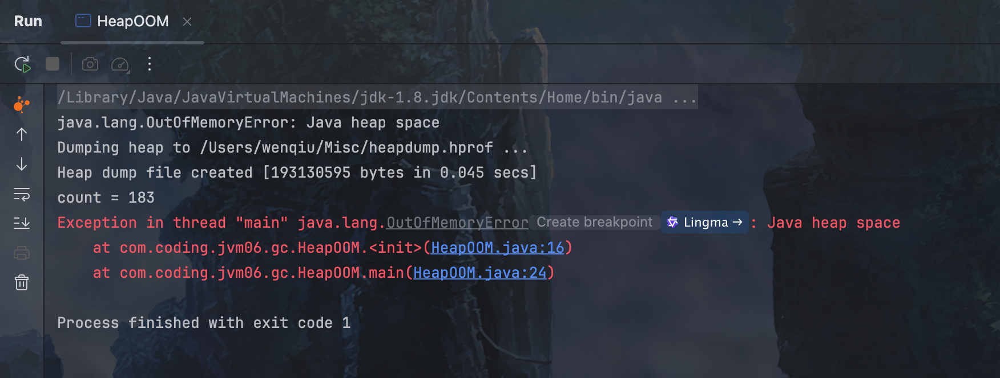
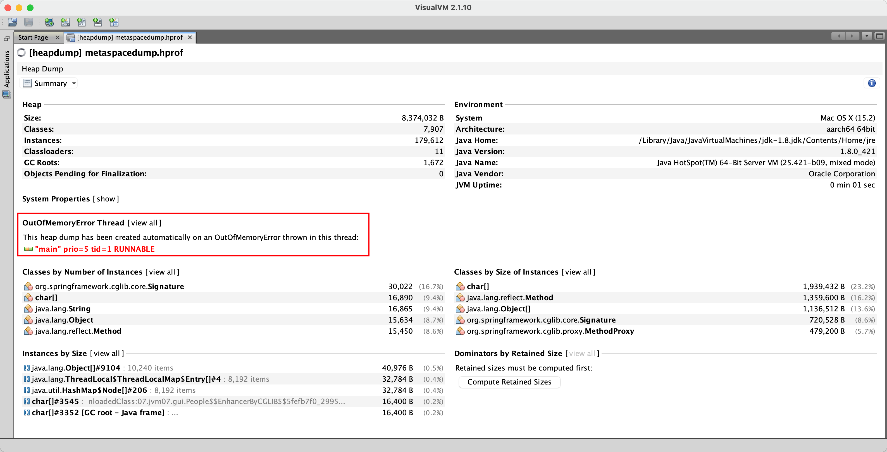

# 第25章 OOM分类及解决方案

​	在工作中会经常遇到内存溢出(Out Of Memory,OOM)异常的情况，每当遇到OOM，总是让人头疼不已，不知如何下手解决。本章汇总了OOM产生的不同场景，从案例出发，模拟产生不同类型的OOM，针对不同类型的OOM给出相应的解决方案。

## 25.1 概述

​	当JVM没有足够的内存来为对象分配空间，并且垃圾回收器也已经没有空间可回收时，就会抛出OOM异常。OOM可以分为四类，分别是堆内存溢出、元空间溢出、GC overhead limit exceeded和线程溢出。

## 25.2 OOM案例1：堆内存溢出

​	堆内存溢出报错信息如下。

```java
java.lang.OutOfMemoryError:Java heap space
```

​	模拟线上环境产生OOM，如下代码所示。

<span style="color:#40E0D0;">案例1：模拟线上环境产生OOM</span>

- 代码

```bash
package com.coding.jvm06.gc;

import java.util.ArrayList;

/**
 * -Xms200M
 * -Xmx200M
 * -XX:MetaspaceSize=64M
 * -XX:+PrintGCDetails
 * -XX:+PrintGCDateStamps
 * -Xloggc:/Users/wenqiu/Misc/gc-oom.log
 * -XX:+HeapDumpOnOutOfMemoryError
 * -XX:HeapDumpPath=/Users/wenqiu/Misc/heapdump.hprof
 */
public class HeapOOM {
    byte[] buffer = new byte[1 * 1024 * 1024]; // 1MB

    public static void main(String[] args) {
        ArrayList<HeapOOM> list = new ArrayList<HeapOOM>();

        int count = 0;
        try {
            while (true) {
                list.add(new HeapOOM());
                count++;
            }
        } catch (Exception e) {
            e.printStackTrace();
        } finally {
            System.out.println("count = " + count);
        }
    }
}

```

​	JVM参赛配置如下：

```bash
-Xms200M
-Xmx200M
-XX:MetaspaceSize=64M
-XX:+PrintGCDetails
-XX:+PrintGCDateStamps
-Xloggc:/Users/wenqiu/Misc/gc-oom.log
-XX:+HeapDumpOnOutOfMemoryError
-XX:HeapDumpPath=/Users/wenqiu/Misc/heapdump.hprof
```

​	运行结果如下所示。



​	运行程序得到heapdump.hprof文件，在设置的heap目录下，如下图所示。

<div style="text-align:center;font-weight:bold;">heapdump.hprof</div>


​	由于我们当前设置的内存比较小，所以该文件比较小，但是正常在线上环境，该文件是比较大的，通常以G为单位。

​	下面使用工具分析堆内存文件heapdump.hprof，通过Java VisualVM工具查看哪个类的实例占用内存最多，这样就可以初步定位到问题所在。如下图所示，可以看到在堆内存中存在大量的byte[]对象，占用了99.8%内存，进一步查看得知是HeapOOM实例，基本上就可以定位问题所在了。当然这里的代码比较简单，在工作中，定位问题的思路基本一致。

<div style="text-align:center;font-weight:bold;">Java VisualVM打开heapdump.hprof</div>


​	内存溢出的原因有很多，比如代码中存在大对象分配，导致没有足够的内存空间存放该对象；再比如应用存在内存泄漏，导致在多次垃圾收集之后，依然无法找到一块足够大的内存容纳当前对象。

​	对于堆溢出的解决方法，这里提供如下思路。

​	(1)检查是否存在大对象的分配，最有可能的是大数组分配。

​	(2)通过jmap命令，把堆内存dump下来，使用内存分析工具分析导出的堆内存文件，检查是否存在内存泄漏的问题。

​	(3)如果没有找到明显的内存泄漏，考虑加大堆内存。

​	(4)检查是否有大量的自定义的Finalizable对象，也有可能是框架内部提供的，考虑其存在的必要性。

## 25.3 OOM案例2：元空间溢出

​	方法区与堆一样，是各个线程共享的内存区域，它用于存储已被JVM加载的类信息、常量、静态变量、即时编译器编译后的代码等数据。JDK 8后，元空间替换了永久代来作为方法区的实现，元空间使用的是本地内存。

​	Java虚拟机规范对方法区的限制非常宽松，除了和堆一样不需要连续的内存和可以选择固定大小或者可扩展外，还可以选择不实现垃圾收集。垃圾收集行为在这个区域是比较少出现的，其内存回收目标主要是针对常量池的回收和对类型的卸载。当元空间无法满足内存分配需求时，将抛出OOM异常。元空间溢出报错信息如下。

```bash
java.lang.OutOfMemoryError:Metaspace
```

​	元空间溢出可能有如下几种原因。

​	(1)运行期间生成了大量的代理类，导致元空间被占满，无法卸载。

​	(2)应用长时间运行，没有重启。

​	(3)元空间内存设置过小。

​	该类型内存溢出解决方法有如下几种。

​	(1)检查是否永久代空间或者元空间设置得过小。

​	(2)检查代码中是否存在大量的反射操作。

​	(3)dump之后通过mat检查是否存在大量由于反射生成的代理类。

​	如下代码所示，代码含义是使用动态代理产生类使得元空间溢出。

<span style="color:#40E0D0;">案例1：元空间溢出</span>

- 代码

```bash
package com.coding.jvm07.gui;

import org.springframework.cglib.proxy.Enhancer;
import org.springframework.cglib.proxy.MethodInterceptor;

import java.lang.management.ClassLoadingMXBean;
import java.lang.management.ManagementFactory;

/**
 * -Xms60M
 * -Xmx60M
 * -Xss512K
 * -XX:SurvivorRatio=8
 * -XX:MetaspaceSize=60M
 * -XX:MaxMetaspaceSize=60M
 * -XX:+PrintGCDetails
 * -XX:+PrintGCDateStamps
 * -Xloggc:/Users/wenqiu/Misc/metaspace-oom.log
 * -XX:+HeapDumpOnOutOfMemoryError
 * -XX:HeapDumpPath=/Users/wenqiu/Misc/metaspacedump.hprof
 * -XX:+TraceClassLoading
 * -XX:+TraceClassUnloading
 */
public class MetaspaceOOM {

    public static void main(String[] args) {
        ClassLoadingMXBean classLoadingMXBean = ManagementFactory.getClassLoadingMXBean();
        while (true) {
            Enhancer enhancer = new Enhancer();
            enhancer.setSuperclass(People.class);
            enhancer.setUseCache(false);
            enhancer.setCallback((MethodInterceptor) (o, method, objects, methodProxy) -> {
                System.out.println("我是加强类哦，输出print之前的加强方法");
                return methodProxy.invokeSuper(o, objects);
            });
            People people = (People) enhancer.create();
            people.print();
            System.out.println(people.getClass());
            System.out.println("totalClass:" + classLoadingMXBean.getTotalLoadedClassCount());
            System.out.println("activeClass:" + classLoadingMXBean.getLoadedClassCount());
            System.out.println("unloadedClass:" + classLoadingMXBean.getUnloadedClassCount());
        }

    }
}

class People {
    public void print() {
        System.out.println("我是 print 本人");
    }
}

```

​	JVM参数配置如下。

```bash
-Xms60M
-Xmx60M
-Xss512K
-XX:SurvivorRatio=8
-XX:MetaspaceSize=60M
-XX:MaxMetaspaceSize=60M
-XX:+PrintGCDetails
-XX:+PrintGCDateStamps
-Xloggc:/Users/wenqiu/Misc/metaspace-oom.log
-XX:+HeapDumpOnOutOfMemoryError
-XX:HeapDumpPath=/Users/wenqiu/Misc/metaspacedump.hprof
-XX:+TraceClassLoading
-XX:+TraceClassUnloading
```

​	运行结果如下所示。


​	查看监控，如下图所示。

<div style="text-align:center;font-weight:bold;">Java VisualVM打开metaspacedump.hprof</div>


​	从上图中可以看到元空间几乎已经被全部占用。查看GC状态，如下图所示。

<div style="text-align:center;font-weight:bold;">查看GC状态</div>


​	可以看到，Full GC非常频繁，而且元空间占用了61440KB即60MB空间，几乎把整个元空间占用。所以得出的结论是方法区空间设置过小，或者存在大量由于反射生成的代理类。查看GC日志如下。

```bash
2024-12-16T17:28:14.446-0800: 1.440: [GC (Allocation Failure) [PSYoungGen: 19744K->256K(20480K)] 43799K->24479K(64512K), 0.0004820 secs] [Times: user=0.00 sys=0.00, real=0.00 secs] 
2024-12-16T17:28:14.456-0800: 1.450: [GC (Allocation Failure) [PSYoungGen: 19712K->320K(20480K)] 43935K->24719K(64512K), 0.0005688 secs] [Times: user=0.00 sys=0.00, real=0.00 secs] 
2024-12-16T17:28:14.459-0800: 1.453: [GC (Metadata GC Threshold) [PSYoungGen: 4600K->160K(20480K)] 28999K->24727K(64512K), 0.0003805 secs] [Times: user=0.00 sys=0.01, real=0.00 secs] 
2024-12-16T17:28:14.459-0800: 1.453: [Full GC (Metadata GC Threshold) [PSYoungGen: 160K->0K(20480K)] [ParOldGen: 24567K->19396K(44032K)] 24727K->19396K(64512K), [Metaspace: 61008K->61008K(110592K)], 0.0417020 secs] [Times: user=0.33 sys=0.02, real=0.05 secs] 
2024-12-16T17:28:14.501-0800: 1.495: [GC (Last ditch collection) [PSYoungGen: 0K->0K(20480K)] 19396K->19396K(64512K), 0.0012258 secs] [Times: user=0.01 sys=0.00, real=0.00 secs] 
2024-12-16T17:28:14.502-0800: 1.496: [Full GC (Last ditch collection) [PSYoungGen: 0K->0K(20480K)] [ParOldGen: 19396K->9199K(44032K)] 19396K->9199K(64512K), [Metaspace: 61008K->60915K(110592K)], 0.0230976 secs] [Times: user=0.14 sys=0.01, real=0.02 secs] 
```

​	可以看到Full GC是由于元空间不足引起的，那么接下来分析到底是什么数据占用了大量的方法区。导出dump文件，使用Java VisualVM分析。

​	首先确定是哪里的代码发生了问题，可以通过线程来确定，因为在实际生产环境中，有时候无法确定是哪块代码引起的OOM，那么就需要先定位问题线程，然后定位代码，如下图所示。

<div style="text-align:center;font-weight:bold;">Java VisualVM打开metaspacedump.hprof</div>



​	定位到问题线程之后，使用MAT工具打开继续分析，如下图所示，先打开线程视图，然后根据线程名称打开对应线程的栈信息，最后找到对应的代码块。

<div style="text-align:center;font-weight:bold;">MAT打开metaspacedump.hprof</div>


​	定位到代码以后，发现有使用到cglib动态代理，那么猜想问题是由于产生了很多代理类。接下来，可以通过包看一下类加载情况。由于代码是代理的People类，所以直接打开该类所在的包，如下图所示。

<div style="text-align:center;font-weight:bold;">打开类所在的包</div>


​	可以看到确实加载了很多的代理类，想一下解决方案，是不是可以只加载一个代理类以及控制循环的次数，当然如果业务上确实需要加载很多类的话，就要考虑增大方法区大小和控制循环的次数，所以这里修改代码如下。

```java
enhancer.setUseCache(true);
```

​	修改代码enhancer.setUseCache(false)。当设置为true的话，表示开启cglib静态缓存，这样每次动态代理的结果是生成同一个类。再看程序运行结果如下。


​	可以看到，生成代理类的数量几乎不变，元空间也没有溢出。到此，问题解决。如果需要生成不同的类，调整代码更改循环次数即可。

## 25.4 OOM案例3：GC overhead limit exceeded

​	出现GC overhead limit exceeded这个错误是由于JVM花费太长时间执行GC，且只能回收很少的堆内存。根据Oracle官方文档表述，默认情况下，如果Java进程花费98%以上的时间执行GC，并且每次只有不到2%的堆被恢复，则JVM抛出GC overhead limit exceeded错误。换句话说，这意味着应用程序几乎耗尽了所有可用内存，垃圾收集器花了太长时间试图清理它，并多次失败。这本质是一个预判性的异常，抛出该异常时系统没有真正的内存溢出，GC overhead limit exceeded异常的最终结果是Java heap space。

​	在这种情况下，用户会体验到应用程序响应非常缓慢，通常只需要几毫秒就能完成的某些操作，此时则需要更长的时间来完成，这是因为所有的CPU正在进行垃圾收集，因此无法执行其他任务。使用如下代码演示GC overhead limit exceeded异常。

<span style="color:#40E0D0;">案例1：GC overhead limit exceeded</span>

- 代码

```java
package com.coding.jvm07.gui;

import java.util.ArrayList;
import java.util.List;
import java.util.UUID;

public class TestOOM {
    public static void main(String[] args) {
        test2();
    }

    public static void test1() {
        int i = 0;
        List<String> list = new ArrayList<>();
        try {
            while (true) {
                list.add(UUID.randomUUID().toString().intern());
                i++;
            }
        } catch (Exception e) {
            System.out.println("********i:" + i);
            e.printStackTrace();
            throw new RuntimeException(e);
        }
    }

    public static void test2() {
        Integer i = 0;
        String str = "";
        try {
            while (true) {
                str += UUID.randomUUID();
                i++;
            }
        } catch (Exception e) {
            System.out.println("********i:" + i);
            e.printStackTrace();
            throw new RuntimeException(e);
        }
    }
}

```

​	JVM配置如下所示。

```bash
-Xms10M
-Xmx10M
-XX:+PrintGCDetails
-XX:+PrintGCDateStamps
-Xloggc:/Users/wenqiu/Misc/exceeded-oom.log
-XX:+HeapDumpOnOutOfMemoryError
-XX:HeapDumpPath=/Users/wenqiu/Misc/exceededdump.hprof
```

​	test1()方法的含义是运行期间将内容放入常量池，运行结果是GC overhead limit exceeded错误。test2()方法的含义是不停地追加字符串str，运行结果是Java heap space错误。读者可能会疑惑，看似test1()方法和test2()方法也没有太大的差别，为什么test2()方法没有报GC overhead limit exceeded呢？以上两个方法的区别在于发生Java heap space的test2()方法每次都能回收大部分的对象（中间产生的UUID），只不过有一个对象是无法回收的，慢慢长大，直到内存溢出。发生GC overhead limit exceeded的test1()方法由于每个字符串都在被list引用，所以无法回收，很快就用完内存，触发不断回收的机制。

​	需要注意的是，有些版本的JDK，有可能不会发生GC overhead limit exceeded，各位读者知道即可。该案例报错信息如下。


​	通过查看GC日志可以发现，系统在频繁地做Full GC，但是却没有回收多少空间，那么引起的原因可能是内存不足，也可能是存在内存泄漏的情况，接下来我们要根据堆内存文件具体分析GC overhead limit exceeded的原因。

**1 定位问题代码块**

​	通过线程分析，可以定位发生OOM的代码块，如下图所示。

<div style="text-align:center;font-weight:bold;">定位发生OOM的代码块</div>


**2 分析堆内存文件**

​	可以看到发生OOM是因为死循环，不停地往ArrayList存放字符串常量，JDK 1.7以后，字符串常量池移到了堆中存储，所以最终导致内存不足发生了OOM。

​	打开“Histogram”选项，如下图所示。可以看到，String类型的字符串占用了大概12M的空间，几乎把堆占满，但是还没有占满，所以这也符合官方对此异常的定义。

<div style="text-align:center;font-weight:bold;">打开“Histogram”选项</div>


​	右击选择“List objects”，列出上图中对象下面的所有引用对象，如下图所示，可以看到所有String对象。

<div style="text-align:center;font-weight:bold;">列出所有引用对象</div>


**3 解决方案**

​	这个是JDK 6新加的错误类型，一般都是堆空间不足导致的。针对该问题的解决方法如下。

​	(1)检查项目中是否有大量的死循环或有使用大内存的代码，优化代码。

​	(2)添加JVM参数-XX:-UseGCOverheadLimit禁用这个检查，其实这个参数解决不了内存问题，只是把错误的信息延后，最终出现java.lang.OutOfMemoryError:Java heap space。

​	(3)导出堆内存文件，如果没有发生内存泄漏，加大内存即可。

## 25.5 OOM案例4：线程溢出

​	线程溢出报错信息如下。

```bash
java.lang.OutOfMemoryError :unable to create new native Thread
```

​	线程溢出是因为创建的了大量的线程。出现此种情形之后，可能造成系统崩溃。如下代码模拟了线程溢出。

<div style="text-align:center;font-weight:bold;">线程溢出</div>

<span style="color:#40E0D0;">案例1：线程溢出</span>

- 代码

```java
package com.coding.jvm07.gui;

import java.util.concurrent.CountDownLatch;

public class TestNativeOutOfMemoryError {
    public static void main(String[] args) {
        for (int i = 0; ; i++) {
            System.out.println("i=" + i);
            new Thread(new HoldThread()).start();
        }
    }
}

class HoldThread extends Thread {
    CountDownLatch cd1 = new CountDownLatch(1);

    @Override
    public void run() {
        try {
            cd1.await();
        } catch (InterruptedException e) {
        }
    }
}
```

​	结果如下。


​	JDK 5.0以后栈默认为1MB，以前栈默认为256KB。根据应用的线程所需内存大小进行调整，通过参数-Xss设置栈内存。在相同物理内存下，减小这个值能生成更多的线程。但是操作系统对一个进程内的线程数还是有限制的，不能无限生成，经验值是3000～5000。

​	操作系统能创建的线程数的具体计算公式如下。

```bash
(MaxProcessMemory - JVMMemory - ReservedOsMemory)/(ThreadStackSize) =Number of threads
```

​	其中各项代表含义如下。

​	(1)MaxProcessMemory表示进程可寻址的最大空间。

​	(2)JVMMemory表示JVM内存。

​	(3)ReservedOsMemory表示保留的操作系统内存。

​	(4)ThreadStackSize表示线程栈的大小。

​	在Java语言里，JVM在创建一个Thread对象的同时创建一个操作系统线程，而这个系统线程的内存用的不是JVMMemory，而是系统中剩下的内存(RemainMemory)，计算公式如下。

```bash
MaxProcessMemory - JVMMemory – ReservedOsMemory = RemainMemory
```

​	由公式得出：JVM分配内存越多，那么能创建的线程越少，越容易发生java.lang.OutOfMemoryError:unable to create new native thread。

​	针对该问题的解决方案如下。

​	(1)如果程序中有bug，导致创建大量不需要的线程或者线程没有及时回收，那么必须解决这个bug，修改参数是不能解决问题的。

​	(2)如果程序确实需要大量的线程，现有的设置不能达到要求，那么可以通过修改MaxProcessMemory、JVMMemory和ThreadStackSize三个因素，来增加能创建的线程数。比如使用64位操作系统可以增大MaxProcessMemory、减少JVMMemory的分配或者减小单个线程的栈大小。

​	在实验过程中，64位操作系统下调整Xss的大小并没有对产生线程的总数产生影响，程序执行到极限的时候，操作系统会死机，无法看出效果。

​	在32位Win7操作系统下测试，发现调整Xss的大小会对线程数量有影响，随着Xss值的变大，线程数量越来越少。如下表所示，其中JDK版本是1.8（适配32位操作系统）。

<div style="text-align:center;font-weight:bold;">32位Win7操作系统Xss值对线程数量的影响结果</div>


​	Xss参数的调整对于64位操作系统的实验结果是不明显的，但是对于32位操作系统的实验结果却是非常明显的，为什么会有这样的区别呢？上面讲到过线程数量的计算公式如下所示。

```bash
(MaxProcessMemory - JVMMemory - ReservedOsMemory)/(ThreadStackSize) =Number of threads
```

​	MaxProcessMemory表示最大寻址空间，在32位系统中，CPU的寻址范围就受到32个二进制位的限制。32位二进制数最大值是11111111 11111111 11111111 11111111,2的32次方=4294967296B = 4194304KB = 4096M =4GB。也就是说32位CPU只能访问4GB的内存。再减去显卡上的显存等内存，可用内存要小于4GB，所以32位操作系统可用线程数量是有限的。

​	64位二进制数的最大值是11111111 11111111 11111111 11111111 11111111 11111111 11111111 11111111,2的64次方=17179869184GB，大家可以看看64位操作的寻址空间大小比32位操作系统多了太多，所以这也是我们总是无法测试出很好效果的原因。

​	综上，在生产环境下如果需要更多的线程数量，建议使用64位操作系统，如果必须使用32位操作系统，可以通过调整Xss的大小来控制线程数量。除此之外，线程总数也受到系统空闲内存和操作系统的限制。


