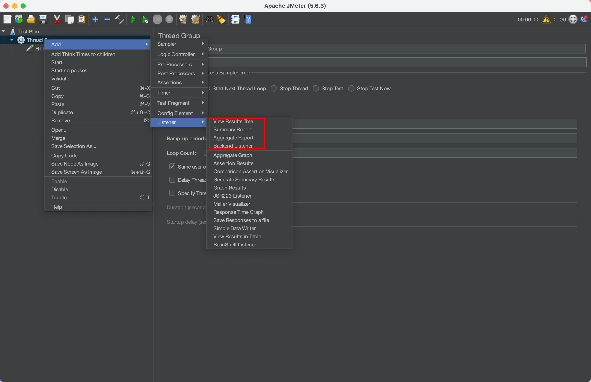

# 第26章 性能优化案例

​	前面我们已经学了很多JVM的相关知识，比如运行时数据区的划分、垃圾收集、字节码文件结构和各种性能分析工具。相信大家对JVM也有了比较深入的了解，正所谓实践出真知，学习完理论知识，接下来就要在Java应用中检验JVM知识的使用。本章将从案例出发，从不同的方面优化应用的性能。

## 26.0 安装JMeter

官网：https://jmeter.apache.org/

下载页面：https://jmeter.apache.org/download_jmeter.cgi

老版本下载页面：https://archive.apache.org/dist/jmeter/binaries/

比如，下载：apache-jmeter-5.6.3.zip

然后，解压安装即可！！！解压，即安装！

- 启动

双击：安装目录/bin/jmeter.bat

- 配置中文

    - 临时

      Options=>Choose Language=>Chinese(Simplified)

    - 永久

  打开安装目录/bin/jmeter.properties，找到`#language=en`，并添加如下内容：

  ```properties
  #language=en
  language=zh_CN
  ```

## 26.1 概述

​	JVM性能调优的目标就是减少GC的频率和Full GC的次数，使用较小的内存占用来获得较高的吞吐量或者较低的延迟。程序在运行过程中多多少少会出现一些与JVM相关的问题，比如CPU负载过高、请求延迟过长、tps降低等。更甚至系统会出现内存泄漏、内存溢出等问题进而导致系统崩溃，因此需要对JVM进行调优，使得程序在正常运行的前提下，用户可以获得更好的使用体验。一般来说，针对JVM调优有以下几个比较重要的指标。

​	(1)内存占用：程序正常运行需要的内存大小。

​	(2)延迟：由于垃圾收集而引起的程序停顿时间。

​	(3)吞吐量：用户程序运行时间占用户程序和垃圾收集占用总时间的比值，这里针对的是JVM层面的吞吐量，需要区别于后面讲到的Apache JMeter的吞吐量，JMeter中的吞吐量表示服务器每秒处理的请求数量。

​	当然，调优时所考虑的方向也不同，在调优之前，必须要结合实际场景，有明确的优化目标，找到性能瓶颈，对瓶颈有针对性的优化，最后测试优化后的结果，通过各种监控工具确认调优后的结果是否符合目标。

​	调优监控的依据有哪些？

- 运行日志
- 异常堆栈
- GC日志
- 线程快照
- 堆转储快照

​	性能优化的步骤？

- 熟悉业务场景
- 发现问题：性能监控
    - GC频繁
    - CPU load过高
    - OOM
    - 内存泄露
    - 死锁
    - 程序响应时间过长
- 排查问题：性能分析
    - 打印GC日志，通过GCViewer或GCeasy来分析日志信息
    - 灵活运用命令行工具 jstack、jmap、jinfo等
    - dump出堆文件，使用内存分析工具分析文件
    - 使用阿里Arthas或jconsole、JVisualVM来实时查看JVM状态
    - jstack查看堆栈信息
- 解决问题：性能调优
    - 适当增加内存，根据业务背景选择垃圾回收器
    - 优化代码，控制内存使用
    - 增加机器，分散节点压力
    - 合理设置线程池线程数量
    - 使用中间件提高程序效率，比如缓存、消息队列等
    - 其他......

## 26.2 性能测试工具：Apache JMeter

​	Apache JMeter（简称JMeter）是Apache组织开发的基于Java的压力测试工具，用于对软件做压力测试。它最初用于Web应用测试，后来也扩展到其他测试领域。JMeter可以用于对服务器、网络或对象模拟巨大的负载，来自不同压力类别下测试它们的强度和分析整体性能。本章使用JMeter测试不同的虚拟机配置对性能的影响结果，下面介绍JMeter的基本使用流程。

(1)启动JMeter后一般会默认生成一个测试计划，如下图所示。

<div style="text-align:center;font-weight:bold;">JMeter主界面</div>


(2)在测试计划下添加线程组。线程组有以下几种重要的参数。

- 线程数：虚拟用户数，用于并发测试。
- Ramp-Up时间（秒）：这个参数表示准备时长，即设置的虚拟用户数需要多长时间全部启动。如果线程数为10，准备时长为2，那么需要2秒启动10个线程，也就是每秒启动5个线程。
- 循环次数：每个线程发送请求的次数。如果线程数为10，循环次数为1000，那么每个线程发送1000次请求。总请求数为10×1000=10000。如果勾选了“永远”，那么所有线程会一直发送请求，直到选择停止运行脚本，如下图所示。

​	对测试计划添加线程组：右键测试计划=>Add=>Threads(Users)=>ThreadGroup

<div style="text-align:center;font-weight:bold;">JMeter添加线程组</div>


(3)新增HTTP采样器。

​	采样器用于对具体的请求进行性能数据的采样，如下图所示，本章案例添加HTTP请求的采样。

​	添加完HTTP采样器之后需要对请求的具体目标进行设置，比如目标服务器地址，端口号，路径等信息，具体含义如下。

- 协议：向目标服务器发送HTTP请求协议，可以是HTTP或HTTPS，默认为HTTP。
- 服务器名称或IP:HTTP请求发送的目标服务器名称或IP。
- 端口号：目标服务器的端口号，默认值为80。
- 方法：发送HTTP请求的方法，包括GET、POST、HEAD、PUT、OPTIONS、TRACE、DELETE等。
- 路径：目标URL路径（URL中去掉服务器地址、端口及参数后剩余部分）。
- 内容编码：编码方式，默认为ISO-8859-1编码，这里配置为utf-8。

​	JMeter会按照设置对目标进行批量的请求。

​	对线程组添加采样器：右键线程组=>Add=>Sampler=>Http Request

<div style="text-align:center;font-weight:bold;">JMeter添加HTTP采样器</div>


(4)添加监听器。

​	对于批量请求的访问结果，JMeter会以报告的形式展现出来，在监听器中，添加聚合报告，如下图所示。

​	对线程组添加采样器：右键线程组=>Add=>Listener=>Aggregate Report

<div style="text-align:center;font-weight:bold;">添加监听器</div>



​	调试运行，分析指标数据、挖掘性能瓶颈、评估系统性能状态，主要查看聚合报告的结果，聚合报告中各个指标详解如下。

- Label：每个JMeter的元素（例如HTTP Request）都有一个Name属性，这里显示的就是Name属性的值。
- #Samples：这次测试中一共发出了多少个请求，如果模拟10个用户，每个用户迭代10次，那么这里显示100。
- Average：平均响应时间。默认情况下是单个请求的平均响应时间(ms)，当使用Transaction Controller时，以Transaction为单位显示平均响应时间。
- Median：中位数，也就是50%用户的响应时间。
- 90% Line:90%用户的响应时间。
- Min：最小响应时间。
- Max：最大响应时间。
- Error%：错误率，即错误请求数／请求总数。
- throughput：吞吐量。默认情况下表示每秒完成的请求数(Request per Second)。
- KB/Sec：每秒从服务器端接收到的数据量。

## 26.3 性能优化案例1：调整堆大小提高服务的吞吐量

​	案例创建Spring Boot项目，以便可以通过Web访问。这里使用JMeter模拟批量请求，如下代码所示。

<span style="color:#40E0D0;">案例1：Web服务</span>

- 代码之People

```java
package com.coding.jvm08.tuning01;

import lombok.Data;

@Data
public class People {
    private Integer id;
    private String name;
    private Integer age;
    private String sex;
    private String job;
}

```

- 代码之PeopleMapper

```java
package com.coding.jvm08.tuning01;

import java.util.List;

public interface PeopleMapper {

    List<People> getPeopleList();
}

```

- 代码之PeopleMapper.xml

```xml
<?xml version="1.0" encoding="UTF-8" ?>
<!DOCTYPE mapper PUBLIC "-//mybatis.org//DTD Mapper 3.0//EN" "http://mybatis.org/dtd/mybatis-3-mapper.dtd" >
<mapper namespace="com.coding.jvm08.tuning01.PeopleMapper">
    <select id="getPeopleList" resultType="com.coding.jvm08.tuning01.People">
        select id, name, age, sex, job
        from people;
    </select>
</mapper>
```

- 代码之PeopleService

```java
package com.coding.jvm08.tuning01;

import lombok.RequiredArgsConstructor;
import org.springframework.stereotype.Service;

import java.util.List;

@Service
@RequiredArgsConstructor
public class PeopleService {
    private final PeopleMapper peopleMapper;

    public List<People> getPeopleList() {
        return peopleMapper.getPeopleList();
    }
}

```

- 代码之Tuning01Controller

```java
package com.coding.jvm08.tuning01;

import lombok.RequiredArgsConstructor;
import org.springframework.beans.factory.annotation.Autowired;
import org.springframework.web.bind.annotation.RequestMapping;
import org.springframework.web.bind.annotation.RestController;

import java.util.List;

@RestController
@RequiredArgsConstructor
public class Tuning01Controller {

    private final PeopleService peopleService;

    @RequestMapping("/visit")
    public List<People> visit() {
        List<People> peopleList = peopleService.getPeopleList();
        return peopleList;
    }
}

```

- 代码之Application

```java
package com.coding.jvm08.tuning01;

import org.mybatis.spring.annotation.MapperScan;
import org.mybatis.spring.annotation.MapperScans;
import org.springframework.boot.SpringApplication;
import org.springframework.boot.autoconfigure.SpringBootApplication;

@MapperScan(value = {"com.coding.jvm08.tuning01"})
@SpringBootApplication
public class Application {

    public static void main(String[] args) {
        SpringApplication.run(Application.class, args);
    }

}
```

- 代码之application.properties

```properties
spring.datasource.username=root
spring.datasource.password=root123
spring.datasource.url=jdbc:mysql://localhost:3306/jvmdb?characterEncoding=utf-8&useSSL=false&serverTimezone=Asia/Shanghai
spring.datasource.driver-class-name=com.mysql.cj.jdbc.Driver
mybatis-plus.mapper-locations=classpath:mapper/**/*.xml
mybatis-plus.global-config.db-config.id-type=auto
```

- 数据库与初始化语句

```sql
-- 创建数据库
CREATE DATABASE IF NOT EXISTS jvmdb DEFAULT CHARACTER SET utf8mb4 COLLATE utf8mb4_unicode_ci;
-- 使用数据库
use jvmdb;

-- 创建数据表
DROP TABLE IF EXISTS people;
CREATE TABLE people
(
    `id`   INT AUTO_INCREMENT COMMENT '',
    `name` VARCHAR(255) COMMENT '',
    `age`  INT COMMENT '',
    `sex`  VARCHAR(255) COMMENT '',
    `job`  VARCHAR(255) COMMENT '',
    PRIMARY KEY (id)
) COMMENT = '';
-- 初始化数据：建议配置为500条
INSERT INTO jvmdb.people (name,age,sex,job) VALUES
                                                ('张三','18','男','待定岗'),
                                                ('张三','18','男','待定岗');

```

​	采用定量分析法，线程组配置保持不变，配置如下。

<div style="text-align:center;font-weight:bold;">JMeter线程组配置</div>

| 线程数 | Ramp-Up时间（秒） | 循环次数 |
| :----: | :---------------: | :------: |
|   30   |        10         |   1000   |

​	JVM配置如下。

```bash
-Xms30M
-Xmx30M
-XX:MetaspaceSize=64M
-XX:+PrintGCDetails
-XX:+PrintGCDateStamps
-Xloggc:/Users/wenqiu/Misc/tuning01_gc.log
```

​	启动Spring Boot工程，运行JMeter，查看JMeter吞吐量，如下表所示，这里测试三次数据，最后取平均值。

<div style="text-align:center;font-weight:bold;">JMeter吞吐量</div>

| 第一轮 | 第二轮 | 第三轮 | 平均值 |
| :----: | :----: | :----: | :----: |
| 1331.1 | 1319.3 | 1324.6 | 1325.0 |

<div style="text-align:center;font-weight:bold;">jstat查看GC情况</div>


​	修改JVM配置，增加初始化内存和最大内存配置，如下所示。

```bash
-Xms60M
-Xmx60M
-XX:MetaspaceSize=64M
-XX:+PrintGCDetails
-XX:+PrintGCDateStamps
-Xloggc:/Users/wenqiu/Misc/tuning01_gc.log
```

​	重启Spring Boot工程，运行JMeter，查看JMeter吞吐量，如下表所示。

<div style="text-align:center;font-weight:bold;">JMeter吞吐量</div>

| 第一轮 | 第二轮 | 第三轮 | 平均值 |
| :----: | :----: | :----: | :----: |
| 2306.8 | 2236.1 | 2115.7 | 2219.5 |

<div style="text-align:center;font-weight:bold;">jstat查看GC情况</div>


​	通过两次JMeter吞吐量的对比发现，在增大内存之后，吞吐量明显增强。通过jstat命令查看GC状态，展示了增大内存之前的GC状态，其中Full GC次数高达107次，Full GC时间为12.277s。增大内存之后的Full GC状态，其中Full GC次数为67次，GC时间为7.431s。发现增大内存之后，Full GC的次数明显减少，这样系统暂停时间就会减少，所以每秒处理的请求数量就会增多。

​	通过上面的对比发现，在增大内存之后，吞吐量明显增强。<span style="color:red;font-weight:bold;">提高内存后，GC变少，吞吐量增加。</span>

## 26.4 性能优化案例2：调整垃圾收集器提高服务的吞吐量

​	前面的章节讲解了不同的垃圾收集器，下文将测试不同的垃圾收集器对系统服务性能的影响。

​	依旧使用代码<span style="color:blue;font-weight:bold;">案例1：Web服务</span>。

<div style="text-align:center;font-weight:bold;">JMeter线程组配置</div>

| 线程数 | Ramp-Up时间（秒） | 循环次数 |
| :----: | :---------------: | :------: |
|   30   |        10         |   1000   |

​	使用串行垃圾收集器，服务器JVM配置如下。

```bash
-Xms30M
-Xmx30M
-XX:SurvivorRatio=8
-XX:MetaspaceSize=64M
-XX:+UseSerialGC
-XX:+PrintGCDetails
-XX:+PrintGCDateStamps
-Xloggc:/Users/wenqiu/Misc/tuning01_gc.log
```

​	重启Spring Boot工程，运行JMeter，查看JMeter吞吐量如下表所示，这里测试三次数据，最后取平均值。

| 第一轮 | 第二轮 | 第三轮 | 平均值 |
| :----: | :----: | :----: | :----: |
| 516.7  | 497.1  | 486.9  | 500.2  |

​		修改JVM配置，调整垃圾收集器，如下所示。

```bash
-Xms30M
-Xmx30M
-XX:SurvivorRatio=8
-XX:MetaspaceSize=64M
-XX:+UseParallelGC
-XX:+UseParallelOldGC
-XX:ParallelGCThreads=4
-XX:+PrintGCDetails
-XX:+PrintGCDateStamps
-Xloggc:/Users/wenqiu/Misc/tuning01_gc.log
```

​	重启Spring Boot工程，运行JMeter，查看JMeter吞吐量，如下表所示。

| 第一轮 | 第二轮 | 第三轮 | 平均值 |
| :----: | :----: | :----: | :----: |
| 791.1  | 735.7  | 729.8  | 752.2  |

​	通过上面两表的对比发现，在改为并行垃圾收集器之后，吞吐量明显增强。这是因为并行垃圾收集器在串行垃圾收集器的基础上做了优化，垃圾收集由单线程变成了多线程，这样可以缩短垃圾收集的时间。虽然并行垃圾收集器在收集过程中也会暂停应用程序，但是多线程并行执行速度更快，暂停时间也就更短，系统的吞吐量随之提升。

​	接下来我们改为G1收集器看看效果，修改JVM参数配置，将垃圾收集器改为G1，配置参数如下。

```bash
-Xms30M
-Xmx30M
-XX:SurvivorRatio=8
-XX:MetaspaceSize=64M
-XX:+UnlockExperimentalVMOptions
-XX:+UseG1GC
-XX:ConcGCThreads=4
-XX:+PrintGCDetails
-XX:+PrintGCDateStamps
-Xloggc:/Users/wenqiu/Misc/tuning01_gc.log
```

​	重启Spring Boot工程，运行JMeter，查看JMeter吞吐量，如下表所示。

| 第一轮 | 第二轮 | 第三轮 | 平均值 |
| :----: | :----: | :----: | :----: |
| 452.2  | 424.3  | 455.0  | 443.8  |

​	查看压测效果，吞吐量比并行收集器效果差一些，<span style="color:red;font-weight:bold;">看来G1GC尚在实验性阶段，效果并不好</span>。

​	综上，当各位读者在工作中如果服务器的垃圾收集时间较长，或者对请求的处理性能没有达到目标要求的时候，可以考虑使用不同的垃圾收集器来做优化。

## 26.5 性能优化案例3：JIT优化

​	前面章节讲了OOM和垃圾收集器的选择优化。下文从JVM的执行机制层面来优化JVM。

​	第12章讲过Java为了提高JVM的执行效率，提出了一种叫作即时编译(JIT)的技术。即时编译的目的是避免函数被解释执行，而是将整个函数体编译成机器码，每次函数执行时，只执行编译后的机器码即可，这种方式可以使执行效率大幅度提升。根据二八定律（百分之二十的代码占据百分之八十的系统资源），对于大部分不常用的代码，我们无须耗时将之编译为机器码，而是采用解释执行的方式，用到就去逐条解释运行。对于一些仅占据较少系统资源的热点代码（可认为是反复执行的重要代码），则可将之翻译为符合机器的机器码高效执行，提高程序的执行效率。

**1 即时编译的时间开销**

​	通常说JIT比解释快，其实说的是“执行编译后的代码”比“解释器解释执行”要快，并不是说“编译”这个动作比“解释”这个动作快。JIT编译再怎么快，至少也比解释执行一次略慢一些，而要得到最后的执行结果还得再经过一个“执行编译后的代码”的过程。所以，对“只执行一次”的代码而言，解释执行其实总是比JIT编译执行要快。只有频繁执行的代码（热点代码），JIT编译才能保证有正面的收益。

**2 即时编译的空间开销**

​	对一般的Java方法而言，编译后代码的大小相对于字节码的大小，膨胀比达到10倍是很正常的。同上面说的时间开销一样，这里的空间开销也是，只有执行频繁的代码才值得编译，如果把所有代码都编译则会显著增加代码所占空间，导致代码爆炸。这也就解释了为什么有些JVM会选择不总是做JIT编译，而是选择用解释器和JIT编译器的混合执行引擎。

​	具体的即时编译案例在第7章讲解堆的时候已经详细描述过了，这里不再做具体的案例分析，各位读者在工作中可以考虑在代码层面进行优化。

## 26.6 性能优化案例4：G1并发执行的线程数对性能的影响

​	依然使用代码<span style="color:blue;font-weight:bold;">案例1：Web服务</span>，初始化内存和最大内存调整小一些，目的是让程序发生Full GC，关注点是GC次数、GC时间，以及JMeter的平均响应时间。

<div style="text-align:center;font-weight:bold;">JMeter线程组配置</div>

| 线程数 | Ramp-Up时间（秒） | 循环次数 |
| :----: | :---------------: | :------: |
|   30   |        10         |   1000   |

​	JVM配置如下，并发线程数量为2。

```bash
-Xms40M
-Xmx40M
-XX:SurvivorRatio=8
-XX:MetaspaceSize=64M
-XX:+UnlockExperimentalVMOptions
-XX:+UseG1GC
-XX:ConcGCThreads=2
-XX:+PrintGCDetails
-XX:+PrintGCDateStamps
-Xloggc:/Users/wenqiu/Misc/tuning01_gc.log
```

​	重启Spring Boot工程，运行JMeter，查看JMeter吞吐量，如下表所示。

<div style="text-align:center;font-weight:bold;">jstat查看GC情况</div>


​	由此可以计算出压测过程中，发生的GC次数和GC时间差。

```bash
YGC:youngGC次数是 5319 - 21 = 5298
FGC:Full GC次数是 58 - 0 = 58
GCT:GC总时间是 6.696 - 0.047 = 6.649
```

​	压测结果如下图所示。

<div style="text-align:center;font-weight:bold;">JMeter聚合报告</div>


​	从上图中可以看到95%的请求响应时间为14ms,99%的请求响应时间为43ms。

​	下面我们设置并发线程数量为1，如下所示。

```bash
-Xms40M
-Xmx40M
-XX:SurvivorRatio=8
-XX:MetaspaceSize=64M
-XX:+UnlockExperimentalVMOptions
-XX:+UseG1GC
-XX:ConcGCThreads=1
-XX:+PrintGCDetails
-XX:+PrintGCDateStamps
-Xloggc:/Users/wenqiu/Misc/tuning01_gc.log
```

​	重启Spring Boot工程，运行JMeter，查看JMeter吞吐量，如下表所示。


​	由此可以计算出压测过程中，发生的GC次数和GC时间差。

```bash
YGC:youngGC次数是 5352 - 18 = 5334
FGC:Full GC次数是 96 - 0 = 96
GCT:GC总时间是 7.943 - 0.034 = 7.929
```

​	压测结果如下图所示。

<div style="text-align:center;font-weight:bold;">JMeter聚合报告</div>


​	图上图可知，95%的请求响应时间为35ms,99%的请求响应时间为45ms。通过对比发现设置线程数为1之后，服务请求的平均响应时间和GC时间都有一个明显的增加。仅从效果上来看，这次的优化是有一定效果的。大家在工作中对于线上项目进行优化的时候，可以考虑到这方面的优化。

## 26.7 性能优化案例5：合理配置堆内存

​	在案例1中我们讲到了增加内存可以提高系统的性能而且效果显著，那么随之带来的一个问题就是，增加多少内存比较合适？如果内存过大，那么产生Full GC的时候，GC时间会相对比较长；如果内存较小，那么就会频繁的触发GC，在这种情况下，我们该如何合理配置堆内存大小呢？可以根据Java Performance里面的推荐公式来进行设置，如下图所示。

​	公式的意思是Java中整个堆大小设置原则是Xmx和Xms设置为老年代存活对象的3～4倍，即Full GC之后堆内存是老年代内存的3～4倍。方法区（永久代PermSize和MaxPermSize）设置为老年代存活对象的1.2～1.5倍。新生代Xmn的设置为老年代存活对象的1～1.5倍。老年代的内存大小设置为老年代存活对象的2～3倍。

<div style="text-align:center;font-weight:bold;">Java Performance</div>


​	但是，上面的说法也不是绝对的，也就是说这给的是一个参考值，根据多次调优之后得出的一个结论，大家可以根据这个值来设置初始化内存。在保证程序正常运行的情况下，我们还要去查看GC的回收率，GC停顿耗时，内存里的实际数据来判断，Full GC是基本上不能太频繁的，如果频繁就要做内存分析，然后再去做一个合理的内存分配。还要注意到一点就是，老年代存活对象怎么去判定。计算老年代存活对象的方式有以下2种。

​	方式1:JVM参数中添加GC日志，GC日志中会记录每次Full GC之后各代的内存大小，观察老年代GC之后的空间大小。可观察一段时间内（比如2天）的Full GC之后的内存情况，根据多次的Full GC之后的老年代的空间大小数据来预估Full GC之后老年代的存活对象大小（可根据多次Full GC之后的内存大小取平均值）。

​	方式2：方式1的方案虽然可行，但需要更改JVM参数，并分析日志。同时，在使用CMS收集器的时候，有可能无法触发Full GC（只发生CMS GC），所以日志中并没有记录Full GC的日志，在分析的时候就比较难处理。所以，有时候需要强制触发一次Full GC，来观察Full GC之后的老年代存活对象大小。需要注意的是强制触发Full GC，会造成线上服务停顿(STW)，要谨慎。我们建议在强制Full GC前先把服务节点摘除，Full GC之后再将服务挂回可用节点，使之对外提供服务。在不同时间段触发Full GC，根据多次Full GC之后的老年代内存情况来预估Full GC之后的老年代存活对象大小，触发Full GC的方式有下面三种。

​	(1)使用如下命令将当前的存活对象dump到文件，此时会触发Full GC。

```bash
jmap -dump:live,format=b,file=heap.bin <pid>
```

​	(2)使用如下命令打印每个class的实例数目、内存占用和类全名信息，此时会触发Full GC。

```bash
jmap -histo:live <pid>
```

​	(3)在性能测试环境，可以通过Java监控工具来触发Full GC，比如使用VisualVM和JConsole，这些工具在最新的JDK的bin目录下可以找到。VisualVM或者JConsole上面有一个触发GC的按钮，在第21章有讲过，此处不再赘述。


​	依旧使用代码<span style="color:blue;font-weight:bold;">案例1：Web服务</span>。

<div style="text-align:center;font-weight:bold;">JMeter线程组配置</div>

| 线程数 | Ramp-Up时间（秒） | 循环次数 |
| :----: | :---------------: | :------: |
|   30   |        10         |   1000   |

​	最开始可以将内存设置得大一些，比如设置为4GB。当然也可以根据业务系统估算，比如从数据库获取一条数据占用128字节，每次需要获取1000条数据，那么一次读取到内存的大小就是(128/1024/1024)×1000=0.122MB，程序可能需要并发读取，比如每秒读取1000次，那么内存占用就是0.122×1000=12MB，如果堆内存设置为1GB，新生代大小大约就是333MB，那么每333/12=27.75s就会把新生代内存填满，也就是说我们的程序几乎每分钟进行两次Young GC。

​	现在我们通过IDEA启动Spring Boot工程，将内存初始化为1024MB。这里就从1024MB的内存开始分析系统的GC日志，根据上面的一些知识来进行一个合理的内存设置。

​	JVM设置如下。

```bash
-Xms1024M
-Xmx1024M
-Xss512K
-XX:SurvivorRatio=8
-XX:MetaspaceSize=64M
-XX:+PrintGCDetails
-XX:+PrintGCDateStamps
-Xloggc:/Users/wenqiu/Misc/tuning01_gc.log
-XX:+HeapDumpOnOutOfMemoryError
-XX:HeapDumpPath=/Users/wenqiu/Misc/tuning01_dump.hprof
```

​	通过JMeter访问一段时间后，主要是看项目是否可以正常运行，使用下面的命令查看JVM统计信息状态。

​	JVM统计信息如下图所示。

<div style="text-align:center;font-weight:bold;">JVM统计信息</div>


​	从上图中可以得出如下信息。

```bash
YGC平均耗时: (0.200 - 0.009) * 1000 / (197 - 1) = 0.97ms
FGC未产生
```

<div style="text-align:center;font-weight:bold;">JMeter聚合报告</div>


​	看起来似乎不错，YGC触发的频率不高，FGC也没有产生，但这样的内存设置是否还可以继续优化呢？是不是有一些空间是浪费的呢？

​	为了快速看数据，我们使用了方式2，通过命令 jmap -histo:live pid 产生几次Full GC,Full GC之后，使用jmap -heap来查看当前的堆内存情况。

​	通过VisualVM观察老年代存活对象大小。

<div style="text-align:center;font-weight:bold;">内存空间分配</div>


​	可以看到老年代存活对象占用内存空间大概为16.101MB，老年代的内存分配为683MB左右。按照整个堆大小是老年代Full GC之后的3～4倍计算的话，设置堆内存在Xmx=17×3 = 51MB至17×4 = 68MB之间。

​	我们修改堆内存大小为70MB,JVM参数设置如下所示。

```bash
-Xms70M
-Xmx70M
-Xss512K
-XX:SurvivorRatio=8
-XX:MetaspaceSize=64M
-XX:+PrintGCDetails
-XX:+PrintGCDateStamps
-Xloggc:/Users/wenqiu/Misc/tuning01_gc.log
-XX:+HeapDumpOnOutOfMemoryError
-XX:HeapDumpPath=/Users/wenqiu/Misc/tuning01_dump.hprof
```

​	修改完之后，查看JVM统计信息，如下图所示。

<div style="text-align:center;font-weight:bold;">JVM统计信息</div>


​	从上图中可以得出如下信息。

```bash
YGC平均耗时: (1.874 - 0.021) * 1000 / (3162 - 13) = 0.59ms
FGC平均耗时: (0.067 - 0.000) * 1000 / (3 - 0) = 22.33ms
```

<div style="text-align:center;font-weight:bold;">JMeter聚合报告</div>


​	观察到，产生了FGC，需要再扩大点内存容量，比如：100MB。

<div style="text-align:center;font-weight:bold;">JVM统计信息</div>


​	从上图中可以得出如下信息。

```bash
YGC平均耗时: (1.319 - 0.016) * 1000 / (2079 - 9) = 0.63ms
FGC未产生
```

<div style="text-align:center;font-weight:bold;">JMeter聚合报告</div>


​	修改完之后YGC平均耗时为0.63ms，没有产生Full GC。整体的GC耗时减少。但GC频率比之前的1024M时要多一些。依然未产生Full GC，所以我们内存设置为100MB也是比较合理的，相对之前节省了很大一块内存空间，所以本次内存调整是比较合理的。

​	再次手动触发Full GC，查看堆内存结构，如下图所示，可以发现堆内存足够使用。

<div style="text-align:center;font-weight:bold;">内存空间分配</div>


​	从以上试验得知在内存相对紧张的情况下，可以按照上述的方式来进行内存的调优，找到一个在GC频率和GC耗时上都可接受的内存设置，用较小的内存满足当前的服务需要。

​	但当内存相对宽裕的时候，可以相对给服务多增加一点内存，减少GC的频率。一般要求低延时的可以考虑多设置一点内存，对延时要求不高的，可以按照上述方式设置较小内存。

​	如果在垃圾收集日志中观察到堆内存发生OOM，尝试把堆内存扩大到物理内存的80%～90%。在扩大了内存之后，再检查垃圾收集日志，直到没有OOM为止。如果应用运行在稳定状态下没有OOM就可以进入下一步了，计算活动对象的大小。

## 26.8 性能优化案例6：CPU占用很高排查方案【未完待续】

​	当系统出现卡顿或者应用程序的响应速度非常慢，就可能要考虑到服务器上排查一番，作为应用负责人，都希望自己负责的应用能够在线上环境运行顺畅，不出任何错误，也不产生任何告警，当然这是最理想的结果。可实际上应用总会在不经意间发生一些意外的情况，例如CPU偏高、内存占用偏高、应用没有响应、应用自动挂掉等。这里分享的案例是关于如何排查CPU偏高的问题。代码清单26-2用于模拟应用CPU占用偏高。大家都知道，如果某个线程一直对这个CPU的占用不释放，会把这个CPU给占满，其他线程无法使用，如果机器核数比较低，那么就会感觉到明显的卡顿。

## 26.9 性能优化案例7：日均百万级订单交易系统设置JVM参数

​	每天百万级订单绝对是现在顶尖电商公司的交易量级。百万级订单一般在4小时内产生，我们计算一下每秒产生多少订单：3000000/4/3600 = 208单/s，为了方便计算，我们按照每秒300单来计算。

​	这种系统一般至少需要三四台机器去支撑，假设我们部署了三台机器，也就是每台机器每秒大概处理100单，也就是每秒大概有100个订单对象在堆空间的新生代内生成，一个订单对象的大小跟里面的字段多少及类型有关，比如int类型的订单id和用户id等字段，double类型的订单金额等，int类型占用4字节，double类型占用8字节，粗略估计一个订单对象大概是1KB，也就是说每秒会有100KB的订单对象分配在新生代内，如下图所示。

<div style="text-align:center;font-weight:bold;">每秒产生订单对象大小</div>


​	真实的订单交易系统肯定还有大量的其他业务对象，比如购物车、优惠券、积分、用户信息、物流信息等，实际每秒分配在新生代内的对象大小应该要再扩大几十倍，假设是20倍，也就是每秒订单系统会往新生代内分配近2MB的对象数据，这些数据在订单提交的操作做完之后，基本都会成为垃圾对象，如下图所示。

<div style="text-align:center;font-weight:bold;">模拟实际交易场景每秒产生订单对象大小</div>


​	假设我们选择4核8G的服务器，JVM堆内存分到4GB左右，于是给新生代至少分配1GB，这样差不多需要650秒可以把新生代占满，进而触发Minor GC，这样的GC频率是可以接受的，如下图所示。另外，也可以继续调整新生代大小，新生代和老年代比例不一定必须是1:2，这样也可以降低GC频率，进入老年代的对象也会降低，减少Full GC频率。

<div style="text-align:center;font-weight:bold;">内存分配和内存回收频率</div>


​	如果系统业务量继续增长，那么可以水平扩容增加更多的机器，比如5台甚至10台机器，这样每台机器的JVM处理请求可以保证在合适范围，不致因压力过大导致大量的GC。

​	假设业务量暴增几十倍，在不增加机器的前提下，整个系统每秒要生成几千个订单，之前每秒往新生代里分配的2MB对象数据可能增长到几十兆，而且因为系统压力骤增，一个订单的生成不一定能在1秒内完成，可能要几秒甚至几十秒，那么就有很多对象会在新生代里存活几十秒之后才会变为垃圾对象，如果新生代只分配了几百兆，意味着一二十秒就会触发一次Minor GC，那么很有可能部分对象就会被挪到老年代，这些对象到了老年代后因为对应的业务操作执行完毕，马上又变为了垃圾对象，随着系统不断运行，被挪到老年代的对象会越来越多，最终可能又会导致Full GC，如下图所示。

<div style="text-align:center;font-weight:bold;">JVM参数设置流程</div>


## 26.10 性能优化案例8：综合性能优化【未完待续】

​	本案例将模拟生产环境中出现的高占用CPU和OOM问题的出现对系统进行优化，程序如下代码所示。

<span style="color:#40E0D0;">案例1：综合性能优化案例</span>

- 代码

```java
package com.coding.jvm08.tuning02;

import lombok.RequiredArgsConstructor;
import org.springframework.scheduling.concurrent.CustomizableThreadFactory;
import org.springframework.web.bind.annotation.RequestMapping;
import org.springframework.web.bind.annotation.RestController;

import java.util.List;
import java.util.concurrent.*;

@RestController
@RequiredArgsConstructor
public class Tuning02Controller {

    @RequestMapping("/getData")
    public Void visit() {
        // 1、创建线程池
        int count = 7;
        ThreadFactory builder = new CustomizableThreadFactory("BizThreadPool-%d");
        ExecutorService executorService = new ThreadPoolExecutor(count, count, 2, TimeUnit.HOURS, new ArrayBlockingQueue<>(10), builder);

        // 模拟获取商品信息
        CompletableFuture<Object> productList =
                CompletableFuture.supplyAsync(
                        () -> {
                            while (true) {
                            }
                        },
                        executorService);

        // 模拟获取商品价格
        CompletableFuture<Object> productPrice = CompletableFuture.supplyAsync(
                () -> {
                    for (int i = 0; i < Long.MAX_VALUE; i++) {
                        System.out.println("商品价格为： " + 10 + " 元");
                        try {
                            // 模拟 I/O 等待、切换
                            Thread.sleep(20);
                        } catch (InterruptedException e) {
                            e.printStackTrace();
                        }
                    }
                    return null;
                },
                executorService);

        // 模拟获取商品分类信息
        CompletableFuture<Object> productClassify = CompletableFuture.supplyAsync(() -> {
            for (int i = 0; i < Integer.MAX_VALUE; i++) {
            }
            System.out.println("商品分类为：电子商品");
            return null;
        }, executorService);

        CompletableFuture.anyOf(productList, productPrice, productClassify).join();
        return null;
    }
}

```

​	案例中模拟一个Web网站请求后台数据的接口，当用户访问一个页面时，后台有可能调用多个服务，比如请求商品详情页面，需要调用商品信息、商品价格，以及商品分类等信息。如果在该服务中，对上面几个服务进行串行调用，无疑会增加服务的响应时间，造成用户体验非常差，所以这里采用了异步编排技术(CompletableFuture)和线程池来对各个服务进行异步调用，这样可以最大程度提升系统响应时间。

​	代码中，“模拟获取商品信息服务”使用了死循环代码，这里只是为了模拟在服务调用过程中出现的线程长时间占用CPU的情况，和前面讲到的案例6一样。模拟“获取商品价格服务”中线程每次休眠20 ms，是用于模拟I/O等待、切换。模拟“获取商品分类信息”服务中使用了有限的循环次数，这样做是为了保证服务最终可以被正常调用，不会出现请求一直等待的状态。

​	启动SpringBoot服务，JVM配置如下。

```bash
-Xms600M
-Xmx600M
-XX:SurvivorRatio=8
-XX:MetaspaceSize=64M
-XX:+UnlockExperimentalVMOptions
-XX:+UseG1GC
-XX:+PrintGCDetails
-XX:+PrintGCDateStamps
-Xloggc:/Users/wenqiu/Misc/tuning02_gc.log
-XX:+HeapDumpOnOutOfMemoryError
-XX:HeapDumpPath=/Users/wenqiu/Misc/tuning02_dump.hprof
```

​	通过top命令查看机器状态，机器负载以及CPU占用率均正常，如下图所示。

<div style="text-align:center;font-weight:bold;">top命令查看机器状态(1)</div>


​	可以看到此时机器运行状态无异常，通过请求访问服务，浏览器输入以下地址 http://localhost:8080/getData 。再次通过top命令查看机器状态，如下图所示。

<div style="text-align:center;font-weight:bold;">top命令查看机器状态(2)</div>


​	各位读者可以发现，其中只有Cpu1处于100%的状态，但是如果“获取商品价格服务”中线程删除每次休眠50 ms，不再用于模拟I/O等待、切换，那么此时就会有两个CPU处于100%的状态，为了验证“获取商品价格服务”一直处于运行状态，可以查看日志信息，如下所示。

```bash
商品价格为：10元
商品价格为：10元
商品价格为：10元
商品价格为：10元
商品价格为：10元
商品价格为：10元
商品价格为：10元
商品价格为：10元
商品价格为：10元
商品价格为：10元
商品价格为：10元
商品价格为：10元
```

​	可以发现，日志一直处于打印状态，说明线程一直在运行。这两段代码说明了一个问题，一个满载运行的线程（不停执行“计算”型操作时）可以把单个核心的利用率全部占用，多核心CPU最多只能同时执行等于核心数的满载线程数，在本机器中，最多只能同时执行4个线程。当项目中存在I/O等暂停类操作时，CPU处于空闲状态，操作系统调度CPU执行其他线程，可以提高CPU利用率，同时执行更多的线程。本案例使用线程休眠来模拟该操作，其他的I/O操作例如在项目中需要大量数据插入数据库，或者打印了大量的日志信息等操作（注意，如果打印日志信息过多，会造成服务运行时间加长，但是机器的负载不会增加，工作中还是要尽量打印简洁明了的日志信息）。

​	进行多次请求，此时再通过top命令查看机器性能，每多一次请求，就多一个CPU核心利用率被占满，如下图所示。

<div style="text-align:center;font-weight:bold;">top命令查看机器状态(3)</div>


​	使用案例6中的解决方案进行问题定位。

# 分割线========================


### 堆（Heap）

#### 栈上分配、TLAB、PLAB


## 2、性能优化案例


## 3、Java代码层以及其它层面调优


延迟满足

遵守时间的价值

保有好奇心