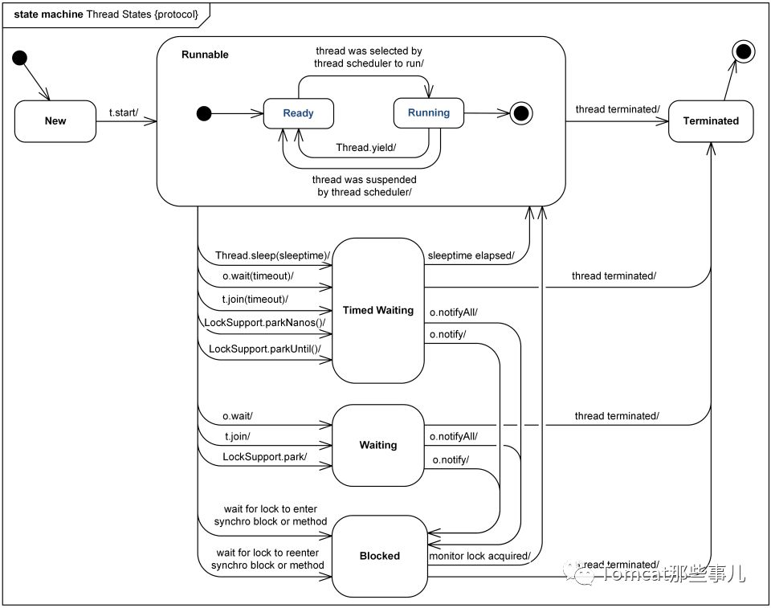

# 第3章 jstack与线程分析

## 3.1 jstack命令介绍

```bash
$ jstack -h
Usage:
    jstack [-l] <pid>
        (to connect to running process)
    jstack -F [-m] [-l] <pid>
        (to connect to a hung process)
    jstack [-m] [-l] <executable> <core>
        (to connect to a core file)
    jstack [-m] [-l] [server_id@]<remote server IP or hostname>
        (to connect to a remote debug server)

Options:
    -F  to force a thread dump. Use when jstack <pid> does not respond (process is hung)
    -m  to print both java and native frames (mixed mode)
    -l  long listing. Prints additional information about locks
    -h or -help to print this help message
```

## 3.2 统计线程数

```bash
$ jstack -l 61572 | grep "java.lang.Thread.State" | wc -l
168
```

## 3.3 查看线程详情

```bash
$ jstack -l 61572 > 61572.log
# 统计各个线程状态数量
$ grep java.lang.Thread.State 61572.log | awk '{print $2$3$4$5}'|sort|uniq -c
```

## 3.4 jstack得到的线程信息解读

- `prio` Java内存定义的线程的优先级。
- `os_prio` 操作系统级别的优先级。
- `tid` Java内的线程ID。
- `nid` 操作系统级别线程的线程ID。

Linux下十六进制和十进制互相转换：

```bash
# 16进制转10进制
$ printf %d 0x1b046
# 10进制转16进制
$ printf %x 110662
# 显示某个进程所有活跃的线程消耗情况。
$ top -H -p 61572
```


