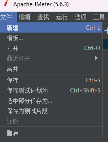
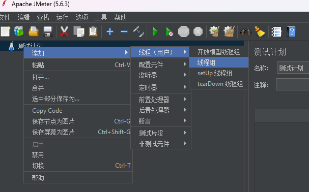
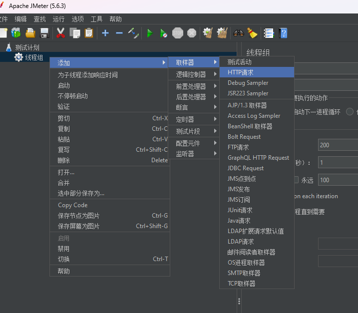
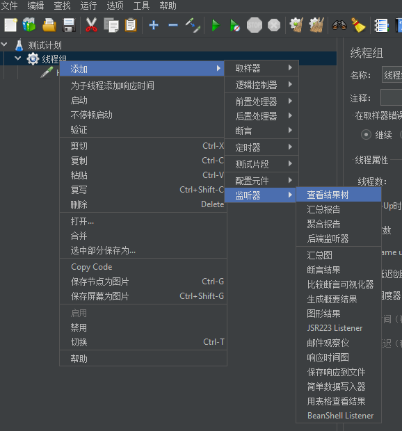
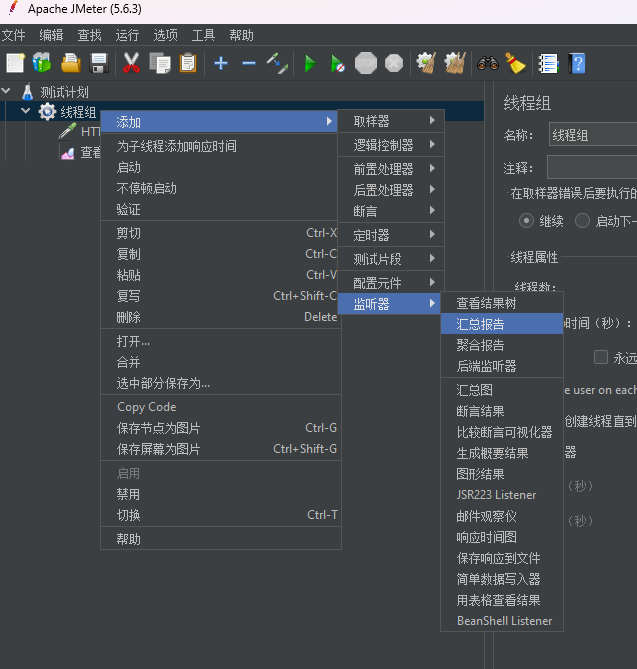
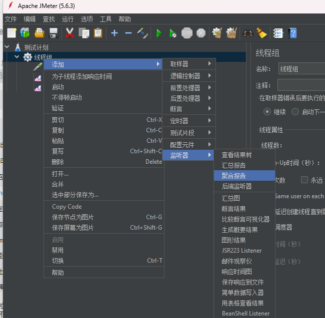
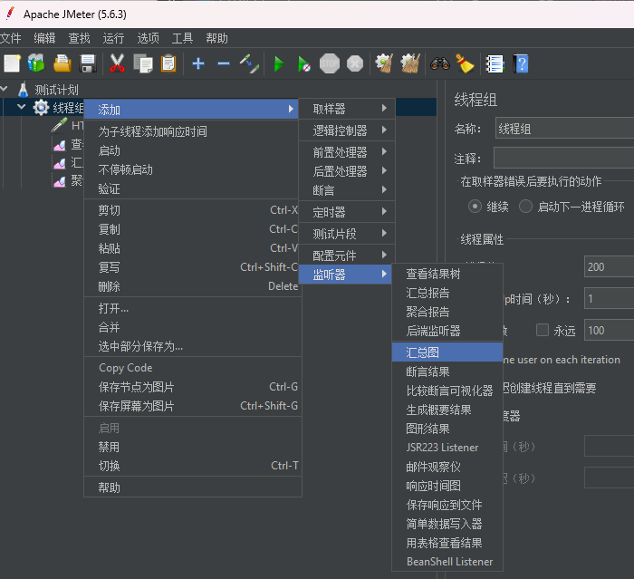

# 第7章 压力测试与JMeter

## 7.1 性能指标

- 响应时间（Response Time：RT）：从客户端发起请求到接收到响应的整个过程所耗费的时间。
- HPS（Hits Per Second）：每秒点击次数，单位是次/秒。
- TPS（Transaction Per Second）：系统每秒处理交易数，单位是笔/秒。
- QPS（Query Per Second）：系统每秒处理查询次数，单位是次/秒。
  - 对于互联网业务中，如果某些业务有且仅有一个请求连接，那么TPS=QPS=HPS

根据经验，一般情况下各行业TPS：
- 金融行业：1000TPS~50000TPS
- 保险行业：100TPS~100000TPS
- 制造行业：10TPS~5000TPS
- 互联网电子商务：10000TPS~1000000TPS
- 互联网中型网站：1000TPS~50000TPS
- 互联网小型网站：500TPS~10000TPS

从外部看，性能测试主要关注三个指标：
- 吞吐量：没秒钟系统能够处理的请求数、任务数。
- 响应时间：服务处理一个请求或者一个任务的耗时。
- 错误率：一批请求中结果出错的请求所占比例。

## 7.2 JMeter

### 安装JMeter

官网：https://jmeter.apache.org/

下载页面：https://jmeter.apache.org/download_jmeter.cgi

解压即安装！

- 启动：双击安装目录/bin/jmeter.bat
- 配置中文：
  - 临时：Options=>Choose Language=>Chinese(Simplified)
  - 永久：打开jmeter.properties，添加`language=zh_CN`

### JMeter压测示例

1. 创建测试计划
2. 添加线程组
3. 添加取样器HTTP请求
4. 添加监听器查看结果树
5. 添加监听器汇总报告
6. 添加监听器聚合报告
7. 添加监听器汇总图

