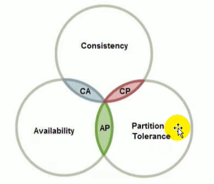
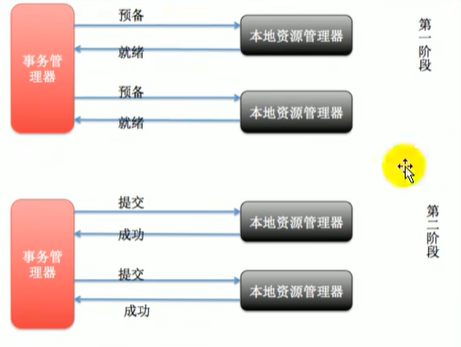
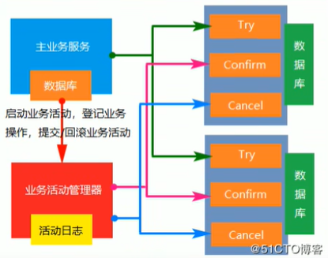

# 第8章 分布式事务

## 8.1 CAP定理与BASE理论

### CAP定理

CAP原则又称为CAP定理，指的是在一个分布式系统中：

- 一致性（Consistency）：在分布式系统中的所有数据备份，在同一时刻是否同样的值。
- 可用性（Availability）：在集群中一部分节点故障后，集群整体是否还能响应客户端的读写请求。
- 分区容错性（Partition tolerance）：区间通信可能失败。

CAP原则指的是，这三个要素最多只能同时实现两点，<span style="color:red;font-weight:bold;">不可能三者兼顾</span>



```
分布式系统：在互相隔离的空间中，提供数据服务的系统。
CAP抽象：不同空间的数据，在同一时间，状态一致。

C：一致性，代表状态一致
A：可用性，代表同一时间
P：分区容错性，代表不同空间
CP:不同空间中的数据，如果要求他们所有状态一致，则必然不在同一时间。【可落地】
AP:不同空间中，如果要求同一时间都可以从任意的空间拿到数据，则必然数据的状态不一致。【可落地】
CA:不同空间的数据，如果要求任意时间都可以从任意空间拿到状态一致的数据，则空间数必然为1.【保证P>1时，不可落地】
```

分布式系统中实现一致性的raft算法：
- http://thesecretlivesofdata.com/raft/
- https://raft.github.io/

### BASE理论

是对CAP理论的延伸，思想是即使无法做到强一致性，但可以采用适当的采取弱一致性，即<span style="color:red;font-weight:bold;">最终一致性</span>。

BASE是指：
- 基本可用（Basically Available）：分布式系统在出现故障的时候，允许损失部分可用性。
- 软状态（Soft State）：允许系统存在中间状态，而该中间状态不会影响系统整体可用性。
- 最终一致性（Eventual Consistency）：系统中的所有数据副本经过一定时间后，最终能够达到一致的状态。

### 强一致性、弱一致性、最终一致性

对于关系型数据库，要求更新过的数据能被后续的访问都能看到，这是<span style="color:red;font-weight:bold;">强一致性</span>。
如果能容忍后续的部分或全部访问不到，则是<span style="color:red;font-weight:bold;">弱一致性</span>。
如果经过一段时间后要求能访问到更新后的数据，则是<span style="color:red;font-weight:bold;">最终一致性</span>。

## 8.2 分布式事务几种方案

### 2PC模式

数据库支持的2PC（2 phase commit 二阶提交），又叫做XA Transactions。

MySQL从5.5版本开始支持，SQL Server 2005开始支持，Oracle 7开始支持。

第一阶段：事务协调器要求每个涉及到事务的数据库预提交此操作。
第二阶段：事务协调器要求每个数据库提交数据。



说明：
- XA协议比较简单，一旦商业数据库实现了XA协议，使用分布式事务的成本也比较低。
- XA性能不理想，特别是在交易下单链路，XA无法满足高并发场景。
- XA在mysql数据库中支持的不太理想，mysql的XA实现，没有记录prepare阶段日志。
- 许多nosql也没有支持XA。

### 柔性事务-TCC事务补偿型方案

刚性事务：遵循ACID原则，强一致性。
柔性事务：遵循BASE理论，最终一致性。



一阶段prepare行为：调用自定义的prepare逻辑。
二阶段commit行为：调用自定义的commit逻辑。
二阶段rollback行为：调用自定义的rollback逻辑。

### 柔性事务-最大努力通知方案

不保证数据一定能通知成功，但会提供可查询操作接口进行核对。比如：调用微信或支付宝支付后的支付结果通知。

### 柔性事务-可靠消息投递+最终一致性方案（异步确保型）

业务处理服务在业务事务提交之前，向实时消息服务请求发送消息，实时消息服务只记录消息数据，而不是真正的发送。业务处理服务在业务事务提交之后，向实时消息服务确认发送。只有在得道确认发送指令后，实时消息服务才会真正发送。
