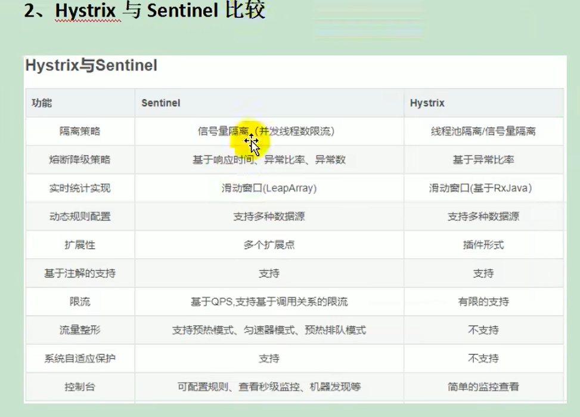

# 第9章 熔断、降级与限流

## 9.1 什么是熔断

A 服务调用 B 服务的某个功能，由于网络不稳定问题，或者 B 服务卡机，导致功能时间超长。如果这样子的次数太多，我们就可以直接将B断路了（A不再请求B接口），凡是调用B的直接返回降级数据，不必等待 B 的超长执行。

## 9.2 什么是降级

整个网站处于流量高峰期，服务器压力剧增，根据当前业务情况及流量，对一些服务和页面进行有策略的降级[停止服务，所有的调用直接返回降级数据]。以此缓解服务器资源的压力，以保证核心业务的正常运行。

## 9.3 异同

相同点：
1. 为了保证集群大部分服务的可用性和可靠性，防止崩溃，牺牲小我。
2. 用户最终都是体验到某个功能不可用。

不同点：
1. 熔断是被调用方故障，出发的系统主动规则。
2. 降级是基于全局考虑，停止一些正常服务，释放资源。

## 9.4 什么是限流

对打入服务的请求流量进行控制，使服务能够承担不超过自己能力的流量压力。

## 9.5 Sentinel

