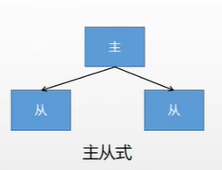
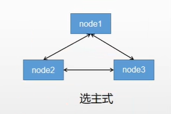
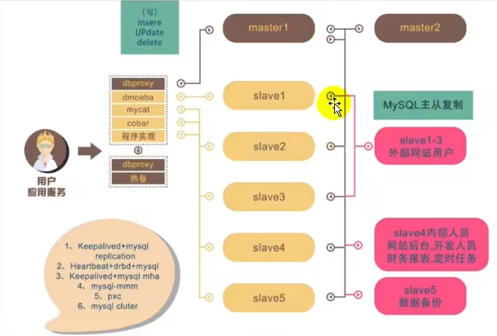

# 第10章 集群

## 10.1 集群的目标

- **高可用（High Availability）**，是当一台服务器停止服务后，对于业务及用户毫无影响。
- **突破数据量限制**，一台服务器不能存储大量数据，需要多台分担，每个存储一部分，共同存储完整个集群数据。
- **数据备份容灾**，单点故障后，存储的数据仍然可以在别的地方拉起。
- **压力分担**，由于多个服务器都能完成各自一部分工作，所以尽量的避免了单点压力的存在。

## 10.2 集群的基础形式

- 主从式：MySQL主从复制，K8S主从调度。

- 分片式：Redis数据分片存储，片区之间备份。

- 选主式：Elasticsearch为了容灾选主，为了调度选主。

## 10.3 MySQL集群

集群原理：

- MySQL-MMM是Master-Master Replication Manager for MySQL（MySQL主主复制管理器）
- MHA（Master High Availability）
- InnoDB Cluster
