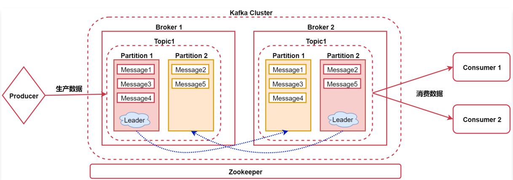
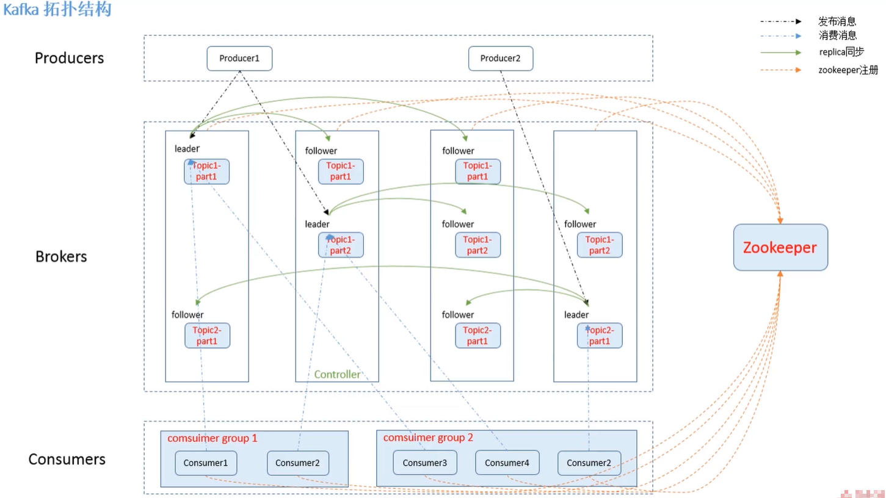

# 三、初识Kafka

## 3.1、什么是消息队列

消息队列（Message Queue）：可以简称为MQ。

> 例如：Java中的Queue队列，也可以认为是一个消息队列。

消息队列：顾名思义，消息+队列，其实就是保存消息的队列，属于消息传输过程中的容器。

消息队列主要提供生产、消费接口供外部调用，做数据的存储和读取。

## 3.2、消息队列分类

消息队列大致可以分为两种：点对点（P2P），发布订阅（Pub/Sub）。

- 共同点：

针对数据的处理流程是一样的。

消息生产者生产消息发送到queue中，然后消息消费者从queue中读取并且消费消息。

- 不同点：

点对点（P2P）模型包含：消息队列（Queue）、发送者（Sender）、接收者（Receiver）

一个生产者生产的消息只有一个消费者（Consumer）（消息一旦被消费，就不在消息队列中）消费。

例如QQ中的私聊，我发给你的消息只有你能看到，别人是看不到的。

发布订阅（Pub/Sub）模型包含：消息队列（Queue）、主体（Topic）、发布者（Publisher）、订阅者（Subscriber）。

每个消息可以有多个消费者，彼此互不影响。比如我发布一个微博：关注我的人都能够看到，或者QQ中的群聊，我在群里面发一条消息，群里面所有人都能看到。

这就是这两种消息队列的区别。

我们接下来要学习的Kafka这个消息队列是属于发布订阅模型的。

## 3.3、什么是Kafka

Kafka是一个高吞吐量的、持久性的、分布式发布订阅消息系统。

> 另外一种描述更贴切：Kafka是一个高吞吐量可持久化的、支持分区的（partition）、多副本的（replica）、基于zookeeper协调的分布式发布订阅消息系统。

- 高吞吐量：可以满足每秒百万级别消息的生产和消费。

为什么这么快？

难道Kafka的数据是放在内存里面的吗？

不是的，Kafka的数据还是放在磁盘里面的。

主要是Kafka利用了磁盘顺序读写速度超过内存随机读写速度这个特性。

所以说它的吞吐量才这么高。

- 持久性：有一套完善的消息存储机制，确保数据高效安全的持久化。
- 分布式：它是基于分布式的扩展、和容错机制；Kafka的数据都会复制到几台服务器上。当某一台机器故障失效时，生产者和消费者切换使用其他的机器。

> Kafka的数据是存储在磁盘中的，为什么可以满足每秒百万级别消息的生产和消费？
>
> 这是一个面试题，其实就是我们刚才针对高吞吐量的解释：Kafka利用了磁盘顺序读写速度超过内存随机读写速度这个特性。

Kafka主要应用在实时计算领域，可以和Flume、Spark、Flink等框架结合在一块使用。

> 例如：我们使用Flume采集网站产生的日志数据，将数据写入到Kafka中，然后通过Spark或者Flink从Kafka中消费数据进行计算，这其实是一个典型的实时计算案例的架构。

## 3.4、Kafka组件介绍

如图：

先看中间的Kafka Cluster，这个Kafka集群内有两个节点，这些节点在这里我们称之为Broker。

### 3.4.1、Broker

Broker：消息的代理，Kaka集群中的一个节点称为一个broker。

### 3.4.2、Topic

在Kafka中有Topic的概念

Topic：称为主题，Kafka处理的消息的不同分类（是一个逻辑概念）。

如果把Kafka认为是一个数据库的话，那么Kafka中的Topic就可以认为是一张表。不同的Topic中存储不同业务类型的数据，方便使用。

### 3.4.3、Partition

在Topic内部有partition的概念，每个分区都有一个Leader以及0个或者多个Follower，在创建Topic时，**Kafka会将不同分区的Leader均匀的分配在每个Broker上。**

Partition：是Topic物理上的分组，一个Topic会被分为1个或者多个partition（分区），分区个数是在创建topic的时候指定。每个topic都是有分区的，至少1个。

注意：这里面针对partition其实还有副本的概念，主要是为了提供数据的容错性，我们可以在创建Topic的时候指定partition的副本因子是几个。

在这里面副本因子其实就是2了，其中一个是Leader，另一个是真正的副本。

- Leader

Leader：用于处理消息的接收和消费等请求。

Leader中的这个partition负责接收用户的读写请求，副本partition负责从Leader里面的partition中同步数据，这样的话，如果后期Leader对应的节点宕机了，副本可以切换为Leader顶上来。

- Follower

Follower：主要用于备份消息数据。

汇总：**Kafka中的Leader负责处理读写操作**，而Follower只负责副本数据的同步；如果Leader出现故障，其他Follower会被重新选举为Leader。Follower像一个Consumer一样，拉取Leader对应分区的数据，并保存到日志数据文件中。

### 3.4.4、Message

在Partition内部还有一个message的概念

Message：我们称之为消息，代表的就是一条数据，它是通信的基本单位，每个消息都属于partition。

在这里总结一下：
Broker > Topic > Partition > Message

接下来还有两个组件，看图中的最左边和最右边。

Producer：消息和数据的生产者，向Kafka的topic生产数据。

Consumer：消息和数据的消费者，从Kafka的topic中消费数据。

这里的消费者可以有多个，每个消费者可以消费到相同的数据。

最后还有一个Zookeeper服务，Kafka的运行是需要依赖于Zookeeper的，Zookeeper负责协调Kafka集群的正常运行。

另一个参考图：

