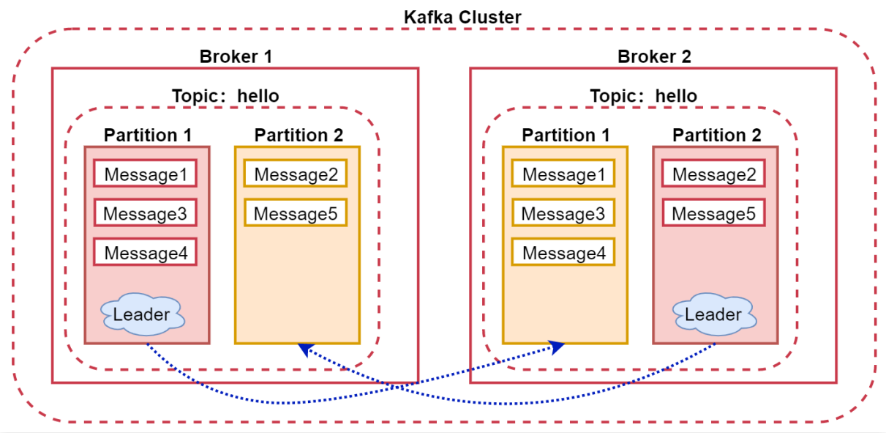
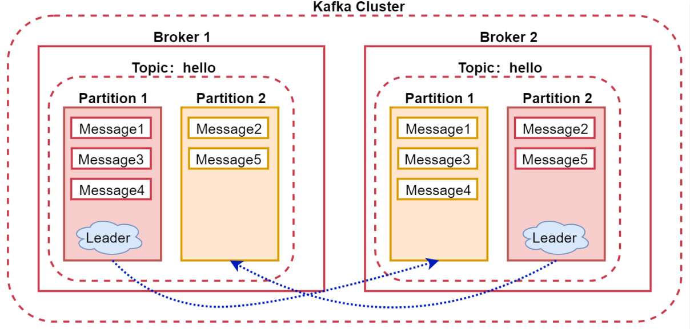
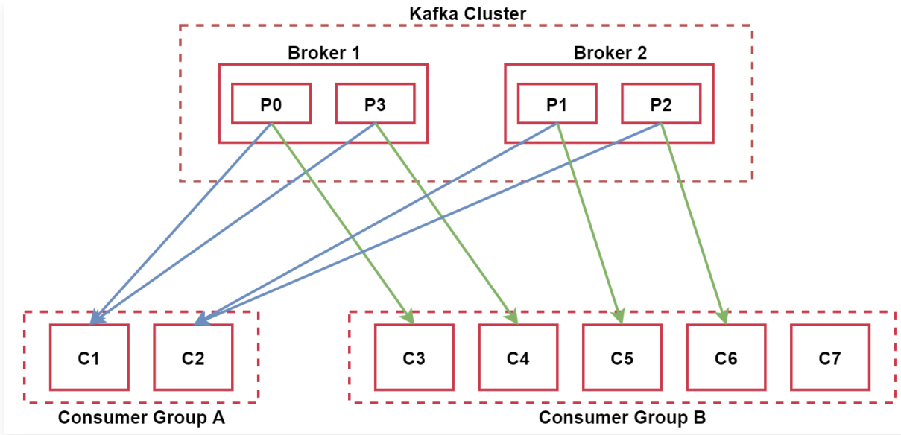
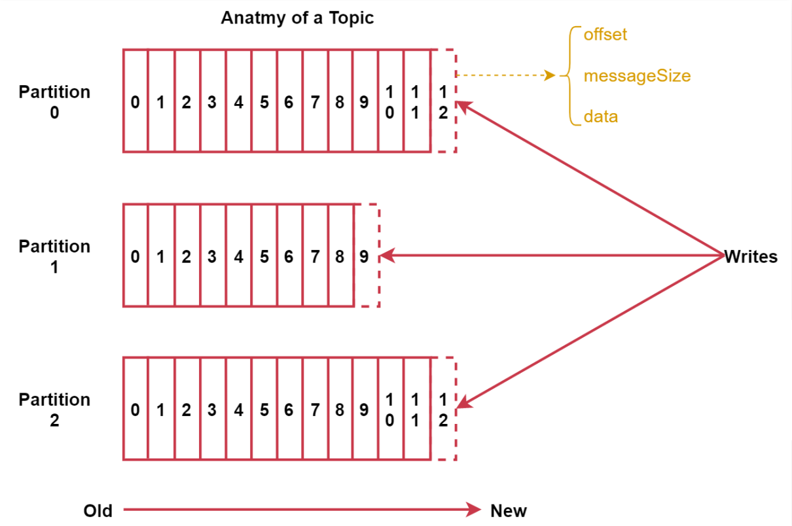
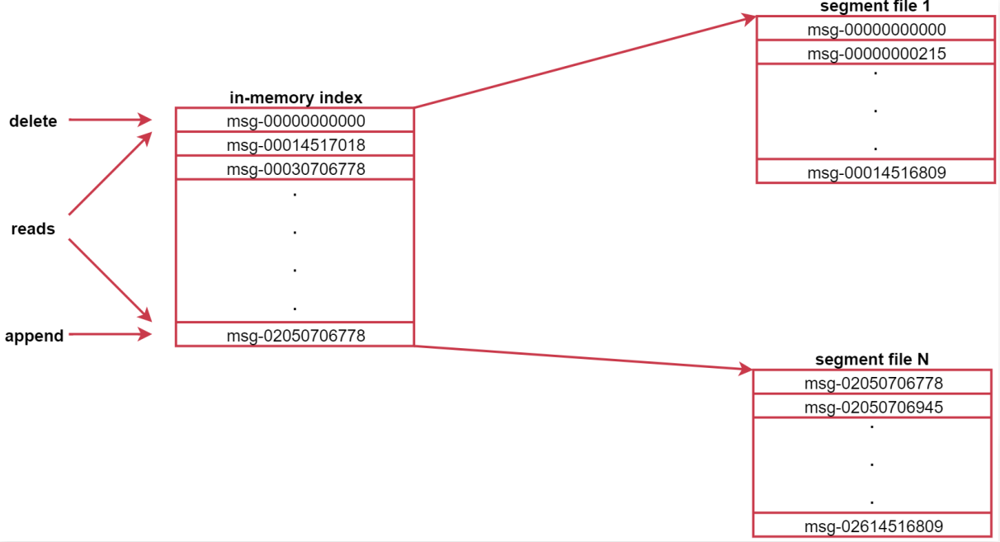

# 四、Kafka基础与进阶

## 4.1、Kafka中Topic的操作

### 4.1.1、新增Topic

注意：副本数不能大于集群中Broker的数量。

因为每个partition的副本必须保存在不同的broker，否则没有意义，如果partition的副本都保存在同一个broker，那么这个broker挂了，则partition数据依然会丢失。

- 新增Topic

```bash
# 指定2个分区，2个副本，副本数不能大于集群中的Broker的数量；对于zookeeper集群，也可以英文逗号分隔
# --bootstrap-server emon:9092 与 --zookeeper emon:2181 等价
# --broker-list emon:9092 和  --bootstrap-server emon:9092 等价
$ kafka-topics.sh --bootstrap-server emon:9092 --create --partitions 2 --replication-factor 2 --topic hello
# 命令行输出结果
Created topic hello.
```


### 4.1.2、查询Topic

- 查询Topic列表

```bash
$ kafka-topics.sh --bootstrap-server emon:9092 --list
# 命令行输出结果
hello
```

- 查询topic的偏移量（最小值）

```bash
$ kafka-run-class.sh kafka.tools.GetOffsetShell --broker-list emon:9092 --topic test
# 命令执行结果
test:0:0
test:1:0
```

- 查询topic的最小offset和最大offset

```bash
# 最小值
$ kafka-run-class.sh kafka.tools.GetOffsetShell --broker-list emon:9092 --topic test --time -2
# 命令执行结果
test:0:0
test:1:0
# 最大值
$ kafka-run-class.sh kafka.tools.GetOffsetShell --broker-list emon:9092 --topic test --time -1
# 命令执行结果
test:0:57
test:1:83
```


- 查看指定topic的详细信息

```bash
$ kafka-topics.sh --bootstrap-server emon:9092 --describe --topic hello
Topic: hello	PartitionCount: 2	ReplicationFactor: 2	Configs: 
	Topic: hello	Partition: 0	Leader: 1	Replicas: 1,2	Isr: 1,2
	Topic: hello	Partition: 1	Leader: 2	Replicas: 2,0	Isr: 2,0
```

第一行显示指定topic所有partitions的一个总结。

PartitionCount：表示这个Topic一共有多少个partition；

ReplicationFactor：表示这个Topic中partition的副本因子是几；

Configs：这个表示创建Topic时动态指定的配置信息，在这我们没有额外指定配置信息；


下面每一行给出的是一个partition的信息，如果只有一个partition，则只显示一行。

Topic：显示当前的Topic名称；

Partition：显示当前Topic的partition编号；

Leader：Leader partition所在的节点编号，这个编号其实就是`broker.id`的值；

看图：



这个图里面的hello这个topic有两个partition，其中partition1的Leader所在的节点是broker1，partition2的Leader所在的节点是broker2。

Replicas：当前partition所有副本所在的节点编号【包含Leader所在的节点】，如果设置多个副本的话，这里会显示多个，不管该节点是否是Leader以及是否存活。

Isr：当前partition处于同步状态的所有节点，这里显示的所有节点都是存活状态的，并且跟Leader同步的（包含Leader所在的节点）。

所以说Replicas和Isr的区别就是：

如果某个partition的副本所在的节点宕机了，在Replicas中还是会显示那个节点，但是在Isr中就不会显示了，Isr中显示的都是出于正常状态的节点。

### 4.1.3、修改Topic

- 修改Topic的partition数量，只能增加

为什么partition只能增加？

因为数据是存储在partition中的，如果可以减少partition的话，那么partition中的数据就丢了。

```bash
$ kafka-topics.sh --bootstrap-server emon:9092 --alter --partitions 5 --topic hello
# 命令行输出结果
WARNING: If partitions are increased for a topic that has a key, the partition logic or ordering of the messages will be affected
Adding partitions succeeded!
```

### 4.1.4、删除Topic

删除Kafka中的指定Topic，删除操作是不可逆的。

> 注意：Kafka从1.0.0开始默认开启了删除操作，之前的版本只会把Topic标记为删除状态，需要设置`delete.topic.enable`为true才可以真正删除。

如果不想开启删除功能，可以设置`delete.topic.enable`为false，这样删除topic的时候只会把它标记为删除状态，此时这个topic依然可以正常使用。

`delete.topic.enable`可以配置在`server.properties`文件中。

```bash
$ kafka-topics.sh --bootstrap-server emon:9092 --delete --topic hello
# 命令行输出结果
Topic hello is marked for deletion.
Note: This will have no impact if delete.topic.enable is not set to true.
```

### 4.1.5、查看group

- 查看group列表

```bash
$ kafka-consumer-groups.sh --bootstrap-server emon:9092 --list
```

- 查看所有group详情

```bash
$ kafka-consumer-groups.sh --bootstrap-server emon:9092 --describe --all-groups
```

- 查看指定group详情

```bash
$ kafka-consumer-groups.sh --bootstrap-server emon:9092 --describe --group con-1
# 命令行输出结果
Consumer group 'con-1' has no active members.

GROUP           TOPIC           PARTITION  CURRENT-OFFSET  LOG-END-OFFSET  LAG             CONSUMER-ID     HOST            CLIENT-ID
con-1           hello           4          0               0               0               -               -               -
con-1           hello           2          0               0               0               -               -               -
con-1           hello           3          2               2               0               -               -               -
con-1           hello           0          0               0               0               -               -               -
con-1           hello           1          2               2               0               -               -               -
```

GROUP：当前消费者组，通过group.id指定的值；

TOPIC：当前消费的topic；

PARTITION：消费的分区；

CURRENT-OFFSET：该分区当前消费组内，已经消费到的offset。（比如：分区1的值为2，表示偏移量是0-1的消息被消费，下一条是偏移量为2的消息）

LOG-END-OFFSET：该分区中数据的最大offset。（比如：分区1的值为2，表示已有2条数据，或下一个最大offset的值）

LAG：当前分区未消费数据量；

CONSUMER-ID：消费者ID；

HOST：主机；

CLIENT-ID：客户端ID。

- 查看消费组成员信息

```bash
$ kafka-consumer-groups.sh --bootstrap-server emon:9092 --describe --group con-1 --members
```

- 查看消费组状态信息

```bash
$ kafka-consumer-groups.sh --bootstrap-server emon:9092 --describe --group con-1 --state
```

- 在topic上offset某个group

```bash
# 注意，to-offset 的参数，不能大于 LOG-END-OFFSET；to-offset可以替换为to-earliest或to-latest或to-current或to-datetime
$ kafka-consumer-groups.sh --bootstrap-server emon:9092 --group con-1 --topic hello --execute --reset-offsets --to-offset 0
```

- 删除某个group

```bash
$ kafka-consumer-groups.sh --bootstrap-server emon:9092 --delete --group con-1
```


### 4.1.6、Kafka中的生产者和消费者

Kafka默认提供了基于控制台的生产者和消费者，方便测试使用。

- 生产者：`kafka-console-producer.sh`
- 消费者：`kafka-console-consumer.sh`

#### 4.1.6.1、如何生产数据

直接使用Kafka提供的基于控制台的生产者。

先创建一个Topic【5个分区，2个副本】：

```bash
$ kafka-topics.sh --bootstrap-server emon:9092 --create --partitions 5 --replication-factor 2 --topic hello
```

向这个Topic中生产数据：

```bash
$ kafka-console-producer.sh --bootstrap-server emon:9092 --topic hello
# 进入kafka生产者命令行
>
```

命令说明：

- broker-list：Kafka的服务地址[多个用英文逗号隔开]
- topic：Topic名称

#### 4.1.6.2、如何消费数据

再创建一个消费者消费Topic中的消息：

```bash
$ kafka-console-consumer.sh --bootstrap-server emon:9092 --topic hello --group g --from-beginning
```

命令说明：

- bootstrap-server：Kafka的服务地址[多个用英文逗号隔开]
- topic：具体的Topic
- group：消费者组
- from-beginning：表示从头消费，如果不指定，默认消费最新生产的数据

### 4.1.7、案例：QQ群聊天

通过Kafka可以模拟QQ群聊天的功能，我们来看一下。

首先在Kafka中创建一个新的topic，可以认为是我们在QQ里面创建了一个群，群号是88888888

```bash
$ kafka-topics.sh --bootstrap-server emon:9092 --create --partitions 5 --replication-factor 2 --topic 88888888
```

打开生产者：

```bash
$ kafka-console-producer.sh --bootstrap-server emon:9092 --topic 88888888
```

打开2个新在终端，消费消息：

```bash
[emon@emon2 ~]$ kafka-console-consumer.sh --bootstrap-server emon:9092 --topic 88888888 --from-beginning
[emon@emon3 ~]$ kafka-console-consumer.sh --bootstrap-server emon:9092 --topic 88888888 --from-beginning
```

## 4.2、Kafka核心扩展内容

### 4.2.1、Broker扩展

Broker的参数可以配置在`server.properties`这个配置文件中，Broker中支持的完整参数在官方文档中有提现：

https://kafka.apache.org/documentation/#brokerconfigs

针对Broker的参数，我们主要分析两块：

1：Log Flush Policy：设置数据flush到磁盘的时机。

为了减少磁盘写入的次数，broker会将消息暂时缓存起来，当消息的个数达到一定阈值或者过了一定的时间间隔后，再flush到磁盘，这样可以减少磁盘IO调用的次数。

这块主要通过两个参数控制：

- `log.flush.interval.messages`：一个分区的消息数阈值，达到该阈值则将该分区的数据flush到磁盘，注意这里是针对分区，因为topic是一个逻辑概念，分区是真实存在的，每个分区会在磁盘上产生一个目录。

  这个参数的默认值为`9223372036854775807`，long的最大值。默认值太大了，所以建议修改，可以使用`server.properties`中针对这个参数指定的值10000，需要去掉注释之后这个参数才生效。

- `log.flush.interval.ms`：间隔指定时间。

  默认间隔指定的时间将内存中缓存的数据flush到磁盘中，由文档可知，这个参数的默认值为null，此时会使用`log.flush.scheduler.interval.ms`参数的值，`log.flush.scheduler.interval.ms`参数的值默认是`9223372036854775807`，long的最大值。

  所以这个值也建议修改，可以使用`server.properties`中针对这个参数指定的值1000，单位是毫秒，表示每1秒写一次磁盘，这个参数也需要去掉注释之后才生效。


2：Log Retention Policy：设置数据保存周期，默认7天。

Kafka中的数据默认会保存7天，如果Kafka每天接收的数据量过大，这样是很占磁盘空间的，建议修改数据保存周期，我们之前在实际工作中是将数据保存周期改为了1天。

数据保存周期主要通过这几个参数控制。

- `log.retention.hours`：这个参数默认值为168，单位是小时，就是7天，可以在这调整数据保存的时间，超过这个时间数据会被自动删除。
- `log.retention.bytes`：这个参数表示当分区的文件达到一定大小的时候会删除它，如果设置了按照指定周期删除数据文件，这个参数不设置也可以，这个参数默认是没有开启的。
- `log.retention.check.interval.ms`：这个参数表示检测的间隔时间，单位是毫秒，默认值是300000，就是5分钟，表示每5分钟检测一次文件看是否满足删除的时机。

### 4.2.2、Producer扩展

Producer默认是随机将数据发送到topic的不同分区中，也可以根据用户设置的算法来根据消息的key来计算输入到哪个partition里面。

此时需要通过partitioner来控制，这个知道就行了，因为在实际工作中一般在向Kafka中生产数据的都是不带key的，只有数据内容，所以一般都是使用随机的方式发送数据。

在这里有一个需要注意的内容就是：

> 针对producer的数据通讯方式：同步发送和异步发送。

同步是指：生产者发出数据后，等接收方发回相应以后再发送下个数据的通讯方式。

异步是指：生产者发出数据后，不等接收方发回相应，接着发送下一个数据的通讯方式。

具体的数据通讯策略是由acks参数控制的。

- acks默认为1，表示需要Leader节点回复收到消息，这样生产者才会发送下一条数据。【默认】

- acks：all，表示需要所有Leader+副本节点回复收到消息（acks=-1），这样生产者才会发送下一条数据。

- acks：0，表示不需要任何节点回复，生产者会继续发送下一条数据。



我们在向hello这个topic生产数据的时候，可以在生产者中设置acks参数，acks设置为1，表示我们在向hello这个topic的partition1这个分区写数据的时候，只需要让Leader所在的broker1这个节点回复确认收到的消息就可以了，这样生产者就可以发送下一条数据了。

如果acks设置为all，则需要partition1的这两个副本所在的节点（包含Leader）都回复收到消息，生产者才会发送下一条数据。

如果acks设置为0,，表示生产者不会等待任何partition所在节点的回复，它只管发送数据，不管你有没有收到，所以这种情况丢失数据的概率比较高。

> 针对这块在面试的时候会有一个面试题：Kafka如何保证数据不丢？

其实就是通过acks机制保证的，如果设置acks为all，则可以保证数据不丢，因为此时把数据发送给Kafka之后，会等待对应partition所在的所有Leader和副本节点都确认收到消息之后才会认为数据发送成功了，所以在这种策略下，只要把数据发送给Kafka之后就不会丢了。

如果acks设置为1，则当我们把数据发送给partition之后，partition的Leader节点也确认收到了，但是Leader回复完确认消息之后，Leader对应的节点就宕机了，副本partition还没来得及将数据同步过去，所以会存在丢失的可能性。

不过如果宕机的是副本partition所在的节点，则数据是不会丢的。

如果acks设置为0的话就表示是顺其自然了，只管发送，不管Kafka有没有收到，这种情况表示对数据丢失都无所谓了。

### 4.2.3、Consumer扩展

在消费者中还有一个消费者组的概念。

每个consumer属于一个消费者组，通过group.id指定消费者组。

那组内消费和组间消费有什么区别吗？

- 组内：消费者组内的所有消费者消费同一份数据；

注意：在同一个消费者组中，一个partition同时只能有一个消费者消费数据。

如果消费者的个数小于分区的个数，一个消费者会消费多个分区的数据。

如果消费者的个数大于分区的个数，则多余的消费者不消费数据。

所以，对于一个topic，同一个消费者组中推荐不能有多于分区个数的消费者，否则将意味着某些消费者将无法获得消息。

- 组间：多个消费者组消费相同的数据，互不影响。



Kafka集群有两个节点，Broker1和Broker2.

集群内有一个topic，这个topic有4个分区，P0，P1，P2，P3

下面有两个消费者组：

Consumer Group A和Consumer Group B

其中Consumer Group A中有两个消费者C1和C2，由于这个topic有4个分区，所以，C1负责消费两个分区的数据，C2负责消费两个分区的数据，这个属于组内消费。

Consumer Group B有5个消费者，C3~C7，其中C3，C4，C5，C6分别消费一个分区的数据，而C7就是多余出来的了，因为现在这个消费者组内的消费者的数量比对应的topic的分区数量还多，但是一个分区同时只能被一个消费者消费，所以就会有一个消费者处于空闲状态。

这个也属于组内消费。

Consumer Group A和Consumer Group B这两个消费者组属于组间消费，互不影响。

### 4.2.4、Topic、Partition扩展

每个partition在存储层面是append log文件。

新消息都会被直接追加到log文件的尾部，每条消息在log文件中的位置成为offset（偏移量）。

越多partitions可以容纳更多的consumer，有效提升并发消费的能力。

> 具体什么时候增加topic的数量？什么时候增加partition的数量呢？

业务类型增加需要增加topic、数据量大需要增加partition。

### 4.2.5、Message扩展

每条Message包含了以下三个属性：

1. offset对应类型：long表示此消息在一个partition中的起始的位置。可以认为offset是partition中Message的id，自增的。
2. MessageSize对应类型：int32此消息的字节大小。
3. data是message的具体内容。

看这个图，加深对Topic、Partition、Message的理解。



## 4.3、Kafka核心值存储和容错机制

### 4.3.1、存储策略

在Kafka中每个topic包含1到多个partition，每个partition存储一部分Message。每条Message包含三个属性，其中有一个是offset。

> 问题来了：offset相当于partition中这个message的唯一id，那么如何通过id高效的找到message。

两大法宝：分段+索引

Kafka中数据的存储方式是这样的：

1. 每个partition由多个segment【片段】组成，每个segment中存储多条消息。
2. 每个partition在内存中对应一个index，记录每个segment中的第一条消息偏移量。
3. 每个partition会将消息添加到最后一个segment上
4. 当segment达到一定阈值会flush到磁盘上
5. segment文件分为两个部分：index和data（*.log文件）

Kafka中数据的存储流程是这样的：
生产者生产的消息会被发送到topic的多个partition上，topic收到消息后往对应partition的最后一个segment上添加该消息，segment达到一定的大小后会创建新的segment。

来看这个图，可以认为是针对topic中某个partition的描述。



图中左侧就是索引，右边是segment文件，左边的索引里面会存储每个segment文件中第一条消息的偏移量，由于消息的偏移量都是递增的，这样后期查找起来就方便了，先到索引中判断数据在哪一个segment文件中，然后就可以直接定位到具体的segment文件了，这样再查找具体的一条数据就很快了，因为都是有序的。

### 4.3.2、容错机制

> 当Kafka集群中的一个Broker节点宕机，会出现什么现象？

下面来演示一下：

使用`kill -9`杀掉emon中的broker进程测试。

```bash
$ jps
82512 Jps
82011 QuorumPeerMain
82383 Kafka
$ kill 82383
```

我们可以先通过zookeeper来查看一下，因为当Kafka集群中的broker节点启动之后，会自动向zookeeper中进行注册，保存当前节点信息。

```bash
$ zkCli.sh 
......
[zk: localhost:2181(CONNECTED) 0] ls /brokers
[ids, seqid, topics]
[zk: localhost:2181(CONNECTED) 1] ls /brokers/ids
[1, 2]
```

此时发现zookeeper的`/brokers/ids`下面只有2个节点信息。

可以通过get命令查看节点信息，这里面会显示对应的主机名和端口号。

```bash
[zk: localhost:2181(CONNECTED) 2] get /brokers/ids/1
{"listener_security_protocol_map":{"PLAINTEXT":"PLAINTEXT"},"endpoints":["PLAINTEXT://emon2:9092"],"jmx_port":-1,"host":"emon2","timestamp":"1645766294919","port":9092,"version":4}
```

然后再使用describe查询topic的详细信息，会发现此时的分区的Leader全部变成了目前存活的另外两个节点。

```bash
$ kafka-topics.sh --bootstrap-server emon:9092 --describe --topic hello
Topic: hello	PartitionCount: 5	ReplicationFactor: 2	Configs: 
	Topic: hello	Partition: 0	Leader: 1	Replicas: 1,2	Isr: 1,2
	Topic: hello	Partition: 1	Leader: 2	Replicas: 2,0	Isr: 2
	Topic: hello	Partition: 2	Leader: 1	Replicas: 0,1	Isr: 1
	Topic: hello	Partition: 3	Leader: 1	Replicas: 1,0	Isr: 1
	Topic: hello	Partition: 4	Leader: 1	Replicas: 2,1	Isr: 1,2
```

此时可以发现Isr中的内容和Replicas中的不一样了，因为Isr中显示的是目前正常运行的节点。

所以当Kafka集群中的一个Broker节点宕机之后，对整个集群而言没有什么特别大的影响，此时集群会给partition重新选出来一些新的Leader节点。

> 当Kafka集群中新增一个Broker节点，会出现什么现象？

新加入一个broker几点，zookeeper会自动识别并在适当的机会选择此节点提供服务。

再次启动emon几点中的broker进行测试。

```bash
$ /usr/local/kafka/kafkaStart.sh 
```

此时到zookeeper中查看一下：

```bash
$ zkCli.sh 
......
[zk: localhost:2181(CONNECTED) 0] ls /brokers
[ids, seqid, topics]
[zk: localhost:2181(CONNECTED) 1] ls /brokers/ids
[0, 1, 2]
```

发现broker.id为0的这个节点信息也有了。

中通过describe查看topic的描述信息，Isr中的信息和Replicas中的内容是一样的了。

```bash
$ kafka-topics.sh --describe --zookeeper emon:2181 --topic hello
Topic: hello	PartitionCount: 5	ReplicationFactor: 2	Configs: 
	Topic: hello	Partition: 0	Leader: 1	Replicas: 1,2	Isr: 1,2
	Topic: hello	Partition: 1	Leader: 2	Replicas: 2,0	Isr: 2,0
	Topic: hello	Partition: 2	Leader: 0	Replicas: 0,1	Isr: 1,0
	Topic: hello	Partition: 3	Leader: 1	Replicas: 1,0	Isr: 1,0
	Topic: hello	Partition: 4	Leader: 1	Replicas: 2,1	Isr: 1,2
```

>  但是启动后有个问题：如果发现新启动的这个节点不会是任何分区的Leader？怎么重新均匀分配呢？
>
> 备注：我实际重启后，partition编号2的分区，Leader是0。

1、Broker中的自动均衡策略（默认已经有）

```bash
auto.leader.rebalance.enable=true
leader.imbalance.check.interval.seconds 默认值：300
```

2、手动执行：

```bash
$ kafka-leader-election.sh --bootstrap-server emon:9092 --election-type preferred --all-topic-partitions
# 命令行输出结果
Successfully completed leader election (PREFERRED) for partitions 88888888-4, hello-4, hello-3, 88888888-2, hello-1
```

执行后的效果如下，这样就实现了均匀分配。

```bash
$ kafka-topics.sh --describe --zookeeper emon:2181 --topic hello
Topic: hello	PartitionCount: 5	ReplicationFactor: 2	Configs: 
	Topic: hello	Partition: 0	Leader: 1	Replicas: 1,2	Isr: 1,2
	Topic: hello	Partition: 1	Leader: 2	Replicas: 2,0	Isr: 0,2
	Topic: hello	Partition: 2	Leader: 0	Replicas: 0,1	Isr: 0,1
	Topic: hello	Partition: 3	Leader: 1	Replicas: 1,0	Isr: 0,1
	Topic: hello	Partition: 4	Leader: 2	Replicas: 2,1	Isr: 1,2
```

## 4.4、Kafka生产消费者实战

### 4.4.1、Consumer消费offset查询

Kafka0.9版本以前，消费者的offset信息保存在zookeeper中。

从Kafka0.9开始，使用了新的消费API，消费者的信息会保存在Kafka里面的`__consumer_offsets`这个topic中。

因为频繁操作zookeeper性能不高，所以Kafka在自己的topic中负责维护消费者的offset信息。

> 如何查询保存在Kafka中的Consumer的offset信息呢？

使用`kafka-consumer-groups.sh`这个脚本可以查看。

- 查看目前所有的consumer group。

```bash
$ kafka-consumer-groups.sh --list --bootstrap-server emon:9092
# 命令行输出结果
con-2
con-1
```

- 查看某一个具体consumer group的信息

```bash
$ kafka-consumer-groups.sh --describe --bootstrap-server emon:9092 --group con-1
# 命令行输出结果
Consumer group 'con-1' has no active members.

GROUP           TOPIC           PARTITION  CURRENT-OFFSET  LOG-END-OFFSET  LAG             CONSUMER-ID     HOST            CLIENT-ID
con-1           hello           4          0               0               0               -               -               -
con-1           hello           2          0               0               0               -               -               -
con-1           hello           3          2               2               0               -               -               -
con-1           hello           0          0               0               0               -               -               -
con-1           hello           1          2               2               0               -               -               -
```

GROUP：当前消费者组，通过group.id指定的值；

TOPIC：当前消费的topic；

PARTITION：消费的分区；

CURRENT-OFFSET：消费者消费到这个分区的offset；

LOG-END-OFFSET：当前分区中数据的最大offset；

LAG：当前分区未消费数据量；

CONSUMER-ID：消费者ID；

HOST：主机；

CLIENT-ID：客户端ID。

### 4.4.2、Consumer消费顺序

当一个消费者消费一个partition时候，消费的数据顺序和此partition数据的生产顺序是一致的；

当一个消费者消费多个partition时候，消费者按照partition的顺序，首先消费一个partition，当消费完一个partition最新的数据后再消费其它partition中的数据。

> 总之：如果一个消费者消费多个partition，只能保证消费的数据顺序在一个partition内是有序的。

也就是说消费Kafka中的数据只能保证消费partition内的数据是有序的，多个partition之间是无序的。

### 4.4.3、Kafka的三种语义

Kafka可以实现以下三种语义，这三种语义是针对消费者而言的：

- 至少一次：at-least-once

这种语义有可能会对数据重复处理。

实现至少一次消费语义的消费者也很简单。

1：设置`enable.auto.commit`为false，禁用自动提交offset。

2：消息处理完之后手动调用`consumer.commitSync()`提交offset

这种方式是在消费数据之后，手动调用函数`consumer.commitSync()`同步提交offset。

有可能处理多次的场景是消费者的消息处理完成并输出到结果库，但是offset还没有提交，这个时候消费者挂掉了，再重启的时候会重新消费并处理消息，所以至少会处理一次。

- 至多一次：at-most-once【默认】

这种语义有可能会丢失数据。

至多一次消费语义是Kafka消费者的默认实现。配置这种消费者最简单的方式是：

1：enable.auto.commit设置为true。

2：auto.commit.interval.ms设置为一个较低的时间范围。

由于上面的配置，此时Kafka会有一个独立的线程负责按照指定时间间隔提交offset。

消费者的offset已经提交，但是消息还在处理中（还没有处理完），这个时候程序挂了，导致数据没有被成功处理，再重启的时候会从上次提交的offset处理消费，导致上次没有被成功处理的消息就丢失了。

- 仅一次：exactly-once

这种语义可以保证数据只被消费处理一次。

1：将enable.auto.commit设置为false，禁用自动提交offset。

2：使用consumer.seek(topicPartition, offset)来指定offset；

3：在处理消息的时候，要同时保存住每个消息的offset。以原子事务的方式保存offset和处理的消息结果，这个时候相当于自己保存offset信息了，把offset和具体的数据绑定到一块，数据真正处理成功的时候才会保存offset信息。

这样就可以保证数据仅被处理一次了。


## 4.99、其他

### 1、Kafka节点故障

- Kafka与ZooKeeper心跳未保持视为节点故障。
- Follower消息落后Leader太多也视为节点故障。
- Kafka会对故障节点进行移除。

### 2、Kafka节点故障处理

- Kafka基本不会因为节点故障而丢失数据。
- Kafka的语义担保（acks=all）也很大程度上避免数据丢失。
- Kafka会对消息进行集群内平衡，减少消息在某些节点热度过高。

