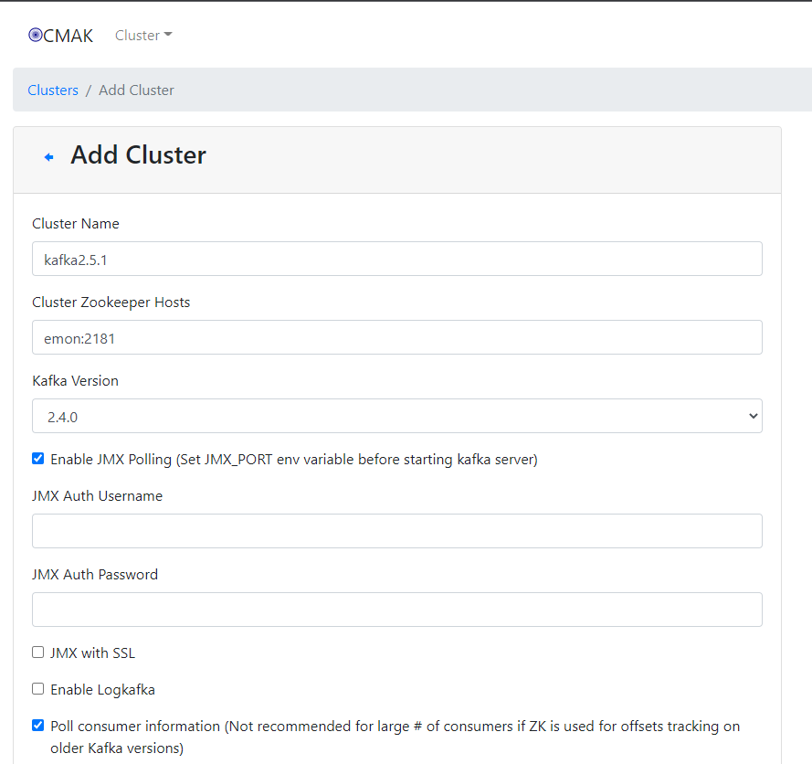

# 五、Kafka技巧篇

## 5.1、Kafka集群参数调优

### 5.1.1、JVM参数调优

默认启动的Broker进程只会使用1G内存，在实际使用中会导致进程频繁GC，影响Kafka集群的性能和稳定性。

通过`jstat -gcutil <pid> 1000`查看到Kafka进程GC的情况，主要看YGC、YGCT、FGC、FGCT这几个参数，如果这几个值不是很大，就没什么问题。

```bash
$ jps
# 命令行输出结果
94074 QuorumPeerMain
97789 Jps
94447 Kafka
$ jstat -gcutil 94447 1000
# 命令行输出结果
  S0     S1     E      O      M     CCS    YGC     YGCT    FGC    FGCT     GCT   
  0.00 100.00  30.58  23.44  92.17  92.87     16    0.359     0    0.000    0.359
  0.00 100.00  30.58  23.44  92.17  92.87     16    0.359     0    0.000    0.359
  0.00 100.00  30.58  23.44  92.17  92.87     16    0.359     0    0.000    0.359
  0.00 100.00  30.58  23.44  92.17  92.87     16    0.359     0    0.000    0.359
```

YGC：young gc发生的次数；

YGCT：young gc消耗的时间；

FGC：full gc发生的次数；

FGCT：full gc消耗的时间。

如果你发现YGC很频繁，或者FGC很频繁，就说明内存分配的少了。此时需要修改`kafka-server-start.sh`中的KAFKA_HEAP_OPTS：

```bash
$ vim /usr/local/kafka/bin/kafka-server-start.sh 
```

```bash
# 在脚本使用KAFKA_HEAP_OPTS之前设置该变量值
export KAFKA_HEAP_OPTS="-Xmx10G -Xms10G -XX:metaspaceSize=96m -XX:+UseG1GC -XX:MaxGCPauseMillis=20 -XX:InitiatingHeapOccupancyPercent=35 -XX:G1HeapRegionSize=16M -XX:MinMetaspaceFreeRatio=50 -XX:MaxMetaspaceFreeRatio=80"
```

这个配置表示给Kafka分配了10G内存，在服务器4核16G内存情况下。

### 5.1.2、Replication参数调优

- replica.socket.timeout.ms=60000

这个参数的默认值是30秒，它是控制partition副本之间socket通信的超时时间，如果设置的太小，有可能会犹豫网络原因导致造成误判，认为某一个partition副本连不上了。

- replica.lag.time.max.ms=50000

如果一个副本在指定的时间内没有向Leader节点发送任何请求，或者在指定的时间内没有同步完Leader中的数据，则Leader会将这个节点从ISR列表中移除。

如果网络不好，或者Kafka压力较大，建议调大该值，否则可能会频繁出现副本丢失，进而导致集群需要频繁复制副本，导致集群压力更大，会陷入一个恶性循环。

### 5.1.3、Log参数调优

这块是针对Kafka中数据文件的删除时机进行设置，不是对Kafka本身的日志参数配置。

- log.retention.hours=24

这个参数默认值为168，单位是小时，就是7天，默认对数据保存7天，可以在这调整数据保存的时间，我们在实际工作中改为了只保存1天，因为Kafka中的数据我们会在hdfs中进行备份，保存一份，所以就没有必要在Kafka中保留太长时间了。

在Kafka中保留只是为了能够让你在指定的时间内恢复数据，或者重新消费数据，如果没有这种需求，那么就没必要设置太长时间。

> 注意：这里分析的Replication的参数和Log参数都是在`server.properties`文件中进行配置。


## 5.2、Kafka Topic命名小技巧

针对Kafka中Topic命名的小技巧。

建议在给topic命名的时候在后面跟上r2p10之类的内容：

r2：表示Partition的弗恩因子是2

p10：表示这个Topic的分区数是10

这样的好处是后期我们如果要写消费者消费指定topic的数据，通过topic的名称我们就知道应该设置多少个消费者消费数据效率最高。

因为一个partition同时只能被一个消费者消费，所以效率最高的情况就是消费者的数据和topic的分区数量保持一致。

在这里通过topic的名称就可以直接看到，一目了然。

但是也有一个缺点，就是后期如果我们动态调整了topic的partition，那么这个topic名称上的partition数量就不准确了，针对这个topic，建议大家一开始的时候就提前预估一下，可以多设置一些partition，我们在工作中的时候针对一些数据量比较大的topic一般会设置4050个partition，数据量少的topic一般设置510个partition，这样后期调整topic partition数量的场景就比较少了。


## 5.3、Kafka集群监控管理工具

- Kafka只能依靠Kafka-run-class.sh等命令来进行管理。
- Kafka Manager是目前比较常见的监控工具。也即是：CMAK。

现在我们操作Kafka都是在命令行界面中通过脚本操作的，后面需要传很多参数，用起来还是比较麻烦的，那么Kafka没有提供web界面的支持吗？

很遗憾的告诉你，Apache官方并没有提供，不过好消息是有一个由雅虎开源的一个工具，目前用起来还不错。

它之前的名字叫KafkaManager，后来改名字了，叫[CMAK](https://github.com/yahoo/CMAK)。

CMAK是目前最受欢迎的Kafka集群管理工具，最早由雅虎开源，用户可以在Web界面上操作Kafka集群，可以轻松检查集群状态（Topic、Consumer、Offset、Brokers、Replica、Partition）。

下载地址：https://github.com/yahoo/CMAK/tags

```bash
$ wget -cP /usr/local/src/ https://github.com/yahoo/CMAK/releases/download/3.0.0.6/cmak-3.0.0.6.zip
```

> 注意：由于cmak-3.0.0.6.zip版本是在java11这个版本下编译的，所以在运行的时候也需要使用java11这个版本，我们目前服务器上使用的是java8这个版本。

我们为什么不使用java11版本呢？因为自2019年1月1日起，java8之后的更新版本在商业用途的时候就需要收费授权了。

在针对cmak-3.0.0.6.zip这个版本，如果我们想要使用的话有两种解决办法：

1：下载cmak的源码，使用jdk8编译

2：额外安装一个java11

如果想要编译的话需要安装sbt这个工具对源码进行编译，sbt是Scala的构建工具，类似于Java中的Maven。由于我们在这个使用不属于商业用途，所以使用java11是没问题的，那就不用重新编译了。

下载JDK11：

下面的下载地址，可以通过ORACLE官网下载页，登录后获取：

官网下载页地址： http://www.oracle.com/technetwork/java/javase/downloads/index.html

```bash
$ wget -cP /usr/local/src/ https://download.oracle.com/otn/java/jdk/11.0.14+8/7e5bbbfffe8b45e59d52a96aacab2f04/jdk-11.0.14_linux-x64_bin.tar.gz?AuthParam=1645937638_93d909234b0b472bdf015454d7da3b2c
```

### 5.3.1、安装JDK11

- 解压安装

```bash
$ tar -zxvf /usr/local/src/jdk-11.0.7_linux-x64_bin.tar.gz -C /usr/local/Java
```

### 5.3.2、安装cmak

- 创建安装目录

```bash
$ mkdir /usr/local/Cmak
```

- 解压

```bash
$ unzip /usr/local/src/cmak-3.0.0.6.zip -d /usr/local/Cmak/
```

- 修改JDK版本

```bash
$ vim /usr/local/Cmak/cmak-3.0.0.6/bin/cmak
```

```bash
# 在die()函数之前添加一行：
JAVA_HOME=/usr/local/Java/jdk-11.0.7/
```

- 修改conf

```bash
$ vim /usr/local/Cmak/cmak-3.0.0.6/conf/application.conf 
```

```bash
# 找到cmak.zkhosts=${?ZK_HOSTS}，在其后追加：
cmak.zkhosts="emon:2181"
```

注意：如果是zk的集群，可以类似`cmak.zkhosts="emon:2181,emon2:2181,emon3:2181"`

同时，**该zookeeper只是被cmak使用的，是否是kafka所使用的zk集群，么得关系**。

- 调整Kafka配合cmak

1： 先停止Kafka集群；

2：在启动脚本之前添加JMX_PORT配置

```bash
$ vim /usr/local/kafka/kafkaStart.sh 
```

```bash
# 启动kafka
JMX_PORT=9988 /usr/local/kafka/bin/kafka-server-start.sh -daemon /usr/local/kafka/config/server.properties
```

3：同步该启动脚本到其他节点

```bash
$ scp -rq /usr/local/kafka/kafkaStart.sh emon@emon2:/usr/local/kafka/
$ scp -rq /usr/local/kafka/kafkaStart.sh emon@emon3:/usr/local/kafka/
```

- 启动cmak的脚本

```bash
# 默认9000端口，可以通过-Dhttp.port调整
$ /usr/local/Cmak/cmak-3.0.0.6/bin/cmak -Dconfig.file=/usr/local/Cmak/cmak-3.0.0.6/conf/application.conf -Dhttp.port=9000
```

- 访问

http://emon:9000/

添加一个Cluster，重点参数配置如下：



点击`Save`后跳转的界面上，点击`Go to cluster view.`查看。


## 5.4、Kafka安全

- Kafka的安全措施
  - Kafka提供了SSL或SASL机制（听说SSL降低Kafka20%的性能）
  - Kafka提供了Broker到ZooKeeper链接的安全机制
  - Kafka支持Client的读写验证

### 5.4.0、keytool和openssl命令

#### 0、前提

说明：默认密码都是123456

#### 1、keytool命令

##### 1.1、keytool子命令列表

```bash
$ keytool -help
```

| 命令            | 描述                              |
| --------------- | --------------------------------- |
| -certreq        | 生成证书请求                      |
| -changealias    | 更改条目的别名                    |
| -delete         | 删除条目                          |
| -exportcert     | 导出证书                          |
| -genkeypair     | 与 `-genkey` 等效，生成密钥对     |
| -genseckey      | 生成密钥                          |
| -gencert        | 根据证书请求生成证书              |
| -importcert     | 与`-import`等效，导入证书或证书链 |
| -importpass     | 导入口令                          |
| -importkeystore | 从其他密钥库导入一个或所有条目    |
| -keypasswd      | 更改条目的密钥口令                |
| -list           | 列出密钥库中的条目                |
| -printcert      | 打印证书内容                      |
| -printcertreq   | 打印证书请求的内容                |
| -printcrl       | 打印 CRL 文件的内容               |
| -storepasswd    | 更改密钥库的存储口令              |

- 命令示例

```bash
```

##### 1.2、`keytool -genkeypair`

说明：生成秘钥对

- 命令帮助

```bash
$ keytool -genkeypair -help
```

```bash
-alias <alias>                  要处理的条目的别名
-keyalg <keyalg>                密钥算法名称
-keysize <keysize>              密钥位大小
-sigalg <sigalg>                签名算法名称
-destalias <destalias>          目标别名
-dname <dname>                  唯一判别名
-startdate <startdate>          证书有效期开始日期/时间
-ext <value>                    X.509 扩展
-validity <valDays>             有效天数（默认90天）
-keypass <arg>                  密钥口令
-keystore <keystore>            密钥库名称
-storepass <arg>                密钥库口令
-storetype <storetype>          密钥库类型
-providername <providername>    提供方名称
-providerclass <providerclass>  提供方类名
-providerarg <arg>              提供方参数
-providerpath <pathlist>        提供方类路径
-v                              详细输出
-protected                      通过受保护的机制的口令
```

- 命令示例

  - 生成密钥库

  ```bash
  $ keytool -genkey -keystore server.keystore.jks -alias emonkafka -validity 3650 -keyalg RSA
  ```

##### 1.3、`keytool -exportcert`

说明：导出证书

- 命令帮助

```bash
$ keytool -exportcert -help
```

```bash
 -rfc                            以 RFC 样式输出
 -alias <alias>                  要处理的条目的别名
 -file <filename>                输出文件名
 -keystore <keystore>            密钥库名称
 -storepass <arg>                密钥库口令
 -storetype <storetype>          密钥库类型
 -providername <providername>    提供方名称
 -providerclass <providerclass>  提供方类名
 -providerarg <arg>              提供方参数
 -providerpath <pathlist>        提供方类路径
 -v                              详细输出
 -protected                      通过受保护的机制的口令
```

- 命令示例

```bash
```

##### 1.4、`keytool -importcert`

说明：导入证书或证书链

- 命令帮助

```bash
$ keytool -importcert -help
```

```bash
 -noprompt                       不提示
 -trustcacerts                   信任来自 cacerts 的证书
 -protected                      通过受保护的机制的口令
 -alias <alias>                  要处理的条目的别名
 -file <filename>                输入文件名
 -keypass <arg>                  密钥口令
 -keystore <keystore>            密钥库名称
 -storepass <arg>                密钥库口令
 -storetype <storetype>          密钥库类型
 -providername <providername>    提供方名称
 -providerclass <providerclass>  提供方类名
 -providerarg <arg>              提供方参数
 -providerpath <pathlist>        提供方类路径
 -v                              详细输出
```

- 命令示例

```bash
```

##### 1.5、`keytool -certreq`

说明：生成证书请求

- 命令帮助

```bash
$ keytool -certreq -help
```

```bash
 -alias <alias>                  要处理的条目的别名
 -sigalg <sigalg>                签名算法名称
 -file <filename>                输出文件名
 -keypass <arg>                  密钥口令
 -keystore <keystore>            密钥库名称
 -dname <dname>                  唯一判别名
 -storepass <arg>                密钥库口令
 -storetype <storetype>          密钥库类型
 -providername <providername>    提供方名称
 -providerclass <providerclass>  提供方类名
 -providerarg <arg>              提供方参数
 -providerpath <pathlist>        提供方类路径
 -v                              详细输出
 -protected                      通过受保护的机制的口令
```

- 命令示例

```bash

```

##### 1.6、`keytool -gencert`

说明：根据证书请求生成证书

- 命令帮助

```bash
$ keytool -gencert help
```

```bash
 -rfc                            以 RFC 样式输出
 -infile <filename>              输入文件名
 -outfile <filename>             输出文件名
 -alias <alias>                  要处理的条目的别名
 -sigalg <sigalg>                签名算法名称
 -dname <dname>                  唯一判别名
 -startdate <startdate>          证书有效期开始日期/时间
 -ext <value>                    X.509 扩展
 -validity <valDays>             有效天数
 -keypass <arg>                  密钥口令
 -keystore <keystore>            密钥库名称
 -storepass <arg>                密钥库口令
 -storetype <storetype>          密钥库类型
 -providername <providername>    提供方名称
 -providerclass <providerclass>  提供方类名
 -providerarg <arg>              提供方参数
 -providerpath <pathlist>        提供方类路径
 -v                              详细输出
 -protected                      通过受保护的机制的口令
```

- 命令示例

```bash
```

##### 1.7、`keytool -list`

说明：列出密钥库中的条目

- 命令帮助

```bash
$ keytool -list -help
```

```bash
 -rfc                            以 RFC 样式输出
 -alias <alias>                  要处理的条目的别名
 -keystore <keystore>            密钥库名称
 -storepass <arg>                密钥库口令
 -storetype <storetype>          密钥库类型
 -providername <providername>    提供方名称
 -providerclass <providerclass>  提供方类名
 -providerarg <arg>              提供方参数
 -providerpath <pathlist>        提供方类路径
 -v                              详细输出
 -protected                      通过受保护的机制的口令
```

- 命令示例

  - 查看密钥库

  ```bash
  $ keytool -list -keystore server.keystore.jks -storepass 123456
  ```

  - 以rfc查看

  ```bash
  $ keytool -list -rfc -keystore server.keystore.jks -storepass 123456
  ```

  - 从密钥库中，解析出公钥

  ```bash
  $ keytool -list -rfc -keystore server.keystore.jks -storepass 123456 | openssl x509 -inform pem -pubkey
  ```

  

  

##### 1.8、`keytool -printcertreq`

说明：打印证书请求的内容

- 命令帮助

```bash
$ keytool -printcertreq -help
```

```bash
 -file <filename>  输入文件名
 -v                详细输出
```

- 命令示例

```bash
```

##### 1.9、`keytool -printcert`

说明：打印证书内容

- 命令帮助

```bash
$ keytool -printcert -help
```

```bash
 -rfc                        以 RFC 样式输出
 -file <filename>            输入文件名
 -sslserver <server[:port]>  SSL 服务器主机和端口
 -jarfile <filename>         已签名的 jar 文件
 -v                          详细输出
```

- 命令示例

```bash
```

#### 2、openssl命令

[OpenSSL命令行咋用？英文版](https://www.madboa.com/geek/openssl/)

https://www.cnblogs.com/yangxiaolan/p/6256838.html

##### 2.1、子命令列表

- 如何进入命令行操作？

```bash
# 进入openssl命令行
$ openssl
# 查看可用命令：虽然提示无效命令，但是能输出可用命令，很好用，推荐！
OpenSSL> help
# 退出 exit / quit
OpenSSL> exit
# 查看版本
OpenSSL> version
OpenSSL 1.0.2k-fips  26 Jan 2017
```

- 子命令列表

```bash
Standard commands
asn1parse         ca                ciphers           cms               
crl               crl2pkcs7         dgst              dh                
dhparam           dsa               dsaparam          ec                
ecparam           enc               engine            errstr            
gendh             gendsa            genpkey           genrsa            
nseq              ocsp              passwd            pkcs12            
pkcs7             pkcs8             pkey              pkeyparam         
pkeyutl           prime             rand              req               
rsa               rsautl            s_client          s_server          
s_time            sess_id           smime             speed             
spkac             ts                verify            version           
x509              

Message Digest commands (see the `dgst' command for more details)
md2               md4               md5               rmd160            
sha               sha1              

Cipher commands (see the `enc' command for more details)
aes-128-cbc       aes-128-ecb       aes-192-cbc       aes-192-ecb       
aes-256-cbc       aes-256-ecb       base64            bf                
bf-cbc            bf-cfb            bf-ecb            bf-ofb            
camellia-128-cbc  camellia-128-ecb  camellia-192-cbc  camellia-192-ecb  
camellia-256-cbc  camellia-256-ecb  cast              cast-cbc          
cast5-cbc         cast5-cfb         cast5-ecb         cast5-ofb         
des               des-cbc           des-cfb           des-ecb           
des-ede           des-ede-cbc       des-ede-cfb       des-ede-ofb       
des-ede3          des-ede3-cbc      des-ede3-cfb      des-ede3-ofb      
des-ofb           des3              desx              idea              
idea-cbc          idea-cfb          idea-ecb          idea-ofb          
rc2               rc2-40-cbc        rc2-64-cbc        rc2-cbc           
rc2-cfb           rc2-ecb           rc2-ofb           rc4               
rc4-40            rc5               rc5-cbc           rc5-cfb           
rc5-ecb           rc5-ofb           seed              seed-cbc          
seed-cfb          seed-ecb          seed-ofb          zlib 
```

##### 2.2、基本命令

- 查看版本基本信息

```bash
$ openssl version
```

- 查看版本详细信息

```bash
$ openssl version -a
```

- 查看可用命令

```bash
# 因为是通过无效命令查询可用命令，所以 help / -help / -h 等等任何一个不可用的命令，都是可以的
$ openssl help
```

- 列出所有可用的ciphers

```bash
$ openssl ciphers -v
```

- 列出TLSv1 ciphers

```bash
$ openssl ciphers -v -tls1
```

- 列出high encryption ciphers（keys larger than 128 bits）

```bash
$ openssl ciphers -v 'HIGH'
```

- 列出high encryption ciphers using the AES algorithm

```bash
$ openssl ciphers -v 'HIGH+AES'
```

##### 2.3、`openssl speed`

说明：测试各种加密算法的性能

- 命令帮助

```bash
$ openssl speed help
```

```bash
Available values:
md2      md4      md5      hmac     sha1     sha256   sha512   whirlpoolrmd160
idea-cbc seed-cbc rc2-cbc  rc5-cbc  bf-cbc
des-cbc  des-ede3 aes-128-cbc aes-192-cbc aes-256-cbc aes-128-ige aes-192-ige aes-256-ige 
camellia-128-cbc camellia-192-cbc camellia-256-cbc rc4
rsa512   rsa1024  rsa2048  rsa4096
dsa512   dsa1024  dsa2048
ecdsap256 ecdsap384 ecdsap521
ecdsa
ecdhp256  ecdhp384  ecdhp521
ecdh
idea     seed     rc2      des      aes      camellia rsa      blowfish

Available options:
-elapsed        measure time in real time instead of CPU user time.
-engine e       use engine e, possibly a hardware device.
-evp e          use EVP e.
-decrypt        time decryption instead of encryption (only EVP).
-mr             produce machine readable output.
-multi n        run n benchmarks in parallel.
```

- 命令示例

  - 测试所有加密算法的性能

  ```bash
  $ openssl speed
  ```

  - 测试rsa

  ```bash
  $ openssl speed rsa
  ```

  - 测试rsa1024

  ```bash
  $ openssl speed rsa1024
  ```

  - 并行运行5个基准测试

  ```bash
  $ openssl speed rsa1024 -multi 5
  ```

##### 2.4、`openssl req`

说明：生成证书请求文件、查看验证证书请求文件、生成自签名证书

证书请求需要什么？

申请者需要将自己的信息及其公钥放入证书请求中。但在实际操作过程中，所需要提供的是私钥而非公钥。因为私钥可以提取出公钥。另外，还需要将提供的数据进行数字签名（使用单向加密），保证该证书请求文件的完整性和一致性，防止他人盗取后进行篡改。

- 命令帮助

```bash
req [options] <infile >outfile
where options  are
 -inform arg    input format - DER or PEM
 				输入格式：DER或PEM
 -outform arg   output format - DER or PEM
 				输出格式：DER或PEM
 -in arg        input file
 -out arg       output file
				证书请求或者自签署证书的输出文件，也可以是其他内容的输出文件，不指定时默认stdout
 -text          text form of request
 				以文本格式打印证书请求
 -pubkey        output public key
 				输出证书请求文件中的公钥
 -noout         do not output REQ
 				不输出部分信息
 -verify        verify signature on REQ
 -modulus       RSA modulus
 -nodes         don't encrypt the output key
 				如果指定`-newkey`自动生成密钥，那么`-nodes`选项说明生成的密钥不需要加密，即不需要输入passphase
 -engine e      use engine e, possibly a hardware device
 -subject       output the request's subject
 				输出证书请求文件中的subject（如果指定了x509，则打印证书中的subject）
 -passin        private key password source
 				传递解密密码
 -key file      use the private key contained in file
 				仅与`-new`配合，指定私钥的输入文件，创建证书时需要
 -keyform arg   key file format
 -keyout arg    file to send the key to
 				指定自动创建私钥时私钥的存储位置，若未指定，则使用配置文件中default_keyfile指定的值，默认该值为privkey.pem。
 -rand file:file:...
                load the file (or the files in the directory) into
                the random number generator
 -newkey rsa:bits generate a new RSA key of 'bits' in size
 -newkey dsa:file generate a new DSA key, parameters taken from CA in 'file'
 -newkey ec:file generate a new EC key, parameters taken from CA in 'file'
 				`-newkey`与`-key`互斥，`-newkey`是指在生成证书请求或者自签名证书的时候，自动生成密钥，然后生成的密钥文件名称由`-keyout`参数指定。当指定`-newkey`选项时，后面指定 rsa:bits 说明产生rsa密钥，位数由bits指定。如果没有指定选项`-key`和`-newkey`，默认自动生成密钥。
 -[digest]      Digest to sign with (see openssl dgst -h for list)
 				指定对创建请求时提供的申请者信息进行数字签名时的单向加密算法，如-md5/-sha1/-sha512等，若未指定则默认使用配置文件中default_md指定的值 -verify ：对证书请求文件进行数字签名验证
 -config file   request template file.
 				默认参数在ununtu上未/etc/ssl/openssl.cnf，可以使用-config指定特殊路径的配置文件
 -subj arg      set or modify request subject
 -multivalue-rdn enable support for multivalued RDNs
 -new           new request.
 				生成证书请求文件，会交互式提醒输入一些信息，这些交互选项以及交互选项信息的长度值，以及其他一些扩展属性在配置文件（默认为 openssl.cnf，还有些辅助配置文件）中指定了默认值。如果没有指定`-key`选项，则会自动生成一个RSA私钥，该私钥的生成位置也在openssl.cnf中指定了。
 -batch         do not ask anything during request generation
 				指定非交互模式，直接读取config文件的配置参数，或者使用默认参数值
 -x509          output a x509 structure instead of a cert. req.
 				生成自签名证书：输出x509结构，而不是cert.req
 -days          number of days a certificate generated by -x509 is valid for.
 				`默认30天`
 -set_serial    serial number to use for a certificate generated by -x509.
 -newhdr        output "NEW" in the header lines
 -asn1-kludge   Output the 'request' in a format that is wrong but some CA's
                have been reported as requiring
 -extensions .. specify certificate extension section (override value in config file)
 -reqexts ..    specify request extension section (override value in config file)
 -utf8          input characters are UTF8 (default ASCII)
 -nameopt arg    - various certificate name options
 -reqopt arg    - various request text options
```

- 命令示例

  - 生成CA自签名证书，证书名：`ca-cert`，密钥文件名称：`ca-key`【推荐】

  ```bash
  $ openssl req -new -x509 -keyout ca-key -out ca-cert -days 3650
  ```

  - 生成自签名证书，证书名：`ca-cert`，采用自动生成密钥的方式，指定密钥长度为1024且加密，密钥文件名称：`ca-key`

  ```bash
  $ openssl req -new -x509 -newkey rsa:1024 -keyout ca-key -out ca-cert -days 3650
  ```

  - 生成自签名证书，证书名：`ca-cert`，指定密钥文件，密钥文件为`rsa_private_key.pem`。

  ```bash
  # 生成rsa私钥
  $ openssl genrsa -out rsa_private_key.pem 1024
  $ openssl req -new -x509 -key  ./rsa_private_key.pem  -out ca-cert -nodes -batch
  ```

  - 生成证书请求文件，文件名：`req.csr`，指定密钥文件，秘钥文件为：`rsa_private_key.pem`

  ```bash
  $ openssl req -new -key  ./rsa_private_key.pem  -out req.csr
  ```

  - 使用req命令，以文本方式查看刚生成的证书请求文件

  ```bash
  $ openssl req -in req.csr -text
  ```

  - 查看证书请求文件的公钥，这个公钥就是从`rsa_private_key.pem`私钥文件导出的公钥

  ```bash
  $ openssl req -in req.csr -noout -pubkey
  ```

##### 2.5、`openssl x509`

说明：

- 命令帮助

```bash
$ openssl x509 help
```

```bash
usage: x509 args
 -inform arg     - input format - default PEM (one of DER, NET or PEM)
 				证书的输入格式，如果存在其他选项（例如-req），则可能会更改。DER格式是证书的DER编码，PEM是DER编码的base64编码，添加了页眉和页脚。默认格式：PEM。
 -outform arg    - output format - default PEM (one of DER, NET or PEM)
 				证书的输出格式
 -keyform arg    - private key format - default PEM
 -CAform arg     - CA format - default PEM
 -CAkeyform arg  - CA key format - default PEM
 -in arg         - input file - default stdin
 -out arg        - output file - default stdout
 -passin arg     - private key password source
 -serial         - print serial number value
 -subject_hash   - print subject hash value
 -subject_hash_old   - print old-style (MD5) subject hash value
 -issuer_hash    - print issuer hash value
 -issuer_hash_old    - print old-style (MD5) issuer hash value
 -hash           - synonym for -subject_hash
 -subject        - print subject DN
 -issuer         - print issuer DN
 -email          - print email address(es)
 -startdate      - notBefore field
 -enddate        - notAfter field
 -purpose        - print out certificate purposes
 -dates          - both Before and After dates
 -modulus        - print the RSA key modulus
 -pubkey         - output the public key
 -fingerprint    - print the certificate fingerprint
 -alias          - output certificate alias
 -noout          - no certificate output
 -ocspid         - print OCSP hash values for the subject name and public key
 -ocsp_uri       - print OCSP Responder URL(s)
 -trustout       - output a "trusted" certificate
 -clrtrust       - clear all trusted purposes
 -clrreject      - clear all rejected purposes
 -addtrust arg   - trust certificate for a given purpose
 -addreject arg  - reject certificate for a given purpose
 -setalias arg   - set certificate alias
 -days arg       - How long till expiry of a signed certificate - def 30 days
 -checkend arg   - check whether the cert expires in the next arg seconds
                   exit 1 if so, 0 if not
 -signkey arg    - self sign cert with arg
 -x509toreq      - output a certification request object
 -req            - input is a certificate request, sign and output.
 				输入一个证书请求文件，然后签名并输出
 -CA arg         - set the CA certificate, must be PEM format.
 -CAkey arg      - set the CA key, must be PEM format
                   missing, it is assumed to be in the CA file.
 -CAcreateserial - create serial number file if it does not exist
 -CAserial arg   - serial file
 -set_serial     - serial number to use
 -text           - print the certificate in text form
 -C              - print out C code forms
 -<dgst>         - digest to use, see openssl dgst -h output for list
 -extfile        - configuration file with X509V3 extensions to add
 -extensions     - section from config file with X509V3 extensions to add
 -clrext         - delete extensions before signing and input certificate
 -nameopt arg    - various certificate name options
 -engine e       - use engine e, possibly a hardware device.
 -certopt arg    - various certificate text options
 -checkhost host - check certificate matches "host"
 -checkemail email - check certificate matches "email"
 -checkip ipaddr - check certificate matches "ipaddr"
```

- 命令示例

  - 使用自签名证书签名

  ```bash
  $ openssl x509 -req -CA ca-cert -CAkey ca-key -in cert-file -out cert-signed -days 3650 -CAcreateserial -passin pass:123456
  ```

##### 2.6、`openssl genrsa`

说明：用于生成RSA私钥，不会生成公钥，因为公钥提取自私钥。

- 命令帮助

```bash
$ openssl genrsa help
```

```bash
usage: genrsa [args] [numbits]
 -des            encrypt the generated key with DES in cbc mode
 -des3           encrypt the generated key with DES in ede cbc mode (168 bit key)
 -idea           encrypt the generated key with IDEA in cbc mode
 				以上三者（-des/-des3/-idea）指定加密私钥文件用的算法，这样每次使用私钥文件都将输入密码，太麻烦所以很少使用。
 -seed
                 encrypt PEM output with cbc seed
 -aes128, -aes192, -aes256
                 encrypt PEM output with cbc aes
 -camellia128, -camellia192, -camellia256
                 encrypt PEM output with cbc camellia
 -out file       output the key to 'file
 				将生成的私钥保存至指定文件，若未指定输出文件则为标准输出。
 -passout arg    output file pass phrase source
 				加密私钥文件时，传递密码。如果不给定密码格式，将提示从终端输入。
 				格式一：pass:password		表示传递的明文密码
 				格式二：env:var				从环境变量var获取密码值
 				格式三：file:filename		从filename文件第一行获取密码（若-passin和-passout都指定了filename，这第一行为-passin的值，第二行为-passout的值）
 				格式四：stdin				从标准输入中获取要传递的密码
 -f4             use F4 (0x10001) for the E value
 -3              use 3 for the E value
 -engine e       use engine e, possibly a hardware device.
 -rand file:file:...
                 load the file (or the files in the directory) into
                 the random number generator
```

注意：numbits 表示私钥长度，默认1024，必须为最后一个参数

- 命令示例

  - 生成1024位RSA私钥【推荐】

  ```bash
  $ openssl genrsa -out rsa_private_key.pem 1024
  ```

  - 生成1024位RSA私钥，使用-des3算法加密私钥文件

  ```bash
  $ openssl genrsa -out rsa_private_key.pem -des3 -passout pass:123456 1024
  ```

  

##### 2.7、`openssl rsa`

说明：查看或生成RSA公钥。

- 命令帮助

```bash
$ openssl rsa help
```

```bash
rsa [options] <infile >outfile
where options are
 -inform arg     input format - one of DER NET PEM
 -outform arg    output format - one of DER NET PEM
 -in arg         input file
 -sgckey         Use IIS SGC key format
 -passin arg     input file pass phrase source
 -out arg        output file
 -passout arg    output file pass phrase source
 -des            encrypt PEM output with cbc des
 -des3           encrypt PEM output with ede cbc des using 168 bit key
 -idea           encrypt PEM output with cbc idea
 -seed           encrypt PEM output with cbc seed
 -aes128, -aes192, -aes256
                 encrypt PEM output with cbc aes
 -camellia128, -camellia192, -camellia256
                 encrypt PEM output with cbc camellia
 -text           print the key in text
 -noout          don't print key out
 -modulus        print the RSA key modulus
 -check          verify key consistency
 -pubin          expect a public key in input file
 -pubout         output a public key
 -engine e       use engine e, possibly a hardware device.
```

- 命令示例

  - 提取公钥【推荐】

  ```bash
  $ openssl rsa -in rsa_private_key.pem -pubout -out rsa_public_key.pem
  ```


##### 2.8、`openssl rsautl`

说明：加密解密

- 命令帮助

```bash
$ openssl rsautl help
```

```bash
Usage: rsautl [options]
-in file        input file
-out file       output file
-inkey file     input key
-keyform arg    private key format - default PEM
-pubin          input is an RSA public
-certin         input is a certificate carrying an RSA public key
-ssl            use SSL v2 padding
-raw            use no padding
-pkcs           use PKCS#1 v1.5 padding (default)
-oaep           use PKCS#1 OAEP
-sign           sign with private key
-verify         verify with public key
-encrypt        encrypt with public key
-decrypt        decrypt with private key
-hexdump        hex dump output
-engine e       use engine e, possibly a hardware device.
-passin arg    pass phrase source
```

- 命令示例

  - 公钥加密

  ```bash
  $ echo "hello openssl" > hello.txt
  $ openssl rsautl -encrypt -in hello.txt -inkey rsa_public_key.pem -pubin -out hello.en
  ```

  - 私钥解密

  ```bash
  $ openssl rsautl -decrypt -in hello.en -inkey rsa_private_key.pem -out hello.de
  ```


##### 2.9、`openssl pkcs8`

说明：pkcs8格式的私钥转换工具

- 命令帮助

```bash
$ openssl pkcs8 help
```

```bash
Usage pkcs8 [options]
where options are
-in file        input file
				输入的密钥文件，默认为标准输入。如果密钥被加密，会提示输入一个密钥口令。
-inform X       input format (DER or PEM)
				输入文件格式：DER或者PEM。DER格式采用ASN1的DER标准格式。一般用的多的都是PEM格式，就是base64编码格式。
-passin arg     input file pass phrase source
				输入文件口令保护来源。
-outform X      output format (DER or PEM)
				输出文件格式：DER或者PEM格式。
-out file       output file
				输出文件，默认为标准输出。如果任何加密操作已经执行，会提示输入一个密钥值。输出的文件名字不能和输入的文件名字一样。
-passout arg    output file pass phrase source
				输出文件口令保护来源。
-topk8          output PKCS8 file
				通常的是输入一个pkcs8文件和传统的格式私钥文件将会被写出。设置了此选项后，位置转换过来：输入一个传统格式的私钥文件，输出一个PKCS#8格式的文件。
-nooct          use (nonstandard) no octet format
				RSA私钥文件是一个坏的格式，一些软件将会使用。特别的是，私钥文件必须附上一个八位组字符串，但是一些软件仅仅包含本身的结构体没有使八位组字符串所环绕。不采用八位组表示私钥。
-embed          use (nonstandard) embedded DSA parameters format
				这个选项产生的RSA私钥文件是一个坏的格式。在私钥结构体中采用嵌入式DSA参数格式。在这个表单中，八位组字符串包含了ASN1 SEQUENCE中的两种结构：一个SEQUENCE包含了密钥参数，一个ASN1 INTEGER包含私钥值。
-nsdb           use (nonstandard) DSA Netscape DB format
				这个选项产生的RSA私钥文件是一个坏的格式并兼容了Netscape私钥文件数据库。采用 Netscape DB的DSA格式
-noiter         use 1 as iteration count
				MAC保护计算次数为1
-nocrypt        use or expect unencrypted private key
				`PKCS#8密钥产生或者输入一般用一个适当地密钥来加密PKCS#8 EncryptedPrivateKeyInfo结构`。设置了此选项后，一个不加密的PrivateKeyInfo结构将会被输出。这个选项一直不加密私钥文件，在绝对必要的时候才能够使用。某些软件例如一些Java代码签名软件使用不加密的私钥文件。
-v2 alg         use PKCS#5 v2.0 and cipher "alg"
-v1 obj         use PKCS#5 v1.5 and cipher "alg"
 -engine e       use engine e, possibly a hardware device.
```

- 命令示例

  - 转换一个普通私钥文件到不加密的pkcs8私钥文件【推荐】

  ```bash
  $ openssl pkcs8 -topk8 -inform PEM -in rsa_private_key.pem -outform PEM -out pkcs8_rsa_private_key.pem -nocrypt
  ```

  

  

##### 2.99、常规应用

- 生成私钥、公钥

```bash
# openssl_private_public.sh
openssl genrsa -out rsa_private_key.pem 2048
openssl rsa -in rsa_private_key.pem -pubout -out rsa_public_key.pem
openssl pkcs8 -topk8 -inform PEM -in rsa_private_key.pem -outform PEM -out pkcs8_rsa_private_key.pem -nocrypt
```

- 生成CA自签名证书

```bash
$ openssl req -new -x509 -keyout ca-key -out ca-cert -days 3650
```

- 签名

```bash
$ openssl x509 -req -CA ca-cert -CAkey ca-key -in cert-file -out cert-signed -days 3650 -CAcreateserial -passin pass:123456
```

- 从密钥库中解析出公钥

```bash
$ keytool -list -rfc -keystore server.keystore.jks -storepass 123456 | openssl x509 -inform pem -pubkey
```

### 5.4.1、SSL（简单版）

#### 1、切换到证书存储目录

```bash
$ mkdir /usr/local/kafka/ssl && cd /usr/local/kafka/ssl
```

#### 2、生成秘钥证书

##### 2.1、生成服务端密钥库文件

```bash
$ keytool -genkey -keystore server.keystore.jks -alias server -validity 3650 -keyalg RSA
```

> 【命令执行概述】
>
> ```bash
>输入密钥库口令: 123456
> 再次输入新口令: 123456
> 您的名字与姓氏是什么?
> [Unknown]: [忽略]
> 您的组织单位名称是什么?
>[Unknown]: [忽略]
> 您的组织名称是什么?
>  [Unknown]: [忽略]
> 您所在的城市或区域名称是什么?
>   [Unknown]: [忽略]
> 您所在的省/市/自治区名称是什么?
>   [Unknown]: [忽略]
>   该单位的双字母国家/地区代码是什么?
>   [Unknown]: [忽略]
>   CN=Unknown, OU=Unknown, O=Unknown, L=Unknown, ST=Unknown, C=Unknown是否正确?
>   [否]:  y
>   
>   输入 <emonkafka> 的密钥口令
>   	(如果和密钥库口令相同, 按回车): [回车]
>   ```
>   
> 【命令执行输出】
>   
> -rw-r--r-- 1 root root 1985 12月  4 21:52 server.keystore.jks
>   
> 【验证证书】
> 
> ```bash
> $ keytool -list -v -keystore server.keystore.jks
>```

##### 2.2、创建CA自签名证书并添加到信任库

- 创建CA自签名证书

```bash
$ openssl req -new -x509 -keyout ca-key -out ca-cert -days 3650
```

> 【命令执行概述】
>
> ```bash
> Generating a 2048 bit RSA private key
> .+++
> ....................................................+++
> writing new private key to 'ca-key'
> Enter PEM pass phrase: 123456
> Verifying - Enter PEM pass phrase: 132456
> -----
> You are about to be asked to enter information that will be incorporated
> into your certificate request.
> What you are about to enter is what is called a Distinguished Name or a DN.
> There are quite a few fields but you can leave some blank
> For some fields there will be a default value,
> If you enter '.', the field will be left blank.
> -----
> Country Name (2 letter code) [XX]: [忽略]
> State or Province Name (full name) []: [忽略]
> Locality Name (eg, city) [Default City]: [忽略]
> Organization Name (eg, company) [Default Company Ltd]: [忽略]
> Organizational Unit Name (eg, section) []: [忽略]
> Common Name (eg, your name or your server's hostname) []: [忽略]
> Email Address []: [忽略]
> ```
>
> 【命令执行输出】
>
> -rw-r--r-- 1 root root 1834 12月  4 21:53 ca-key
> -rw-r--r-- 1 root root 1220 12月  4 21:53 ca-cert

- 将CA自签名证书添加到客户信任库（truststore）

```bash
$ keytool -import -keystore server.truststore.jks -alias CARoot -file ca-cert
# 命令行输出：为broker提供信任库以及所有客户端签名了密钥的CA证书
-rw-r--r-- 1 root root  922 12月  4 21:55 server.truststore.jks

$ keytool -import -keystore client.truststore.jks -alias CARoot -file ca-cert
# 命令行输出：【重要】客户端通过SSL访问Kafka服务时，需要使用
-rw-r--r-- 1 root root  922 12月  4 21:55 client.truststore.jks
```

##### 2.3、生成服务端证书请求文件，并用CA签名

- 生成服务端证书请求文件

```bash
$ keytool -certreq -keystore server.keystore.jks -alias server -file server.csr
```

> 【命令执行输出】
>
> -rw-r--r-- 1 root root 1579 12月  4 21:56 server.csr

- 用CA自签名证书来签名证书请求文件

```bash
$ openssl x509 -req -CA ca-cert -CAkey ca-key -in server.csr -out server.crt -days 3650 -CAcreateserial -passin pass:123456
```

> 【命令执行概述】
>
> ```bash
> Signature ok
> subject=/C=cn/ST=zhejiangsheng/L=hangzhou/O=emon/OU=emon/CN=ml
> Getting CA Private Key
> ```
>
> 【命令执行输出】
>
> -rw-r--r-- 1 root root   17 12月  4 21:56 ca-cert.srl
> -rw-r--r-- 1 root root 1895 12月  4 21:56 server.crt

##### 2.4、导入CA和已签名的证书到密钥仓库

```bash
$ keytool -import -keystore server.keystore.jks -alias CARoot -file ca-cert
$ keytool -import -keystore server.keystore.jks -alias server -file server.crt
```

> 【命令执行输出】执行上述命令，会变更如下的文件
>
> -rw-r--r-- 1 root root 3864 12月  4 21:57 server.keystore.jks

#### 3、broker配置

**内网使用9092端口明文，外网使用8989端口SSL**

- 配置

```bash
$ vim /usr/local/kafka/config/server.properties 
```

```bash
# [修改]
listeners=PLAINTEXT://emon:9092,SSL://emon:8989
# [修改]
advertised.listeners=PLAINTEXT://emon:9092,SSL://emon:8989
# [新增]在advertised.listeners后面追加ssl配置
ssl.keystore.location=/usr/local/kafka/ssl/server.keystore.jks
ssl.keystore.password=123456
ssl.key.password=123456
ssl.truststore.location=/usr/local/kafka/ssl/server.truststore.jks
ssl.truststore.password=123456
# 设置空可以使得证书的主机名与kafka的主机名不用保持一致
ssl.endpoint.identification.algorithm=
# [修改]
log.dirs=/tmp/kafka-logs => log.dirs=/usr/local/kafka/logs
# [修改]
zookeeper.connect=localhost:2181=>zookeeper.connect=emon:2181
```

- 启动

- 测试

```bash
# 测试SSL是否成功
$ openssl s_client -debug -connect emon:8989 -tls1
```

#### 4、客户端配置

- 将上面生成的客户信任库client.truststore.jks复制到到java项目`根目录`中，以便client可以信任这个CA

- 代码参考

```java
@Test
public void testAsyncSendWithSSL() throws Exception {
    Properties properties = new Properties();
    properties.setProperty(ProducerConfig.BOOTSTRAP_SERVERS_CONFIG, "emon:8989");
    properties.setProperty(ProducerConfig.ACKS_CONFIG, "all");
    properties.setProperty(ProducerConfig.RETRIES_CONFIG, "0");
    properties.setProperty(ProducerConfig.BATCH_SIZE_CONFIG, "16348");
    properties.setProperty(ProducerConfig.LINGER_MS_CONFIG, "1");
    properties.setProperty(ProducerConfig.BUFFER_MEMORY_CONFIG, "33554432");
    properties.setProperty(ProducerConfig.KEY_SERIALIZER_CLASS_CONFIG,
                           "org.apache.kafka.common.serialization.StringSerializer");
    properties.setProperty(ProducerConfig.VALUE_SERIALIZER_CLASS_CONFIG,
                           "org.apache.kafka.common.serialization.StringSerializer");

    properties.setProperty(CommonClientConfigs.SECURITY_PROTOCOL_CONFIG, "SSL");
    properties.setProperty(SslConfigs.SSL_TRUSTSTORE_LOCATION_CONFIG, "client.truststore.jks");
    properties.setProperty(SslConfigs.SSL_TRUSTSTORE_PASSWORD_CONFIG, "123456");
    properties.setProperty(SslConfigs.SSL_ENDPOINT_IDENTIFICATION_ALGORITHM_CONFIG, "");

    // Producer的主对象
    KafkaProducer<String, String> kafkaProducer = new KafkaProducer<>(properties);

    // 消息对象 - ProducerRecord
    for (int i = 0; i < 10; i++) {
        String key = "key-" + i;
        String value = "value-" + i;
        ProducerRecord<String, String> record = new ProducerRecord<>(TOPIC_NAME, key, value);
        kafkaProducer.send(record);
    }

    // 所有的通道打开都需要关闭
    kafkaProducer.close();
}
```

### 5.4.2、SSL（含客户端证书版）

#### 1、准备

##### 1.1、密码配置

- CA证书密码

```bash
CA_PWD=123456
```

- 服务端证书密码

```bash
SERVER_PWD=567890
```

- 客户端证书密码

```bash
CLIENT_PWD=123890
```


##### 1.2、切换到证书存储目录

```bash
$ mkdir /usr/local/kafka/ssl && cd /usr/local/kafka/ssl
```


#### 2、自签名CA证书

##### 2.1、生成CA证书密钥库文件

```bash
$ keytool -genkeypair -keystore ca.keystore.jks -storepass ${CA_PWD} -alias ca -keypass ${CA_PWD} -validity 3650 -keyalg RSA -dname CN=ca,C=cn -ext bc:c
```

> 【输出】
>
> -rw-r--r-- 1 root root 2091 12月  8 08:50 ca.keystore.jks

##### 2.2、导出条目为自签名证书

```bash
$ keytool -exportcert -keystore ca.keystore.jks -storepass ${CA_PWD} -alias ca -rfc -file ca.cer
```

> 【输出】
>
> -rw-r--r-- 1 root root 1077 12月  8 08:50 ca.cer

##### 2.3、查看自签名证书

```bash
# 查看密钥库
$ keytool -list -keystore ca.keystore.jks -storepass ${CA_PWD}
 
# 打印证书
$ keytool -printcert -file ca.cer
```

#### 3、服务器证书

##### 3.1、生成服务端密钥库文件

```bash
$ keytool -genkeypair -keystore server.keystore.jks -storepass ${SERVER_PWD} -alias server -keypass ${SERVER_PWD} -validity 365 -keyalg RSA -dname CN=127.0.0.1,C=cn
```

> 【输出】
>
> -rw-r--r-- 1 root root 2092 12月  8 08:53 server.keystore.jks

##### 3.2、生成服务端证书请求文件

```bash
$ keytool -certreq -keystore server.keystore.jks -storepass ${SERVER_PWD} -alias server -keypass ${SERVER_PWD} -file server.csr
```

>【输出】
>
>-rw-r--r-- 1 root root  993 12月  8 08:53 server.csr


##### 3.3、CA签名服务端证书请求文件

```bash
$ keytool -gencert -keystore ca.keystore.jks -storepass ${CA_PWD} -alias ca -keypass ${CA_PWD} -validity 365 -infile server.csr -outfile server.crt
```

>【输出】
>
>-rw-r--r-- 1 root root  767 12月  8 08:59 server.crt


##### 3.4、查看服务端证书

```bash
# 查看证书请求文件
$ keytool -printcertreq -v -file server.csr
# 查看证书
$ keytool -printcert -v -file server.crt
# 查看密钥库
$ keytool -list -keystore server.keystore.jks -storepass ${SERVER_PWD}
```


##### 3.5、导入CA证书，生成服务端truststore

```bash
$ keytool -importcert -keystore server.truststore.jks -storepass ${SERVER_PWD} -alias ca -keypass ${CA_PWD} -file ca.cer
```

> 【输出】
>
> -rw-r--r-- 1 root root  803 12月  8 09:01 server.truststore.jks


##### 3.6、导入CA证书，添加到服务端密钥库

```bash
$ keytool -importcert -keystore server.keystore.jks -storepass ${SERVER_PWD} -alias ca -keypass ${CA_PWD} -file ca.cer
```

> 【输出】更改了server.keystore.jks
>
> -rw-r--r-- 1 root root 2863 12月  8 09:02 server.keystore.jks


##### 3.7、导入服务端证书，添加到服务器密钥库

```bash
$ keytool -importcert -keystore server.keystore.jks -storepass ${SERVER_PWD} -alias server -keypass ${SERVER_PWD} -file server.crt
```

> 【输出】更改了server.keystore.jks
>
> -rw-r--r-- 1 root root 2863 12月  8 09:02 server.keystore.jks

#### 4、客户端证书

##### 4.1、生成客户端密钥库文件

```bash
$ keytool -genkeypair -keystore client1.keystore.jks -storepass ${CLIENT_PWD} -alias client1 -keypass ${CLIENT_PWD} -validity 365 -keyalg RSA -dname CN=client1,C=cn
```

> 【输出】
>
> -rw-r--r-- 1 root root 2091 12月  8 09:04 client1.keystore.jks

##### 4.2、生成客户端证书请求文件

```bash
$ keytool -certreq -keystore client1.keystore.jks -storepass ${CLIENT_PWD} -alias client1 -keypass ${CLIENT_PWD} -file client1.csr
```

> -rw-r--r-- 1 root root  993 12月  8 09:04 client1.csr

##### 4.3、CA签名客户端证书请求文件

```bash
$ keytool -gencert -keystore ca.keystore.jks -storepass ${CA_PWD} -alias ca -keypass ${CA_PWD} -validity 365 -infile client1.csr -outfile client1.crt
```

> -rw-r--r-- 1 root root  765 12月  8 09:05 client1.crt

##### 4.4、查看客户端证书

```bash
# 查看证书请求文件
$ keytool -printcertreq -v -file client1.csr
# 查看证书
$ keytool -printcert -v -file client1.crt
# 查看密钥库
$ keytool -list -keystore client1.keystore.jks -storepass ${CLIENT_PWD}
```

##### 4.5、导入CA证书，生成客户端truststore

```bash
$ keytool -importcert -keystore client1.truststore.jks -storepass ${CLIENT_PWD} -alias ca -keypass ${CA_PWD} -file ca.cer
```

> 【输出】
>
> -rw-r--r-- 1 root root  803 12月  8 09:06 client1.truststore.jks

##### 4.6、导入CA证书，添加到客户端密钥库

```bash
$ keytool -importcert -keystore client1.keystore.jks -storepass ${CLIENT_PWD} -alias ca -keypass ${CA_PWD} -file ca.cer
```

> 【输出】更改了client1.keystore.jks
>
> -rw-r--r-- 1 root root 2862 12月  8 09:07 client1.keystore.jks

##### 4.7、导入客户端证书，到客户端密钥库

```bash
$ keytool -importcert -keystore client1.keystore.jks -storepass ${CLIENT_PWD} -alias client1 -keypass ${CLIENT_PWD} -file client1.crt
```

> 【输出】更改了client1.keystore.jks
>
> -rw-r--r-- 1 root root 3645 12月  8 09:08 client1.keystore.jks

#### 5、broker配置

**内网使用9092端口明文，外网使用8989端口SSL**

```bash
# [修改]
listeners=PLAINTEXT://emon:9092,SSL://emon:8989
# [修改]
advertised.listeners=PLAINTEXT://emon:9092,SSL://emon:8989
# [新增]在advertised.listeners后面追加ssl配置
ssl.keystore.location=/usr/local/kafka/ssl/server.keystore.jks
ssl.keystore.password=${SERVER_PWD}
ssl.key.password=${SERVER_PWD}
ssl.truststore.location=/usr/local/kafka/ssl/server.truststore.jks
ssl.truststore.password=${SERVER_PWD}
# 如果配置了该项，客户端必须要有客户端证书[ssl.keystore.location,ssl.keystore.password,ssl.key.password]
ssl.client.auth=required
# 设置空可以使得证书的主机名与kafka的主机名不用保持一致
ssl.endpoint.identification.algorithm=
# [修改]
log.dirs=/tmp/kafka-logs => log.dirs=/usr/local/kafka/logs
# [修改]
zookeeper.connect=localhost:2181=>zookeeper.connect=emon:2181
```

#### 6、客户端配置

- 将上面生成的客户信任库client.truststore.jks复制到到java项目`根目录`中，以便client可以信任这个CA

- 代码参考

```java
@Order(6)
@Test
public void testAsyncSendWithSSL() throws Exception {
    Properties properties = new Properties();
    properties.setProperty(ProducerConfig.BOOTSTRAP_SERVERS_CONFIG, "emon:8989");
    properties.setProperty(ProducerConfig.ACKS_CONFIG, "all");
    properties.setProperty(ProducerConfig.RETRIES_CONFIG, "0");
    properties.setProperty(ProducerConfig.BATCH_SIZE_CONFIG, "16348");
    properties.setProperty(ProducerConfig.LINGER_MS_CONFIG, "1");
    properties.setProperty(ProducerConfig.BUFFER_MEMORY_CONFIG, "33554432");
    properties.setProperty(ProducerConfig.KEY_SERIALIZER_CLASS_CONFIG,
                           "org.apache.kafka.common.serialization.StringSerializer");
    properties.setProperty(ProducerConfig.VALUE_SERIALIZER_CLASS_CONFIG,
                           "org.apache.kafka.common.serialization.StringSerializer");

    properties.setProperty(CommonClientConfigs.SECURITY_PROTOCOL_CONFIG, "SSL");
    properties.setProperty(SslConfigs.SSL_PROTOCOL_CONFIG, "SSL");
    properties.setProperty(SslConfigs.SSL_KEYSTORE_LOCATION_CONFIG, "client1.keystore.jks");
    properties.setProperty(SslConfigs.SSL_KEYSTORE_PASSWORD_CONFIG, ${CLIENT_PWD});
    properties.setProperty(SslConfigs.SSL_KEY_PASSWORD_CONFIG, ${CLIENT_PWD});
    properties.setProperty(SslConfigs.SSL_TRUSTSTORE_LOCATION_CONFIG, "client1.truststore.jks");
    properties.setProperty(SslConfigs.SSL_TRUSTSTORE_PASSWORD_CONFIG, ${CLIENT_PWD});
    properties.setProperty(SslConfigs.SSL_ENDPOINT_IDENTIFICATION_ALGORITHM_CONFIG, "");

    // Producer的主对象
    KafkaProducer<String, String> kafkaProducer = new KafkaProducer<>(properties);

    // 消息对象 - ProducerRecord
    for (int i = 0; i < 10; i++) {
        String key = "key-" + i;
        String value = "value-" + i;
        ProducerRecord<String, String> record = new ProducerRecord<>(TOPIC_NAME, key, value);
        Future<RecordMetadata> send = kafkaProducer.send(record);
        send.get();
    }

    // 所有的通道打开都需要关闭
    kafkaProducer.close();
}
```

### 5.4.3、SASL_PLAINTEXT


### 5.4.4、SASL_SSL


