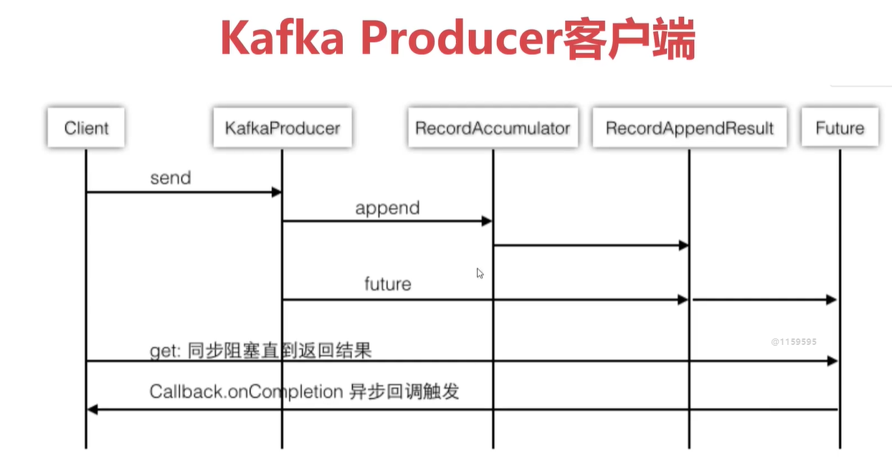
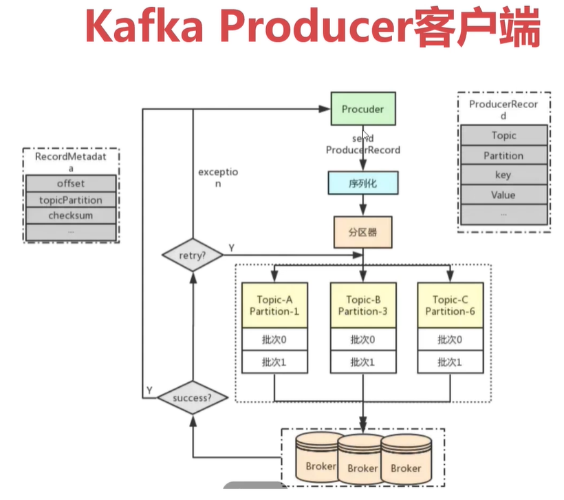
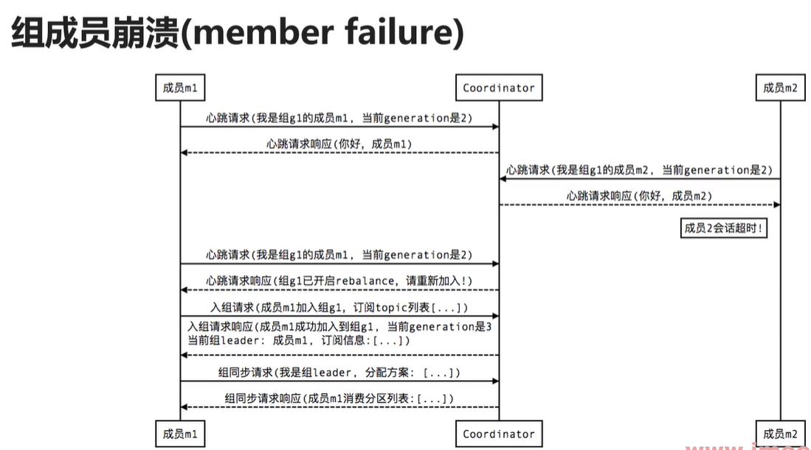
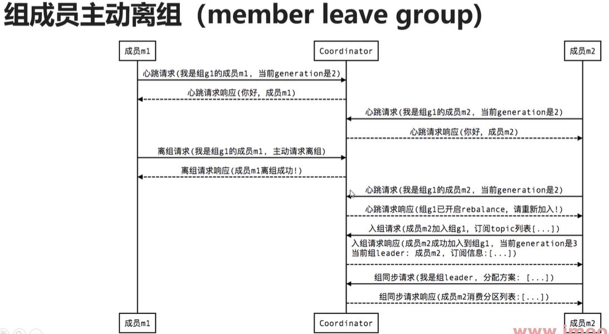
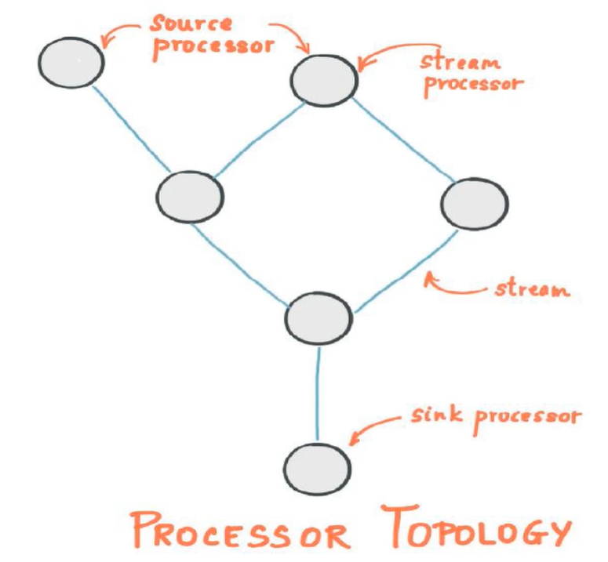

# 十、Kafka客户端API

## 7.1、Producer

### 7.1.1、Producer特性

- Producer是线程安全的【重点】
- 每次send并不会立即执行，而是批量执行的
- 发送到某一个partition是由客户端决定的

### 7.1.2、send的时序图



### 7.1.3、send业务流程图



## 7.2、Consumer

- 单个分区的消息只能由ConsumerGroup中的某个Consumer消费。
- Consumer从Partition中消费消息是顺序，默认从开头开始消费。
- 单个ConsumerGroup会消费所有Partition中的消息。
- 非线程安全的【重点】






## 7.3、Stream

- Kafka Stream是处理分析存储在Kafka中的数据的客户端程序库
- Kafka Stream通过state store可以实现高效状态操作
- 支持原语Processor和高层抽象DSL

### 7.3.1、Kafka Stream关键词

- 流及流处理器
- 流处理拓扑
- 源处理器及Sink处理器




## 7.4、Connect

[Kafka连接器](https://www.confluent.io/hub/)

- Kafka Connect是Kafka流式计算的一部分
- Kafka Connect主要用来与其他中间件建立流式通道
- Kafka Connect支持流式和批量处理集成

如何配置一个kafka-connector？

第一步：下载连接器，https://www.confluent.io/hub/confluentinc/kafka-connect-jdbc

confluentinc-kafka-connect-jdbc-10.6.0.zip

第二步：准备MySQL的驱动包（5.x和8.x）

第三步：以上三者，上传到Kafka服务器，创建一个plugins目录`/usr/local/kafka/plugins`，用来存放

第四步：解压连接器，并把驱动包移动到连接器的解压目录`lib`下，当前：`/usr/local/kafka/plugins//usr/local/kafka/plugins/confluentinc-kafka-connect-jdbc-10.6.0`

第五步：修改Kafka配置`connect-distributed.properties`

```bash
# [修改]
bootstrap.servers=localhost:9092 ==> bootstrap.servers=emon:9092
# [新增]
rest.port=8083
# [新增]
plugin.path=/usr/local/kafka/plugins
```

第六步：启动

```bash
## connect启动命令
bin/connect-distributed.sh -daemon config/connect-distributed.properties
bin/connect-distributed.sh config/connect-distributed.properties
```

启动成功后，可以访问：

http://emon:8083/connector-plugins

查看任务：

http://emon:8083/connectors

创建任务：从mysql到kafka

```bash
curl -X POST -H 'Content-Type: application/json' -i 'http://emon:8083/connectors' \
--data \
'{"name":"emon-upload-mysql","config":{
"connector.class":"io.confluent.connect.jdbc.JdbcSourceConnector",
"connection.url":"jdbc:mysql://emon:3306/kafkadb?user=root&password=root123",
"table.whitelist":"users",
"incrementing.column.name": "id",
"mode":"incrementing",
"topic.prefix": "emon-mysql-"}}'
```

说明：

- `table.whitelist` 表名白名单，哪些表需要被加载
- `incrementing.column.name` 用于判断是否不断新增的列名字
- `mode`: 迭代模式，不断迭代的模式
- `topic.prefix` 主题前缀，生成kafka的topic时会用 topic.prefix + tableName 作为topicName；比如这里是`emon-mysql-users`

消费topic：

```bash
$ kafka-console-consumer.sh --bootstrap-server emon:9092 --topic emon-mysql-users --from-beginning
```


创建任务：从kafka到mysql

```bash
curl -X POST -H 'Content-Type: application/json' -i 'http://emon:8083/connectors' \
--data \
'{"name":"emon-download-mysql","config":{
"connector.class":"io.confluent.connect.jdbc.JdbcSinkConnector",
"connection.url":"jdbc:mysql://emon:3306/kafkadb?user=root&password=root123",
"topics":"emon-mysql-users",
"auto.create":"false",
"insert.mode": "upsert",
"pk.mode":"record_value",
"pk.fields":"id",
"table.name.format": "users_bak"}}'
```

说明：

- `auto.crete` 自动创建表


删除任务：

```bash
curl -X DELETE -i 'http://emon:8083/connectors/emon-download-mysql'
```

