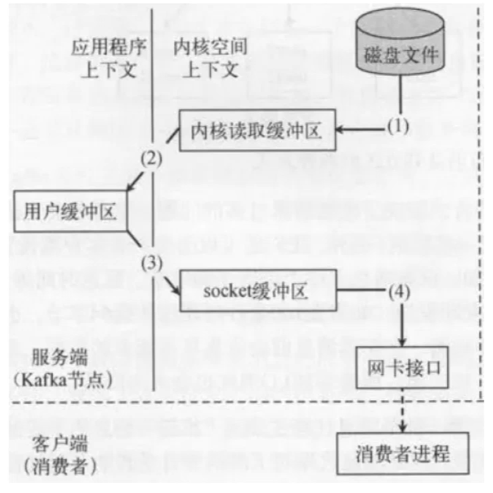
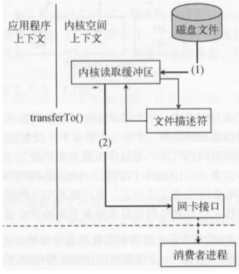
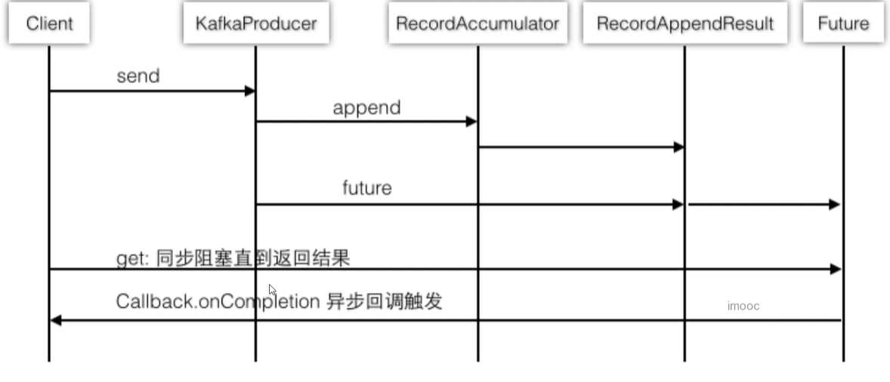
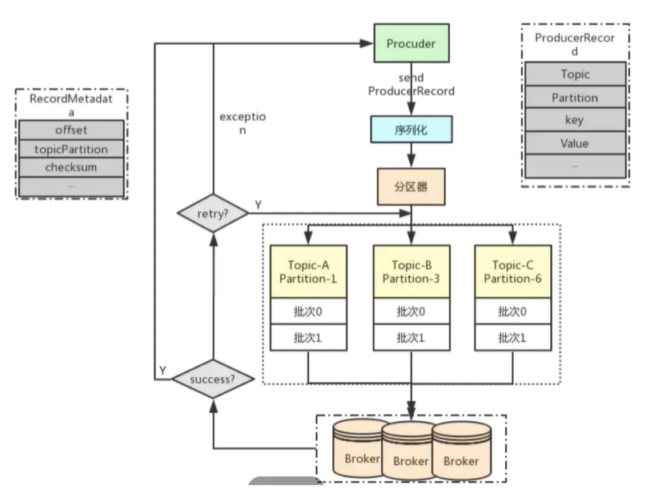
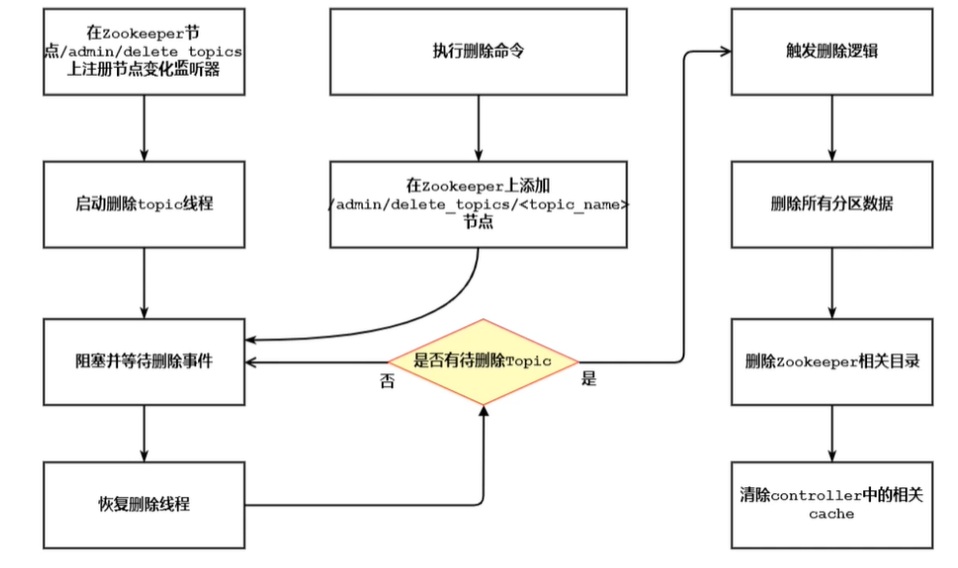
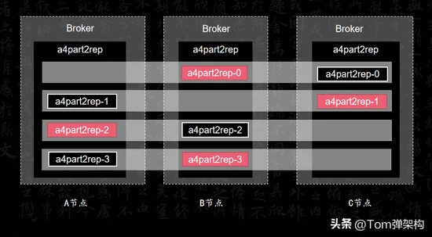
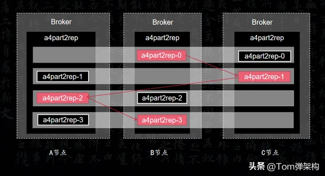

# 九十、Kafka Interview Guide

## 9.1、Kafka常见应用场景

类似问题：Kafka与其他消息中间件异同点

- Kafka概念及优劣势分析

  - Kafka概念：分布式流处理平台

  - Kafka特性一：提供发布订阅及Topic支持

  - Kafka特性二：吞吐量高但不保证消息有序（同一个partition有序，多个之间无序）

- Kafka常见应用场景

  - 日志收集或流式系统
  - 消息系统（如果对消息顺序不作要求）
  - 用户活动跟踪或运营指标监控

## 9.2、Kafka吞吐量为什么大？

类似问题：Kafka速度为什么快？

- Kafka面试题分析
  - 日志顺序读写和快速检索
  - Partition机制
  - 批量发送接收及数据压缩机制
  - 通过sendfile实现零拷贝原则

## 9.3、Kafka底层原理之日志

- Kafka的日志是以Partition为单位进行保存
- 日志目录格式为Topic名称+数字
  - 比如：`test-0`,`test-1`，表示test有2个分区，对应2个目录

- 日志文件格式是一个“日志条目”序列

  ```bash
  00000000000000000000.index
  00000000000000000000.log
  00000000000000000000.timeindex
  leader-epoch-checkpoint
  ```

- 每条日志消息由4字节整形与N字节消息组成

  ```bash
  message length : 4 bytes (value: 1+4+n) // 消息长度
  "magic" value  : 1 byte                 // 版本号
  crc            : 4 bytes                // CRC校验码
  payload        : n bytes	            // 具体的消息
  ```

- 日志分段
  - 每个Partition的日志会分为N个大小相等的segment
  - 每个segment中消息数量不一定相等
  - 每个Partition只支持顺序读写（磁盘的顺序读写，比内存的随机读写，快！）

## 9.4、Kafka零拷贝原理

零拷贝：所谓零拷贝，就是把两次多余的拷贝（2和3）忽略掉，应用程序可以直接把磁盘中的数据，从内核中直接传输到socket，而不需要再次经过应用程序所在的用户空间。

Linux系统中，零拷贝依赖于底层的sendfile()方法实现的。

- 四次拷贝



- 两次拷贝



## 9.5、Kafka消费者组与消费者

- Kafka消费者组是Kafka消费的单位
- 单个Partition只能由消费者组中某个消费者消费
- 消费者组中的单个消费者可以消费多个Partition

## 90.6、Kafka生产者客户端

[Kafka Producer介绍](https://www.cnblogs.com/huxi2b/p/6364613.html)

- ProducerRecord

一个ProducerRecord表示一条待发送的消息记录，主要由5个字段构成：

| 字段      | 含义      |
| --------- | --------- |
| topic     | 所属topic |
| partition | 所属分区  |
| key       | 键值      |
| value     | 消息体    |
| timestamp | 时间戳    |

ProducerRecord允许用户在创建消息对象的时候就直接指定要发送的分区，这样producer后续发送该消息时可以直接发送到指定分区，而不用再通过Partitioner计算目标分区了。

另外，我们还可以直接指定消息的时间戳——但一定要慎重使用这个功能，因为它有可能会令时间戳索引机制失效。

- RecordMetadata

该类表示Kafka服务器端，返回给客户端的消息的元数据信息，包含以下内容：

| 字段                | 描述                   |
| ------------------- | ---------------------- |
| offset              | 该条消息的位移         |
| timestamp           | 消息时间戳             |
| topic+partition     | 所属topic的分区        |
| checksum            | 消息CRC32码            |
| serializedKeySize   | 序列化后的消息键字节数 |
| serializedValueSize | 序列化后的消息体字节数 |

上面 元数据信息前3项比较重要，producer端可以使用这些信息做一些消息发送成功之后的处理，比如写入日志等。

- 基本设计特点

结合源代码，Producer从设计上来讲有以下几个特点（或者说是优势）：

1. 总共创建两个线程：执行KafkaProducer.send逻辑的线程——我们称之为“用户主线程”；执行发送逻辑的IO线程——我们称之为“sender线程”。
2. 不同于Scala老版本的producer，新版本producer完全异步发送消息，并提供了回调机制（callback）供用户判断消息是否发送成功。
3. batching机制——“分批发送”机制。每个批次（batch）中包含了若干个PRODUCE请求，因此具有更高的吞吐量。
4. 跟家合理的默认分区策略：对于无key消息而言，Scala版本分区策略是一段时间内（默认是10分钟）将消息发往固定的目标分区，这容易造成消息分布的不均匀，而新版本的Producer采用轮询的方式均匀地将消息分发到不同的Partition。
5. 底层统一使用基于Selector的网络客户端实现，结合Java提供的Future实现完整地提供了更加健壮和优雅的生命周期管理。

- Kafka Producer客户端时序图



- Kafka Producer客户端流程图



## 90.7、Kafka消息有序性处理

- Kafka的特性只支持Partition有序

- 使用Kafka Key + offset可以做到业务有序

## 90.8、Kafka Topic删除背后的故事



Kafka的Topic删除存在的问题会比较多，

建议设置`auto.create.topics.enable=false`

建议设置delete.topic.enable=true

建议先停掉流量，再执行删除！

## 90.9、Kafka消息重复消费和漏消费原理分析

本质上是offset控制出现了问题。

- 重复消费常见场景

  - 人为原因，尤其是在Consumer的使用上

  - 程序处理原因，尤其是单次消费超时的情况

  - Kafka机制：消费者重平衡时offset未控制好

## 90.10、Kafka消费者线程安全性分析

- Kafka的Consumer不是线程安全的
- Kafka的Consumer并发消费的两种方式
  - 多Consumer多线程【推荐】
  - 单Consumer多线程

## 90.11、Kafka Leader选举分析

### 90.11.1、选举分析

- Kafka并没有采用多数投票来选举Leader（ZK、ES、Redis采用多数投票方式选举）

  - 原因1：防止选举时，选举到了数据不全的broker；比如有三个节点，其中2个有10000条数据，另外1个只有9000条数据，如果采取多数投票选到了9000条的节点，就会导致丢失1000条数据。**也即，新的Leader必须要尽量包含所有消息，即消息完整性**。
  - 原因2：当选举没有通过一轮就产生时（比如平票、弃票），需要额外的第二轮、第三轮甚至更多次，比较耗费时间。**也即，不能产生过多的冗余导致过多的磁盘IO**。

- Kafka为了保证数据一致性，使用了ISR机制

  - 首先我们知道Kafka的数据是多副本的，某个topic的replication-factor为N，且N大于1时，每个Partition都会有N个副本（Replica）。Kafka的Replica包含Leader与Follower。每个topic下的每个分区下都有一个Leader和（N-1）个Follower。
  - 每个Follower的数据都是同步Leader的，这里需要注意，**是Follower主动拉取Leader的数据**。
  - Replical的个数小于等于Broker的个数，也就是说，对于每个Partition而言，每个Broker上最多只会有一个Replica，因此可以使用Broker id指定Partition的Replica。

- Kafka会动态维护一组Leader数据的同步副本ISR(In-Sync Replicas)

  - 条件1：（0.9x开始启用）根据副本和Leader的交互时间差，如果大于某个时间差，就认定这个副本不行了，从ISR剔除。

  > 时间差参数：
  > replica.lag.time.max.ms=10000
  > 也就是默认10s，isr中的follow没有向isr发送心跳包就会被移除

  - 条件2：（0.9x开始已废弃）根据Leader和副本的信息条数差值决定是否从ISR中剔除此副本，此信息条数差值根据配置参数

  > replica.lag.max.messages=4000
  >
  > 也就是默认消息差值大于4000会被移除
  >
  > 【已废弃】避免极端情况下，producer一次性发来1万条消息，会大于4000，而导致同步副本被剔除

### 90.11.2、选举原理

​	早起Kafka的版本是直接用Zookeeper来完成选举的。利用了Zookeeper的Watch机制；节点不允许重复写入以及临时节点这些特性。这样实现比较简单，省事。但是也会有一定的弊端，比如分区和副本数量过多，所有的副本都直接参与选举的话，一旦某个出现节点的增减，就会造成大量的Watch事件被触发，ZooKeeper的就会负载过重，不堪重负。

​	新版本的Kafka中换了一种实现方式。不是所有的Repalica都参与Leader选举，而是由其中的一个Broker统一来指挥，这个Broker的角色就叫做Controller控制器。

​	Kafka要先从所有Broker中选出唯一的一个Controller。所有的Broker会尝试在ZooKeeper中创建临时节点`/controller`，谁先创建成功，谁就是Controller。一旦创建成功，其他节点继续watch。那如果Controller挂掉或者网络出现问题，ZooKeeper上的临时节点就会消失。其他的Broker通过Watch监听到Controller下线后，继续按照先到先得的原则竞争Controller。这个Controller就相当于选举委员会的主席。

当一个节点成为Controller之后，他就会承担以下职责：

监听Broker变化、监听Topic变化、监听Partition变化、获取和管理Broker、Topic、Partition的信息、管理Partition的主从信息。

### 90.11.3、选举规则

​	Controller确定以后，就可以开始做分区选主的事情。接下来就是找候选人。显然，每个Replica都想推荐自己，但不是所有的Replica都有竞选资格。只有在ISR（In-Sync Replicas）保持心跳同步的副本才有资格参与竞选。就好比是皇帝每天着急皇子们开早会，只有每天来打开的皇子才能加入ISR。

​	接下来，就是Leader选举，就相当于要在众多皇子中选出太子。在分布式选举中，有非常多的选举协议，比如ZAB、Raft等，他们的思想归纳起来就是：先到先得，少数服从多数。但是Kafka没有用这些方法，而是用了一种自己实现的算法。

​	提到Kafka官方的解释是，它的选举算法和微软的PacificA算法最相近。大致意思就是，默认是让ISR中的第一个Replica变成Leader。比如ISR是1、5、9，优先让1成为Leader。这个跟中国古代皇帝船尾是一样的，优先传给皇长子。

​	假设，我们创建一个4个分区2个副本的Topic，它的Leader分布是这样的，如图所示：



​	第1个分区的副本Leader，落在B节点上。第2个分区的副本Leader落在C节点上，第3个分区的副本Leader落在A节点上，第4个分区的副本Leader落在B节点上。如果有更多副本，就以此类推。我们发现Leader的选举的规则相当于蛇形走位。



​	这样设计的好处是可以提高数据副本的容灾能力。将Leader和副本完全错开，从而不至于一挂全挂。

- Kafka之Partition选举

所有Partition的Leader选举都由Controller决定。Controller会将Leader的改变直接通过RPC的方式通知需为此作为响应的Broker。Partition的选举过程主要为从Zookeeper中读取当前分区的所有ISR集合，调用配置的分区选择算法选择分区的Leader。

- Leader选举配置建议
  - ISR中副本全部宕机，会启用Unclean Leader（也即在ISR之外找一个Follower作为Leader）选举。生产上应该禁用Unclean Leader。手动指定最小的ISR（`min.insync.replicas`默认值1）。
  - `unclean.leader.election.enable`的默认值是false，指示是否在万不得已的情况下**也不启用**不在ISR集中的副本作为领导者，避免导致数据丢失。

## 90.12、Kafka幂等性源码分析

- 什么是幂等性

如果服务器收到接口的重试，能被认为是同一个请求处理，就是幂等性。

- Kafka为什么会产生幂等性问题

Producer设置acks=-1会期望所有ISR（同步replicas）都收到数据的确认，如果有一个没有确认会导致重发。

- Kafka有哪些幂等性问题
  - 单体幂等性依赖pid（ProducerId)和sequenceNumber（批次）
  - 单体幂等性相关配置：ProducerConfig级别的`enable.idempotence=true`，该属性默认值：false
  - 全局性幂等性依赖事务保证

## 90.13、Kafka事务支持实现及原理分析

- 什么是事务

事务提供的安全性保障是经典的 ACID，

即**原子性（Atomicity）、一致性 (Consistency)**、**隔离性 (Isolation)** 和**持久性 (Durability)**。

- Kafka隔离级别

**已提交读（read committed）隔离级别**

所谓的 read committed，指的是当读取数据库时，只能看到已提交的数据，即无脏读。

同时，当写入数据库时，只能覆盖掉已提交的数据，即无脏写。

**目前kafka是已提交读（read committed）隔离级别**,

能保证多条消息原子性地写入到目标分区，同时也能保证 Consumer 只能看到事务成功提交的消息。

- 事务型Producer

事务型 Producer 能够保证将**消息原子性地写入到多个分区中**。这批消息要么**全部写入成功，要么全部失败**。另外，事务型 Producer 也不惧进程的重启。Producer 重启回来后，Kafka 依然保证它们发送消息的精确一次处理。

- Kafka事务实现方式

  - 添加`transactional_id`配置和`retries`配置

    ```bash
    # 要求retries必须大于0
    retries=2
    transactional.id=emon-trans-id
    ```

  - 完成事务的初始化和开启

    ```bash
    # 初始化事务
    kafkaProducer.initTransactions();
    # 事务开启
    kafkaProducer.beginTransaction();
    ```

  - 事务完成记得Commit或者abort

    ```bash
    # 事务提交
    kafkaProducer.commitTransaction();
    # 事务回滚
    kafkaProducer.abortTransaction()
    ```

  - 事务实现的核心是Coordinator

示例代码：

```java
// 其他配置
// ......
// 1、事务支持配置
properties.put(ProducerConfig.RETRIES_CONFIG, "2"); // 不为0即可
properties.put(ProducerConfig.TRANSACTIONAL_ID_CONFIG, "emon-trans-id");

// Producer的主对象
KafkaProducer<String, String> kafkaProducer = new KafkaProducer<>(properties);

// 2、初始化事务
kafkaProducer.initTransactions();
try {
    // 3、事务开启
    kafkaProducer.beginTransaction();
    // 消息对象 - ProducerRecord
    for (int i = 0; i < 10; i++) {
        String key = "key-" + i;
        String value = "value-" + i;
        ProducerRecord<String, String> record = new ProducerRecord<>(TOPIC_NAME, key, value);
        kafkaProducer.send(record);
        if (i == 8) {
            throw new Exception();
        }
    }
    // 4-1、事务提交
    kafkaProducer.commitTransaction();
} catch (Exception e) {
    e.printStackTrace();
    // 4-2、事务回滚
    kafkaProducer.abortTransaction();
} finally {
    // 所有的通道打开都需要关闭
    kafkaProducer.close();
}
```

## 90.14、ZooKeeper在Kafka中的作用

​	Kafka集群是指Broker集群，Producer和Consumer对Kafka来讲都只是客户端。ZooKeeper只管理Broker、Consumer，他们在ZooKeeper上都真实存在具体数据；Producer端直接连接Broker，不在ZooKeeper上存放任何数据，只注册监听，监听Broker和Topic信息。只有在ZooKeeper节点上存放了数据才算被ZooKeeper管理，只注册监听的不算被ZooKeeper管理。

### 90.14.1、ZooKeeper有哪些常见的作用？

- 分布式组件间的数据通信
- 集中式的元数据管理
- 服务发现/注册中心
- HA自动选主
- 分布式锁

### 90.14.2、Kafka使用到了哪些ZooKeeper功能

- 分布式组件间的数据通信：ISR更新过程中的数据通信
- 集中式的元数据管理：元数据分层管理
- HA自动选主：Controller的自动选主

### 90.14.3、ISR的更新过程中ZooKeeper起到的作用

​	ISR更新过程中，先是更新了ISR的元数据信息，然后把更新动作写到了notification节点上，最后由controller节点感知到notification节点的变化后，开始进行集群内的元数据更新。这便是由【Node节点数据存储 + Watcher回调机制】实现的一个经典的组件之间数据通信的使用案例。

### 90.14.4、元数据管理时ZooKeeper起到的作用

​	Kafka的元数据管理，是进行分层管理的，也就是大体上分为cluster->broker->topic->partition->state->isr...

​	那么，ZooKeeper的树形数据结构，就天然适用于这种形式的数据保存。同时，ZooKeeper还可以保障元数据的顺序一致性，以及数据的持久性，这都得益于ZooKeeper原本的机制。

​	而且，由于ZooKeeper的Watcher回调机制，还可以很快的感知到元数据信息的变化，从而快速的去更新集群内的元数据，让各个broker快速更新最新的元数据。

​	但是ZooKeeper的这种机制也会导致大量的并发写操作，因此ZooKeeper只能适用于中小集群的元数据管理，这也是为什么Kafka要去ZooKeeper的原因之一。

### 90.14.5、Controller的HA中ZooKeeper的作用

​	broker 启动的时候，都会去尝试创建 /controller 这么一个临时节点，由于 zk 的本身机制，哪怕是并发的情况下，也只会有一个broker 能够创建成功。

​	因此创建成功的那个就会成为 controller，而其余的 broker 都会对这 controller 节点加上一个 Watcher，一旦原有的 controller 出问题，临时节点被删除，那么其他 broker 都会感知到从而进行新一轮的竞争，谁先创建那么谁就是新的 controller。

​	当然，在这个重新选举的过程中，有一些需要 controller 参与的动作就无法进行，例如元数据更新等等。需要等到 controller 竞争成功并且就绪后才能继续进行，所以 controller 出问题对 kafka 集群的影响是不小的。

