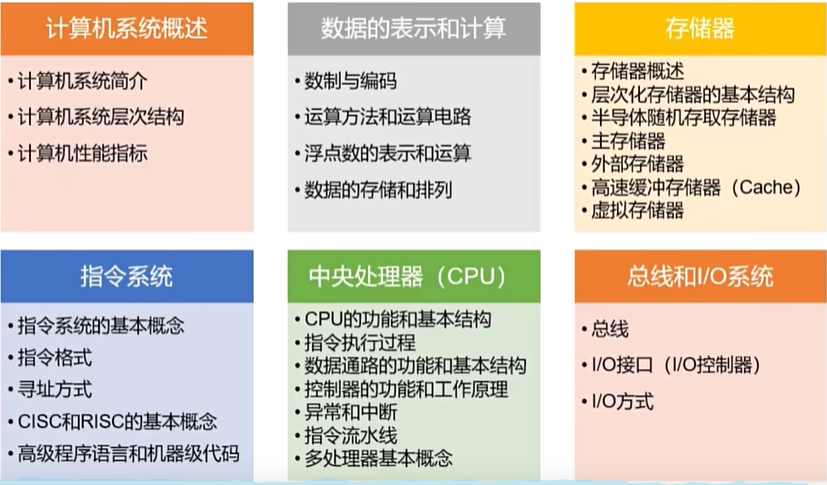

# 第1章 计算机组成原理概述

## 1.1 大纲概述

全国硕士研究生计算机学科专业基础综合（408）考试，包含数据结构、计算机组成原理、操作系统和计算机网络4大专业基础课程，满分150分。其中，计算机组成原理45分，占比30%。

## 1.2 计算机系统简介

## 1.3 计算机系统层次结构

## 1.4 计算机性能指标

## 1.5 数据的表示和计算

### 数制与编码

## 1.6 存储器

## 1.7 指令系统

## 1.8 中央处理器（CPU）

## 1.9 总线和I/O系统
