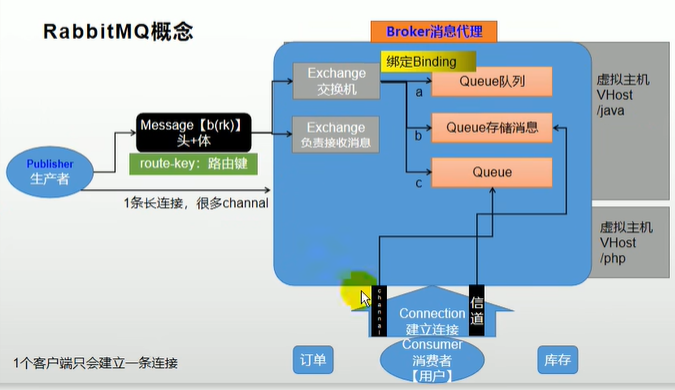
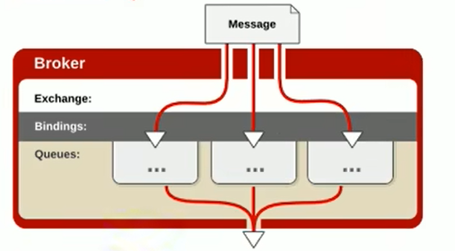
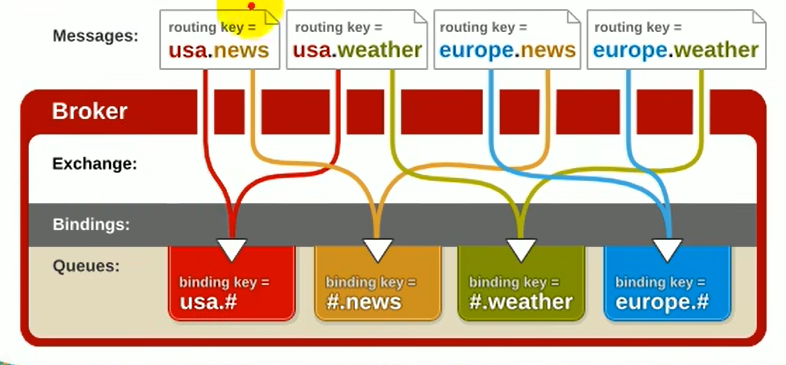

# 第4章 MQ概述与RabbitMQ概念

## 4.1 MQ概述

1. 大多应用中，可通过消息服务中间件来提升系统异步通信、扩展解耦能力。

2. 消息服务中两个重要概念：

   消息代理（message broker）和目的地（destination）

当消息发送者发送消息以后，将由消息代理接管，消息代理保证消息传递到指定目的地。

3. 消息队列主要有两种形式的目的地

   1. 队列（queue）：点对点消息通信（point-to-point）

   2. 主题（topic）：发布（publish）/订阅（subscribe）消息通信

4. 点对点式：
   1. 消息发送者发送消息，消息代理将其放入一个队列中，消息接收者从队列中获取消息内容，消息读取后被移出队列。
   2. 消息只有唯一的发送者和接收者，但并不是说只能有一个接收者。哪一个接收者收取了，其他接收者就不能得到了。

5. 发布订阅式：
   1. 发送者（发布者）发送消息到主题，多个接收者（订阅者）监听（订阅）这个主题，那么就会在消息到达时同时收到消息。

6. JMS（Java Message Service）Java消息服务：
   1. 基于JVM消息代理的规范。ActiveMQ、HornetMQ是JMS实现。

7. AMQP（Advanced Message Queuing Protocol）
   1. 高级消息队列协议，也是一个消息代理的规范，兼容JMS
   2. RabbitMQ是AMQP的实现

|              | JMS（Java Message Service）                                  | AMQP（Advanced Message Queuing Protocol）                    |
| ------------ | ------------------------------------------------------------ | ------------------------------------------------------------ |
| 定义         | Java api                                                     | 网络线级协议                                                 |
| 跨语言       | 否                                                           | 是                                                           |
| 跨平台       | 否                                                           | 是                                                           |
| Model        | 提供两种消息模型：Peer-2-Peer / Pub/sub | 提供了五种消息模型：direct exchange / fanout exchange / topic change / headers exchange / system exchange |
| 支持消息类型 | 多种消息类型：TextMessage / MapMessage / BytesMessage / StreamMessage / ObjectMessage / Message | byte[] |
| 综合评价     | JMS定义了Java API层面的标准 | AMQP定义了wire-level层的协议标准；天然具有跨平台、跨语言特性 |

8. Spring支持
   1. spring-jms提供了对JMS的支持
   2. spring-rabbit提供了对AMQP的支持
   3. 需要ConnectionFactory的实现来连接消息代理
   4. 提供JmsTemplate、RabbitTemplate来发送消息
   5. @JmsListener（JSM）、@RabbitListener（AMQP）注解在方法上监听消息代理发布的消息
   6. @EnableJms、@EnableRabbit开启支持

9. SpringBoot自动配置
   1. JmsAutoConfiguration
   2. RabbitAutoConfiguration

10. 市面上的MQ产品
    1. ActiveMQ
    2. RabbitMQ
    3. RocketMQ
    4. Kafka

## 4.2 RabbitMQ核心概念

**RabbitMQ简介**：RabbitMQ是一个由erlang开发的AMQP（Advanved Message Queue Protocol）的开源实现。

**Message**：消息，消息是不具名的，它由消息头和消息体组成。

**Publisher**：消息的生产者，也是一个向交换器发布消息的客户端应用程序。

**Exchange**：交换器，用来接收生产者发送的消息并将这些消息路由给服务器中的队列。Exchange有4种类型：direct（默认）、fanout、topic以及headers。

**Queue**：消息队列，用来保存消息直到发送给消费者。

**Binding**：绑定，用于消息队列和交换器之间的关联。

**Connection**：网络连接，比如一个TCP连接。

**Channel**：信道，多路复用连接中的一条独立的双向数据流通道。

**Consumer**：消息的消费者，表示一个从消息队列中取得消息的客户端应用程序。

**Virtual Host**：虚拟主机，表示一批交换器、消息队列和相关对象。每个vhost本质上就是一个mini版本的RabbitMQ服务器。

**Broker**：表示消息队列服务器实体。

### Exchange的4种类型

**direct**：消息中的路由键（routing key）如果和Binding中的binding key一致，交换器就将消息发送到对应的队列中。它是完全匹配、单播的模式。

**fanout**：每个发送到fanout类型交换器的消息都会分到所有绑定的队列上去。fanout类型转发消息是最快的。

**topic**：topic交换器通过模式匹配分配消息的路由键属性。`#`匹配0个或多个单词，`*`匹配一个单词。

**headers**：headers匹配AMQP消息的header而不是路由键，性能差很多，目前几乎用不到了。
