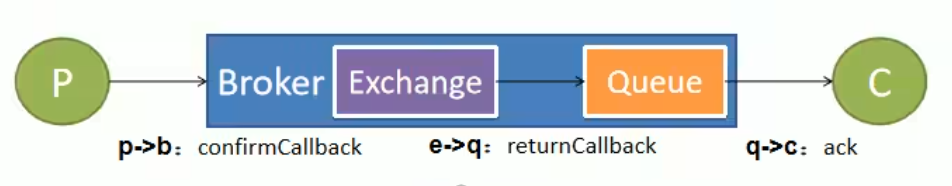

# 第5章 消息确认机制与可靠抵达

- 保证消息不丢失，可靠抵达，可以使用事务消息，性能下降250倍，为此引入确认机制。
- publisher confirmCallback 确认模式
- publisher returnCallback 未投递到queue退回模式
- consumer ack机制

## 5.1 消息抵达交换器（成功/失败）- confirmCallback

- spring.rabbitmq.publisher-confirms=true
  - 在创建connectionFactory的时候设置PublisherConfirms(true)选项，开启ConfirmCallback。
  - CorrelationData：用来表示当前消息唯一性。
  - 消息只要被broker接收到就会执行ConfirmCallback，如果是cluster模式，需要所有broker接收到才会调用ConfirmCallback。

## 5.2 消息抵达队列（失败）- returnCallback

- spring.rabbitmq.publisher-returns=true
- spring.rabbitmq.template.mandatory=true
  - confirm 模式只能保证消息到达broker，不能保证消息准确投递到目标queue里。
  - 如果未能投递到目标queue里将调用returnCallback。

## 5.3 消息抵达消费者 - Ack消息确认机制

- 消费者获取到消息，成功处理，可以回复Ack给Broker
  - basic.ack 用于肯定确认；broker将移除此消息，可以批量
  - basic.nack用于否定确定；可以指定broker是否丢弃此消息，可以批量
  - basic.reject用于否定确定；同上，但是不能批量
- 默认，消息被消费者收到，就会从broker的queue中移除
- queue无消费者，默认依然会被存储，直到消费者消费
- 消费者收到消息，默认会自动ack。但是如果无法确定此消息是否被处理完成，或者成功处理。我们可以开启手动ack模式。
  - 消息处理成功，ack()，接受下一个消息，此消息broker就会移除
  - 消息处理失败，nack()/reject()，重新发送给其他人进行处理，或者容错处理后ack
  - 消息一直没有调用ack/nack方法，broker认为此消息正在被处理（状态Unacked），不会投递给别人，此时客户端断开，消息不会被broker移除（状态Ready），会投递给别人。

## 5.4 如何保证消息可靠性 -- 消息丢失

### 消息丢失场景

- 消息发送出去，由于网络问题没有抵达服务器
  - 做好容错方法（try-catch），发送消息可能会网络失败，失败后要有重试机制，可记录到数据库，采用定期扫描重发的方式。
  - 做好日志记录，每个消息状态是否都被服务器收到都应该被记录。
  - 做好定期重发，如果消息没有发送成功，定期去数据库扫描未成功的消息进行重发。
- 消息抵达Broker，Broker要将消息写入磁盘（持久化）才算成功。此时Broker尚未持久化完成，宕机。
  - publisher也必须加入确认回调机制，确认成功的消息，修改数据库消息状态。
- 自动ACK的状态下。消费者收到消息，但没来得及消费，宕机。
  - 一定开启手动ACK，消费成功才移除，失败或者没来得及处理就noAck并重新入队。

## 5.5 如何保证消息可靠性 -- 消息重复

### 消息重复场景

- 消息消费成功，事务已经提交，ack时，机器宕机。导致没有ack成功。Broker的消息重新由unack变为ready，并发送给其他消费者。
  - 消费者的业务消费接口应该涉及为幂等性的比如扣库存有工作单的状态标志。【推荐】
  - 使用防重表（redis/mysql），发送消息每一个都有业务的唯一标识，处理过就不用处理。
  - rabbitMQ的每一个消息都有redelivered字段，可以获取是否是被重新投递过来的，而不是第一次投递过来的。【不推荐】
- 消息消费失败，由于重试机制，自动又将消息发送出去。

## 5.6 如何保证消息可靠性 -- 消息积压

### 消息积压场景

- 消费者宕机积压
- 消费者消费能力不足积压
- 发送者发送流量太大
  - 上线更多的消费者，进行正常消费。上线专门的队列消费服务，将消息先批量取出来，记录数据库、离线慢慢处理。
