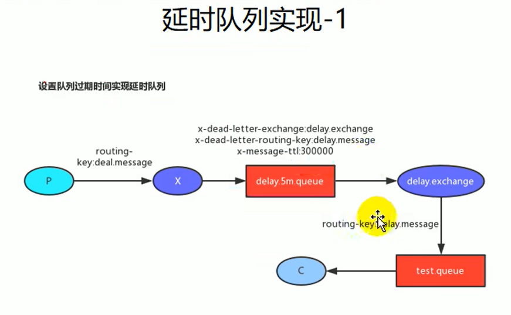
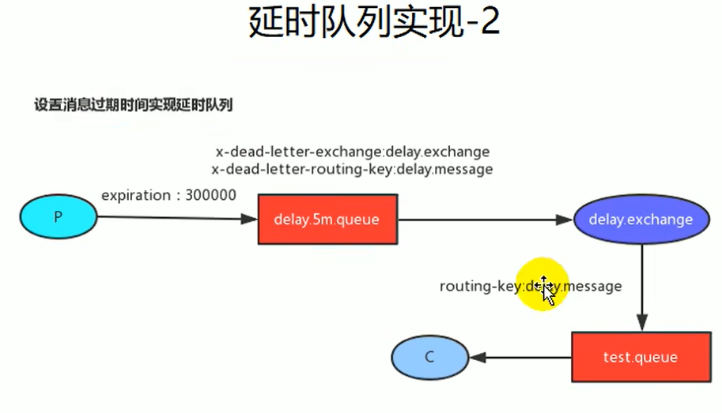

# 第6章 延时队列与应用场景

## 6.1 延时队列场景

比如未付款订单，超过一定时间后，系统自动取消订单并释放占有物品。

**常用解决方案**：spring的schedule定时任务轮训数据库

**缺点**：消耗系统内存、增加了数据库压力、存在较大的时间误差。

**解决**：rabbitmq的消息TTL和死信Exchange结合。

## 6.2 消息的TTL（Time To Live）

- 消息的TTL就是消息的存活时间。
- RabbitMQ可以对队列和消息分别设置TTL。
  - 对队列设置就是队列没有消费者连着的保留时间，也可以对每一个单独的消息做单独的设置。超过了这个时间，我们认为这个消息就死了，称之为死信。
  - 如果队列设置了，消息也设置了，那么会取小的。

## 6.3 Dead Letter Exchanges（DLX）

- 一个消息在满足如下条件下，会进入死信路由：
  - 一个消息被Consumer拒收了，并且reject方法的参数里requeue是false。
  - 上面的消息的TTL到了，消息过期了。
  - 队列的长度限制满了。排在前面的消息会被丢弃或者扔到死信路由上。
- Dead Letter Exchange其实就是一种普通的exchange。只是在某一个设置Dead Letter Exchange的队列中有消息过期了，会自动触发消息的转发，发送到Dead Letter Exchange中去。
- 我们既可以控制消息在一段时间后变成死信，又可以控制变成死信的消息被路由到某一个指定的交换机，结合二者，其实就可以实现一个延时队列。

推荐队列过期时间

## 6.4 MQ应用场景

### 异步任务

### 应用解耦

### 流量控制、流量削峰

## 6.5 用户信息

| 用户名 | 密码      |
| ------ | --------- |
| guest  | guest     |
| rabbit | rabbit123 |
|        |           |
