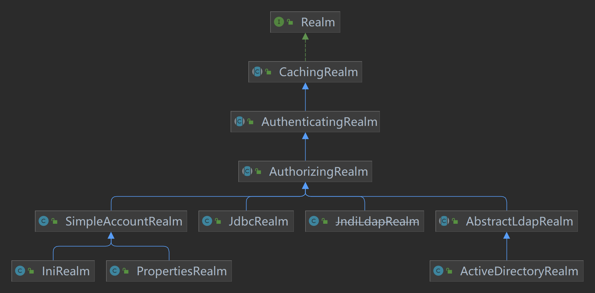
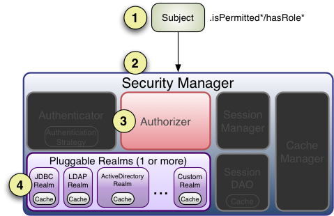

# 第2章 核心认证与授权

## 2.1 认证流程

[来源](https://shiro.apache.org/authentication.html)

### Realm接口

## 2.2 授权流程

[来源](https://shiro.apache.org/authorization.html)

1、首先调用Subject.isPermitted/hasRole接口，其会委托给SecurityManager；

2、SecurityManager接着会委托给内部组件Authorizer；

3、Authorizer再将其请求委托给我们的Realm去做；Realm才是真正干活的；

4、Realm将用户请求的参数封装成权限对象，再从我们重写的doGetAuthorizationInfo方法中获取从数据库中查询到的权限集合。

5、Realm将用户传入的权限对象，与从数据库中查询出俩的权限对象，进行一一对比。如果用户传入的权限对象在从数据库中查询出来的权限对象中，则返回true，否则返回false。

进行授权操作的前提：用户必须通过认证。
