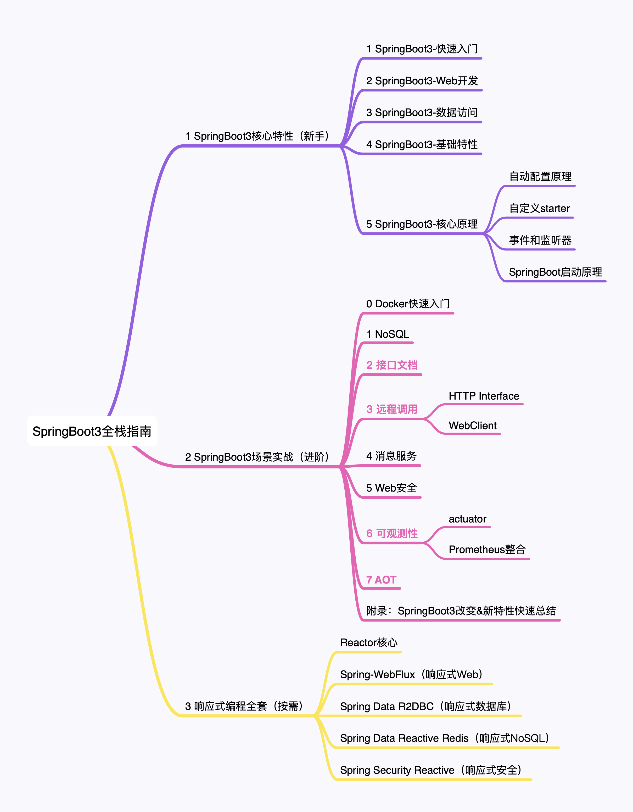

# 引言

[TOC]

SpringBoot3进度：

https://www.bilibili.com/video/BV1Es4y1q7Bf?spm_id_from=333.788.player.switch&vd_source=b850b3a29a70c8eb888ce7dff776a5d1&p=94

SpringBoot学习笔记：https://www.yuque.com/leifengyang/springboot3

SpringBoot示例代码：https://gitee.com/leifengyang/spring-boot-3

SpringBoot文档： https://docs.spring.io/spring-boot/reference/using/build-systems.html#using.build-systems.starters

Thymeleaf官方文档：https://www.thymeleaf.org/doc/tutorials/3.1/usingthymeleaf.html

响应式编程进度：

https://www.bilibili.com/video/BV1sC4y1K7ET?spm_id_from=333.788.player.switch&vd_source=b850b3a29a70c8eb888ce7dff776a5d1&p=50

Spring AI 生态开发：

https://www.bilibili.com/video/BV11b421h7uX/?spm_id_from=333.788.recommend_more_video.3&vd_source=b850b3a29a70c8eb888ce7dff776a5d1

# SpringBoot3全栈指南

