# 第4章 SpringBoot3之Web开发

> SpringBoot的Web开发能力，由**SpringMVC**提供。

## 4.1 WebMvcAutoConfiguration原理

### 4.1.1 生效条件

```java
@AutoConfiguration(after = { DispatcherServletAutoConfiguration.class, TaskExecutionAutoConfiguration.class,
		ValidationAutoConfiguration.class }) // 在这些自动配置之后
@ConditionalOnWebApplication(type = Type.SERVLET) // 如果是Web应用就生效，类型SERVLET
@ConditionalOnClass({ Servlet.class, DispatcherServlet.class, WebMvcConfigurer.class })
@ConditionalOnMissingBean(WebMvcConfigurationSupport.class) // 容器中没有这个Bean，才生效。默认没有
@AutoConfigureOrder(Ordered.HIGHEST_PRECEDENCE + 10) // 优先级
@ImportRuntimeHints(WebResourcesRuntimeHints.class)
public class WebMvcAutoConfiguration {
```

### 4.1.2 效果

1. 放了两个Filter：
   - a、`HiddenHttpMethodFilter`；辅助于页面表单提交Rest请求（GET、POST、PUT、DELETE）；是一个用于支持HTTP方法转换的过滤器。它允许通过POST请求来模拟其他HTTP方法（如PUT、DELETE等），这对于那些不直接支持这些方法的浏览器或客户端来说非常有用。
   - b、`FormContentFilter`：表单内容Filter，是一个用于解析提交的表单数据的过滤器。它主要的作用是处理那些通过HTTP POST请求发送的、带有application/x-www-form-urlencoded或multipart/form-data内容类型的表单数据。解析后的数据可以被Spring MVC框架正确地映射到控制器的方法参数上，比如@RequestParam, @ModelAttribute等注解所指定的参数。HTTP协议中，GET（数据放URL后面）、POST（数据放请求体）请求可以携带数据，PUT、DELETE的请求体数据会被忽略；

```java
	@Bean
	@ConditionalOnMissingBean(HiddenHttpMethodFilter.class)
	@ConditionalOnProperty(prefix = "spring.mvc.hiddenmethod.filter", name = "enabled")
	public OrderedHiddenHttpMethodFilter hiddenHttpMethodFilter() {
		return new OrderedHiddenHttpMethodFilter();
	}

	@Bean
	@ConditionalOnMissingBean(FormContentFilter.class)
	@ConditionalOnProperty(prefix = "spring.mvc.formcontent.filter", name = "enabled", matchIfMissing = true)
	public OrderedFormContentFilter formContentFilter() {
		return new OrderedFormContentFilter();
	}
```

2. `给容器中放了WebMvcConfigurer`组件；给SpringMVC添加各种定制功能
   - a、所有的功能最终会和配置文件进行绑定
   - b、WebMvcProperties：`spring.mvc`配置文件
   - c、WebProperties：`spring.web`配置文件

```java
	@Configuration(proxyBeanMethods = false)
	@Import(EnableWebMvcConfiguration.class)
	@EnableConfigurationProperties({ WebMvcProperties.class, WebProperties.class })
	@Order(0)
	public static class WebMvcAutoConfigurationAdapter implements WebMvcConfigurer, ServletContextAware {}
```

### 4.1.3 WebMvcConfigurer接口

提供了配置SpringMVC底层的所有组件入口

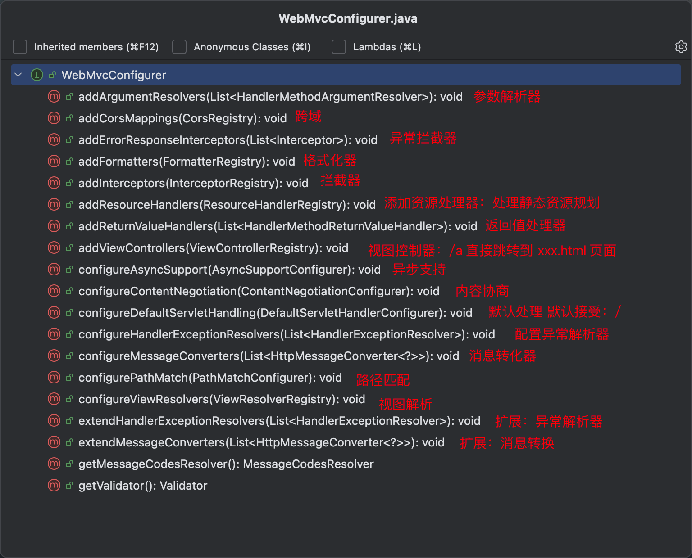

### 4.1.4 静态资源规则源码

```java
		@Override
		public void addResourceHandlers(ResourceHandlerRegistry registry) {
			if (!this.resourceProperties.isAddMappings()) {
				logger.debug("Default resource handling disabled");
				return;
			}
			addResourceHandler(registry, this.mvcProperties.getWebjarsPathPattern(),
					"classpath:/META-INF/resources/webjars/");
			addResourceHandler(registry, this.mvcProperties.getStaticPathPattern(), (registration) -> {
				registration.addResourceLocations(this.resourceProperties.getStaticLocations());
				if (this.servletContext != null) {
					ServletContextResource resource = new ServletContextResource(this.servletContext, SERVLET_LOCATION);
					registration.addResourceLocations(resource);
				}
			});
    }
```

1. 规则一：访问：`/webjars/**`路径就去`classpath:/META-INF/resources/webjars/`下找资源。

   - a、maven导入依赖

   ```xml
           <dependency>
               <groupId>org.webjars</groupId>
               <artifactId>jquery</artifactId>
               <version>3.6.1</version>
           </dependency>
   ```

   - b、jar结构图

   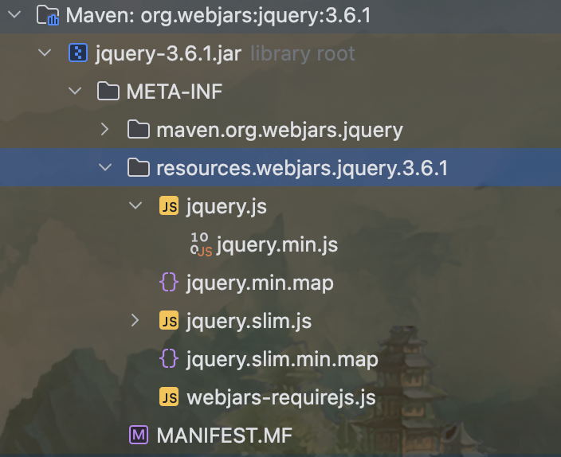

   - c、访问地址

   http://localhost:9000/webjars/jquery/3.6.1/jquery.js

2. 规则二：访问：`/**`路径就去`静态资源默认的四个位置找资源`

   - a、`classpath:/META-INF/resources/`
   - b、`classpath:/resources/`
   - c、`classpath:/static/`
   - d、`classpath:/public/`

3. 规则三：**静态资源默认都有缓存规则的设置**

   - a、所有缓存的设置，直接通过**配置文件**：`spring.web`
   - b、cachePeriod：缓存周期；多久不用找服务器要新的。默认没有，以s为单位
   - c、cacheControl：**HTTP缓存**控制； https://developer.mozilla.org/zh-CN/docs/Web/HTTP/Caching
   - d、**useLastModified**：是否使用最后一次修改。配合HTTP Cache规则。

> 如果浏览器访问了一个静态资源`index.js`，如果服务这个资源没有发生变化，下次访问的时候就可以直接让浏览器用自己缓存中的东西，而不用给服务器发请求。

```java
		private void addResourceHandler(ResourceHandlerRegistry registry, String pattern,
				Consumer<ResourceHandlerRegistration> customizer) {
			if (registry.hasMappingForPattern(pattern)) {
				return;
			}
			ResourceHandlerRegistration registration = registry.addResourceHandler(pattern);
			customizer.accept(registration);
			registration.setCachePeriod(getSeconds(this.resourceProperties.getCache().getPeriod()));
						registration.setCacheControl(this.resourceProperties.getCache().getCachecontrol().toHttpCacheControl());
			registration.setUseLastModified(this.resourceProperties.getCache().isUseLastModified());
			customizeResourceHandlerRegistration(registration);
    }
```

### 4.1.5 EnableWebMvcConfiguration 源码

```java
// SpringBoot给容器中放 WebMvcConfigurationSupport 组件。
// 若自己放了 WebMvcConfigurationSupport 组件，Boot的 WebMvcAutoConfiguration 都会失效。
	@Configuration(proxyBeanMethods = false)
	@EnableConfigurationProperties(WebProperties.class)
	public static class EnableWebMvcConfiguration extends DelegatingWebMvcConfiguration implements ResourceLoaderAware {}
```

1. `HandlerMapping`：根据请求路径`/a`找哪个handler能处理请求
   - a、`WelcomePageHandlerMapping`：
     - 访问`/**`路径下的所有请求，都在以前四个静态资源路径下找，欢迎页也一样。
     - 找 `index.html`：只要静态资源的位置有一个 `index.html` 页面，项目启动默认访问。
   - b、`WelcomePageNotAcceptableHandlerMapping`：
2. `Validator`：


### 4.1.6 为什么容器中放一个WebMvcConfigurer就能配置底层行为

1. WebMvcAutoConfiguration是一个自动配置类，它里面有一个 `EnableWebMvcConfiguration`
2. `EnableWebMvcConfiguration` 继承于 `DelegatingWebMvcAutoConfiguration`，这两个类的功能都生效
3. `DelegatingWebMvcConfiguration` 利用 DI 把容器中所有 `WebMvcConfigurer` 注入进来
4. 别人调用 `DelegatingWebMvcAutoConfiguration` 的方法配置底层规则，而它委托所有的 `WebMvcConfigurer` 去配置底层方法。

### 4.1.7 WebMvcConfigurationSupport

该类提供了很多的默认设置。

判断系统中是否有相应的类：如果有，就加入相应的 `HttpMessageConverter`

```java
	static {
		ClassLoader classLoader = WebMvcConfigurationSupport.class.getClassLoader();
		romePresent = ClassUtils.isPresent("com.rometools.rome.feed.WireFeed", classLoader);
		jaxb2Present = ClassUtils.isPresent("jakarta.xml.bind.Binder", classLoader);
		jackson2Present = ClassUtils.isPresent("com.fasterxml.jackson.databind.ObjectMapper", classLoader) &&
				ClassUtils.isPresent("com.fasterxml.jackson.core.JsonGenerator", classLoader);
		jackson2XmlPresent = ClassUtils.isPresent("com.fasterxml.jackson.dataformat.xml.XmlMapper", classLoader);
		jackson2SmilePresent = ClassUtils.isPresent("com.fasterxml.jackson.dataformat.smile.SmileFactory", classLoader);
		jackson2CborPresent = ClassUtils.isPresent("com.fasterxml.jackson.dataformat.cbor.CBORFactory", classLoader);
		jackson2YamlPresent = ClassUtils.isPresent("com.fasterxml.jackson.dataformat.yaml.YAMLFactory", classLoader);
		gsonPresent = ClassUtils.isPresent("com.google.gson.Gson", classLoader);
		jsonbPresent = ClassUtils.isPresent("jakarta.json.bind.Jsonb", classLoader);
		kotlinSerializationCborPresent = ClassUtils.isPresent("kotlinx.serialization.cbor.Cbor", classLoader);
		kotlinSerializationJsonPresent = ClassUtils.isPresent("kotlinx.serialization.json.Json", classLoader);
		kotlinSerializationProtobufPresent = ClassUtils.isPresent("kotlinx.serialization.protobuf.ProtoBuf", classLoader);
	}
```

## 4.2 Web场景

### 4.2.1 自动配置

1. 整合Web场景

```xml
        <dependency>
            <groupId>org.springframework.boot</groupId>
            <artifactId>spring-boot-starter-web</artifactId>
        </dependency>
```

2. 引入了`autoconfigure`功能
3. `@EnableAutoConfiguration`注解使用`@Import(AutoConfigurationImportSelector.class)`批量导入组件。（`spring-boot-autoconfigure`）
4. 加载`META-INF/spring/org.springframework.boot.autoconfigure.AutoConfiguration.imports`文件中配置的所有组件。（`spring-boot-autoconfigure`）
5. 所有自动配置类如下

```tex
org.springframework.boot.autoconfigure.web.client.RestClientAutoConfiguration
org.springframework.boot.autoconfigure.web.client.RestTemplateAutoConfiguration
org.springframework.boot.autoconfigure.web.embedded.EmbeddedWebServerFactoryCustomizerAutoConfiguration
=====以下是响应式Web场景和现在的没关系-beg=====
org.springframework.boot.autoconfigure.web.reactive.HttpHandlerAutoConfiguration
org.springframework.boot.autoconfigure.web.reactive.ReactiveMultipartAutoConfiguration
org.springframework.boot.autoconfigure.web.reactive.ReactiveWebServerFactoryAutoConfiguration
org.springframework.boot.autoconfigure.web.reactive.WebFluxAutoConfiguration
org.springframework.boot.autoconfigure.web.reactive.WebSessionIdResolverAutoConfiguration
org.springframework.boot.autoconfigure.web.reactive.error.ErrorWebFluxAutoConfiguration
org.springframework.boot.autoconfigure.web.reactive.function.client.ClientHttpConnectorAutoConfiguration
org.springframework.boot.autoconfigure.web.reactive.function.client.WebClientAutoConfiguration
=====以下是响应式Web场景和现在的没关系-end=====
org.springframework.boot.autoconfigure.web.servlet.DispatcherServletAutoConfiguration
org.springframework.boot.autoconfigure.web.servlet.ServletWebServerFactoryAutoConfiguration
org.springframework.boot.autoconfigure.web.servlet.error.ErrorMvcAutoConfiguration
org.springframework.boot.autoconfigure.web.servlet.HttpEncodingAutoConfiguration
org.springframework.boot.autoconfigure.web.servlet.MultipartAutoConfiguration
org.springframework.boot.autoconfigure.web.servlet.WebMvcAutoConfiguration
```

6. 绑定了配置文件的一堆配置项

- 1、SpringMVC的所有配置`spring.mvc`
- 2、Web场景通用配置`spring.web`
- 3、文件上传配置`spring.servlet.multipart`
- 4、服务器的配置`server`
  - 比如：编码方式

### 4.2.2 默认效果

**默认配置：**

1. 包含了<span style="color:red;">`ContentNegotiatingViewResolver`</span>和<span style="color:red;">`BeanNameViewResolver`</span>组件，**方便视图解析**。
2. **默认的静态资源处理机制**：静态资源放在<span style="color:red;">static</span>文件夹下即可直接访问。
3. **自动注册**了<span style="color:red;">`Converter`</span>，<span style="color:red;">`GenericConverter`</span>，<span style="color:red;">`Formatter`</span>组件，适配常见的**数据类型转换和格式化需求**。
4. 支持<span style="color:red;">`HttpMessageConverters`</span>，可以**方便返回<span style="color:red;">`json`</span>等数据类型**。
5. 注册<span style="color:red;">`MessageCodesResolver`</span>，方便**国际化**及错误消息处理。
6. 支持静态<span style="color:red;">`index.html`</span>
7. **自动使用**<span style="color:red;">`ConfigurableWebBindingInitializer`</span>，实现<span style="color:red;">`消息处理`</span>、<span style="color:red;">`数据绑定`</span>、<span style="color:red;">`类型转化`</span>等功能

> **重要：**
>
> - 如果想保持 boot mvc 的默认配置，并且自定义更多的 mvc 配置，如：interceptors，formatters，view controllers等。可以使用<span style="color:red;">`@Configuration`</span>注解添加一个<span style="color:red;">`WebMvcConfigurer`</span>类型的配置类，并不要标注<span style="color:red;">`@EnableWebMvc`</span>。
> - 如果想保持 boot mvc 的默认配置，但要自定义核心组件实例，比如：<span style="color:red;">`RequestMappingHandlerMapping`</span>，<span style="color:red;">`RequestMappingHandlerAdapter`</span>，或<span style="color:red;">`ExceptionHandlerExceptionResolver`</span>，给容器中放一个<span style="color:red;">`WebMvcRegistrations`</span>组件即可。
> - 如果想要全面接管 Spring MVC，<span style="color:red;">`@Configuration`</span>标注一个配置类，并加上<span style="color:red;">@EnableWebMvc</span>注解，实现<span style="color:red;">`WebMvcConfigurer`</span>接口。

## 4.3 静态资源

### 4.3.1 默认规则

**1 静态资源映射**

静态资源映射规则在<span style="color:red;">`WebMvcAutoConfiguration`</span>中进行了定义：

1. <span style="color:red;">`/webjars/**`</span>的所有路径资源都在<span style="color:red;">`classpath:/META-INF/resources/webjars/`</span>
2. <span style="color:red;">`/**`</span>的所有路径资源都在<span style="color:red;">`classpath:/META-INF/resources/`</span>、<span style="color:red;">`classpath:/resources/`</span>、<span style="color:red;">`classpath:/static/`</span>、<span style="color:red;">`classpath:/public/`</span>
3. 所有静态资源都定义了<span style="color:red;">`缓存规则`</span>。【浏览器访问过一次，就会缓存一段时间】，但次功能参数无默认值。
   - a、<span style="color:red;">`period`</span>：缓存间隔。默认0S；
   - b、<span style="color:red;">`cacheControl`</span>：缓存控制。默认无；
   - c、<span style="color:red;">`useLastModified`</span>：是否使用<span style="color:red;">`lastModified`</span>头。默认false；

**2 静态资源缓存**

如前面所述：

1. 所有静态资源都定义了<span style="color:red;">`缓存规则`</span>。【浏览器访问过一次，就会缓存一段时间】，但次功能参数无默认值。
   - a、<span style="color:red;">`period`</span>：缓存间隔。默认0S；
   - b、<span style="color:red;">`cacheControl`</span>：缓存控制。默认无；
   - c、<span style="color:red;">`useLastModified`</span>：是否使用<span style="color:red;">`lastModified`</span>头。默认false；

**3 欢迎页**

欢迎页规则在<span style="color:red;">`WebMvcAutoConfiguration`</span>中进行了定义：

1. 在**静态资源**目录下找<span style="color:red;">`index.html`</span>
2. 没有就在<span style="color:red;">`templates`</span>下找<span style="color:red;">`index`</span>模板页

**4 Favicon**

1. 在静态资源目录下找<span style="color:red;">`favicon.ico`</span>

**5 缓存实验**

```properties
# 1、配置国际化的区域信息
# 2、静态资源策略（开启、处理链、缓存）
# 开启静态资源映射规则
spring.web.resources.add-mappings=true
# 设置缓存
#spring.web.resources.cache.period=3600
# 缓存详细合并项控制，覆盖period配置：浏览器第一次请求服务器，服务器告诉浏览器此资源缓存 7200 秒，以后 7200 秒以内的所有此资源访问不用向服务器请求，超过 7200 秒后再向服务器请求，特征：(disk cache) Cache-Control=“max-age=7200”
spring.web.resources.cache.cachecontrol.max-age=7200
# 共享缓存
#spring.web.resources.cache.cachecontrol.cache-public=true
# 使用资源 last-modified 时间，来对比服务器和浏览器的资源是否相同，若相同，返回 304，特征：Cache-Control=“空”；
spring.web.resources.cache.use-last-modified=true
```

### 4.3.2 自定义静态资源规则

> 自定义静态资源路径、自定义缓存规则

**1 配置方式**

`spring.mvc`：静态资源访问前缀路径

`spring.web`：

- 静态资源目录
- 静态资源缓存策略

```properties
# 1、配置国际化的区域信息
# 2、静态资源策略（开启、处理链、缓存）
# 开启静态资源映射规则
spring.web.resources.add-mappings=true
# 设置缓存
#spring.web.resources.cache.period=3600
# 缓存详细合并项控制，覆盖period配置：浏览器第一次请求服务器，服务器告诉浏览器此资源缓存 7200 秒，以后 7200 秒以内的所有此资源访问不用向服务器请求，超过 7200 秒后再向服务器请求，特征：(disk cache) Cache-Control=“max-age=7200”
spring.web.resources.cache.cachecontrol.max-age=7200
# 共享缓存
#spring.web.resources.cache.cachecontrol.cache-public=true
# 使用资源 last-modified 时间，来对比服务器和浏览器的资源是否相同，若相同，返回 304，特征：Cache-Control=“空”；
spring.web.resources.cache.use-last-modified=true
#
# 3、spring.mvc
# 3.1、自定义 webjars 访问路径前缀
spring.mvc.webjars-path-pattern=/wj/**
# 3.2、静态资源访问路径前缀
spring.mvc.static-path-pattern=/static/**
# 3.3、静态资源路径
spring.web.resources.static-locations=classpath:/staticaliasa/, classpath:/staticaliasb/
```

**2 代码方式**

> 容器中只要有一个WebMvcConfigurer组件。配置的底层行为都会生效
>
> @EnableWebMvc // 禁用 boot 的默认配置

```java
//@EnableWebMvc // 禁用 boot 的默认配置
/*@Configuration // 这是一个配置类，给容器中放一个 WebMvcConfigurer 组件，就能自定义底层
public class MyConfig implements WebMvcConfigurer {

    @Override
    public void addResourceHandlers(ResourceHandlerRegistry registry) {
        // 自己写新的规则，仍旧保留了以前的默认规则
        registry.addResourceHandler("/static/**").addResourceLocations("classpath:/staticaliasa/", "classpath:/staticaliasb/")
                .setCacheControl(CacheControl.maxAge(Duration.ofSeconds(1180)));
    }
}*/

@Configuration
public class MyConfig {

    @Bean
    public WebMvcConfigurer webMvcConfigurer() {
        return new WebMvcConfigurer() {
            @Override
            public void addResourceHandlers(ResourceHandlerRegistry registry) {
                registry.addResourceHandler("/static/**").addResourceLocations("classpath:/staticaliasa/", "classpath:/staticaliasb/")
                        .setCacheControl(CacheControl.maxAge(Duration.ofSeconds(1180)));
            }
        };
    }
}
```

## 4.4 路径匹配

>  Spring5.3之后加入了更多的<span style="color:red;">`PathPatternParser`</span>的实现策略；
>
> 以前只支持<span style="color:red;">`AntPathMatcher`</span>策略，现在提供了<span style="color:red;">`PathPatternParser`</span>策略。并且可以让我们指定到底使用哪种策略。

### 4.4.1 Ant风格路径用法

Ant风格的路径模式语法具有以下规则：

- `*`：表示任意数量的字符。
- `?`：表示任意一个字符。
- `**`：表示任意数量的目录。
- `{}`：表示一个命名的模式占位符。
- `[]`：表示字符集合，例如<span style="color:red;">`[a-z]`</span>表示小写字母。

例如：

- `*.html`：匹配任意名称，扩展名为<span style="color:red;">`html`</span>的文件。
- `/folder1/*/*.java`：匹配在<span style="color:red;">`folder1`</span>目录下的任意两级目录下的<span style="color:red;">`java`</span>文件。
- `/folder2/**/*.jsp`：匹配在<span style="color:red;">`folder2`</span>目录下任意目录深度的<span style="color:red;">`.jsp`</span>文件。
- `/{type}/{id}.html`：匹配任意文件名为<span style="color:red;">`{id}.html`</span>，在任意命名的<span style="color:red;">`{type}`</span>目录下的文件。

注意：Ant风格路径模式语法中的特色字符需要转义，如：

- 要匹配文件路径中的星号，则需要转义为<span style="color:red;">`\\*`</span>。
- 要匹配文件路径中的问号，则需要转义为<span style="color:red;">`\\?`</span>。

### 4.4.2 模式切换

> AntPathMatcher 与 PathPatternParser
>
> - <span style="color:red;">`PathPatternParser`</span> 在jmh基准测试下，有6-8倍吞吐量提升，降低30%-40%空间分配率。
> - <span style="color:red;">`PathPatternParser`</span> 兼容<span style="color:red;">`AntPathMatcher`</span>语法，并支持更多类型的路径模式
> - <span style="color:red;">`PathPatternParser`</span> `**`多段匹配的支持**仅允许在模式末尾使用**

```java
@Slf4j
@RestController
public class HelloController {

    /**
     * 默认使用新版 PathPatternParser 进行路径匹配
     * 不能匹配 ** 在中间的情况，剩下的和 AntPathMatcher 语法兼容
     *
     * @param request
     * @param p1
     * @return
     */
    @GetMapping("/a*/b?/{p1:[a-f]+}/**")
    public String hello(HttpServletRequest request, @PathVariable("p1") String p1) {
        /*
         * http://localhost:9000/alibaba/ba/abcf/a/b/c
         * 路径变量p1:abcf
         */
        log.info("路径变量p1:{}", p1);
        String uri = request.getRequestURI();
        return uri;
    }
}
```

总结：

- 使用默认的路径匹配规则，是由<span style="color:red;">`PathPatternParser`</span>提供的
- 如果路径中间需要有 `**`，替换成<span style="color:red;">`AntPathMatcher`</span>风格路径

```properties
# 改变路径匹配策略 ant_path_matcher-老版策略，path_pattern_parser-新版策略
spring.mvc.pathmatch.matching-strategy=path_pattern_parser
```

## 4.5 内容协商

> 一套系统适配多端数据返回

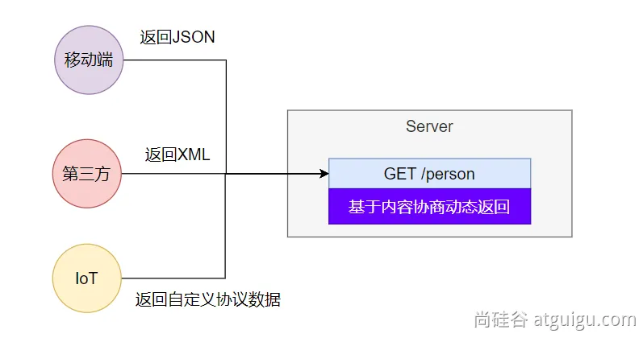

### 4.5.1 多端内容适配

**1 默认规则**

1. SpringBoot多端内容适配
   1. <span style="color:#9400D3;font-weight:bold;">基于</span><span style="color:red;font-weight:bold;">请求头</span><span style="color:#9400D3;font-weight:bold;">内容协商：（默认开启）</span>
      1. 客户端向服务端发送请求，鞋带HTTP标准的**Accept请求头**。
         1. **Accept：** `application/json`、`text/xml`、`text/yaml`
         2. 服务端根据客户端**请求头期望的数据类型**进行**动态返回**
   2. <span style="color:#9400D3;font-weight:bold;">基于</span><span style="color:red;font-weight:bold;">请求参数</span><span style="color:#9400D3;font-weight:bold;">内容协商：（需要开启）</span>
      1. 发送请求 <span style="color:red;">`GET /projects/spring-boot?format=json`</span>
      2. 匹配到<span style="color:red;">`@GetMapping("/projects/spring-boot")`</span>
      3. 根据**参数协商**，优先返回json类型数据【**需要开启参数匹配设置**】
      4. 发送请求<span style="color:red;">`GET /projects/spring-boot?format=xml`</span>，优先返回xml类型数据

**2 效果演示**

> 请求同一个接口，可以返回json和xml不同格式数据

1. 引入支持写出xml内容依赖

```xml
        <dependency>
            <groupId>com.fasterxml.jackson.dataformat</groupId>
            <artifactId>jackson-dataformat-xml</artifactId>
        </dependency>
```

2. 标注注解

```java
@JacksonXmlRootElement // 可以写出为xml文档
@Data
public class Person {
    private Long id;
    private String userName;
    private String email;
    private int age;
}
```

3. 开启基于请求参数的内容协商

```properties
# 修改内容协商方式
# 使用参数进行内容协商，默认 false
spring.mvc.contentnegotiation.favor-parameter=true
```

4. 效果

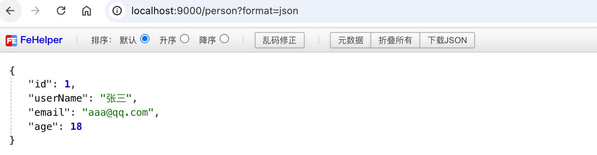

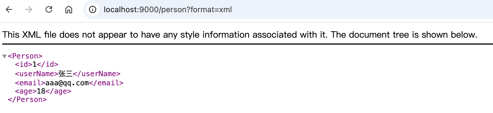

**3 配置协商规则与支持类型**

1. 修改<span style="color:red;font-weight:bold;">内容协商方式</span>

```properties
# 修改内容协商方式
# 使用参数进行内容协商，默认 false
spring.mvc.contentnegotiation.favor-parameter=true
# 自定义参数名，默认为 format
spring.mvc.contentnegotiation.parameter-name=myparam
```

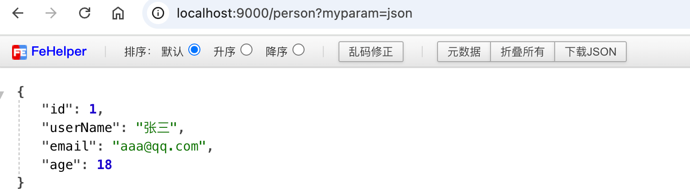

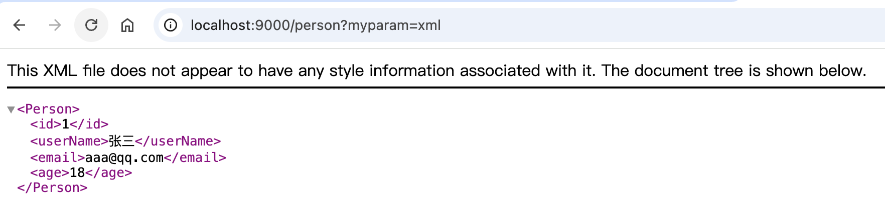

2. 大多数 MediaType 都是开箱即用的。也可以<span style="color:red;font-weight:bold;">自定义内容，如：</span>

```properties
# 自定义内容类型
spring.mvc.contentnegotiation.media-types.yaml=text/yaml
```

### 4.5.2 自定义内容返回

**1 增加yaml返回支持**

导入依赖：

```xml
        <dependency>
            <groupId>com.fasterxml.jackson.dataformat</groupId>
            <artifactId>jackson-dataformat-yaml</artifactId>
        </dependency>
```

把对象写出成YAML

```java
    public static void main(String[] args) throws JsonProcessingException {
        Person person = new Person();
        person.setId(1L);
        person.setUserName("张三");
        person.setEmail("aaa@qq.com");
        person.setAge(18);

        YAMLFactory factory = new YAMLFactory().disable(YAMLGenerator.Feature.WRITE_DOC_START_MARKER);
        ObjectMapper mapper = new ObjectMapper(factory);

        String s = mapper.writeValueAsString(person);
        System.out.println(s);
    }
```

编写配置

```properties
# 自定义内容类型
spring.mvc.contentnegotiation.media-types.yaml=text/yaml
```

增加`HttpMessageConverter`组件，专门负责把对象写出为yaml格式

```java
    @Bean
    public WebMvcConfigurer webMvcConfigurer(){
        return new WebMvcConfigurer() {
            @Override //配置一个能把对象转为yaml的messageConverter
            public void configureMessageConverters(List<HttpMessageConverter<?>> converters) {
                converters.add(new MyYamlHttpMessageConverter());
            }
        };
    }
```

**2 思考：如何增加其他**

- 配置媒体类型支持：
  - `spring.mvnc.contentnegotiation.media-types.yaml=text/yaml`
- 编写对应的 `HttpMessageConverter`，要告诉Boot这个支持的媒体类型
  - 按照3的示例
- 把 `MessageConverter` 组件加入到底层
  - 容器中放一个 `WebMvcConfigurer` 组件，并配置底层的 `MessageConverter`

**3 HttpMessageConverter的示例写法**

```java
public class MyYamlHttpMessageConverter extends AbstractHttpMessageConverter<Object> {

    private ObjectMapper objectMapper = null; //把对象转成yaml

    public MyYamlHttpMessageConverter() {
        //告诉SpringBoot这个MessageConverter支持哪种媒体类型  //媒体类型
        super(new MediaType("text", "yaml", StandardCharsets.UTF_8));
        YAMLFactory factory = new YAMLFactory()
                .disable(YAMLGenerator.Feature.WRITE_DOC_START_MARKER);
        this.objectMapper = new ObjectMapper(factory);
    }

    @Override
    protected boolean supports(Class<?> clazz) {
        //只要是对象类型，不是基本类型
        return true;
    }

    @Override  //@RequestBody
    protected Object readInternal(Class<?> clazz, HttpInputMessage inputMessage) throws IOException, HttpMessageNotReadableException {
        return null;
    }

    @Override //@ResponseBody 把对象怎么写出去
    protected void writeInternal(Object methodReturnValue, HttpOutputMessage outputMessage) throws IOException, HttpMessageNotWritableException {

        //try-with写法，自动关流
        try (OutputStream os = outputMessage.getBody()) {
            this.objectMapper.writeValue(os, methodReturnValue);
        }

    }
}
```

### 4.5.3 内容协商原理-`HttpMessageConverter`

> - `HttpMessageConverter` 怎么工作？何时工作？
> - 定制 `HttpMessageConverter` 来实现多端内容协商
> - 编写 `WebMvcConfigurer` 提供的 `configureMessageConverters` 底层，修改底层的 `MessageConverter`

**1 `@ResponseBody` 由 `HttpMessageConverter处理`** 

> 标注了 `@ResponseBody` 的返回值，将会由支持它的 `HttpMessageConverter` 协给浏览器

1. 如果 controller 方法的返回值标注了 `@ResponseBody` 注解
   1. 请求进来先到 `DispatcherServlet` 的 `doDispatch()` 进行处理
   2. 找到一个 `HandlerAdapter` 适配器。利用适配器执行目标方法
   3. `RequestMappingHandlerAdapter` 来执行，调用 `invokeHandlerMethod()` 来执行目标方法
   4. 目标方法执行之前，准备好两个东西
      1. `HandlerMethodArgumentResolver`： 参数解析器，确定目标方法每个参数值
      2. `HandlerMethodReturnValueHandler` ： 返回值处理器，确定目标方法的返回值该怎么处理
   5. `RequestMappingHandlerAdapter` 里面的 `invokeAndHandle()` 真正执行目标方法
   6. 目标方法执行完成，会返回**返回值对象**
   7. **找到一个合适的返回值处理器** `HandlerMethodReturnValueHandler`
   8. 最终找到 `RequestResponseBodyMethodProcesser` 能处理标注了 `@ResponseBody` 注解的方法。
   9. `RequestResponseBodyMethodProcessor` 调用 `writeWithMessageConverters`，利用 `MessageConverter` 把返回值写出去

> 上面解释：`@ResponseBody` 由 `HttpMessageConverter` 处理

2. `HttpMessageConverter` 会**先进行内容协商**

   1. 遍历所有的 `MessageConverter` 看谁支持这种**内容类型的数据**

   2. 默认 `MessageConverter` 有以下

      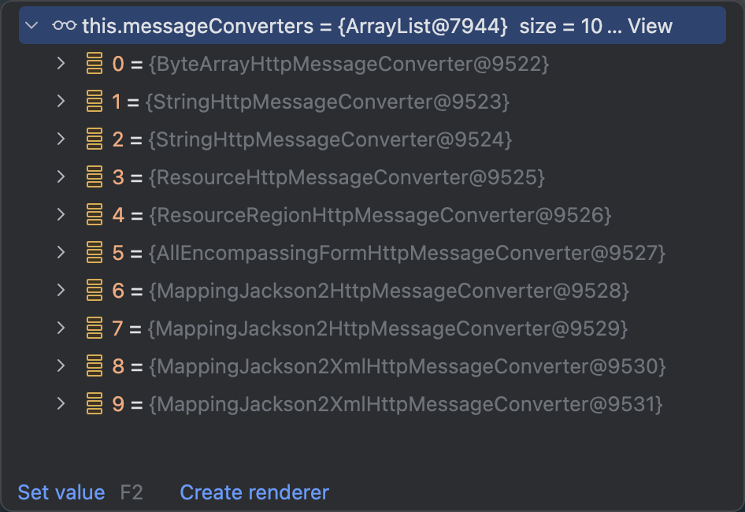

   3. 最终因为要 `json` 所以 `MappingJackson2HttpMessageConverter` 支持写出json
   4. jackson 用 `ObjectMapper` 把对象写出去

**2 `WebMvcAutoConfiguration` 提供几种默认 `HttpMessageConverters`**

- `EnableWebMvcConfiguration` 通过 `addDefaultHttpMessageConverters` 添加了默认的 `MessageConverter`；如下：
  - `ByteArrayHttpMessageConverter`：支持字节数据读写
  - `StringHttpMessageConverter`：支持字符串读写
  - `ResourceHttpMessageConverter`：支持资源读写
  - `ResourceRegionHttpMessageConverter`：支持分区资源写出
  - `AllEncompassingFormHttpMessageConverter`：支持表单 `xml/json` 读写
  - `MappingJackson2HttpMessageConverter`：支持请求响应体json读写

默认8个：

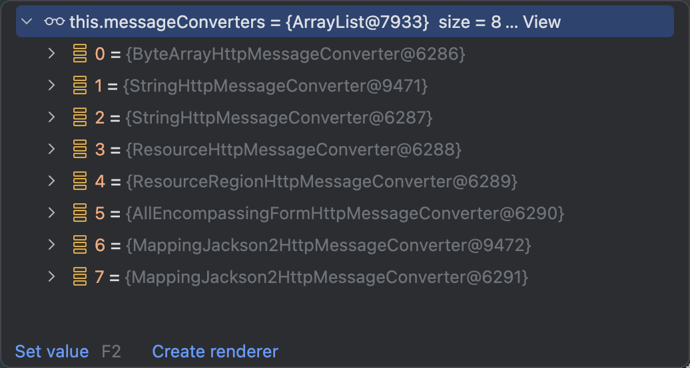

> 系统提供默认的MessageConverter功能有限，仅用于json或者普通返回数据。额外增加新的内容协商功能，必须增加新的 `HttpMessageConverter`

## 4.6 模板引擎

> - 由于 **SpringBoot** 使用了**嵌入式Servlet容器**。所以**JSP**默认是**不能使用**的。
> - 如果需要**服务端页面渲染**，优先考虑使用 <span style="color:red;">`模板引擎`</span>。

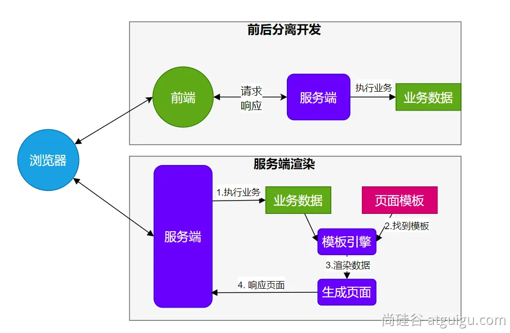

<span style="color:red;">模板引擎</span>页面默认放在<span style="color:red;">`src/main/resources/templates`</span>

**SpringBoot**包含以下模板引擎的自动配置

- FreeMarker
- Groovy
- **Thymeleaf**
- Mustache

<span style="color:#9400D3;">Themeleaf官网：</span>https://www.thymeleaf.org/

```html
```


### 4.6.1 Thymeleaf整合

```xml
        <dependency>
            <groupId>org.springframework.boot</groupId>
            <artifactId>spring-boot-starter-thymeleaf</artifactId>
        </dependency>
```

自动配置原理

1. 开启了 <span style="color:red;">`org.springframework.boot.autoconfigure.thymeleaf.ThymeleafAutoConfiguration`</span>自动配置
2. 属性绑定在 <span style="color:red;">`ThymeleafProperties`</span> 中，对应配置文件 <span style="color:red;">`spring.thymeleaf`</span> 内容
3. 所有的模板页面默认在 `classpath:/templates/` 文件夹下
4. 默认效果
   1. 所有的模板页面在 `classpath:/templates/` 下面找
   2. 找后缀名为 `.html` 的页面

### 4.6.2 基础语法

**1 核心用法**

<span style="color:#9400D3;font-weight:bold;">`th:xxx`： 动态渲染指定的 html 标签属性值、或者th指令（遍历、判断等）</span>

- `th:text`：标签体内文本值渲染
  - `th:utext`：不会转义，显示为html原本的样子。
- `th:属性`：标签指定属性渲染
- `th:attr`：标签任意属性渲染
- `th:if` `th:each` `...`：其他th指令
- 例如：

```html
<div>
    <p>你好，<span th:text="${name}"></span>！</p>
    <hr>
    th:text替换标签体的内容 <br>
    th:utext替换标签体的内容；不会转义 html 标签，真正显示未 html 该有的样子 <br>
    <h1 th:text="${msg}">哈哈，替换我？</h1>
    <h1 th:utext="${msg}">哈哈，替换我？</h1>
    <hr>
    转大写 <br>
    <h1 th:text="${#strings.toUpperCase(name)}"></h1>
    <h1 th:text="${'前缀:'+name+'后缀'}"></h1>
    <h1 th:text="|前缀:${name}后缀|"></h1>
    <hr>
    th:任意 html 属性；动态替换任意属性的值
    <br>
    th:attr: 任意属性指定
    <br>
    th:其他指令
    
</div>
```

<span style="color:#9400D3;font-weight:bold;">`表达式`：用来动态取值</span>

- **`${}`：变量取值；使用model共享给页面的值都直接用${}**
- **`@{}`：url路径；**
- `#{}`：国际化消息
- `~{}`：片段引用
- `*{}`：变量选择：需要配合 th:object 绑定对象

<span style="color:#9400D3;font-weight:bold;">`系统工具&内置对象`：</span>[详细文档](https://www.thymeleaf.org/doc/tutorials/3.1/usingthymeleaf.html#base-objects)

- `param`：请求参数对象
- `session`：session对象
- `application`：application对象
- `#execInfo`：模板执行信息
- `#messages`：国际化消息
- `#uris`：uri/url工具
- `#conversions`：类型转换工具
- `#dates`：日期工具，是 `java.util.Date` 对象的工具类
- `#calendars`：类似#dates，只不过是 `java.util.Calendar` 对象的工具类
- `#temporals`：JDK8+ `java.time` API工具类

- `#numbers`：数字操作工具
- `#strings`：字符串操作
- `#objects`：对象操作
- `#bools`：bool操作
- `#arrays`：array工具
- `#lists`：list工具
- `#sets`：set工具
- `#maps`：map工具
- `#aggregates`：集合聚合工具（sum、avg）
- `#ids`：id生成工具

**2 语法示例**

<span style="color:#9400D3;font-weight:bold;">表达式：</span>

- 变量取值：<span style="color:red;">`${…}`</span>
- url取值：<span style="color:red;">`@{…}`</span>
- 国际化消息：<span style="color:red;">`#{…}`</span>
- 变量选择：<span style="color:red;">`*{…}`</span>
- 片段引用：<span style="color:red;">`~{…}`</span>

<span style="color:#9400D3;font-weight:bold;">常见：</span>

- 文本：<span style="color:red;">`one text`</span>，<span style="color:red;">`another one!`</span>，…
- 数字：<span style="color:red;">`0`</span>，<span style="color:red;">`34`</span>，<span style="color:red;">`3.0`</span>，<span style="color:red;">`12.3`</span>，…
- 布尔：<span style="color:red;">`true`</span>、<span style="color:red;">`false`</span>
- null：<span style="color:red;">`null`</span>
- 变量名：<span style="color:red;">`one`</span>,<span style="color:red;">`sometext`</span>,<span style="color:red;">`main`</span>…

<span style="color:#9400D3;font-weight:bold;">文本操作：</span>

- 拼串：<span style="color:red;">`+`</span>
- 文本替换：<span style="color:red;">`|The name is ${name}|`</span>

<span style="color:#9400D3;font-weight:bold;">布尔操作：</span>

- 二进制运算：<span style="color:red;">`and`</span>，<span style="color:red;">`or`</span>
- 取反：<span style="color:red;">`!`</span>，<span style="color:red;">`not`</span>

<span style="color:#9400D3;font-weight:bold;">比较运算：</span>

- 比较：<span style="color:red;">`>`</span>，<span style="color:red;">`<`</span>，<span style="color:red;">`<=`</span>，<span style="color:red;">`>=`</span>，（<span style="color:red;">`gt`</span>，<span style="color:red;">`lt`</span>，<span style="color:red;">`ge`</span>，<span style="color:red;">`le`</span>）
- 等值运算：<span style="color:red;">`==`</span>，<span style="color:red;">!`=`</span>，（<span style="color:red;">`eq`</span>，<span style="color:red;">`ne`</span>）

<span style="color:#9400D3;font-weight:bold;">条件运算：</span>

- if-then：<span style="color:red;">`(if)?(then)`</span>
- if-then-else：<span style="color:red;">`(if)?(then):(else)`</span>
- default：<span style="color:red;">`(value)?:(defaultValue)`</span>

<span style="color:#9400D3;font-weight:bold;">特殊语法：</span>

- 无操作：<span style="color:red;">`_`</span>

<span style="color:#9400D3;font-weight:bold;">所有以上都可以嵌套组合：</span>

```
'User is of type ' + (${user.isAdmin()} ? 'Administrator' : (${user.type} ?: 'Unknown'))
```

### 4.6.3 属性设置

1. <span style="color:red;">`th:href="@{/product/list}"`</span>
2. <span style="color:red;">`th:attr="class=${active}"`</span>
3. <span style="color:red;">`th:attr="src=@{/images/gtvglogo.png},title=${logo},alt=#{logo}"`</span>
4. <span style="color:red;">`th:checked="${user.active}"`</span>

```html
<p th:text="${content}">原内容</p>
<a th:href="${url}">登录</a>

```

### 4.6.4 遍历

> 语法：`th:each="元素名, 迭代状态 : ${集合}"`

```html
<table class="table">
    <thead>
    <tr>
        <th scope="col">#</th>
        <th scope="col">名字</th>
        <th scope="col">邮箱</th>
        <th scope="col">年龄</th>
        <th scope="col">角色</th>
        <th scope="col">状态</th>
    </tr>
    </thead>
    <tbody>
    <tr th:each="person, stats : ${persons}">
        <th scope="row" th:text="${person.id}"></th>
        <td th:text="${person.userName}"></td>
        <td>[(${person.email})]</td>
        <td>[[${person.age}]]</td>
        <td th:text="${person.role}"></td>
        <td>
            index: [[${stats.index}]] <br>
            count: [[${stats.count}]] <br>
            size: [[${stats.size}]] <br>
            current: [[${stats.current}]] <br>
            even(true)/odd(false): 是偶数吗？[[${stats.even}]] <br>
            first: [[${stats.first}]] <br>
            last: [[${stats.last}]] <br>
        </td>
    </tr>
    </tbody>
</table>
```

iterStat有以下属性：

- index：当前遍历元素的索引，从0开始
- count：当前遍历元素的索引，从1开始
- size：需要遍历元素的总数量
- current：当前正在遍历的元素对象
- even/odd：是否偶数/奇数行
- first：是否第一个元素
- last：是否最后一个元素

### 4.6.5 判断

**`th:if`**

```html
<td th:if="${#strings.isEmpty(person.email)}" th:text="'无法联系！'"></td>
<td th:if="${not #strings.isEmpty(person.email)}">[(${person.email})]</td>
```

**`th:switch`**

```html
<td th:switch="${person.role}">
<button th:case="'admin'" type="button" class="btn btn-danger" th:text="|${person.role}/管理员|"></button>
<button th:case="'pm'" type="button" class="btn btn-primary" th:text="|${person.role}/项目经理|"></button>
<button th:case="'hr'" type="button" class="btn btn-info" th:text="|${person.role}/人事|"></button>
<!--默认选项-->
<button th:case="*" type="button" class="btn btn-dark" th:text="|${person.role}/未知岗位|"></button>
</td>
```


### 4.6.6 属性优先级

- 片段
- 遍历
- 判断

```html
<td th:if="${#strings.isEmpty(person.email)}" th:text="'无法联系！'"></td>

<tr th:each="person, stats : ${persons}" th:if="${person.age > 10}">
```

| Order | Feature          | Attributes                                                   |
| ----- | ---------------- | ------------------------------------------------------------ |
| 1     | 片段包含         | <span style="color:red;">`th:insert`</span> <span style="color:red;">`th:replace`</span> |
| 2     | 遍历             | <span style="color:red;">`th:each`</span>                    |
| 3     | 判断             | <span style="color:red;">`th:if`</span>  <span style="color:red;">`th:unless`</span> <span style="color:red;">`th:switch`</span> <span style="color:red;">`th:case`</span><span style="color:red;">`th:case`</span> |
| 4     | 定义本地变量     | <span style="color:red;">`th:object`</span> <span style="color:red;">`th:with`</span> |
| 5     | 通用方式属性修改 | <span style="color:red;">`th:attr`</span> <span style="color:red;">`th:attrprepend`</span> <span style="color:red;">`th:attrappend`</span> |
| 6     | 指定属性修改     | <span style="color:red;">`th:value`</span> <span style="color:red;">`th:href`</span> <span style="color:red;">`th:src`</span> <span style="color:red;">`...`</span> |
| 7     | 文本值           | <span style="color:red;">`th:text`</span> <span style="color:red;">`th:utext`</span> |
| 8     | 片段指定         | <span style="color:red;">`th:fragment`</span>                |
| 9     | 片段移除         | <span style="color:red;">`th:remove`</span>                  |

### 4.6.7 行内写法

<span style="color:red;">`[[...]]`</span> or <span style="color:red;">`[(…)]`</span>

```html
        <td th:if="${not #strings.isEmpty(person.email)}">[(${person.email})]</td>
        <td>[[${person.age}]]</td>
```

### 4.6.8 变量选择

```html
    <tr th:each="person, stats : ${persons}" th:if="${person.age > 10}" th:object="${person}">
        <td th:text="*{userName}"></td>
      	......
```

等同于

```html
    <tr th:each="person, stats : ${persons}" th:if="${person.age > 10}">
        <td th:text="${person.userName}"></td>
      	......
```


### 4.6.9 模板布局

- 定义模板：`th:fragment`
- 引用模板：`~{templatename::selector}`
- 插入模板：`th:insert`、`th:replace`

**common.html**

```html
<!--抽取的判断，名字叫 myheader-->
<header th:fragment="myheader"></header>
```

**index.html**

```html
<!--导航 使用公共部分进行替换-->
<!--引用方式： ~{ 模板名 :: 片段名 }-->
<div th:replace="~{common :: myheader}"></div>
```

### 4.6.10 devtools

```xml
				<!--热启动功能-->
				<dependency>
            <groupId>org.springframework.boot</groupId>
            <artifactId>spring-boot-devtools</artifactId>
            <optional>true</optional><!--表示依赖不会传递-->
        </dependency>
```

修改页面后，`⌘+F9`刷新效果；

java代码的修改，如果 `devtools` 热启动了，可能会引起一些bug，难以排查。

## 4.7 国际化

国际化的自动配置参照 `MessageSourceAutoConfiguration`

**实现步骤：**

1. SpringBoot 在类路径根下查找 <span style="color:red;">`messages`</span> 资源绑定文件。文件名为： <span style="color:red;">`messages.properties`</span>
2. 多语言可以定义多个消息文件，命名为 `messages_区域代码.properties`。如：
   1. `messages.properties`：默认
   2. `messages_zh_CN.properties`：中文环境
   3. `messages_en_US.properties`：英语环境
3. 在**程序中**可以自动注入 `MessageSource` 组件，获取国际化的配置项值
4. 在**页面中**可以使用表达式 `#{}` 获取国际化的配置项值

```java
    // 国际化取消息用的组件
    @Autowired
    private MessageSource messageSource;

    @GetMapping("/i18n")
    public String haha(HttpServletRequest request) {
        Locale locale = request.getLocale();
        // 利用代码的方式获取国际化配置文件中指定的配置项的值
        String login = messageSource.getMessage("login", null, locale);
        return login;
    }
```

## 4.8 错误处理

### 4.8.1 默认机制

> 错误处理的自动配置都在 `ErrorMvcAutoConfiguration` 中，量大核心机制：
>
> 1. SpringBoot 会<span style="color:#9400D3;font-weight:bold;">自适应</span>**处理错误**，<span style="color:#9400D3;font-weight:bold;">响应页面</span>或<span style="color:#9400D3;font-weight:bold;">JSON数据</span>
>
> 2. <span style="color:#9400D3;font-weight:bold;">SpringMVC的错误处理机制</span>依然保留，<span style="color:#9400D3;font-weight:bold;">MVC处理不了</span>，才会<span style="color:#9400D3;font-weight:bold;">交给boot进行处理</span>

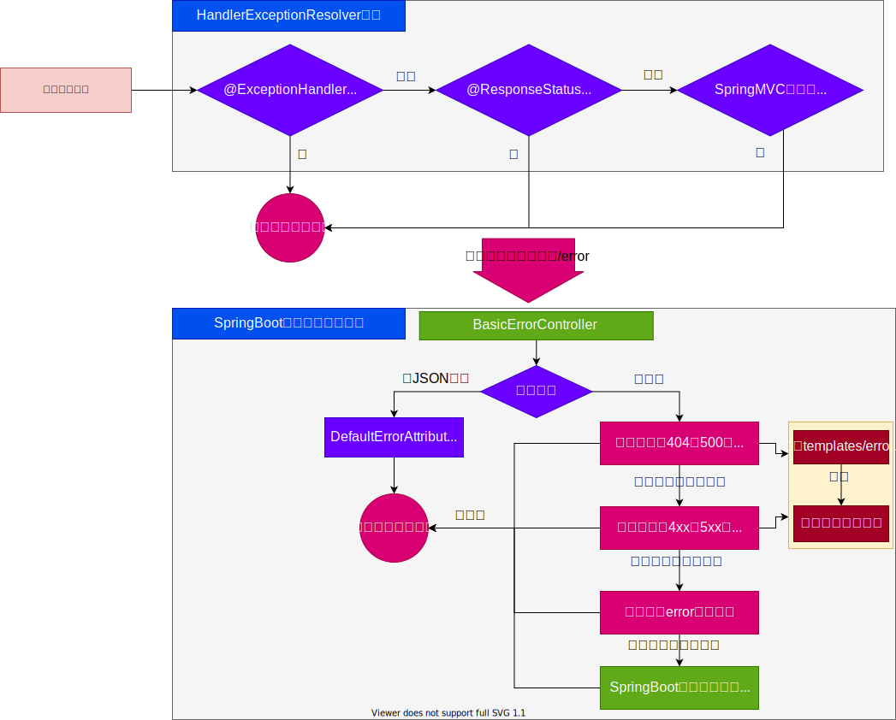

- 发生错误以后，转发给 /error 路径，SpringBoot 在底层写好一个 BasicErrorController 的组件，专门处理这个请求

```java
	@RequestMapping(produces = MediaType.TEXT_HTML_VALUE) // 返回HTML
	public ModelAndView errorHtml(HttpServletRequest request, HttpServletResponse response) {
		HttpStatus status = getStatus(request);
		Map<String, Object> model = Collections
			.unmodifiableMap(getErrorAttributes(request, getErrorAttributeOptions(request, MediaType.TEXT_HTML)));
		response.setStatus(status.value());
		ModelAndView modelAndView = resolveErrorView(request, response, status, model);
		return (modelAndView != null) ? modelAndView : new ModelAndView("error", model);
	}

	@RequestMapping // 返回 ResponseEntity，JSON
	public ResponseEntity<Map<String, Object>> error(HttpServletRequest request) {
		HttpStatus status = getStatus(request);
		if (status == HttpStatus.NO_CONTENT) {
			return new ResponseEntity<>(status);
		}
		Map<String, Object> body = getErrorAttributes(request, getErrorAttributeOptions(request, MediaType.ALL));
		return new ResponseEntity<>(body, status);
	}
```

- 错误页面是这么解析到的

```java
// 1、解析错误的自定义视图地址
		ModelAndView modelAndView = resolveErrorView(request, response, status, model);
// 2、如果解析不到错误页面的地址，默认的错误页就是 error
		return (modelAndView != null) ? modelAndView : new ModelAndView("error", model);
```

resolveErrorView 中显示会使用到 errorViewResolvers

```java
	protected ModelAndView resolveErrorView(HttpServletRequest request, HttpServletResponse response, HttpStatus status,
			Map<String, Object> model) {
		for (ErrorViewResolver resolver : this.errorViewResolvers) {
			ModelAndView modelAndView = resolver.resolveErrorView(request, status, model);
			if (modelAndView != null) {
				return modelAndView;
			}
		}
		return null;
	}
```

容器中专门有一个错误视图解析器（在 ErrorMvcAutoConfiguration 类中）

```java
		@Bean
		@ConditionalOnBean(DispatcherServlet.class)
		@ConditionalOnMissingBean(ErrorViewResolver.class)
		DefaultErrorViewResolver conventionErrorViewResolver() {
			return new DefaultErrorViewResolver(this.applicationContext, this.resources);
		}
```

SpringBoot 解析自定义错误页的默认规则（在 DefaultErrorViewResolver 类中）

```java
	@Override
	public ModelAndView resolveErrorView(HttpServletRequest request, HttpStatus status, Map<String, Object> model) {
		ModelAndView modelAndView = resolve(String.valueOf(status.value()), model);
		if (modelAndView == null && SERIES_VIEWS.containsKey(status.series())) {
			modelAndView = resolve(SERIES_VIEWS.get(status.series()), model);
		}
		return modelAndView;
	}

	private ModelAndView resolve(String viewName, Map<String, Object> model) {
		String errorViewName = "error/" + viewName;
		TemplateAvailabilityProvider provider = this.templateAvailabilityProviders.getProvider(errorViewName,
				this.applicationContext);
		if (provider != null) {
			return new ModelAndView(errorViewName, model);
		}
		return resolveResource(errorViewName, model);
	}

	private ModelAndView resolveResource(String viewName, Map<String, Object> model) {
		for (String location : this.resources.getStaticLocations()) {
			try {
				Resource resource = this.applicationContext.getResource(location);
				resource = resource.createRelative(viewName + ".html");
				if (resource.exists()) {
					return new ModelAndView(new HtmlResourceView(resource), model);
				}
			}
			catch (Exception ex) {
				// Ignore
			}
		}
		return null;
	}
```

容器中有一个默认的名为 error 的 view；提供了默认白页功能（在 ErrorMvcAutoConfiguration 类中）

```java
		@Bean(name = "error")
		@ConditionalOnMissingBean(name = "error")
		public View defaultErrorView() {
			return this.defaultErrorView;
		}
```

封装了JSON格式的错误信息

```java
	@Bean
	@ConditionalOnMissingBean(value = ErrorAttributes.class, search = SearchStrategy.CURRENT)
	public DefaultErrorAttributes errorAttributes() {
		return new DefaultErrorAttributes();
	}
```

规则：

1. **解析一个错误页**
   1. 如果发生了 `500`、`404`、`503`、`403` 这些错误
      1. 如果有**模板引擎**，默认在 `classpath:/templates/error/`**精确码.html**
      2. 如果**没有模板引擎**，在静态资源文件夹下找**精确码.html**
   2. 如果匹配不到**精确码.html**这些精确的错误页，就去找 `5xx.html`，`4xx.html` **模糊匹配**
      1. 如果有**模板引擎**，默认在 `classpath:/templates/error/`**5xx.html**
      2. 如果**没有模板引擎**，在静态资源文件夹下找**5xx.html**
2. 如果模板引擎路径 `templates` 下有 `error.html` 页面，就直接渲染

### 4.8.2 自定义错误响应

**1 自定义json响应**

> 使用 @ControllerAdvice + @ExceptionHandler 进行统一异常处理

**2 自定义页面响应**

> 根据 boot 的错误页面规则，自定义页面模板

### 4.8.3 最佳实践

- **前后分离**
  - 后台发生的所有错误，`@ControllerAdvice` + `@ExceptionHandler` 进行统一异常处理。
- **服务端页面渲染**
  - **不可预知的一些，HTTP码表示的服务器或客户端错误**
    - 给 `classpath:/templates/error/` 下面，放常用精确的错误码页面。`500.html`，`404.html`
    - 给 `classpath:/templates/error/` 下面，放通用模糊匹配的错误码页面。`5xx.html`，`4xx.html`
  - **发生业务错误**
    - **核心业务**，每一种错误，都应该代码控制，**跳转到自己定制的错误页**。
    - **通用业务**，`classpath:/templates/error.html` 页面，**显示错误信息**。

页面，JSON，可用的Model数据如下：

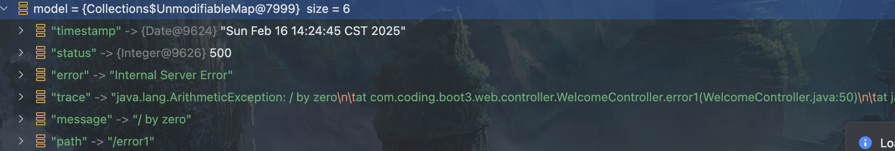

## 4.9 嵌入式容器

> **Servlet容器** 默认嵌入 Tomcat 作为Servlet容器。

### 4.9.1 自动配置原理

> - SpringBoot 默认嵌入 Tomcat 作为Servlet容器。
> - **自动配置类**是 `ServletWebServerFactoryAutoConfiguration`，`EmbeddedWebServerFactoryCustomizerAutoConfiguration`
> - 自动配置类开始分析功能。`xxxxAutoConfiguration`

```java
@AutoConfiguration(after = SslAutoConfiguration.class)
@AutoConfigureOrder(Ordered.HIGHEST_PRECEDENCE)
@ConditionalOnClass(ServletRequest.class)
@ConditionalOnWebApplication(type = Type.SERVLET)
@EnableConfigurationProperties(ServerProperties.class)
@Import({ ServletWebServerFactoryAutoConfiguration.BeanPostProcessorsRegistrar.class,
		ServletWebServerFactoryConfiguration.EmbeddedTomcat.class,
		ServletWebServerFactoryConfiguration.EmbeddedJetty.class,
		ServletWebServerFactoryConfiguration.EmbeddedUndertow.class })
public class ServletWebServerFactoryAutoConfiguration {
```

1. `ServletWebServerFactoryAutoConfiguration`自动配置了嵌入式容器场景
2. 绑定了 `ServerProperties` 配置类，所有和服务器有关的配置 `server`

3. `ServletWebServerFactoryAutoConfiguration`导入了嵌入式的三大服务器 `Tomcat`、`Jetty`、`Undertow`
   1. 导入 `Tomcat`、`Jetty`、`Undertow`都有条件注解。系统中有这个类才行（也就是到了包）
   2. 默认 `Tomcat` 配置生效。给容器中放 `TomcatServletWebServerFactory`
   3. 都给容器中 `ServletWebServerFactory`放了一个**Web服务器工厂（造Web服务器的）**
   4. **Web服务器工厂都有一个功能**，`getWebServer`获取Web服务器
   5. `TomcatServletWebServerFacroty`创建了tomcat

4. `ServletWebServerFactory`什么时候回创建`webServer`出来？

5. `ServletWebServerApplicationContext` ioc容器，启动的时候回调用创建web服务器

6. Spring**容器刷新（启动）**的时候，会预留一个时机，刷新子容器。 `onRefresh()`

   > org.springframework.context.support.AbstractApplicationContext#refresh
   >
   > ==>onRefresh()
   >
   > ==>org.springframework.boot.web.servlet.context.ServletWebServerApplicationContext#onRefresh
   >
   > ==>org.springframework.boot.web.embedded.tomcat.TomcatServletWebServerFactory#getWebServer

7. `refresh()`容器刷新**十二大步**的刷新子容器会调用 `onRefresh()`

*org.springframework.boot.web.servlet.context.ServletWebServerApplicationContext#onRefresh*

```java
	@Override
	protected void onRefresh() {
		super.onRefresh();
		try {
			createWebServer();
		}
		catch (Throwable ex) {
			throw new ApplicationContextException("Unable to start web server", ex);
		}
	}
```

> Web场景的Spring容器启动，在 onRefresh 的时候，会调用创建Web服务器的方法。
>
> Web服务器的创建是通过WebServerFactory搞定的。容器中又会根据导了什么包条件注解，启动相关的服务器配置，默认 `EmbeddedTomcat` 会给容器中放一个 `TomcatServletWebServerFactory`，导致项目启动，自动创建出Tomcat。

### 4.9.2 自定义

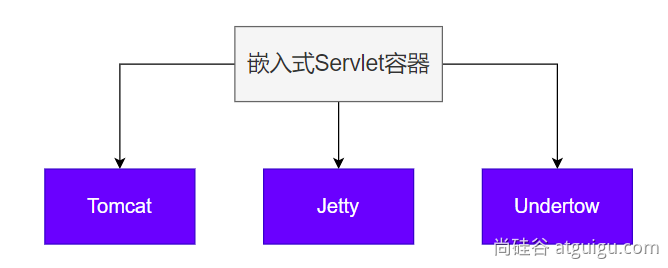

> 切换服务器；

```xml
        <dependency>
            <groupId>org.springframework.boot</groupId>
            <artifactId>spring-boot-starter-web</artifactId>
            <exclusions>
                <!--Exclude the Tomcat dependency-->
                <exclusion>
                    <groupId>org.springframework.boot</groupId>
                    <artifactId>spring-boot-starter-tomcat</artifactId>
                </exclusion>
            </exclusions>
        </dependency>
        <!--Use Jetty Instead-->
        <dependency>
            <groupId>org.springframework.boot</groupId>
            <artifactId>spring-boot-starter-jetty</artifactId>
        </dependency>
```

### 4.9.3 最佳实践

**用法：**

- 修改 `server` 下的相关配置就可以修改**服务器参数**
- 通过给容器中放一个 **`ServletWebServerFactory`**，来禁用掉 SpringBoot 默认放的服务器工厂，实现自定义嵌入**任意服务器**。

## 4.10 全面接管SpringMVC

> - SpringBoot 默认配置好了 SpringMVC 的所有常用特性。
> - 如果我们需要全面接管 SpringMVC 的所有配置并**禁用默认配置**，仅需要编写一个 `WebMvcConfigurer`配置类，并标注 `@EnableWebMvc` 即可。
> - 全手动模式
>   - `@EnableWebMvc`：禁用默认配置
>   - **`WebMvcConfigurer`**组件：定义MVC的底层行为

### 4.10.1 WebMvcAutoConfiguration到底自动配置了哪些规则

> SpringMVC自动配置场景给我们配置了如下所有**默认行为**

1. `WebMvcAutoConfiguration` web场景的自动配置类
   1. 支持 RESTful 的 filter：`HiddenHttpMethodFilter`
   2. 支持非 POST 请求，请求体携带数据：`FormContentFilter`
   3. 导入 **`EnableWebMvcConfiguration`**：
      1. `RequestMappingHandlerAdapter`
      2. `WelcomePageHandlerMapping` **欢迎页功能**支持（模板引擎目录、静态资源目录放 index.html），项目访问 `/` 就默认展示这个页面
      3. `RequestMappingHandlerMapping`：找每个请求由谁处理的映射关系
      4. `ExceptionHandlerExceptionResolver`：默认的异常解析器
      5. `LocalResolver`：国际化解析器
      6. `ThemeResolver`：主题解析器
      7. `FlashMapManager`：临时数据共享
      8. `FormattingConversionService`：数据格式化、类型转化
      9. `Validator`：数据校验 `JSR303` 提供的数据校验功能
      10. `WebBindingInitializer`：请求参数的封装与绑定
      11. `ContentNegotiationManager`：内容协商管理器
   4. **`WebMvcAutoConfigurationAdapter`**配置生效，它是一个 `WebMvcConfigurer`，定义mvc底层组件
      1. 定义好 `WebMvcConfigurer` **底层组件默认功能；所有功能详见列表**
      2. 视图解析器：`InternalResourceViewResolver`
      3. 视图解析器：`BeanNameViewResolver`，**视图名（controller方法的返回值字符串）**就是组件名
      4. 内容协商解析器：`ContentNegotiatingViewResolver`
      5. 请求上下文过滤器：`RequestContextFilter`：任意位置直接获取当前请求
      6. 静态资源链规则
      7. `ProblemDetailsExceptionHandler`：错误详情
         1. SpringMVC内部场景异常被它捕获：
   5. 定义了MVC默认的底层行为：`WebMvcConfigurer`

### 4.10.2 @EnableWebMvc禁用默认行为

1. `@EnableWebMvc`给容器中导入 `DelegatingWebMvcConfiguration`组件，他是 `WebMvcConfigurationSupport`
2. `WebMvcAutoConfiguration`有一个核心的条件注解，`@ConditionalOnMissingBean(WebMvcConfigurationSupport.class)`，容器中没有 `WebMvcConfigurationSupport`，`WebMvcAutoConfiguration`才生效。
3. `@EnableWebMvc`导入 `WebMvcConfigurationSupport` 导致 `WebMvcAutoConfiguration`失效。导致禁用了默认行为

> - @EnableWebMvc 禁用了Mvc的自动配置
> - WebMvcConfigurer定义SpringMVC底层组件的功能类

### 4.10.3 WebMvcConfigurer功能

> 定义扩展SpringMVC底层功能

| 提供方法                                                     | 核心参数                                                     | 功能                                                         | 默认                                                         |
| ------------------------------------------------------------ | ------------------------------------------------------------ | ------------------------------------------------------------ | ------------------------------------------------------------ |
| addFormatters                                                | FormatterRegistry                                            | **格式化器：**支持属性上 <span style="color:red;">`@NumberFormat`</span>和 <span style="color:red;">`@DatetimeFormat`</span>的数据类型转换 | GenericConversionService                                     |
| getValidator                                                 | 无                                                           | **数据校验：**校验Controller上使用<span style="color:red;">`@Valid`</span>标注的参数合法性。需要导入<span style="color:red;">`starter-validator`</span> | 无                                                           |
| <span style="color:red;">`addInterceptors`</span>            | InterceptorRegistry                                          | **拦截器：**拦截收到的所有请求                               | 无                                                           |
| <span style="color:red;">`configureContentNegotiation`</span> | ContentNegotiationConfigurer                                 | **内容协商：**支持多种数据格式返回。需要配合支持这种类型的<span style="color:red;">`HttpMessageConverter`</span> | 支持json                                                     |
| <span style="color:red;">`configureMessageConverters`</span> | List<span style="color:red;">`<HttpMessageConverter<?>>`</span> | **消息转换器：**标注<span style="color:red;">`@ResponseBody`</span>的返回值会利用<span style="color:red;">`MessageConverter`</span>直接写出去 | 8个，支持<span style="color:red;">`byte`</span>，<span style="color:red;">`string`</span>，<span style="color:red;">`multipart`</span>，<span style="color:red;">`resource`</span>，<span style="color:red;">`json`</span> |
| addViewControllers                                           | ViewControllerRegistry                                       | **视图映射：**直接将请求路径与物理视图映射。用于无java业务逻辑的直接视图页渲染 | 无<mvc:view-controller>                                      |
| configureViewResolvers                                       | ViewResolverRegistry                                         | **视图解析器：**逻辑视图转为物理视图                         | ViewResolverComposite                                        |
| addResourceHandlers                                          | ResourceHandlerRegistry                                      | **静态资源处理：**静态资源路径映射、缓存控制                 | ResourceHandlerRegistry                                      |
| configureDefaultServletHandling                              | DefaultServletHandlerConfigurer                              | **默认Servlet：**可以覆盖Tomcat的<span style="color:red;">`DefaultServlet`</span>。让<span style="color:red;">`DispatcherServlet`</span>拦截<span style="color:red;">`/`</span> | 无                                                           |
| configurePathMatch                                           | PathMatchConfigurer                                          | **路径匹配：**自定义URL路径匹配。可以自动为所有路径加上指定前缀，比如：<span style="color:red;">`/api`</span> | 无                                                           |
| <span style="color:red;">`configureAsyncSupport`</span>      | AsyncSupportConfigurer                                       | **异步支持：**                                               | <span style="color:red;">`TaskExecutionAutoConfiguration`</span> |
| addCorsMappings                                              | CorsRegistry                                                 | **跨域：**                                                   | 无                                                           |
| addArgumentResolvers                                         | List<span style="color:red;">`<HandlerMethodArgumentResolver>`</span> | **参数解析器：**                                             | mvc默认提供                                                  |
| addReturnValueHandlers                                       | List<span style="color:red;">`<HandlerMethodReturnValueHandler>`</span> | **返回值解析器：**                                           | mvc默认提供                                                  |
| configureHandlerExceptionResolvers                           | List<span style="color:red;">`<HandlerExceptionResolver>`</span> | 异常处理器                                                   | 默认3个；ExceptionHandlerExceptionResolver<br />ResponseStatusExceptionResolver<br />DefaultHandlerExceptionOnResolver |
| getMessageCodesResolver                                      | 无                                                           | **消息码解析器：**国际化使用                                 | 无                                                           |

## 4.11 最佳实践

> SpringBoot已经默认配置好了**Web开发**场景常用功能。我们直接使用即可。

### 4.11.1 三种方式

| 方式                                                       | 用法                                                         | 效果                                                         |
| ---------------------------------------------------------- | ------------------------------------------------------------ | ------------------------------------------------------------ |
| 全自动                                                     | 直接编写控制器逻辑                                           | 全部使用**自动默认效果**                                     |
| <span style="color:red;font-weight:bold;">手动+自动</span> | `@Configuration`+配置**`WebMvcConfigurer`**+配置<span style="color:red;">`WebMvcRegistrations`</span>，<br />注意：<span style="color:red;font-weight:bold;">不要标注`@EnableWebMvc`</span> | **保留自动配置效**<br />**手动设置部分功**<br />定义MVC底层组件 |
| 全手动                                                     | `@Configuration`+配置**`WebMvcConfigurer`**<br />注意：<span style="color:red;font-weight:bold;">需要标注`@EnableWebMvc`</span> | 禁用自动配置效果<br />**全手动设置**                         |

总结：

**给容器中写一个配置类`@Configuration`实现`WebMvcConfigurer`但是不要标注`@EnableWebMvc`注解，实现手自一体的效果**

### 4.11.2 两种模式

1. `前后分离模式`：`@RestController`响应JSON数据
2. `前后不分离模式`：`@Controller`+`Thymeleaf`模板引擎

## 4.12 Web新特性

### 4.12.1 Problemdetails

> RFC 7807：https://www.rfc-editor.org/rfc/rfc7807
>
> **错误信息**返回新格式

原理：（在WebMvcAutoConfiguration类中）

```java
	@Configuration(proxyBeanMethods = false)
// 配置过一个属性 spring.mvc.problemdetails.enabled=true
	@ConditionalOnProperty(prefix = "spring.mvc.problemdetails", name = "enabled", havingValue = "true")
	static class ProblemDetailsErrorHandlingConfiguration {

		@Bean
		@ConditionalOnMissingBean(ResponseEntityExceptionHandler.class)
		@Order(0)
		ProblemDetailsExceptionHandler problemDetailsExceptionHandler() {
			return new ProblemDetailsExceptionHandler();
		}

  }
```

1. `ProblemDetailsExceptionHandler`是一个 `@ControllerAdvice` 集中处理系统异常
2. 处理以下异常。如果系统出现以下异常，会被 SpringBoot 支持以 `RFC 7807` 规范方式返回错误数据

```java
	@ExceptionHandler({
			HttpRequestMethodNotSupportedException.class, // 请求方式不支持
			HttpMediaTypeNotSupportedException.class,
			HttpMediaTypeNotAcceptableException.class,
			MissingPathVariableException.class,
			MissingServletRequestParameterException.class,
			MissingServletRequestPartException.class,
			ServletRequestBindingException.class,
			MethodArgumentNotValidException.class,
			HandlerMethodValidationException.class,
			NoHandlerFoundException.class,
			NoResourceFoundException.class,
			AsyncRequestTimeoutException.class,
			ErrorResponseException.class,
			MaxUploadSizeExceededException.class,
			ConversionNotSupportedException.class,
			TypeMismatchException.class,
			HttpMessageNotReadableException.class,
			HttpMessageNotWritableException.class,
			MethodValidationException.class,
			AsyncRequestNotUsableException.class
		})
```

> 效果：

默认响应错误的json。状态码405

```json
{
    "timestamp": "2025-02-18T05:33:52.203+00:00",
    "status": 405,
    "error": "Method Not Allowed",
    "trace": "org.springframework.web.HttpRequestMethodNotSupportedException: Request method 'POST' is not supported\n\tat org.springframework.web.servlet.mvc.method.RequestMappingInfoHandlerMapping.handleNoMatch(RequestMappingInfoHandlerMapping.java:267)\n\tat org.springframework.web.servlet.handler.AbstractHandlerMethodMapping.lookupHandlerMethod(AbstractHandlerMethodMapping.java:441)\n\tat org.springframework.web.servlet.handler.AbstractHandlerMethodMapping.getHandlerInternal(AbstractHandlerMethodMapping.java:382)\n\tat org.springframework.web.servlet.mvc.method.RequestMappingInfoHandlerMapping.getHandlerInternal(RequestMappingInfoHandlerMapping.java:127)\n\tat org.springframework.web.servlet.mvc.method.RequestMappingInfoHandlerMapping.getHandlerInternal(RequestMappingInfoHandlerMapping.java:68)\n\tat org.springframework.web.servlet.handler.AbstractHandlerMapping.getHandler(AbstractHandlerMapping.java:509)\n\tat org.springframework.web.servlet.DispatcherServlet.getHandler(DispatcherServlet.java:1283)\n\tat org.springframework.web.servlet.DispatcherServlet.doDispatch(DispatcherServlet.java:1064)\n\tat org.springframework.web.servlet.DispatcherServlet.doService(DispatcherServlet.java:978)\n\tat org.springframework.web.servlet.FrameworkServlet.processRequest(FrameworkServlet.java:1014)\n\tat org.springframework.web.servlet.FrameworkServlet.doPost(FrameworkServlet.java:914)\n\tat jakarta.servlet.http.HttpServlet.service(HttpServlet.java:547)\n\tat org.springframework.web.servlet.FrameworkServlet.service(FrameworkServlet.java:885)\n\tat jakarta.servlet.http.HttpServlet.service(HttpServlet.java:614)\n\tat org.eclipse.jetty.ee10.servlet.ServletHolder.handle(ServletHolder.java:736)\n\tat org.eclipse.jetty.ee10.servlet.ServletHandler$ChainEnd.doFilter(ServletHandler.java:1619)\n\tat org.eclipse.jetty.ee10.websocket.servlet.WebSocketUpgradeFilter.doFilter(WebSocketUpgradeFilter.java:195)\n\tat org.eclipse.jetty.ee10.servlet.FilterHolder.doFilter(FilterHolder.java:205)\n\tat org.eclipse.jetty.ee10.servlet.ServletHandler$Chain.doFilter(ServletHandler.java:1591)\n\tat org.springframework.web.filter.RequestContextFilter.doFilterInternal(RequestContextFilter.java:100)\n\tat org.springframework.web.filter.OncePerRequestFilter.doFilter(OncePerRequestFilter.java:116)\n\tat org.eclipse.jetty.ee10.servlet.FilterHolder.doFilter(FilterHolder.java:205)\n\tat org.eclipse.jetty.ee10.servlet.ServletHandler$Chain.doFilter(ServletHandler.java:1591)\n\tat org.springframework.web.filter.FormContentFilter.doFilterInternal(FormContentFilter.java:93)\n\tat org.springframework.web.filter.OncePerRequestFilter.doFilter(OncePerRequestFilter.java:116)\n\tat org.eclipse.jetty.ee10.servlet.FilterHolder.doFilter(FilterHolder.java:205)\n\tat org.eclipse.jetty.ee10.servlet.ServletHandler$Chain.doFilter(ServletHandler.java:1591)\n\tat org.springframework.web.filter.ServerHttpObservationFilter.doFilterInternal(ServerHttpObservationFilter.java:114)\n\tat org.springframework.web.filter.OncePerRequestFilter.doFilter(OncePerRequestFilter.java:116)\n\tat org.eclipse.jetty.ee10.servlet.FilterHolder.doFilter(FilterHolder.java:205)\n\tat org.eclipse.jetty.ee10.servlet.ServletHandler$Chain.doFilter(ServletHandler.java:1591)\n\tat org.springframework.web.filter.CharacterEncodingFilter.doFilterInternal(CharacterEncodingFilter.java:201)\n\tat org.springframework.web.filter.OncePerRequestFilter.doFilter(OncePerRequestFilter.java:116)\n\tat org.eclipse.jetty.ee10.servlet.FilterHolder.doFilter(FilterHolder.java:205)\n\tat org.eclipse.jetty.ee10.servlet.ServletHandler$Chain.doFilter(ServletHandler.java:1591)\n\tat org.eclipse.jetty.ee10.servlet.ServletHandler$MappedServlet.handle(ServletHandler.java:1552)\n\tat org.eclipse.jetty.ee10.servlet.ServletChannel.dispatch(ServletChannel.java:819)\n\tat org.eclipse.jetty.ee10.servlet.ServletChannel.handle(ServletChannel.java:436)\n\tat org.eclipse.jetty.ee10.servlet.ServletHandler.handle(ServletHandler.java:469)\n\tat org.eclipse.jetty.security.SecurityHandler.handle(SecurityHandler.java:575)\n\tat org.eclipse.jetty.ee10.servlet.SessionHandler.handle(SessionHandler.java:717)\n\tat org.eclipse.jetty.server.handler.ContextHandler.handle(ContextHandler.java:1060)\n\tat org.eclipse.jetty.server.Handler$Wrapper.handle(Handler.java:740)\n\tat org.eclipse.jetty.server.handler.EventsHandler.handle(EventsHandler.java:81)\n\tat org.eclipse.jetty.server.Server.handle(Server.java:182)\n\tat org.eclipse.jetty.server.internal.HttpChannelState$HandlerInvoker.run(HttpChannelState.java:662)\n\tat org.eclipse.jetty.server.internal.HttpConnection.onFillable(HttpConnection.java:418)\n\tat org.eclipse.jetty.io.AbstractConnection$ReadCallback.succeeded(AbstractConnection.java:322)\n\tat org.eclipse.jetty.io.FillInterest.fillable(FillInterest.java:99)\n\tat org.eclipse.jetty.io.SelectableChannelEndPoint$1.run(SelectableChannelEndPoint.java:53)\n\tat org.eclipse.jetty.util.thread.QueuedThreadPool.runJob(QueuedThreadPool.java:979)\n\tat org.eclipse.jetty.util.thread.QueuedThreadPool$Runner.doRunJob(QueuedThreadPool.java:1209)\n\tat org.eclipse.jetty.util.thread.QueuedThreadPool$Runner.run(QueuedThreadPool.java:1164)\n\tat java.base/java.lang.Thread.run(Thread.java:842)\n",
    "message": "Method 'POST' is not supported.",
    "path": "/list"
}
```

开启ProblemDetails返回，使用新的MediaType

`Content-Type: application/problem+json`+ 额外扩展返回

```json
{
    "type": "about:blank",
    "title": "Method Not Allowed",
    "status": 405,
    "detail": "Method 'POST' is not supported.",
    "instance": "/list"
}
```

### 4.12.2 函数式Web

> `SpringMVC 5.2`以后允许我们使用**函数式**的方式，**定义Web的请求处理流程**。
>
> 函数式接口
>
> Web请求处理的方式：
>
> 1. `@Controller`+`@RequestMapping`：**耦合式**（**路由**、**业务**耦合）
> 2. **函数式Web**：分离式（路由、业务分离）

**1 场景**

> 场景：User RESTful - CRUD

- GET /user/1 获取1号用户
- GET /users 获取所有用户
- POST /user **请求体**鞋带JSON，新增一个用户
- PUT /user/1 **请求体**携带JSON，修改1号用户
- DELETE /user/1 **删除**1号用户

**2 核心类**

- **RouterFunction**
- **RequestPredicate**
- **ServerRequest**
- **ServerResponse**

**3 示例**

- WebFunctionConfig

```java
@Configuration
public class WebFunctionConfig {

    /**
     * 函数式Web：
     * 1、给容器中放一个Bean：类型是 RouterFunction<ServerResponse>
     * 2、每个业务准备一个自己的Handler
     * <p>
     * 核心四大对象
     * 1、RouterFunction：定义路由信息。发什么请求，谁来处理
     * 2、RequestPredicate：定义请求规则，请求谓语。请求方式（GET、POST）、请求参数
     * 3、ServerRequest：请求
     * 4、ServerResponse：响应
     */
    @Bean
    public RouterFunction<ServerResponse> userRoute(UserBizHandler userBizHandler/*这个对象会被自动注入进来*/) {
        return RouterFunctions.route() // 开始定义路由信息
                .GET("/user/{id}", RequestPredicates.accept(MediaType.ALL), userBizHandler::getUser)
                .GET("/users", userBizHandler::getUsers)
                .POST("/user", RequestPredicates.accept(MediaType.APPLICATION_JSON), userBizHandler::saveUser)
                .PUT("/user/{id}", RequestPredicates.accept(MediaType.APPLICATION_JSON), userBizHandler::updateUser)
                .DELETE("/user/{id}", userBizHandler::deleteUser).build();
    }
}

```

- UserBizHandler

```java
/**
 * 专门处理User相关的业务
 */
@Slf4j
@Service
public class UserBizHandler {

    /**
     * 查询单个用户
     *
     * @param request
     * @return
     * @throws Exception
     */
    public ServerResponse getUser(ServerRequest request) throws Exception {
        String id = request.pathVariable("id");
        log.info("获取id={}的用户信息", id);
        // 业务处理
        Person person = new Person(1L, "哈哈", "aa@qq.com", 18, "admin");
        // 构造响应
        return ServerResponse.ok().body(person);
    }

    /**
     * 获取所有用户
     *
     * @param request
     * @return
     * @throws Exception
     */
    public ServerResponse getUsers(ServerRequest request) throws Exception {
        // 业务处理
        List<Person> list = Arrays.asList(new Person(1L, "张三", "", 15, "pm"),
                new Person(2L, "李四", "ls@qq.com", 16, "pm"),
                new Person(3L, "王五", "ww@qq.com", 17, "manager"),
                new Person(4L, "赵六", "zl@qq.com", 18, "admin"),
                new Person(5L, "田七", "tq@qq.com", 19, "hr"));
        // 构造响应
        return ServerResponse.ok().body(list); // 凡是body中的对象，就是以前 @ResponseBody 原理。利用 HttpMessageConverter 写出为 json/xml/yaml 等
    }

    /**
     * 保存用户
     *
     * @param request
     * @return
     * @throws Exception
     */
    public ServerResponse saveUser(ServerRequest request) throws Exception {
        // 提取请求体
        Person person = request.body(Person.class);
        log.info("保存用户信息完成，person={}", person);
        return ServerResponse.ok().build();
    }

    /**
     * 更新用户
     *
     * @param request
     * @return
     * @throws Exception
     */
    public ServerResponse updateUser(ServerRequest request) throws Exception {
        log.info("更新用户信息完成");
        return ServerResponse.ok().build();
    }

    /**
     * 删除用户
     *
     * @param request
     * @return
     * @throws Exception
     */
    public ServerResponse deleteUser(ServerRequest request) throws Exception {
        log.info("删除用户信息完成");
        return ServerResponse.ok().build();
    }

}

```

## 4.13 常用扩展点

- 统一应答处理

```java
@RestControllerAdvice
@Slf4j
public class IgnoreResponseResolver implements ResponseBodyAdvice<Object> {}
```

- 请求参数解析

```java
@Slf4j
public class AppCacheArgumentResolver implements HandlerMethodArgumentResolver {}
```

- 统一异常处理

```java
@ControllerAdvice
@ConditionalOnMissingBean(annotation = DisableGlobalExceptionInterceptor.class)
@Slf4j
public class GlobalExceptionInterceptor {}
```

- 异步任务装饰器

```java
public class AsyncMDCTaskDecorator implements TaskDecorator {}
```

