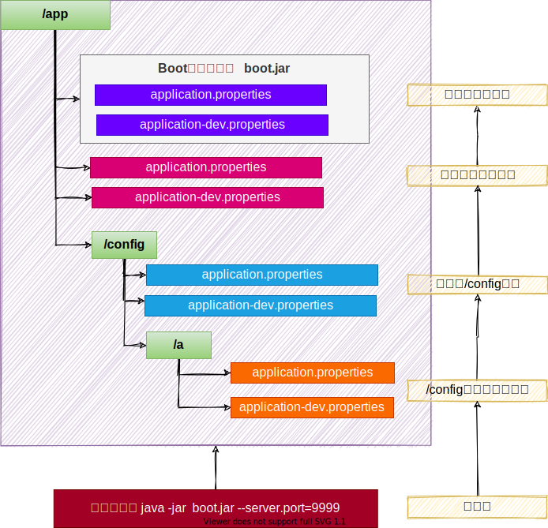

# 第6章 SpringBoot3之基础特性

## 6.1 SpringApplication

### 6.1.1 自定义banner

1. 类路径添加 <span style="color:red;">`banner.txt`</span> 或设置 <span style="color:red;">`spring.banner.location`</span> 就可以定制 banner
2. 推荐网站：[Spring Boot banner 在线生成工具，制作下载英文 banner.txt，修改替换 banner.txt 文字实现自定义，个性化启动 banner-bootschool.net](https://www.bootschool.net/ascii)

### 6.1.2 自定义SpringApplication

```java
@RestController
@SpringBootApplication
public class Boot306Application {

    public static void main(String[] args) {
        // 1、SpringApplication：Boot应用的核心API入口
//        SpringApplication.run(Boot306Application.class, args);

        // 1、自定义SpringApplication的底层设置
        SpringApplication application = new SpringApplication(Boot306Application.class);

        // 程序化调整SpringApplication的参数
        // 配置文件中的优先级，高于这里的调整优先级
        application.setBannerMode(Banner.Mode.CONSOLE);

        // 2、SpringApplication 运行起来
        application.run(args);
    }

}
```

### 6.1.3 FluentBuilder API

```java
@RestController
@SpringBootApplication
public class Boot306Application {

    public static void main(String[] args) {
        // 2、Builder方式构建SpringApplication，通过FlentAPI进行设置
        new SpringApplicationBuilder()
                .sources(Boot306Application.class)
                .bannerMode(Banner.Mode.CONSOLE)
                .run(args);
    }

}
```

## 6.2 Profiles

> 环境隔离能力；快速切换开发、测试、生产环境
>
> 步骤：
>
> 1. **标识环境：**指定哪些组件、配置在哪个环境生效
> 2. **切换环境：**这个环境对应的所有组件和配置就应该生效

### 6.2.1 使用

**1 指定环境**

- Spring Profiles提供一种**隔离配置**的方式，使其仅在**特定环境**生效；
- 任何 <span style="color:red;">`@Component`</span>，<span style="color:red;">`@Configuration`</span> 或 <span style="color:red;">`@ConfigurationProperties`</span> 可以使用 <span style="color:red;">`@Profile`</span> 标记，来指定何时被加载。【**容器中的组件**都可以被 <span style="color:red;">`@Profile`</span> 标记】

**2 环境激活**

1. 配置激活指定环境；配置文件

```properties
spring.profiles.active=production,hsqldb
```

2 也可以使用命令行激活。<span style="color:red;">`--spring.profiles.active=dev,hsqldb`</span> 或者 <span style="color:red;">`-Dspring.profiles.active=dev,hsqldb`</span>

3. 还可以配置默认环境；不标注@Profile的组件永远都存在。
   1. 以前默认环境叫 default
   2. `spring.profiles.default=test`
4. 推荐使用激活方式激活指定环境

**3 环境包含**

注意：

1. <span style="color:red;">`spring.profiles.active`</span> 和 <span style="color:red;">`spring.profiles.default`</span> 只能用到**无profile的文件**中，如果在 <span style="color:red;">`application-dev.yaml`</span>中编写就是**无效的**。

2. 也可以额外添加生效文件，而不是激活替换。比如：

```properties
# 包含指定环境，不管你激活哪一个环境，这个都要有。是总是要生效的环境
spring.profiles.include[0]=base,common
spring.profiles.include[1]=local
```

最佳实践：

- **生效的环境** = **激活的环境/默认环境** + **包含的环境**
- 项目里面这么用
  - 基础的配置 `mybatis`、`log`、`xxx`：写到**包含环境中**
  - 需要动态切换变化的 `db`、`redis`：写到**激活的环境中**


### 6.2.2 Profile分组

创建<span style="color:red;">`prod`</span>组，指定包含<span style="color:red;">`db`</span>和<span style="color:red;">`mq`</span>配置

```properties
spring.profiles.group.prod[0]=db
spring.profiles.group.prod[1]=mq
```

使用<span style="color:red;">`--spring.profiles.active=prod`</span>，就会激活<span style="color:red;">`prod`</span>，<span style="color:red;">`db`</span>，<span style="color:red;">`mq`</span>配置文件

### 6.2.3 Profile配置文件

- `application-{profile}.properties`可以作为**指定环境的配置文件**。
- 激活这个环境，**配置**就会生效。最终生效的所有**配置**是：
  - `application.properties`：主配置文件，任意时候都生效。
  - `application-{profile}.properties`：指定环境配置文件，激活指定环境生效。

profile优先级 > application

## 6.3 外部化配置

> **场景**：线上应用如何**快速修改配置**，并**应用最新配置**？
>
> - SpringBoot 使用 **配置优先级** + **外部配置** 简化配置更新、简化运维。
> - 只需要给 `jar` 应用所在的文件夹放一个 `application.properties` 最新配置文件，重启项目就能自动应用最新配置。

### 6.3.1 配置优先级

Spring Boot 允许将**配置外部化**，以便可以在不同的环境中使用相同的应用程序代码。

我们可以使用各种**外部配资源**，包括 <span style="color:red;">`Java Properties文件`</span>、<span style="color:red;">`YAML文件`</span>、<span style="color:red;">`环境变量`</span>和<span style="color:red;">`命令行参数`</span>。

<span style="color:red;">`@Value`</span>可以获取值，也可以用<span style="color:red;">`@ConfigurationProperties`</span>将所有属性绑定到<span style="color:red;">`java object`</span>中。

**以下是 SpringBoot 属性源加载顺序。**<span style="color:#9400D3;font-weight:bold;">后面的会覆盖前的值。</span><span style="color:#9400D3;">由低到高，高优先级配置覆盖低优先级配置</span>

1. <span style="color:#9400D3;font-weight:bold;">默认属性</span>（通过 <span style="color:red;">`SpringApplication.setDefaultProperties` </span>指定的）
2. <span style="color:red;">`@PropertySource`</span>指定加载的配置（需要写在<span style="color:red;">`@Configuration`</span>类才可生效）
3. <span style="color:#9400D3;font-weight:bold;">配置文件（`application.properties/yml`等）</span>
4. <span style="color:red;">`RandomValuePropertySource`</span>支持的<span style="color:red;">`random.*`</span>配置（如：`@Value("${random.int}")`)
5. OS 环境变量
6. Java 系统属性（<span style="color:red;">`System.getProperties()`</span>）
7. JNDI 属性（来自<span style="color:red;">`java.comp/env`</span>）
8. <span style="color:red;">`ServletContext`</span> 初始化参数
9. <span style="color:red;">`ServletConfig`</span> 初始化参数
10. <span style="color:red;">`SPRING_APPLICATION_SJON`</span>属性（内置在环境变量或系统属性中的 JSON）
11. <span style="color:#9400D3;font-weight:bold;">命令行参数</span>
12. 测试属性。（<span style="color:red;">`@SpringBootTest`</span>进行测试时指定的属性）
13. 测试类<span style="color:red;">@TestPropertySource</span>注解
14. Devtools设置的全局属性。（<span style="color:red;">`$HOME/.config/spring-boot`</span>）

> 结论：配置可以写到很多为止，常见的优先级顺序：
>
> - `命令行` > `配置文件` > `SpringApplication配置`

<span style="color:#9400D3;font-weight:bold;">配置文件优先级</span>如下：（**后面覆盖前面**）

1. **jar 包内**的<span style="color:red;">`application.properties/yml`</span>
2. **jar 包内**的<span style="color:red;">application-{profile}.properties/yml</span>
3. **jar 包外**的<span style="color:red;">application.properties/yml</span>
4. **jar 包外**的<span style="color:red;">application-{profile}.properties/yml</span>

**建议：用一种格式的配置文件。如果<span style="color:red;">`.properties`</span>和<span style="color:red;">`.yml`</span>同时存在，则.properties优先。**

> 结论：`包外 > 包内`；同级情况：`profile配置` > `application配置`

<span style="color:#9400D3;font-weight:bold;">所有参数均可由命令行传入，使用 `–参数项=参数值`，将会被添加到环境变量中，并优先于 `配置文件`。比如： java -jar app.jar --name="Spring"，可以使用 `@Value("${name}")` 获取</span>


演示场景：

- 包内：application.properties `server.port=8000`
- 包内：application-dev.properties `server.port=9000`
- 包外：application.properties `server.port=8001`
- 包外：application-dev.properties `server.port=90001`

启动端口？：命令行 > `9001` > `8001` > `9000` > `8000`

### 6.3.2 外部配置

SpringBoot 应用启动时会自动寻找 `application.properties` 和 `application.yaml` 位置，进行加载。顺序如下：（**后面覆盖前面**）

1. 类路径：内部
   1. 类根路径
   2. 类下 `config` 包
2. 当前路径（项目所在的位置）
   1. 当前路径
   2. 当前下 `/config` 子目录
   3. `/config` 目录的直接子目录

------

最终效果：优先级由高到低，前面覆盖后面

- 命令行 > 包外config直接子目录 > 包外config目录 > 包外根目录 > 包内目录
- 同级比较：
  - profile配置 > 默认配置
  - properties配置 > yaml配置

------



规律：最外层的最优先。

- 命令行 > 所有
- 包外 > 包内
- config目录 > 根目录
- profile > application

配置不同就都生效（互补），配置相同高优先级覆盖低优先级

### 6.3.3 导入配置

使用 <span style="color:red;">`spring.config.import`</span> 可以导入额外配置

```properties
spring.config.import=my.properties
my.property=value
```

无论以上写法的先后顺序，导入的<span style="color:red;">`my.properties`</span>的值总是优先于直接在配置文件中编写的<span style="color:red;">`my.property`</span>。

### 6.3.4 属性占位符

配置文件中可以使用 <span style="color:red;">`${name.default}`</span> 形式取出之前配置过的值。

```properties
app.name=MyApp
app.description=${app.name} is a Spring Boot application written by ${username:Unknown}
```

## 6.4 单元测试-JUnit5

### 6.4.1 整合

SpringBoot提供一系列测试工具集及注解方便我们进行测试。

<span style="color:red;">`spring-boot-test`</span>提供核心测试能力，<span style="color:red;">`spring-boot-test-autoconfigure`</span>提供测试的一些自动配置。我们只需要导入<span style="color:red;">`spring-boot-starter-test`</span>即可整合测试。

```java
        <dependency>
            <groupId>org.springframework.boot</groupId>
            <artifactId>spring-boot-starter-test</artifactId>
            <scope>test</scope>
        </dependency>
```

<span style="color:red;">spring-boot-starter-test</span>默认提供了以下库供我们测试使用。

- [JUnit5](https://junit.org/junit5/)
- [Spring Test](https://docs.spring.io/spring-framework/docs/6.0.4/reference/html/testing.html#integration-testing)
- [AssertJ](https://assertj.github.io/doc/)
- [Hamcrest](https://github.com/hamcrest/JavaHamcrest)
- [Mockito](https://site.mockito.org/)
- [JSONassert](https://github.com/skyscreamer/JSONassert)
- [JsonPath](https://github.com/json-path/JsonPath)

### 6.4.2 测试

**1 组件测试**

直接 `@Autowired` 容器中的组件进行测试。

**2 注解**

JUnit5的注解与JUnit4的注解有所变化

https://junit.org/junit5/docs/current/user-guide/#writing-tests-annotations

- **@Test：**表示方法是测试方法。但是与JUnit4的@Test不同，他的职责非常单一不能声明任何属性，拓展的测试将会由Jupiter提供额外测试。
- **@ParameterizedTest：**表示方法是参数化测试，下方会有详细介绍。
- **@RepeatedTest：**表示方法可重复执行，下方会有详细介绍。
- **@DisplayName：**为测试类或者测试方法设置展示名称。
- **@BeforeEach：**表示在每个单元测试之前执行。
- **@AfterEach：**表示在每个单元测试之后执行。
- **@BeforeAll：**表示在所有单元测试之前执行。
- **@AfterAll：**表示在所有单元测试之后执行。
- **@Tag：**表示单元测试类别，类似于JUnit4中的@Categories。
- **@Disabled：**表示测试类或测试方法不执行，类似于JUnit4中的@Ignore。
- **@Timeout：**表示测试方法运行如果超过了指定时间将会返回错误。
- **@ExtendWith：**为测试类或测试方法提供扩展类引用。

```java
import static org.junit.jupiter.api.Assertions.fail;
import static org.junit.jupiter.api.Assumptions.assumeTrue;

import org.junit.jupiter.api.AfterAll;
import org.junit.jupiter.api.AfterEach;
import org.junit.jupiter.api.BeforeAll;
import org.junit.jupiter.api.BeforeEach;
import org.junit.jupiter.api.Disabled;
import org.junit.jupiter.api.Test;

class StandardTests {

    @BeforeAll
    static void initAll() {
    }

    @BeforeEach
    void init() {
    }

    @DisplayName("😱")
    @Test
    void succeedingTest() {
    }

    @Test
    void failingTest() {
        fail("a failing test");
    }

    @Test
    @Disabled("for demonstration purposes")
    void skippedTest() {
        // not executed
    }

    @Test
    void abortedTest() {
        assumeTrue("abc".contains("Z"));
        fail("test should have been aborted");
    }

    @AfterEach
    void tearDown() {
    }

    @AfterAll
    static void tearDownAll() {
    }

}
```

**3 断言**

| 方法                                               | 说明                                      |
| -------------------------------------------------- | ----------------------------------------- |
| assertEquals                                       | 判断两个对象或两个原始类型是否相等。      |
| assertNotEquals                                    | 判断两个对象或两个原始类型是否不相等      |
| assertSame                                         | 判断两个对象引用是否指向同一个对象        |
| assertNotSame                                      | 判断两个对象引用是否指向不同的对象        |
| assertTrue                                         | 判断给定的布尔值是否为true                |
| assertFalse                                        | 判断给定的布尔值是否为false               |
| assertNull                                         | 判断给定的对象引用是否为null              |
| assertNotNull                                      | 判断给定的对象引用是否不为null            |
| <span style="color:blue;">assertArrayEquals</span> | <span style="color:blue;">数组断言</span> |
| <span style="color:blue;">assertAll</span>         | <span style="color:blue;">组合断言</span> |
| <span style="color:blue;">assertThrows</span>      | <span style="color:blue;">异常断言</span> |
| <span style="color:blue;">数组断言</span>          | <span style="color:blue;">超时断言</span> |
| <span style="color:blue;">fail</span>              | <span style="color:blue;">快速失败</span> |

**4 嵌套测试**

> JUnit 5可以通过 Java 中的内部类和 @Nested 注解实现嵌套测试，从而可以更好的把相关的测试方法组织在一起。在内部类中可以使用 @BeforeEach 和 @AfterEach 注解，而且嵌套的层次没有限制。

```java
@DisplayName("A stack")
class TestingAStackDemo {

    Stack<Object> stack;

    @Test
    @DisplayName("is instantiated with new Stack()")
    void isInstantiatedWithNew() {
        new Stack<>();
    }

    @Nested
    @DisplayName("when new")
    class WhenNew {

        @BeforeEach
        void createNewStack() {
            stack = new Stack<>();
        }

        @Test
        @DisplayName("is empty")
        void isEmpty() {
            assertTrue(stack.isEmpty());
        }

        @Test
        @DisplayName("throws EmptyStackException when popped")
        void throwsExceptionWhenPopped() {
            assertThrows(EmptyStackException.class, stack::pop);
        }

        @Test
        @DisplayName("throws EmptyStackException when peeked")
        void throwsExceptionWhenPeeked() {
            assertThrows(EmptyStackException.class, stack::peek);
        }

        @Nested
        @DisplayName("after pushing an element")
        class AfterPushing {

            String anElement = "an element";

            @BeforeEach
            void pushAnElement() {
                stack.push(anElement);
            }

            @Test
            @DisplayName("it is no longer empty")
            void isNotEmpty() {
                assertFalse(stack.isEmpty());
            }

            @Test
            @DisplayName("returns the element when popped and is empty")
            void returnElementWhenPopped() {
                assertEquals(anElement, stack.pop());
                assertTrue(stack.isEmpty());
            }

            @Test
            @DisplayName("returns the element when peeked but remains not empty")
            void returnElementWhenPeeked() {
                assertEquals(anElement, stack.peek());
                assertFalse(stack.isEmpty());
            }
        }
    }
}
```

**5 参数化测试**

参数化测试是JUnit5很重要的一个新特性，它使得用不同的参数多次运行测试成为了可能，也为我们的单元测试带来许多便利。

利用 `@ValueSource` 等注解，指定入参，我们将可以使用不同的参数进行多次单元测试，而不需要每新增一个参数就新增一个单元测试，省去了很多冗余代码。

**`@ValueSource`**：为参数化测试指定入参来源，支持八大基础类以及String类型，Class类型。

**`@NullSource`**：表示为参数化测试提供一个null的入参。

**`@EnumSource`**：表示为参数化测试提供一个枚举入参。

**`@CsvFileSource`**：表示读取指定CSV文件内容作为参数化测试入参。

**`@MethodSource`**：表示读取指定方法的返回值作为参数化测试入参（注意方法返回需要是一个流）。

```java
@ParameterizedTest
@ValueSource(strings = {"one", "two", "three"})
@DisplayName("参数化测试1")
public void parameterizedTest1(String string) {
    System.out.println(string);
    Assertions.assertTrue(StringUtils.isNotBlank(string));
}


@ParameterizedTest
@MethodSource("method")    //指定方法名
@DisplayName("方法来源参数")
public void testWithExplicitLocalMethodSource(String name) {
    System.out.println(name);
    Assertions.assertNotNull(name);
}

static Stream<String> method() {
    return Stream.of("apple", "banana");
}
```


