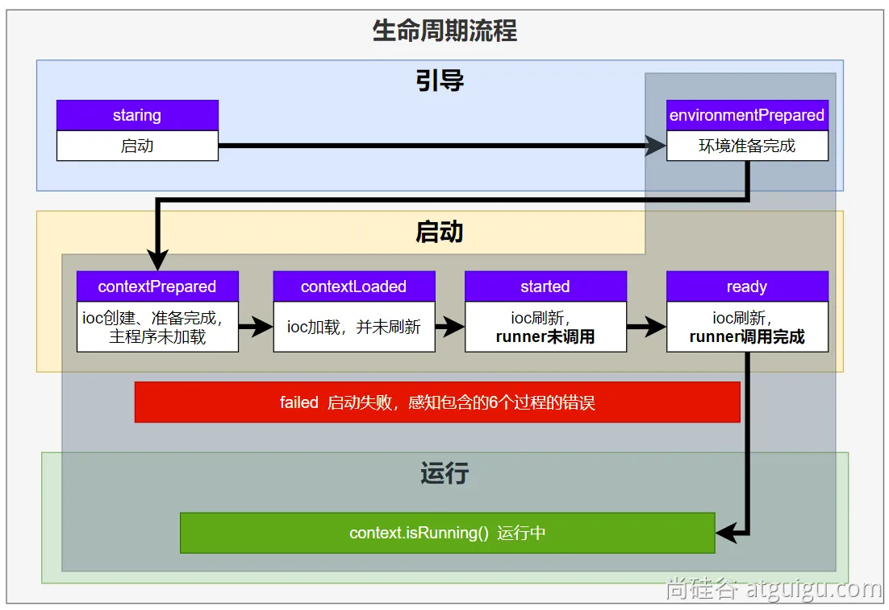
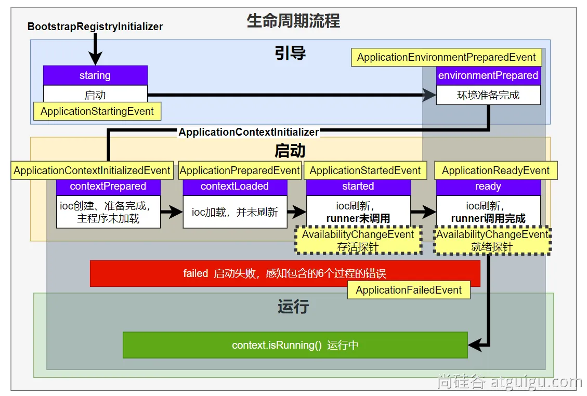
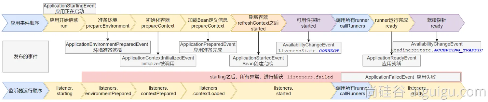
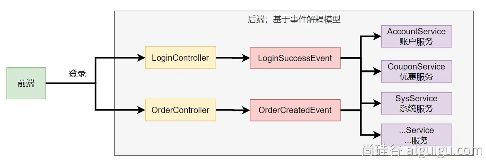
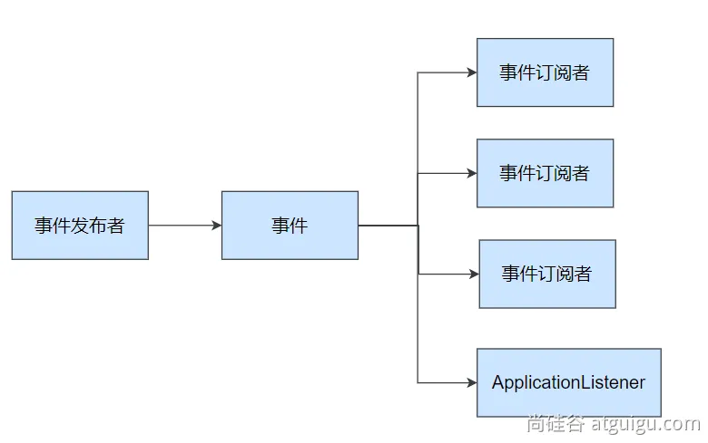
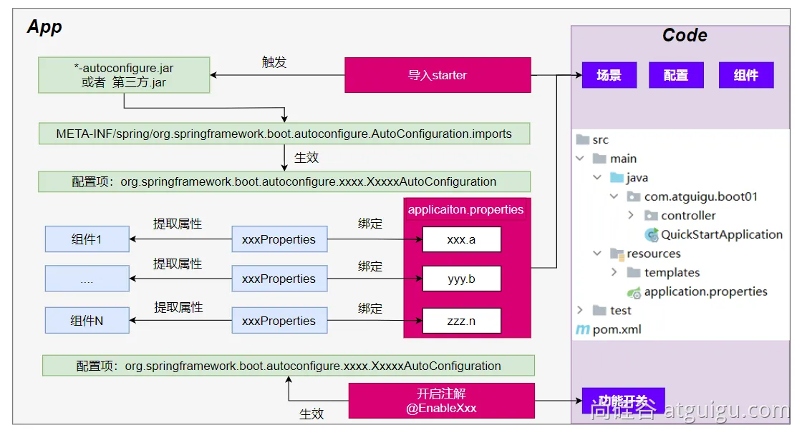

# 第7章 SpringBoot3之核心原理

## 7.1 事件和监听器

### 7.1.1 生命周期监听

场景：监听**应用**的<span style="color:red;font-weight:bold;">生命周期</span>

#### 1 监听器-SpringApplicationRunListener

1. 自定义 <span style="color:red;font-weight:bold;">`SpringApplicationRunListener`</span> 来**监听事件**

   1. 编写<span style="color:red;font-weight:bold;">`SpringApplicationRunListener`</span> **实现类**
   2. 在 <span style="color:red;font-weight:bold;">`META-INF/spring.factories`</span> 中配置 <span style="color:red;font-weight:bold;">`org.springframework.boot.SpringApplicationRunListener=自己的Listener`</span>，还可以指定一个 **有参构造器**，接受两个参数 <span style="color:red;font-weight:bold;">`（SpringApplication application, String[] args)`</span>
   3. SpringBoot 在 <span style="color:red;font-weight:bold;">`spring-boot.jar`</span> 中配置了默认的 Listener，如下

   <span style="color:#9400D3;font-weight:bold;">`org.springframework.boot.SpringApplicationRunListener=\`</span><span style="color:blue;font-weight:bold;">`org.springframework.boot.context.event.EventPublishingRunListener`</span>

   <span style="color:#FFD700;font-weight:bold;">注意：这里的EventPublishingRunListener负责在生命周期钩子执行之前，先触发对应的SpringApplicationEvent事件。</span>
   
   ```java
   /**
    * SpringBoot应用生命周期监听
    * Listener先要从 META-INF/spring.factories 读到
    * 1、引导：利用 BootstrapContext 引导整个项目启动
    * starting：应用开始，SpringApplication的run方法一调用，只要有了 BootstrapContext 就执行
    * environmentPrepared：环境准备好（把启动参数等绑定到环境变量中），但是IOC还没有创建【调一次】
    * 2、启动：
    * contextPrepared：IOC容器创建并准备好，但是sources（主配置类）尚未加载，并关闭引导上下文；组件并未创建。【调一次】
    * contextLoaded： IOC容器已经被加载。主配置加载进去了，但是IOC容器还没刷新（我们的bean没有创建）。
    * ==========截止以前，ioc容器里面还没造bean呢==========
    * started：IOC容器刷新了（所有bean造好了），但是 runner 没调用。
    * ready：IOC容器刷新了（所有bean造好了），所有 runner 调用完了
    * 3、运行
    * 如果以前步骤都正确执行，代表容器 running
    */
   
   ```

#### 2 生命周期全流程



### 7.1.2 事件触发时机

#### 1 各种回调监听器

- `BootstrapRegistryInitializer`：<span style="color:#9400D3;font-weight:bold;">感知特定阶段：</span>感知**引导初始化**
  - <span style="color:red;font-weight:bold;">`创建引导上下文 bootstrapContext 的时候触发`</span>
  - <span style="color:red;font-weight:bold;">`META-INF/spring.factories`</span>
  - `application.addBootstrapRegistryInitializer()`
  - <span style="color:red;font-weight:bold;">`场景：进行密钥校对授权。`</span>
  
- `ApplicationContextInitializer`：<span style="color:#9400D3;font-weight:bold;">感知特定阶段：</span>感知ioc容器初始化
  - <span style="color:red;font-weight:bold;">`environmentPrepared之后、contextPrepared之前 的时候触发`</span>
  - <span style="color:red;font-weight:bold;">`META-INF/spring.factories`</span>
  - `application.addInitializers()`

- <span style="color:#9400D3;font-weight:bold;">`ApplicationListener：`感知全阶段：基于事件机制，感知事件。一旦到了哪个阶段可以做别的事</span>
  - <span style="color:red;font-weight:bold;">`META-INF/spring.factories`</span>
  - `@Bean`或`@EventListener`：`事件驱动`
  - `SpringApplication.addListeners(...)`或 `SpringApplicationBuilder.listeners(...)`

- <span style="color:#9400D3;font-weight:bold;">`SpringApplicationRunListener：`感知全阶段生命周期+各种阶段都能自定义操作；功能更完善。</span>
  - <span style="color:red;font-weight:bold;">`META-INF/spring.factories`</span>
- <span style="color:#9400D3;font-weight:bold;">`ApplicationRunner：`感知特定阶段：感知应用就绪Ready。卡死应用，就不会就绪。</span>
  - `@Bean`
- <span style="color:#9400D3;font-weight:bold;">`CommandLineRunner：`感知特定阶段：感知应用就绪Ready。卡死应用，就不会就绪。</span>
  - `@Bean`

最佳实战：

- 如果项目启动前做事：`BootstrapRegistryInitializer`和`ApplicationContextInitializer`
- 如果想要在项目启动完成后做事：<span style="color:#9400D3;font-weight:bold;">`ApplicationRunner`和`CommandLineRunner`</span>
- <span style="color:#9400D3;font-weight:bold;">如果要干涉生命周期做事：`SpringApplicationRunListener`</span>
- <span style="color:#9400D3;font-weight:bold;">如果想要用事件机制：`ApplicationListener`</span>

#### 2 完整触发流程

**9 大事件** 触发顺序&时机

1. `ApplicationStartingEvent`：应用启动但未做任何事情，除过注册listeners and initializers。
2. `ApplicationEnvironmentPreparedEvent`：Environment准备好，但context未创建。
3. `ApplicationContextInitializedEvent`：ApplicationContext准备好，ApplicationContextInitializers调用，但是任何bean未加载。
4. `ApplicationPreparedEvent`：容器刷新之前，bean定义信息加载。
5. `ApplicationStartedEvent`：容器刷新完成，runner未调用。

==========以下就开始插入了**探针机制**==========

6. `AvailabilityChangeEvent`：`LivenessState.CORRECT`应用存活；**存活探针**
7. `ApplicationReadyEvent`：任何runner被调用
8. `AvailabilityChangeEvent`：`ReadinessState.ACCEPTING_TRAFFIC`**就绪探针**，可以接请求。
9. `ApplicationFailedEvent`：启动出错



应用事件发送顺序如下：

感知应用是否**存活**了：可能植物状态，虽然活着但是不能处理请求。

应用是否**就绪**了：能响应请求，说明确实活的比较好。

#### 3 SpringBoot事件驱动开发

> **应用启动过程生命周期事件感知（9大事件）、应用运行中事件感知（无数种）**。

- **事件发布：**`ApplicationEventPublisherAware`或`注入：ApplicationEventMulticaster`
- **事件监听：**`组件 + @EventListener`





> 事件发布者

```java
@Service
public class EventPublisher implements ApplicationEventPublisherAware {

    /**
     * 底层发送事件用的组件，SpringBoot会通过ApplicationEventPublisherAware接口自动注入给我们
     * 事件是广播出去的。所有监听这个事件的监听器都可以收到
     */
    ApplicationEventPublisher applicationEventPublisher;

    /**
     * 所有事件都可以发
     * @param event
     */
    public void sendEvent(ApplicationEvent event) {
        //调用底层API发送事件
        applicationEventPublisher.publishEvent(event);
    }

    /**
     * 会被自动调用，把真正发事件的底层组组件给我们注入进来
     * @param applicationEventPublisher event publisher to be used by this object
     */
    @Override
    public void setApplicationEventPublisher(ApplicationEventPublisher applicationEventPublisher) {
        this.applicationEventPublisher = applicationEventPublisher;
    }
}
```

> 事件订阅者

```java
@Service
public class CouponService {

    @Order(1)
    @EventListener
    public void onEvent(LoginSuccessEvent loginSuccessEvent){
        System.out.println("===== CouponService ====感知到事件"+loginSuccessEvent);
        UserEntity source = (UserEntity) loginSuccessEvent.getSource();
        sendCoupon(source.getUsername());
    }

    public void sendCoupon(String username){
        System.out.println(username + " 随机得到了一张优惠券");
    }
}
```

## 7.2 自动配置原理

### 7.2.1 入门理解

> 应用关注的**三大核心：场景、配置、组件**

#### 1 自动配置流程



1. 导入 `starter`
2. 依赖导入 `autoconfigure`
3. 寻找类路径下 `META-INF/spring/org.springframework.boot.autoconfigure.AutoConfiguration.imports`文件
4. 启动，加载所有 `自动配置类` `xxxAutoConfiguration`
   1. 给容器中配置**功能**`组件`
   2. `组件参数`绑定到 `属性类`中。`xxxProperties`
   3. `属性类` 和 `配置文件` 前缀项绑定
   4. `@Contional派生的条件注解`进行判断**是否组件生效**
5. 效果：
   1. 修改配置文件，修改底层参数
   2. 所有场景自动配置好直接使用
   3. 可以注入SpringBoot配置好的组件随时使用

#### 2 SPI机制

> - <span style="color:red;font-weight:bold;">Java中的SPI（Service Provider Interface）是一种软件设计模式，用于</span><span style="color:blue;font-weight:bold;">在应用程序中动态地发现和加载组件</span>。**SPI的思想**是，定义一个接口或抽象类，然后通过在classpath中定义实现该接口的类来实现对组件的动态发现和加载。
> - SPI的主要目的是解决在应用程序中使用可插拔组件的问题。例如，一个应用程序可能需要使用不同的日志框架或数据库连接池，但是这些组件的选择可能取决于运行时的条件。通过使用SPI，应用程序可以在运行时发现并加载适当的组件，而无需在代码中硬编码这些组件的实现类。
> - 在Java中，**SPI**的实现方式是通过在 `META-INF/services` 目录下创建一个以服务接口全限定名为名字的文件，文件中包含实现该服务接口的类的全限定名。当应用程序启动时，Java的SPI机制会自动扫描 classpath 中的这些文件，并根据文件中指定的类名来加载实现类。
> - 通过使用SPI，应用程序可以实现更灵活、可扩展的架构，同时也可以避免硬编码依赖关系和增加代码的可维护性。
>
> 以上回答来自 `ChatGPT-3.5`

#### 3 功能开关

- 自动配置：全部都配置好，什么都不用管。自动批量导入
  - 项目一启动，SPI文件中指定的所有都加载。
  - `@EnableXXX`：手动控制哪些功能的开启；手动导入。
    - 开启xxx功能
    - 都是利用 @import 把此功能要用的组件导入进去

### 7.2.2 进阶理解

#### 1 @SpringBootApplication

**1.1 @SpringBootConfiguration**

就是：@Configuration，容器中的组件，配置类。spring ioc启动就会加载创建这个类对象。


**1.2 @EnableAutoConfiguration**

**1.2.1 @AutoConfigurationPackage：**扫描主程序包：加载自己的组件

- 利用 `@Import(AutoConfigurationPackages.Registrar.class)` 想要给容器中导入组件。
- 把主程序所在的**包**的所有组件导入进来。
- **为什么SpringBoot默认只扫描主程序所在的包及其子包**

**1.2.2 @Import(AutoConfigurationImportSelector.class)：加载所有自动配置类：加载starter导入的组件**

```java
		List<String> configurations = ImportCandidates.load(AutoConfiguration.class, getBeanClassLoader())
			.getCandidates();
```

> 扫描SPI文件：`META-INF/spring/org.springframework.boot.autoconfigure.AutoConfiguration.imports`


**1.3 @ComponentScan**

> 组件扫描：排除一些组件（哪些不要）
>
> 排除前面已经扫描进来的 `配置类` 和 `自动配置类`。

```java
@ComponentScan(excludeFilters = { @Filter(type = FilterType.CUSTOM, classes = TypeExcludeFilter.class),
      @Filter(type = FilterType.CUSTOM, classes = AutoConfigurationExcludeFilter.class) })
```


#### 2 完整启动加载流程

> 生命周期启动加载流程


## 7.3 自定义starter

> 场景：**抽取聊天机器人场景，它可以打招呼。**
>
> 效果：任何项目导入此 `starter` 都具有打招呼功能，并且**问候语**中的**人名**需要可以在**配置文件**中修改。

1. 创建 `自定义starter` 项目，引入 <span style="color:red;">`spring-boot-starter`</span> 基础依赖
2. 编写模块功能，引入模块所有需要的依赖。
3. 编写 `xxxAutoConfiguration` 自动配置类，帮其他项目导入这个模块需要的所有组件
4. 编写配置文件 <span style="color:red;"> `META-INF/spring/org.springframework.boot.autoconfigure.AutoConfiguration.imports`</span> 指定启动需要加载的自动配置
5. 其他项目引入即可使用


### 7.3.1 业务代码

> 自定义配置有提示。导入以下依赖重启项目，再写配置文件就有提示

```java
@Data
@ConfigurationProperties(prefix = "robot")
@Component
public class RobotProperties {
    private String name;
    private String age;
    private String email;
}
```

```xml
        <!--生成配置元数据<spring-configuration-metadata.json>，
            从 @ConfigurationProperties 注释生成自己的配置元数据文件，辅助yml配置时自动提示 -->
        <dependency>
            <groupId>org.springframework.boot</groupId>
            <artifactId>spring-boot-configuration-processor</artifactId>
            <optional>true</optional><!--表示依赖不会传递-->
        </dependency>
```

### 7.3.2 基本抽取

- 创建 starter 项目，把公共代码需要的所有依赖导入
- 把公共代码复制过来
- 自己写一个 `RobotAutoConfiguration`，给容器中导入这个场景需要的所有组件
  - 为什么这些组件默认不会被扫描进去？
  - **starter所在的包和引入她的项目的主程序所在的包不是父子层级**
- 别人引用这个`starter`，直接导入这个 `RobotAutoConfiguration`，就能把这个场景的组件导入进来

- 功能生效
- 测试编写配置文件

### 7.3.3 使用@EnableXXX机制

```java
@Retention(RetentionPolicy.RUNTIME)
@Target({ElementType.TYPE})
@Documented
@Import(RobotAutoConfiguration.class)
public @interface EnableRobot {
}
```

别人引入`starter`需要使用 `@EnableRobot`开启功能  

### 7.3.4 完全自动配置

- 依赖SpringBoot的SPI机制
- <span style="color:red;">`META-INF/spring/org.springframework.boot.autoconfigure.AutoConfiguration.imports`</span> 文件中编写好我们自动配置类的全类名即可
- 项目启动，自动加载我们的自动配置类

# 附录：SpringBoot3改变及新特性

1、**自动配置包位置变化**

```
META-INF/spring/org.springframework.boot.autoconfigure.AutoConfiguration.imports
```

2、**jakata api迁移**

- **`druid`**有问题

3、**新特性** - **函数式Web**、**ProblemDetails**

**4、GraalVM 与 AOT**

**5、响应式编程全套**

6、剩下变化都是版本升级，意义不大


